# 2024B站最值得看的黑客教程 ｜ 网络安全／渗透测试／内网渗透／漏洞挖掘／web安全／kali linux／红队靶场／CTF／信息安全 - P108：远程桌面的形式 - 网络安全免费学 - BV1uBsTetEow

可以，那你要远程桌面的形式，对不对？那有那必须要符合什么条件。第一个啊，对方。电脑。开启。3389端口。对不对？第二个知道对方电脑的账号密码是吧。对不对？有这两个条件就可以了，对不对？

必须要给他开启这个软程桌面，还要知道对方电脑账号密码啊，我们才能。😊，干嘛？通过这种远程桌面形式控制，对不对？那现在我们也不知道开没开，也不知道这个电脑的密码。啊。

接下来我们就要搞定这个电脑的4389跟它的密码，对不对？接下来我们搞一下，首先怎么去查看这个电脑开没开。哎，其实我们用这个命令net state杠ANO啊。😊，这个命令呢就是查看什么。

查看本我们的当前这个电脑是吧，开了哪个端口。😊，黑车来，我们来看一下这里有没有3389呢？是不是没有啊，是不是只有1个3306。所以这台电脑本身人家是没有开远程桌面的对吧？

所以呢我们需要给它开启远程桌面。那么开启远程桌面的命令是什么呢？😊，来，就是这个命令啊，这个是修改注册表啊，大家不用管为什么啊，这就是一条黑客命令。这个命令只要在电脑上一执行。

就可以把对方的远程桌面直接给它打开啊。所以我们在这里直接复制进来回车。好，这里就操作完成了。好，我们紧接着再去查看一下它的端口开放情况。😊，来看是不是3389是不是已经打开了啊。

所以这台电脑现在3389打开了。好，那我们远程桌面连接一下对方电脑192。168。111。128。好，我们连一下，我们发现这里还是连不上连不上的原因是什么啊，这里给大家说一下啊，就是什么啊，对方开启了。

😊，防火墙。哎，所以我们还必须远程把对方的防火墙给它关掉，你看对不对？好，那接下来我们就要去开启防火墙。好，那怎么开启防火墙呢？哎，我们先去查看一下它的防火墙是否开启。😊。

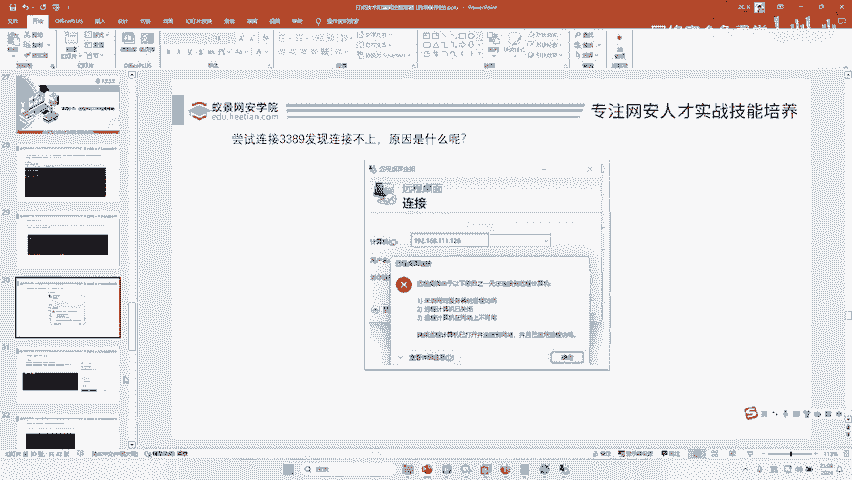

哎，我们把这个命令呢先干完呢，哎，先复制到这里来啊。😊。

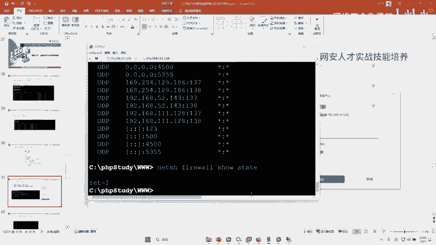

好，这句明这句划命令是不是查看这个防火墙信息。OK我们在这里复制进来回车。😊。

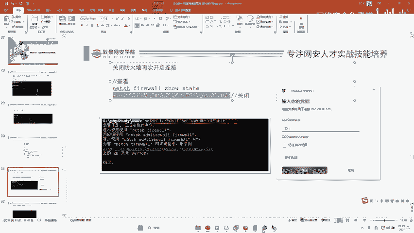

啊，如果说你们复制的时候，对不对？哎，出现这样的情况，这什么情况呢？这个就是你复制的时候出现问题了，对不对？我们手敲一遍，对不对？手敲一遍啊。😊。

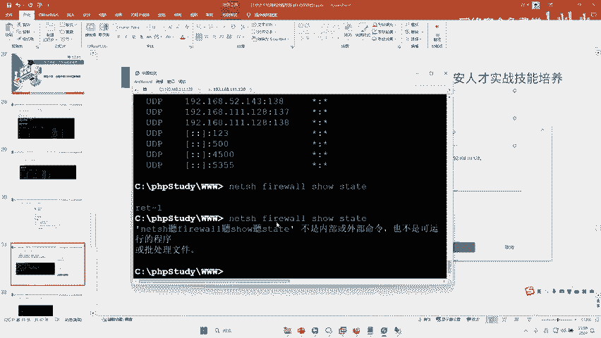

好，NETSH对吧？FIREWAL。

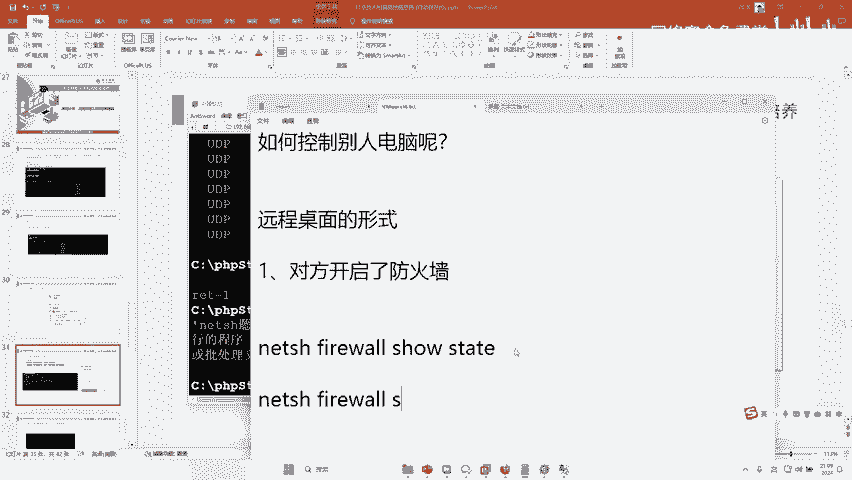

有。好，我们手敲一遍啊。回车好，我们可以看到当前这个防火墙是不是启用状态，操作模式是不是启用启用启用启用防火墙是不是启用了。哎，那我们还接下来干嘛呢？必须给他什么把防火墙关掉，防火墙关掉，哎。

就用这个命令。

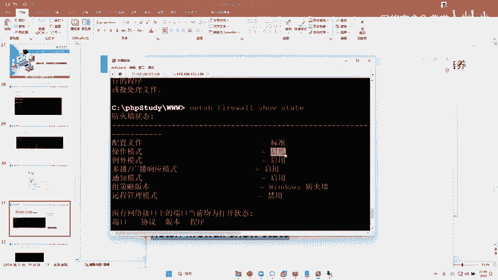

哎，你看也就说这个为什么这样，你先不用管啊，你就知道这就命令可以把房屋墙关掉，对不吧？哈，设成Dableable，Dcable就关闭啊。😊，所以说啊，这里又不行，对吧？我们还得手敲一遍啊。

这个原因就是说复制的时候有问题啊，这字体的原因啊。😊。

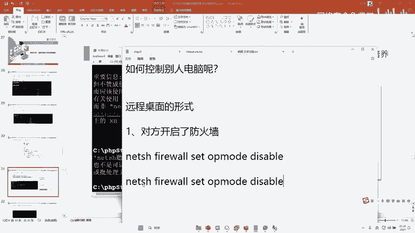

好，我们手敲余。好，检查一遍。OK啊我来复进来。😊，哎，你看是不是确定成功了。哎，成功之后，我们再去查看一下防火墙状态。😊，可以看到里面是不是模式是不是已经禁入了。好。

那么现在对方的这个应该就可以连上了，对不对？好，我们点击连接。😊，点击连接是不是已经成功了？那这里还有一个大问题，OK那它的密码是多少呢？密码是多少？同白，你们知道吗？密码是多少呢？

也就说我知道红日SEC1。于9，那是你呀，你是对吧？你那你肯定知道，对吧？对啊，对于黑客来说肯定不知道，他你鸟的密码是多少呢啊，我只知道当前这个。😡，这个电脑当前是什么？啊，这个账号那密码是多少？

我不知道呀。😮，不知道怎么办啊。😡。

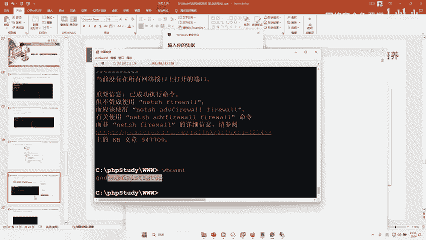

哎，我们找出来就行了，对不对？好，接下来哎我们用这句话去找。😊，好，你说哎这句话什么意思啊，先不用管，好吧。😊，啊。有没有人知道哎，这个就这个就来了，对不对？好，这句话什么意思？

这句话是利用Mimi cat去调取操作系统的。😊，lessice内存去查看它less进程里面内存的存储密码啊，这是它的原理。当然这个原理要讲清楚啊，得花多久啊，把这句话要给你讲明白，最少要花4个小时。

所以。对不对？我不能给你讲明白。对不对啊啊，这句话要给你讲明白，得用4个小时，但是没有关系，李哥给你讲了1个SAM还记得不有没有人在上上几则训练营听过我讲课，我讲过一个远程关闭女神电脑时候。

讲过1个SAM文件。😊，对不对啊，那个也可以破密嘛，对不对啊？😊，好，当然那个。也可以用这种方式也可以。那接下来我们就要用minmica把这个密码给它破解出来。那怎么破解啊？非常简单，我们得先找到啊。

李哥给你找的minmica啊，这个mimica可能这个嗯没有见了啊，我在这里再搜一下我电脑上的minmica啊。😊，好，我们来给大家再一步一步操作啊。这个工具可能你们没有下载到，对吧？那下课之后啊。

我给它传到这个网盘里面，对吧？好。😊，好，把这个工具呢。好，先拖到桌面来，对不对？

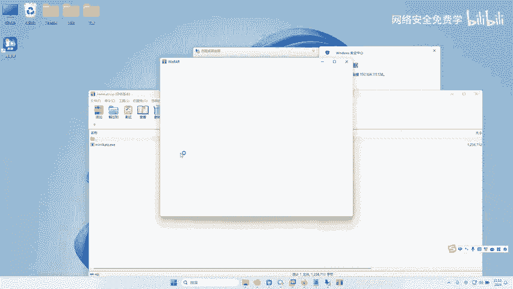

把这个工具拖出来。好，然后干嘛呢？然后通过我们的引键。啊，哎，把这个工具右键上传文件，对不对？把这个猕猴桃给它传上去。好，那这个破解密码，这个找密码，这个工具就被传到对方电脑，对不对？好，那然后干嘛呢？

紧接着运行李哥给你的这句话啊。运行这个工具啊，飞车来接下来就能看到这个电脑的密码了。哎，我们来找一下啊。😊。

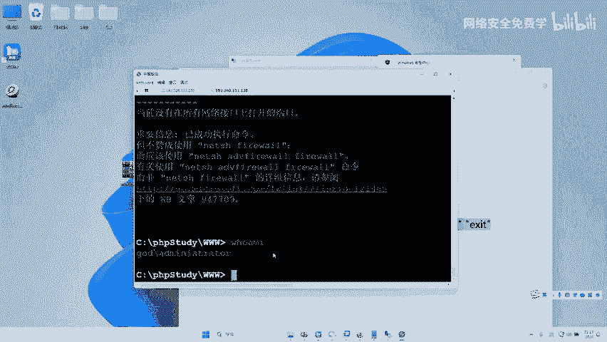

看能不能找到密码啊。来。往这里看。找到了吗？好，这个域名的密码是多少？来域名多少多少来着？是不是找到了？好好，那接下来是不是就手拿把掐下来呀，那我是登进去了呀，对不对啊？😊，是不是找到这个密码了？

没有问题吧啊。好。😊，来登一下好吧。

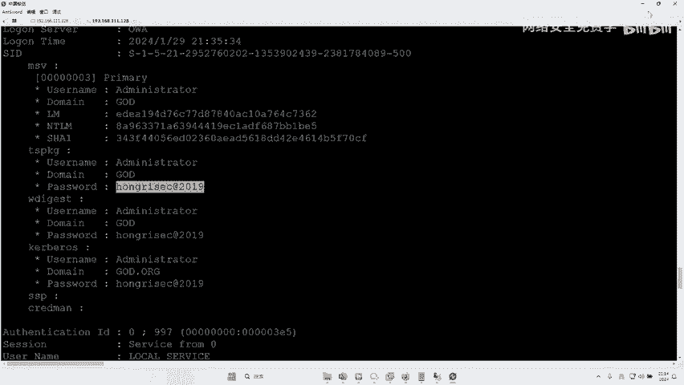

来输入密码确定。

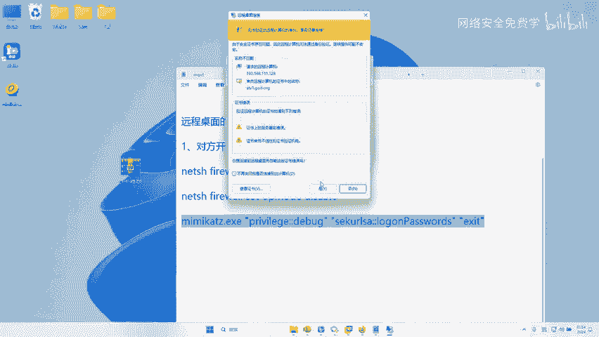

见证奇迹的时候了。是。兄弟们看到底能不能给他搞进去啊。好，我们要稍作等待啊，看这个欢迎这个界面啊，得给它转多久啊，这个可能需要转一下时间啊。😊。

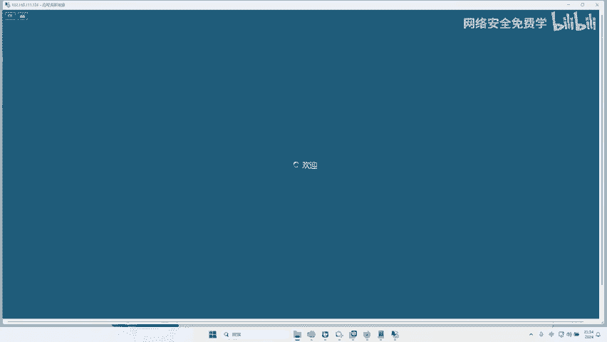

我们等它慢慢转掉，对不对啊？那么到此为止，你看我们是不是登进去了，再次输入，你看但要破密码，哎，然后搞一下，是不是就进去了啊，看进去了没有？😊。

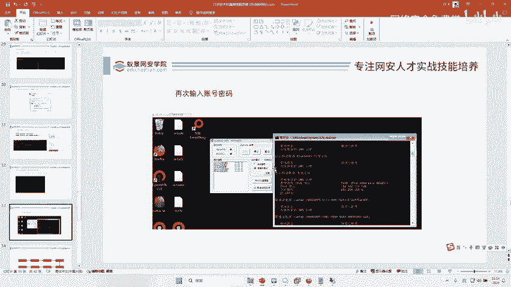

进去了没有？小伙伴们来看一下进去了没？进了没？

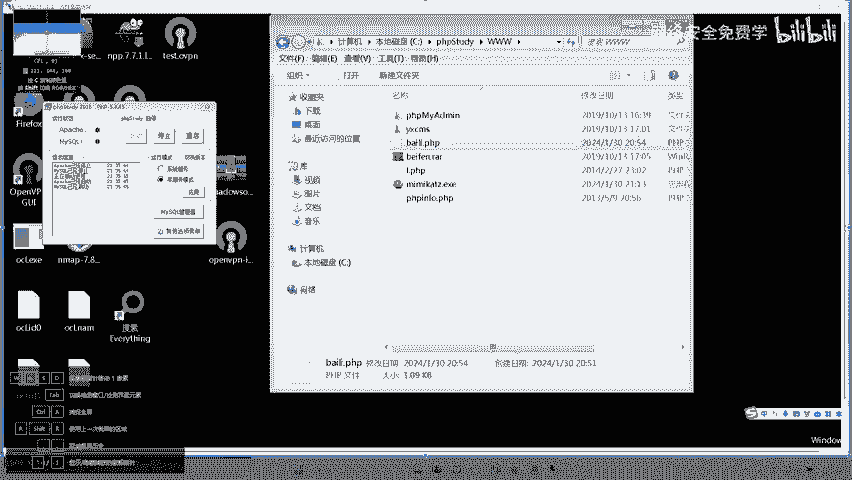

远程桌面这个电脑。是不是直接给他搞进去了？

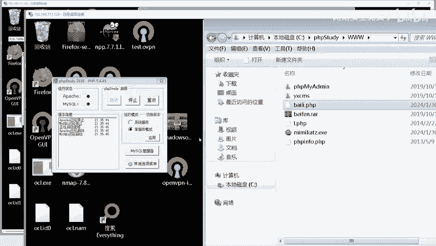

那你在这里操作它不舒服吗？啊，这不是跟你的电脑一样吗？啊，操嘎嘎想说啥想啥，对吧？这就是你的电脑了，对不对？😊，好，那我这里再问一个问题。哎，人说李哥，那还有一个问题，那是这个你是公网。

如果是内网怎么办啊？如果这台电脑啊，我是通过钓鱼进去了，人家公司不是公网啊，是在人家家里，你开3389也没用啊，有没有人知道。😡，有没有这种情况，大家知不知道我说的什么意思？知道的话扣个一。

就说如果说这台电脑人家在公网在那个内网里面。😡，他跟你黑客根本连不上。这时候你怎么办？比如说你的电脑，我想通过这种方式控制啊，不行啊，就算你开了3389，我也连不上你啊。😊，哎。

那你觉得这东西能难倒我吗？难不倒我啊，这个时候需要借助什么，需要借助什么给大家解释啊解释一下，好吧，不要FRP啊。😊，需要接触到这几个工具啊，向日葵。勾图。KTV。2。等。就要用到远程控制。

因为你的电脑。它是可以出网的，明白吗？就跟你不知道有没有一些VIP学员，对不对？很多VIP学员遇到问题的时候，我们这边老师会给你远远程控制你的电脑，然后给你配环境，就跟这一样的那我只要把你电脑控制了。

我通过这种一键悄悄的给你装一个to desk，然后我直接知道你的联机密码，我直接就直接登进去了，是不是？😊，对不对？这不是远程桌面啊，这个向日葵跟go to aP to desk，这个叫远程控制。

远控远控啊，像这个我们这种形式叫远程桌面，远程桌面必须要什么相互访问啊，那to desk就不用了，对吧？你们相互在内网都行，对吧？所以说啊兵来将挡，水来土掩啊，这个内网的环境复杂啊。

那如果说你的电脑根本都不出网，那么我们还要找跳板，对不对？所以没有任何情况。

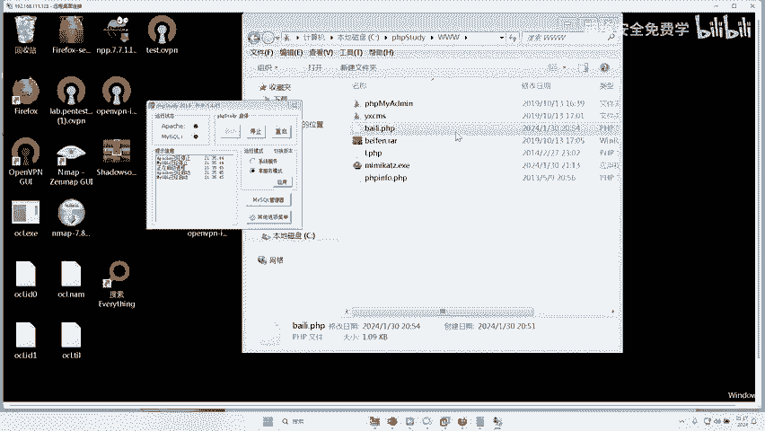

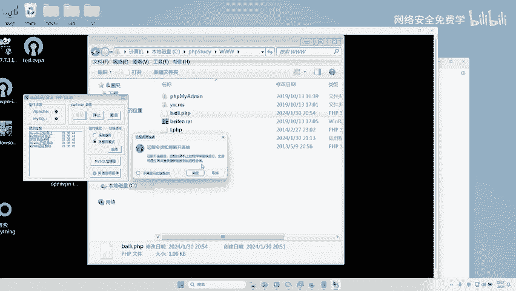

我们接些做安全人都遇到过，那么不同情况我们都会有不同的对应的方法，理解吗？啊，所以路漫漫其修远期，大家还需要学习，对吧？那么今天你只要掌握这个开启防火墙的形式就可以了。对不对？好。

那这里再给大家我们来看一下我们今天的这个攻击流程到底是否一样。来，还记得昨天李哥给你讲的没？入侵一个企业的流程是什么？第一步是不是新收集？那么今天我们入侵这个企业是不是用到了新收集。

我们用到了端口扫描IP扫描，对不对啊，扫描完了之后呢，网上搜一下，哎，然后开始利用漏洞了，对不对？利用漏洞就一步一步一步一步干嘛呢？是不是把这个电脑控制下来了？好，那这里问题来了。

我说了下一步是不是要提全了呀，那现在还需要提全吗？😊。

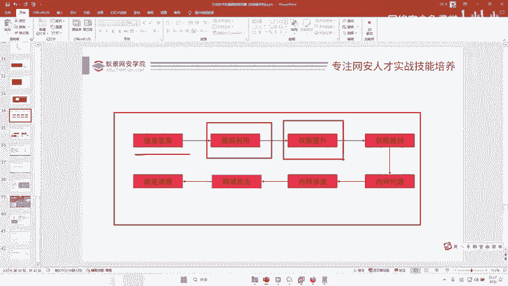

是不是就不需要大家说一下啊，按照这个流程来说，现在还需要提全吗？需要提全吗？不需要提权，为什么？因为你当前控制这个电脑的权限就是最高的啦了，对不对？最高权限了，你都能给他开防火墙关防火墙了。

那你的权限已经很高了，对吧？普通人的电脑，像我们的电脑是没有办法开防火墙关防火墙了，对不对啊？如果说你不能该开放墙，关防墙给它破密码，对不对？我都可以看到它内存密码了，肯定是最高权限了。

所以不需要做这个权限提升了啊，所以这个就略过了，对不对？好，那这个权限维持要不要做。😡，啊，维持什么意思？维持什么意思？好，那我们现在是不是通过什么？

通过当前李哥给你提供的这个我们黑客入侵的这个网页白里点PGP控制的这个电脑。那假如说有一天。😡。

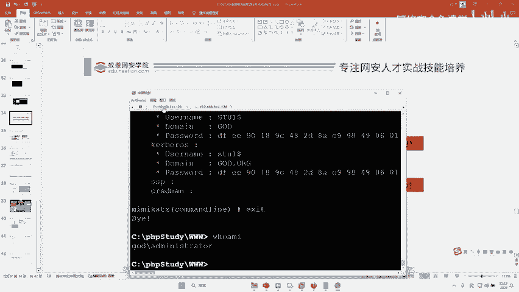

这个黑这个人这个网站的管理人员发现了你这个木马，白了件PPP人家给你删了，那你是不是机了，人家把自己的网站PP my我的命的漏洞修复了，你是不是完蛋了呀，对不对？所以说在这里我们最好还要做一个维持。

那么针对于这个网站怎么去维持呢？是不是非常简单啊？我们可以在不同的页面里面再买几个木马，对吧？我们在这个index里面对对？打开给它编辑一下。😊，是不是在这里面。编辑这个文件对不对？好，编辑这个文件。

我们可以多编辑几个文件，对不对？在不同的文件里面，对不对？再去买几个木马，哎，这怎么编辑不了呢？😊，好，双击我们把木马是不是写到这里面，我们你可以在每一个文件里面都写个木马，那这样的话删都删不完。

是不是你可以写一写免纱嘛，写一些什么东西，对不对？都可以。那么这个权限维持的方法有很多啊，光讲权限维持这个技术啊，就可以讲40个小时啊，所以说你要学的话，对不是一两两天能学懂了，对不对啊。

那么后面这些跨域内网渗透内网代理，哎，这个内网代理我们就需要了，对不对？因为它是双网卡。😊，所以你看我们这个攻击打靶场啊，完全是按照这个路线图来的，对不对？所以说大家比章法不能乱。😡，理解吗？哎。

理解吗？理解没有？理解了吗？扣个一，今天听爽了没有？听爽了给李博扣个一啊，听明白了也扣个一好不好？我统计一下大家，看大家到底听明白没有？没有听明白的这个笔记我会发给大家的，对不对？会整理的。

专门整理的啊，我向公司申请的，对不对？这个录播我也给你好不好？😊，因为我觉得因为我为什么会给大家录播？其实我我是非常感激大家了，大家两天我操，每天都是几百人在线，好吧，都没有迟到的，基本上都来了。😊。

真的我觉得不错，最起码有一颗报纸热爱学习的态度啊，那这个我就不能辜负你们，对不对？好，我觉得今天讲的是非常清楚易懂的，对不对？😊，清楚易懂的对不对？也给大家扩展了一些思路哈。😊。

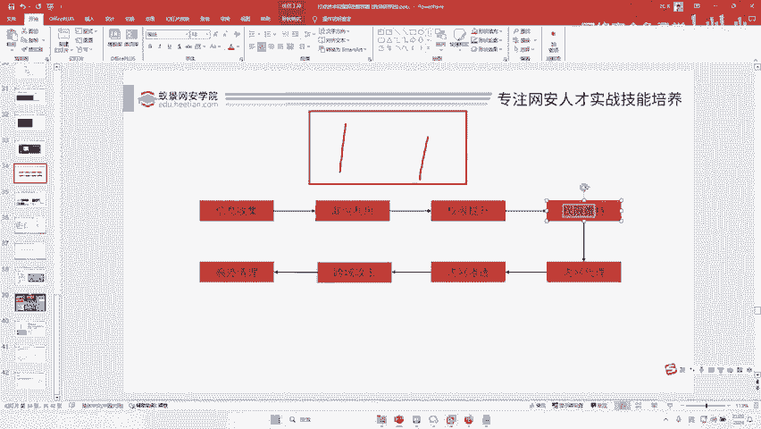