# 2024B站最值得看的黑客教程 ｜ 网络安全／渗透测试／内网渗透／漏洞挖掘／web安全／kali linux／红队靶场／CTF／信息安全 - P109：内网靶场的调试和安装 - 网络安全免费学 - BV1uBsTetEow

内网的靶场调试跟安装，对不对？好，什么叫内网的靶场调试跟安装呢？哎，非常简单，对不对？好，因为我们知道呀，对不对？这个靶场搭建我们第一天的时候已经搭建了，对不对啊？第一搭建就怎么去搭建外部，对吧？

怎么去搭建这个预控啊，我其实带着大家已经把这个靶场给它还原了，对不对？那接下来就要什么？把这个域给它调通，对吧？因为我们现在还没有把预调通，没有调通域的话，就等于说你只是把机器的IP备好了。

但是机器的内部的一些交流啊，就是什么？就我们之前讲的域是什么，是班主任对不对啊？班主任这个。😊。

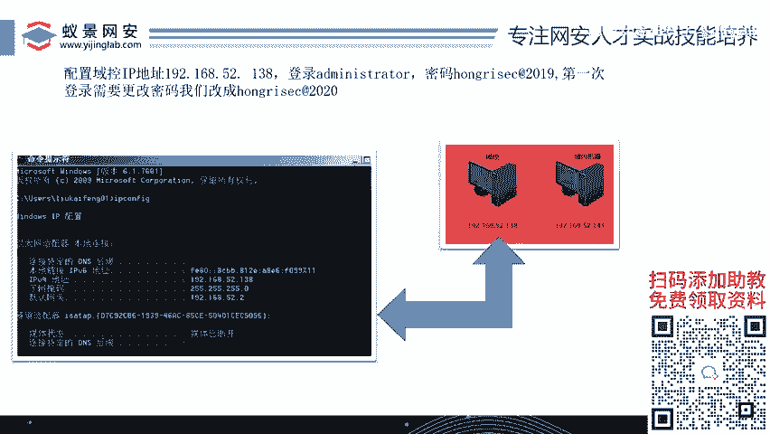

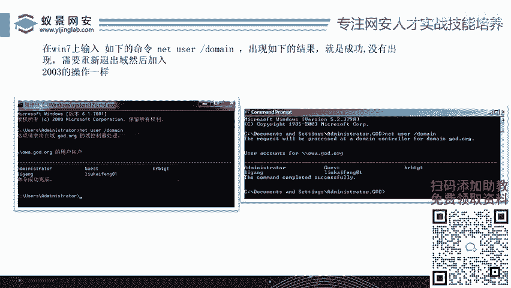

带着学生嘛，对吧？我们只是说哎把班主任放到了教室，对不对？把学生放到了教室。那么这个时候呢，班主任跟学生还不认识，对吧？我们得让这个班主任跟学生熟悉起来啊，把这个内网这些这个什么网络呀，调通调通之后。

我们才能更好的去渗透，对不对？好，所以今天的第一步就是干嘛呢？就是先把我们的这个调通，那怎么调，其实非常简单，就改个IP重启一下电脑就可以了，对不对啊？其实只要你按照我第一天把这两个东西搭建了就可以了。

所以我们之前说了，对不对？对于一个内网来说。😊，哎，它最重要是哪个是这个预控啊，所以预控要给他开机，这个we部服务器也要给他开机。这个域内主机呢啊也也给他开机啊，都给三台机器都给他开机。😊。

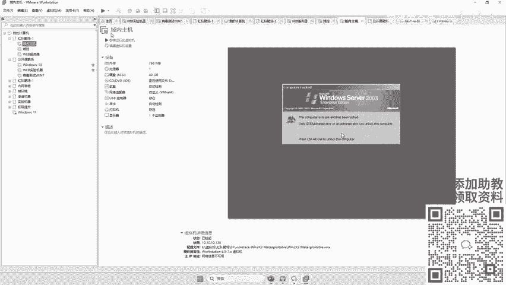

好，开机小钟之后，我们就来进行什么进行这个内网环境的调试。非常简单，5分钟就可以调好。只要你之前是按照我的这个步骤搭的，对不对？那就一定3分钟内就可以搞定了。

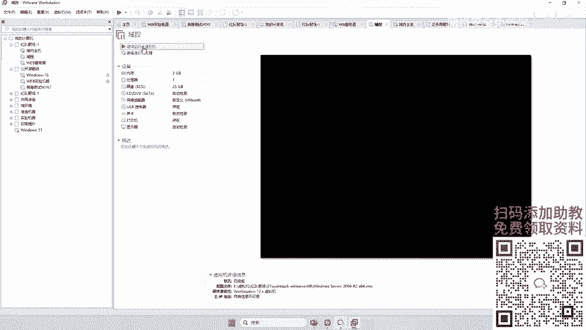

那这个是需要里边去讲的，好吗？有人说啊，李哥自己的电脑一般来说，我们自己的电脑是很少被别人攻击的，对不对啊？因为你的电脑没有什么价值，你电脑上就有个烂游戏，有几个QQ号有什么价值，对吧？啊。

我们电脑一般中木马的话，就是你自己乱点乱下载啊，可能动种一些挖矿这些东西的啊。那这个时候你其实无所谓，你就重启一下就行了啊。

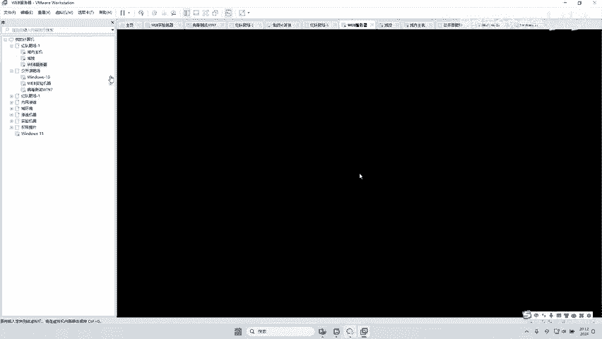

好，首先呢我们登录进来预控，对不对？😊，啊，然后这个时候大家注意了啊，哎我们这个登进来预控之后，怎么去调试这个域，对不对？好，首先这样对不对？首先我们先看一下这个预控的IP地址。

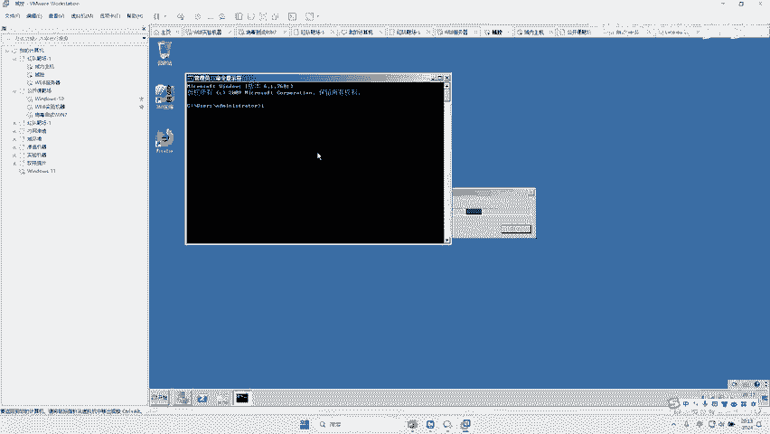

好，在这里可以看到预控的默认配置好的这个IP地址是多少，是不是19216852。138，这个大家没有配过啊，就是你这个电脑开机之后，把那个网卡设好，它就会给你配置好了，对吧？是不是138啊。

这个是预控的IP对不对？啊，那接下来我们打开我们的web服务器。😊。

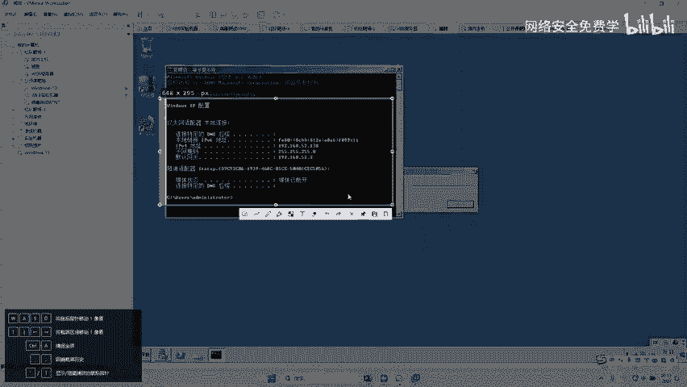

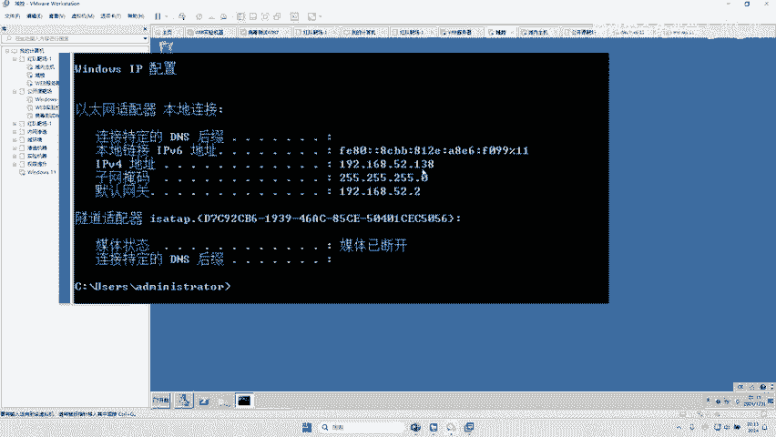

好，登进去好吧。好，登进去之后，我们来看一下啊。来打开我们的网络共共享中心，看到这个本地连接。那么当前预控是我说了是不是有两张网卡，一张网卡是多少，是不是这个19216852。143啊。

它跟这个预控是属于同样的52这个网段的，对不对？那这个时候呢，我们要配的什么配啊，当时第一天的时候，我发现呢我有一个地方给大家讲错了，对吧？我说的是哎这个服务DNS服务器，这里要配成141。

当时我是这样讲的，对吧？那么我在昨天这个检查我的课件的时候，我发现我写错了啊，这里这个IP地址啊，不能是141，它必须是什么地址呢？必须是预控的地址。😊。

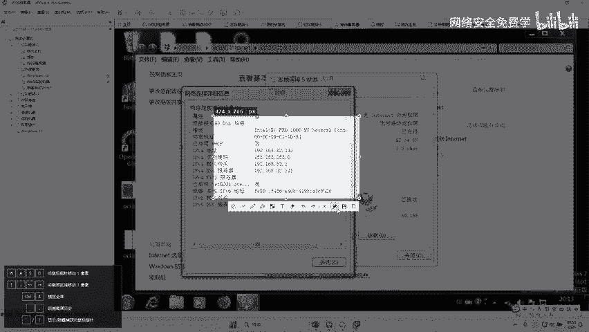

啊，这里的IP地址必须是预控的IP地址。那么预控的IP地址我们刚才看的是多少，是不是138呀啊，这里是李哥，不好意思，李哥写错了，对不对啊，所以这里我们应该改一下，把它改成多少，改成138。然后确定。

好，但是确定关闭。好。好，这个138可以了，对不对？好，然后呢我们干嘛呢？哎，我们把这台机器也给它打开。😊，哎，登记栏，我们来看下这个2003这个电脑，这个电脑的IP地址是多少？😊。

啊，是不是19216852。141？

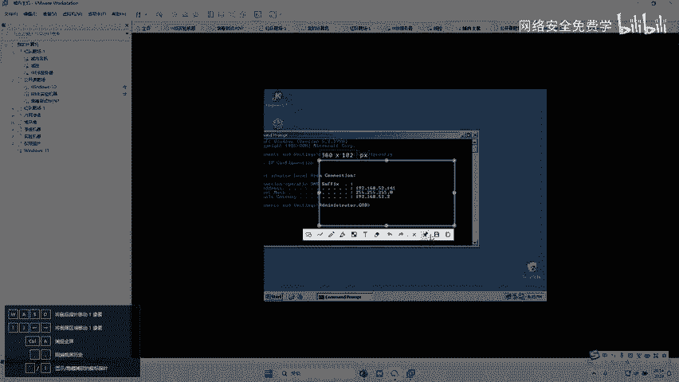

啊，141，那它的这个DNS啊，54这个DNS它因为它是运内主机，对不对？那它的DNS是多少呢？来，我们去看一下啊。啊，也也是138，对不对？你看默认是不是已经给你配置好了啊。

所以这台2003我们是不需要配的啊，人家这里已经配好了，是不是520138啊，这个是141，对吧？我们当时那个win7写错，写成写成这个什么这个域内主机了，对不对啊，所以这里啊人家默认就是138。

我们就不用配置哈。那么现在其实我们的这个网络就调通了。那么那这个时候要做一件什么事呢？哎，把我们的这个所有的电脑啊，重启一下啊，记得是重启一下啊，重新启动啊，😊。

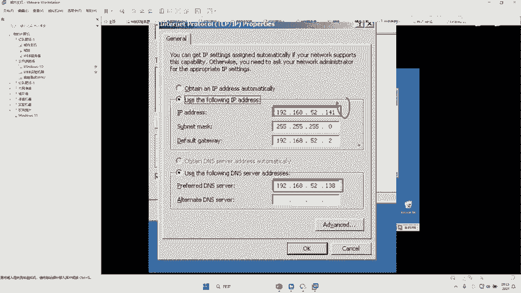

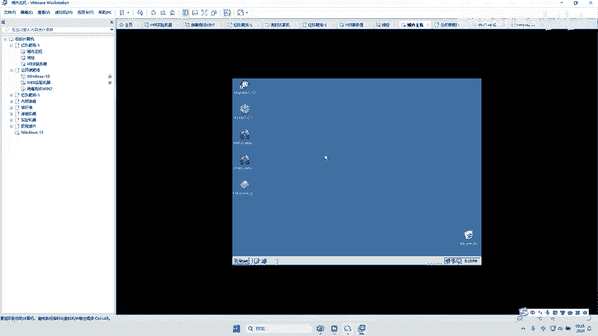

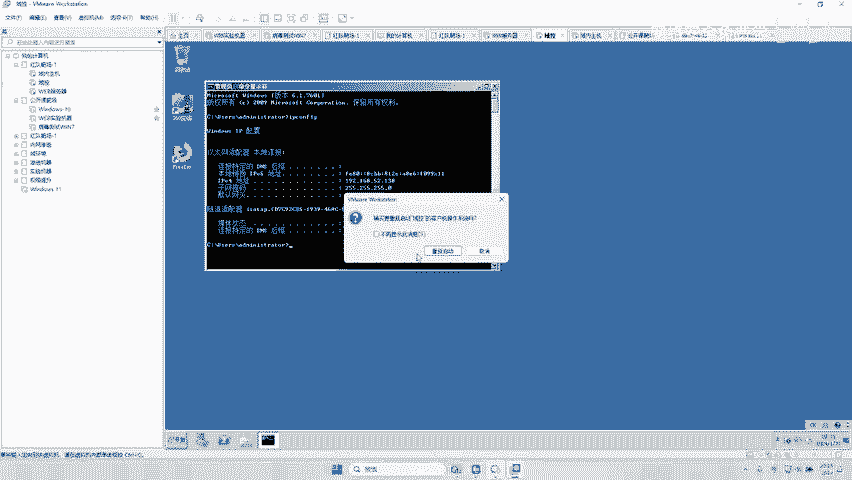

重启。重启配置好IP之后，把三台电脑一定要重启啊，重启OK重新启动啊。

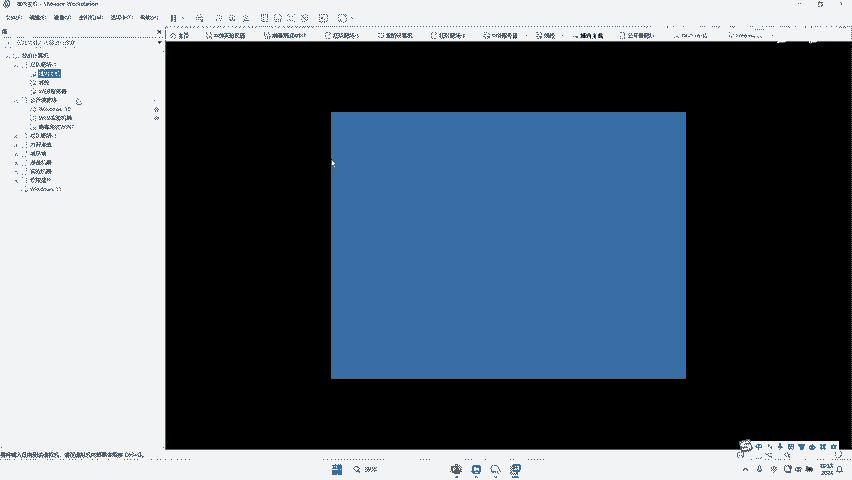

重启之后大概率就没有问题了。那这个网络环境就搭建好了，对吧？因为第一天的时候，我们已经把网卡调节好了，对不对啊？好，我们再去看这个格件，对不对？对不对啊，你看外部服务器的143啊。

这个预控的138域内主机的141啊，那么这三台电脑啊，就这个IP这3个IP是同于同一个网段，就是1926852这个网段，对不对？那么这个预控是他们班级里面的班主任。

那么这台电脑的DNS跟这台电脑的DNS一定要指向什么？指向这个预控，因为他是班主任，对不对？靠着这个IP地址，然后那个预控就可以通过这个IP找到他们，从而控制他们啊，理解没？

因为我说了这个预控在班级里面是属于班主任的角色，对不对？那么班主任是怎么控制，怎么他们是怎么知道这台电脑的班主任是谁呢啊，就是靠这个什么DNS啊。😊，啊，这个DNS没有这个DNS不配的话，就找不到了啊。

那不认识了，就跟你班主任长了张脸，对不对？那你必须长这个样子啊，女的18岁长头发啊啊，刚毕业啊，这是我班主任啊，那个什么40岁的爸妈，那不是我班主任，我不认是不是啊，就跟小孩子一样认脸啊？好。

那这个时候呢哎我们就把分别把这几个电脑给他登进来啊。😊。

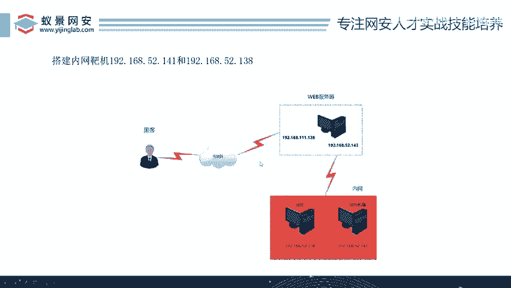

好，我们先登什么？我们先登预控，对不对？那么预控我们用哪个账号当呢？哎，用ad administratorministator，对不对？好，然后输入密码。好。好，这不登进去了哈。

然后接下来呢我们去登录这个200这个。😊，2003对吧。

好，登记来了，对不对？好？接下来登录这个web服务器，这个web服务器大家还记得不？第一天的时候，我们的我们的这个什么密码是多少呢？密码是不是红日S。😊，红日SEC@2019啊，对不对啊，是这样的话啊。

我们嗯昨天讲的是不是用这个账号登进去的啊，其实你有没有想过它是错的呀，为什么？因为我们之前讲过，在第一天的时候讲过，我们在预控上是不是在第一次登录这个机器的时候需要我们修改密码。

当时李哥已经把这个密码修改成了这个2020了呀，对不对啊，2020，所以按道理说这个它是预账号，你修改成2020了，对吧？那你登录这个web服务器应该是2020啊，昨天你用2019登进去的，原因是什么？

原因就是这台电脑已经脱域了，对吧？今天我们才把它调试好，对不对？所以我们这里应该输有什么2020就可以登进去了。😊。

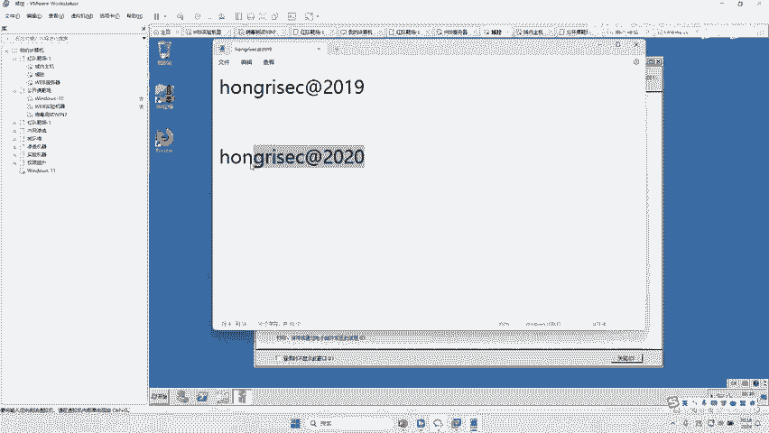

啊，你输2019他登不进去了啊，不信我们来看一下。你看我现在说的是2020，你看是不是成功登了这台电脑了？😊。

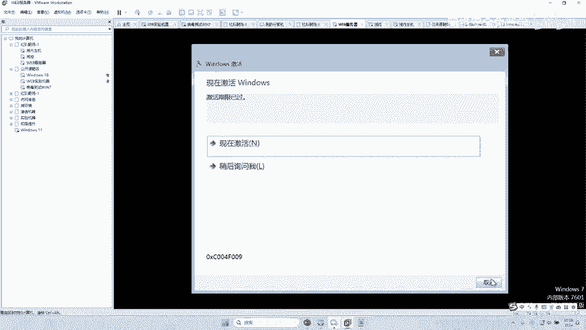

啊，好，那其实这样，然后接下来我们检测一下怎么样，就是说域通了，就是这个域这个电脑跟域已经挂上链接了，挂上钩了，对吧？😊。

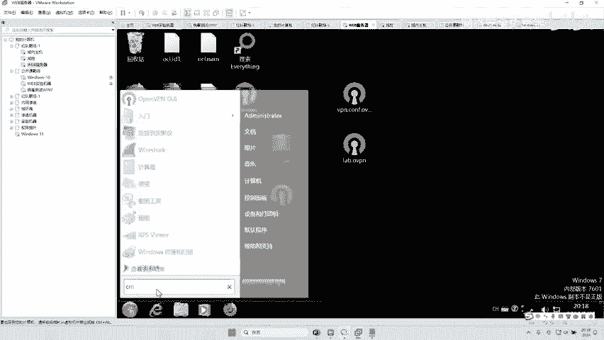

好，我们在这里输一个统一的命令去查看。如果说你的电脑输这个东西没有反应，那么就是你的问题，对不对？我们输哪个命令呢？啊，输这个netight user do漫啊。

night user do漫输这个命令O这个可以查一下，对吧？我们night user。

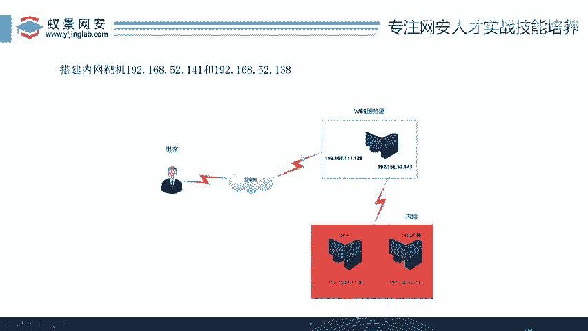

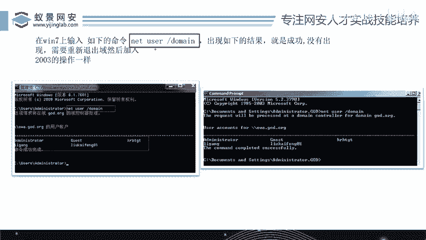

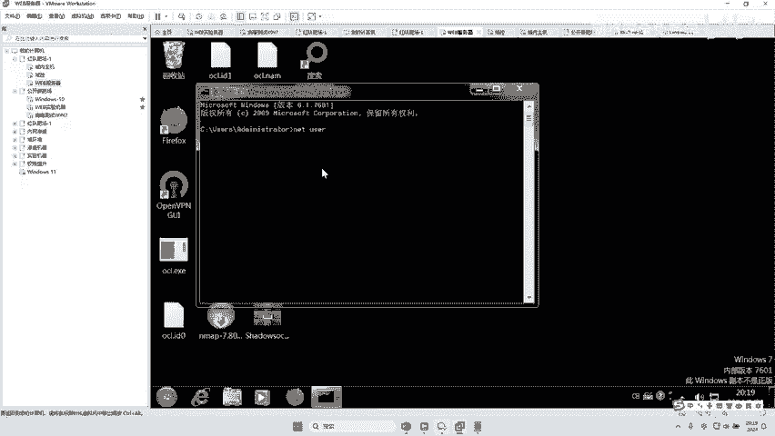

读慢回车。好，如果回车的时候出现了这样的结果。

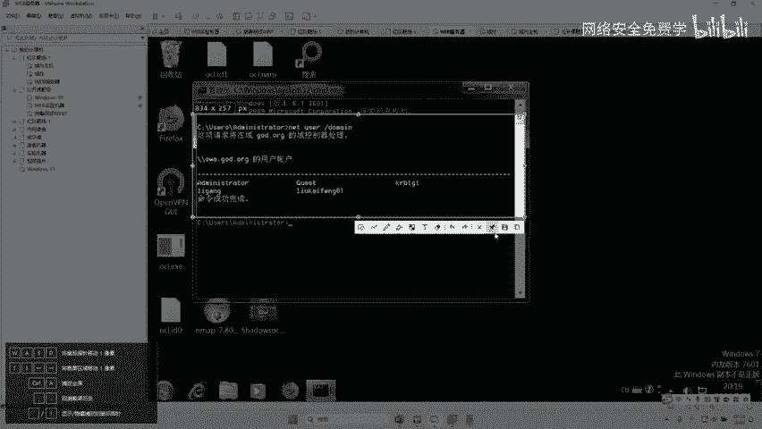

啊，这句话是什么意思呢？啊？net use叫查询用户do漫是什么意思？就是向预控查询当前用户。什么意思呢？就是说你看这是你的预控DC班主任，对不对？好，现在呢你是这个web服务器，对不对？哎。

你在你们班级里面，你向你的这个班主任去问老师老师，我们班级里面有多少个人呀，他们叫什么名字啊，你班主任一看，哎呦是小花呀。那我告诉你哎，你旁边这个人叫啥，这个人叫啥，我们班级有多少个人。

他是不是就会告诉你，因为你们都在一个班级里面班主任是信你的，你也信班主任对不对？所以你看我们n像域控去查询，整个域里面一共有多少个域账号，哎，这里给到我们结果了，对不对？

是有一个两个三个4个5个这5个账号它都是域账号，明白吗？如果说你的电脑没有加入域或者托域了啊，那你输入这个n user就会出现错误，说对不起没有权限查询或者对不起啊，此域不存在啊。

如果说出现了这个用户名才能证明你的电脑已经把域成功了啊，就是加入域了，对不对啊，接下来我们去这个域内主机去看一下这个电脑啊是否像刚才一样，也可以n。😊。

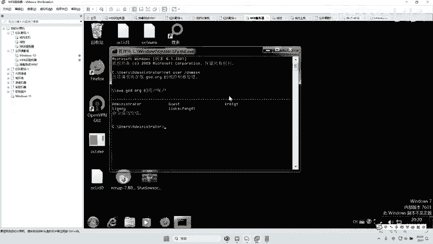

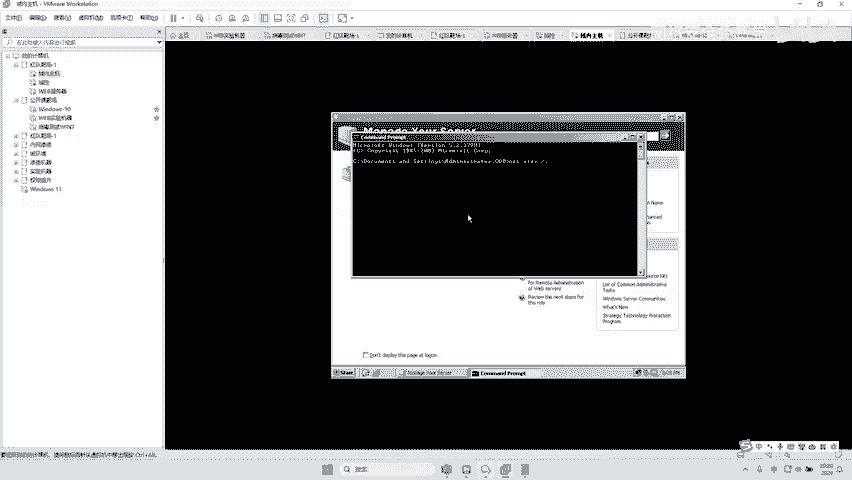

来，我们来看一下。好，这台电脑也是没有问题的，对不对？我们可以看到在这里输入net you the do啊，这台域内主机向域控去查询域里面有多少个用户，是不是查到了这三个用户。好，所以现在呢就没问题了。

这三台电脑就完完全全加入域了。那么哪个域。😊。

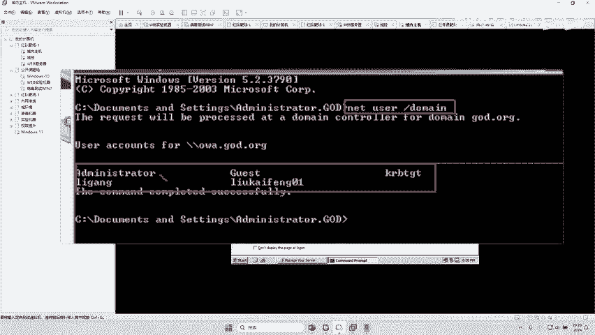

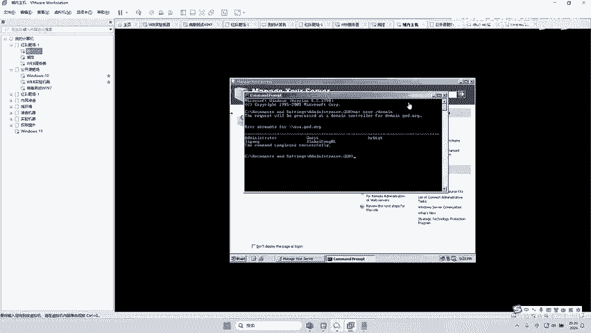

我们现在还不知道啊，只知道呢它有一个预控，对吧？我们就调试好了。那接下来呢就要接着昨天的渗透，我们来进行渗透了，对不对？好，那我们先干嘛呢？哎，把这台电脑对不对？的这个PA study给它打开啊。😊。

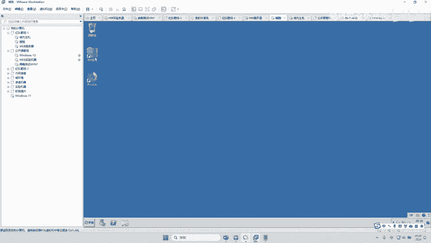

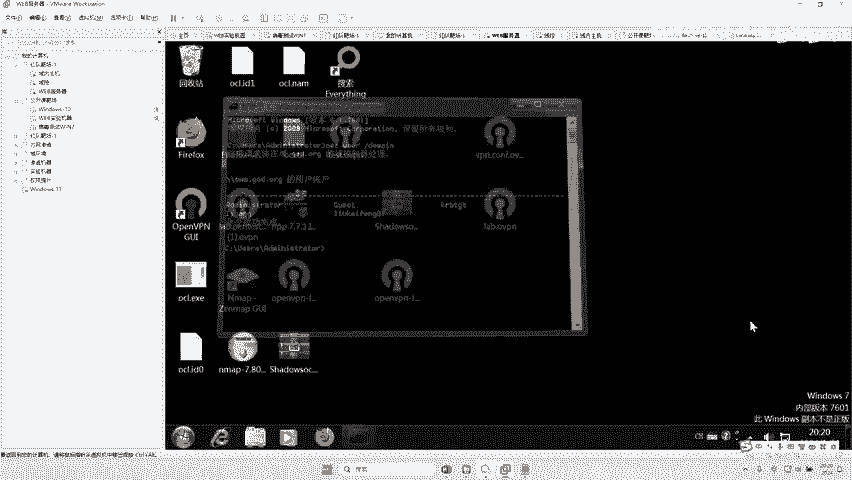

然后用我们的已键接着昨天的步骤再给大家去讲渗透啊。

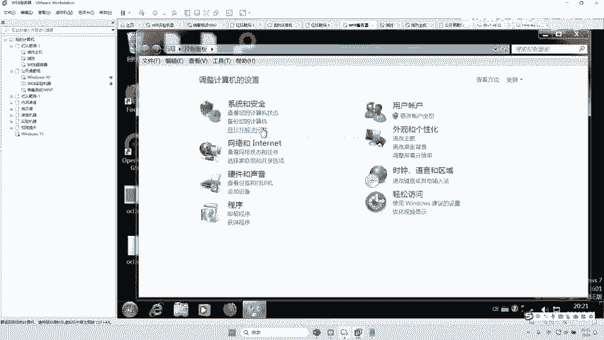

这个大家能听懂没有？就现在我们讲的这个东西，它是什么？就是调试我们的预环境啊，因为前两天我们还没有调，对吧？没有调的话。

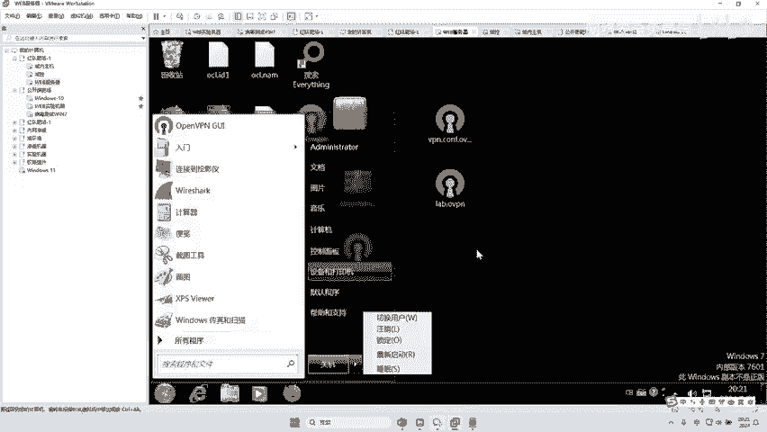

就不不想懂的话给这个扣个一好不好啊，能听懂吗？😊，啊，应该是非常简单，对不对啊？因为如果说你第一天听了，那你现在听应该是非常简单，对吧？啊，如果说你第一天没听，那那你这里觉得啊，什么是玉，对不对？

你就可能比较懵了啊。所以如果说你第一天没来的话，那一定。😊。

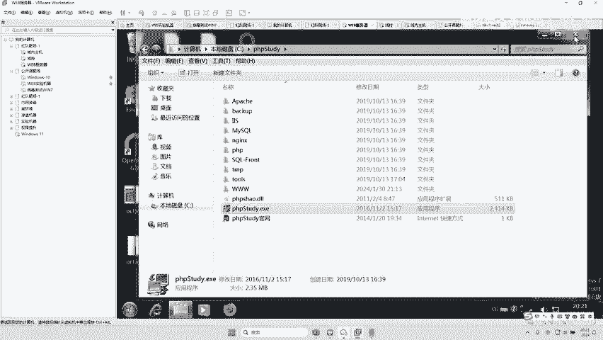

啊，昨天每天你看我所以说我们三天训练营真的是一天都不能错过啊，你错过一天，你真的就你就全部会了，对不对啊？😊。

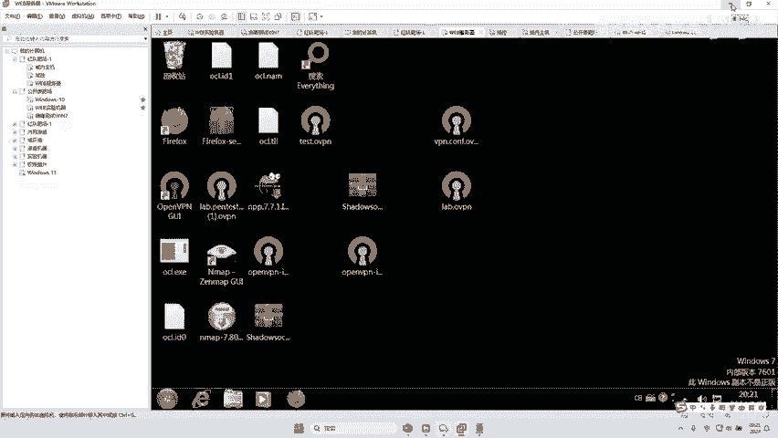

好，OK那哎，我们来接着来看啊啊，昨天我们讲到哪里了？哎，我给大家再还原一下昨天的场景，对不对？昨天我们是不是用这个啊。😊，这个东西。啊，第一天没听，第一天没听没有关系啊，你到时候回去再听一下啊。好。

我们双击。哎，昨天是不是我们到这里了，还记得不？哎，昨天我们是在这里，大家还记得不昨天的课听了没有？在这里是不是？😊。

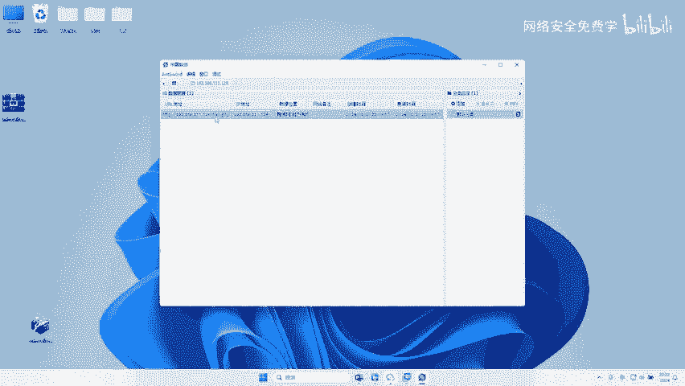

哎，在这里是不是已经控制它了，然后给他开启关了防火墙，开了3389，然后是不是把对方远程上去了，这个大家还记得没有啊，昨天我们说的不是到这了？好，到这之后我们就干嘛了？哎，根据我李哥这边提前给大家讲了。

对不对？接下来我们就要进行。😊。

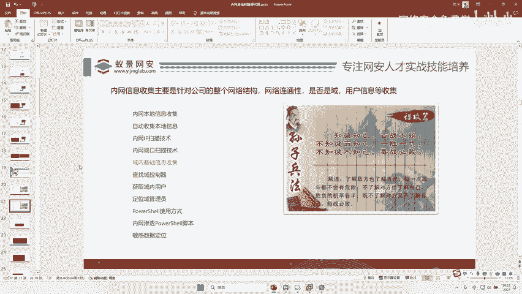