# 2024B站最值得看的黑客教程 ｜ 网络安全／渗透测试／内网渗透／漏洞挖掘／web安全／kali linux／红队靶场／CTF／信息安全 - P10：渗透测试常见漏洞挖掘思路 - 网络安全免费学 - BV1uBsTetEow

首先，我们在渗透测试中经常会用到以下三种测试方法。第一个呢叫做黑盒测试、白核测试和灰核测试。

黑盒测试呢是大家在工作中最常进入的工作岗位，就是指呢我们公司会接到一个项目，就像互网一样，让你去渗透一个公司。现在只告诉你这个公司的名字，或者是只告诉你这个公司的官方网站，让你去渗透。

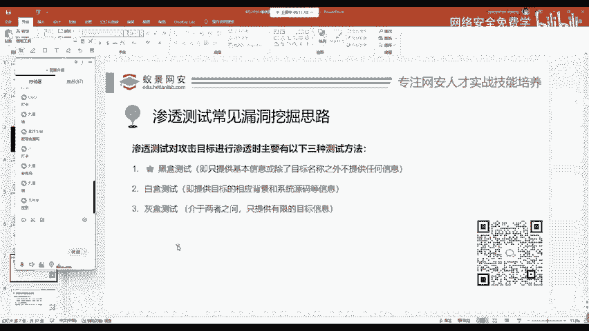

除了公司的网站之外，所有的信息都需要你自行收集，所有的漏洞都需要你自行扫描或者是挖掘。这个叫做黑盒测试，就像摸黑一样，自己去探索。第二种呢叫做白盒测试。白盒测试这工作岗位我们经常遇到的叫做代码审计。

就是指我们接到的目标，我们会获取它几乎所有的信息，包括网站的源代码。我们通过网站源代码阅读分析来分析源码级别产生的漏洞隐患。这个叫做白盒测试。一般对应的岗位叫做代码审计。第三个呢是灰核测试。

灰合测试就是介于两者之间，公司呢可能会给你一些详细的具体信息，但不会给你所有的源代码。好，这我们了解这三个名词，对于你从事渗透测试相关工作是非常有帮助的。你在进入一个行业之前。

首先就是要对这个行业有充分的理解，有充分的知道啊。你知道这个行业有什么岗位，知道某个岗位是做什么的。这样的话进入啊公司工作之后呢，能够尽快的去接手这些项目，面试的时候也是会占有很大的优先度的啊。

优先度的。

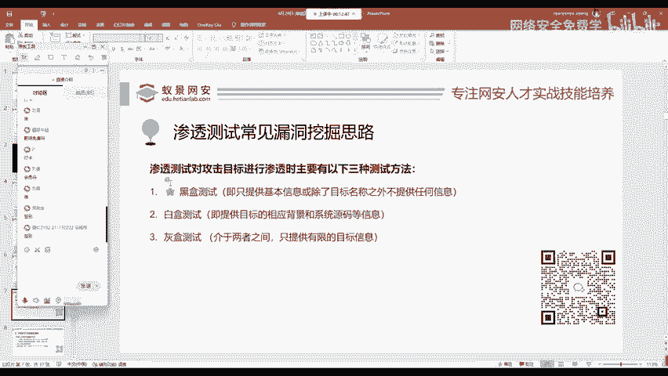

下面呢我们来看一下，在渗透测试黑盒测试中，我们经常会遇到如下四种漏洞，这是老师要讲的。

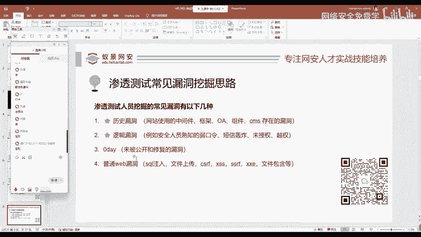

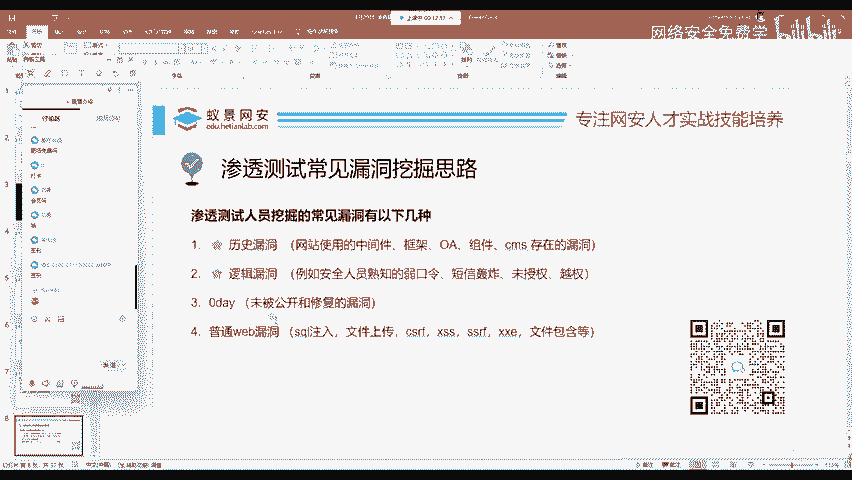

第一个漏洞叫做历史漏洞，它是什么东西呢？就是因为现在啊网站的开发者，这些后端人员，包括前端人员在开发网站样式和后端处理代码逻辑的时候，经常会使用一些集成的框架集成的应用程序或者是中间件OI组件等等。

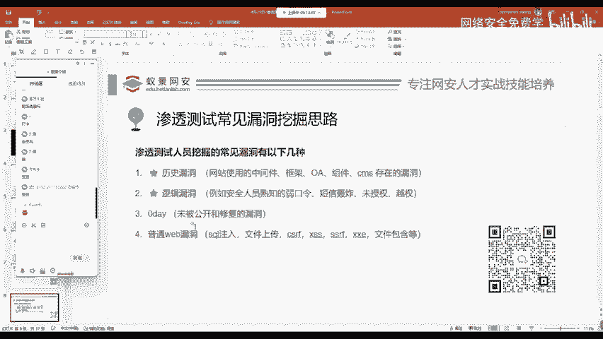

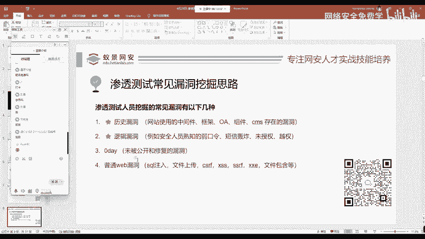

我相信很多来听课的同学呢都是大学生。那在大学里面呢，我们会经常使用一些刷课的APP使用一些我们的教务平台网站。那这些网站细心的同学可以发现它都属于外包出去的。

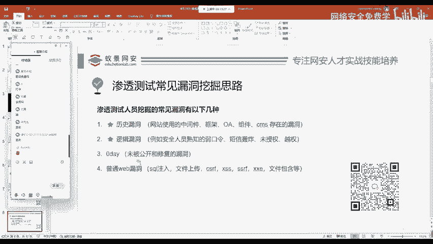

也就是说呢，一个相同的网站可能是很多个学校都在使用。那如果这个相同的网站出现了一个漏洞，那是否使用这个网站所有的大学都会遭受这个漏洞的攻击呢？造成造成这个危险的存在呢啊，确实是这样的。

这就是历史漏洞的重要性。

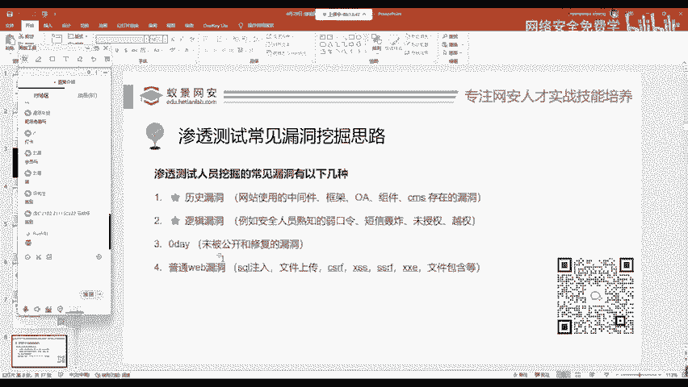

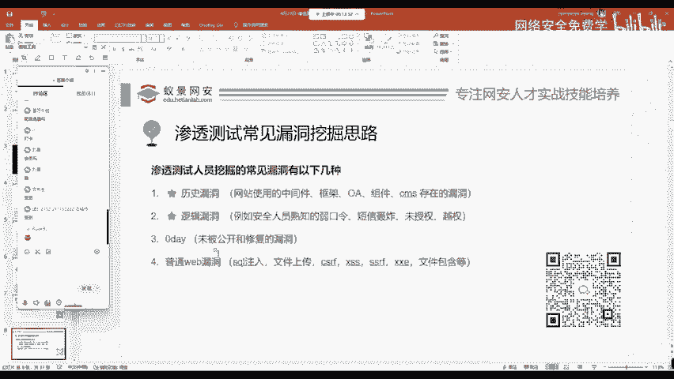

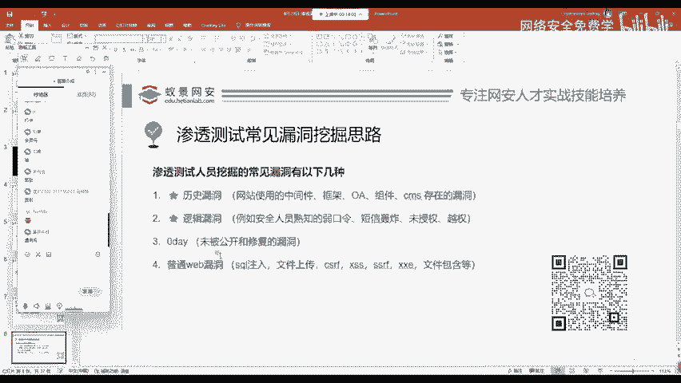

那第二个呢叫做逻辑漏洞，这个同学说的对啊，就是通用的通用的历史漏洞。第二个呢叫做逻辑漏洞。逻辑漏洞就是指它不是特别容易发现的安全隐患。就比如说我们耳熟能详的弱口令啊。

现在嗯经常走在这个实证前沿的俄乌冲突。我们会看到一个段子，说乌克兰国防部的这个弱密码，就是它的国防部的后台密码是123456。其实这个就属于逻辑漏洞的一种。还有一些呢比如说大家经常听到的像短信轰炸。

未授权月权平行月权垂直越权等等，包括一些像零元购，绕过我们软件的检测，绕过订单号，直接去获取这个商品。这些都属于逻辑漏洞啊，都属于逻辑漏洞。

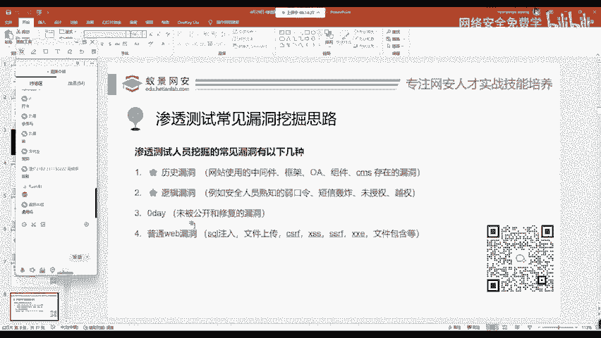

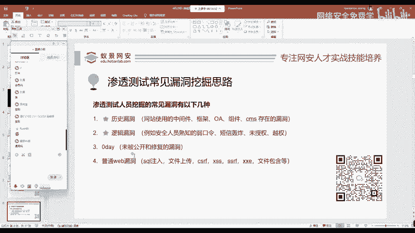

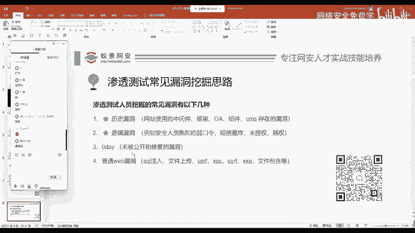

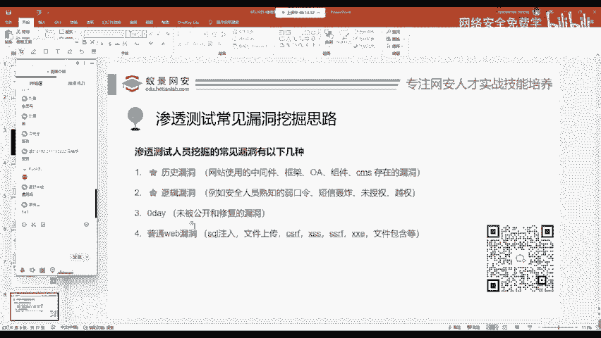

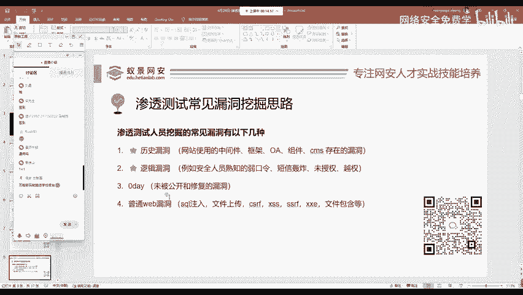

第三个呢叫做零带。零带，它是一个专有名词，是指未被公开和修复的漏洞。零带对于在互网中是一个一直是一个大插器。但是对于普通的安全工作人员来说，零带我们总是从别的大脑中去获取。

去看别人已经发出来的那别人既然发出来了，那他就不是零带了啊，别人既然已经发出来了，就不属于零带的范畴了。那如果一个安全服务人员或渗透测试工程师想去挖掘一个零带，那你付出的成本和技术的要求是非常高的。

我们可能零带总是从别人的嘴里听说自己从来没有挖掘过。

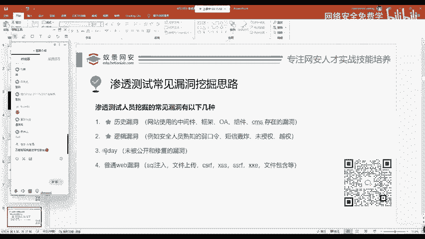

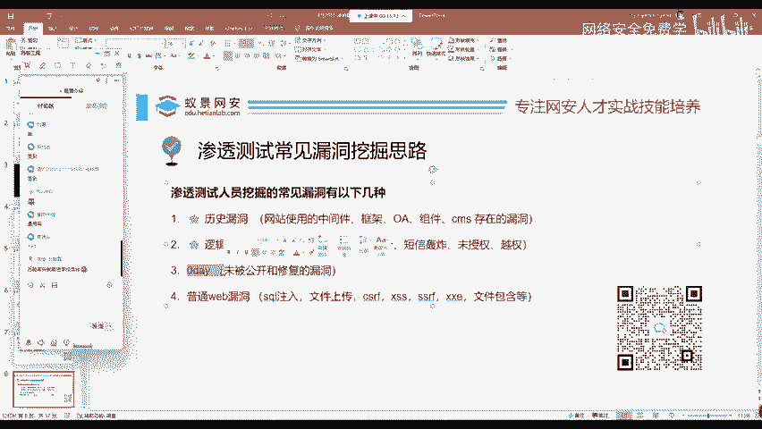

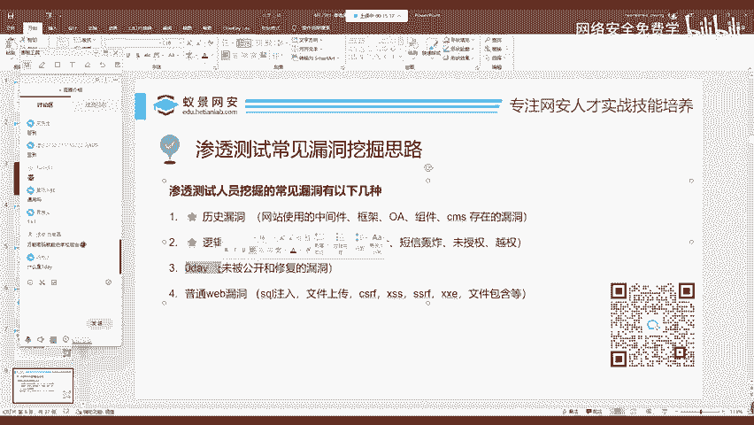

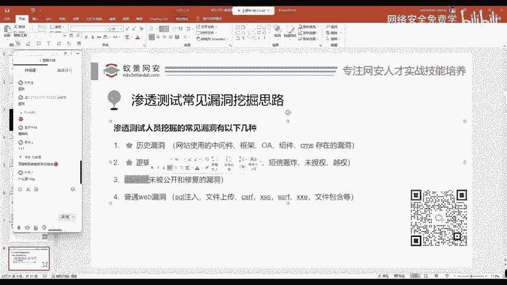

第四个呢叫做普通的外b漏洞。为什么我把普通的web漏洞放到最后面呢？就像这个同学说的万能密码就能进学校后台。那万能密码呢就是大家熟知的搜cle注入漏洞。像搜狗注入叉SS文件包含文件上传等等。

这些在外b漏洞靶场中经常见到的漏洞。为什么我要把它放在第四点，就是因为呢现在安全越来越被重视。各个网络厂商各种安全设备，各种防火墙都已经进行了完善的搭建。

并且呢这些漏洞经过了多次互网和渗透测试人员的攻击和修复。想去挖掘搜狗注入文件上传，在现在来说呢是比较困难的。但是你并不能说它没有啊是有的，只是比较少，而且呢这些漏洞一般情况下。

我们使用的扫描器都能帮助我们。

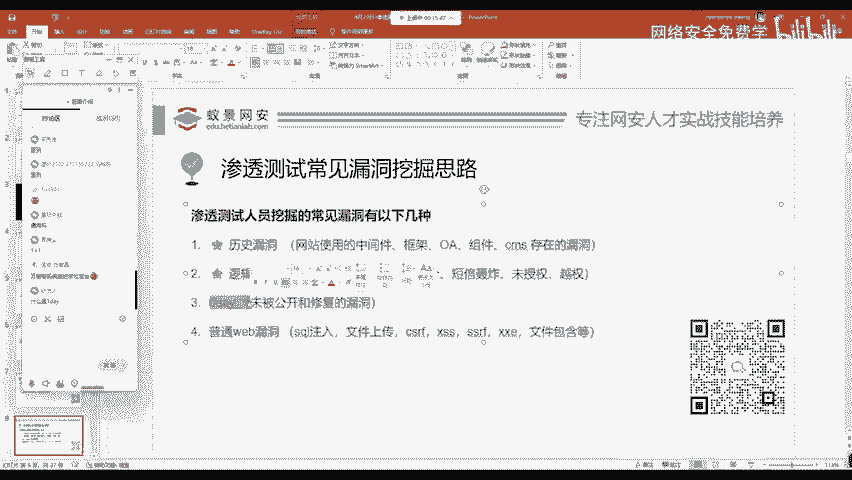

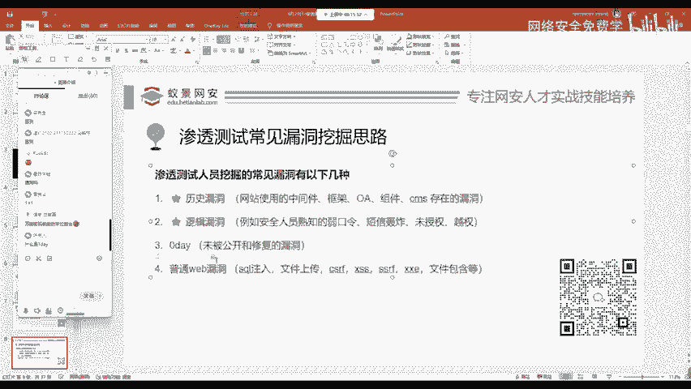

去发现啊，都我们帮助我们发现。所以说最重要的呢其实还是通过历史漏洞，以及呢我们手动去挖掘的逻辑漏洞。

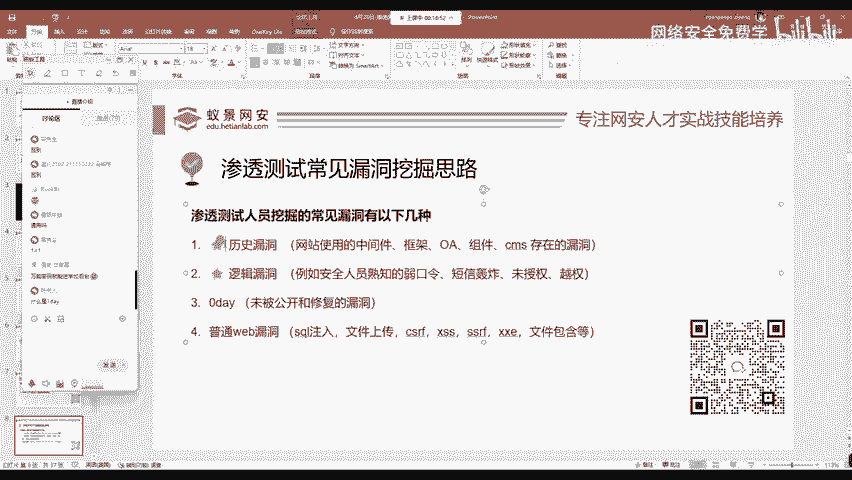