# 2024B站最值得看的黑客教程 ｜ 网络安全／渗透测试／内网渗透／漏洞挖掘／web安全／kali linux／红队靶场／CTF／信息安全 - P110：内网信息收集和定位机器 - 网络安全免费学 - BV1uBsTetEow

什么进行内网渗透了，对不对啊，因为我们进行怎么进行内网渗透的啊，来看一下啊。😊，好，内网深透的第一步叫做内网信息收集。啊，之前给大家讲过，对不对？哎，我们有一个叫做信息收集的技术啊。

那这个信息收集它是分两种的。第一个叫什么叫外网。😊，新收集。第二个叫什么内网新收集。啊，那这个内网新收集跟外网新收集有什么区别呢？内网新收集啊，就是我们第一步的时候啊，去攻击一个企业的时候。

我们要收集这个比如说你中国电信移动，对不对？你是攻击这个单位的时候，你要收集什么啊，收集这个我喝口水啊。😊，你要去收集这个公司的邮箱啊，股权结构，公司的法人代表庞站C段端口网站相关信息，对不对啊。

收集完成之后，我们利用就进去了，对吧？进去完上之后呢，进入内网信息收集，因为你已经控看我们当前是不是已经控制了一台电脑已经进入到公司的内网中了，那么所以呢我们得干嘛呢？在内网中进行信息收集。

那么内网的信息收集跟外网的信息收集它是不一样的啊，收集的东西是不一样的，内网的信息收集主要是干嘛，主要是要收集整个网络的整个公司这个网络什么结构。

公司里面有多少台电脑公司里面有没有加入域有域的话有多少个预用户域的话这些预用户上账号密码是多少，对不？这个预管理员在哪里预控在哪里，这些我们都要知道对不对？因为我讲在预环境中它是有预控的对吧？

所以我们现在控制这台电脑对吧，我们现在也不知道这台电脑有没有加入域预控是多少域里面有多少个电脑，电脑的IP是多少？电脑中这个账号密码有什么问题，我们都是不知道的对吧？所以。😊。

我们需要进行什么内网的新收集啊，所以内网新收集跟外网新收集它是差别非常大的，对不对？外网新收集是针对于这个公司整个。公司的啊股权结构、公司架构C段旁断端口APP小程序啊，这些口子做收集的，对不对？

那么内网型收集主要是收集在公司里面的什么网络架构账号密码，网络联通，对不对？这些东西啊，一般来说我们进入内网的第一刻都是两眼一摸黑，对吧？我也不知道这个网络里面到底有多少台设备有几台打印机，这个摄像头。

我都不知道，所以我们需要进行收集好，那么接下来就按照李哥的讲一个步骤，我们怎么去收集好吧，首先第一步啊，我们先收集什么收集当前控制的这个电脑的账号是多少哎，我们收入ho am好。

我们在这里是不是可以看到当前这个账号是什么，是不是GOD对吧？好，所以我们知道了当前这个账号是这样叫叫这样，对不对？😊。

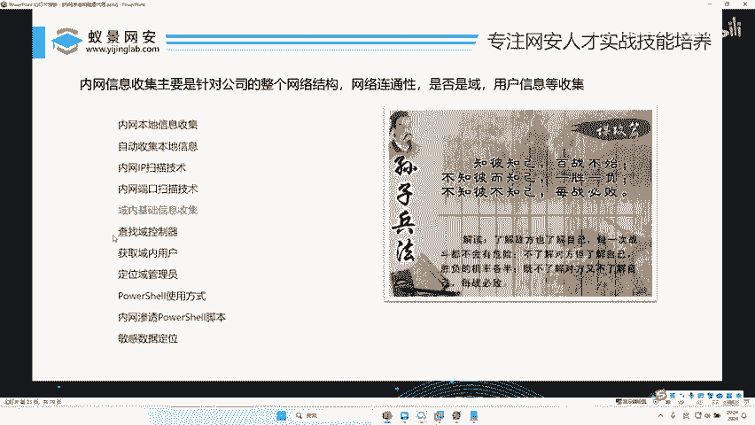

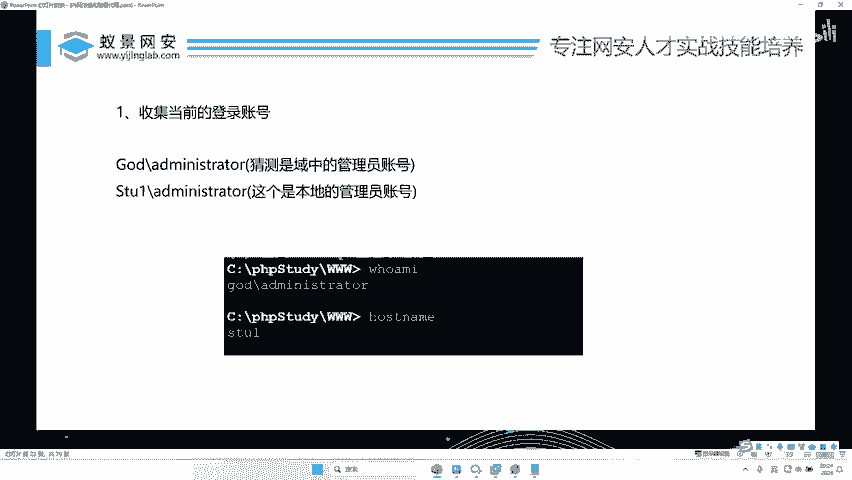

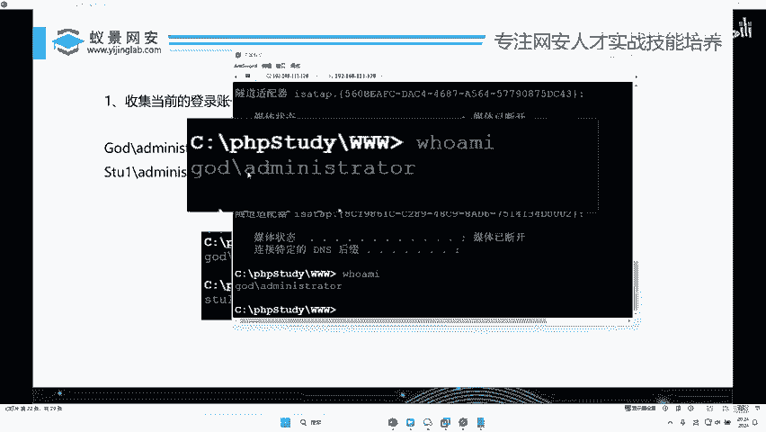

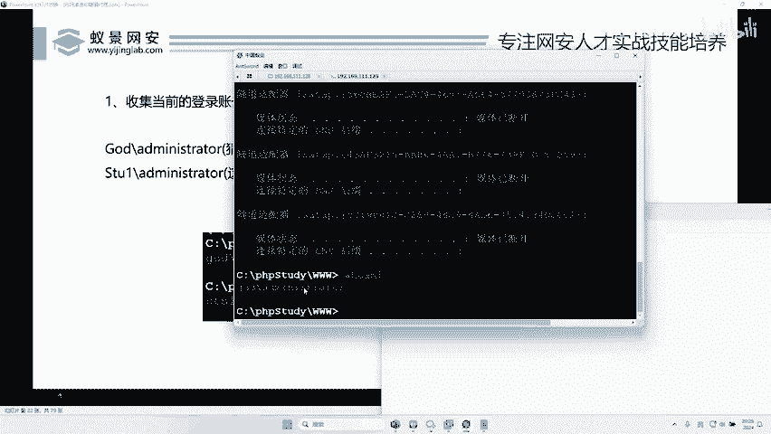

哎。好，就这样。那我们再收集一下当前这个电脑的机器名。

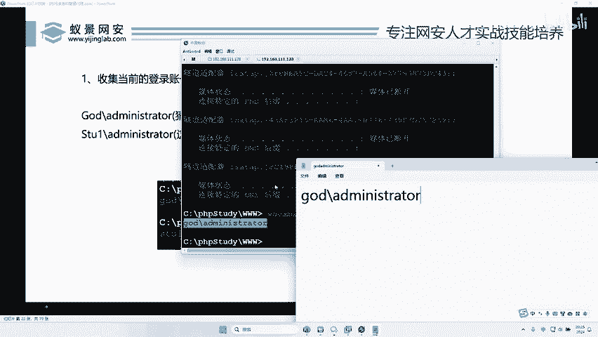

哎，我们发现当前这个电脑的机器名叫STOE。那么根据我们第一天讲的对吧？那前面这个账号名是JOD，它的机器名叫STOE啊，所以我们猜测这个账号是什么，是一个什么预账号。😊。

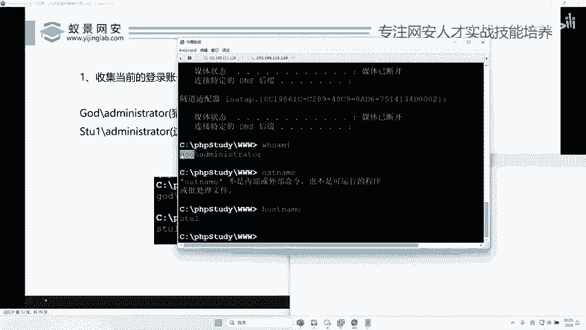

对不对？那么预账号它是由预控统一发配的啊，它是不受，它本身上不在这台电脑上，对不对啊，okK然后我们接着往下看，对不对？

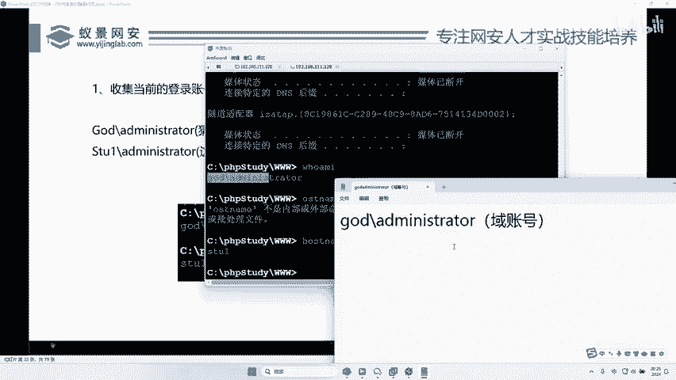

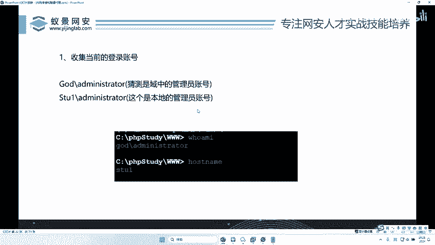

哎，那然后呢我们来看下这个域域名到底是多少，我们还不知道啊这个玉权的这个域名到底叫什么，我们还不知道我们用哪个命令去收集，看它有没有加入域呢？我们用这个命令。SYSTEMINFO叫sin，我们回撤一下。

好，那么这个命令主要是收集这个电脑的相关信息啊，比如它装了几个补丁什么，你看哎我们能收集到，对吧？当前这个电脑的主机名叫什么？😊。

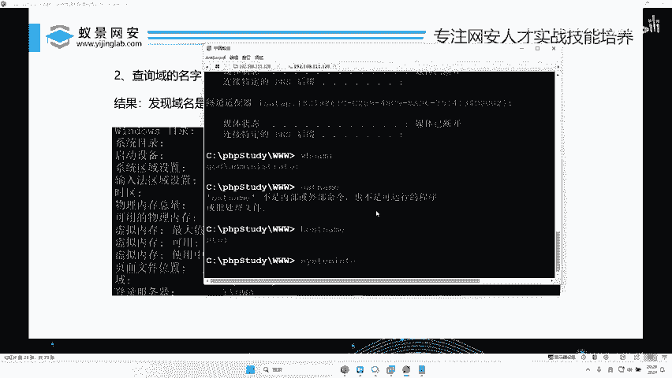

啊，是不是叫STOE啊，它的版本是一个win7专业版啊，它的OSH版本是6。117啊，这个什么7061这个版本啊，具体版本啊，然后呢再往下翻啊，它的ID是几号的对吧？

初始安装是2019年启动时间是2014年1月31号，对不对啊，并且它的VM word里面就虚拟机里面环境，对吧？安装了一个处理器啊，然后是多少？是这个处理器型号，是不是然后再往下翻啊。

它的一些启动的一些目录啊，它的内存大小对不对？虚拟内存啊，几个G，然后这里可以看到对不对？它的域是不是叫GOD点ORG啊啊，我们就知道了啊。😊。

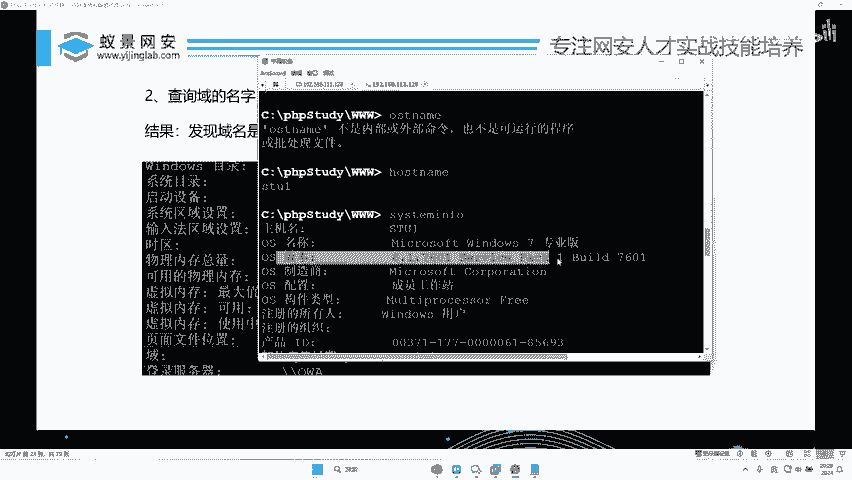

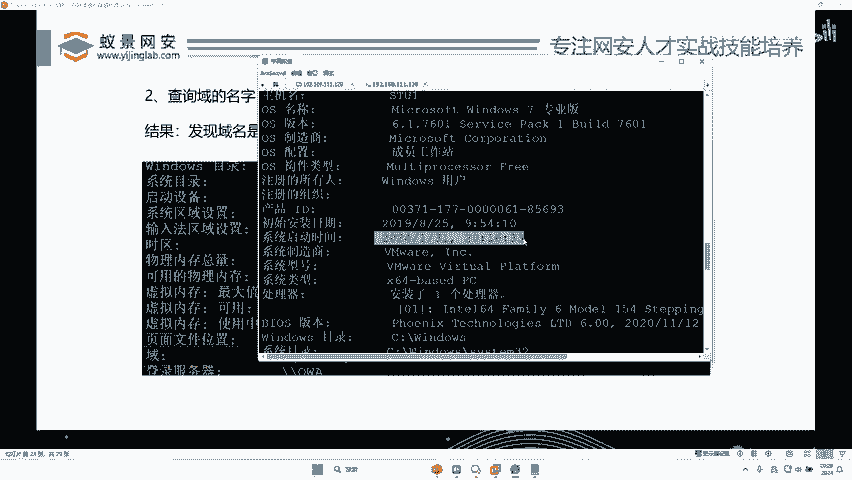

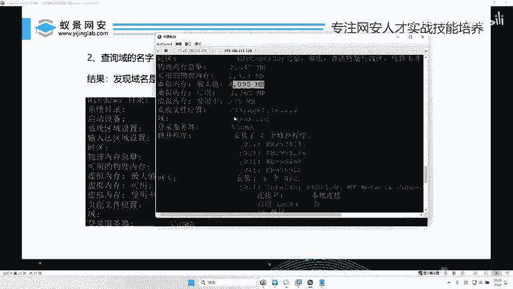

玉。啊，GOD点ORG所以这台电脑它是什么？加入域了，它的域名叫什么？叫GOD点ORG也就说这个域名是什么？再给大家解释一下，你看我说了域是一个什么有集中管理的一个集合，对不对？有班主任。😊。

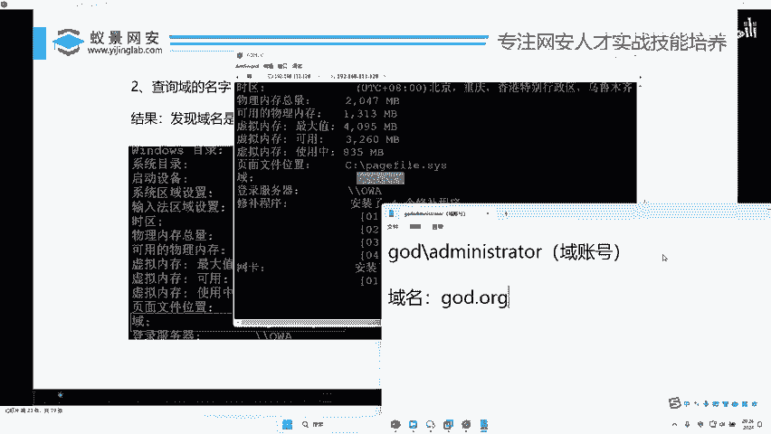

对不对？有里面的机器，那这个域名是啥？域名就是这个班级的名字嘛，就跟你们这个上学的时候，高中一样，对吧？高中一班一班有自己的班主任啊，班级里面有50个孩子。那那这个一班可能是重点人家叫什么火箭班。

重点班啊，什么清华北大班，对不对？然后人家这个域也有自己的名字嘛，人家什么叫JOD点ORG啊，人家这个域的这个班级名叫JOD点ORG。😊，对不对？GUOD点OC啊，这是它的域名啊，域名啊，这个班级名啊。

那这个域里面到底有多少电脑，我们还不知道对吧？好，在这里可以看到这个电脑打了几个补丁，对吧？这个电脑有几个网卡，网卡的IP是多少？哎，这里我们都是可以看得到的啊啊，52。143啊。

可以看到它的143网卡，对不对？好，那么我们接下来往下翻啊。😊。

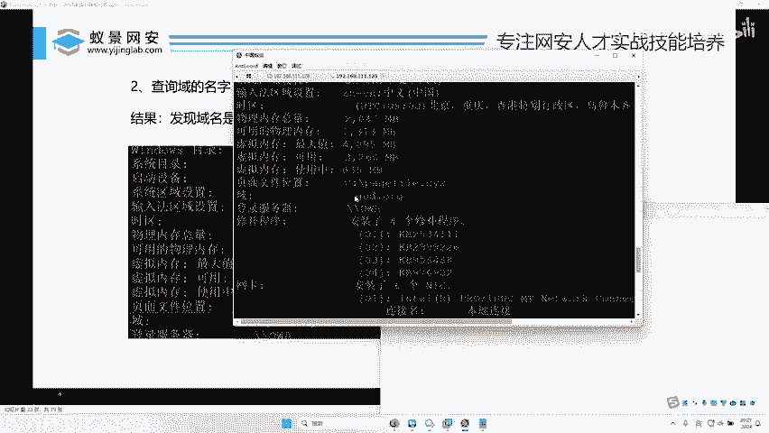

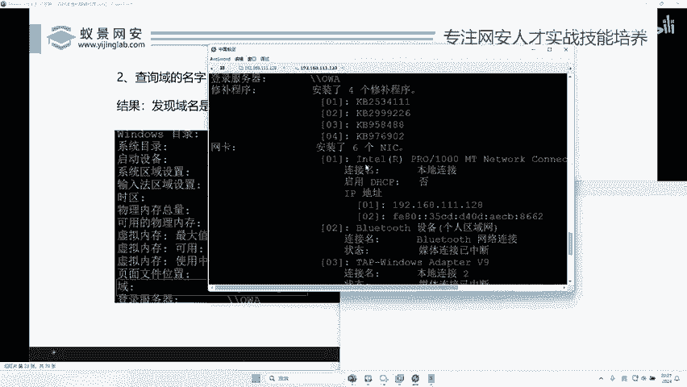

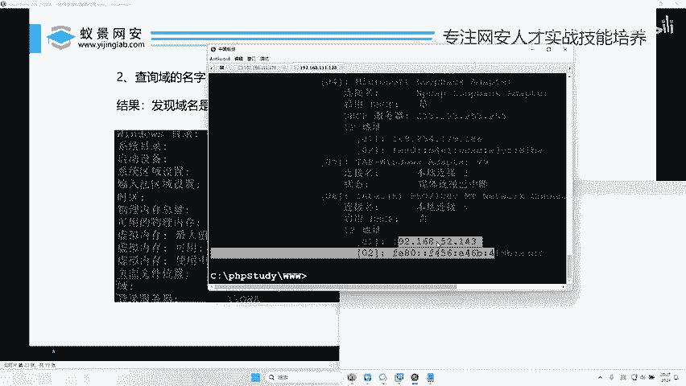

好，然后呢我们再去查看什么，再去查看一下当前这个电脑或者域中有几个用户，对不对？啊，所以我说我们现在已经知道了几个信息。第一个啊当前。

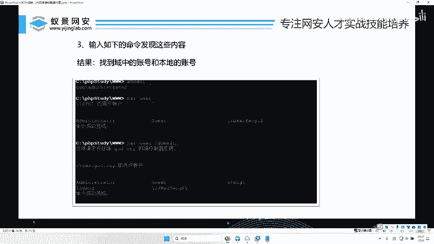

当前。当前控制的用户是啊。啊，第二个信息是什么？知道了是么嗯。😊，当前控控制的电脑加入了与。对吧域名是。哎，这是我们现在查到了三角信息，对不对？好，我们再看第三个第三个信息呢。

我们去看一下这个域里面有多少个用户，就账号，对不对？好。😊。

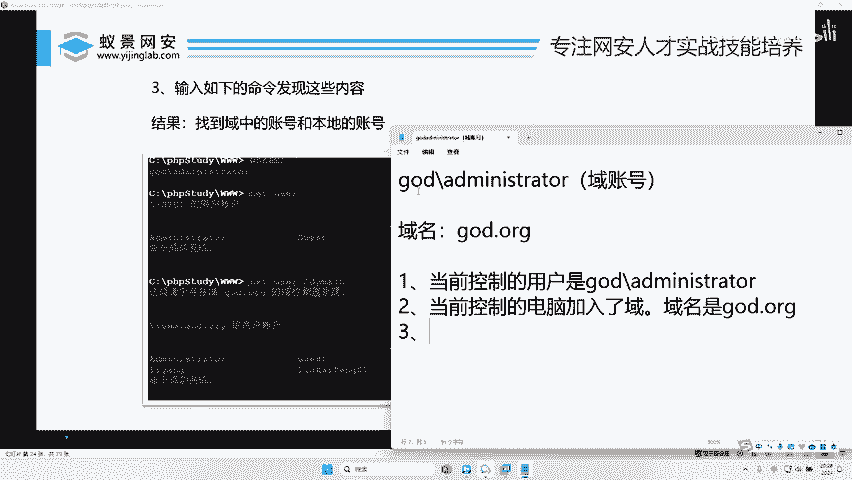

啊，怎么看？其实刚才已经大家讲了，对不对？就用这个night user do好，我们去看一下回车好，是不是可以看到当前这个域里面有几个用户，一个两个、3个、4个、5个哎，这里是不是有一个admin。

这个域账号，那这个域账号就是什么呢？哎，就是我们就是这个GOD点min，所以说我们当前这个电脑应该是用这个用户登进来的，对不对啊？所以他电脑上有一个两个3个、4个、5个啊，有5个账号，对吧？啊，域中。

😊。

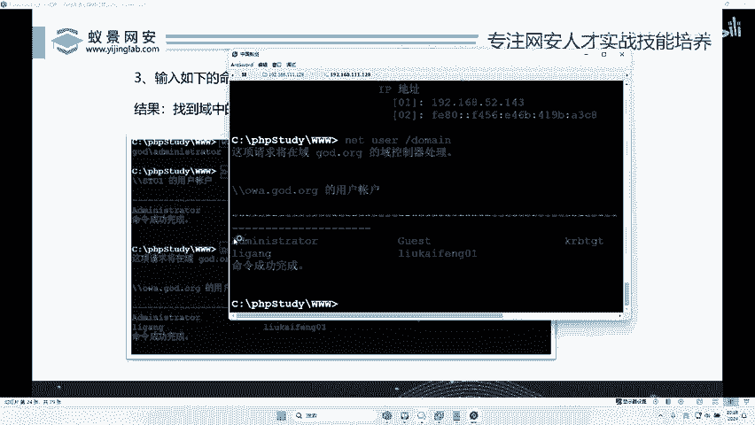

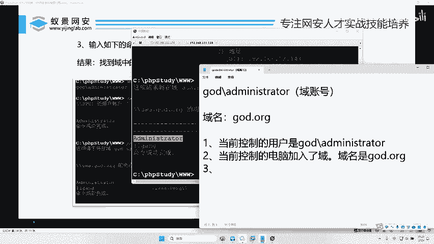

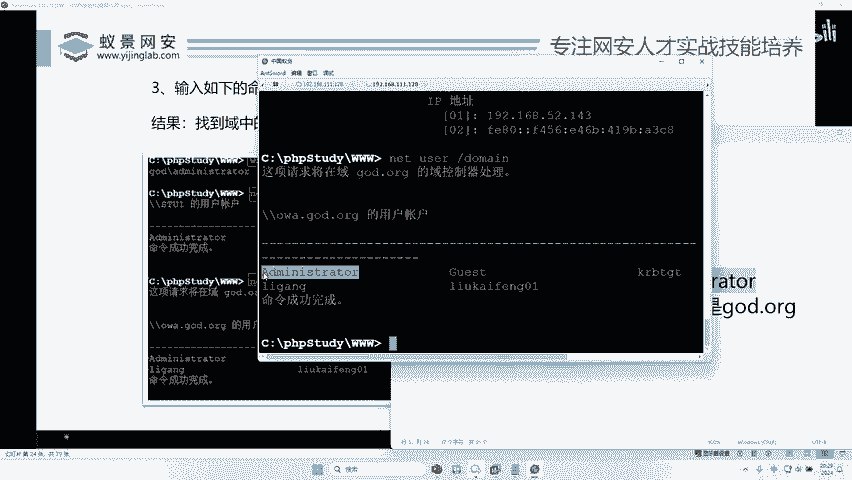

狱中。

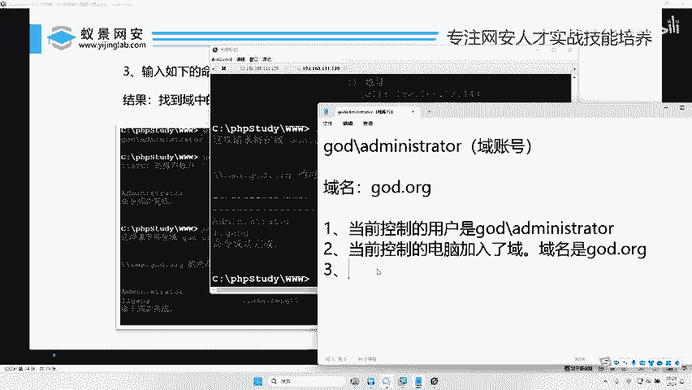

域中有5个用户，那这5个用户名。那这5个用户名对吧？它都是由预控设置的，啊，不是由这个这台电脑本身设置的，对不对？好。

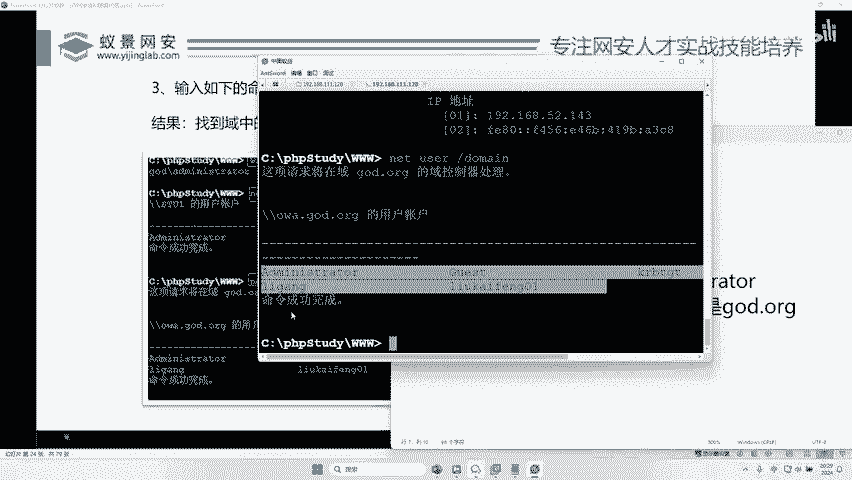

我们接下晚饭好，接下来我们去看一下，查看一下什么，查看这个域中有几台电脑啊，怎么去查看这个域里面有几台电脑呢？非常简单，net group啊用这个命令啊。好，有人说啊，李哥为什么这样啊，大家先。😊。

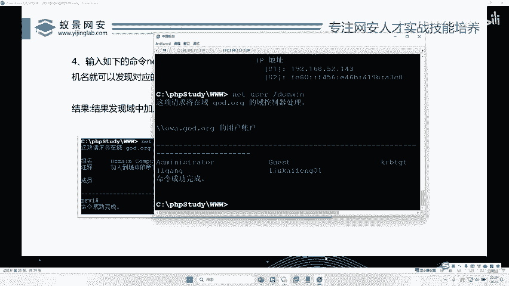

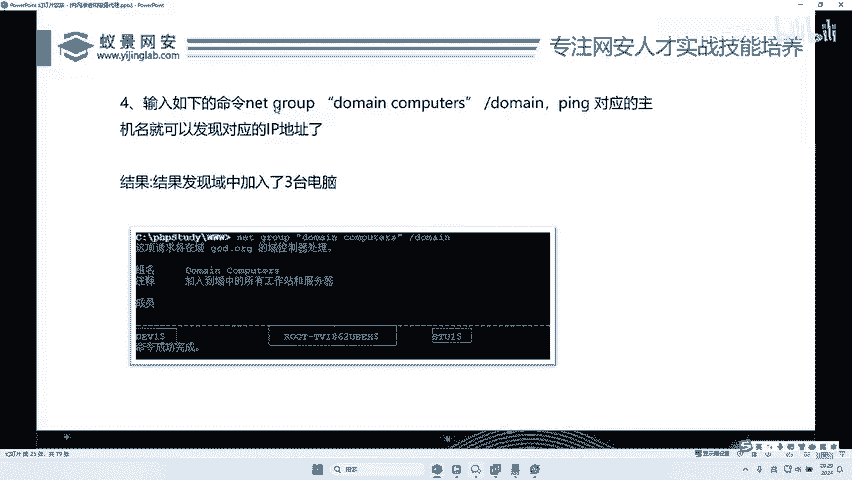

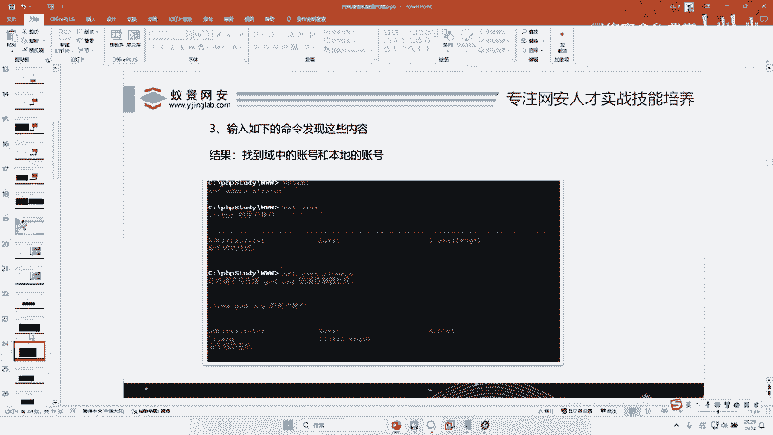

把这个命令学会啊，先把这个命令学会啊。好，这里呢大家记住啊，这里要引号。好，这句话是什么意思呢？啊，就是查看组，查看什么组，查看这个computer组啊，向域中查。这句话就是说向域控去查询一下。

我们当前域中有几台电脑。因为我们要我们现在还不知道这个域里面有几台电脑，对不对啊，所以我们得查一下啊。

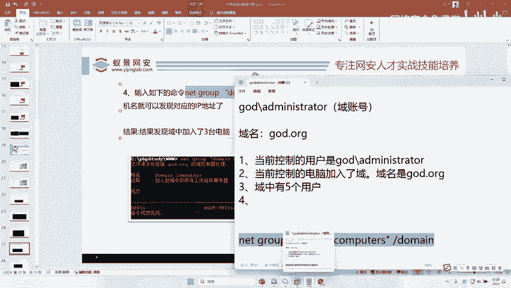

好，我们查出来有几台，是不是有三台电脑，第一台电脑叫DEV，第二台电脑叫root。第三台电脑就是这个，对不对？所以我们把这三台电脑给它先复制出来。😊，啊，就这狱中当前有三台电脑啊，就是域内成员啊。

你看狱中。

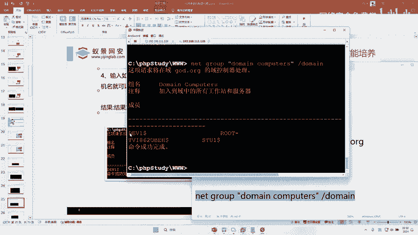

狱中有3台电。啊，所以这三台电脑都是我们的目标，我们都把它控制出来，对不对？那这三台电脑名字分别叫什么啊，这后面这个就大家可以删掉，对吧？啊，嗯，好，删掉就可以了啊。😊，分别是什么？😡，DEV。V一。

好，第一台。第二台。第三台。好，没有问题吧。开。是不是哎，那这个第一这个SQE我们知道是哪一台，就是当前我们控制的这一台，对不对啊？我们刚刚查了这台电脑的名是不是叫SQE啊。

所以这个SQE已经被我们控制了，就是当前我们控制带电脑还是SQ那么还有两台叫DV我们不知道对吧？还有一台叫这个我们也不知道他是他有没有开机，我不知道他有没有关机，我也不知道啊，所以我只知道他加入域的啊。

这个他开机没开机，关机没关机，我不知道的对吧？就跟你一样，对吧啊，你就是说就类似于什么，类似你像你们班主任班级里面要你们班里面的花名册啊，要到之后，你发现你们班级里面50人。

但实际上你班里面可能不是50人，为什么因你班级里面可能有人请假了，对吧？只是说你班里面他登记了50个人，但是这几个人来没来，我就不知道的，我们一会还得什么去拼一下他看他来没来，看他到底存活不存活对吧？

我们只是知道当前域中有3台电脑，加入了这个域，但是他有没有开机，我们是不知道的对吧，我们只是知道他这样一个情况啊。😊。

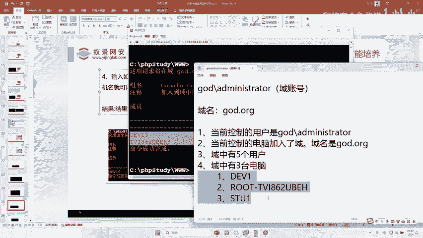

好，那我们接下来往下看，对不对？查询完当前的电脑之后，那接下来我们查看什么，我们去查看一下预，查看查看预控。😊，的IP和他的什么。位置对吧？定位一下这个域控在哪里，对吧？因为我们说了内网渗透。

它其实就是域渗透。所以说那这个域在哪里呢？哎，我们不知道，所以我们得用命令去查啊，这个命令是固定的啊，用这个命令去查一下它预控是多少啊。

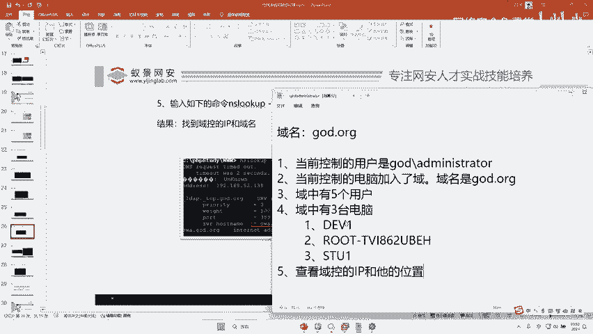

好，我们是不是能查出来哈预控的IP地址是19216852。138，对不对？并且预控的名字叫OWA。这叫OWA对不对？好，所以我们现在就知道了两个信息。第一个信息是什么？你看预控的IP地址是。

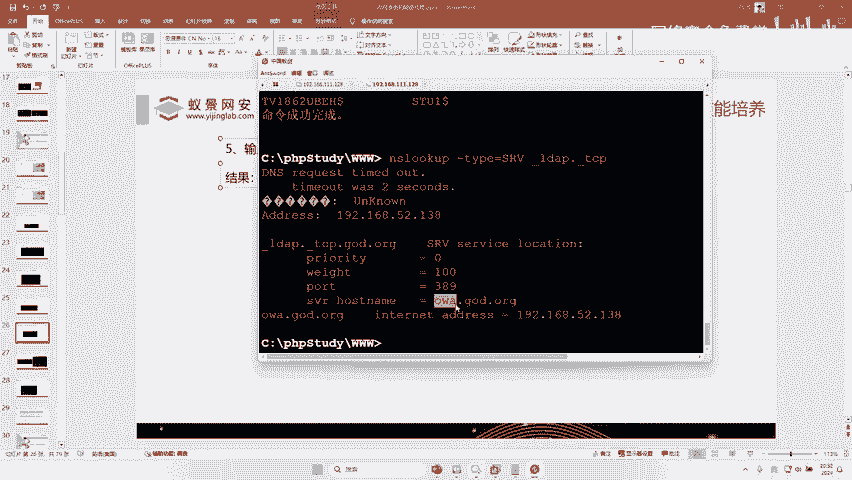

哎，是不是叫这个好好，第二个对吧？预控的预全名。

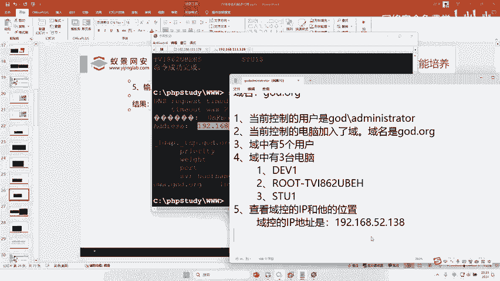

全民。对啊是这个对不对？OWA好，有人可能分不清这个全名是啥啊，域全名啊，这OWE啥意思啊？就比如说这个STE是当前我们控制的对吧？那这个STE在这个域中叫什么名字啊，它叫这个STUE1点什么。

后面要加这个域名。😊，啊，就类似于什么？我说了后面这个是域名，对吧？你看比如说这是一个什么，你看比如这个叫张三啊，那这个班级叫火箭班啊，然后就是火箭班张三。😊，火箭班李四火箭班班主任是不是这样讲。

那这样的话，是不是定位是哪个域中的哪个成员。你看JOD域中的STUE成员。那么这就是他的这个整个系统里面的全名也叫域名啊，也叫域名，对不对？STU什么JOD域中的STE电脑啊。

火箭班的谁谁谁重点班的谁谁谁对吧？因为名字可能重复嘛，对吧？啊，名字可能重复，所以我们必须要什么？后面是域名，前面是机器名啊，所以这你看这句话什么意思？是吧？这火这个这中域的OWAOWA什么？

就是这个电域的什么电脑的机器名啊，就预控的机器名叫OWA那他预控的全名就是OWA点JOD点ORG能不能听懂听懂了，扣个一好吧？我看大家是不是睡着了啊。😊，如果说你第一天没来听，你就听不懂啊。

能听懂是不是啊？啊，我讲的这个已经讲的非常详细了，对吧？你去网上找，你这你你信我你这这个这个东西这个玩意儿你都研究不清楚，对不对？😊，啊，睡睡蒙了是吧？睡蒙了，那你不适合学玩意好，那接下来我们来看啊。

😊，好，我们现在已经知道这三台电脑了，还知道预控啊，其实已经知道了。😊，啊，你是第一天来想离啊，感太感谢了。好吧。好，我所以说呢我们已经知道这5条信息了，那我们其实还可以知道更多信息，对不对？好。

那接下来我们去干嘛呢？哎，我们去查看下什么，查看什么。😊。

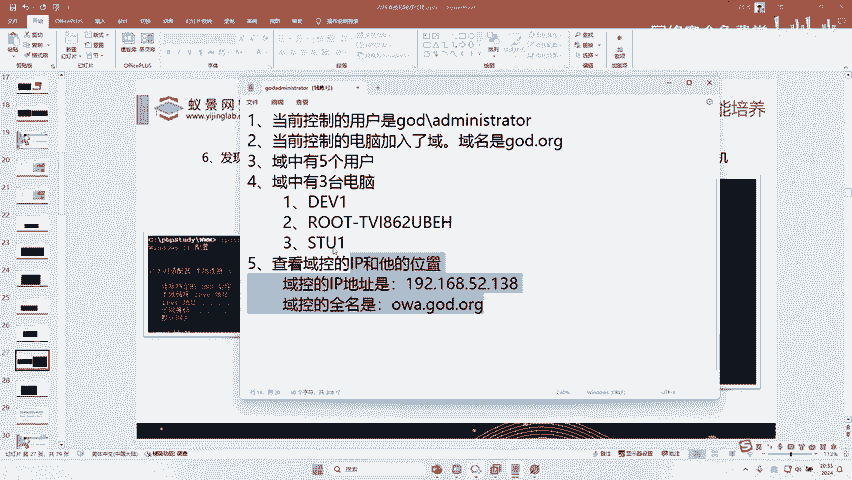

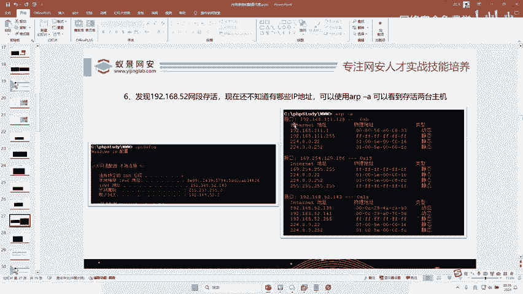

查看一下哎。IP地址。哎，怎么去查看IP地址信息呢？哎，我们在这里输入IP confi啊，可以看到当前这个电脑有两个网段，第一个IP是多少啊，第1个IP是多少？😊，192168111。128，对不对？

第二个网段是不是我们发现了，哎，它这个电脑竟然是双网卡机器，它还有一个网卡是多少？1926852。143。所以我们知道当前控制的这台电脑。对不对啊？他的IP地址是19216852。

143OK是这2个IP那我们是用这台IP把这个电脑控制的那我发现这个电脑还有另1个IP那这个IP应该就是通向另一个网段的地方，对不对？所以呢我们现在也知道大体上的IP情况。那接下来我们还要去干嘛呀？

我们要去看一下这个52的这个网段里面都有哪些电脑存活或者存活，就是存活意思，就是说它正在上线，对不对？或者它是开机着呢？我们用哪个东西呢？哎，这里教给大家一张啊，我们可以用ARP杠A去看。😊。

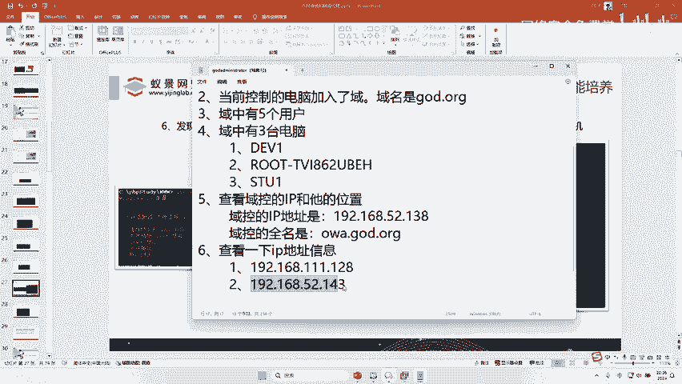

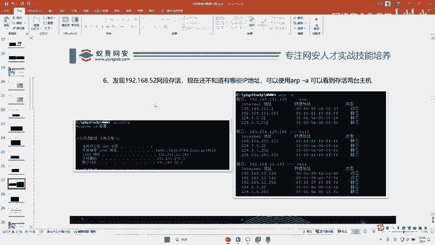

ARP杠A。好，来ARP杠A之后，我们是不是能看到当前有这两台电脑存活分别是多少？52。138跟52。141啊。好，所以我们把它复制出来啊。好。522网段。网断中。的店。有。有两个啊，分别是什么？

分别是他啊。啊，一个是138，1个是141。但我们现在还不知道具体这个138是谁，141是谁，对不对？只知道它的IP地址啊，当前控制这台电脑IP地址是143。好，还有一个叫138141。好。

那接下来怎么办？确定138是谁，141是谁，对吧？我们就拼一下域名就可以了啊，第七步要确定这2个IP对不对？好，我们就拼一下啊，怎么拼啊，比如说我们去拼一下这个DV啊，我们就拼一下这个对吧？你看拼。😊。

DEV点多少？点JOD点ORG啊，拼一下它的什么域名就会得到1个IP地址。来看它存货不哎，找不到主机啊，那就证明这个DV要么关机了，要么我们拼不通，对不对啊？一般来说都能拼通啊，这个域名。只要家油玉啊。

他开了防火墙也是能拼通的啊。😊，好，所以这个电脑拼不通。好，我们来拼第二个这个。😊，好，拼下这个。来看一下能不能拼通，哎，是不是拼通了。拼通之后，它返回的IP地址是52。141，对不对？

所以我们确定了这个52。141，它是哪个电脑，它是这个电脑。啊，它对应的是这个电脑。那这个138是谁？其实刚才已经在这里给他查出来，对吧？对应的是预控。😊，好，所以现在我们思路就比较清晰了，对吧？

在域中它有两台电脑，一个是预控叫OWA点JOD点ORG它的IP地址是138，还有一台电脑叫这个啊，它的IP地址是141，还包括什么？还包括我们当前控制的这个143，对不对？好，我它的全名叫什么？

是不是叫STOE啊，这是我们当前控制的。哎啊这个什么已经控制，对不对？已经控制。对不对？好，所以现在的话我们思组就明明确了，对吧？我们接下来就要把这两台电脑控制下来。

那么这两台电脑又跟又是这个138是预控，对吧？我们这里已经说出来，这个是什么是预控。😊，啊，那这个是什么？是域内主机。啊，域内主机啊，所以我说了优先是打谁呢？优先是打预控。

所以我们首先要把这个电脑控制下来，这个电脑搞定了，对吧？其他电脑那不是手拿把掐嘛，对不对？好，所以我们要把这个预控给它控制下来。好，那接下来就我们上线控照预控了。😊。

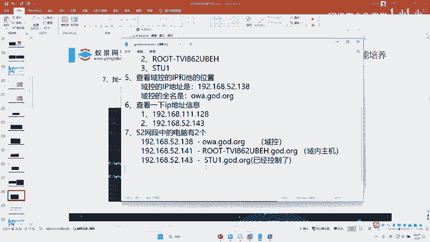

