# 2024B站最值得看的黑客教程 ｜ 网络安全／渗透测试／内网渗透／漏洞挖掘／web安全／kali linux／红队靶场／CTF／信息安全 - P111：蚁剑到CS的迁移上线 - 网络安全免费学 - BV1uBsTetEow

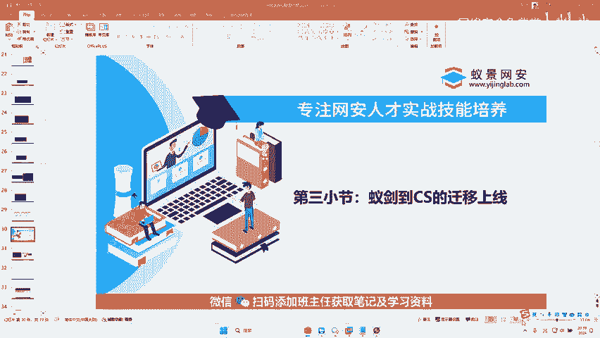

看一下怎么去控制优控。好，那接下来查大家看可以看到，对不对啊，我刚才做的这些操作，它都是什么内网信息收集。你会发现内网信息收集大多数靠的什么啊，靠的就是命令，靠的就是计算机命令收集啊，还有一些工具。😊。

啊，工具命令啊，跟我们的web的新收集，你看那些端口扫码就不太一样，对不对啊？😊，好，我们知道这些信息之后呢，要干嘛呢？哎，要去干嘛？要去进行一个操作了，就是什么呢？我们内网渗透啊，对不对啊？

那怎么内网渗透呢？哎，在内网渗透的之前有一个前提啥啊。😊，需要使用MSX或者CS。CS进行渗透。哎，对不对啊？好，所以我们在进行内网生的时候，我们现在控制这个电脑，是不是用已键控制。

那么已键它是有局限性的，它只能用这个命令啊，它不不好，对吧？那么weshop管理工具可以执行命令，但在实际上一些操作是受限的对吧？比如说我用这个已键想提全呀做隧道啊，它就比较麻烦，对吧？

这个时候呢我们就要把已键这个权限或者把已键这个工具用一个工具去替换，用哪个工具呢？一般业内我们要么用这个MSF啊，是不是这个大家应该很多人都学过，对吧？用这个MSF进行后视要么用我们的tract好。

那么这两个工具哪个用的多啊，一定是这个用的多啊，全世界的人都在用它是不是那你也就用它说那为什么他用它MSF在开中那么有名，为什么不用呢？啊MSF也有名啊MSF它是命令的。😊，命令形式对吧？

你发现你用MSF是要敲各种命令啊，复制各种脚本，对不对啊？那么我们的cotract它是什么图形化的。😡，啊，你要做任何操作，只用点点双击，点点双击右键粘贴。明白吗？点点双击右键粘贴。

我们就可以实现远程控制了啊，所以说这个costruct是傻瓜式的，傻瓜式的，明白吗？所以兄弟们啊用这个就就完事了，对不对？好，那怎么用这个我们得先把它安装起来，对不对？好，那怎么安装啊？

李哥在这里再手把手教你安装一下，好吧。好，我们打开一个这个windows和电脑啊，我带大家全新去安装一下，好吧。

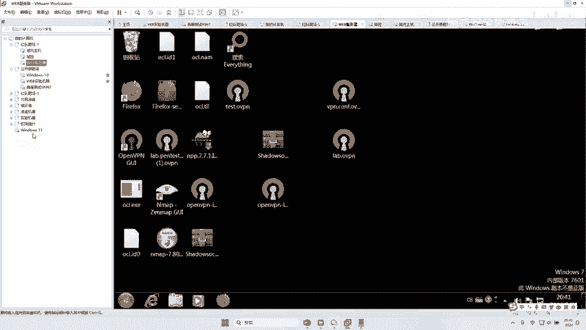

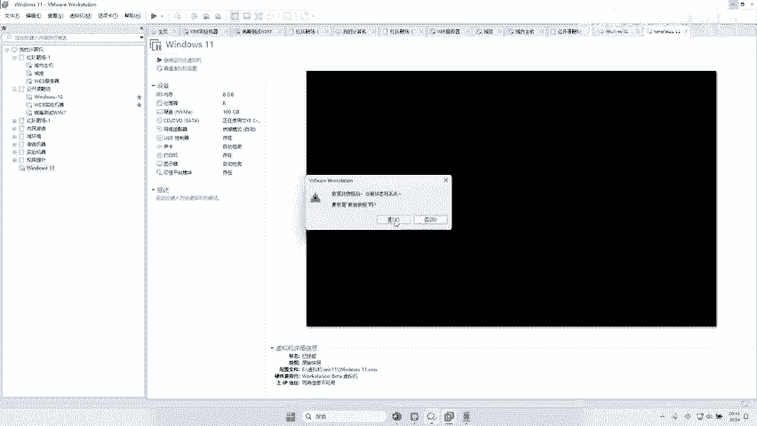

啊，首先这里会用到两个工具啊，这两个工具呢李哥在这个啊。😊，编这个在那李哥在这个什么哎，等一下啊。好，这两个工具呢哎李哥在这个嗯网盘里面已经给他家提那个啥了，对不对啊，就是这两个工具已经给大家上传了。

对不对？😊。

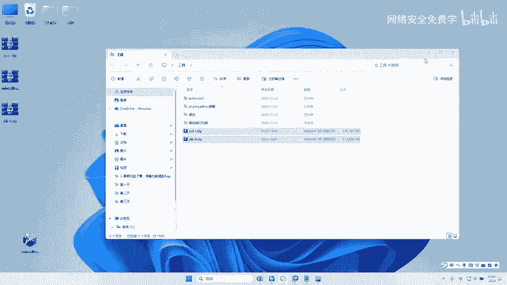

好，这是这两个工具啊。啊，一个是我们的这个GDK8啊，就是我们要用的这个cotract这工具，必须要用到这个GDK啊，这是它的什么运行环境。还有一个就是这个工具啊，所以我们需要把这两个东西呢。

什么传到我们的这个电脑上来啊，你直接可以在自己的电脑上装啊，装好，我们给它复制进来啊，非常简单，所有的操作就是双击啊，所以我在这里呢就一步一步教大家去双击就可以了。好吧。😊。

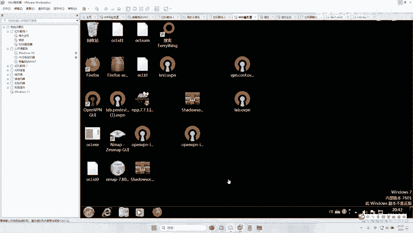

啊，虽然你看不懂，但是很高级啊。对呀，你像这些东西呢，你自学你肯定都学不懂。你你自学的话，你就你就人家有人讲，但是你不知道是干什么的，兄弟们明白吗啊？😊，MSF用的较少啊，你信我啊啊，有人在用对不对啊？

只是某些条件下要用MSF大多数80%的工作都可以用到这个cotract。

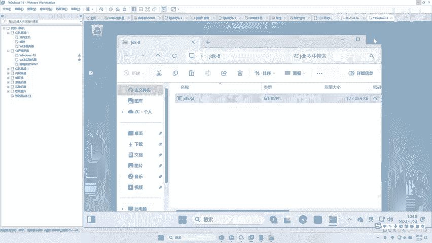

我java的解释器安装啊，对，如果你电脑上有java吧，那就不用装了。如果你的家电脑没有需要安装一个java，明白吗？啊，明白吧，你说M木马生成多是的啊，它有自己的优势啊。好，那但是我再次告诉你。

80%都是用CS啊啊。OK好，我们先把这个java这个装实战一在对，实战就是CS哈，那些打红李哥打红的打了4年用的都是CS我就没用过MSF我照样打，对不对啊？😊，只是在某些条件下啊。

要用到MSF对不对啊，为什么？因为这个东西它是一个多人运动的工具，它可以多人同步协作，明白吗？好，那这个java怎么装啊，就把这个工具打开，然后下一步就可以了，全部无脑下一步这都会吧啊。

无脑下一步都没有问题吧。

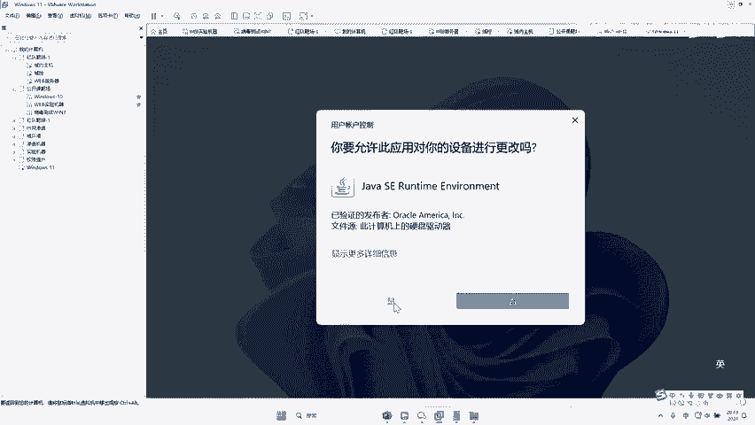

啊，就无脑下一步就完了。然后环境变的什么都不用配置啊，就直接就行行就行了啊。😊，问到下一步。但是如果说你的电脑已经有java了，对不对？😡，那就不用再装了啊啊不用装了啊，如果没有的话。

装一个8版本的好不好啊？装一个8版本的啊啊，舞导下一步。然后呢，舞导下一步完了之后呢，把李哥给你的这个CS呢哎给他打开啊，拖进来。😊，拖到你的电脑上来啊，记得呢。😊，啊，有砂染的，最好把砂染关一下。

对不对啊？因为你的上染可能会把这个工具这个工具就是正儿八经的远控工具啊，远程控制远程控制工具好不好啊？

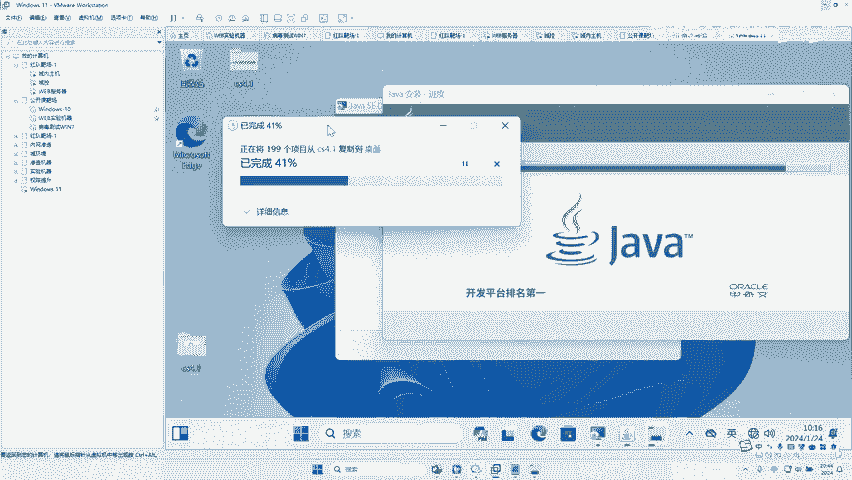

好，我们把这两个工具先复制到桌面，好不好？啊，那这个java也马上21版本啊，221有点太新了啊，我们一般是GJK8啊，JJK8或一好，然后关闭啊。😊，好。

然后接下来就运行我们这个CS那这个CS怎么去运行呢？啊？我教大家对不对？首先啊听好了，打开你的这个CMD。😊。

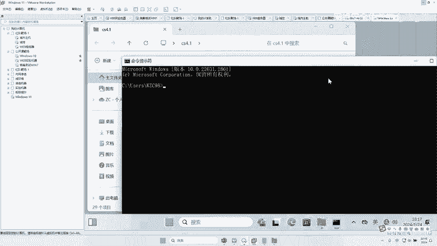

哎，必须是什么CMD啊，必须是以管理员运行的。你看在这里运行CMD好，我们右键以管理员身份运行，先打开一个窗口，好不好？一步一步给我操作，然后呢把你的这个当前这个CS这个路径，对不对啊。

CD一下就进入到这个文件夹里面去啊，然后查看一下你电脑的当前IP是多少。你电脑的当前IP是不是19216881。555好先复制一下，然后在这里输入什么。

输入team server点BAT输入你的IP地址，后面输入123456啊，你就按我这样的格式去写be设输你电脑的当前的IP地址，这里输1个123456好，我们回车。😊。

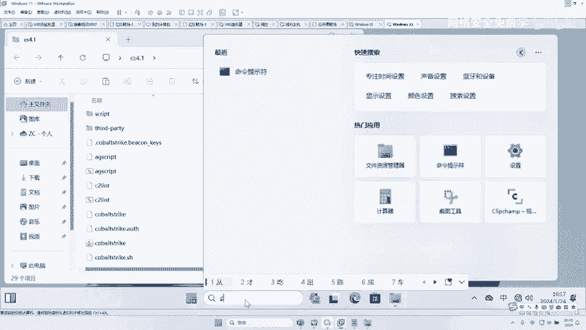

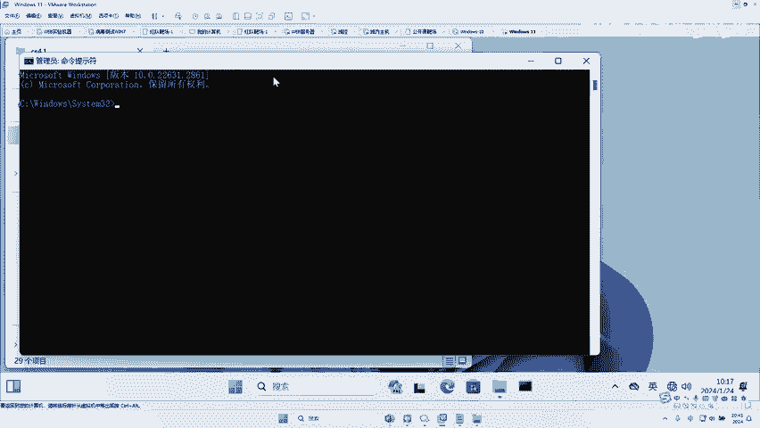

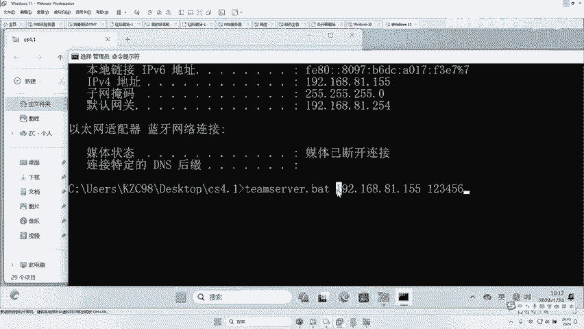

好，那这个客户端就要启动了，你点击一个允许。好好，把这个先起来，起来之后呢，再往下翻运行哪个呢？运行我们这边有个CN看到了吗？啊，李哥给你这个CNCN就是中文版意思啊，我们直接双击运行。😊，哎。

它会弹出一个这样的界面，对不对？好，那这个界面里面这个主机这个IP地址写多少呢？哎，就写你在这里这一块的你的当前电脑的IP地址。好，这里这个端口写多少呢？哎。

这里是不是有一个server is up on是吧？server开的端口，哎，这里是多少？9081，那我我们就要写9081O这个密码是多少呢？就是这里的123456好，你就写123456，点击连接。😊。

好，点击是。

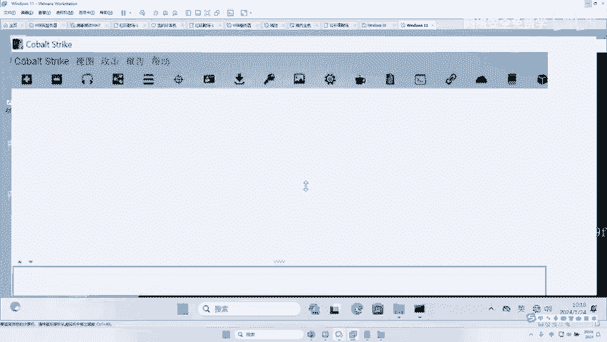

好，那么这个远控工具它就开机了，明白吗？啊，是不是用起来非常简单。好，那接下来就在我们的黑客的电脑上去把这个工具给它运行起来啊。😊。

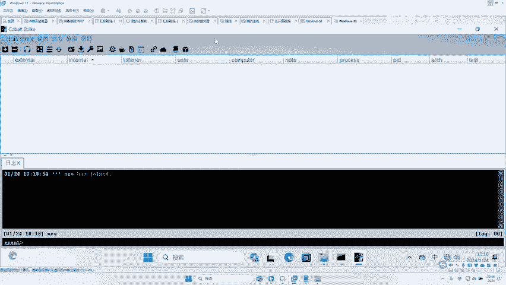

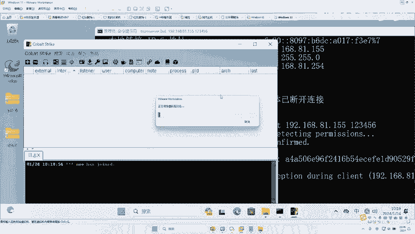

好，我拿我接下接下来去做实验了，对不对？好，拿开我的个工具啊，找到我的这个CS。😊，啊，然后把它呢拖到我的桌面来。然后顺便呢啊你看这里是不是爆一些毒啊，对不对？好，那为了防止我的CSU问题，我先把什么。

先把我的这个杀软给它关掉。好，我把我相关的一些工具先关掉，对不对？OK兄弟们，现在呢把这个CS干嘛的啊，给它。😊，哎解压出来啊。提出来。就解压出来。好，解压到时候桌面了。

然后按照李哥刚才给你的步骤啊干嘛呢？哎，一步一步的把它干嘛，把它解开哎。😊。

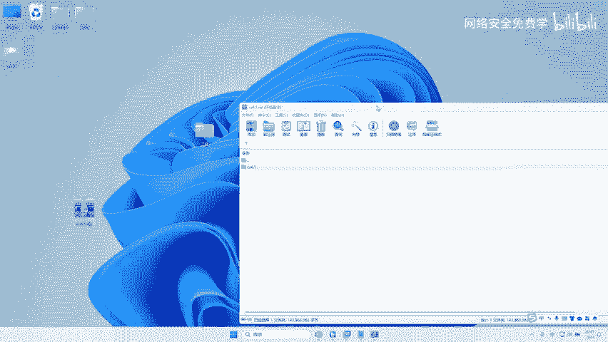

好，首先在这里呢是我们的1个CMD，对不对？😊，把我们这个路径呢先复制一下啊，我们当前costruct在这个路径下，然后第一步对不对？😊，打开用这个管理员啊，一定要管理员啊，不用管理员打开的话啊。

他这个不行啊。好，我们CD进来。好，然后这里要输个IP地址，对不对？那这个IP地址是多少呢？啊，是这个192168111。1啊，一定要是这个IPR啊。

一定你们每个人应该都是这个IP如果不是这个IP你就搞不定了，好不好啊？111。1啊，为什么是111。1呢？你看因为我们的外b机器是跟它可以拼通的啊。😊。

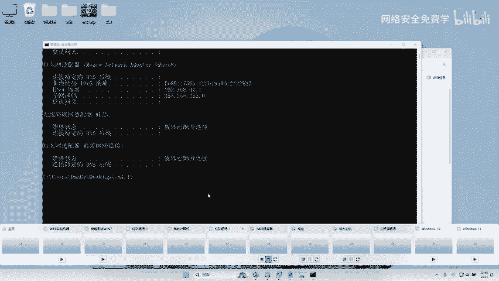

啊，你看我外表服务气来来看一下，它是能拼通这个111的。

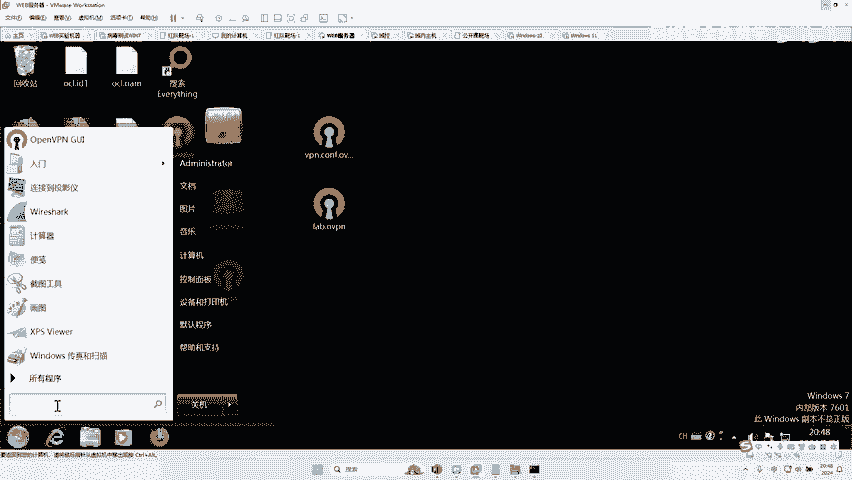

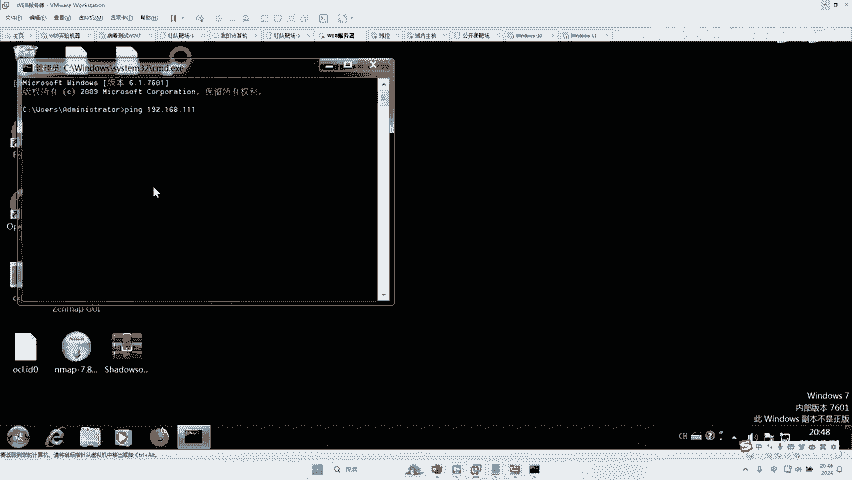

你看啊，因为这个电脑是跟黑客点访问的，我们黑客就是通过11。1跟外部机器进行访问的。所以我们在这里得输入team server点BAT啊，11。1123456对不对？好，然后回车。

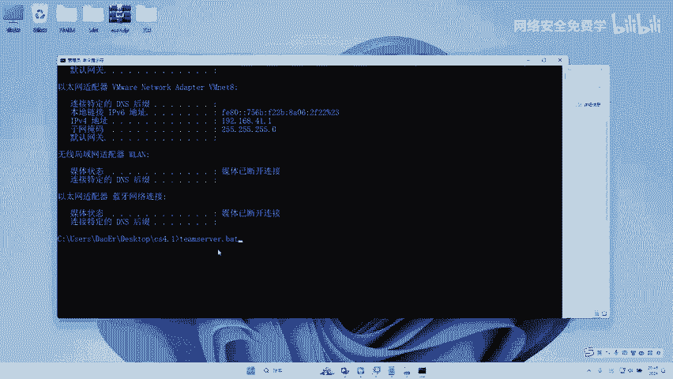

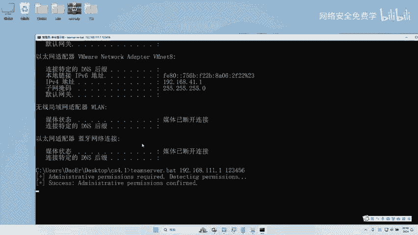

好，哎，这你看是不是9081端口就运行起来了，运行起来之后呢，再去干嘛呢？哎，打开我们的这个CN。

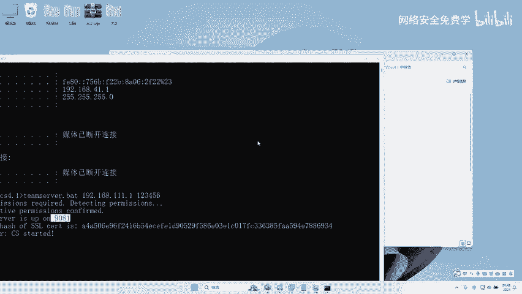

啊，这个里面这个CN工具，对吧？我们双击。😊，哎，是不是出来了？好，我们连接192。168。111。1。好，输入端口9081，输入密码，123456点击连接。啊，是。

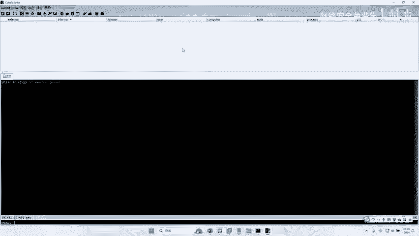

好，那么现在呢就进入到我们的CS页面了。好，那接下来啊大家就要利用这个东西，对不对？去进行控制对方电脑。好，那这个工具啊很多人可能没有用过，对不对啊？没有关系啊，李哥在这给大家去简单介绍一下，对不对啊。

这个工具它是一个远控工具，可以干嘛呢？可以去生生成一些木马生成一些钓鱼链钓鱼链接，做一些横向移动啊，做这个可以批量去控制别人抓肉机都是可以的，对不对啊，那你看很多肉机也也都用这个工具，对不对啊？😊。

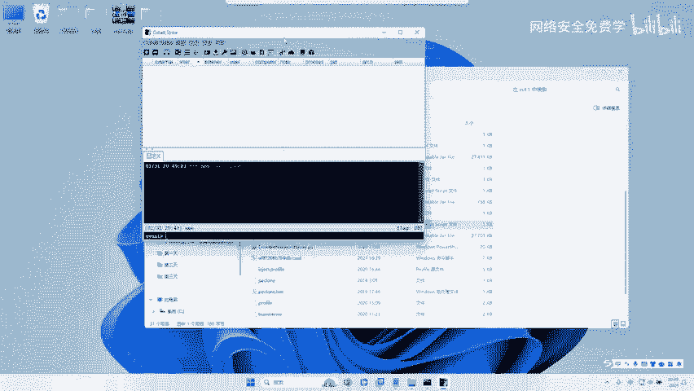

啊，如果是外网，对，如果是外网IP，那你一定要填外网，对不对啊？好，那首先接下来我们怎么把已键？因为我们当前控制这台外，它是已键，对不对？已键我说了不行，我们得把它换到这个CS那CS怎么控制。

我们得先生成一个木马，对不对？好，那怎么生成木马呢？李哥在这里已经给它写好了，对吧？第一步点什么啊，先创建一个监听器啊，先创建个监听器。好，那我们创建监听器点击这个了，对不对？点击这个监听器管理好。

先把它删掉啊。😊，啊，点击这个ADD添加啊，这里名字随便写啊，写个CShos地址啊，你就写11。1这个端口随便写啊，我们比如写个7865哎，就这样一写就行了，对吧？点击一个servver，哎。

先把这个监听器给它监听，创建好，创建好之后呢，我们再看下一步是不是就要创建一个木马了。你看这里是不是能生成一个后门，后面就是木马，生成一个windows后门，哎，然后我们生成一个windows的木码。

对不对？哎，我们点击这个什么攻击生成后门windows eXE后码，啊，然后把这个木马呢哎选一下这个监听器啊，监听器选择刚才我们创建的，对不对？好。

这里呢这个january点击生成生成的时候把它放到你电脑的桌面。😊，此电脑哎。thatstop对不对？好。名字呢起个名叫一，这都没问题吧，就是把你生成的木马呢，哎放到你的桌面叫个一。

那这个时候你看这个木马就生成了，对吧？那么一旦。😊。

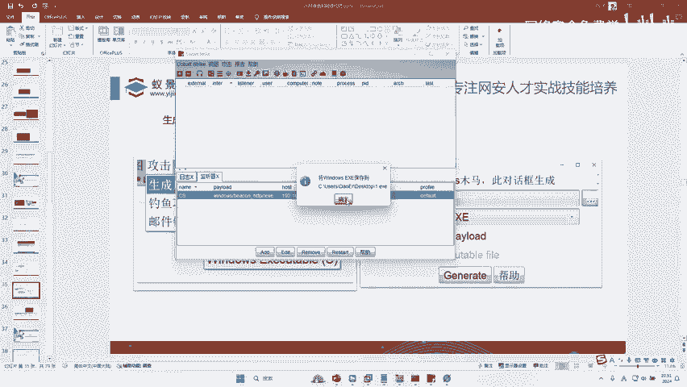

啊，对方电脑运行这个木马，那你的CS就立马就上线了，对吧？它就是个病毒，你在他的电脑上运行它，那么你的这个远程工具就可以通过这个远程工具连接这个木马，然后就把它电脑控制了，对不对啊？

那么当当时我们讲这个这个工具控制，我们是用那个网站的web shell。那这个。😊，CS控制它要用到木马，对？那这个木马怎么运行呢？哎，我们就要借助已键，对不对？先进入到这个这里，然后我们点击上传。😊。

把我们的木马传进去，然后再用已键去干嘛去运行这个木马啊，直接运行1。EXE，对不对？所以说好，那么这个时候就等待一下啊，它运行完成之后，哎，这里应该就会上线了，对吧？所以我们就等一下看它能不能上线啊。

😊，哎，大家稍做一个等待啊。好，你看运行这么久，它还没没成功。对吧？那我们再运行一遍，1。1X1哎，再运行一遍，必须要让它上线啊。如果说没有上线，那我们就这个任务就做不下去了，对吧？啊？

我们等啊等了一下，你看发现它没有反应，对吧？好，这里毫无反应，是不是毫无反应。那这个时候怎么办呢？哎，我们要检查一下自己电脑是不是有问题啊。😊。

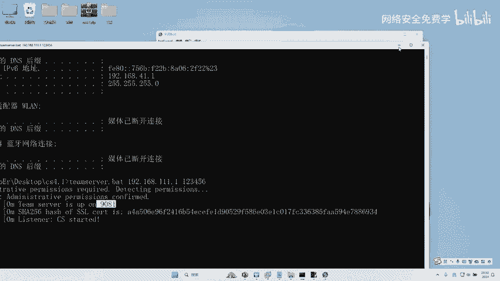

好，怎么检查？哎，我在这里去拼一下，拼192。168点。111。128回车。哎，能拼通，对吧？我们听一下拼一下192。168。111。1。哎，也能拼通，那按道理来说应该是没有问题的对吧？

那为什么上线不了呢？哎，我们嗯看一下这个蓝调不不是不是蓝调的啊，然后呢，我这样。我先检查下我的电脑，对吧？我电脑没有问题啊。我去这里看一下啊，是不是没有这个。没有执行啊。

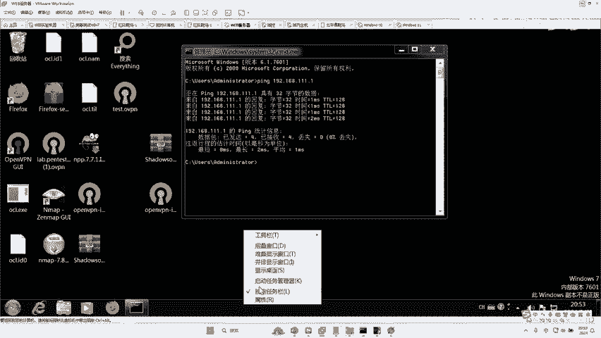

好，我们检查这个进程，你看这里这个1。EXE都没有运行起来。是不是就没有运行起来，所以这个木马它就没有运行起来啊，没有运行起来，那肯定不行啊，木马没有运行起来，那肯定不成啊，对不对啊。

所以我们得让木马运行起来。😊。

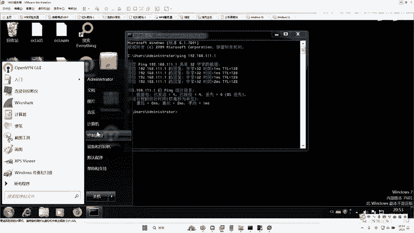

啊，所以应该是这个已键这里的问题，对不对？好？我们把已键先关掉啊，然后干嘛呢？然后呃清空下缓存。好，再双击进去。OK然后我们在虚拟终端啊重新进一下啊，1。1XE啊，再运行一遍，好不好？啊。

李哥再排查一下，对吧？我们双击打开3W啊，双击运行，看双击能不能运行，好吧。啊，如果说双击不能运行，我们就重新把这个木马生成一下啊。你看这里双击运行了，对吧？啊，还是不成，对不对？是不是还是不成？哎。

所以呢这就是有问题了，对吧？我们在干嘛呢？哎，把这里的重新设置一下，对吧？我们来检查一下我们刚才设置是不是有问题，我们重新设置一个监听器。😊，好，点击。监听器点击ADD我们起个名字CS好。

这里叫ATDPhouse192168111。111。1。哎，这个端口呢我们随便写个9987。好，点击s。然后再去生成一个木马，生成后门这个windows e差异啊，我们选择这个19268111。1啊。

然后生成windows木马，再来一遍啊，再不行的话，老师这个。发现不了我们现在的操作是不是都在我们自己的黑客电脑上，怎么能发现呢？对不对啊，那你你觉得黑个人电脑就是3分钟吗？对吧？不可能啊，对吧啊。😊。

而且实际的操作起来，你要你要比这个困难更大，对吧啊？好，我们来再来上传一下啊，上传一个文件啊，2。EXE啊上传上去啊。😊，啊，这个我可能知道是什么原因啊，可能是我的这个以这个CS有有点问题，对吧？

我的CS有点问题。因为我今天给大家做CS的时候，我是做了一个精简版的CS啊，精简版C如果这不这个不行的话，我重新打开1个CS好吧。😊，你看这里还是不行，对不对啊？所以就是这个工具有问题了啊。

我们在这里用我的这个CS好吧。😊，来，我来找一下我之前的CS啊。好，我打开一个全新的啊。CS。4。1好不好啊？OK我们来看看，我找一下我最早的这个CS4。1啊工作调训练营。好，我找到这个啊。

这个应该没有问题啊。这个是我之前最早用的这个PR好，我们用这个CS啊。好，把这个工具先给他删掉啊。好，打开我们的CS4。1负屏啊，那肯定有负屏啊。好，我们用这个叫这个呢这个比较完善完整一点啊。😊。

我怀疑是他把这个什么一些东西给我删掉了啊啊，但我不确定啊，我只能再试一下啊。😊，啊，这个应该没有问题啊，这个我用的比较久啊。好，我们再来一遍好不好啊。😊，CD到这里那边来，哎，我们把这个。

复制进来CD。好，输入tserv点BAT192。168点111。1，对不对？123456回车。好。回收好之后呢，用CN。

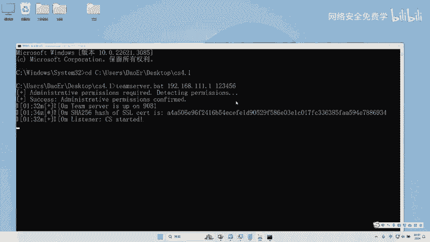

好，打开这个CN好，然后这里我们再做一个操作吧啊，我们在我们的电脑上再做一个操作。我们把我们的电脑防火墙关掉好不好啊？因为它这个可能跟端口相关啊。啊，这个房向已经关掉了，对吧？啊。

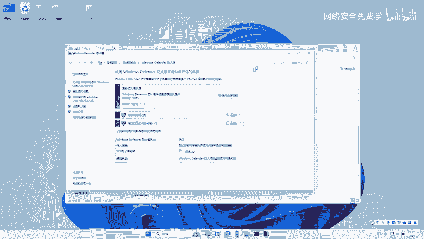

啊，连接。好，再来一遍啊。

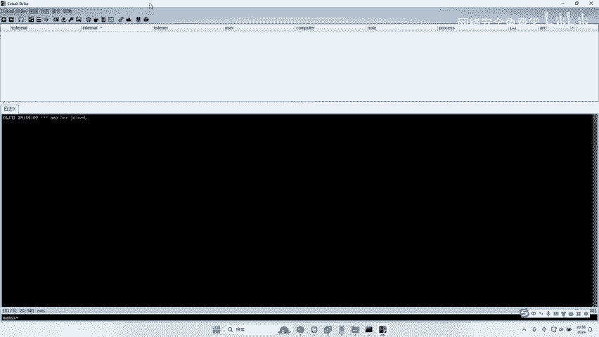

监天器。O。remove对吧？ADD。好，CS。192168111。1OK。好，端口的话写1个8888。Save。好，点击生成后门。啊，你看你像李哥做了这么久，对不对？你看他现在在运行这个东西的时候。

他是不是还是有一些问题啊，对吧？所以你看这个网络安全，他学习他就是这样的啊，他就是各种问题啊。😊，就是我中午给大家调试的时候都是没有问题的啊，OK的。但是你看现在在这里运行起来的时候。

是不是多多少少都有一些问题啊。好，我们把这个工具呢哎通过一键再给它传进去啊。😊。

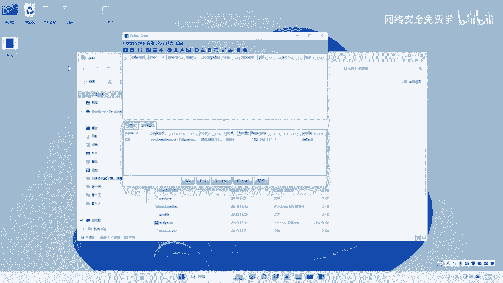

好，右键上传。啊，再传我们的第三个木马啊，这个如果还不行啊，那咱不是凉了吗，就是还怎么玩呀，对不对？😊。

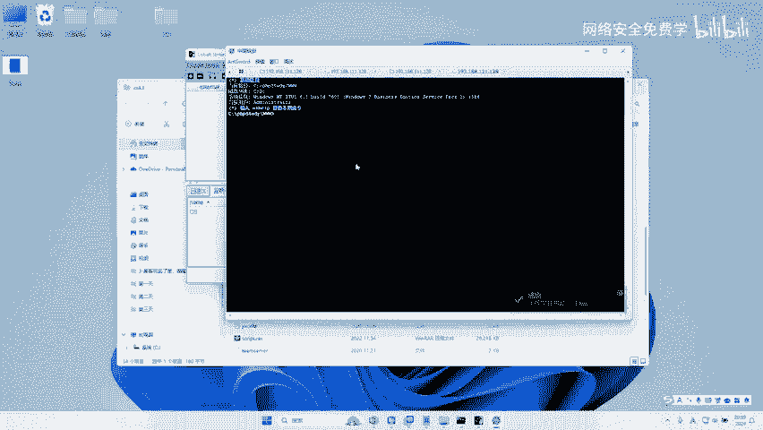

好，3。1X1。好，回车。啊，这个是你看是不是直接成功了，对不对啊？没有问题，是不是成功了啊，所以刚才的原因就是啊这个CS的工具有点问题，对吧？那么可能是因为我的沙软在解压的时候把它给删掉了啊。

所以我们的时候还是要注意一下啊，不要让那个杀软去删掉里面的一些东西啊，不然你的工具什么出bug了，这是我你看我在直播的时候，我给大家去解决，因为我做的比较多，我我是知道怎么调，怎么调，就知道问题在哪了。

如果是你们做的话，我可能说你半小时，你两个小时你都不知道问题在哪，对不对？😊，好，那你看这里是不是上线了啊，这里是有一条记录。你看我当前19216811。128是不是已经控制了这台IP地址了。好。

然后我们点击这个什么sleep啊，让它休眠一秒，点击右键进入这个什么BEACCON啊。好，这里底下有个框框，看到了吗？😊，啊，在这个框框里面，大家看在这个框框里面就可以执行一些操作系统命令啊。

就跟我们已建的用法是一样的啊，从而去控制别人电脑啊。比如说我们在这里执行shall，对不对？IP con。啊，来看一下。啊，那这个sha是什么意思？就是执行命令的时候，必须前面加个share，对不对？

哦，然后执行IP configurefi什么意思呢？就是用CS生成一个木马，然后通过什么，通过我们的已键把木马传到这个web服务器上，传进去之后呢，哎我们用个已键去运行这个木马。那么已键运行完木马之后。

这个CS就可以控制住了，是不是控制住那个web服务器了。好，然后我们就可以在这里去执行一些命令。你看你看是不是就能看到里面的信息了，对不对？😊，看到你们信息了。哎，好，信息都在这里面。好。

那接下来我们是如何利用这个东西去进行横向移动的呢？啊，我们的目标是不是要控制谁啊？是不是要去控制预控，对不对？我们刚才说了，我们的目标刚才这里已经写的很清楚了，对吧？我们要去控制这个预控。

我们现在已经把我们的什么木马远控的东西迁移到了CS上，对吧？因为我说了后渗透一定用的是CS啊，大家不要用MSF你就用CS对不对啊，一定用的是CS那么迁移一晚上进行来之后，我们就要进行什么。

把这个预控控下来了。那预控怎么控这个技技术呢？它叫什么，它叫横向移动技术啊。😊，横向移动是什么？啊，横就是横着走，对不对？你看比如说在电脑里面，它在这个公司里面，它可能有100台电脑，对不对？

我们横着把它一台、两台、三台、四台、5台、6台、7台、8台、9台、10台，这么多电脑全部控制下来啊，横着控制控制下来。这个技术叫做横向移动。横向移动啊，用的是APP的常用攻击。什么叫APP。

就是高级可持续攻击组织，一般会用横向移动啊。你像你们如果学网络安全，你们都学不到横向移动啊，那什么时候学横向移动啊，你工资如果想拿3万，你就要学横向移动啊。你说老师我的工资就想拿个1万多啊。

那你不用学横向移动。😊，啊，因为1万块钱技术啊，他还不配拥有这个技术。如果你的公司想拿个3万4万，想打高级红队，对不对？那这个横向移动你是必须要学的啊必须要学的啊。好，因为这个横向移动呢啊。

简单来说就是通过一台电脑去控制整个公司电脑，对不对？啊，所以呢现在我们要干嘛呢？啊？我们就是说我们要通过什么电脑？我们通过web服务器，从而去控制公司的预控啊，这个也是属于横向移动。

那么横向移动的方法有很多啊，就是它的横向移动方式有很多有很多技术都在里面什么SBPSEX这个PTTPDKPTHC对不对？还有我们还有我们的这个EXE这个还有什么com技术，对吧？M技术技术，对吧？

等等等等，十几种工具，十几种方式都能横向移动。那么今天我们就讲这个IPC dollar进行横向移动的一种方式啊，理解没？就是它有很多方式。但是因为时间有限，我们只讲一种其他几种方式也是可以横向移动的。

哎，明白吗？好，那接下来因为我们讲这个IPC调了，我们来看一下这个IPC是什么意思啊。那这个IPC啊，就这个你看英英特尔程序链接，对不对？是它英文名，对吧？IPC就是英特尔程序链接啊。

反过来我们中文就叫什么命名管道啊，那这句话是什么意思？就是说它叫一个管道，就是说这个A电脑和这个B电脑之间，如果建立了这个IPC的管道链接，那么A电脑就可以向B电脑去上传或者下载文件。😊，明白吗？

这个叫IBC你看本来A电脑跟B电脑之间是不能上传文件。就像我们当前这个电脑跟预控，我像预控是传不了东西的，对不对？那只要我跟预控之间建立了这个IBC管道，那我就可以A电脑向预控去干嘛了？哎。

去上传下载一些文件，那么我们现在控制的是这台外b服务器，对不对？那么一旦我跟这个预控建立了IBC那么我的黑客就可以通过这个外b服务器，把木马传到这个预控上，从而让预控被我们的黑客控制，就这么简单。

那你要建立IPC是非常简单的，有一个前提啥，必须要知道哎这个预控的账号，就这个预账号，啊，那这个预账号昨天我们已经知道了，对不对？我们已经知道他的账号密码了，所以接下来我们就可以直接去进行什么控制。

那也就说那我现在还不知道怎么他的账号密码啊，昨天给大家讲了，对吧？如果你真的不知道我们这里CS它是自带啊，直接读取电。😊，我的账号密码了啊，我们这里也能读取出来，大家看一下。

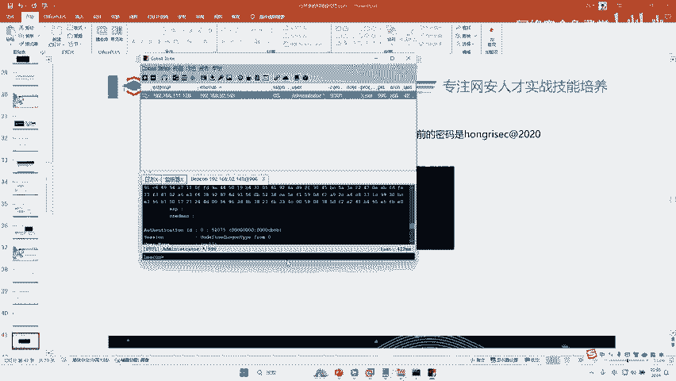

哎，往这里翻。啊，今天的内容可能比较难啊，但是大家没有关系啊，你可以多听一听。你看是不是跟我们昨天那个那个已键读取的是差不多的。你看 administratorminstr是账号，红日SEC2020。

是不是他的账号密码是不是都读出来了？读到他账号密码之后，我们就可以进行横向移动了？好，那怎么去建立IVC啊，李哥把这个命令已经给大家写好了。好，就这样去写。😊。

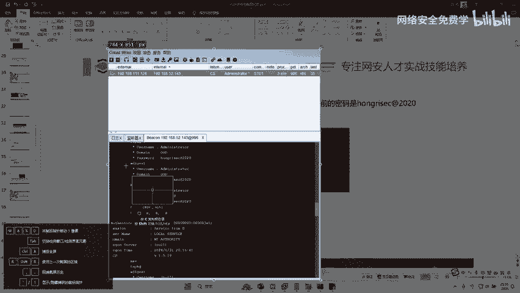

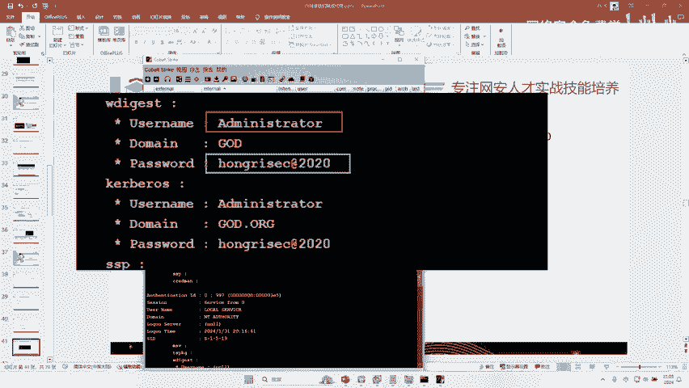

啊，你看net user，我跟谁啊，我跟19216852。138就这个预控建立这个IPC管道，用这个密码。然后用哪个账户呢，用这个GOD这个预管这个账号，对不对？好，我们输入这段话。好，在这里输入。好。

你看它是不是提示什么命令执行完成。那么这个时候呢，我当前的这个web服务器，对不对？就和这个预控建立了1个IPC的管道，对吧？不信我们去看一下。

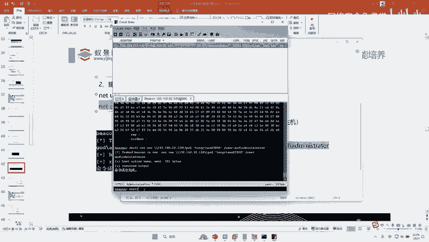

啊，我们用net柚子看一下。大家看一下。

哎，这里是不是写了我跟这个电脑已经建立了这个管道，就类似于啥，你家跟我家啊之间，我们俩打通了一条小路。我们可以通过这条小路进行一些物质的物资的传送，对不对？那么我们就可以凭借这个管道，对不对？

进行远程控制。好，那这里说问题来了。有人说李哥呀，那是不是这样控制的，我只要把这个3。EXE传到预控上，然后去运行这个3。1XE，我这里就可以上线了，大家觉得对不对呢？刚才我们是不是用这个生成一个木马。

那么我们现在直接把这个刚才生成的这个木马传到预控上，你说这里能不能上线，觉得能上线的扣一波一，觉得不能上线的，扣一波2。😊。

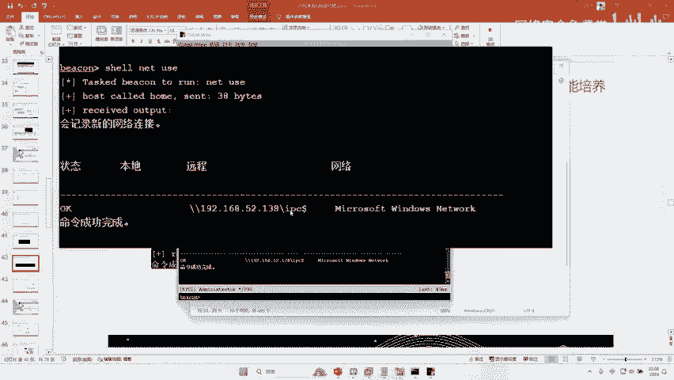

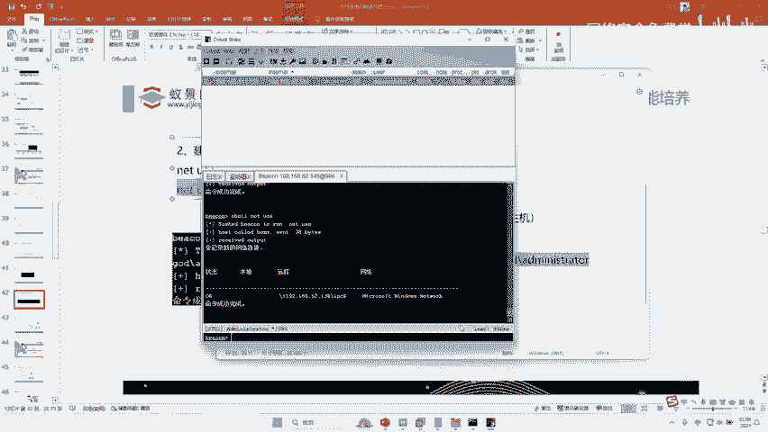

为什么不能上线？😡，为什么不能上线？😡，为什么不能上线？好，为什么不能上线？李哥在这里给大家解释一下。😊，好，我给大家解释一下为什么不能上线，好不好啊，确实是不能上线，但是不是你们说的那么。😊。

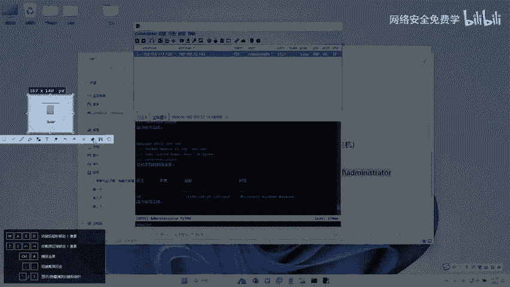

那么东西。好，我们来看一下为什么不能上线。😊，好，我们刚才生成的这个ESE是不是在黑客的电脑上，然后通过已键是不是传到了这台电脑？😊，然后呢，CS。对不对？通过控制这个连接这个木马。

从而是不是控制了这台电脑。那现在我们假如说把这个东西放到了这里。那他能不能控制呢？不能啊，因为不出网呀，我说了对不对？黑客跟这个预控它就不在同一个网段，是不是啊？黑客只能控制这个111。128这个网单。

但是这台电脑它是52。138呀。这个木马也是走的这个我们刚才那个监听器是不是就是111。1啊，是吧，是不是111啊？😊，那你就控制不了，对吧？那我们那个IPC只是干嘛？

只是说你在这个web服务器啊跟预控之间对吧？做了一条管道，对吧？我们只能干嘛呢？我们只能说把这个EXT传到这个外b服务器传上去之后呢，然后我们利用IPC对不对？把这个木马传进去，你只能传进去。传进之后。

一旦你运行了，不好意思，这里个网就出不去，所以你就控制不了。明白吗？啊，IPC是可以执行的，因为我们现在已经把这台电脑控制了，对吧？我们远程操纵这台电脑跟预控之间建立IBC的啊，它们之间可以传输内容啊。

就是他们之间可以，你可以把木马传到这个电脑上啊，黑客先把木马传到这个电脑，这个电脑再跟他建立IPC传进去好，传进去之后呢，就算你能运行这个木马，对不对？它也是不能访问的。因为网络不同。😊，对不对？

那这个时候怎么办呢？啊，怎么办呢？😡，来，我们就要用到什么？用到隧道知识了。啊，之前我讲了内网渗透，我们渗透是不是有步骤啊，就先这样删项是不是有一个内网代理。😊，啊，是不是要隧道隧道是干嘛的？

隧道就是为了解决这个问题的。好，我们回到这来看一下，那有没有一种情况或者一种可能啊，我让这个木马，你我能不能做一个木马，然后木马呢想去连接黑客啊，本来来说本来的话我直接访问黑客，它是不行的对吧？

因为我们之间不同，那这个时候怎么办呢？我这两个电脑之间我搭建一个隧道，是不是搭建一个隧道，我让木马这个流量先到we部服务器，外b服务器再到黑客，那是不是就实现了控制它，对吧？我们流量直接这样出不去。

那么我们上线这个不出网机器的时候，让这个流量先走到这儿再走到这儿，那么这台机器就是我们的什么跳板机。😊，对不对啊，我们借助这个跳板机器，对吧？明白吗？让这个木马的流量先到它再过来，是不是？

那这个时候怎么走流量怎么能走过去？那是不是要他俩之间建立一个流量隧道？流量的隧道。也就说那你就走这个IBC不行吗？IBC不行啊，你建立IPC之后，只是能这个电脑跟这个电脑之间传文件啊。

你的流量不会走IBC啊，这个时候我们要这个木马的流量走过来控制，那你必须又要和它俩之间建立一个流量的隧道。那么建立流量隧道它是属于什么知识呢？啊，是属于我们的隧道代理知识。那么这里面包含的内容是非常多。

有什么反弹是要单口转发单口映射正向反弹正向连接反向链接正向链接是吧？第应I隧道隧道HB隧道啊，包括你们的科学上网翻墙，它用到的都是隧道知识？😊，啊，所以这一块知识要讲的话，可以讲30个小时。

所以李哥肯定不可能讲那么多，对不对？所以我们今天就就靶场论靶场。

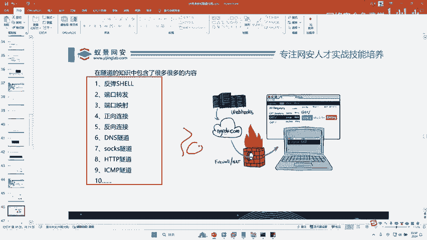

对吧我们来看一下怎么。