# 2024B站最值得看的黑客教程 ｜ 网络安全／渗透测试／内网渗透／漏洞挖掘／web安全／kali linux／红队靶场／CTF／信息安全 - P112：蚁剑到CS的迁移上线（2） - 网络安全免费学 - BV1uBsTetEow

我去搭建隧道。好，我们是因为我们用的是CSCS方便就方便在那里，对不对？我们可以借助这样一个东西啊，来，大家看看这个命令。好，就是什么？CS自带了一种功能。

就是说当这个跳板机跟我们内网机器建立1个SNB的流量隧道啊，它俩之间建立一个隧道。好，建完隧道之后呢，流量就可以通过这个电脑到这个电脑再到这个电脑了。啊，它的原理是什么？你看就这个。啊。

原理就是啊这两个电脑之间啊建立1个SMB的管道啊，然后让两个管道进行连接啊，然后这个是副管道，这个是子，对不对？这个是父亲，这个是子儿子，对不对？那这个流量怎么走呢？就是父亲向儿子发送命令就可以了啊。

比如我们的木马在这里。我们父亲直接向儿子发送命令，运行木马。好，木马运行起来之后，父亲就会把木马的流量给儿子就会把这个流量给到父亲。父亲呢又因为被黑客控制了，对不对？然后再给到黑客对你看子的进程。

从父的进程获取任务并发送说你看这台电脑就完全由这个父亲操控了。那怎么操控，对吧？就是走这个SNB这样一个管道通信好，所以我们CS是自带这样一个流量的转发的东西了，对吧？

所以我们只需要用CS跟他之间建立一个这样的东西就可以了。那怎么建立非常简单，O接下来看你的一个给你表演。好吧啊，首先呢我们再建立一个什么监听器啊，这个监听器剪个ADD这里就选择你看SNB。😊。

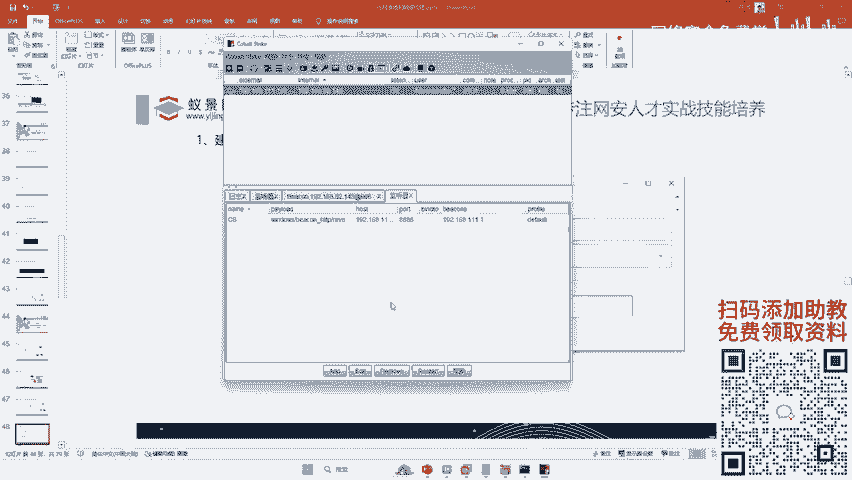

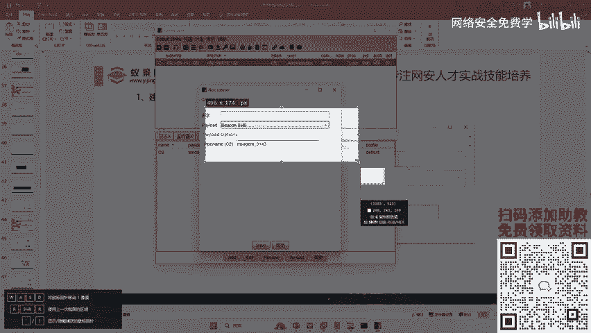

啊，直接选择这个什么SMBO这里呢随便写个名字叫什么SMB啊，然后点击C，哎，是不是又生成了这个一个SMB的这样一个管道的东西。好，然后接下来我们再去生成一个木马。好，这里呢我们一定要选哪个啊啊？

刚才我们生成木马，是不是选的是这个啊？这里时候我们一定要选择最后一个啊，选择最后一个这个生成木马的方式。😊，好，然后这里呢选择监听器就选择我们的SMB好，然后这里选择windows程序生成好，桌面。好。

我们在这里写SMB。保存。好，那么这样一个SMB的木马就生成了。那这个SMB到时候是怎么运行？它的运行的原理是什么啊？就是李哥刚才给你讲的，对不对？好，你只要通过黑客。

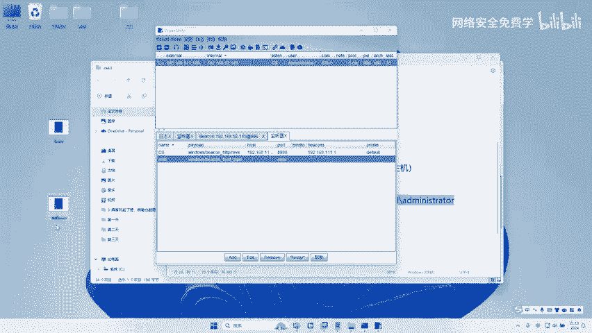

把这个SMB先传到web服务器，外b服务器券传给预控。好，然后呢，这个SIB就会走什么？走你预这个外部服务器跟预控之间的管道，然后再过来，哎，从而就把它控制了，对不对？所以呢我们现在需要两步。

第一步先传到外b服务器。然后到外部服务器之后，我们再利用IPC再给它传过去就可以了，是不是啊？好，所以我们进行操作啊。那这个东西它也是有一些。😊。

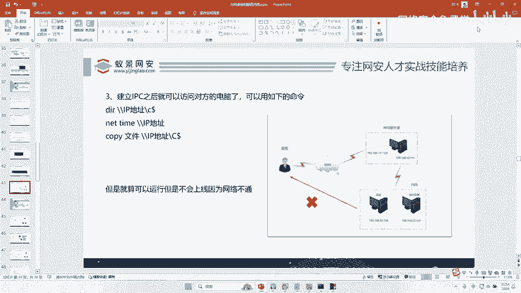

非常简单，对吧？你看我们文件管理好，我们先upload一下，先把我们桌面上的这个SMBE叉一传到对方电脑上。哎，是不是传到对传到电脑上了。哎，传到哪个电脑是不是传到了当前我们的。😊。

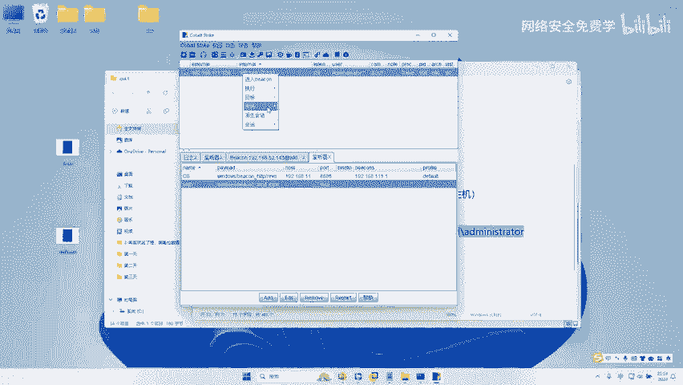

外b服务器上了啊，然后我又因我们外b服务器跟我们的。预控建立了IPC管道，对不对？所以我们利用IPC管道把这个木马传到对方电脑。那怎么传啊？这里李哥把命令交给大家好不好？好，就用这个命令。啊。

就是复制一个文件啊，把这个文件复制过去，怎么复制SMB。点点EXE对吧？复制到哪里呢？哎，复制到这个138电脑啊，这个叫远程复制啊，一般我们来说复制粘贴只能本地复制粘贴，对不对？

但是如果说你建立了IPC，你就可以远程复制粘贴。我把我本机的这个电脑远程复制到这个电脑的C盘啊，直接复制到御控的C盘，那么这个木马就被传到了御控的C盘。😊。

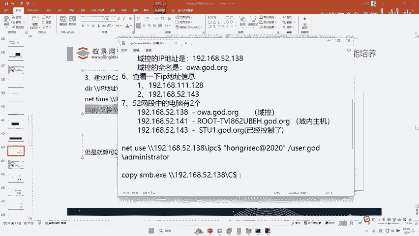

好，我们来复制一下啊。

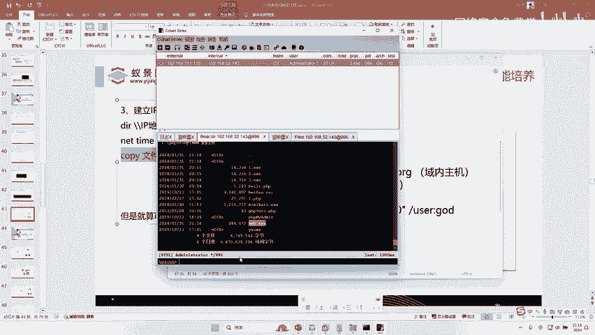

哎，是不是复制成功？好，这个时候木马已经到了这个预控的C盘了。但是还有一个问题，我们怎么能让这个木马执行呢？😊。

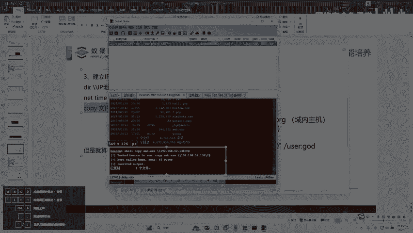

哎，有人知道吗？我木马现在已经到御控DC了，那我怎么去运行木马呢？你能去双击吗？你不行啊。😡，啊，你能像以键一样啊，刚才那样运行吗？也不行啊，你现在只是说木马过去了，你怎么让它运行一下呢？😡。

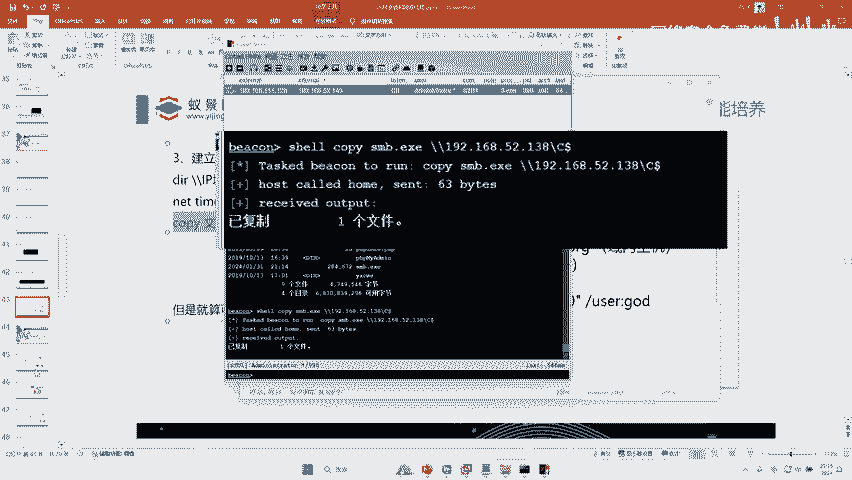

有人知道吗？啊，有人可能不知道，对不对啊？这里就大家可能很多人的知识盲区，对不对？好，接下来李哥就给大家介绍一下怎么去运行我们的木板，好不好？😊。

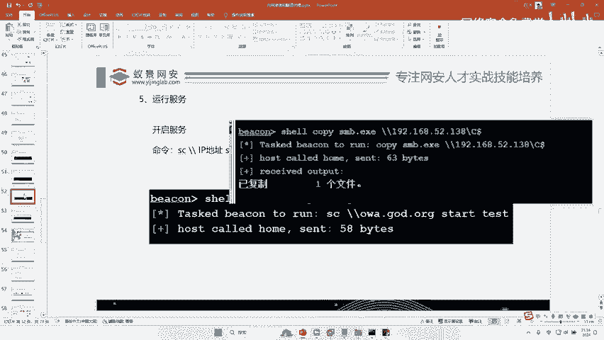

非常简单，我们通过服务的方式啊服务。因为我跟他已经建立IPC了，那么我就可以远程给对方的预控。创建一个什么？创建一个服务。啊，SC要创建一个服务服务嘛？大家知道服务啊，我们不用定时任务，我们用服务。

对不对？我们远程给对方电脑创建一个服务。那这个服务是干嘛呢？这个服务一旦运行，就是运行C盘下的SMB点EXE对不对？运行我们的恶意木马。😊，哎，所以我们把这个服务创建，这个服务是干嘛的？

就是这个服务一旦运行，它就会运行我们C盘下的这个木马，对不对？所以先把因为我跟他电脑之间已经创建IPC了，所以我又可以给他远程创建一个服务。😊，好，我们来看一下这个服务能不能创建成功啊。

你看如果说成功之后，这里会提示一个成功的命令。当然我看评论上有人说定时任务是吧？定时任务也可以，哎，是不是成功了，服务是不是创成功了？好，那接下来我们只需要让这个服务运行起来，那这个服务一运行。

其实就会运行我们的木马，对吧？因为这个服务的本质就是运行木马，对吧？好，所以呢我们把这个服务运行一下。😊。

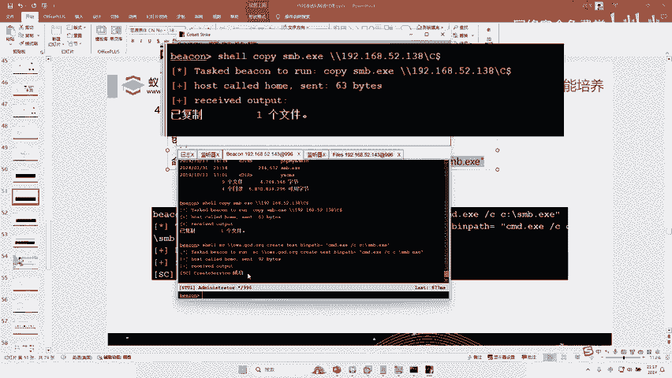

好，开启这个服务。

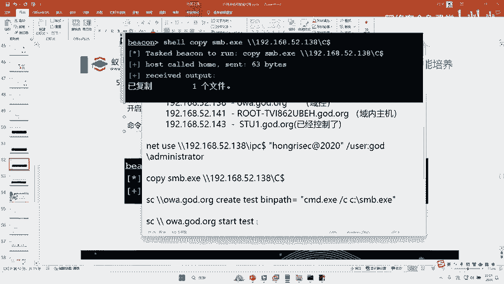

好，开启这个服务。好，记得呢把中间这个空格删掉啊。

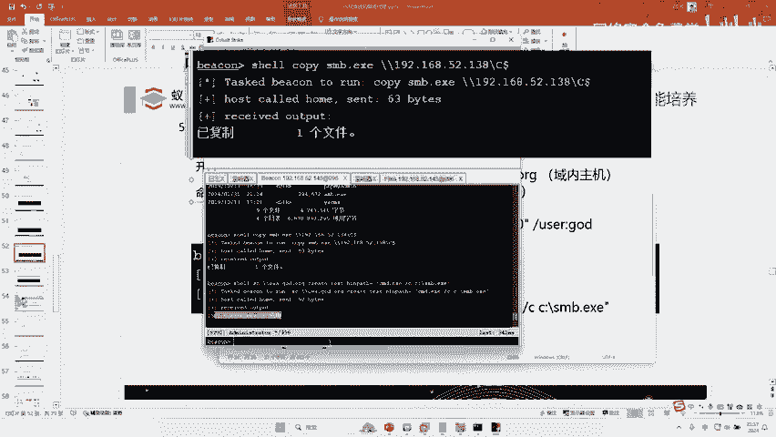

开启这个服务。好，服务现在已经开启了啊，有人说那这里那个木马SMB已经运行了，是不是要等待上线呀啊，那还不行，还差一步，还差哪一步啊。李哥在这里刚刚给大家讲过，对不对？我们这个禁程是什么？

是不是子禁程从父进程获取命令，这个是子，这个是父啊，现在儿子的这个SMB已经运行了。现在父亲还要说我要去连接你向他发送一个任务，我要连接你的命令，对不对？我要连你啊，那儿子收到之后。

立马就会把流量给过去。那么这个时候应该就上线成功了，那怎么连接，直接link这个地址就行了，对不对？我们link一下啊？😊。

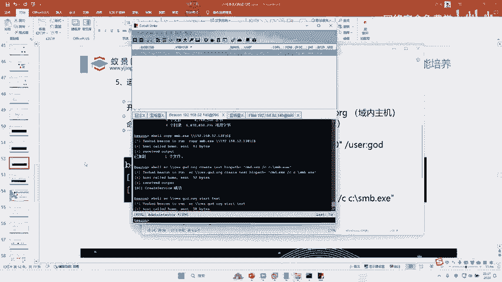

啊，link。啊，我们的这个预控。好，没车。来，兄弟们看一下上线没有。19216852。138上线了吗？直接OWAC层权限。上线了吗？好，那么这个预控就可以随便控制了。接着我们再给它sleep一秒。好。

然后右键又可以进入进入这里，然后又可以去执行一些更高端的渗透了。来啊，有人说刚刚遇到这个问题，对不对？好，来，我看下为什么web服器权限可以这么高。😊，权限这么高，可以远程。

为什么web服务器权限这么高，可以远程预控电脑？为什么？因为我们当前这个web服务器，我们发现它是用域账号，对不对？ad administrator哎，这个域账号，这个账号是域中最高管理员账号，明白吗？

如果说不是最高管理员账号，那就不行啊，那我们就要用其他方式。好，预控主机的密码是怎么得到？预控主机密码我们一直不知道呀，我们一直只知道预账号的密码。这个预账号的密码是不是刚才我们通过这个咪咪ca得到了。

对不对？😊，你都能连上内网上你都能连上内网机器。那王建伟你这你没听明白啊，你没听明白啊。你能问出这样的问题，就等于说你把这个网络拓扑你都没有听明白，对不对？就是什么意思呢？就是说我们刚才在黑的时候。

对不对啊，我们实际上黑客只能控制这个通过这个IP地址控制个web服务器，对吧？我们通过已键通过CS通过这个IP控制的，你用黑客控制它，它俩之间可以相互访问的，所以我们可以通过木马控制对吧？

那这个时候我们要控制预控了，你是跟他访问不了的，所以必须要借助这个电脑，对吧？那怎么控制的对吧？木马是怎么传到预控的对吧？就是黑客先把木马传到web服务器。

那么web服务器跟这个预控之间建立了这个IPC管道，我们借助这个IPC管道把木马再传到预控。对不对？那么建立IPC管道需要什么？我刚才已经跟大家讲了，需要一个域库域内的最高的账号密码啊。

就是我们这个域管理员的啊就建立IPC需要什么，对吧？需要。需要。域管理员的账号密码对不对？那管理员的账号密码我们在做信息收集的时候已经拿到了，对不对？我们发现这个web服务器就是用预管登录的。

它的密账号我们昨天都拿到了，对不对？所以我跟他之间就可以建立IBC。啊，明白吗？哎，现在有还有疑问吗？啊，所以说我们的木马是怎么到预控的，对不对？是黑客先通过CS把木马传给web服务器。

web服务器再利用IPC再传给什么预控。然后我们再利用IPC创建一个服务，让这个服务运行起来，服务又带动了这个木马运行起来。那么木马又会又因为我们这个两个电脑之间走了这个木马是走的这个SMB的流量。

对不对？所以木马又会走到这儿再走到这儿，哎，所以我们黑客就可以通过这条路把里面这个电脑控制了，理解了没啊，它是这样一个网络拓扑啊，所以我第一天讲的时候，我说了网络拓扑对我们来内网渗都是非常重要的啊。

所以我第一天叭叭给大家讲这个网络拓扑啊，你看这个IPC跟大家通信的，对不对？这个IPC跟里面进行通信的对对？这里呢这里是不能访问的啊，这里的这里可以访问的对吧？啊，给大家讲了那么多。😊，哎。

理解了没有啊，理解，那最后一步是干嘛？最后一步就是要把日志全部清理掉。比如这台电脑的日志，这台电脑的日志，对吧？因为你传东西一些链接都有记录，对不对？我们如果说结束了，就把这些相关工具一删日志一删啊。

悄悄的再退出去啊，拿到你的机密资料，对吧？😊。

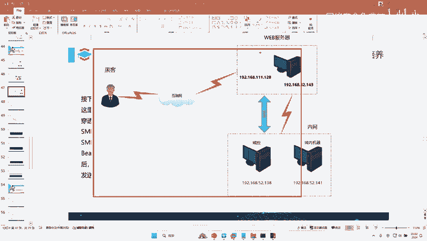

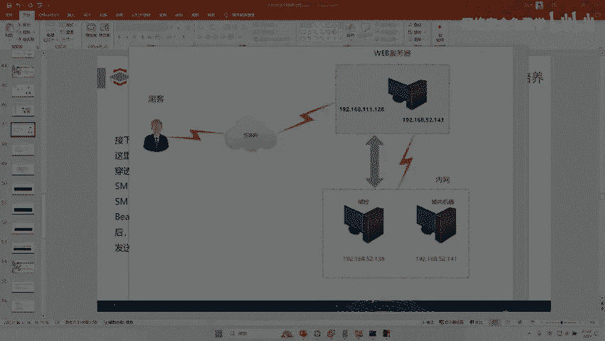

啊，有人说，那如果说预那你都把预控控制了，我都说预控上。预控是干嘛呀？你都把班主任控制了，预控上就有所有人的账号密码你就结束了。你内网渗透渗把预控拿下来就结束了，你还想干嘛？你把班主任都敲定了，你对吧？

你还控制这些域，你还控制这个电脑有价值吗？😡，这个电脑都搞定了，你还控制这个电脑有什么价值？没有没有价值了啊，没有价值了啊，你这个电脑控制了，你就代表这个电脑随便进了啊，随便进啊啊，当然随便进。

这个就我们就要用到另一种技术了，对吧？😊，啊，哎这个handnda说的非常好。哎，那web服务器它是一个预管理员账号会不会非常幸运？一般应该就是一个普通账号，说的没错，对不对？所以昨天我在讲的时候。

我们一般需要什么提全，对吧？我说的需要提全啊。😊，啊，我说这一次实验为什么没有提全，因为它的成本比较高。😡，啊，如果说它的权限比较低，你还需要提全做密码喷洒，去做密码喷洒啊。

去做这种呃内网的密码喷洒攻击啊。嗯这个还还有我们的哈希碰撞攻击啊，拿到一些高权限的账号，做什么我们的这个。crotingroing攻击对吧？做这些攻击啊，从而拿到一个高权限的账号，对不对？

如果说你渗透这个外服务器，没有拿到高权限账号，你就要想办法拿，就会有很多种方式。那么们委派去拿呀，什么哎roting去拿呀，croing去拿呀，是喷洒去拿呀，碰撞去拿呀啊，还有什么哈西传队去拿。

反正乱七八糟几百种方法是对吧？只是我们这个实验比较幸运，他刚好拿到了，对不对啊？如果说你没有拿到，你需要提全，需要用一些攻击手段去拿。😊，哎，理解吗？啊。啊，对，所以高权限不能乱用啊，特别是域管啊。

在狱中啊，一般啊像我我们这种情况，有人说就不存在在内网中啊啊内网中就不可能有台哪台电脑用edman登录，那你是错了啊，李哥打红的打了这么多年哦，见过太多很多电脑都是用这个账号登录的啊，一步就到位。啊。

理解吗？啊，好，今天的课大家是不是听的迷迷糊糊呀啊，那我给大家就是总结一下，好吧？OK那么今天的课我们已经讲解完成了啊，跨域渗透是什么意思啊？再给大家讲讲，就是说跨域渗透。

就是说啊假如说我们当前这个域里面有三台电脑，那么是不是1个ORJ点JOD啊，那这个公司它可能有好几个域呀，对不对？还有一个什么第一域啊，C2域啊啊，外国域那从这个域跨到这个域，这个域跨到这个域。

这个域跨到域个域它是一个整个域森林的结构啊，就跟你打一个学校呀啊，你只是把火箭班啊，高三火箭一般攻击下来了，跨域就是人家高三还有火箭二版。😊。

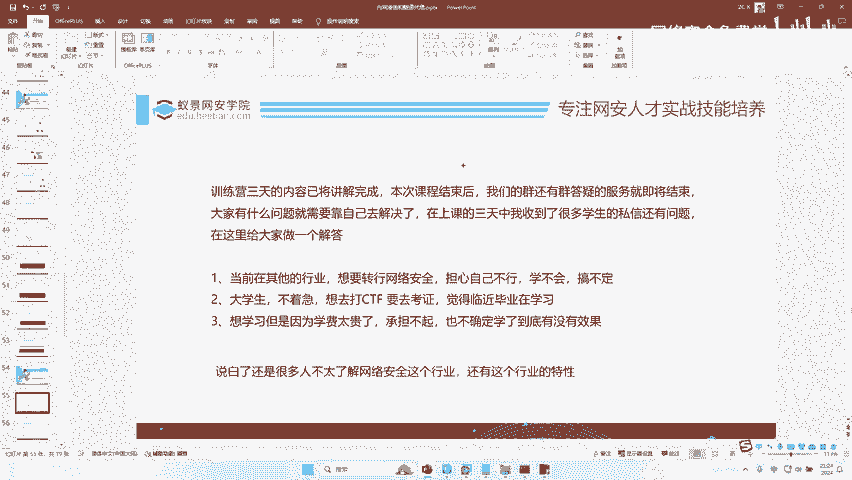

高三还有火箭三班呢，理解没？😡，啊，你火箭一班的班主任跟他里面的学生空制下来，那你二班呢怎么办呢？三班怎么办呢？人家都是属于高三的，高三这个年纪的都是属于一个公司的，人家公司有多个鱼呢，对不对啊。

这个叫跨域啊。😊。