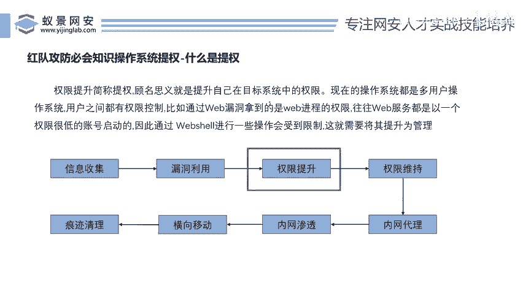
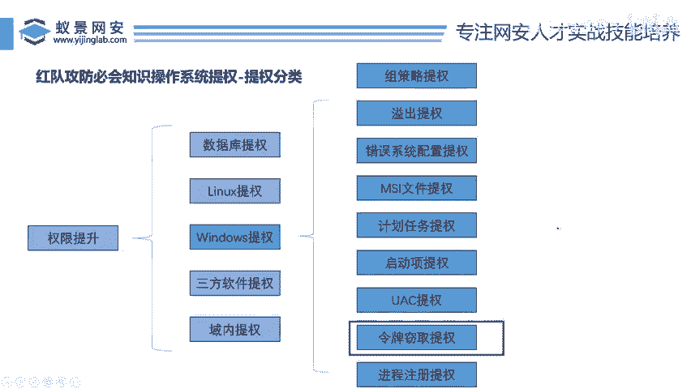

# 2024B站最值得看的黑客教程 ｜ 网络安全／渗透测试／内网渗透／漏洞挖掘／web安全／kali linux／红队靶场／CTF／信息安全 - P113：红队攻防必会知识操作系统提权 - 网络安全免费学 - BV1uBsTetEow

先来看一下这个红队攻防闭会的操作系统提全。好，我们这两天因为会围绕着提权给大家去讲，我们得先知道提权是什么，对不对？很多兄弟们都没有听过啊，只知道我要去报个，我要去编C议员啊，疑问这个保安。

我要不要学C员。😊。

啊，跟随M没有关系啊，我要学编程啊，我要不学英语啊，我要不要学个破解什么外校园wifi啊，大家可能都接触不到什么叫提权。那么提权是什么啊？李哥在这里写的非常清楚了，对吧？权限提升就叫提权，对吧？

顾名思义，就是提升我们在目标系统中的权限，就是说当我们控制一台电脑的时候，因为我们控制这台电脑的权限太低，我们不能对这个电脑完完全全的控制下来，啊，不能对这个电脑进行一些高危险的操作。所以我们需要提权。

我们需要将我们控制的这个权限升到最高等级，从而控制整个公司，对不对？那么提权是干嘛的呢啊？就是。😊，提升我们在控制电脑中的权限，对不对？有人说是获取root，有人这些都不是通俗，是控制到它的最高权限。

这个权限不一定是root啊，好吧？好，那么我们在讲提前之前，我们必须要给大家讲解一个网络安全知识知识数，或者是红队攻防的这个一个什么流程图，大家都知道网络安全现在是被国家承认了，对不对？

我们中国前两天才成立的网络安全部队，也就是说在这个部队里面有一个兵种就叫网络安全部队啊，所以兄弟们啊我想去这些网络安全部队的那你底下这些东西一定要会为什么？因为底下这个东西它是渗透全流程的东西啊。

那我来我们来看一下好，那么我们通常入侵啊一个公司或者说入侵一个企业，它是分步骤的那这些步骤，李哥已经给大家写到这些图片里面了，对不对？第一步就是这个信息收集了，就是对你要入侵的这个系统做收集。

比如说你要入侵什么中国移动，你要对。这个中国移动做收集，比如说中国移动公司有几个分公司，中国移动这个啊公司有几个网站，对不对？哎，我们通过收集这些信息，哎，然后呢去干嘛去找漏洞。哎。

假如说我找到中国公司的100个网站，100个APP100个小程序了。我通过我的技术，我发现这些网站有漏洞嗨，然后我通过漏洞，我就可以干嘛呢？去控制对方电脑。好，那么我控制对方电脑之后就会面临一个问题啊。

权限不够的问题。😊，啊，权限不够，我现在把这个对方电脑控制了，我现在权限不够，我想给这个电脑关机，我想给这个电脑中个木马。我想盗取这个电脑里面的机密资料啊，它是关乎着一个什么秘密的火箭发射器的资料。

但是这个文件被锁了，我看不了，我普通人看不了。那么你就需要什么权限提升。所以说哎我们今天讲的这个权限提升，它是基于一个什么样的前提，是基于你已经控制了对方建电脑的前提。你才能做权限提升啊。

这就是我们讲的提全。好，那么这个权限提升呢，哎，它又分为了哪些知识点，兄弟们要去学都要学哪些？好，那么李哥在这里把权限提升总体上分为了几大类啊，分成了五大类数据库提全linux提全windows提全。

第三方的软件提全啊，域内提全，对不对？好，这五大类，5个大类里面又分别包含了不同的子类。比如说我们的windows提全windows提全就是针对。😊。

对于你控制的当前这台电脑，它是一个windows电脑，windows电脑是我们最常用的电脑，对不对？兄弟们的电脑不是win10，就是win11，是不是也可能是win7啊？

有些人他可能是m克m的话就要用到这个linux提全啊。如果说你控制的电脑是个windows提全。😊，windows的这个电脑，那么你就可能面临着提全。那么怎么把这个windows的权限拿到最高等级。

看到里面所有的资料，看到里面所有的东西就需要用到以下技术，比如说组侧类提全，一出提全错误配置提全MSI提全计划任务提全UA提全，令牌窃取提全，远程进入提全，可以看到这些技术点是非常多。

当然兄弟们可能给你们看啊，你觉得我操啊，我不明白，对不对？但是没有关系啊，我们今天学的什么，我们今天学的是令牌窃取提全。O我们今天就把这一个知识点搞明白，你就会了，你就懂了，明白吗？

那当然这些linux提全里面它也分为很多这个数据库它也分为很多啊，所以说大家要把这个权限提升全部学明白啊，你得学一两个月啊，而且是每天李哥给你上课，每天给你讲一个，我今天讲一个，明天讲一个，后天讲一个。

那差不多你一个月就能把这权限提升全部学完了啊，那前提是一定要有人给你讲。自学你信我，你四年，你把它都学不明白。好，那么我们就来看一下这个令牌窃取到底是个什么东西。OK。

