# 2024B站最值得看的黑客教程 ｜ 网络安全／渗透测试／内网渗透／漏洞挖掘／web安全／kali linux／红队靶场／CTF／信息安全 - P114：企业内网Windows账户权限分类 - 网络安全免费学 - BV1uBsTetEow

那么在讲这个令牌窃取之前，兄弟们一定要知道一个东西就是权限到底是啥。好，很多人用电脑，对不对？我们从出生啊，或者说从我们上小学开始，我们都开始接触到我们的电脑，但是你电脑玩了这么多年，你到现在为止。

你可能都不明白权限到底是一个啥windowslinux到底都分为哪些权限啊，很多兄弟们不明白啊，我也不明白，那么我也是用了很多年才明白的。那么今天李哥给你讲清楚啊，一节课以给你讲清楚了啊。

在我们的平时的这种渗透测试的日常中或者工作中，对不对？我们如果说遇到了windows系统啊，我们一般都会哎拿下用户权限啊，这里呢啊把这个权限呢再不考虑预环境的情况下，我们把权限分成了这四类啊。

网上肯定没有人给你讲这些东西了啊。第一个你控制的电脑的权限是一个本地普通用户权限。第二个，你控制的电脑是一个本地的。😊，普通管理员权限听好了，这几个字非常关键。普通管理员权限啊。第三个。

你控制个电脑是目前这个电脑的最高管理员权限。好，第四个，你控制的电脑是本地服务用户的权限。好，兄弟们，在这里面请你告诉我哪个权限最高。一。234哪个权限最高？有人说四最高，有人说三最高。有人说三最高。

哎，没错，三最高三叫做最高管理员权限。好，所以说一般来说我们就要拿到网站的最高管理员，而不是一个普通管理员好，普通管理员它是有限制的，它虽然也是管理员，但是也有限制O ok好sstem。

它是服务用户的最高权限，一会给大家去讲解好，那接下来我们就要针对这四种情况，每一种给兄弟们讲这四个到底是什么东西，对不对？因为我们涉及到提权，你必须要知道他是个什么东西，对不对？

第一个本地普通用户是个啥？好，本地普通用户，就是在windows中的一些普通用户啊，他没有管理员的权限啊，一般能做的操作非常少。好，接下来我们用一个win10给大家看一看本地的普通用户权限啊。

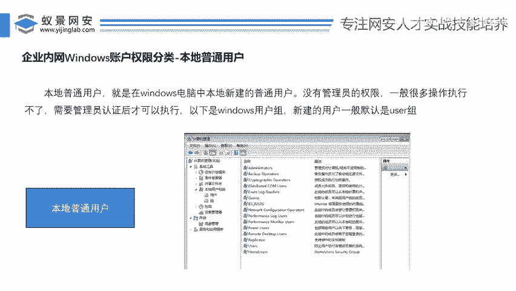

好，我们打开啊一个win10。好，我们把这个win10呢哎开机啊，开机之后哎来带着兄弟们去瞅一波啊。🤧嗯。好，这个开机之后好，我这个系统里面答案1234哎，一共有4个账号。

OK这里面呢这个百里这个账号它是一个普通的权限。普通用户。好，我们用百里这个账号登进去。啊，登进去之后，我们看看这个权限到底有多低啊，他能干什么啊。可以说如果说你有了这样的权限。

那你的这个操作的空间是非常的小啊，你能做的事情也非常的少啊，对不对啊？也就说影子影子用户啊，它是属于权限维持的兄弟啊，它不属于提权方面的知识啊好，那么这个本地普通用户啊是怎么看的啊。

这里呢也给大家看一下啊，就是说在我们电脑中啊啊，有这样一个计算机管理的东西啊，里面有一个组叫user组。我们本地的普通用户啊都会在这个里面啊，这里面的用户，它都是本地的普通用户，它的权限是比较的低啊。

所以说接下来啊我们进入到这个电脑里面去看看哎这个低权限的用户，哎，都能干什么好不好啊好，这个电脑刚刚开机啊，是不是百里老师没错啊，我是百里啊，我现在给大家讲的是什么？我们提权的知识啊。

因为我们课刚刚开始好吧？刚刚开始啊。😊。

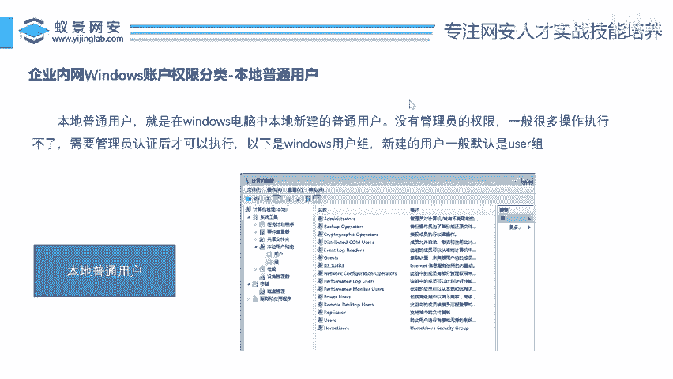

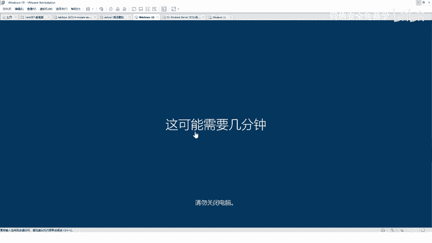

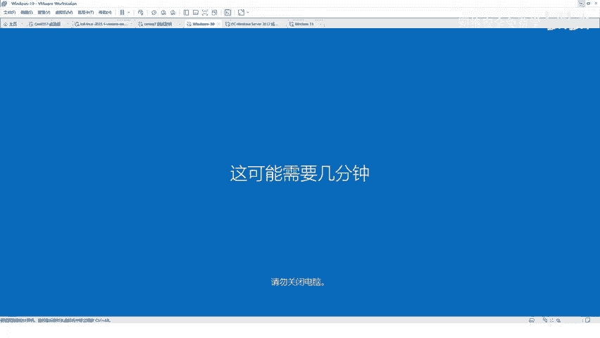

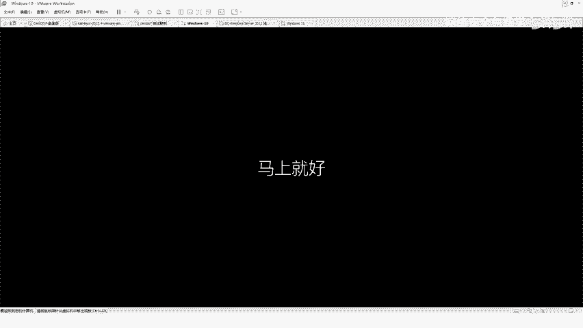

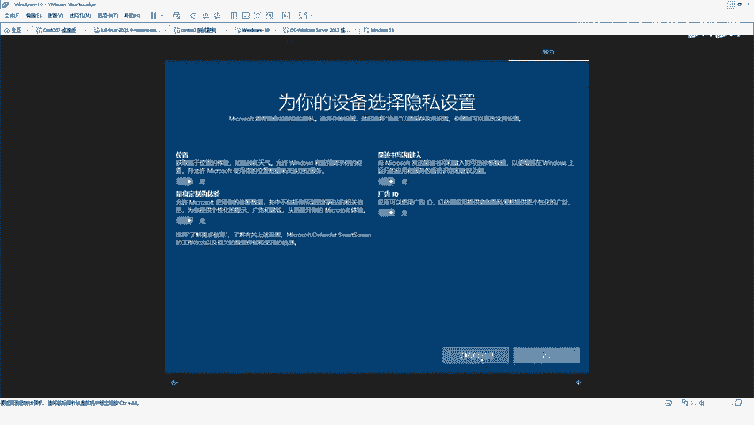

好，OK现在我们已经成功登录到这台百里的账号里面来了。OK我们打开一个啊CMB。😊。

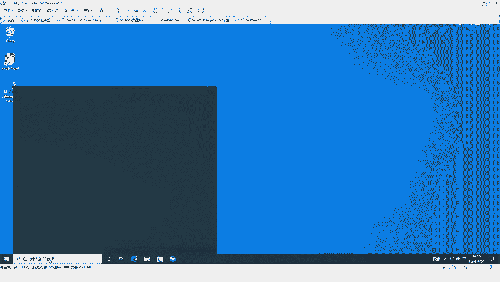

OK来你看来这里给大家演示一下，你看当前我是谁啊？我的呼 am爱是不是刘萌萌电脑里面的百里好，百里对不对？OK假如说我是白里O这个用户，那你说我的权限比较低，那他能做哪些操作，高危操作。

比如说关机他能做吗？哦，他不能做对不对？那假如说他想创建一个用户，哎，我们知道在电脑去创建一个用户啊，比如我创建一个这样的用户。😊，大家看一下。对不对？你看找不到用户名，哎，我们在后面加个ADD来。

你看拒绝访问啊，我们要用这个命令给电脑新建一个账号啊，提示拒绝访问，就是你没有权限啊，那假如说你拿到这样的电脑了，你想关机，你想添加用户，你想做横向移动，你想做一些高权限操作，他是不可以的。

他的权限比较低啊，我们看通过这个百里这个用户，对吧？你去添加一个用户啊，你看拒绝访问，不让你添加，所以他的权限比较低啊，这个就叫普通用户，所以说拿到这种普通用户，对我们渗透人员来说啊，毫无用处，对不对？

好，第二个呢就非常关键了，叫本地管理员啊，叫什么本地普通管理员啊，一般也叫我们的本地一般管理员。好，那么什么叫一般管理员，这个概念啊，很多小伙伴都不明白，对不对？好。

那么接下来呢啊李哥在这里啊切换一下用户啊，给你去看看啊，什么叫做一般管理员，好不好啊？我们把这个电脑现在切到一般管理员啊，或者说啊。😊。

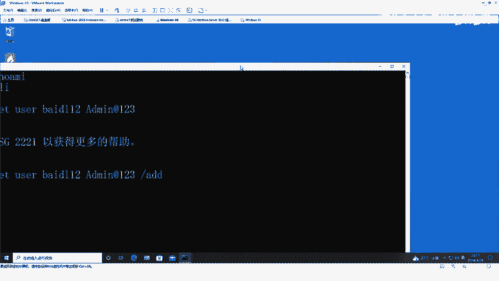

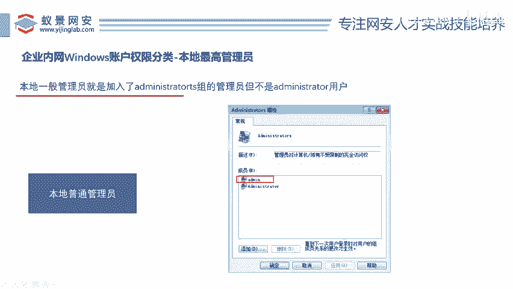

到一般管理员给兄弟们去看一下哈啊，把这个电脑先那个啥一下啊，睡眠一下啊，然后我们重新开机啊，重新用一般管理员的账户去登进去。😊。

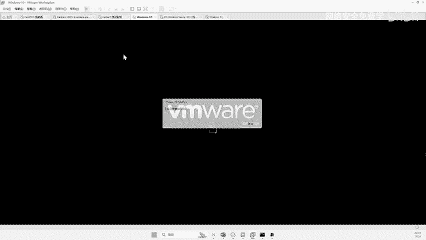

好，我们再重新登录一下。好，打开这个一般管理员。好，这个一般管理员叫oldmin。啊，我们来登录一下。😊，好，我们大部分的电脑啊一般都是这个一般管理员啊，就你们的电脑的权限啊，90%的人都是一般管理员。

不是超级管理员，好不好？好，那么这个一般管理员啊，我们来看一下啊。😊。

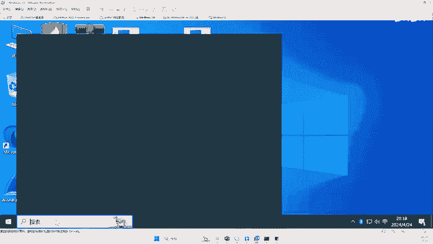

关好，我们在这里打计算机管理。啊，管理。好，我们打开这个计算机管理啊，在这里给兄弟们瞅瞅这个一般管理员啊，他在哪里好，我们打开这个电脑的这个啊本地用户跟组啊。😊，打到这个组。

啊，打到这个ern master的组里面，来，兄弟们往这里看。😊。

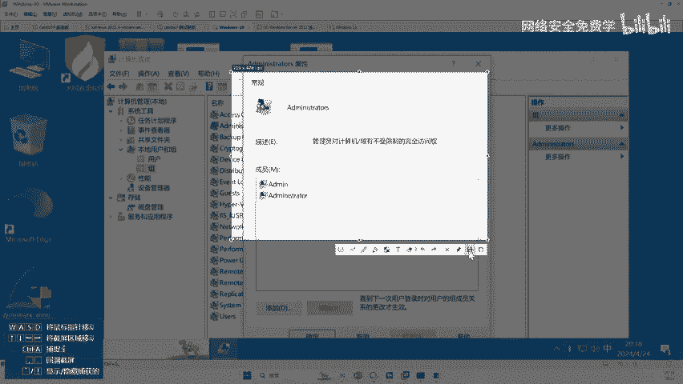

啊，这是一个组，对不对？你看这个组里面现在有两个用户，第一个用户叫admi。好，那么这个ad me什么意思呢？哎，就这个组哎这个组在这个组里面的所有的用户，哎，他都是这个管理员。

但是这里面管理员它是有分类的。好，听好了，你看第一个用用户叫做什么od me。这个admi是怎么来的？😊，是我手动创建的啊，我你们的电脑啊，在这个administadmin组组里面也会有一个用户啊。

比如说你的电脑是张三啊，那么你的张三用户就会在这个组里面啊，他是就是一个什么一般管理员。大家可以看到这个也是管理员啊，你看虽然这个addommin在的这个管理员组里面，但是呢他的权限并不是最高的。好。

那现在我们打开这个。😊。

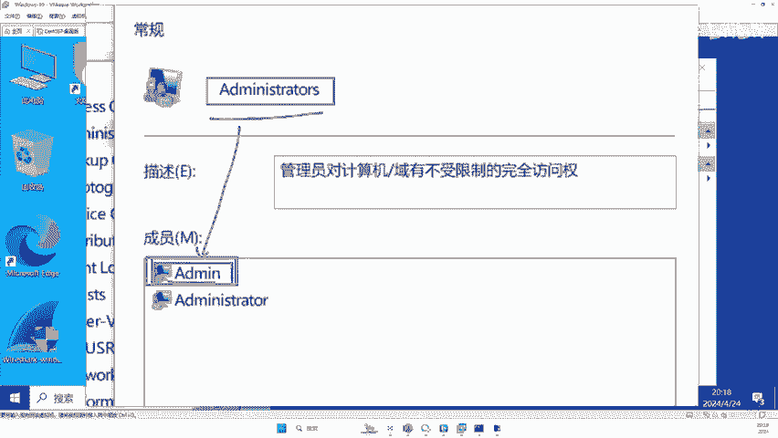

这个用户啊给大家去看看他能不能做一些危险操作呢。你看现在啊我们是什么？这这个odmin用户，他是一般的管理员，对不对？一般的这个管理员，我们来去net user一下。😊。

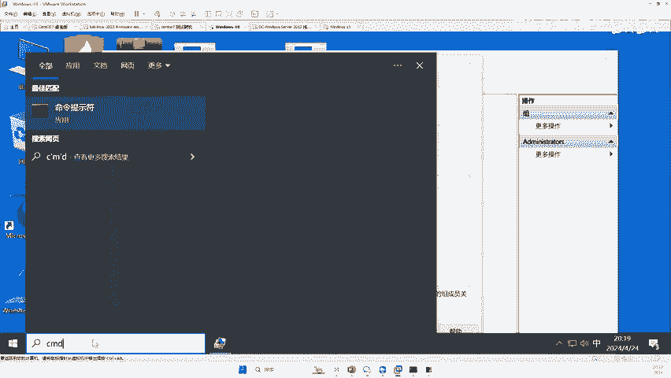

哦，我们哎。我们添加一个用户叫李四好，然后写李四的密码啊，这句话什么意思？就是在这个电脑上添加一个李的用户，然后呢，密码是add me at123。好，我们斜杠ADD好，你回车。😊，哎。

你会发现这里依然是拒绝访问，为什么？😡。

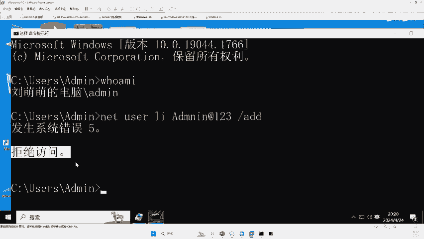

这个用户min明明在哪里呀？明明在这个管理员组里面呀？他应该就是这个电脑的管理员了呀。他为什么不能去添加用户呢？啊，不信你们打开你们的电脑，你们去你们的电脑上输入这样的命令啊，90%的人都是拒绝访问。

为什么就是因为min这个权限，它是一般管理员，它不是超级管理员。好，那么接下来我们来看这个本地的最高管理员。好，本地最高管理员听好了，就是这个 administratormin。

这个用户就是我们的最高管理员，所以说我们提全对不对？一般就要提到这个admin这个用户好，那么这个用户啊在windows电脑中一些版本中是禁用的，为什么是禁用，其实非常简单。

就是因为我们的电脑那些微软害怕你的电脑中毒啊，如果你的电脑拥有的最高管理员。那你的这个电脑去运行一些病毒都是畅通无组的，你的电脑随时可以被别人控制。你的电脑。

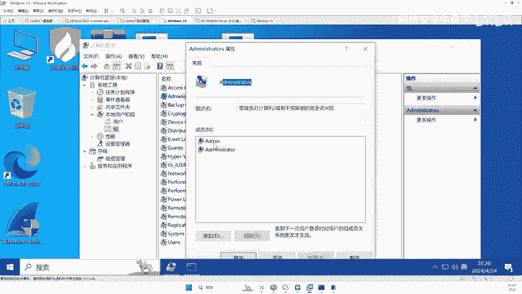

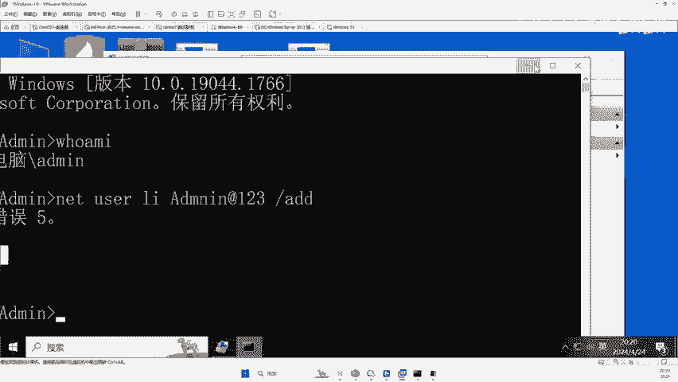

随时可以被被别人监控，所以他们觉得是这样是危险的。所以说一些电脑就把它默认关闭了。听好吧，就默认关闭了。好，比如说在我们的windows家庭版啊，大家可以打开自己的电脑，看看你的电脑如果是家庭版旗舰版。

那么你的这个administr这个用户默认。😊，禁用了。但是如果说你的电脑它是企业版专业版，它就是默认开启的。好，那接下来啊我们去看看这个用户当前这个电脑的用户有没有开启这个用户呢？

这个 administratorminist呢。好，我们来看看啊，我们怎么看啊，怎么看你这个用户有没有被禁用啊，大家可以输入这个命令啊，哎。

这个命叫做net user administratormin哎，把它输入到你的CMD里面，对不对？就可以去看看了啊，net user。

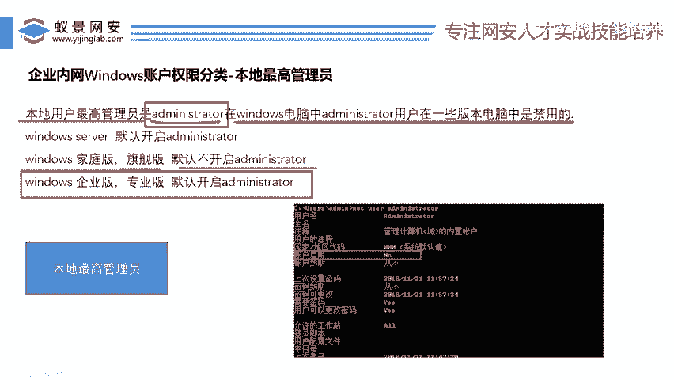

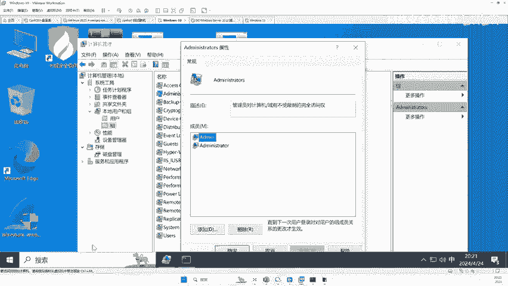

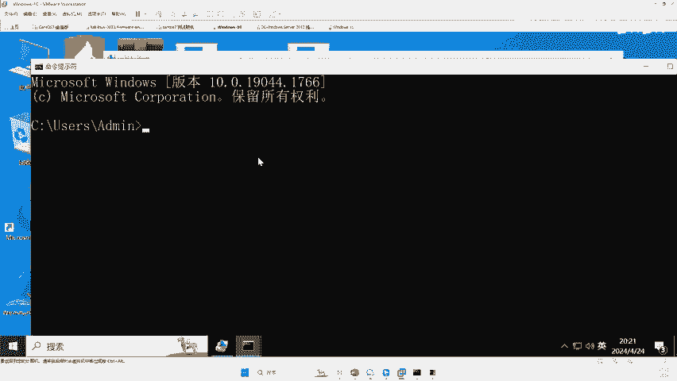

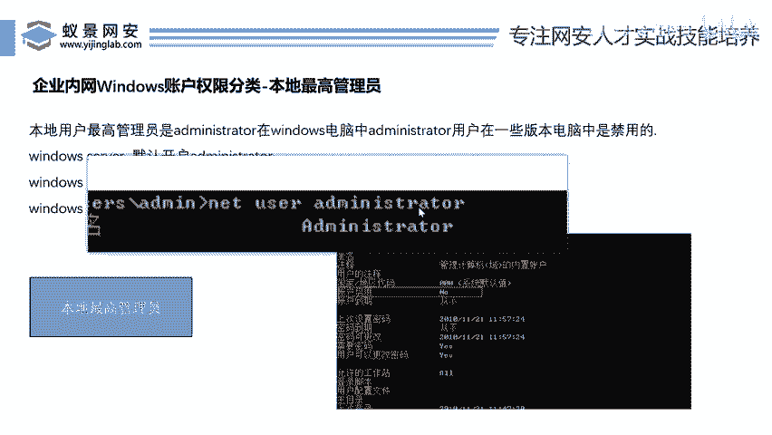

啊，回车，你看我这个账号当前是什么？yes。哦，如果说你的电脑是yes，ok那么你就是开启了。好，那也就说李哥，假如说我想把这个电脑这个用户给它开启启动起来，哎，我们就进入到这个组里面，哎。

双击啊双击它。😊。

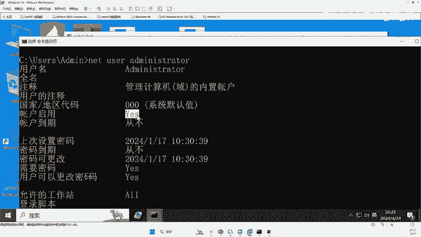

来。啊，不对啊，不在这里面，我找到这个用户里面啊，这里面啊，因为在我们的这个系统里面，对吧？有个用户，我们找到这个administ好，点开之后，我们可以看到这里有一个什么哎，禁用啊。

默认这里就是打个勾是禁用确定状态。哎，那么禁用之后我们再去输入这样的命令，你看看哎，这里就是什么no这个账户启用，提示no了啊，这里应该是大家的大家的一个状态，就是什么no啊，如果说你想开启。

你就进入到这个页面，哎，把这个账户禁用把它插掉，点击确定好，那么你的电脑对不对？就开启了这个最高管理员，你就可以用这个最高管理员去登录你的电脑了。OK就这么简单啊。

那接下来我们用这个最高管理员去登录我们的电脑啊，我们看看这个最高管理员好不好？能不能做一些啊其他性的其他的操作哎啊，明白吗？O。😊。

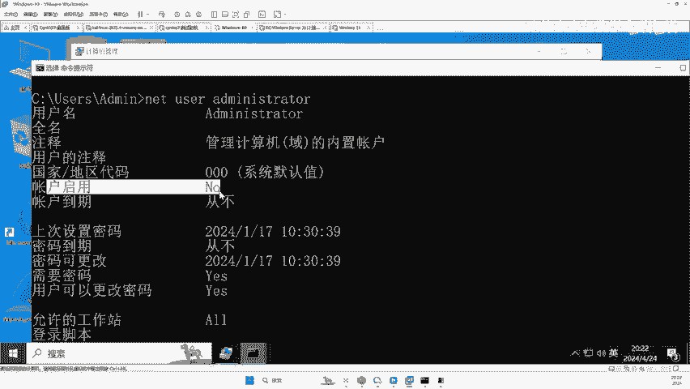

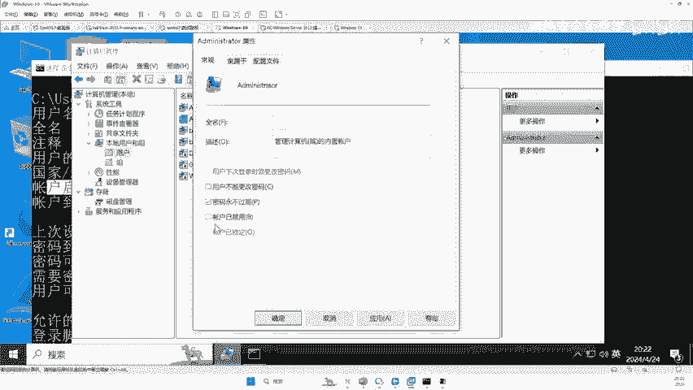

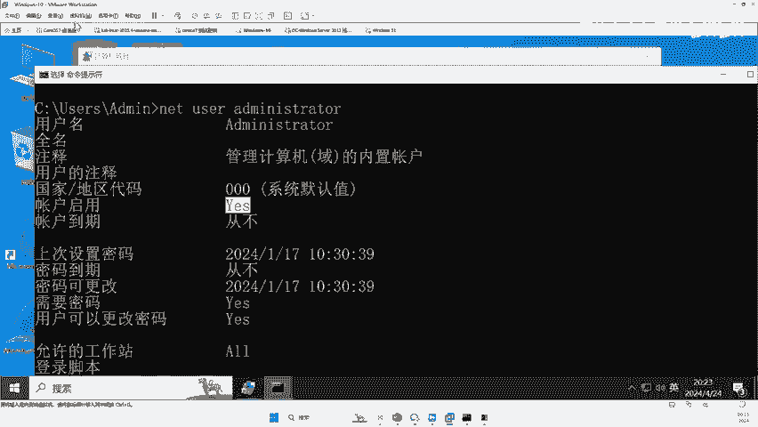

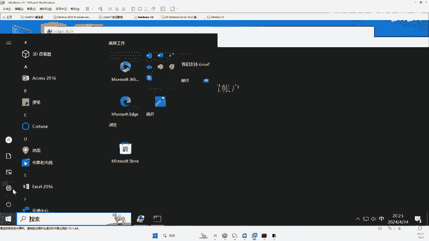

好，我们还是同理，对吧？啊，让这个电脑进入这个锁屏模式，然后我们重新去开机啊，开重新开机，再用这个administrator去登录到这电脑里面去啊，就可以去看这个电脑的最高管理员了啊。

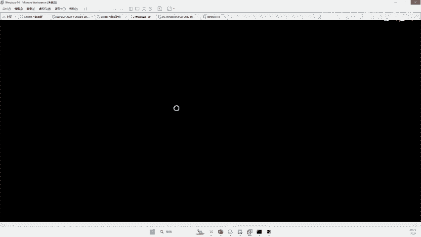

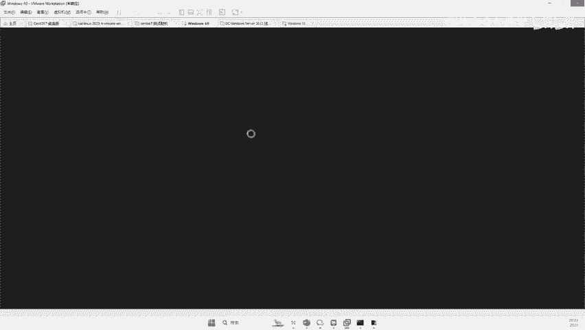

好，我们稍作等待啊，我安装的软件都没有权限啊，一会告诉大家，为什么我们普通管理员啊，明明是普通管理员，对不对？你按道理来说啊，他拥应该拥有着最高权限，但是没有啊，一会儿就要给你们讲UAC的东西了啊。

这个是因为UAC所以说我们通过这种记这个这个东西啊，就是为了给你更好的什么引出这个UAC提权啊，UAC提权啊，这个大家不用着急，跟着李哥的步骤，对不对？一步一步来。

因为我们现在讲这个东西的观念非常重要啊，你不懂的话。😊。

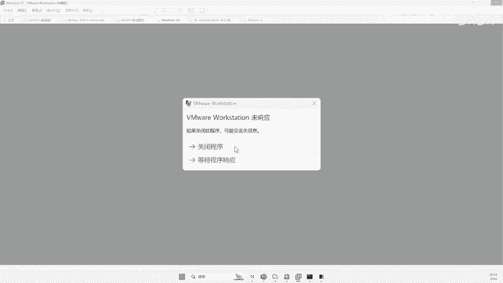

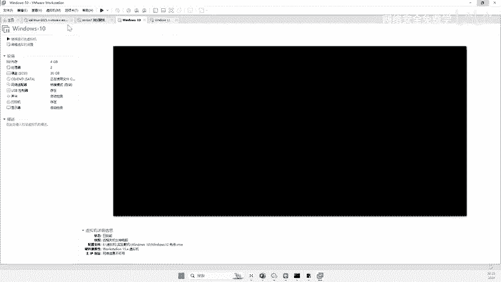

会影响你后续学习。好，我们现在用这个administer登录进转啊，登录进去。😊，好，那么现在哎假如说你用这个账号登到登到你电脑里面去了，对不对？好，那么你的电脑就用这个电脑的这个权限就是最高管理员啊。

你用这个账号可以在你的电脑里做任何事，而且不需要认证，不需要提示，没有弹框，好不好？好，那么现在呢我们打开这个CMD啊。

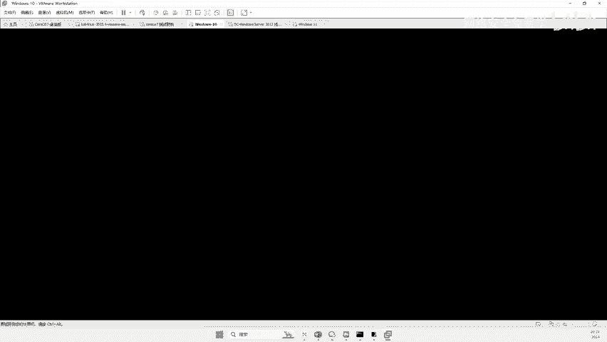

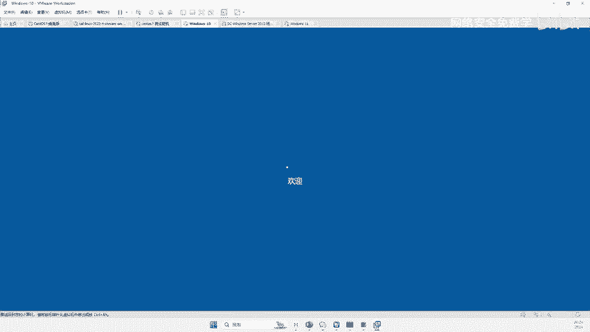

好，我们在这里去添加一个用户试一试啊，你看。night user着啊，我们参加一个李4。李四对不对？好，添加一个李四的用户给这个电脑账号密码是这个东西，对不对？好，后面写个ADD回车看到没？

直接提示命令执行成功。看到没？命令直接执行成功了，那也就代表什么啊？代表执行这样的高权高危险的操作。这个添加用户本身就比较危险，对不对？所以说windows一般是不让我们通过命令去添加用户的。

但是我用这个 administratorminist，你看到没？添加成功了，它并没有提示什么拒绝访问，所以说也就代表着我们拥有这个电脑的最高权限，现在你用这个用户啊，假如说用这个用户。

你的电脑假如设用这个用户登录了。那么你用这个用户去运行了一个木马，不好意思，你的电脑立马就被完完全全控制了。因为你用这个用户去运行木马，那么木马也是这个最高权限。😡，那么你用这个用户去运行一个病毒。

不好意思，你的电脑就完完全全全中毒了啊，没有任何防御了啊，这就是windows为什么要对我们的用户进行分类啊，以低权限高权限就是害怕大家电脑的中毒，对不对？那么对于我们这个什么这个安全员来说。

一定要拿到最高权限才是我们的目的，对不对？好，那么有人说了，李哥，那么我的电脑是家庭版，我就没有这样一个用户，对不对？我的电脑这个用户是被禁用的，那我应该怎么办啊？我还想提升到最高权限怎么办啊？

这里要给大家讲一个下一个权限了，哎，就是我们windows的服务权限，本地服务用户sstem。😊。

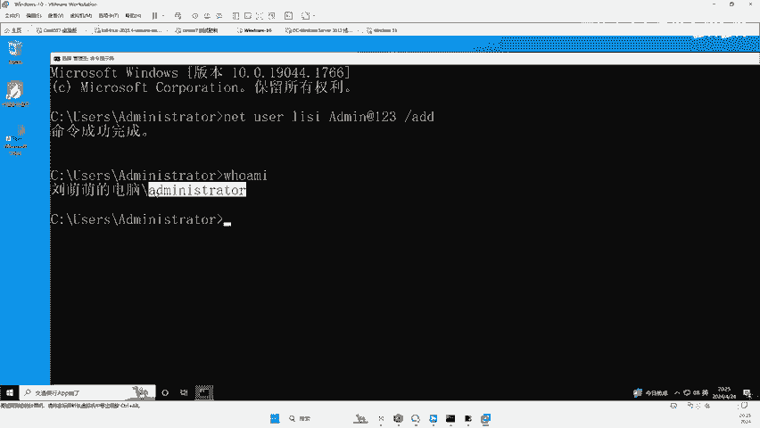

好，这个用户权限啊，跟我们的这个。好，跟我们的这个用户哈，他是什么关系呢？有人知道来，你们说一下这个权限高，还是底下这个权限高。我问大家一个问题，哎，上面这个权限高还是下面这个权限高？😊，啊。

我看看你们学网安的人，因直播间有很多刺头，对不对啊啊，来，我看一下来，比人一高二高来给我打个数，有人说一高，有人给二高。😡，🎼上面高st，有就说stem高，对不对？我跟你说。

凡是在这个直播间里打二的同学。😡，啊，你们应该都是学过网爱的，对不对？啊，你们在网上看文章，应该都会告诉你。哎，底下这个高谁告诉你底下这个高的网上告诉你的都是错的哦。哎，我就明确把话撂到这。

网上告诉你的都是错的。我告诉你啊。😡，我告诉大家这个一个残酷的现实，好吧，就大家学到网安那么脸，很多多人都被误解了，对吧？这个权限啊。😊，这个用户。跟这个用户啊。同权。同权两个权限一样高。什么意思呢？

就类似于你家里面你爸爸妈妈地位高，还是你你爸爸地位高，还是你妈妈地位高？😡，没有可比性，对不对？爸爸跟妈妈同样权限啊，都是我们家里的长辈，是不是一样的啊？那为什么还分你那为什么同权了？为什么还分成两个？

这里要给大家讲解我们windows一些原理啊，再给大家说，这两个用户是可以进行权限切换的啊。也就是说如果说哎你有了这个用户。😡，有了这个it administratorator。或者说有了这个。啊。

这两个你不管有哪一个都是可以什么相互切换的。就说你有了上面这个你可以轻而易举的切换到下面，有了下面这个可以轻而易举的切换到上面，对不对啊，也就说这个sst到底是什么东西呢？啊。

那这个用户在我们每个人电脑不管是家庭版中文版，什么企业版旗舰，每个电脑都有每个电脑都有这样一个用户。那么这个用户到底是什么？好，李哥这里要给大家讲讲这个windows的服务用户了。好。

那么服务账号是用于在windows中运行服务的一个账号，服务账号不能用于登录我们的系统。也就是说刚才我们看到这个这个权限，这个东西啊，它是一个服务账号，这个服务账号不能登录，对不对？

就是我们不能去登录这个拿这个用户的st输入密码登录这个电脑，对不对？但是这个服务账号，这个C这个什么。😊，SYSTM是这个服务账号的最高权限。啊，就是服务账号里面stem是这个服务用户里面最高权限。

那什么叫服务用户呢？服务用户就是这个windows运行它底层程序的。😊，底层程序的用户啊，为什么叫底层程序？这里我打开这个电脑，你就知道了。好，对于我们一台电脑而言啊，这个电脑除了你用账号登进去。

那么这个电脑的设计的时候啊，还会就你开机的那一瞬间，它会开启很多windows自带的程序，比如说它底的一些进程，对不对？它底底层的一些应用，它会开启，它如果不开启你的电脑就开不开机，对不对？

那么底层的这些应用，底层的这些服务啊，又不是你开启的，那是谁开启的，它是由电脑开启的，那它是由电脑的哪个用户开启，兄弟们来这里我打开给你看看啊，瞅一眼就明白了，好不好？好，我打开这个一个的。

不管你是win10，对不对？还是你的win11啊，都是如此啊。😊。

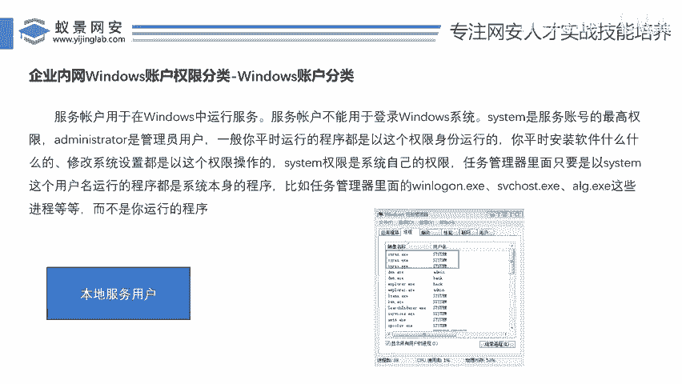

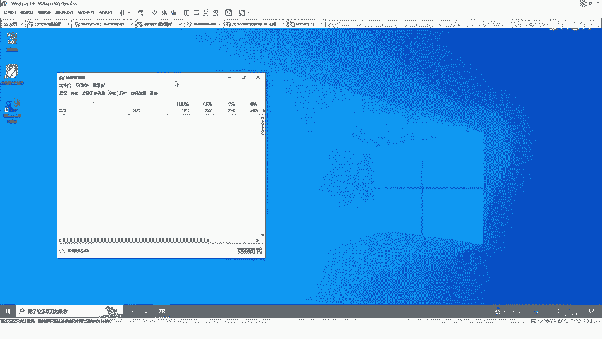

好好，我们同样啊运行这个截图工具啊，我给兄弟们截个图，来，兄弟们来看一下。😊，来往这里看，你看哎，当前我的电脑，你看运行了一个这样的中，这个东西是啥东西，知道吧？叫做中文输入法，看到没？

中文付输入法是由谁运行，它是由od面运行，也就这个用户运行的？哎，这里还有一个中文输入法，它是由谁运行，是由百里运行啊，就是刚才给大家展示的用户。好，但是你看这里还有一个中文输入法。

它是由谁运行system运行。😊，也就是说当你电脑开机的时候，你的操作系统就会自动运行输入法，对不对？你电脑开机，你总不能肯定是自己运行输入法吧啊，你不可能什么双击打开输入法吧，对不对？

你你直接就能去打字了，为什么能打字。因为你的输入法由这个sst运行了它运行的底层的服务，这里我们可以看到这个这些服务你看到没？这个服务这个服务是干嘛呢？我不知道呀。

我也不知道它可能是windows的一些底层应用啊，不不不启动的话，我们电脑开不开机，那它是由谁运行，看到没？stem，它也是个进程也是个服务，啊，所以说我们由windows自己运行的程序。

最高权限就是这个stem了。好，那么我们往下看还有两个这个叫local server跟network server，这两个也是服务用户，不过权限比较什么。😡，看比较什么低啊，那么上面这个。啊。

上面这个它什么高啊，就是这个stem，它是服务用户里面的最高权限啊，底下这两个也是服务服务用户，但是权限比较低啊。所以说我当我们控制一个电脑的时候，如果能拿到这个s，那你的权限也比较高了。

你就可以运行windows底层的任意进程任意服务了。那等同于来说，你就把电脑控制了呗啊，明白了不这个就叫什么sem，所以说st跟我们的这个administ，这两个用户啊，就是什么功能不一样。

这个administ是我们的用户账号啊，什么叫用户账号用于登录登录进去，我们可以运行一个软件运行程序，在这些用户使用里面是最高权限的。那么s是windows底层服务里面的最高权限。

那么拿到administrator就等于拿到st，拿到stem就等于拿到了什么administ哎，就这么一个简单的原理。那么这两个也是可以什么随便切换的。而且这两个没有高低之分啊。

没有什么谁高必须拿到谁必须拿到。😊，没有好吧，是同权的啊，是同权的啊，明白。好，有人说到底拿哪个没有关系，拿到administ或者拿system都可以。它两个是什么？同权，我刚才说了，对不对啊？😡。

同权。啊，就说啊你是个劫匪，你要把这个家里面控制了，对不对？你说你要控制爸爸呢，还是要控制妈妈呢？😡，都可以嘛，对吧？你把爸爸控制了，等于把家里控制了，你把妈妈控制了，等于也把家里控制了，对不对？

两个是同权啊，控制了妈爸控制了爸爸，就等于控制了妈妈，控制了妈妈就等于控制了爸爸。哎，就这么一个简单道理啊，所以说我们不用去纠结到底拿哪个权限。OK拿到这两个任意一个即可都可以啊，OK。😊，好。

那么把这个权限我们现在已经搞清搞清楚了啊，我们提前提到的是谁啊，所以说我们提前提的是谁，要么提到这个本地最高管理员，要么提到这个本地服务的最高权限啊，千万不能是本地普通用户或者是本地普通管理员啊。

那么你对我们电脑来说没有任何意义，对不对？好，那么这里就有一个遗留的问题要给大家去解决，叫UAC啊啊，一个能禁用一个吗？可以啊，你可以用s term直接把这个administer给他禁用掉。😊，啊。

对不对啊，直接给他禁行掉。😡，明白吗？啊。好，那么我们接下来看这个什么UAC用户控制。好，这就是解决大家为什么一个问题啊。为什么李哥刚刚才说了，哎李哥啊。

那为什么这个普通管理员跟这个本地最高管理员他们都在同一个组里面啊，但是呢这个呢要高一些？这个呢要低一些Y为什么呢？啊，为什么我们电脑使用起来要用这个本地普通管理员呢？

好ok这里要给大家讲解一个windows的非常重要机制，就是我们的user。😊，user这个用户控制这样一个啊程序叫做UAC啊，接下来就我们又引出了1个UAC了啊。那你哎有没有人知道UAC是啥？😡。

有没有人知道？啊，兄弟们有没有人知道UAC是啥啊，知道的给我扣一个一，不知道的给我扣一个2啊，我看看兄弟们有没有人这个悟性比较高。😊。

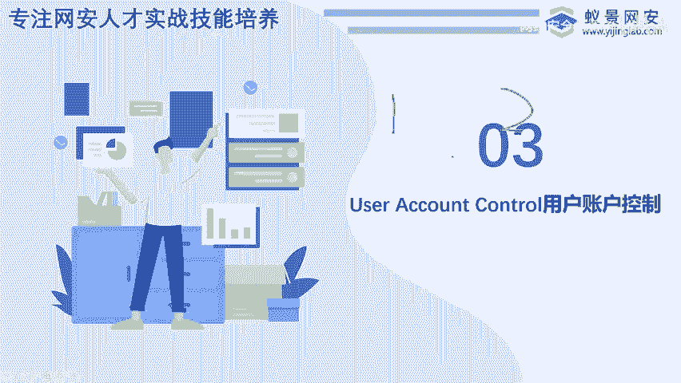