# 2024B站最值得看的黑客教程 ｜ 网络安全／渗透测试／内网渗透／漏洞挖掘／web安全／kali linux／红队靶场／CTF／信息安全 - P115：User Account Control用户账户控制 - 网络安全免费学 - BV1uBsTetEow

知不知道知道的扣个一，不知道扣个2有没有人见过啊，你们不是见过的给我扣个一，没有见过的扣个2啊，有就说都扣2了，对不对？都扣2了，都是哎呀，我靠，我我叫他给你演示一下，我直播间200号人。

我可以向你们保证每个人都见过。😡，每个人都见过你们信不信？好每个人见接下来给你演示一下，你就知道什么叫UAC了，对不对？好，听好了UAC是啥，我先给你演示一波，哎，你就知道UAC是啥了，好不好？好。

那么现在我们这UAC啊一定要在哪里啊，在普通管理员里面才有UAC或者普通用户才有UAC好不好？所以说我们需要把我们的电脑啊切换到哪里啊？😊。

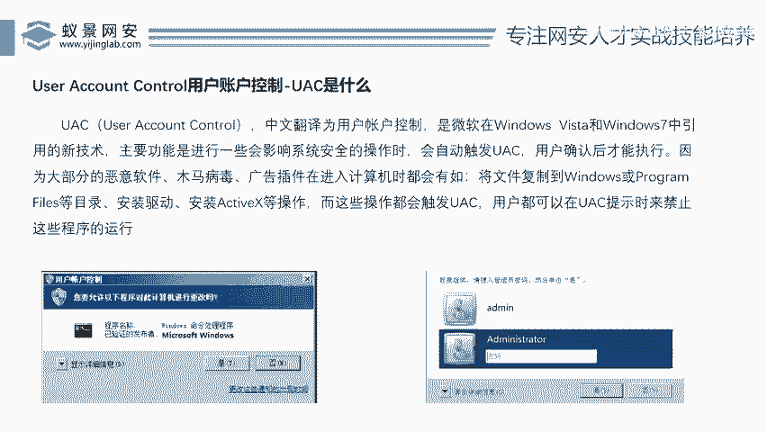

来切换到我们的哎本地的。普通管理员啊，你就能清楚的看到这个UACC，而且是每个人都见过啊，每个人都见过这个UVC啊。不是说哎李哥我没见过，我不知道，对不对啊，只是他的中文名叫这个用户控制啊。

但是实际我们在使用电脑的过程中啊，每个人都见过这样一个东西啊，这个又卡住了。好，我李哥把这个再重启一下啊。😊。

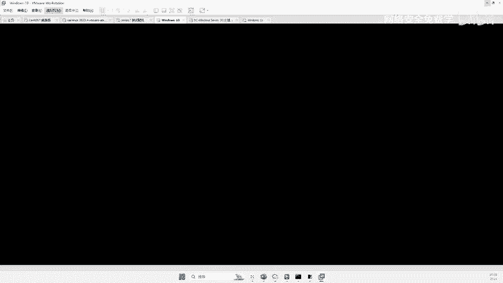

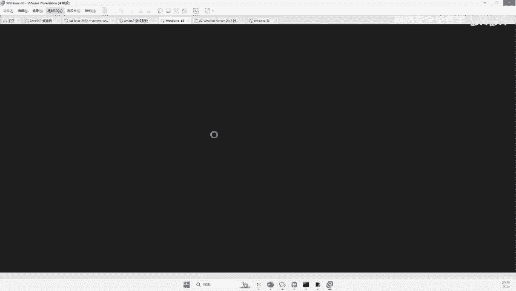

啊，也如果说你们的这个vivo也出现过这样的问题啊，它就是有电脑的话可能会有点卡，或者说我们的电脑这个。

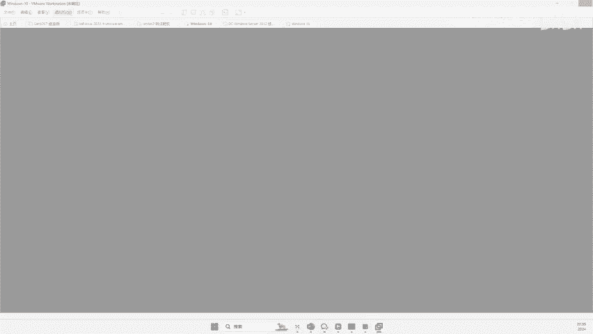

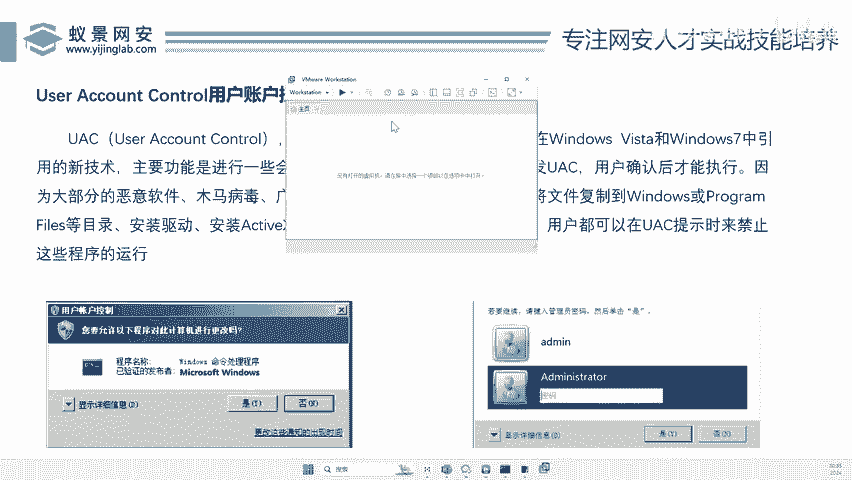

这个啊微 word可能它的版本太高，有点不兼容啊。好，没有关系，我们重启这个vim就可以打开我们的系统了啊。好，我们打开我们系统，进入到这个普通用户啊。好。

接下来啊李哥进入到这个ad me啊这个用户里面啊，给兄弟们去演示一下。😊。

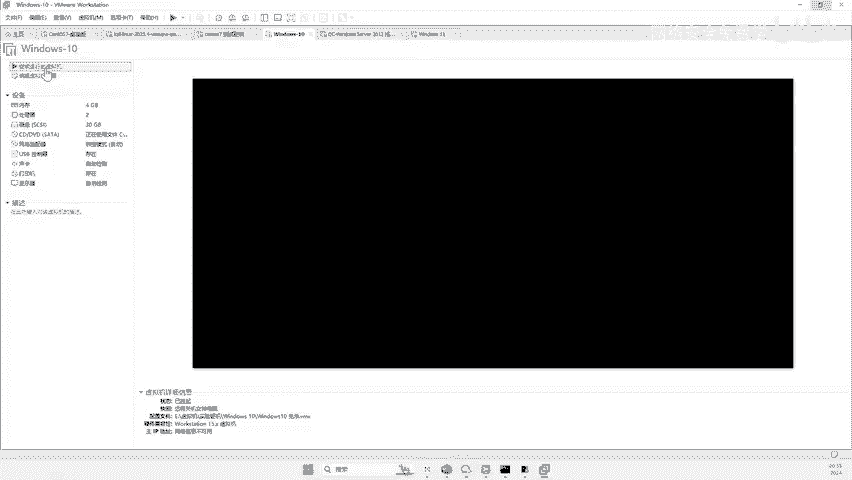

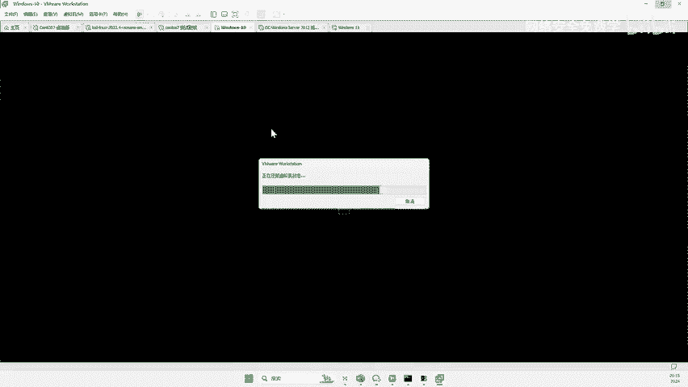

好，那什么叫UAC啊，有人说能不能进st，那肯定不能进呀。那你把它进了，那windows底层程序运行不起来，那就等于你电脑开不开机了呗啊，你电脑开不开机，你要用什么？好，来，什么叫UAC看好了。

你看这里呢我有一个安装程序啊啊，安装程序，哎，我双击一下。😊。

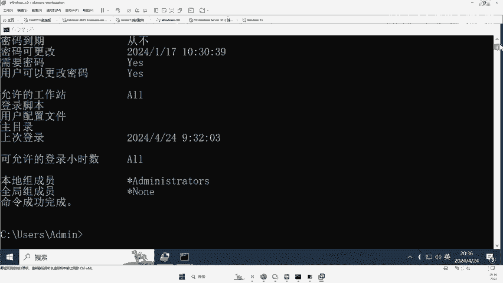

🎼来，我们会弹开一个这样的框，兄弟们有没有遇到过这样的问题？

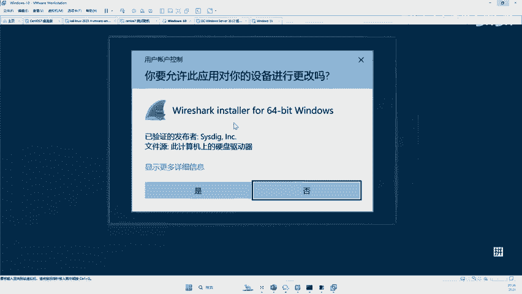

你们都没有好奇过吗？看这里写的什么用户账户控制。所以说知道UACC是啥的不？😡。

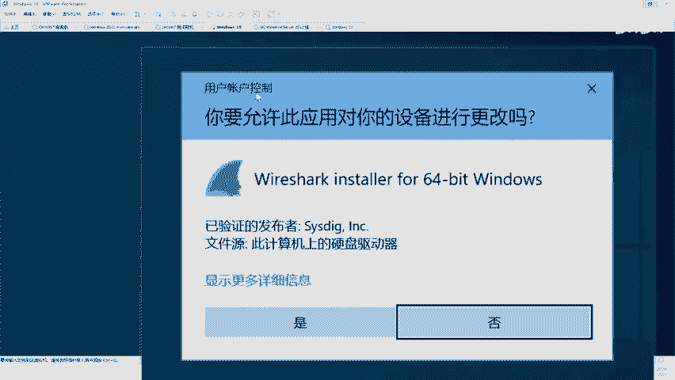

是不是每个人电脑都会肯定每个人都会有这样一个弹框，对不对啊？你见过了吗？啊，你自己往这里注意看，你自己观察一下它写的啥用户账户控制，是不是啊？我们如果说你的电脑是个普通的管理员，或者说普通用户。😡。

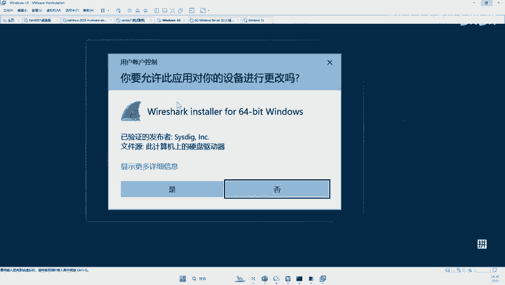

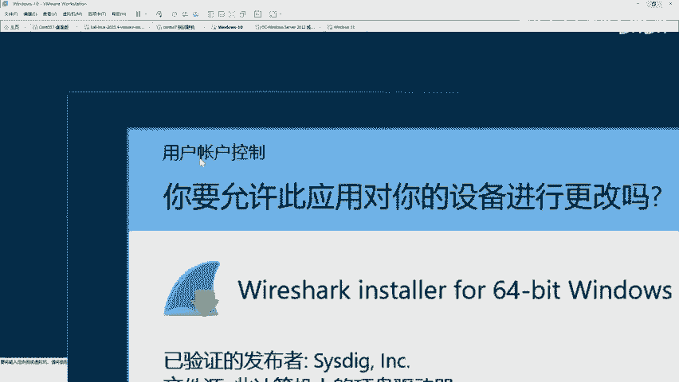

听好了，你的电脑是普通管理员或者普通用户，都会有这个UAC。但是如果说你的用户他是一个高权限用户，他就没有UAC。😊，啊，好，你是说点击啥啊，就说我们在运行一个程序的时候，它会有一个弹框，我们点击是啊。

那这个程序就运行起来了。如果说你点击否，你看假如说你运行这个程序了，你点击否，它就这个运行就不运行了。这个程序就不运行了，对不对？点击是就是运行嘛，我们点击运行这个程序，他问你是否要运行。你点击是。

那这个程序就运行运行起来了。😡。

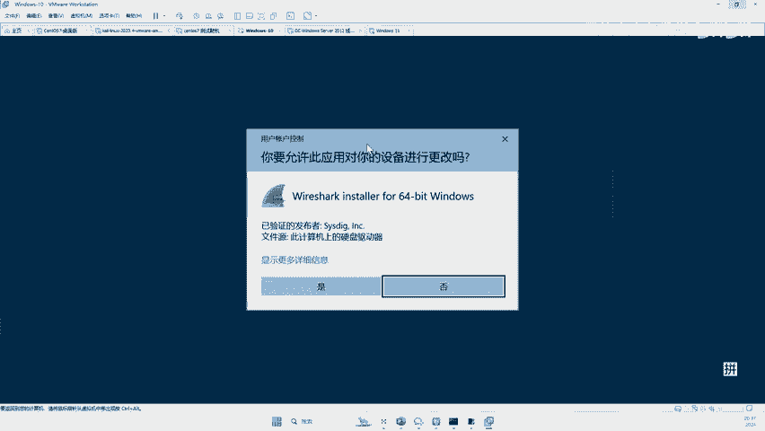

对不对啊，就就这么简单，就这么一个弹框，它叫什么？叫UAC。好，那么这个UAC非常关键啊，UAC中文翻译就到什么用户账户控制，是微软在windows跟win7中引入的一个新技术。听好了啊，主要功能是在。

进行一些影响系统安全的操作时，我们的程序就会触发UAC用户确认后才能执行啊，比如说什么你看。

🎼哎，比如说我们运行这个东西，微软认为你这个东西。😊，是有危险的，需要你确认一下啊，你肯定会确认说是啊，点击是就是你确认完了，那么这个东西就会被运行起来啊，都会运行起来。好，那么就加了这样一个功能。

那么用户确认后就能执行啊，为什么要这样去做啊，因为大部分的恶意软件木马广告都会有以下功能。比如说复制。😡。

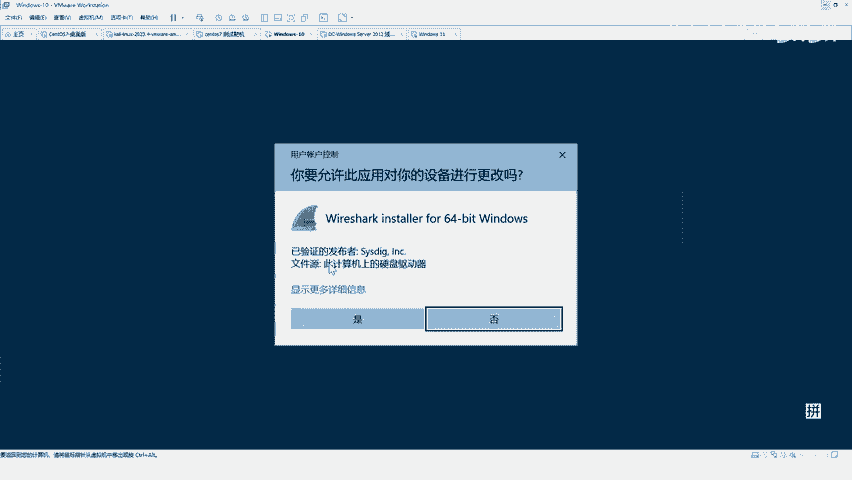

一些东西给我们电脑安装一些驱动，而这些操作都会触发UAC。

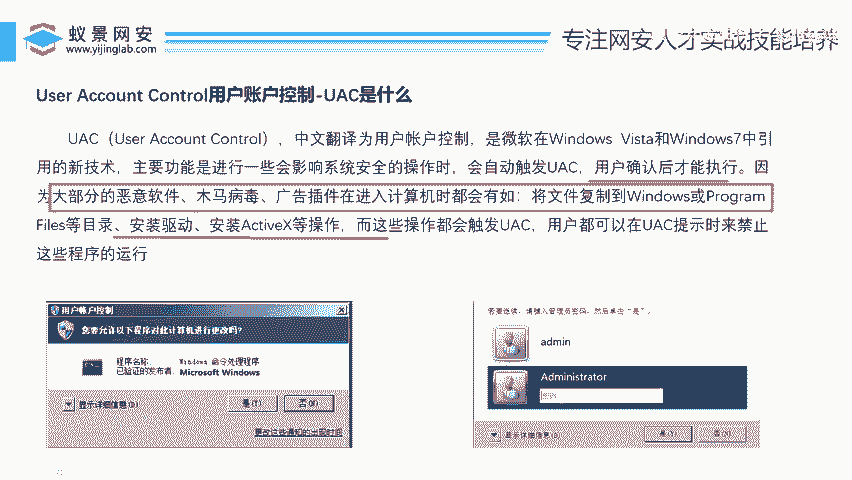

啊，那什么意思呢？那么假如说我的电脑是一个普通管理员。😡，好，那么我运行了这个东西。运行这个程序。好，它运行起来了，但是触发UAC了，触发UAC了，我点击否了，我就可以把这个恶意程序给他什么pass掉。

把这个程序给他干嘛呢？把这个恶意木马让它不运行，这样的话就防止了我们电脑去中毒。😡。

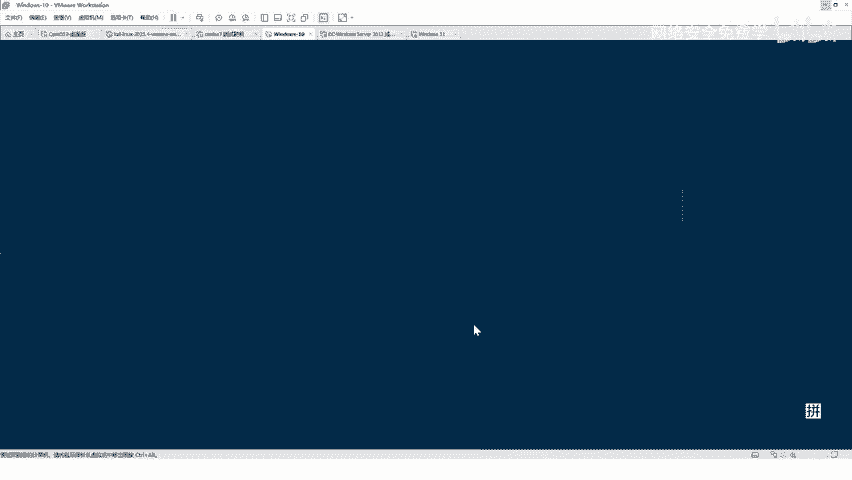

啊，因为这些病毒木马对不对？做这些安装驱动复制，对不对？都会触发这个UAC那么用户就可以用使用这个弹框来阻止它，这样的话就保证了我们系统的一个安全性。哎，这个呢就叫UAC认证。

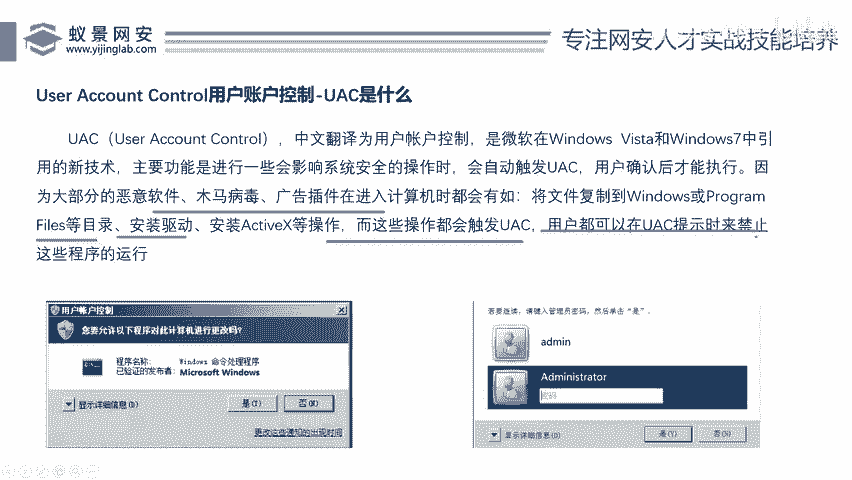

啊，明白吗？好，那这里就弹出一个问题来。😡，哎，说李哥。

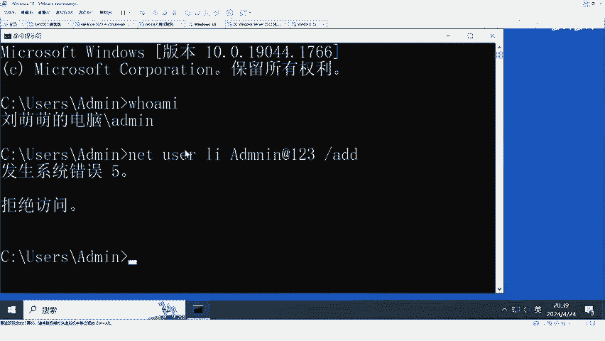

刚才我讲了好，这个用户现在我们当前是谁？who am I是all的命？那么all的命是属于哪里？是不是属于管理员组里面的用户？按道理来说，all的命应该是管理员啊，但是为什么他不是最高管理员？

他是一个普通管理员？为什么？因为它有UAC那么我们执行这个net user。李四。李四啊，添加一个李四的用户。啊，这里提示拒绝访问，请你告诉我是谁拒绝了你的访问。

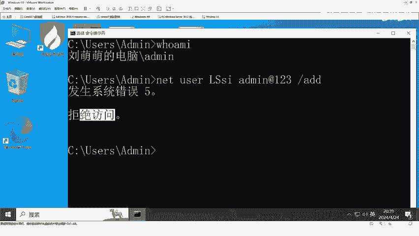

是谁把你拒绝了？😡。

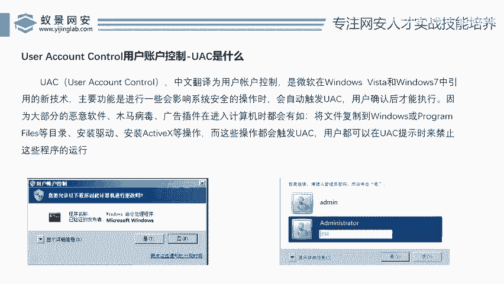

是谁把你拒绝了？😡，是这个用户的权限不高吗？是UAC给你直接pass掉了，明白吗？是UAC给你拒绝访问了，明白吗？因为它底层会有那个UAC的认证，这里没有弹框啊，不是说所有UAC都会弹个框，对吧？

你也可以把那个UAC弹框关了AD叫添加一次叫添加嘛，对吧？就给我们的电脑net，就是给我们的电脑添加一个账号，叫李四啊，这是这是李四的名字，这是李四的密码AD就添加一个用户。

这里我们一输入提示什么拒绝访问了啊，为什么拒绝访问？因为我们电脑有UAC认证。😊，啊，所以给你拒绝访问了。那么如果说我的这个addom me过了UAC，我把这个UAC给它绕过了，让这个电脑永远不弹框了。

对不对？那我按道理来说就可以把这个拒绝访问绕过了，对不对？好，那么接下来给大家展示一下，怎么绕过，好不好？兄弟们，我们在运行这个CMD的时候。好，你有没有这样过右键以管理员身份运行。😡。

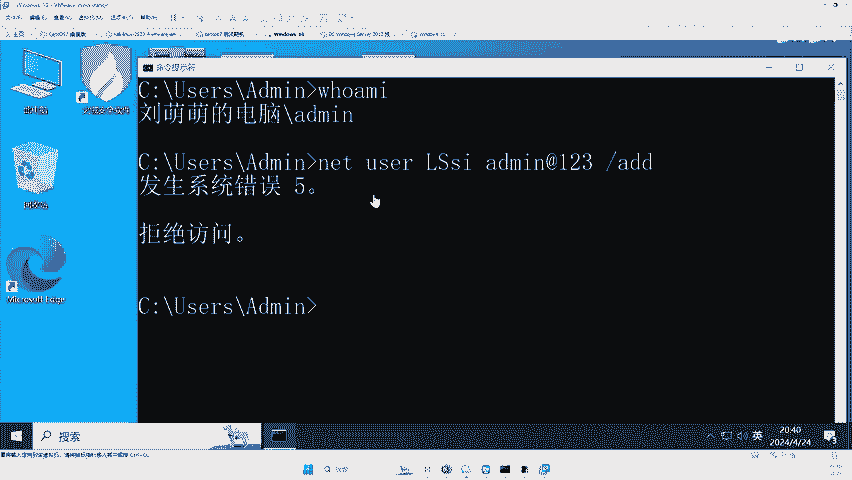

来。😊。

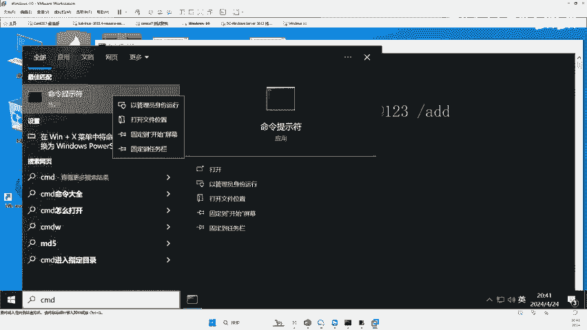

有没有人这样运行过你的CMD运行你的程序的时候，这里提示右键以管理员身份运行。有没有人这样去运行过自己的程序？😡，每个程序都有啊，就是点击你的程序右键，然后以管理员运行。😡，有没有有的话给我扣个一。好。

这里给你讲一下，为什么我们运行程序的时候不要这样去做。😡，🎼啊，有肯定有对吧？你用电脑我不信你没有，对不对？你包括这个什么，对吧？啊，你看包括我这个东西啊，你看我普通双击，你看它会弹框，对不对？好。

现在我右键你看好了，我以管理员身份运行啊，他也会弹框啊，他也会弹框，对不对啊？他当然会弹框。😡，啊，你们经常会这样，又建以管理员身份运行，对不对？好，那么这个又键议管理员身份运行到底意味着什么？来。

你看我得管理员身份运行了，他首先会给我1个UAC认证弹框，问我干啥，问我是否要做这样的操作。因为他觉得以管理员运行权限太高了，太危险了。所以弹出UAC了啊。如果说你点了个是好。😊。

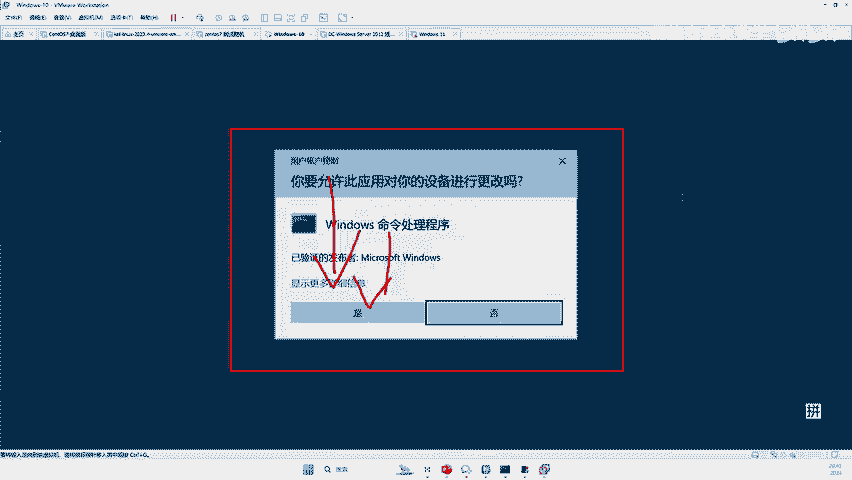

那么现在大家看一下，我们拿到的权限同样是addmin。但是这的命就有区别了，他就绕过了UAC啊。你看当刚才那个UAC我们已经把它点了试了，所以说现在拿到的这个用户，他其实就没有UAC了。来。

不信我们添加一个用户试试，来到一个张三用户来看一下。来，兄弟们来听下看到没？命令执行完成。完成了。完成了。是不是完成了？所以说哎当我们的这个普通的用户，如果说以右键以管理员身份去运行一些东西。

并且点了这个是的时候，那么你现在当前这个权限就是本地的最高管理员权限了。

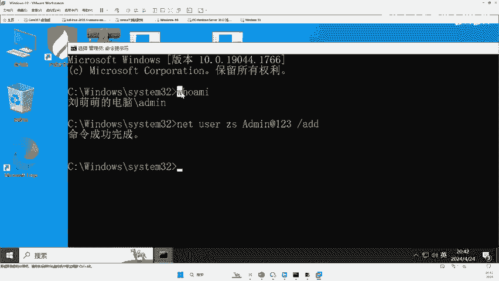

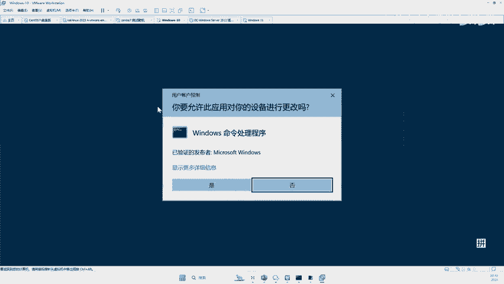

明白吗？啊，明有人说这个账户咋删了？😡，三就是DEL嘛啊就这样就这样n的张3DEL啊，这里会提示我们来允许一下啊，这是这个提示了，对吧？这就删了，这就把ZS删了，明白吗？啊，是是明白了。

就是说当我们的程序，如果你右键以管理员身份运行，并且点了试了，那么这个程序它就是以最高管理员运行。有人说这算不算漏洞，这不算漏洞啊，这不算漏洞，这是windows的一个机制啊。

这是windows的一个机制，明白吗？windows机制好，我们只有搞明白这个机制，我们才要知道什么叫绕UAC啊，什么叫远控，对不对？好，兄弟们，那接下来我们就用远控的程序给兄弟们展示一波好不好？

说多没用，我们直接展示好，我把这个先什么remove掉啊。来这里这现在这个工具是个什么工具，是一个黑客用的远程控制工具。好，我们现在呢远程控制工具升好了来这里有一个木马，看到没？

这里有个木马这个木马看到没叫如果说我现在双击这个木马。😊。

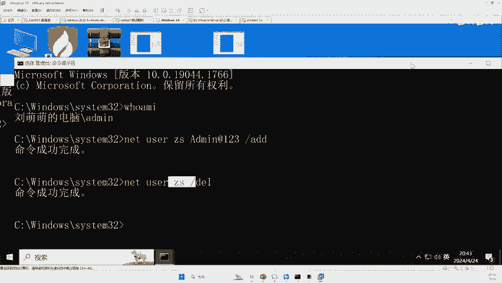

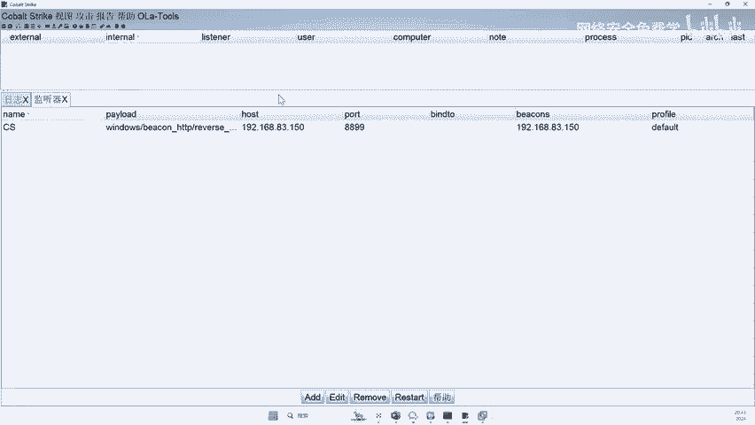

我的这个电脑当前立马就会被控制下来。好，那么现在我的电脑权限是什么啊？是不是一个普通管理员有UAC好，现在一般木马运行的时候不会去触发UAC啊，也人说为啥我的电脑不谈UAC，因为你运行的程序，它不危险。

明白吗？如果说你运行危险的程序，它就会触发啊，那我电脑运行这个。😊。

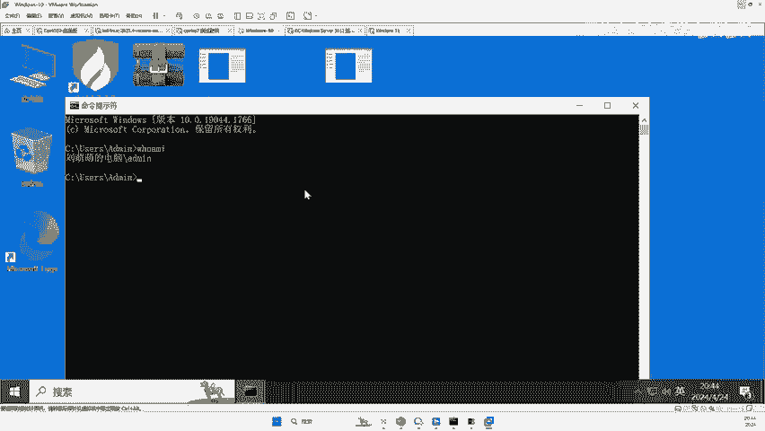

照触发吗？他不触发呀，看到没？我运行这个。😡，这个什么这个这个是这叫啥东西啊？这个这个叫啥浏览器它不触发呀，你浏览器有啥危险的，对吧？我们UAC只是在触发，它会做一些危险操作的时候才会触发UAC明白吗？

你运行浏览器当然不会触发UAC了，那得麻烦死啊，你得你得气死去，对吧？你运行这个你看运行火容啊，你也不会触发UAC啊啊，他说因为你这个东西没有什么不危险啊。好，那么接下来兄弟们，我们运行这个远程工具。

😡，来，我运行了，我把这个木马运行了，这个木马呢也没有触发UAC好，但是同样你看到没？兄弟们来我这个远程工具上大家看一下。😊。

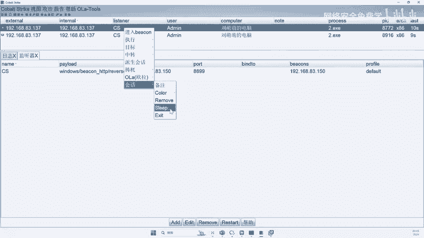

哎，我干嘛呢？哎，我已经上线了这个机器啊，这里是不是多了一条记录？😊，啊，你看当前我是不是用这个远程工具把这个电脑控制下来了啊，当前控制的用户是谁？是ad me。

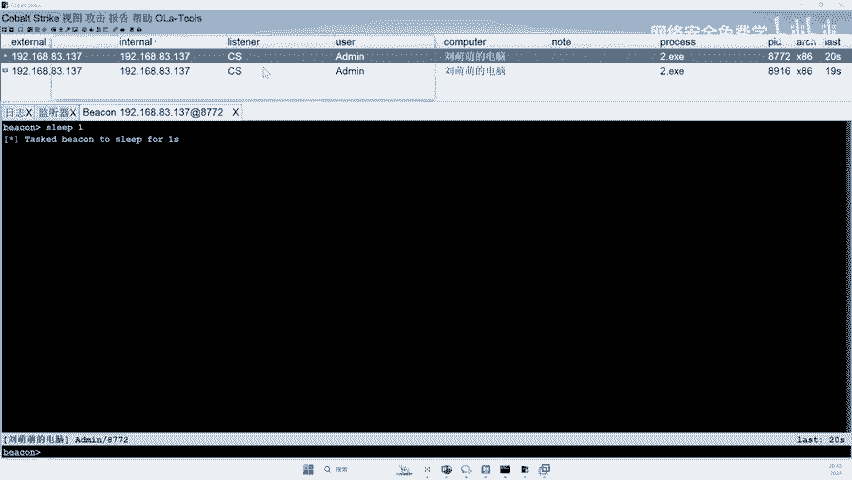

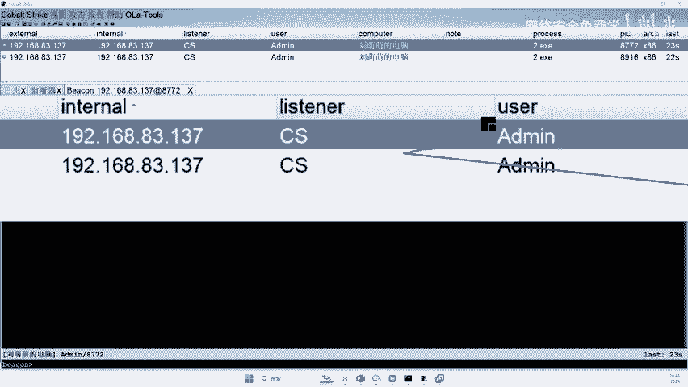

看到没？是不是额的 me？好，那么运行额的 me，那这个额的 me是什么用户呢？是不是普通用户呀？那么普通用户、普通管理员用户，对不对？那么普通管理员用户他就不能做一些什么高危险的操作。😊。

来看一下是不是。哎，我们的底下这个啊sleep一下啊。😊，OK进入这个啊，我们用这个是啊。😊，好，进入布尔。好，我们等待60秒。😊，好，现在我们这个木马是不是被这个me运行了？

那么德 mini运行的时候，它是一个普通的管理员啊，那么普通管理员兄弟们他没有过UAC啊，没有过UAC，所以说他的权限就比较低。那假如说我们一般的木马都是都是这样被运行的啊。你的木马运行起来。

肯定不会一般不会触发UAC对吧？你触发UAC别人是不是就发现了啊，所以说我们木马被别人运行起来，他不会触发UAC啊，不会触发之后呢啊O那也没有问题。那么你控制着这个电脑的权限，他就是一个普通管理员啊。

没有过UAC的管理员。那么你的这个管理员没有过UAC来，我们来看看。😊，来我给大家截截图截大一眼啊，你看。来截图。你看我在这个控制行里面输了who am I，那么当前是old me。😊，对不对？好。

那么all me之后呢，来假如说我想给这个电脑添加一个用户，来，我们来试一下。😊，我回车来，兄弟们往这来看啊，看到没？😊，拒绝访问。拒绝访问。拒绝访问，那等于那你现在控制个电脑有意义吗？

你的木马运行起来了有意义吗？没有意义，你想添加一个用户拒绝访问，对吧？这个用户普通管理员。😡，拒绝访问，那你怎么办呢？凉拌呀，你只能照呀，对不对？你要么让他干嘛控制的这个程序。😡。

过了UAC或者说你通通过一些插件，通过一些漏洞，把它提全到administr或者syst，那么你才等于说拿到系统最高权限，否则你拿到这样的东西拒绝访问，你做什么高权限的操作。

他有UAC全部给你拒绝访问了，那你就什么东西都不能做。你想复制个东西往它C盘里复制个什么东西，拒绝访问，你想添加一个用户拒绝访问，一样给他安装一个驱动，拒绝访问，一样给安装一个什么挖矿病毒拒绝访问。

完了，你的电脑啥都不能用了，对不对？啊，那那如果说我们怎么绕这个东西，那就是我们要讲的东西了。好，我们怎么绕先不说啊，那么假如说听好了，你看这个木马刚才是不是我们双击运行的啊，没有弹UAC好。

那么假如说我右键以管理员身份去运行这个木马来兄弟们往这里看。😡。

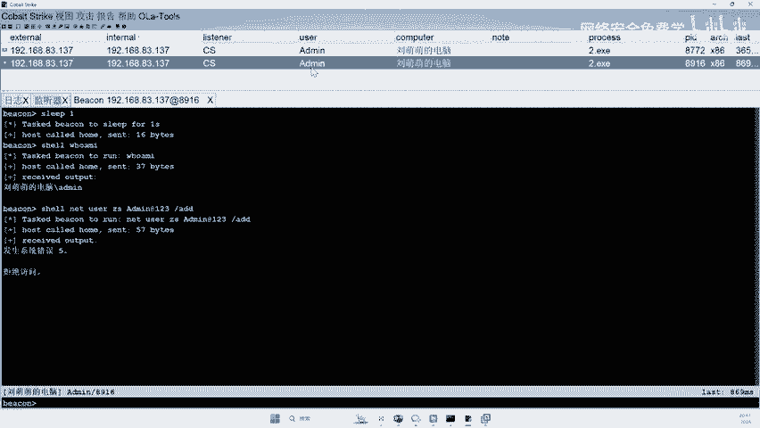

他是不是会弹出这个UAC的弹框啊，那么这个时候。windows就认为你这个危险了。好吧，你既然以管理员去运行这个东西，好家伙，太危险了啊，问你要不要执行啊，你说你要执行好，不好意思，兄弟，来。

我们往这里看，你看这里呢又会上线一个东西，来往这个远控工具里面看，远控工具里面，这是第二个。第一个你看这里会多了一个什么星号，多了一个星号，什么意思？就是过。😡。

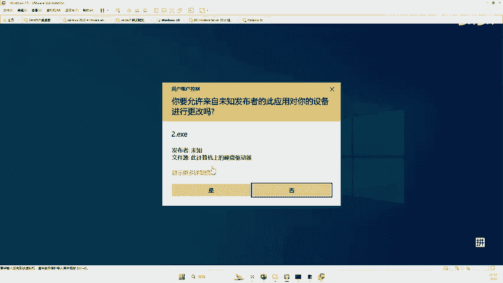

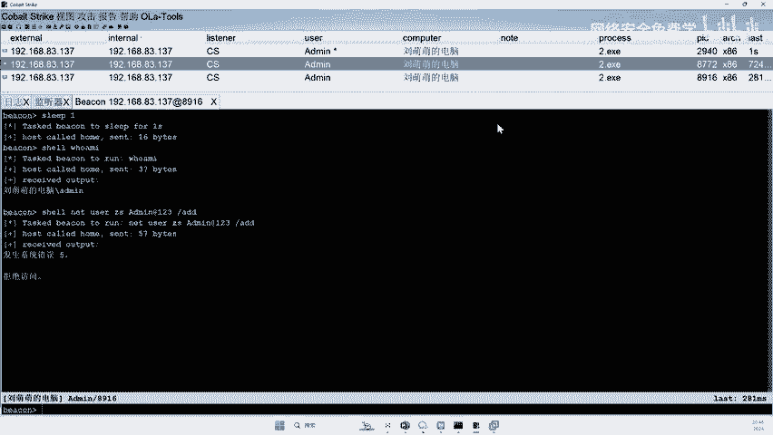

过了UAC认证。明白吗？看到没？那如果说你的这个用户后面带一个星，那就代表当前你控制个电脑就是最高的管理员了。🎼哎，为什么？因为它已经过了UAC为什么要过UC？因为你右键又管理员运行了。好。

那么现在我们进入这个什么进入这个进入这个sleep啊，我给大家sleep一下啊。😊。

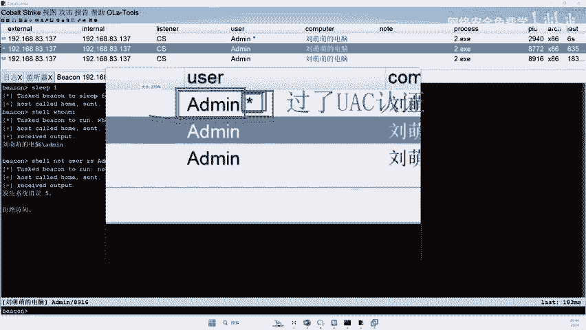

啊，给它延迟到1秒。好，我们重新去干嘛啊。😊，好。为啥最高也删不了系统文件，系统文件你肯定啊肯定也删不了吧，好不好啊？好，我们一会儿用到这个最高这个管这个过了UAC的管理员。

给大家再去运行一些高权限的操作，让你们看看它会有一个什么样的提示啊。😊，OK兄弟们啊，我们在这来再试一下，这样不晚吗。😊，好，what meO没问题了。我们再运行这个添加用户的添加用户的命命令啊。😊。

来往这里看。好，这里写错了啊，n啊。

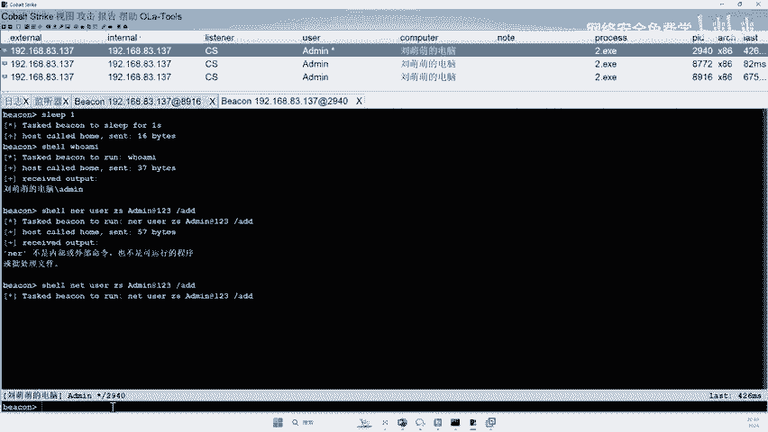

来往这里一看。我给大家解答哈，当前我的用户还是有得命，对不对？你看但是我执行什么添加用户这样高权限的操作，他提示什么命令执行成功，为什么？因为你运行这个程序的时候，过了这个UAC。😊。

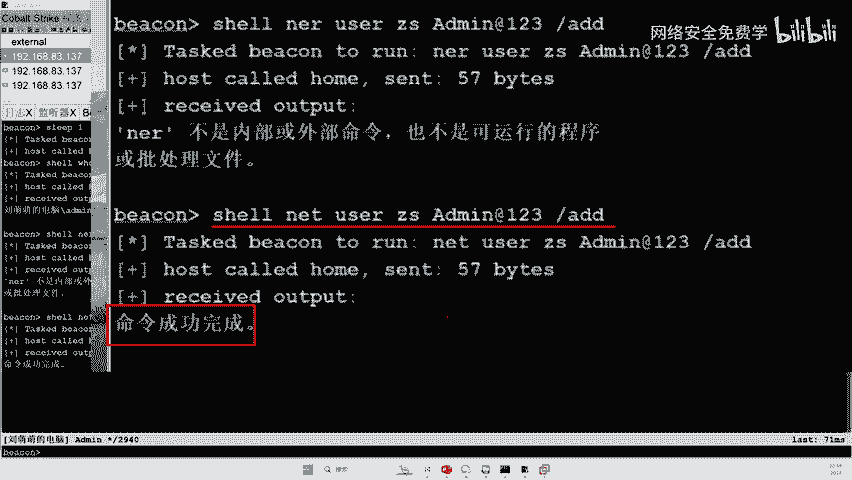

你绕过了这个UAC啊，你右键你用UAC这个预管理员身份去运行了，对不对？😡，啊，所以说大家千万不要这样去做啊，那么你一旦这样做，那么别人控制你的电脑就是最高权限了，明白吗？那么就机了。

你的电脑真的就被远控了。好吧，所以说有UAC的时候，一定要再三确认好吧，好，那这里呢我们还有一个问题啊，我们还问题还没有有人说了，李哥，你刚才说了，要拿权限就要拿到system。好。

那怎么通过这个过了UAC的管理员拿到sstm，有人知道这个问题吗？来，我把这个问题写到公屏上。😡。

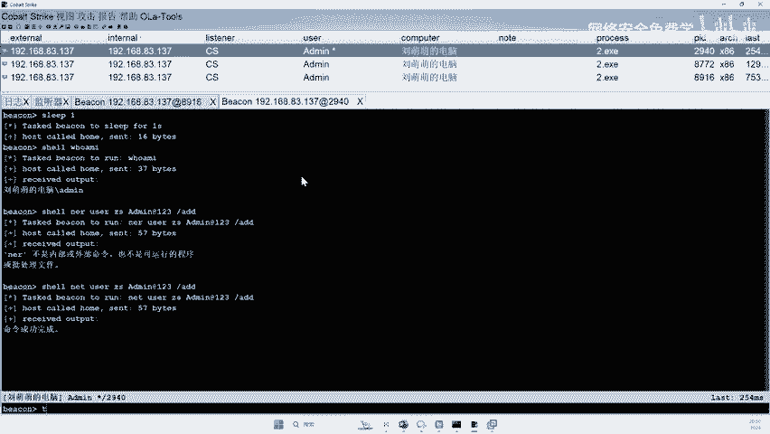

啊，来。看好了啊，如何使用。如何使用？过了UAC的。权限。啊。提全到。テた。有人知道这个问题吗？😡，啊，假如说哎我的这个恶意木马是过了UAC的啊，过了这个UAC认证的好，我现在已经远控了有个星号了。

那么我如何拿到这个系统的stom权限呢？啊，李哥刚刚说了，stm是最高权限的，怎么拿？😡，来，这里李哥给大家说一句话啊。😊，过了把这句话要认刻在自己脑子中啊，过了UUAC的管理员。😊，一定可以拿到。

系筒。听好了，一定可以。什么叫一定可以？也就是不管你的电脑是win11。😡，还是win10。都可以。明白吗？那怎么拿就是我们要讲的技术的令牌窃取技术。啊。我们用令牌窃取技术就能直接拿到st。

O那接下来给大家去讲解什么叫做令牌窃取技术，好不好？

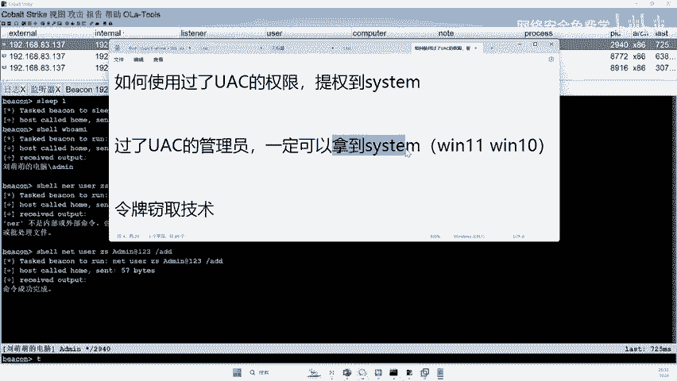