# 2024B站最值得看的黑客教程 ｜ 网络安全／渗透测试／内网渗透／漏洞挖掘／web安全／kali linux／红队靶场／CTF／信息安全 - P116：Windows令牌Token临时秘钥展示 - 网络安全免费学 - BV1uBsTetEow

好。好，讲这个令牌窃取技术之前呢啊因为它其实也比较简单啊，我们用10分钟啊给兄弟们讲清楚啊，用令牌就可以一键提前到stem。好，那么什么叫令牌啊？就是windows的一个tooking啊。

windows的一个什么啊，临时密钥。好，我把这个鼠标拿过来啊，临时密钥啊，相当于账户密码啊，用来决定本次请求是否属于哪个用户啊，所以说这个令牌是什么，来给大家讲解一下啊，我们windows的令牌。

一般主要来说就是这个访问令牌啊，这个访问令牌怎么来的啊，就是说当我们电脑呢好电脑啊，你开机之后，登录登录到这个电电脑里面去了，电脑呢就会生成一个令牌。有了这个令牌之后。

我们就可以对这个电脑进行一些操作了啊，比如就什么例子呢？就比如说一个网站嘛啊，我们用账号密码登进去之后，就能在这个网站里面进行购物啊，进行进行什么一些啊添加一些个人信息啊，对不对？就这样的操作了。

那么你用windows的账号密码登录到这个系统里面了，对不对？系统就会给你有一个令牌。那么你有了这个令牌呢，你就可以在这个电脑里面做任何操作，打开一个程序，关闭一个程序，对吧？然后呢去运行一些游戏。

对吧？删除一些软件。哎，为什么你能删除一些软件。为什么你能打开一些程序。😊，我们的底层有令牌，因为我们已经用账号密码登录过了，对不对？好，所以说这个就是令牌。那么令牌是分为两种的啊，一个叫授权令牌。

一个叫模拟令牌。授权令牌是什么？令牌？就是你有了这个令牌，你可以进行什么啊，比如说远程登录啊，什么叫模拟令牌啊，就是啊你可以用这种CMD的形式进行一些啊共享文件夹的访问啊。

一般来说这个授权令牌跟模拟令牌都是同时拥有的啊，有了授权就有了模拟令牌啊。😊，好，这样讲，兄弟们可能不理解啊，你要知道，就是当我们的系统登录之后，它就会有令牌。就这么简单啊。

有了令牌我们就可以再用电脑去做一些操作。好，那么如何利用这个令牌去进行窃取呢？好，兄弟们来接下来给大家讲解令牌窃取。我们还是以这个电脑为例好，我们又用到一个工具叫这个工具，这个工具。

这个工具专门是用来做令牌窃取的。而且大家看一下没有毒啊，有说哎那这个东西啊黑客工具是不是有毒啊，告诉大家没有毒来往往前拖一下啊，看到没？好，杀毒软件扫描是没有毒的啊，首先来告诉你没有毒啊。好。

那接下来哎。😊。

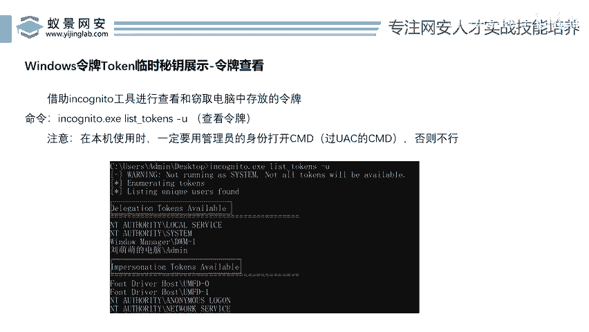

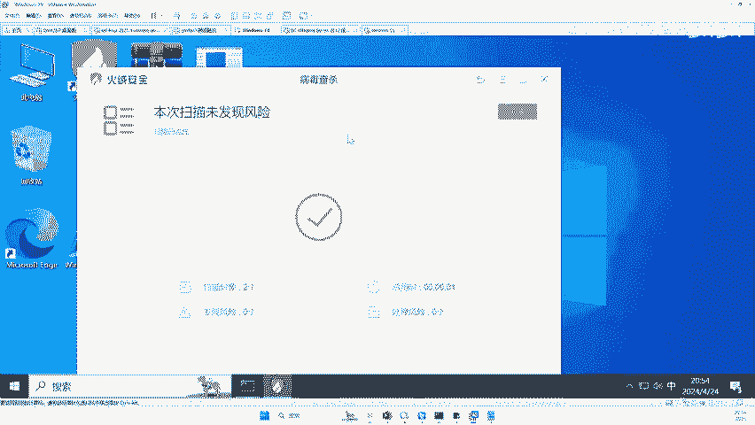

来，我们打开一个东西啊，怎么去窃取令牌幸好了。那第一步我们啊这个令牌关机之后就没有了啊，关了重启之后就没有了，对吧？但电脑只有你输入账号密码登进去之后才会有令牌啊。好，那这个令牌第一步就是查看这个令牌。

怎么查看非常简单。好，我们运行这个工具一键就能查看了啊。😊。

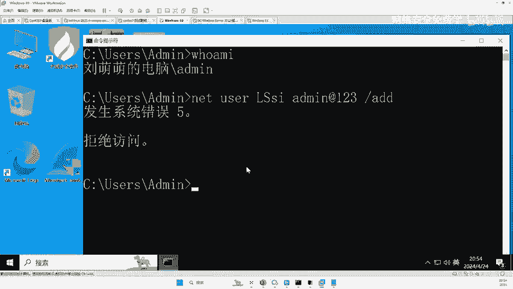

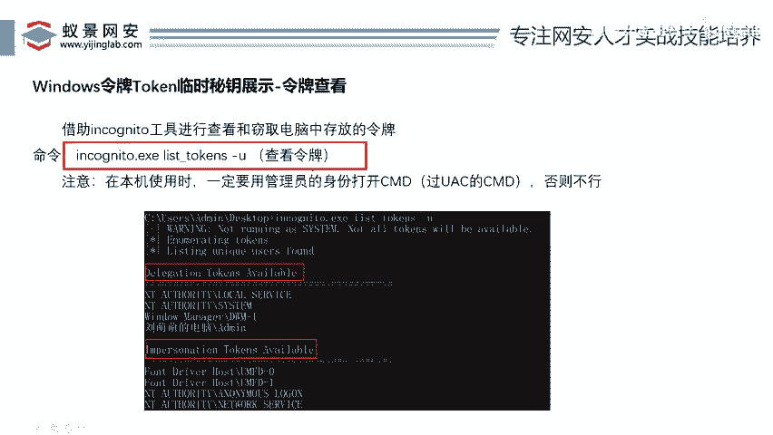

好，IN。好，怎么运行啊，用这个命令啊，插字有一个命令叫做什么啊？我们来看一下啊。😊。

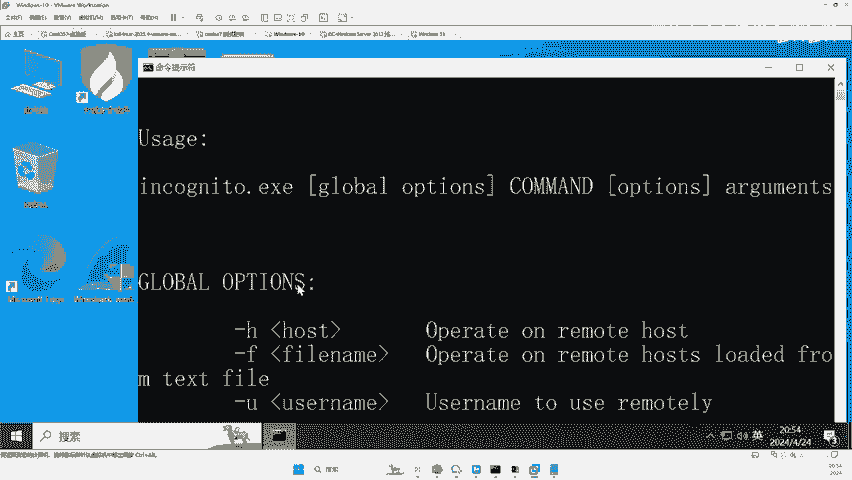

叫这个list tokens啊，就叫展示令牌的意思啊。好，给大家展示一下啊，我们放大啊。😊，杠U啊这个操作就是什么？显示你电脑中当前系统内存中存储的令盘。好，我们回车来，那么当前这个电脑存储令盘。

我们用这个old me没有过UAC的管理员看了一下啊，只有什么刘萌萌的令牌。这个令牌什么，是不是啊授权令牌，就是用于。远程登录操作令盘啊，只有一个olddom me这个账号的令盘，其他的看了是空啊。

但是如果说啊我们是用过了UAC的管理员。

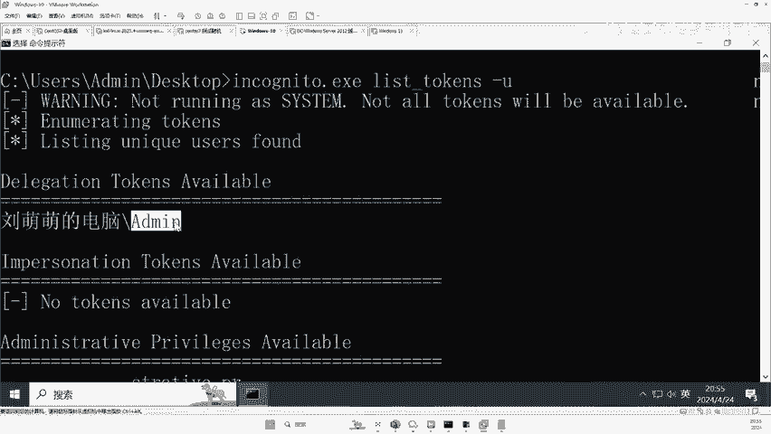

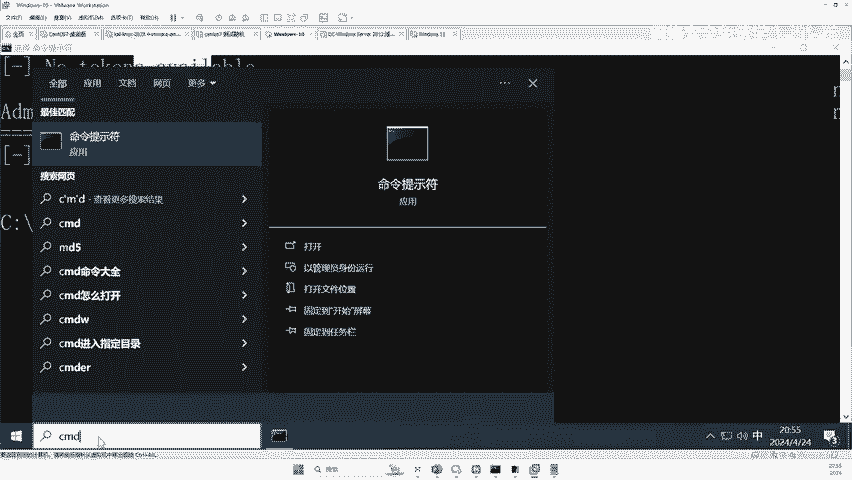

啊，这个。用户对不对？去运行这个麦克麦克不一样啊，麦克不一样啊。啊，我们来我们再去运行一下CDusCD到admin啊CD到desstop。😊，好，我们再去干嘛呢？啊，运行刚才的这个命令。好。

我把这个命令找出来啊。😊，好，把这个命令复制一下。😊，来。好，我们回车。看到没？他的令牌就比较多了，为什么？因为当前这个用户对不对？他是过了UAC的，他的权限比较高。

所以说他就能查看这个系统里面的所有令牌啊。那么刚才这个mi它是没有过UAC的，所以说你只能查看自己的令牌，对吧？为什么啊U不让你看，所以说我们过了UAC后。

兄弟们往这里看这个令牌里面有这个什么localserv的令牌，有sem令看到没那s是什么用？刚才已经讲了电脑开机就有那么电脑开机就有这个s是系统的，那么也就有这个stem服务令服务用户的令牌了。

那还有什么还有administ的令牌，还有什么还有白里的令牌，为什么会有这个令牌，是不是因为我们刚才在这个电脑里面切换过用户我们切换过administ，我们切换过白里，那么这些东西我们电脑又没有关机。

以它就会存在这个电脑里面来，所以在这里面我们是可以看到的令牌minist令牌白里的令牌。😡。

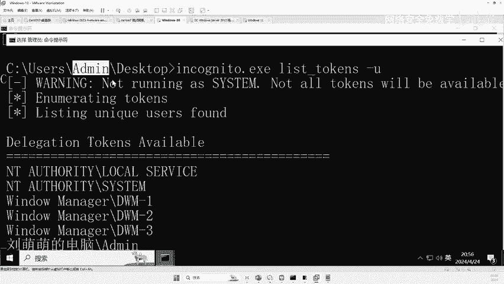

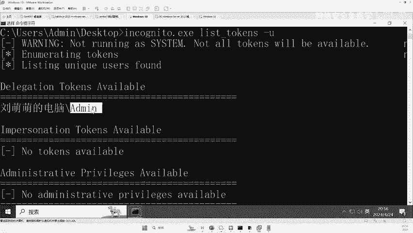

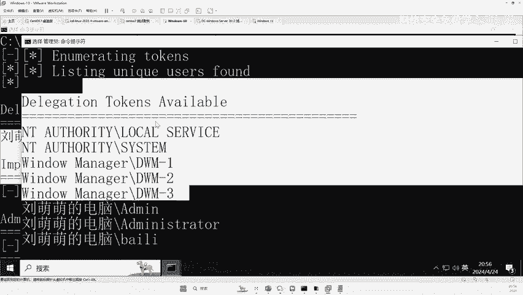

好，那有了这些令牌，我们直接通过这个令牌就直接拿到这个权限。好，那怎么切换呢？好，听好了，直接用这个工具去切啊，怎么切。😡，啊，同样这个工具提供了啊令牌切换的命令啊，XQ这个EX。一开始好了。

我们来直接什么运行这个东西啊，叫执行的意思，然后什么杠C啊，杠C后面啥意思？就是加入你要窃取的令排名。好，这里面兄弟们，你们想拿到谁的权限？😊，比如说你想拿这个，你就把这个这个叫令牌，好吧。

令牌全称把它令牌复制一下。😡，啊，复制到哪里呢？直接复制到这里面来杠C。啊，复进来啊，复制进来之后呢。😊，来。啊，然后在后面加一个什么CMD点EXE啊，这句话什么意思？就是我们窃取这个stem的令牌。

窃取完成之后呢，用这个令牌去运行这个CMD这个程序。那么运行的这个程序一定就是最高管理员来运行。😊，看到没？来，现在我们呼外麦看一下。来，兄弟们看那谁的权限，我呼M麦谁的权限。😊，C那个看到没？

谁的权限？😡，Stem。system看到了没？是不是最高权限了？好，那这里面有这么多令牌，你想拿谁的权限就拿谁的权限，想看谁的权限就用谁的权限，想切换到谁的权限就切换到谁的权限就可以了，对吧？

因为我们干嘛？我们用过了UAC的这个。😡，这个东西对吧？查看到了它内存中有这么多令牌，那么就可以借助这个工具，对吧？任意去切换这些东西，你甚至可以提全到这个里啊，把这里这是它令牌名啊提全啊。

我们直接用这个工具。😊，对吧。啊，先退出一下。好，退出这个程序。好，来，这里呢我们有啊，现在我们窃取的是st令牌，对不对？好，现在呢我们去窃取这个刘萌萌的administ令牌啊，窃取完成之后呢。

用它这个令牌去运行什么CMD好，我们回车。😊，来，现在看我的权限是谁。我都没的吹到。看到没？好，那么现在兄弟们。😊。

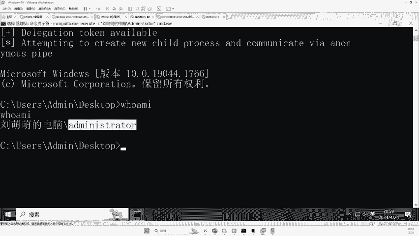

问题来了，我现在用的这个工具。远程控制了这台电脑。你给我说，我现在要拿到stom权限，怎么拿？😡。

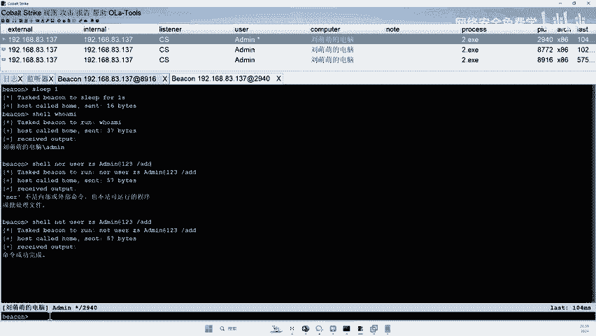

是不是直接令牌窃取啊？好，那直接我们话不多说，直接看一下在黑客的视角下，黑客是怎么用你的过UAC的管理员直接拿到你电脑的st权限的。首先他会在你的电脑上传一个工具，就是这个什么啊令牌窃取的工具。好。

然后借助令牌窃取的这个工具。😊。

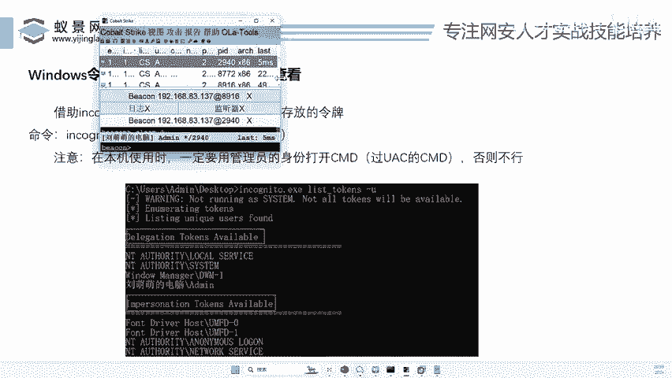

嗯。干嘛呢？去查看你电脑中有哪些令盘。好，那么我接下来啊我就按照刚才的操作去执行一遍。好，我们杠U啊，回撤一下。好，那么假如说黑客就看到了你电脑中有这么多令牌，对不对啊？登录过的令牌。

那我想拿到这个权限，我就直接把它复制一下啊，然后干嘛呢？啊，然后直接运行刚才我们的命令啊。😊。

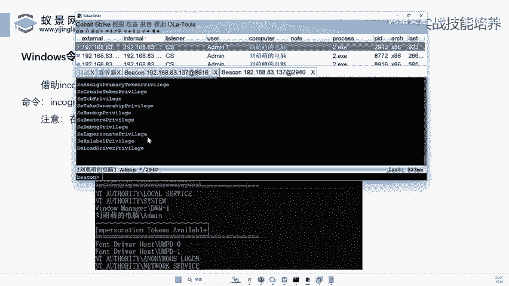

啊，这个命令呢李哥就直接复制过来了啊，就不那个不敲了啊，敲的话浪费时间。好，我们把这个命令复制复制到哪里呢？啊，复制到。😊。

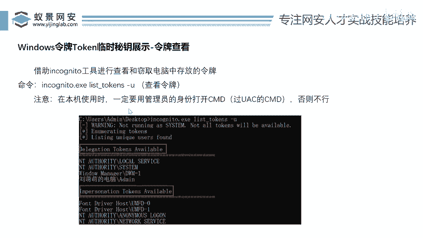

啊，这个。木马里面来啊。O。这样好，那这里的窃取的令排名，哎，我们想窃取谁？啊，去给谁，比如说che这个st啊，就st好，那么这里要运行的程序名是谁呢？😊，不对啊啊，删了啊。好把它粘过来，对不对？

杠C好，写我们的令排名。😊，好，然后再写什么，唉，这没有复制成功啊，我就说嘛啊好，我们右键copy好，把这个令牌复制过来，然后用这个令牌去运行谁。你们说一下，直接去运行这个木马就完事了，对不对？好？

我们运行这个12。EX1好，那么我们注意看这句话什么意思啊，给大家截出来看啊，看我们用令牌窃取的工具窃取了stem的令牌。因为st令牌存在了电脑的内存中，存在内存中之后。

我们用这个令牌直接去运行这个恶意木马，那么这个木马就会干嘛呢？就会以stem程序运行，那么我们就会在远控软件上得到一个sstem的什么最高程序好，运行一下。😊。

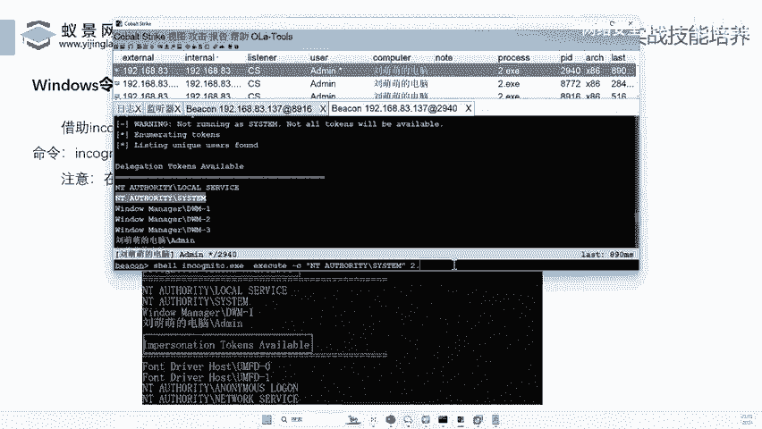

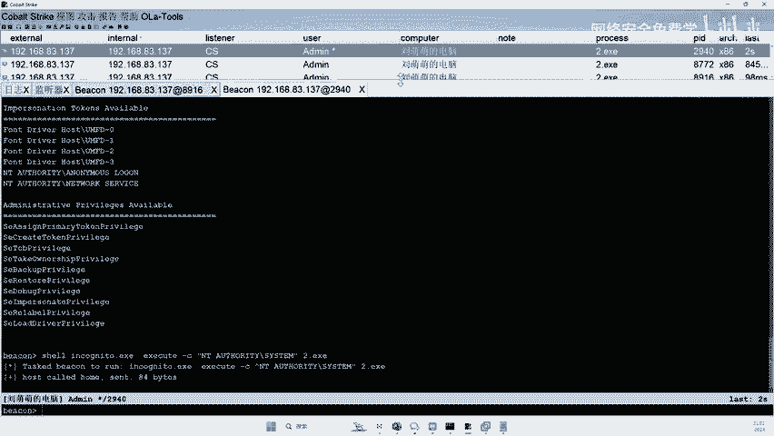

啊，等待。来，兄弟们往这里看。拿到了没有？拿到没有，兄弟们。😡，看到没？是不是提全成功了，最高管理员了。来看明白没有？看明白给李哥扣个一，看到了吗？太明白了吧，是不是非常简单，简不简单？😊。

是不很简单啊，它的原理是什么？原理就是因为我们一定要过了这个UAC过了UAC之后，我们就可以查看电脑中的所有令牌了。又因为sstem用户是我们系统自带令户自带用户，所以说你查看所有令牌的时候。

就能查看到stem的令牌。然后你就可以利用sstem的令牌去运行所有程序。那么运行的所有程序都是以stem程序去运行的。那么你就拿到了sstem的最高权限了。😊，啊，就这样轻轻松松的就提全了。

不管你的电脑是win10还是win11，都可以轻松提全。哎，明白了，兄弟们啊，明白了啊，这就是我们讲的什么令牌窃取啊。那这个一键提全，也就是刚刚一个给大家讲的这个什么啊，一个小程序。

这个小程序可以一键提全啊，提全到什么提全到我们的这个st啊，这个跟刚才讲的那个工具是一个工具啊，一个工具OK明白吗？兄弟们好。😊。

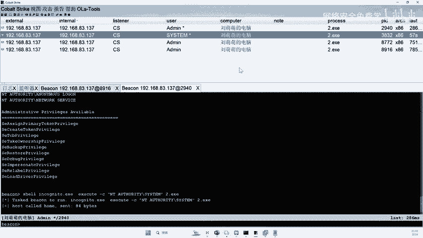

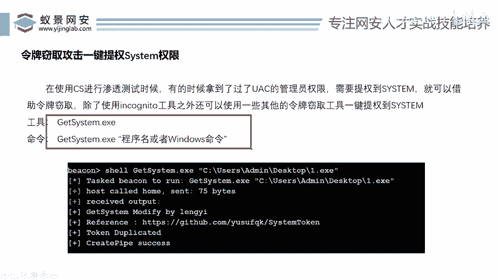

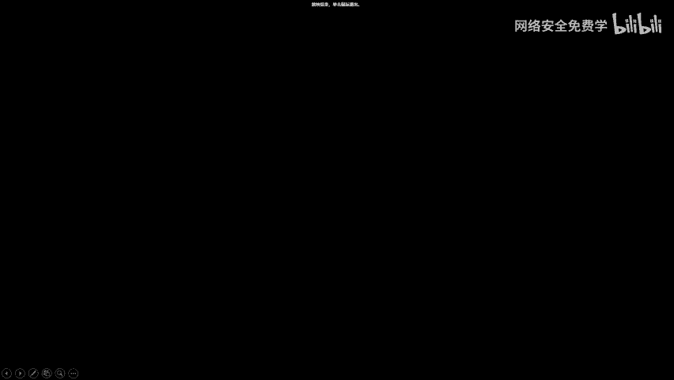