# 2024B站最值得看的黑客教程 ｜ 网络安全／渗透测试／内网渗透／漏洞挖掘／web安全／kali linux／红队靶场／CTF／信息安全 - P117：ByPass UAC攻防中的利用方式 - 网络安全免费学 - BV1uBsTetEow

在这里给大家说一下白pasUAC的攻防中的利用这是什么意思。因为李哥也做红队做了45年了，对吧？我是知道的，当我们很多时候去钓鱼啊，特别是打一些攻防项目的时候啊，远控，比如说你远控移动的一个员工啊。

那么他这个员工的电脑啊，百分之多少，你知道吗，90%啊都是有这个UAC的啊，那么有这个UAC就是阻止的你渗透啊我们必须要把这个UAC过掉，才能进一步的渗透啊，才能进一步的去渗透我们的电脑，对不对？好。

那么这个UAC来啊，我还是读一下，对不对啊？你看在这个什么红队攻防中啊红队攻防中啊，我们经常会采用钓鱼的方式控制别人电脑，什么叫钓鱼啊，就是我们给这个公司的内部员工发一个木马，或者发一个病毒啊。

通过邮箱的方式啊，但是往往呢都是有UAC的认证管理员啊，就说你控制别人的电脑啊，他一般都是有这个UAC认证的啊，并且啊不能获到最高权限。就是我们钓鱼的方式一般钓不到最高权限啊。

那么说只有你把这个UAC认证绕过了啊，我们才可能拿到这个。😊。

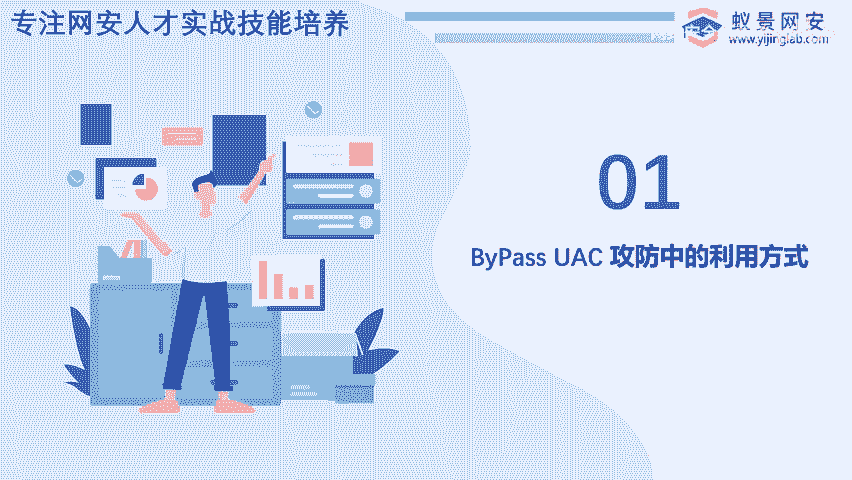

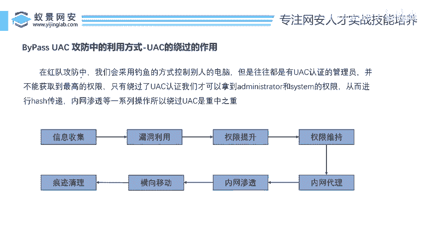

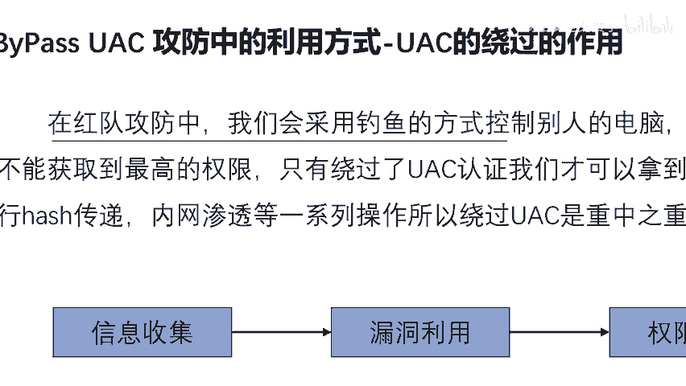

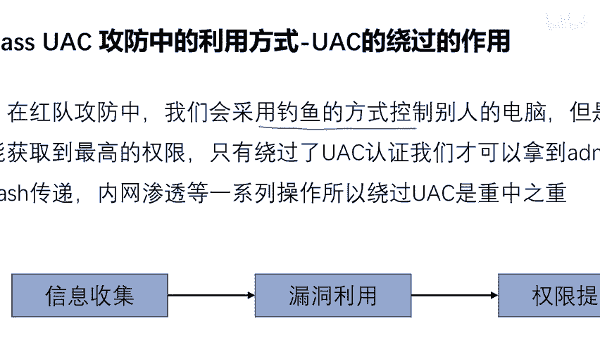

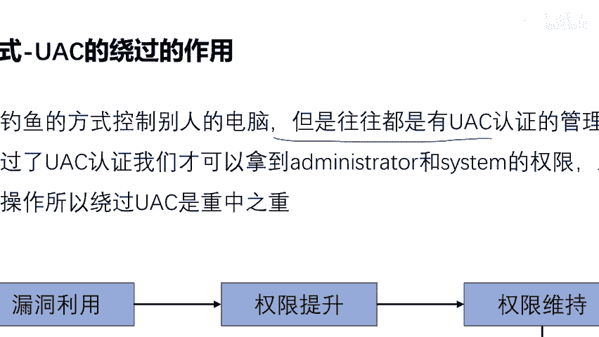

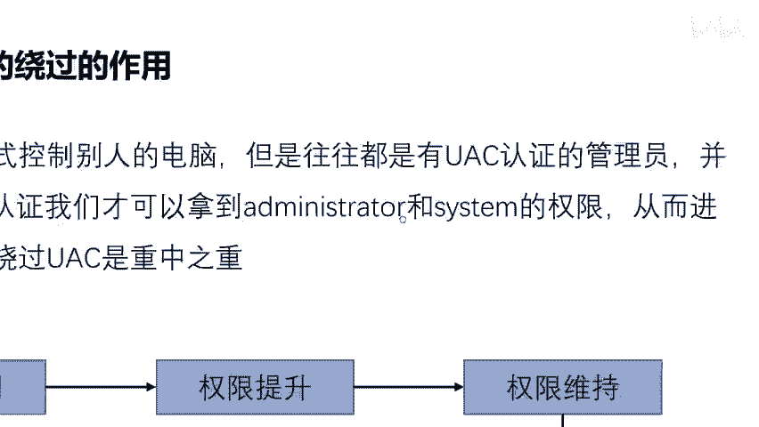

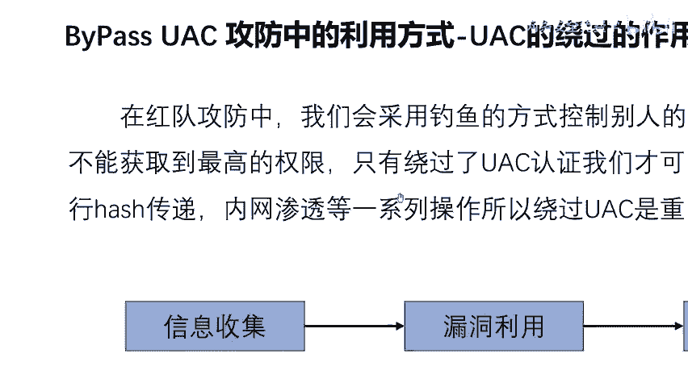

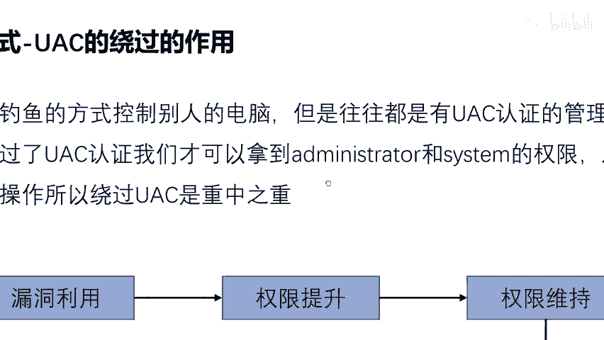

system跟 administratormin对不对？因为昨天我已经给大家讲了啊，如何绕就UAC绕过之后怎么拿到我 administratormin跟st。我说了任何电脑都可以拿。

不管你是win10win11windows server2018装没装杀软不重要，我们只要有令牌，对不对？只有过了UAC拿着令牌一键就提全上去了啊，那么。😊，你想要用用令牌窃取啊，绕得到这个权限。

那么前提是什么啊？只有绕过了UAC认证，我们才可以拿到这个对不对？那你绕不过这个UAC啊，你就白搭，对不对？你绕不过，那就基了，对不对啊，那么你绕过之后，我们就可以干嘛呢啊，进行哈希传递，进行内网渗透。

进行它内部的一些机密资料的一些复制粘贴啊，所以说UAC绕过是我们的重中之重。我们其实我想讲的是啥，我们季节训练营，我想讲的就是这个UAC提拳。那个令牌窃取其实没有什么太大的一个难度，对吧？

UAC提全才是我们今天的一个重点，对不对啊？那么关于这个啊整个黑客的攻击流程。如果说让大家想成为一个高手，一定还是要按李哥昨天给大家提供的一份秘籍啊，给你写出来这份路线去学，不要乱选。

不要说我去B站看看，那我去网上下个工具啊，我去怎么怎么怎么对吧？你要走弯路。那好了，那我也我话就说到这了啊，不要走弯路，好吧？因为我走过弯路，你走弯路浪费的是你的生命，对吧浪。

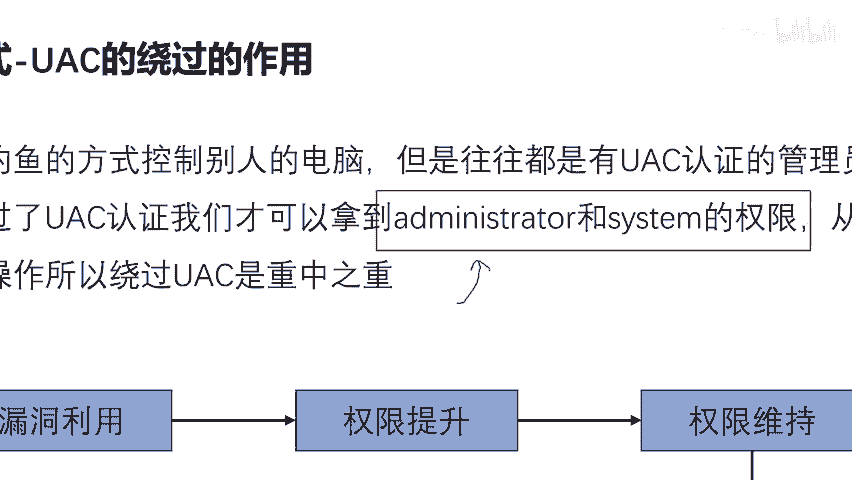

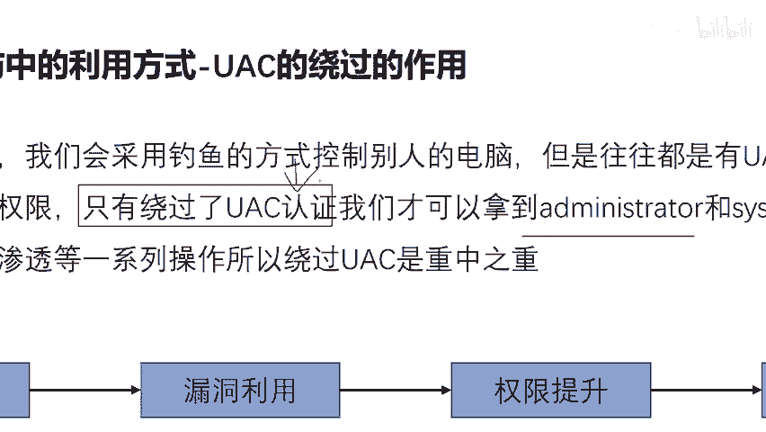

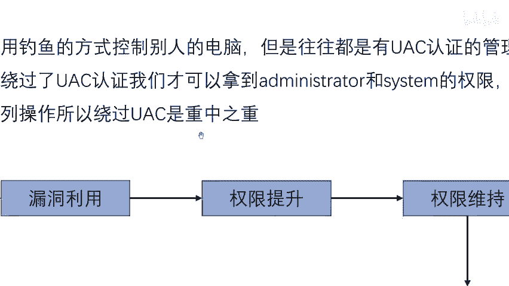

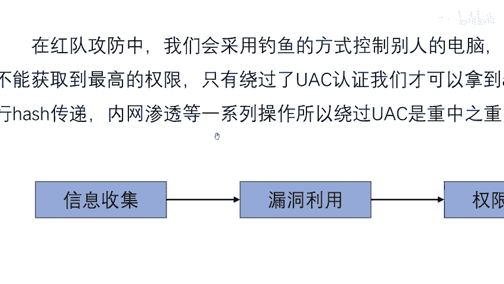

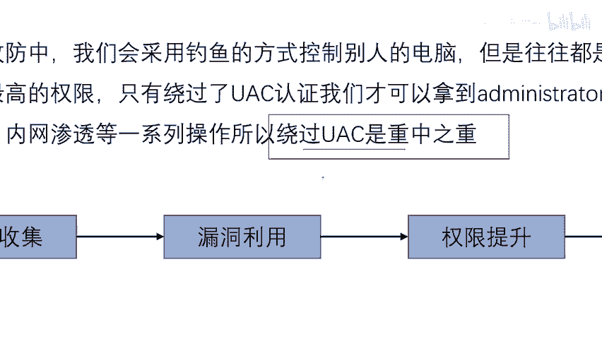

的是你的时间啊，你是你可能你不走弯路，你用6个月你就可以赚钱了，你就可以就业了，对不对？你走弯路，你用两年三年啊，你觉得王文全是个啥，搞不定搞不懂，对吧？好，那么这里我们说一下啊，要进行这个UAC提全。

对不对？哈，那么UAC绕过的方式有很多啊，方式很多啊，就类似于啥？就是比如说你要去这个你女朋友家里，对吧？你女朋友家去你女朋友家的方式可以比较多，你可以坐高铁，也可以坐地铁，也可以坐火车，也可以坐汽车。

也可以走路，对吧？那么啊选择哪种方式。😊。

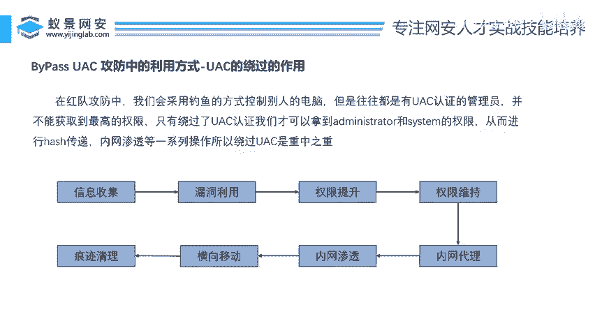

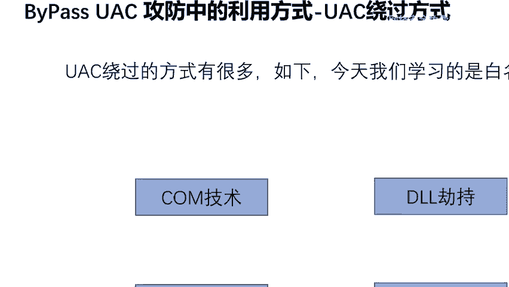

啊，是最合适的这个呢就看啊啊你习惯的一种方式吧？你比如说我喜欢走路，那你就走路，你习惯坐车，那你就坐车，对吧？人各有益，选择最适合这自己的一种方式就最好了啊。那么UAC绕过的方式有哪些呢？

那么李哥在这里总结了几点了，哎给大家总结了哎这么啊6个比如说com技术DL劫持白名单绕过自身的漏洞啊，远程注入计划任务啊，这里给大家讲几个啊，比如我们今天就要讲这个白名单绕过啊，那这个DL劫持的话啊。

我们今天不讲com技术我们也不讲啊，这个自身漏洞是啥啊，就比如说在微软在20这个之前2019年吧啊，2019年有个漏洞啊，就是通过这个浏览器证书可以绕过UAC啊，那是它微软自身的漏洞啊。

或者通过计划任务远程注入这些几个方式都可以啊绕过UAC拿到最高管理人员权限。好，但是我们今天只会讲这个白名单绕过啊，因为时间关系我要把这些讲完之后，你看一天两天3天4天5天6天。

我得6天才能把这些全讲完啊，因为我们训练营只有。😊。

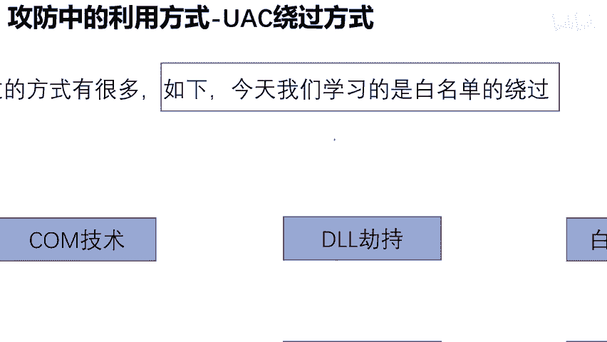

啊，今天最后一天了，所以我只能讲一种了啊。那么其他的你可以自行的去学习啊。好，因为我们今天讲的是什么？白名单绕过对不对？好，那么这里就有一个问题了，白名单是个啥？白名单如何绕过？什么叫做白名单？

OK那么兄弟们哎。

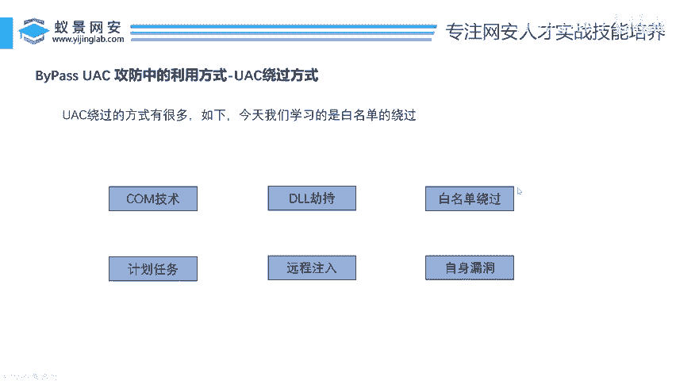