# 2024B站最值得看的黑客教程 ｜ 网络安全／渗透测试／内网渗透／漏洞挖掘／web安全／kali linux／红队靶场／CTF／信息安全 - P118：白名单AutoElevate属性绕过UAC - 网络安全免费学 - BV1uBsTetEow

我们来看一下白名单凹to属性绕过UACO。来来，我们来看一下白名单啊。首先呢兄弟们啊，那么昨天我们讲了哎这个UAC是个啥？哎，这个兄弟们可能昨天有人没有来听课，对不对？好？

那么今天哎我们就把这个什么哎把这个。😊，UAC啊再给大家看一遍，对吧？因为昨天好多人没有来啊，没有关系啊。O我把这个放一下啊。好，我们打开我们的什么这个训机啊，训机给兄弟们瞅瞅啊啊，那有人说了啊。

那这个白名单绕过呢，对不对啊？我会我怎么怎么的，对不对啊，这个我给大家讲讲，对吧？我们今天讲这个白名单程序啊，我们会总底层给你讲它的原理，对不对啊？底层讲这个原理啊。😊，来，我们把这个打开啊。好。

我们打开一个什么？打开这个。😊，哎，这个windows1个10啊。

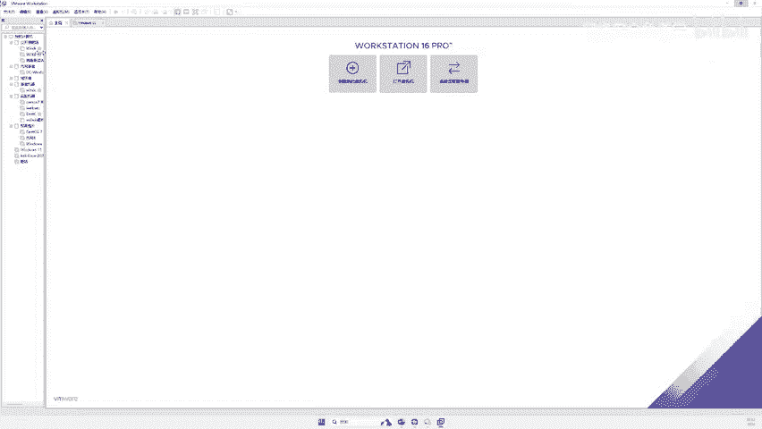

啊，今天讲的这个技术呢，我们在Wwin10跟win11上都是可以复现的啊，你就可以直接拿你的win11去试，对不对？大家可以也不用去安装虚拟机啊，你看看能不能绕过UC，而且呢不会爆读啊，不会爆读的啊。

因为我们做这些操作都是合法的操作，不是合法的，就是微软看来都是正规操作啊，所以它是没有读的啊。😊。

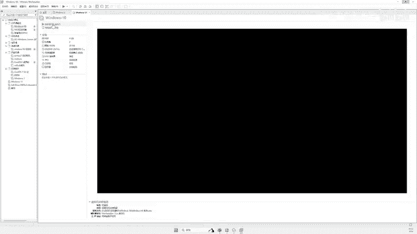

啊，我们不会说用一些病毒什么绕过，对吧？好，我们让这个讯机启动起来啊。😊，好，我们还是这样让他这个呃。重启一下，好吧。啊，重启喷雾剂。啊，不会是computer defense吧。啊，这个也可以啊。

当然我接下来讲的这几种程序你都可以啊，都可以啊，像这种日志什么的啊，当然可能有些人用过一些costruct，对吧？costruct里面就会有这种UACT的插件啊。

它就跟我今天我们讲的这个原理是一模一样的啊。好，我们先把这个讯机启动起来啊。😊，这个虚拟机的核显能带动吗？可以带动啊，我就是核显啊，虚拟机不需要显卡的。它比较吃我们的CPU，比较吃我们的内存啊。

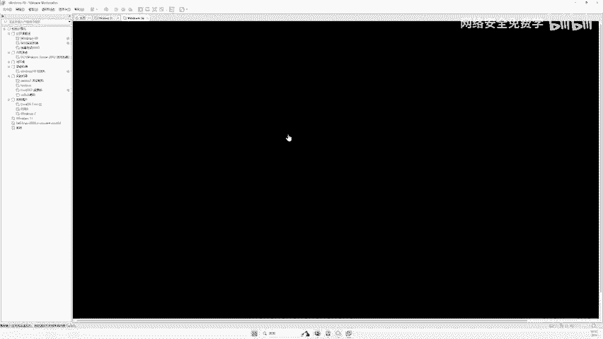

啊，白名单程序挺多啊，但是你要选择一个好用的就可以了啊。😊，好，我们来进入一个有UAC管理员的这个。啊，我们以这个win10给大家演示吧啊。😊，好，文师给大家演示啊。😊，🤧。有点咳嗽了啊。

昨天讲课讲的有点久了。🎼啊，那么你看当我们哎平时使用电脑可能会登录到电脑。昨天已经讲了UAC什么，对不对？你看就是我们在打开一个程序的时候，对不对？会有这样一个弹框。哎，这个弹框就是UAC啊。

你看就哎它就会点击是你的程序就允许运行了，点击否你的这个程序就不运行了，对吧？那么为什么有这个UAC啊，就是为了防止恶意软件病毒木马广告插件，对不对？因为我们的病毒木马是不是win7也有用嘛。

win7也有用啊，Wwin7上也是有UAC的啊，就如果说哎你看假如说呢你看像假如说这个东西当然现在不是病毒啊，那假如说这个东西它是病毒，我双击运行。😊。

哎，那么有UAC认证，那这个病毒就不能侵害我的电脑啊，就这样的话我的电脑就比较安全了。所以有这个UAC对吧？但是大家想想，同样这个UAC也会对我们的系统的本身程序造成影响。微软也不需要。

不希望系统运行的程序也需要询问用户，对不对？因为系统的程序是安全的，这个是什么意思呢？对吧？就是你看在我们的电脑里面来，你看我们打开这个一些这个程序，它是有UAC这个弹框的，需要我们点击是或者否，对吧？

但是兄弟们，你看我如果说打开这个。😊。

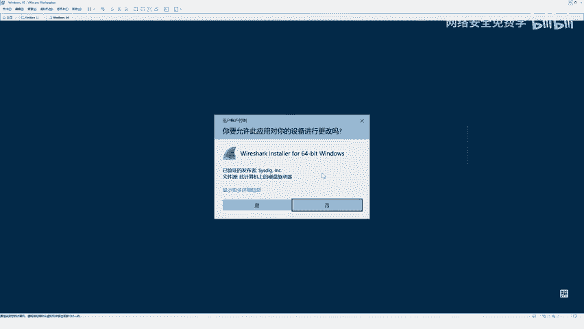

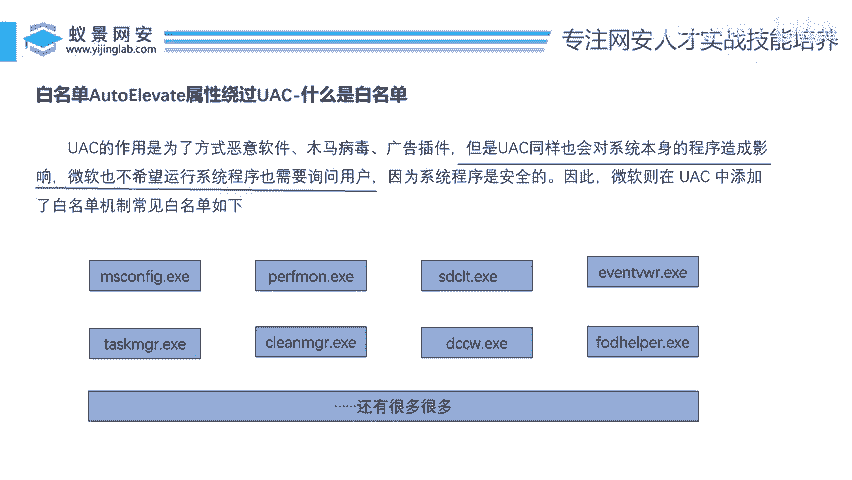

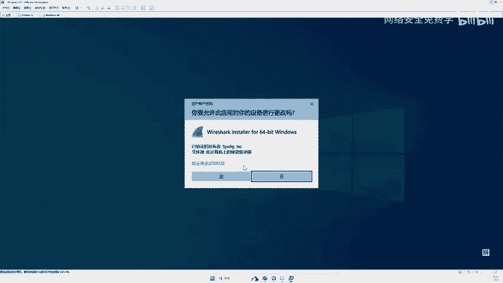

任务管理器，你看哎，但是任务管理器它都没有弹框呀，你发现没有？哎，发现没有？是不是哎任务管理器，那我打开这个什么，再打开一个工具。😡，我打开什么，你看我打开这个什么windows设置，哎。

这个也直接打开了呀，它也没有弹框呀，对不对？因为为什么会有弹框？因为windows认为你打开这个设置它是安全的，它是我内置的程序啊，对不对？所以我把它就加入白名单了啊，它不需要弹框，因为这是我的东西。

😡。

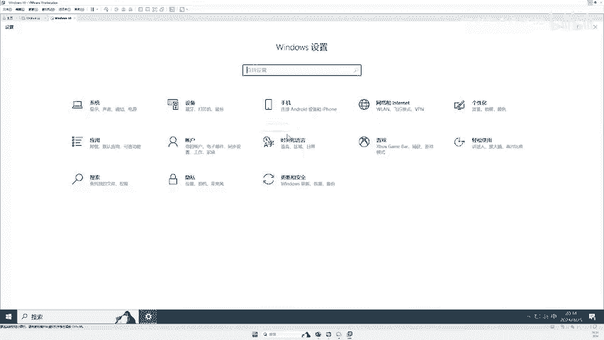

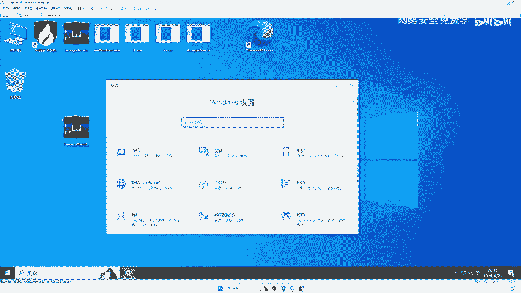

所以我认为它是安全的这个呢就叫白名单，对吧？因为我们在打开这个任务管理器的时候啊，那么windows底层也会去操作一些文件，操作一些啊这个啊计划计划任务这个什么叫这个注册表，对不对？

也会对我们的这个程序有一些复制粘贴的行为。那么微软不会不会谈这个UAC弹框，因为它是白名单，它认为它是安全的对吧？所以说哎就有了这个白名单程序，对吧？你看就是这句话来看，看虽然有UAC啊。

UAC只是为了防止这些恶意的。😊，病毒的啊，但是他不会防自己人，对吧？那么因为都如果我做了UAC啊，它可能就会对我们的系统产生影响。所以的话我就把这些程序加入到了白名单。好。

那么李哥下面提供的几种白名单啊，那接下来啊我们来看看这些白名单都是干嘛的啊。好。来，我用我的win11给大兄弟们演示一下啊，这个Wwin10win11上都可以啊。😊，好。来，我这来给大家演示一波哈。😊。

啊，放大些。啊，比如说你看这个MS同飞格，这个什么东西呢？哎，我们输一下MS。😊，啊，输一下哈MSCONFIG点EXE啊，回车。来，大家看那我的电脑就会打开一个这样系统配置的软件。哎。

你看我的电脑并没有进行弹框，对不对？好，那我再来一个啊，再来一个这个DCC好吧，DCCW点EXE回车。啊，大家看哎我的电脑就会打开一个什么叫做颜色校准的这样一个框，这样一个windows的选项，对不对？

哎，它是也没有弹框，对吧？为什么没有弹框？就是因为windows啊认为这些程序它都是安全的好，我们打开这个DCC好吧，来，我们在这个win10win10上也试试啊。

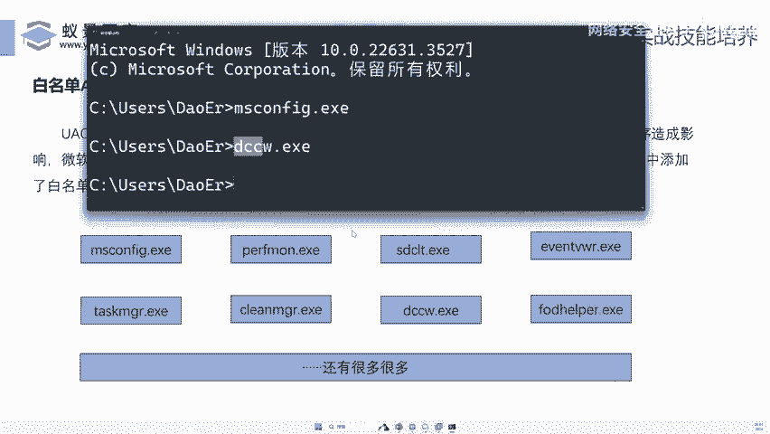

你看啊，那么当前我的用户啊是不是这个普通管理员，他是有UAC的，对不对？他不是最高管理员哎。😊。

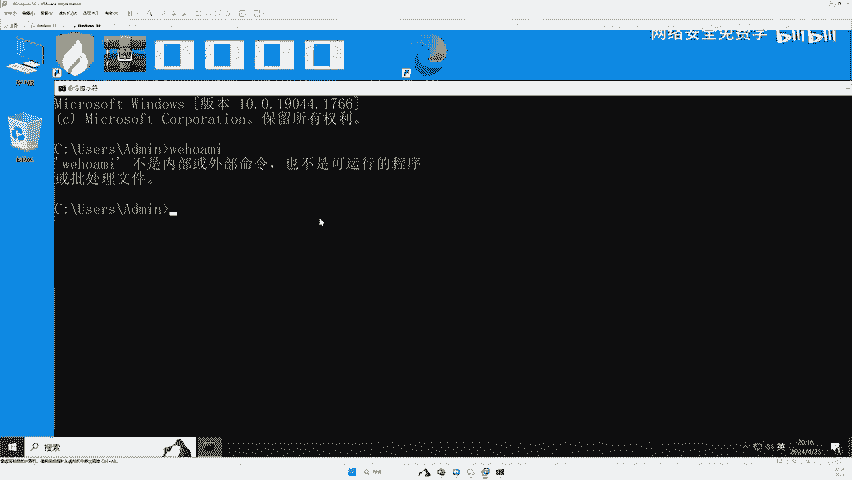

来，我们打开DCC。😊，回车你看到没？是不是这个程序呢直接就被打开了啊，它是一个颜色校准的这样一个程序。OK没有弹框，那它就是白名单。😊。

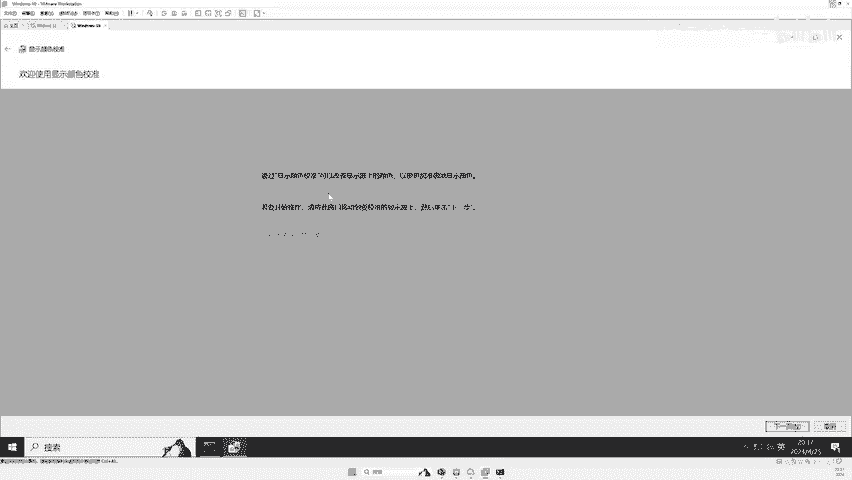

对不对啊，它就是白名单。OK那么兄弟啊，这里有就有一个问题了，对吧？哎，那这个是白名单。O那有人说白名单有多少呢？啊，非常多非常多啊，windows中有很多白名单。

它内置的白名单程序就是很多我们的设置啊，它都是白名单程序啊，那么这里就有一个问题了啊，白名单现在我们知道了啊，还有一个问题就是otto属性哎，是一个什么东这个东西是个什么东西？哎，我们给大家讲讲啊。

那我们刚刚讲了啊，那么win我们的电脑或者说我们的呃系统它怎么识别哎这个程序就是白名单，这个程序就不是白名单的啊，难道它是人工智能啊，难道它像我们一样专门去识别关键字，哎，不是的啊，它是这样识别的啊。

就是说在我们程序的机制中啊，在windows的白名之中啊，如果说这个otto这个属性为tro，它就认为它是一个白名单来，我们来往下看一下啊。😊。

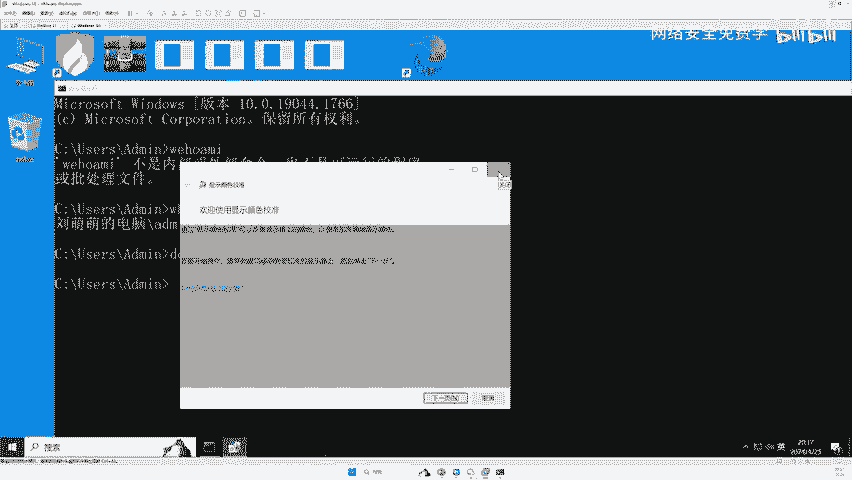

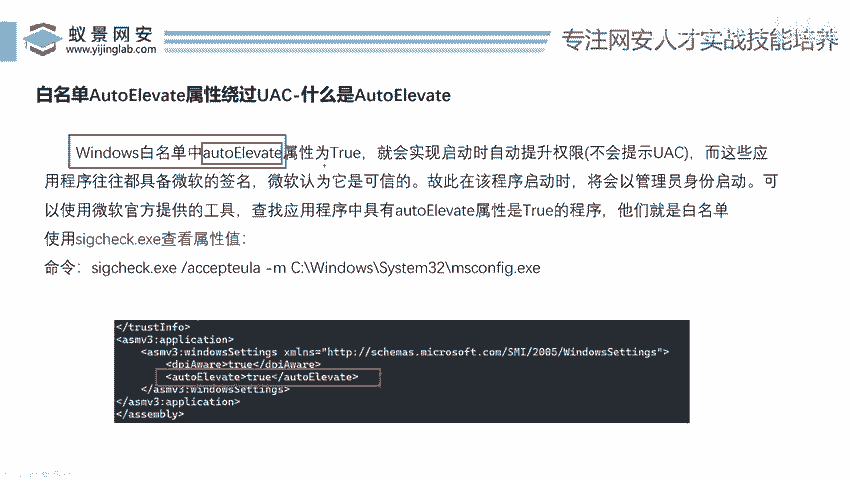

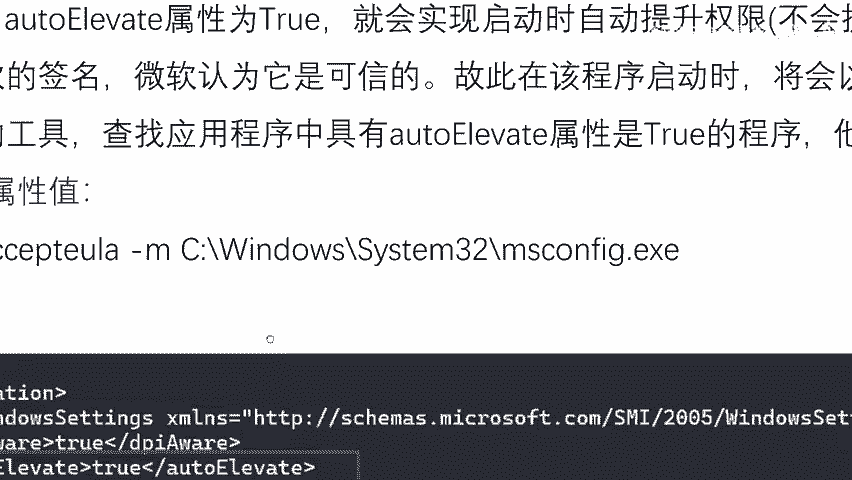

啊，就是说如果说啊你的程序对不对啊，这里面有这样一段话看这样一段话，这里的这个值它是trol正确。啊，为啥是tro？为啥就 windows微软把这里设置为tro啊，把这里设置为什么trol。

那么这个程序它就是白名单了。如果设为forse，那O这个东西它就不是白名单，它就有UAC了，明白吗？啊这就是windows设置的，它怎么识别？就是通过这串字符识别的啊，那么这个东西是怎么来的呢啊。

非常简单，对不对？你看我们再读一下这样windows白名单中啊，这个属性它为trol，就会实现自动权限提升啊。这个英文单词翻译成中文的名字就叫什么？就叫自动权限提升的意思啊。

就是说哎如果说这里的这个属性为trol，那么我们就不会有一个U提示，而这些程序往往都是微软签名的对？微软认为它是可信的，故此该程序启动时将会以管理员身份启启动，对不对啊？

所以说啊白名单程序我们说的这么多白名单程序啊，那么它的属性里面啊这一块啊它都是什么都是tro。

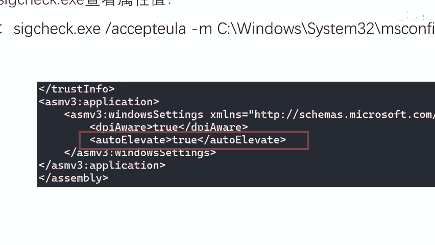

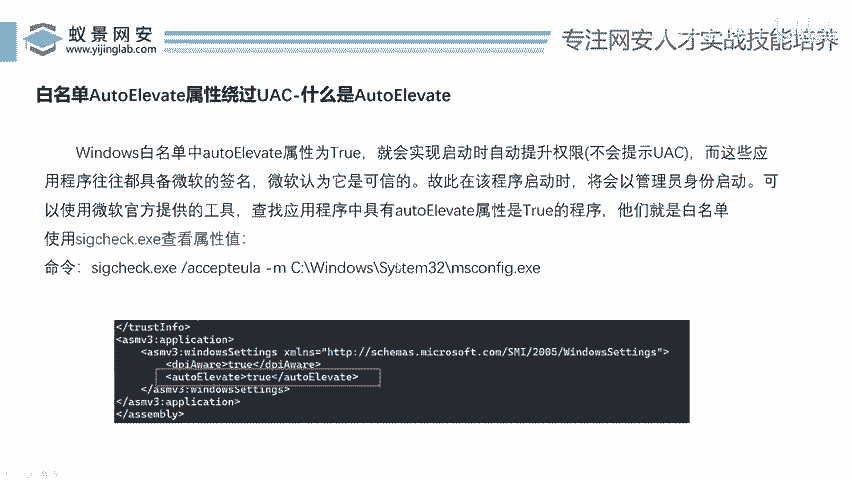

哎，都是错，那是谁谁谁设置的呢？当然是微软自己设置的啊，把这里设为一错，微软就会认为它是白名单。好，那么它是白名单之后呢，哎，那说李哥，我想看看这里这个值到底是什么样子。哎，我们可以干嘛呢？哎。

我们可以借助一个工具哎，就这个工具啊，这个工具呢啊也是这个官方提供的啊。😊。

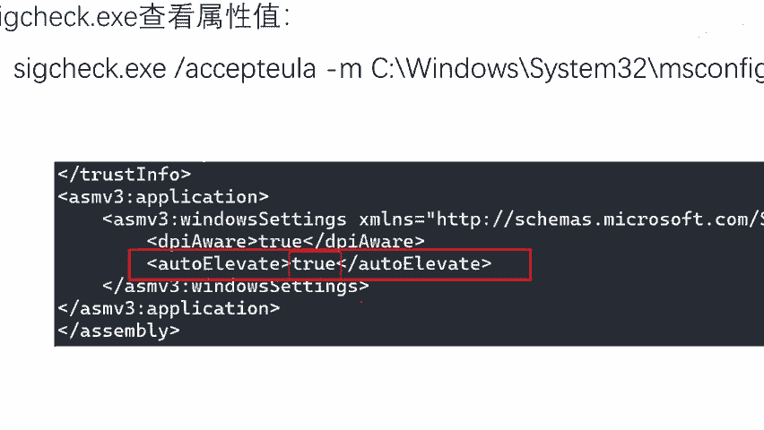

啊，就是微软官方。啊，官方提供这个工具，这个工具可以去检测这个程序里面一些属性。啊，我们用这个命令哎，就可以，比如说你看这个命令这个工具，对不对？后面加你的这个程序名字就可以检测出来里面的值了。好。

那么兄弟们，哎，那接下来哎我们去检测一波好不好？

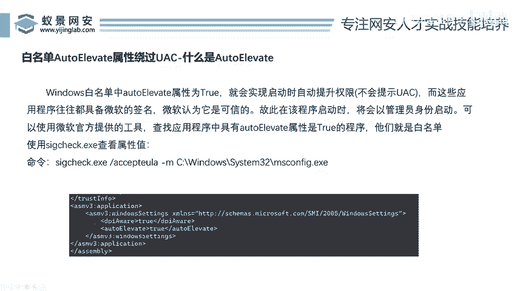

啊，我们回到我们的winwin10上检测啊，那这个工具啊，我们先CD到destop在哪里呢？啊，看看啊。😊，🤧好，那么李哥在这个工具已经给大家提供到了我们的这个训练营的这个。百度网盘中啊。

大家想要去拿的话啊，自己去拿提取就行了啊。我把这个程序先拖过来OK。好，那么这个程序对不对？好，那这个程序怎么去用？啊，我们去试试这个刚才说的这个啊DWCC啊，我们看看它它到底是不是错哈。

我们怎么去用啊，SIG。😊，SIG然后啊回车啊，你看第一次运行的时候，它会有这样一个小弹框，你点击agee，对不对啊？好，然后我们来看一下它具体的用法啊。😊。

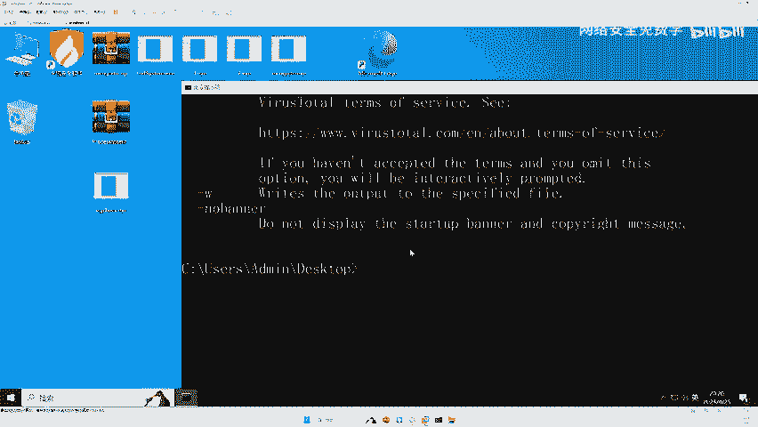

啊，然后这个意思就是说取消刚才那个弹框啊，第一次运行的话，你就加个这个啊，大家平时运行也加个这个啊。如果第二次运行你就不用加了啊，然后杠M杠M对不对？后面加你的这个什么啊程序的地址啊，就可以了。

非常简单啊，来，我们来试一下啊。😊，好，我把这个。

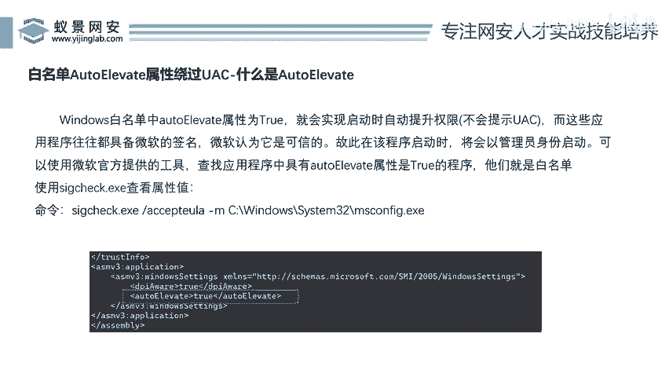

复制一下啊。来。😊，好，我们来走一波O我们用这个程序对吧？杠M去检测这个MS config这个MS confi刚才是不是这个诊诊断工具啊，来，它是白名单，对不对？啊？我们回撤一下啊，回撤完之之后。

你看这个工具它就会对吧？把这个MS confi这个程序里面的一些属性给你检测出来啊，比如说它的一些版本号，对吧？它是哪个文件在哪里。哎，你看包括它的属性值，哎，我们底下往下翻，哎。

大家看这个autoele，这里是不是串。😊，没有问题吧。哎，是不是在这里清晰的可以看出来啊，这里的这个值对不对？是不是错？来，那么我们现在打开这个MS confi啊。😊，来看看MS上那个OK。

你看我把这个MScomp直接打开，哎，是不是可以直接打开呀？windows并没有进行1个UAC弹框的认证。为什么啊？就因为这块这个属性伪错，所以说我们只要批量的去找找这个电脑中这样一串值的程序。

那它都是白名单。😊。

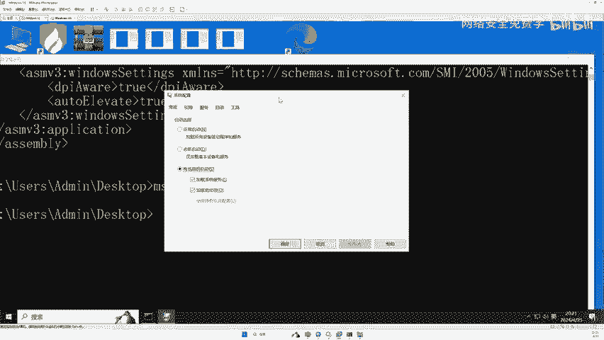

是不是这个道理？那么找到这些白名单，我们就可以利用这些白名单进行一些提全，进行一些渗透。哎，这个就是啊我们给大家讲的啊白名单提全。好，那么刚才有人刚这个直播间有人在这个公屏上说了啊，赶快上这个什么啊。

赶快上这个批量检查，对不对？好，不用着急啊，接下来啊就给大家上这个批量检查啊，那么我们知道这个原理之后呢，哎，我们就是干嘛了啊？如果说我能对这个系统里面啊，所有的程序啊都进行检查，那我是不是。😊。

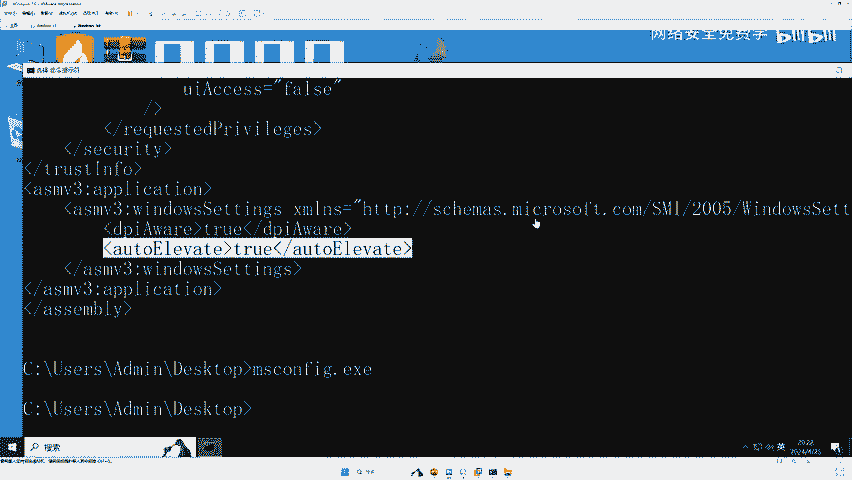

反过来就知道这个系统里面哪些程序是白名单了。那么李哥刚才说了，对不对？啊？这白名单程序还有很多很多很多很多很多啊，那我怎么想拿到所有，那你就批量去检测一波，好吧，所以说接下来哎我们又。😊。

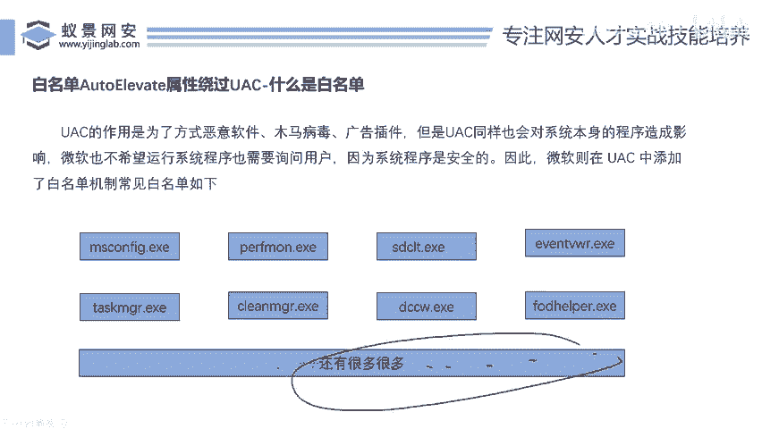