# 2024B站最值得看的黑客教程 ｜ 网络安全／渗透测试／内网渗透／漏洞挖掘／web安全／kali linux／红队靶场／CTF／信息安全 - P119：WIN10下的自动提升程序一键查找 - 网络安全免费学 - BV1uBsTetEow

在win10下自动提升啊啊这个一键查找。好，那么如果说想批量查找啊，那么也可以借助一个工具啊，也是我们微软提中的一个工具叫strs啊这个strs这个工具呢啊，它类似于我们linux中的fin啊。

它可以对这个批量批量对文件里面的内容进行搜索跟查询啊，那可以批量查找我们的属性，所以我们借助微软自带的这个str啊，就可以查询了。好，那它具体的查询的语句在这一块啊，接下来给大家解读一下什么意思啊。

首先运行这个程序啊，取消它取消掉它的弹框杠S就是加你要这个查询的目录地址啊，这里呢我们要加到它的这个地址C盘下的windows system32。

因为所有的windows的自带程序都在这个C盘下的windows system32啊，就windows所有的啊自身的程序，比如说我们的计划任务，比如说我们的日志，比如说我们刚给大家看到一些白名单程序。

它都在这个文件夹下啊，所以说你去这个文件文件夹下面检测。😊。

所有的啊以EXE为结尾的程序啊，然后干嘛呢？哎然后我们fd string find string干嘛呢？就是查找匹配匹配杠I杠I就是不分大小写，对不对啊？匹配这个auto这个这个字段匹配到。

我们把它输出到1点TXT当然你也可以不输出，让他直接输出也可以啊，你像李哥这样，你看李哥在这一块用我的win101给大家示范了一下。你看strs对不对啊？

杠S检查我这个C盘的这个目录里面的所有的EXE程序啊，检查到之后呢。😊。

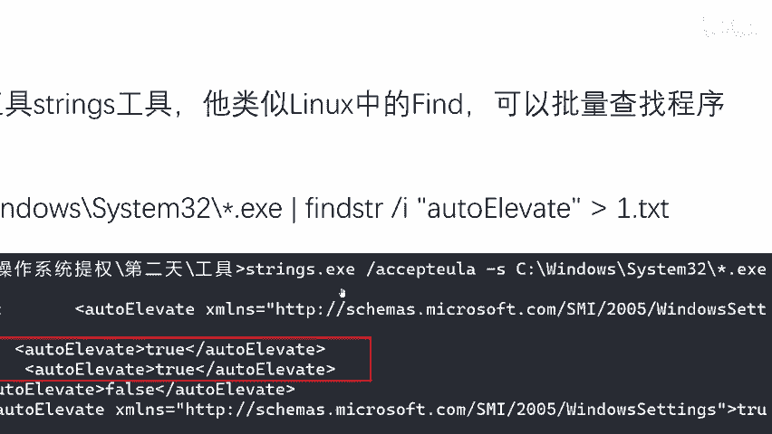

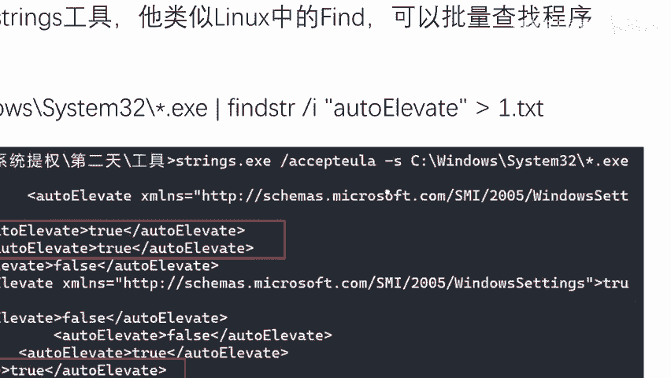

啊，然后进行一些什么进行这个匹配这个字符段。那你看底下就我会就会得到一个结果啊得到这个程序，哎，它的这个这个alto属性是为处啊，那它就是一个白名单啊，得到第二个程序。😊，🤧Yeah。这块为错，对不对？

那它也就是一个白名单啊，那么有哎得到一个第三个程序，哎，兄弟们往这里看，这里是不是foalse，哎，不好意思，它就不是一个白名单啊，它就有UAC啊。那么往下翻，你看这个DCC刚才我们运行过。

你看这一块它也是不是错。哎，我们同样也就拿到了一个什么白名单。好，那么再往这里看，哎，那这里还有一个对不对？😊，这里是fosO那不好意思，它就不是一个白名单啊，那接下来我们干嘛呢？哎。

我们手动的啊去检测一波哈。同样呢啊这个工具啊，我们还是打开我们的win11啊，在win11上给兄弟们演示一波。好，那么这个工具啊还同理啊，里哥已经给它放到网盘里面了啊，我们拿过来直接用就可以了。😊。

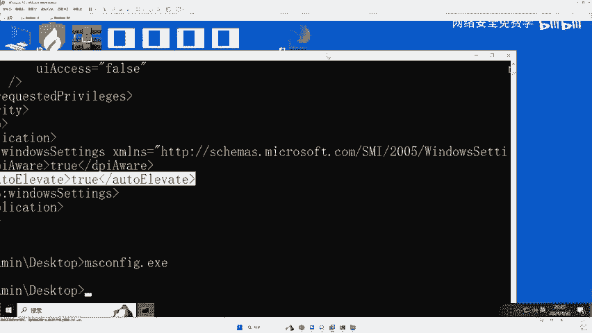

好，我们把这个命令呢啊给兄弟们复制过来啊，直接啊照搬照抄啊，大也不用去记这些东西就可以了。好，我们来在这个win101上试win10上试一下啊。😊，好，进入到我们的这个桌面啊，我们把它CCD退出一点啊。

不然的话这个字太大了，字太全了啊，大家看不清楚啊。好，OK来复制过来啊，我们现在不让它输出到一点TT叉T啊。好，看现在是不是啊检查我C盘下的所有E叉E啊，然后匹配这个属性。OK我回车来，兄弟们啊。

现在我们稍作等待这个查找有一些慢，对吧？我们稍作等待啊，他过上个啊一分钟啊，或者说十几秒钟啊，就会查出来啊，我们不要着急啊，不要着急来看他有没有查出来一些东西呢。😊，哎，把它放大一些好，来。

还没有回车是吧？好。啊啊，不好意思啊，这个要进到这个我我跑错目录了，它在桌面里啊，我们必须要进到桌面里面去啊。😊，啊，最终还是要到这里来啊。好，我们再来一遍。😊，好，没车好，那么现在就开始查找了，对吧？

去查找我们C盘下的这些程序。好，查到这查找到的这些程序，我们都一个一个去试试啊，看到底跟我们哎刚才讲的到底一不一样啊，一样不一样啊。好，那他这个查找起来比较慢啊。

那么同样我们可以也可以在我们的win11win11上啊也去查找查找，对吧？我们在这个win10上啊，李哥也把这个strs，我找一下有没有这个工具。😊。

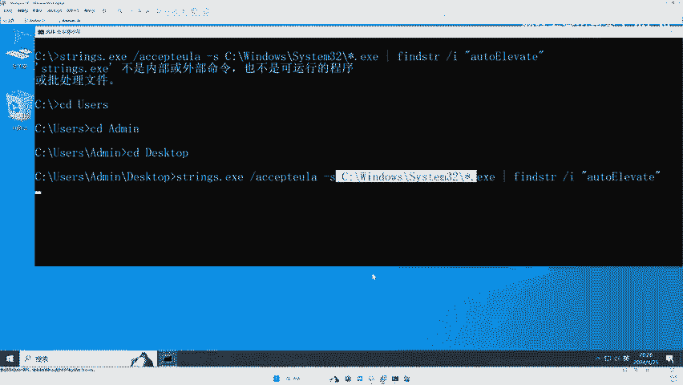

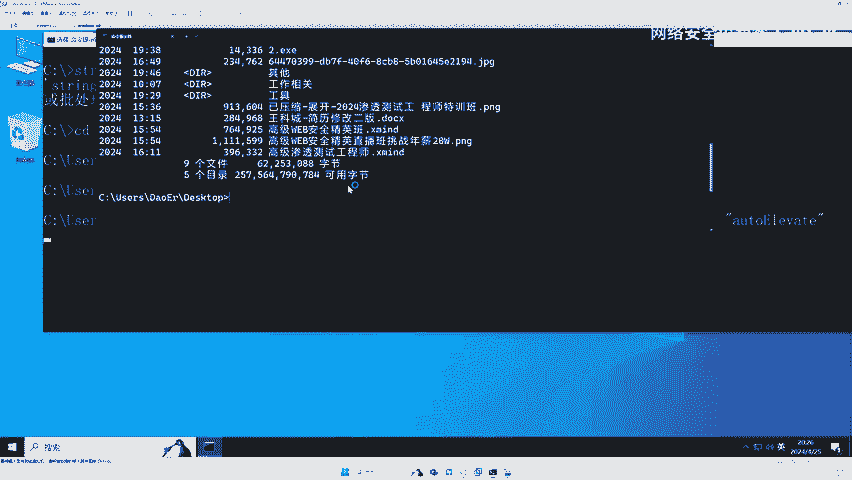

啊，没有这个工具啊，没有关系啊，我把这个我给我的这个win11啊也放一个出来。好，来，我把我这个东西啊，在我的win11上也去运行一下啊，现在是不是在我的win10上运行啊，我我就我给大家做个对比嘛。

为了做对比OO回车好，那这个呢现在在我的win11上运行啊，不管是win10还是win11啊，同样都适用于啊都适用。现在它就开始一个一个去匹配了啊，只不过它查找的速度比较慢，它要一个一个去找，然后匹配。

然后给你打印出来啊，所以我们需要耐心一下好，你看像这个win10上现在是不是已经出结果了好，我们出来第一个程序，这个程序啊，它这里是不是有一个这个auto属性是不是。那么它就是一个白名单程序好。

所以说我们运行这个程序的时候，它就不许没有这个UAC弹框。哎，所以我们来试一下，看到底跟我们的猜想一样吗？哎，好，然后我们去打开一个CM的M程序啊，那这个程序到底是什么东西，我也不知道啊。

因为大家也我们运行这个东西回车。😊。

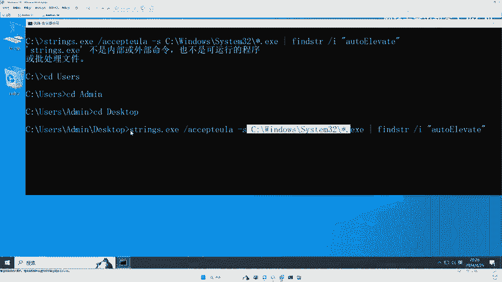

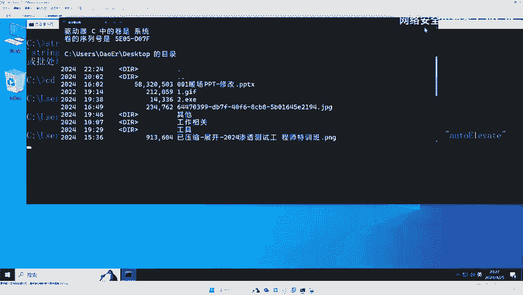

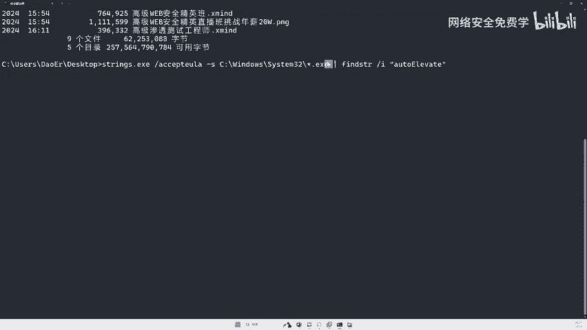

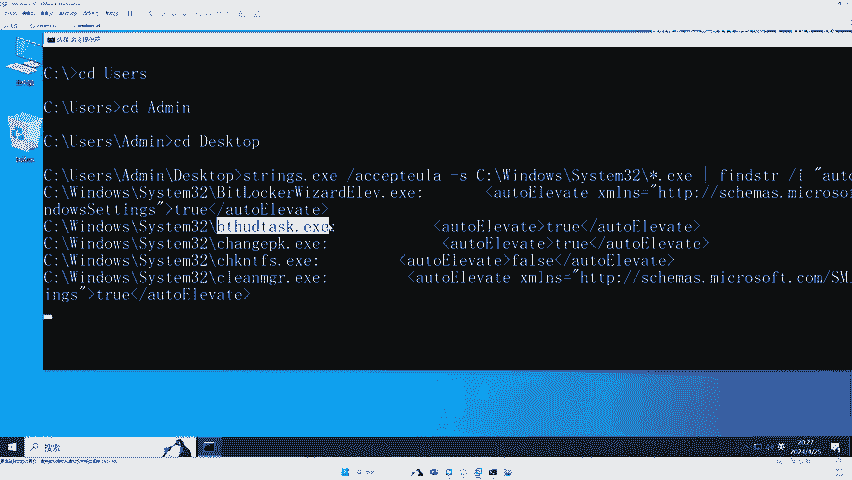

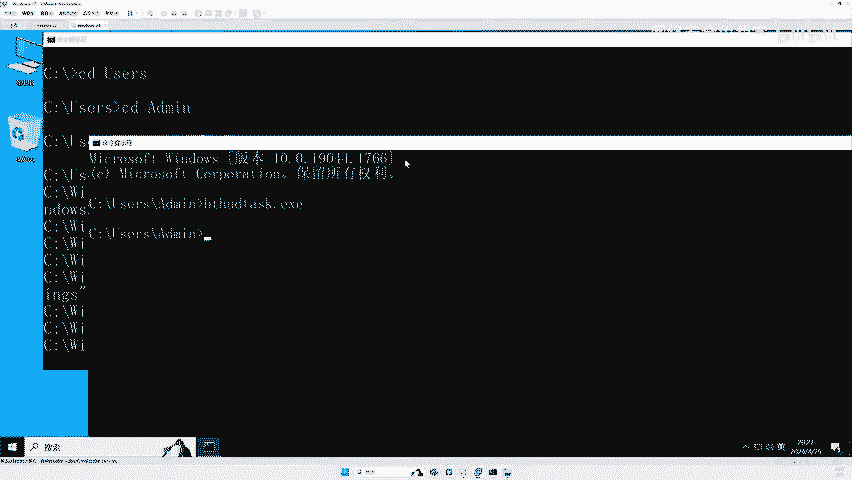

啊啊，运行了一下，没有结果啊，没有结果，他可能那就没有关系了。哎，我们往下翻啊，它可能这个程序它就是不展示啊。好，或者说这个程序需要在一些特殊条件下运行啊，我们来看第二个啊。😊，来看第二个尾车。🎼哎。

打开了哎，它需要UAC看到没？它需要UAC是个windows的其他东西啊。但是你看这一块啊，这一块它的这个东西是多少？😊。

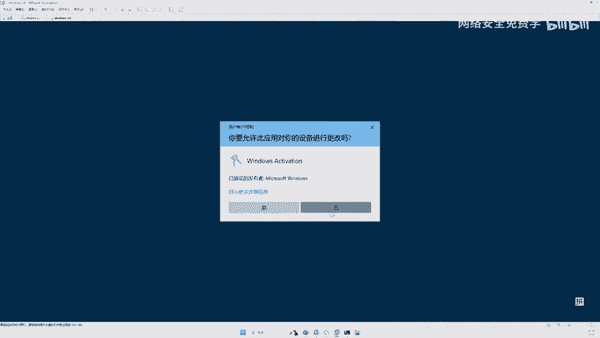

啊，也是错，但是需要对不对啊，但是需要啊，所以说你看这块它这个就不太对了啊啊，可能跟我们的语语法有问题啊。来我们试一试这个这个呢你看来看一下这个啊。这个这一块它是false啊。

那应该来说它也是需要UAC弹框的回车。啊，你看这个时必须指定一个驱动名啊，那这个程序的运行方式也不对啊。来，我们再找这个这个这个我不知道是什么东西啊，这里是foalse，对不对？好，再来一遍啊。😊。

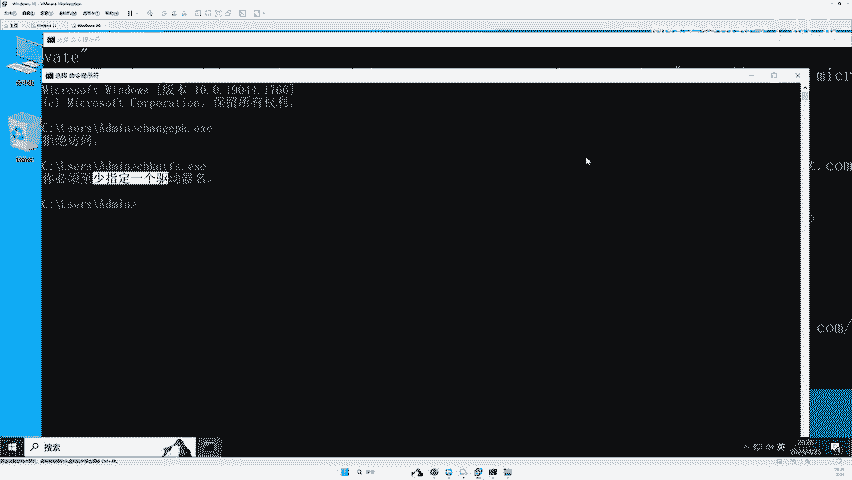

🎼好，再来一遍这个fos的回车。哎，你看它是有UACC弹框了，对不对啊？它这里是foalse，你看它有有弹框，对不对啊，所以跟我们的这个猜想它是一样的。好，我们看几个有串的啊，比如这个。😊。

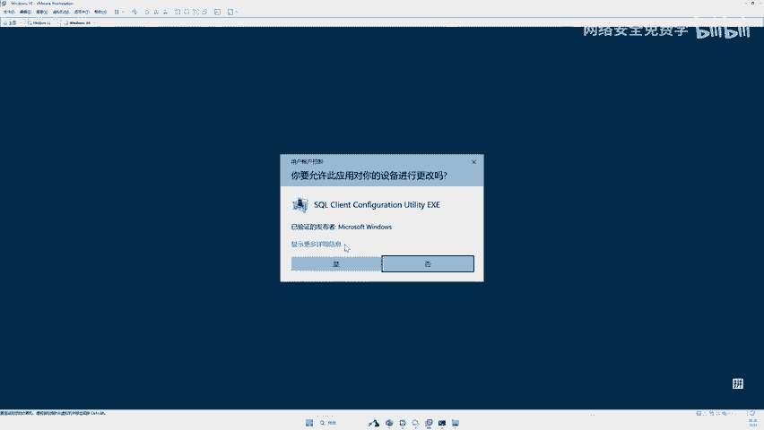

啊，这个它这块是戳代不带好，我们来运行一下。😊，🎼哎，确实啊这个是个什么东西啊，不知道啊，专用字符编程序大家都没有见过，我也没有见过第一次见对吧？啊，它也是一个白名单程序啊。好。

那么看这个这个是个什么东西呢？啊，我们来试一下。

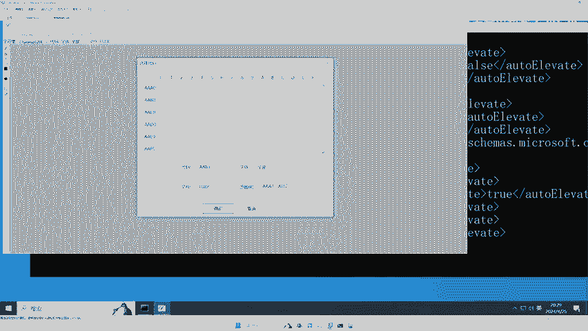

打开哎，它确实也没有弹框，对不对？它是windows的日志查看器啊，它也没有UAC弹框。好，那我们看下一个这个呢这个我也不清楚啊，它也是tro，对不对？好，我们来再来试一下。哎，他也没有它。

是一个发送蓝牙发送文件的这样一个程序。OK它也没有弹光好，我们看下一个这个这个也不这个什么东西啊，不知道啊，不知道我们直接运行。😊，哎，同样也没有弹框，对不对？哎。

是不是跟我们刚才的这个猜想是不是它是一毛一样的啊？那么在win10win10上啊，win101上，兄弟们哎，我们也能查找出来这么多白名单程序，对不对？好，那里面这些程序我们都可以利用它。

比如这个利可以利用这个去进行提全，可以利用这个去进行提全，可以利用这个去进行提全啊，那具体到底怎么提全啊，接下来就是我们要讲的东西了啊，怎么利用这个白名单提全啊，对不对？

我们总不能把这个程序给它篡改了啊，对不对啊，OK接下来。😊。

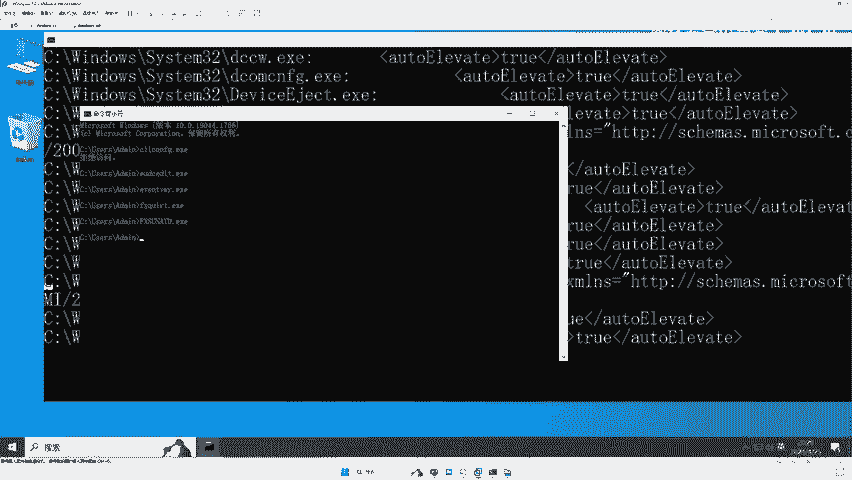

