# 2024B站最值得看的黑客教程 ｜ 网络安全／渗透测试／内网渗透／漏洞挖掘／web安全／kali linux／红队靶场／CTF／信息安全 - P11：从命令执行漏洞到getshell - 网络安全免费学 - BV1uBsTetEow

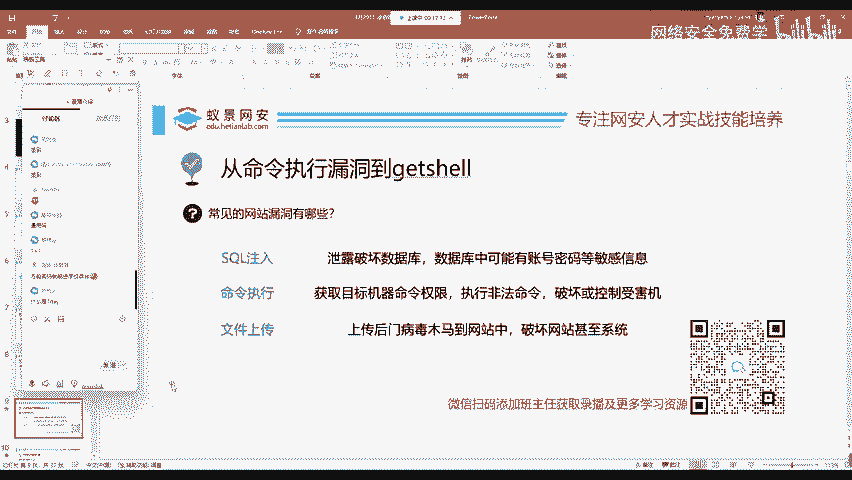

普通外部漏洞中，在渗透测试，我们最喜欢的三个漏洞，它叫做搜cle注入命令执行和文件上传。那其他的漏洞呢，比如说像CSRF叉SS这些漏洞可能在渗透测试中。

或者是在红对互网中看起来没有搜Q注入命令执行文件上传危害性更大。我们现在就来简单的了解一下搜购注入是什么意思。

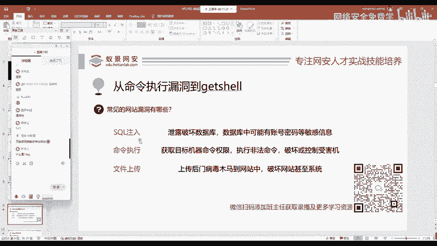

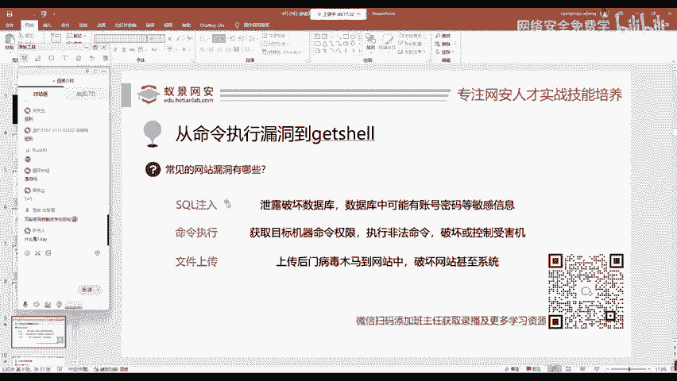

那搜cle注入这三个漏洞其实都是老师昨天所讲的，都是我们让服务器执行了本来他不想执行的内容。像搜Q注入，就是我们现在把这样一个啊把这样一个原本的搜Q语句给它破坏了，给他执行了非法的操作。

导致我们的数据库被泄露，导致这个网站的账号密码被泄露，或者是这些常见的个人隐私遭泄露，这是搜co注入漏洞。

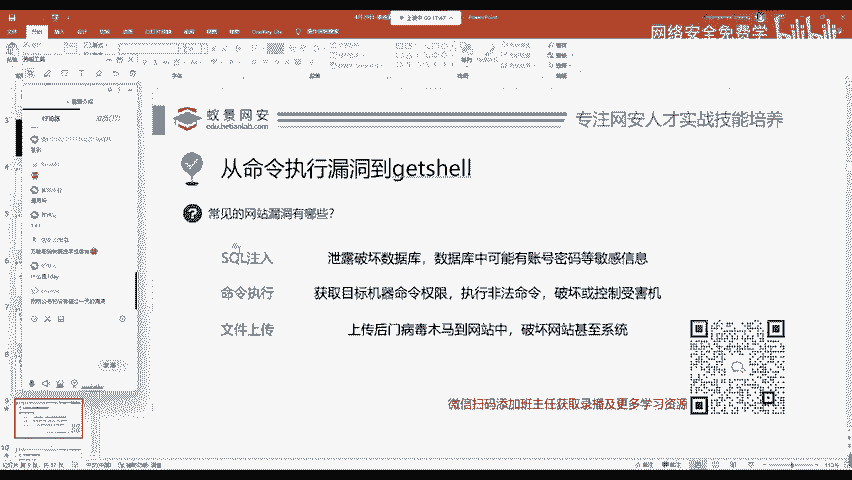

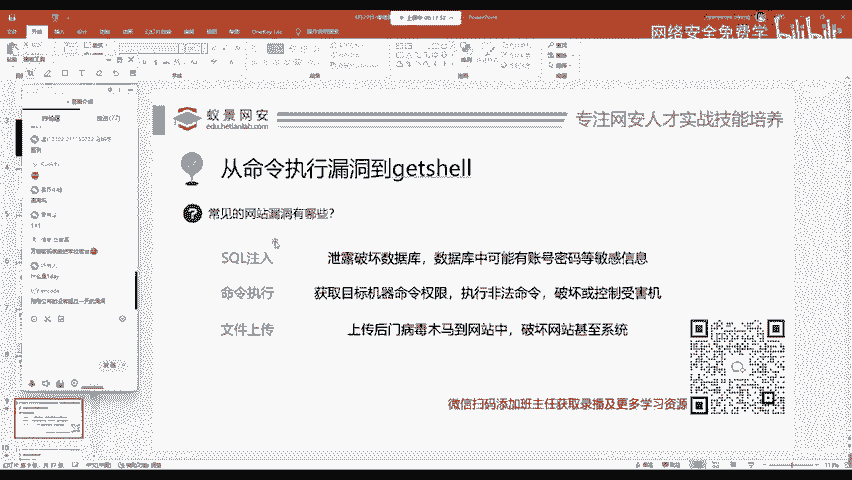

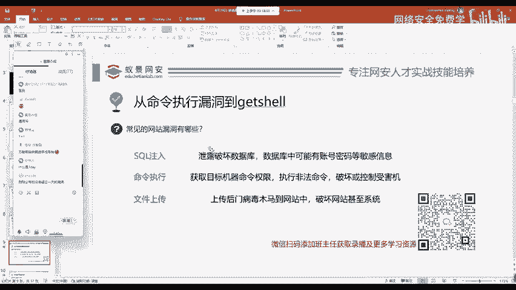

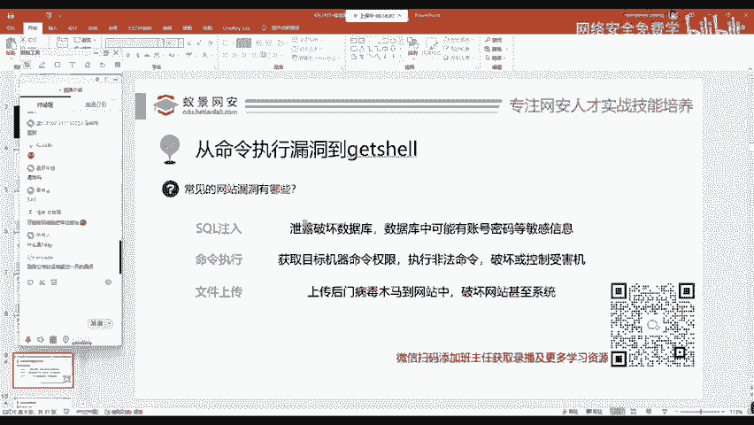

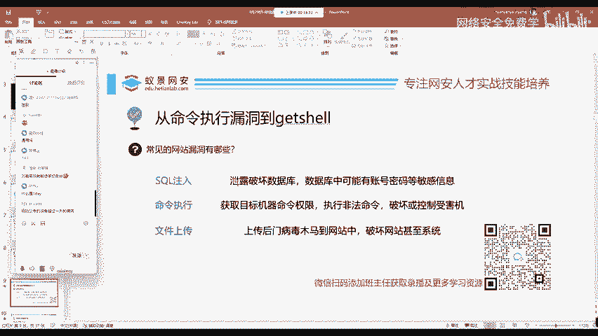

命令执行呢就如同昨天老师所演示的这个东西。

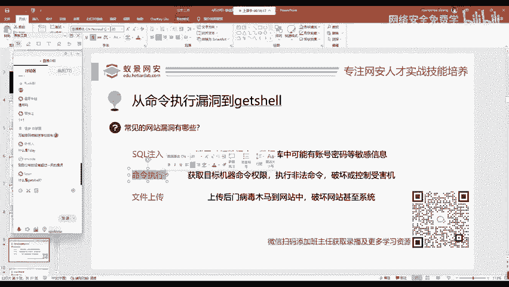

这个命令执行就是用于获取目标机器的命令执行权限去执行一些非法命令。如果我们权限允许的话，甚至能够为他去。删库跑路，直接把它的数据库给它删掉，或者是网站给它删掉。

get shell呢就是命令执行的一种get，就是获取shall，就是大家机器的命令执行权限。比如说我们linux的冰袋式，包括我们windows的CMD，它都是属于hell啊，都是属于shall。

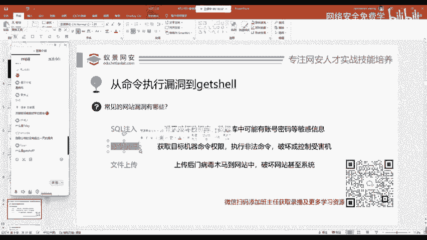

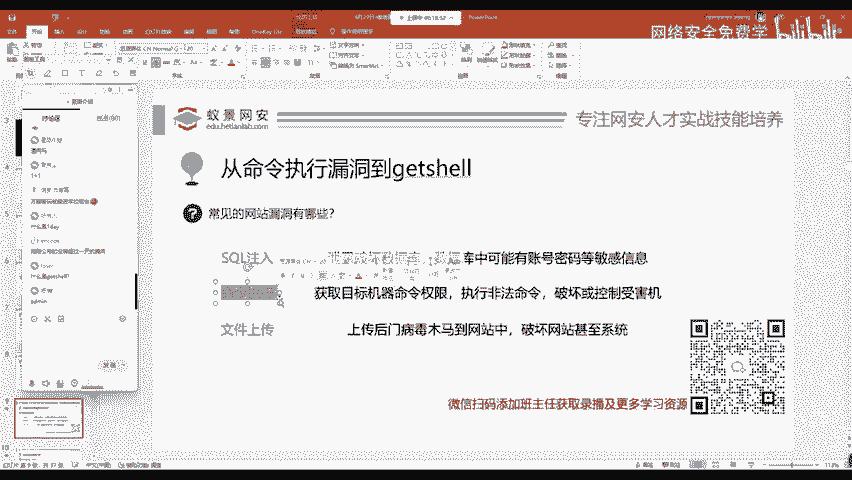

文件上传文件上传是一个网站的正常功能。我们在几乎所有的应用程序和网站中都能见到。比如说我们QQ上传头像，这个时候你想一下，上传头像默认情况下，这个网站呢是想让你上传一个PNG或JPG的图片文件。

那如果你作为一个安全工作人员，作为一个黑客，有没有想过给他上传一个比如说像病毒木马上传到网站后门中。那如果呢这个网站的开发者没有对我们上传的文件，作为一个严格的限制，就是有没有判断它是否是图片。

就允许上传的话，我们就可以植入病毒木马的目标的服务器中。那最后能产生什么效果。那大家可想而知了啊，我们下面呢就来了解一下啊。对的，这个同学说的对啊。

这个同学对get share就是获取目标服务器的一个命令行执行权限啊，叫做get share。

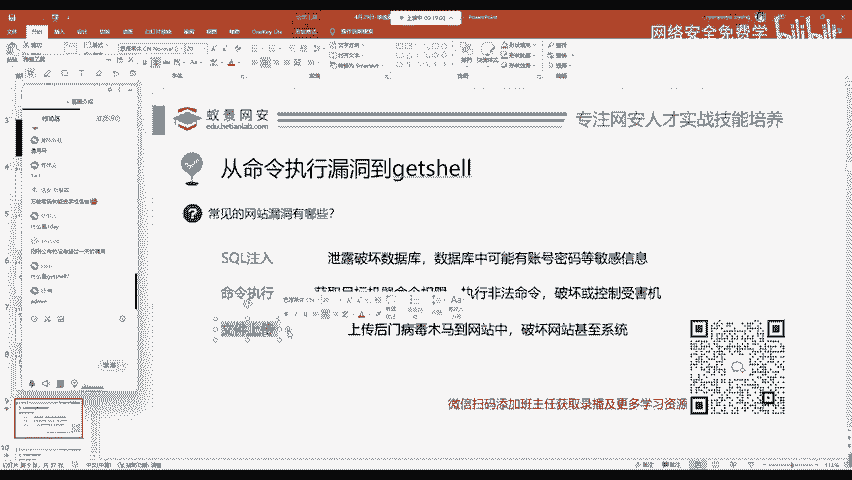

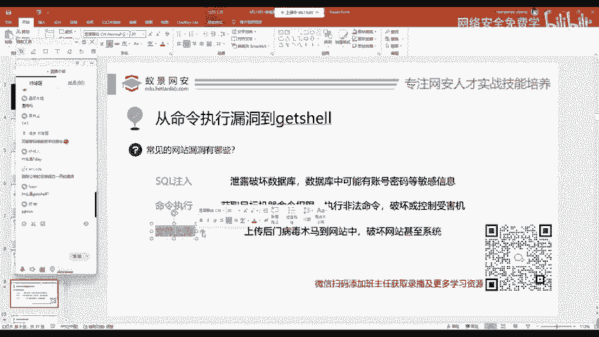

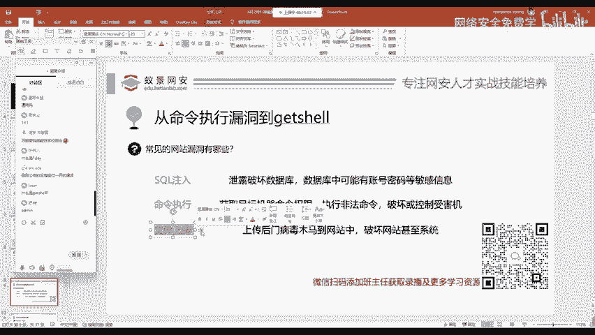

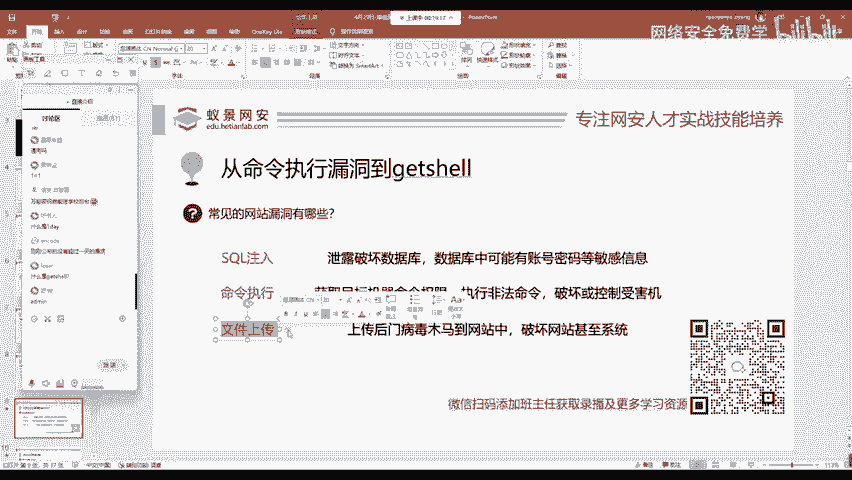

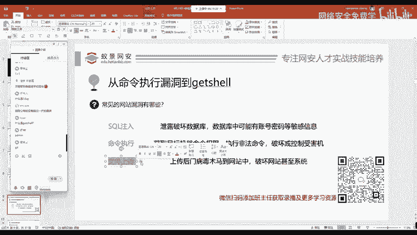

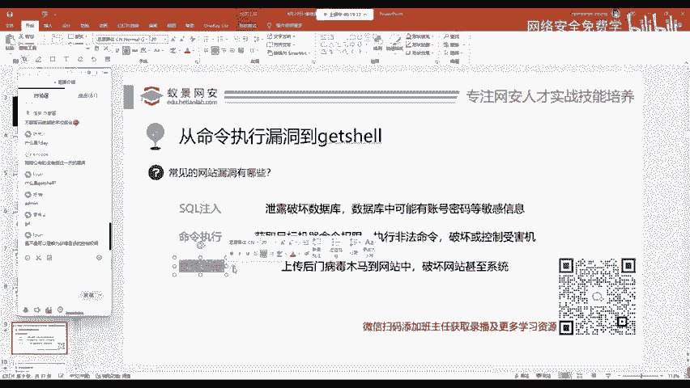

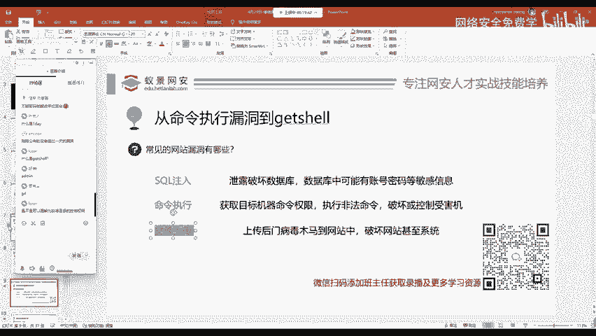

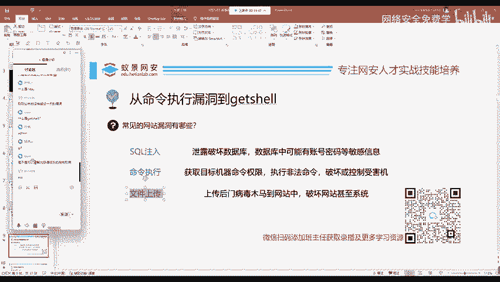