# 2024B站最值得看的黑客教程 ｜ 网络安全／渗透测试／内网渗透／漏洞挖掘／web安全／kali linux／红队靶场／CTF／信息安全 - P120：Process Monitor实时监控底层注册表 - 网络安全免费学 - BV1uBsTetEow

就要讲到这个monnet这个实时的底层监控东西了啊。好，我们先讲这个白名单，这个monnet底层监控之前啊，我们先看一个东西，就是白名单，对不对啊。刚才这个U错弹窗是不是因为CMD是普通管理源问题？

不是的啊，那里的话应该是它匹配错误了啊，或者说有一些其他的问题啊，我这个具体的原因我没有看，好吧。好，那么我们来看这个白名单提全的这个原理，好吧。好，等人说了啊，那我刚才利用这个白名单到底怎么提全呢。

对不对？好，我们来看一下啊，我们在运行白名单程序的时候啊，程序除了正常被启动啊，就说哎我们运行这些白名单程序啊，刚才给大家看了这些，比如说这个啊任务管理器，哎，虽然你用眼睛看。

它只是打开了一个任务管理器，但是啊但是有的有的这个白名单还会加载操作系统底层的东西，比如什么呢？哎，比如加载一些动单链接库，比如说有这种文件复制粘贴的行为，比如说有注册表的行为，对不对？

那么一旦该程序啊，比如说我们启动一个白名单，一旦这个白名单程序调用注册表啊，拥有执行命令的行为，比如说这个白名单程序是这个啊计划任务或者说是它的日志，我们一启动哎它的底层就会去执行注册表里面的命令啊。

那么一旦执行这个命令，那么。😊，该白名单就可以进行UAC提选。什么意思呢？啊？就是说这个白名单啊，它在启动的时候啊，它会干嘛呢？它会底层会执行这个命令。啊，什么叫命令？就是操作系统的命令？

那么我们只需要把这个命令进行篡改。比如说这个白名单在启动的时候啊，它执行了一个什么复制的命令。好，那我们把这个复制的命令给它改成注册一个用户的命令。那你再启动这个白名单啊，那启动白名单的时候。

因为这个白名单就是以最高管理员运行的，对不对？好，所以说你就以最高管理员运行的这个添加用户的命令O那么你就提全成功了啊，就是这个简单，就是利用这个白名单程序，它底层会干嘛执行命令的这样一个东西。好。

这里呢我们来看是在哪里呢啊，我们可以在这里清楚看到，你看在这一块啊，有这个什么ca的mod的是什么意思？就是命令的意思？你看像这个程序，白名单程序它在启动的时候，对不对？它就会加载啊。

这个注册表中的这个的这个值啊，看里面有没有命令。如果有，那我就把它加载一下。那假如说这个命令就是个关机命令，做木马的命令是一个什么提全的命令是一个什么添加用户的命令哦，不好意思。

那你的电脑直接就被我提全到最。😊，权限了啊，就借住这一点啊，因为白名单程序啊。😊，它底层会加载东西啊，虽然我们用眼睛看它是打开一个东西，但是底层它会加载。好，那么我们怎么去查看这个底层呢。等说哎李哥。

我怎么去查看这个电脑的底层，它都加载什么东西呢？O接下来我们要借助这个proxymon这个工具啊，这款工具啊，就可以监视我们微软的底层啊。比如说这个比如说我们运行一个程序啊，运行一个程序的时候。

我们可以用这个工具啊，对这个系统中的任何文件跟注册表行为进行监盘监控，啊，看这个程序在运行过程中有没有更改注册表，有没有什么删这些文件，有没有复制一些文件，对不对？有没有说啊粘贴一些文件，对吧？

通过观察这个呃通过这个工具就可以观察出来啊，然后这个工具开发的时候是为了干嘛啊，就是为了啊发现软件跟木马的啊，这个工具一般我们来说就是排查木马，你想看这个木马具体在你的电脑底层有什么行为。

你也可以去这个工具，借助这个工具，就可以看到这个工具，又是改了你一个什么东西，又是给你加了一个什么东西，又给你的软软件里面哪个程序。😊，这里面注入一个什么东西都可以用这个工具去做，对吧？

因为我们做渗透测试，或者做这种应急响应的时候，就会用到这个工具啊。好，那接下来呢我们就来正式的去看看这个工具到底如何去检测啊，到底如何去检测我们的程序OK好，来我们来看一下啊。好，那这个模特式工具啊。

非常简单，也是微软自带的一个工具啊。现在给大家演示的这几个工具，对不对啊？它都是官方提供的啊，官方提供的啊。😊。

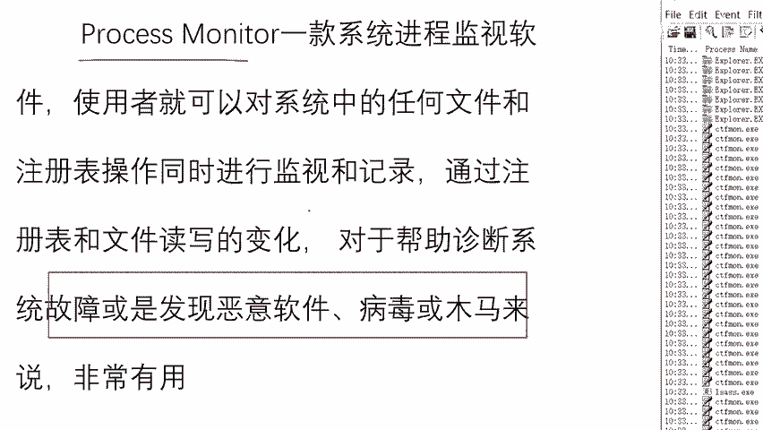

哎，我们双击回车啊，去运行这个。哎，这个工具运行起来了哈。😊，🤧嗯。好，运行起来之后，兄弟们哎，它就是这样长这样，对吧？好，我把这先reet一下。OK它就长这样啊，你看这里就会有一些链接。好。

那么接下来我们干嘛呢？啊，我们把这个工具打开，打开的时候去干嘛去运行我们的白名单程序啊，那白名单有比较多啊，因为有人刚才在这个群里说了，哎，那我们可以去运行这个程序啊，这个东西是个什么东西呢？来。

我们来试一下啊，就是个computer啊，来我们来试一下这个程序。😊。

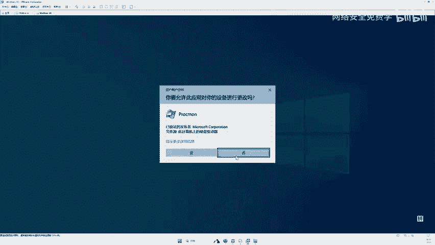

当然刚才给大家演示了那么多白名单程序都可以啊，都是可以去测试的啊。来，我们怎么来来做呢？哎，我们现在是个管理员，是个普通管理员，对吧？他有有A有AC的，然后我运行这个白名单，OK他是不是会哎。😊，啊。

不好意思啊，兄弟，这个我已经被我提全成功了啊，我需要干嘛呢？我需要将这个系统重启一下啊。

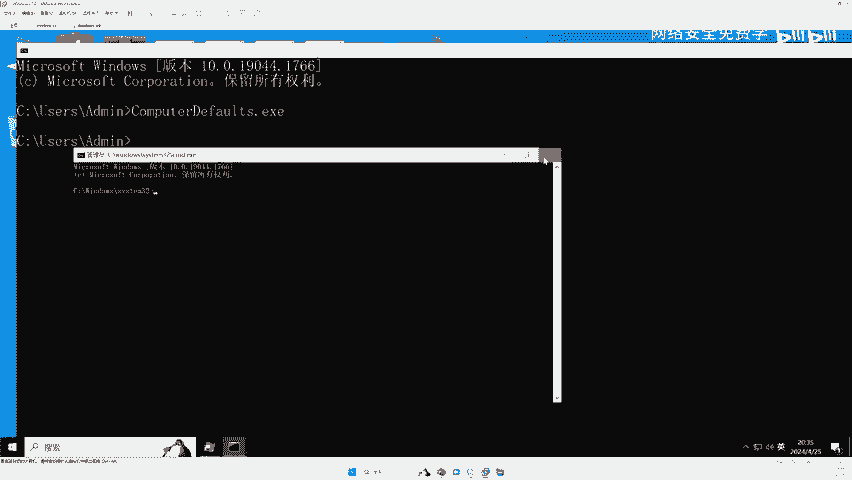

好，我们把这个电脑重启一下啊，你说李哥为什么要重启？因为我之前中午的时候，我我我这个复线了，我已经把这个程序给篡改了啊。所以现在你看到的结果是篡改后的样子啊，不方便给大家做演示啊啊。

所以呢现在我们把这个系统还原一下啊，还原之后呢，重新给大家做一个做一个演示啊，那么你就懂了啊。😊。

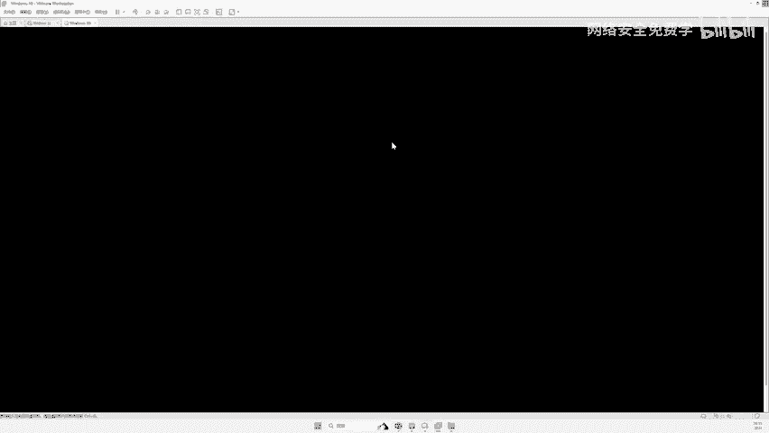

好，我们稍等等待等这个系统降的出来OK。😊，好，我们把这个字体给兄弟们放大一些啊，可能这个字有点少啊。先当现在现到这个win10，它又是个全新win10了啊，我们把这个字给兄弟们放到这个150%啊。

150应该够大了啊，应该哎这么大应该够了啊。好，就放这么大吧啊。好，然后我们把我们的这个底层监控的这个程序啊，给大家拿出来啊，给你们看看啊。😊。

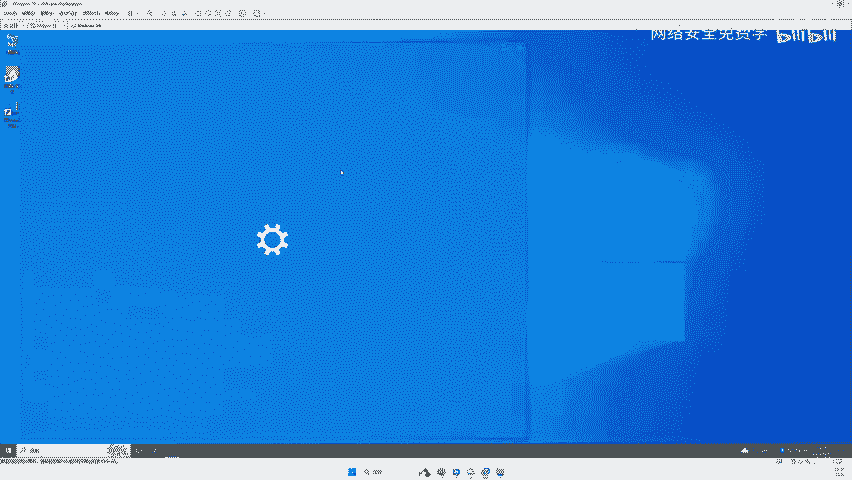

Pa pro monitor up。好。O。来，那这个这个程序大家都可以在你的win101上啊，像我今天讲的，你可以自己去复现啊。ok我们把它拖过来。😊，哎，拖到这里面来啊，拖到这个桌面来。

让它去运行一下啊。😊。

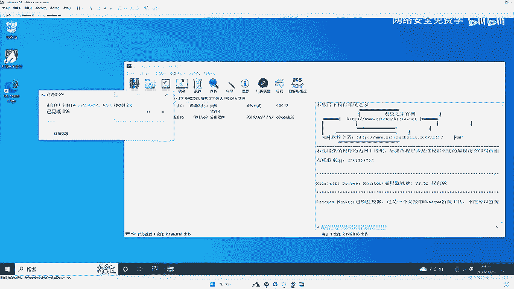

OK好，拖过来之后呢，哎现在我们再来一遍啊，双击呢打开这个啊底层的这个监控啊，打开监控之后呢，我们去运行那个啊刚才给大家展示的这个啊这个程序，对不对啊？因为这个程序呢它是一个白名单程序啊。

我们给大家展示一波。😊，O。😊，啊，那这个程序现在在运行中啊，一会儿给大家截图啊，我们来先来试一下啊。😊，好，CMD。好啊，那么这个当前这个权限还是一个什么呃 administrator啊。好。

我们更改这个账号啊，我们把这个权限呢切换到哪里啊？切换到一个有UAC的一个管理啊，切换到addmin啊，切换到admin才具有说服力嘛，对吧？因为你用admin，它就是最高管理员了啊。

他没有用了。啊，所以我们必须切到tra去试试啊。😊，啊，在这个普通管理员，他才有UAC对不对？你如果说 administratorminist他就没有UAC了，它已经是最高权限了。

那你做这些操作就没有任何意义啊，就跟我们昨天讲的一样，对吧？你已经拿到最高权限了，就不用再去过UAC了。我们只有说一些低权限才需要去过UAC啊，才需要过UAC。😊，好，把这个。

这个系统啊在我们再让他重新登录一下啊。🤧嗯。好，我们稍作等待啊。好，现在是不是登进来了啊？登进来之后呢，你看这个里面还有一些其他的软件啊，那李哥呢先把它给你删掉，好吧啊，先给你删掉吧这啊。😊，好。

那么我们让这个机器啊在最后呢重启一波啊，好，重启客户机。OK重启完成之后呢，它里面的所有东西都会还原啊，因为这个信息已经被我还原了啊。OK重启啊，重启之后，我们重新去登录，把它的内存。

把它这些啊东西都给它清空一下啊，让它去还原到我们的最初始状态。那么这样的话我们去做这个实验才有意义，对不对？那有人说了，李哥，你为什么那我渗透的时候，是不是要先要在自己的电脑上做一遍，没错啊。

就是这样的，我们只有在自己的电脑先复现成功。那么以后你就可以借助远控工具啊，直接一键提全了啊，后面也给大家去演示一下，我们用我们的cortract啊，一键就可以提全啊。

不借助任何工具就可以提全到最高管理员啊？😊。

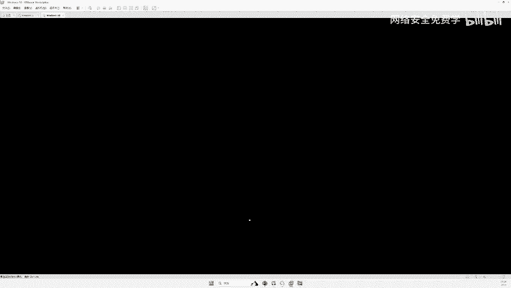

只要你能拿到这个普通管理员啊，基本就是畅通无阻了。所以说对于一个黑客来说啊，只要能拿到管理员，不管是普通管理员还是最高管理员啊，我都能给他提全。除非说你拿到一个普通用户，那不能提全，那权限太低了啊。

普通用户要提全的话，就需要借助这个系统漏洞了啊，否则是很难提全的。好，我们先把这个程序啊复制进来。好，等这个系统的这个加载一下啊。OK现在这个系统已经搞定了，对吧？😊。

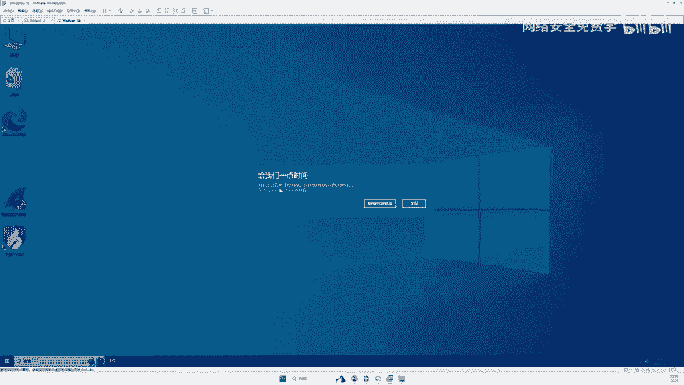

哎，怎么还。哎，这怎么不让我复制啊？哎，奇怪了啊，可能是他还没加载过来啊。这个现在我因为我给大家开直播啊，这个反应有点慢，对吧？啊？多希望他反应快一点啊。😊，好，我们把这个等他这个系统加载完之后啊。

我们把我们的底层监控这个程序啊拖过来啊，现在已经拖过来了。OK好，我们现在现在再去运行就没有问题了啊。那么现在啊万事俱备啊，直接把这个程序啊打开。😊。

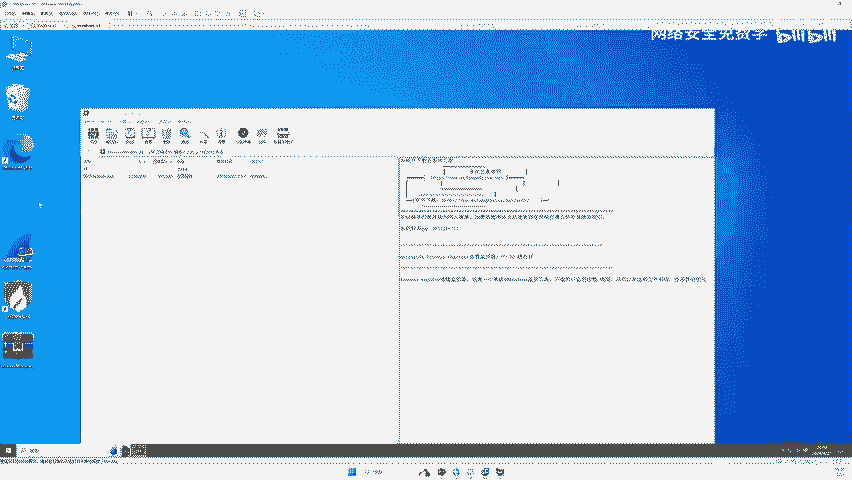

好，把它解压到这个当前文件夹。okK然后运行我们的这个呃monit啊，我们的监控程序啊。🎼其实这个程序运行起来非常简单，我们只要进行一波过滤啊，过滤完成之后呢，哎就可以对它进行这个仔细的去查找了啊。好。

运行好，那么运行的同时呢，哎我们也一样，对吧？打开我们的这个CMD啊，去运行我们的白名单的程序。那么刚才这个白名单程序啊，是不是这个啊这个我们再回到这里啊，我们现在还是一样的啊，去运行这个程序。😊，好。

把它运行一下。OK现在是万事俱备了。来，兄弟们来看一下当前你看啊，我们来检检测一波啊，你看当前我的权限是不是ad mead me是个有UAC认证的管理员。

那么假如说呢我要去添加一个用户来试一下UA me啊，添加一个李4。😊，啊，你看啊，这里我把这个先允许一下。来，你看拒绝访问对不对啊？因为有UAC，所以说你这个管理员没有什么用啊，添加不了用户。好。

那么接下来我们去运行白名单程序啊。好，回车啊，但是呢你看运行白名单程序之后，哎，这个程序是什么东西呢啊？它是一个windows的设置的白设置。你看我们打开这个windows设置了，它并没有进行弹框。

对不对？好，那接下来呢我们打开这个进程监控这个程序啊，去怎么去做啊，这里呢给大家解释一下啊。好了，我们说一下怎么去点啊。好，我们要点击这个东西啊，点击这一块这个。😊。

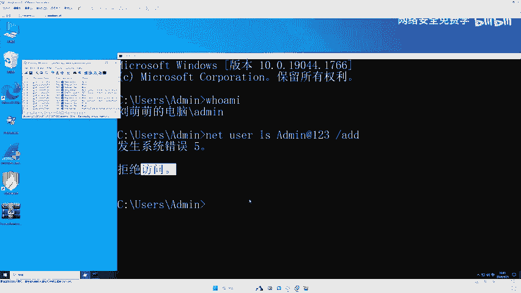

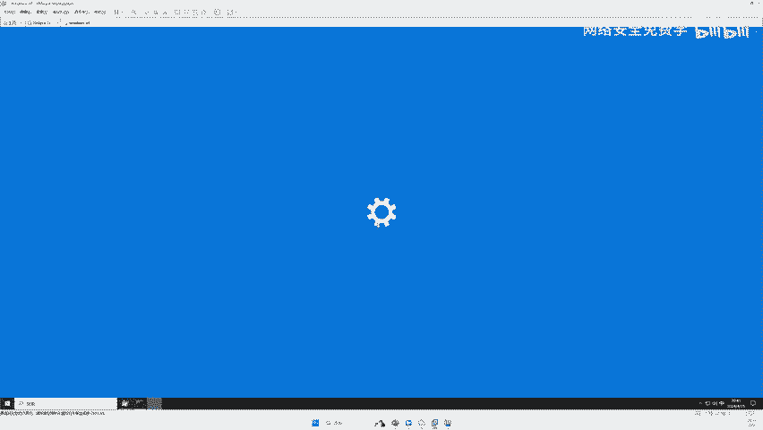

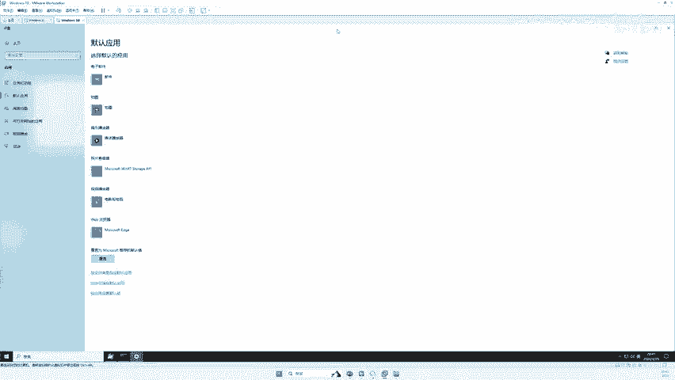

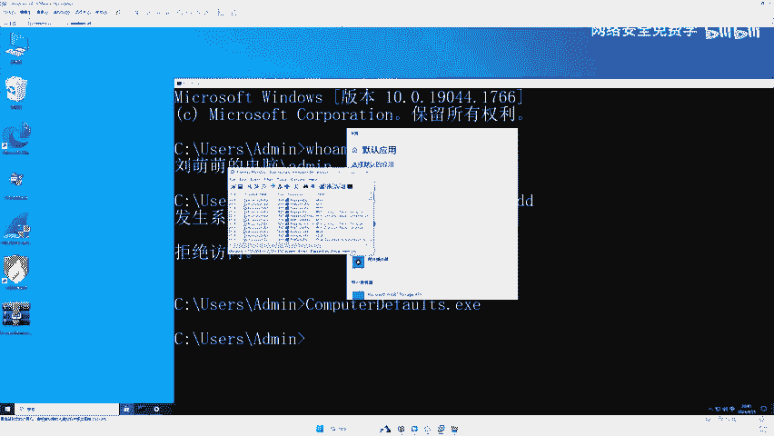

这个小头标啊啊来给兄弟们。啊，截图一下啊，来看到没？这鼠标这块有一个倒三角，看到了吗？啊，倒三角的东西啊，这个倒三角叫做过滤器的东西啊，我们去点击这这个过滤器啊，点击下过滤器。好，点击完过滤器之后啊。

我们再来看一下啊啊，这里是不是让你选下啊，我们把这里呢这一块啊，就是空白的地方选成刚才那个白名单的名字啊，怎么选啊，那里哥给大家选一下啊，这里选择proy name啊，选到我们这个白名单的名字。

OK那现在已经选完了好，我们再给大家截图给大家看一下啊，就这样你看程序明示这个什么啊，windows的设置。然后点击这个okK啊，它就会进行一波过滤。哎，我们点击试啊。😊。

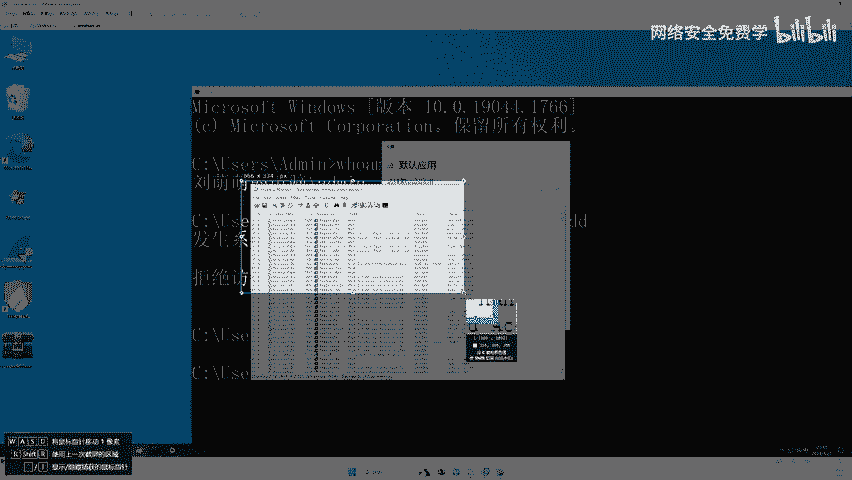

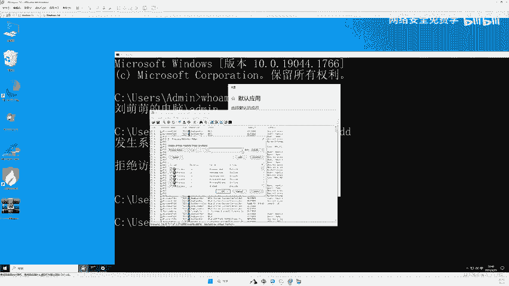

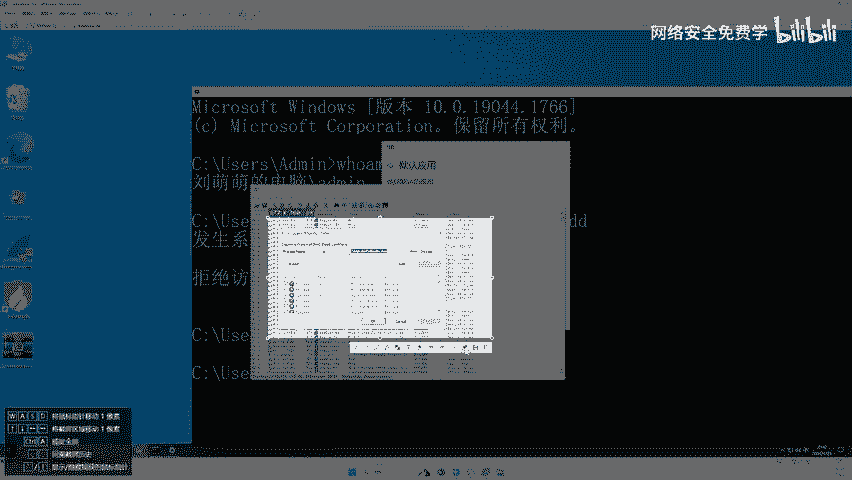

啊，点击这个是。O你点完试之后来，兄弟们往这里一看啊，这个字有点小啊，没有关系，我给你放大，你就看懂了啊。好，点完试之后，兄弟们我们就可以具体的去看到看到什么每一个。😊。

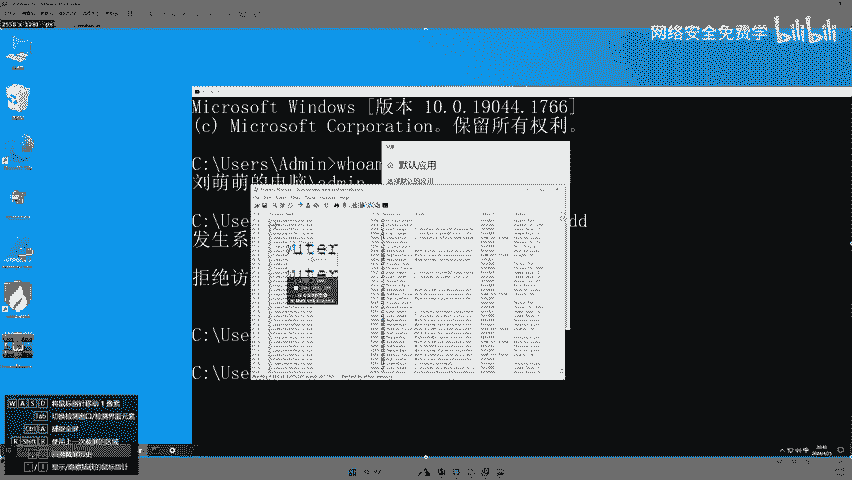

看到没有？每一个这样的啊这它的一个行为，对不对？你看这个当这个系统任务运行的时候，第一个proxy star是不是创建进程啊，创建这个程序程序启动，对不对？然后PID第二步是干嘛？创建线程，对不对？

第三步加载程序加载什么程序加载C盘下是，这个程序，第三步加载这个什么DL文件，第四步创建一个文件，对吧？像这个C盘这个文件创建文件，第四步又创建一个线程，是不是我们可以清楚的看到这个程序运行的每一步啊。

它都在操作系统里面做了什么？你看包括后面的这些东西对吧？啊，什么。😊，哎呀，这烦的很啊，包括后面这些东西来，我们来看一下啊，你看什么这个呃open key对吧？就是打开我们注册表啊。

这里我们可以看到有很多是not find呢啊，我给大家截图看一下啊，你看。😊，在这一块是不是？啊，有很多是这个note find这个namenote find什么意思？就是它没有加载出来的意思啊。

就他去找到这个东西，但是没有找到啊，notote就是没有嘛，notote find就是没有找到的意思啊。这里我们可以看到在这个结果里面啊，是它只有两种选项。第一种就是啥啊，第一种呢第一种就是这个。😊。

success啊又成功。第二种就是什么not find没有成功啊，没有成功啊，那这里我们可以清晰的看到每一步。好，那么刚才我们回到这个PPT里面来啊，我们说了白名单提白名单对不对？它的原理是什么啊。

就去去找它注册表中啊，找注册表有没有这个什么的这个值这个干嘛是不是叫运行命令的意思啊，我们看看这个白名单程序，它有没有去调用操作系统底层的命令啊，好，那么我们这个第二步就是什么啊，过滤啊。

像李哥这里已经写出写出来了，对不对啊，把它进行一波过滤。刚才现在我们已经过滤完了啊，那么第三步就要去搜索过滤完之后这个注册表，这个值了，看里面有没有com这个值。好。

那接下来呢我们在里面进行一波查询跟搜索啊，O我们在这里呢输入trl f啊，搜索COND，然后呢全部去匹配查找一下。😊。

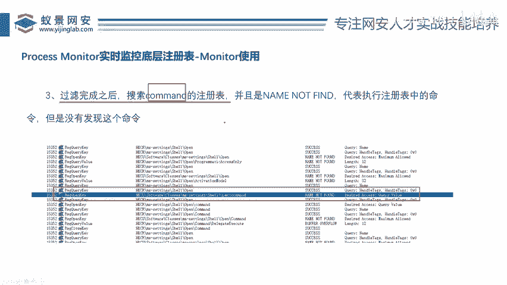

No。哎，写错了吗啊，写错了啊，COMMAND啊。😊，好，查找。哎，再来找一下查找。

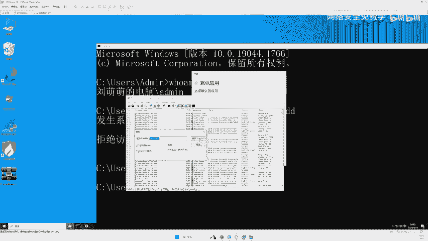

查找哎，这放大一下这放大一下啊，把这些都给你拖大啊，不然的话看不见了啊。😊，如果说兄弟们现在用手机看也不用着急啊，因为我等我找到了，给你直接截图截大啊啊，这里是不是找到一个来，我给大家截截图啊。😊。

来往这里看。好，这里我用鼠标标红这一段，你看叫看这这叫什么op这个open key就要打开，对吧？打开这个注册表啊，这个common的这个值。然后我们看它最终结果是namen find哎。

就是说我们的这个白名单这个程序设window设置这个程序，对吧？在启动的时候，它竟然会调用对吧？什么这个common的这个值啊，调用的时候，但是调用完成之后，这里什么notote find，哎。

等于说它没有找到这个值。好，那么我们接下来进一步跟踪一下啊，这个这块这个内容。😊，啊，这块这个内容到底在哪里？哎，我们把它打开右键哎，就jump一下。🎼来，我们来看一下。兄弟们打开。有吗？你看。

这里有没有大家看看啊，这里有没有命令，没有，所以它notote find对吧？你看这里是空，对吧？这里这个数值是空，所以说他刚才去执行那个命令的时候，这一块这个值是空，然后所以他所以他没有找到。

那么假如说现在我们把这里值篡改，把这里程篡改成。恶意的命令，那是不是就可以提成了呢？好，那我们接下来啊进行一波篡改。好，那怎么篡改啊？其实呢也是非常简单的啊，也给大家演示一波啊。😊，好。

来看一下怎么去篡改。OK啊，就用两句话看好了。这两句话呢，李哥已经给大家写好了啊，这两句话逐行就写进去啊，你不用管为什么啊，他就是这样去写的啊，你按照我的这个方式去写就可以了啊。

然后我们把这两句话呢啊写到这个记事本里来。😊，那么给兄弟们这个。复制一下啊。好，稍等等待哦。啊，我们最好还是采用这种复制的形式啊，它不会出错哈好，我们分别去解释一下这两句话是什么意思啊啊。

因为刚才是不是往这个注册表这里加值啊，我们现在把这个值篡改，你看把这里篡改成我们CMD程序，就是说当我们运行白名单的时候，然后白名单程序啊又会调用这里面的值，然后我们把里面改成我们的CMD好。

那你改成CMD就会产生一个后果。当你打开我们的白名单啊，白名单程序，白名单程序就立马会调用这个CMD那么调用到这个CMD它就是过了UAC了。好，那底下这个它是固定学法啊，它你不用管就行了。

所以说我们只需要将两句话写复制一下啊，复制到哪里呢啊，复制到我们的系统里面去。😊，OK打开我们的现在打开我们的win10O。😊。

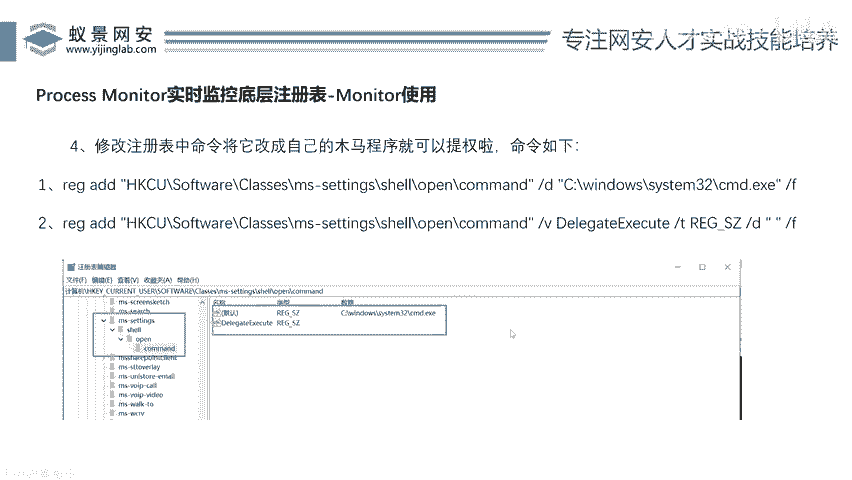

好，把他们都关掉啊，直接对吧？用你的普通管理员啊回车好，这两个操作完成了，对不对？这个两个什么意思啊？就是将这camod里面的值改了，改成什么了，改成打开CMD了。好，兄弟们，那你说。😊。

我现在去运行这个东西，你说会发生一个什么样的后果啊？你觉得现在我运行这个白名单程序，它会不会打开CMD。如果你觉得会啊，你给李哥扣个一，好吧，如果说哎你觉得会。

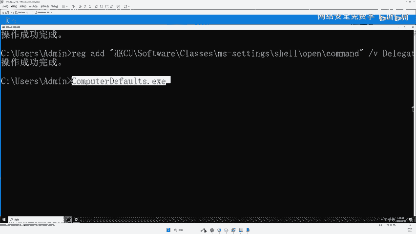

你给我扣个一。如果说你觉得不会，你给我扣个2。既然我们现在已经把这个白名单程序底层给篡改了，对吧？篡改了。

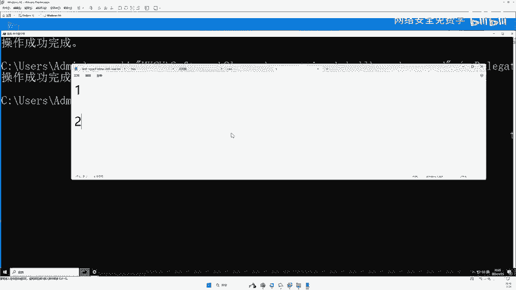

啊，应有人说应该阻止行为，不阻止。我给你看我的现在s软长期开着呢，没有阻止，不可能阻止。我一会儿告诉你为什么不阻止，对吧？大家觉得不可能啊，这是微的温温柔的程序能被你万能被你百里篡改了。看好了啊。

你看飞车。😡，等一下维车。看到没？我的window的设置没有打开，但是会打开1个CMD打开的这个CMD兄弟们，我这里看是谁的，是it me，现在我再去添加一个用户。看到没？命令执行完成。命令执行完成。

提船成功了。兄弟。

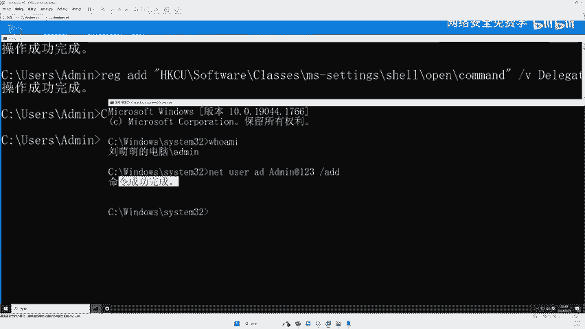

那这里的发挥空间就非常大了。那假如说兄弟们，我把这个东西改成一个木马。改上一个木马。那你说会产生个什么后果？那你的木马。木马就会以。最高的管理员。运行。明白吗？你的木马就会以最高管的运行。

OK有人说不信李哥，这样我不信啊，你就是win10，你在骗我，你在演我好，接下来我拿win10。有人说这个东西为什么不会报？因为我们是HUCKHUCK。😊。

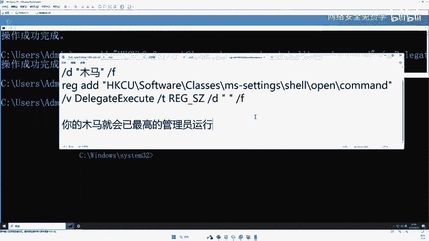

对不对？HUCK是当前用户可以篡改的，就是你的用户是A me，你就可以改这个HUCK。而且你的这个杀毒软件不会出错的，不会爆读的哈。不信呢这种程序同样也可以适用我们的win11哈。

我给你打开一个win11试一下，好吧，你就现在拿开你最新的电脑，行不行？打开你最新的电脑啊，你就试试你的火龙爆读炉啊，不会爆读的啊。因为我们现在做的操作没有任何一个是什么有毒的操作。我们都是正常操作。

😊。

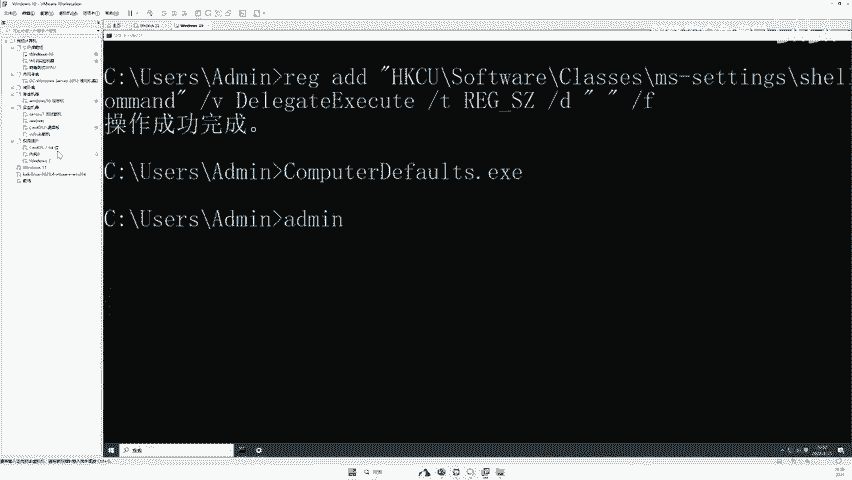

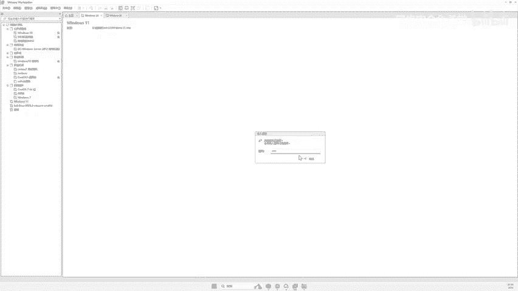

啊啊，对，那接下来我给大家演示一波啊，演示一波怎么提全，好不好？😊，啊，我给你演示一波怎么提全啊，我们以win11再来演示一波。OK说一下我们正确的提全步骤是啥啊？😊，啊。

所以说不管是win10win11都适用啊O。😊，啊，注册表改的对，改注册表它是不需。因为它是啊我们来这个。

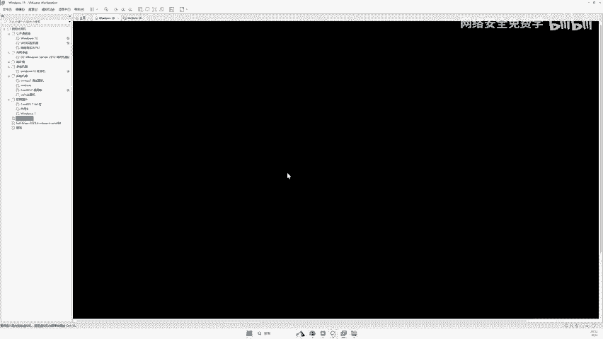

来来winwin10win10。好，我们来这个win11哈。没有问题。好，来给兄弟们看一下。好，现在我电脑升分11好。😊，win1一对对？okK没有问题吧。来，我打开CMD啊，来，我们远远不动干。

那么当前我的用户兄弟们来往这里看。😊，哎，是不是叫百里KCC98？😡，对不对？好，百里K98看好了。那么我现在想假如说想去添加一个用户。😊，BDD回车看拒绝访问啊。

那么我的电脑目前啊这个你看windows different的对吧？都然后把这个这些都开开，好吧。😊。

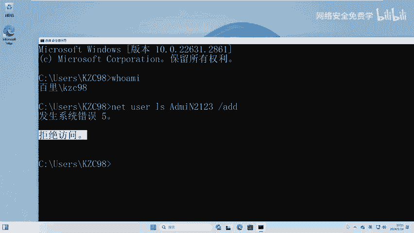

啊，杀毒软件都给你开开，好吧。😊。

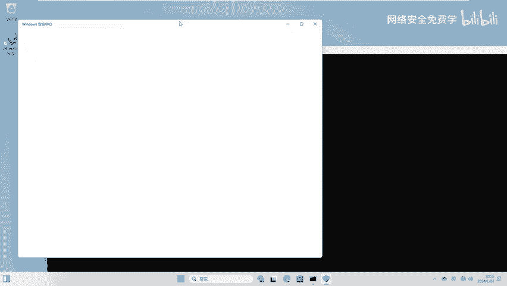

啊，这个现在正开着呢，我就不开了啊，你看这里没有关，对不对？是对号啊，我的杀软先开着了。这你看这里提示拒绝访问了，直接运行拒绝访问。因为你的这个当前这个KCC白里这个用户，他是一个有UAC的管理员。

还没有绕过UAC，对不对？那假如说你想要，你想绕怎么绕啊，直接把李哥给的这两句话。😊。

啊，所以说对于你来说，对吧？对于一个黑客来说，你怎么怎么来，直接把这两句话。😊，哎，我这两句话呢。啊，在这一块啊。来，我把它复制一下啊。好，复制复制哪里呢？来，我给它复制到记记术本里面来，对不对？😊。

好，把你直接把这两句话在你的win10上运行一下啊，直接复制。

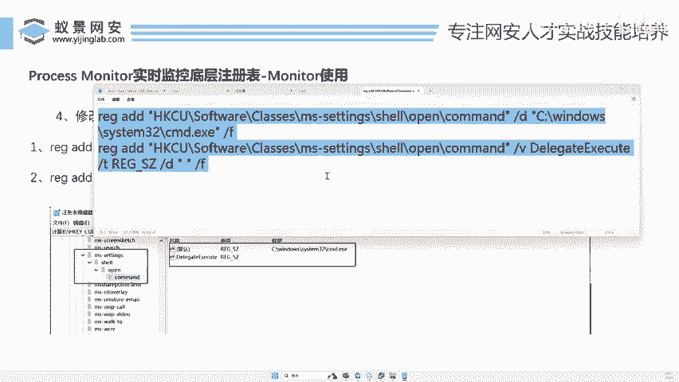

哎，直接在你看在你的这里运行。你看我运行的时候，大家看看啊。😊，回车微软也没有爆读，看到没？我的杀毒软件也没有爆读啊，提示操作完成。为什么？因为我现在改的是这个HUCKHUCK李哥说了，任何人都可以改。

对吧？他不会爆读的，因为他比较的啊他会觉得这个东西没有问题，对吧？好，那接下来怎么办了？我们已经把什么已经把第一块篡改了，篡改成什么了啊，运行了1个CMD那么接下来啊你去运行你的白名单。😊，好。

我们来运行我们的白名单。啊，哪个白名单，那现在我们测测的是哪个白名单，是不是那个windows设置啊，我们把这个windows设置一个白名单啊，拿过来回车。好，那么现在你再去运行这个东西。

它是不是就打开这个CMD了。好，你看你回车。😊，看打开CMD了啊，那么打开的这个CMD我们来看一下。😊，他也是这个白里KCC但是你看一下我可以去添加用户了。开车命令执行完成，看到没？刚才这个拒绝访问。

现在命令执行完成。提传成功了。那么如果说你想控制别人电脑，你只需要干嘛？把这里面的东西换成你的木马。换成你的木马，然后你你木马就会以最高管理员运行，然后你就可以完全的控制别人电脑了，就这么简单。

OK所以说啊我们这个就是白名单提全的原理。兄弟们看明白没有啊？对于黑客来说，你只需要做两步，哪两步。啊，大家要去现在要去百名单提全，我随便你只要把我这两个命令记住就行了。在任何人的电脑上输入一下。

然后你干嘛呢？紧接着。😡。

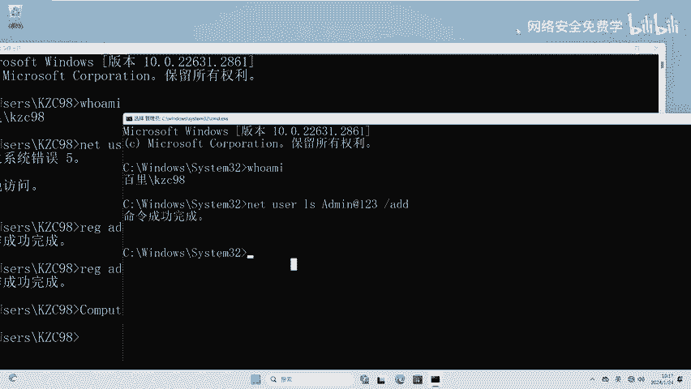

去执行这个。啊，你只要三步，对吧？第一步在对方电脑运行这个东西，第二步在对方电脑运行这个东西。第三步打开这个，然后你就拿到这个电脑的最高权限。😊，就招过白名单了，就这么简单啊，对于黑客来说就这三步。

但是这个原理大家要知道啊，我为什么要执行这个东西啊，就是因为我们这个白名单，对不对？它在底层运行的时候啊，它会有一个注册表的命令执行的行为啊，所以我们又因为他没有找到，所以我们把它篡改了，这是它的原理。

😊，啊，太强了，对不对啊？没这个才叫原理。啊，明白吗？那假如说啊还是那句话，对不对？你要自己学这些东西，你你肯定很费劲，谁给你讲这些原理啊，对不对？好，我们来看看对吧？我们这里再给大家看一下。

就是网上是怎么教的，对吧？给大家做个对比啊，没有对比就没有伤害，对不对？那有人说了啊，这个东西在实战中怎么用，就是李哥刚才给你讲的这样用啊，讲到这样用啊，而且你有没有杀软，没有关系，而且不会爆读。说了。

刚刚给你演示火容不会爆读windows def方的win11的windows day方呢，也不会爆读，只要你是一个普通管理员都可以体现到最高权限，明白吗？😊，啊，不同的白名单程序。对，没错。

所以说我们白名单程序的重点是啥？叫你要想成为一名高手，你就要一个一个去分析哪个白名单程序里面有这样执行camod的行为，然后你要一个一个一个一个去干嘛，一个一个去测，对不对？假如说那怎么去测测哪些。

刚才李哥在这里给他列了这么多，你每个都测一遍，你信我，你现在回去，你把这里边每一个都按照我的方法测一遍，你就超越市面上99%的人，因为99%的人他都不会，对不对？

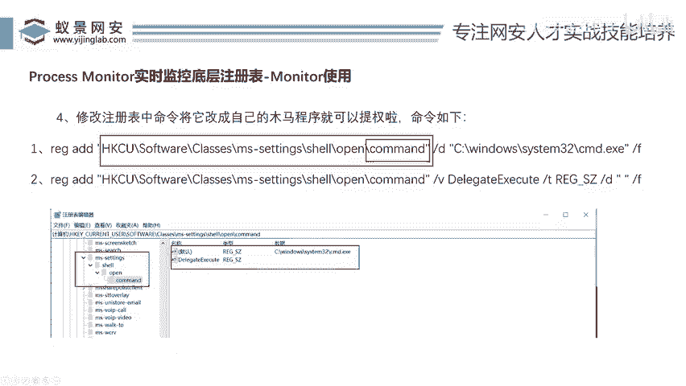