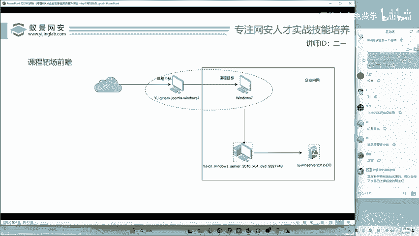
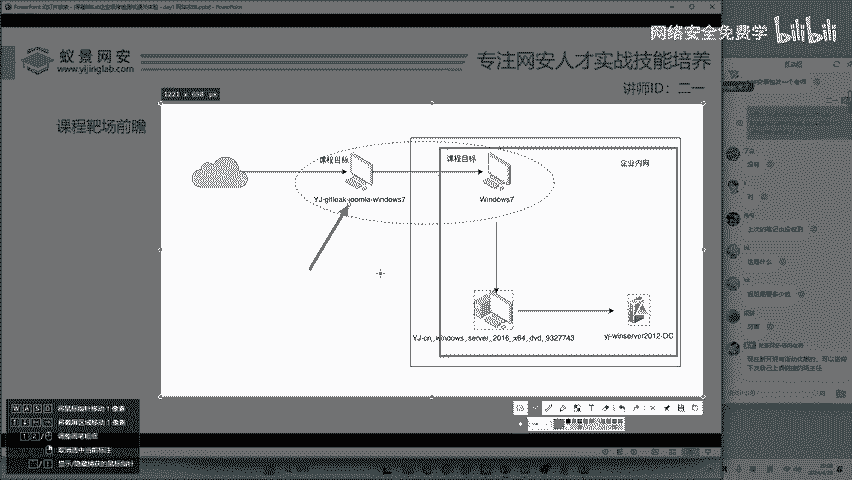
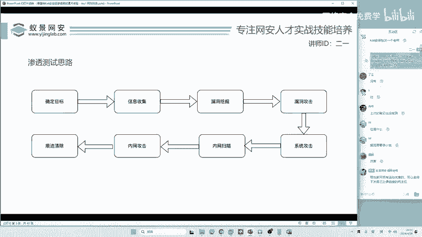

# 2024B站最值得看的黑客教程 ｜ 网络安全／渗透测试／内网渗透／漏洞挖掘／web安全／kali linux／红队靶场／CTF／信息安全 - P121：靶场前瞻 - 网络安全免费学 - BV1uBsTetEow

首先。😊，我们先来给大家讲渗透测试体验什么。体验DVWI吗？体验单独的sco注入吗？那这些呢不属于渗透测试的体验。因为我们这节课啊是给大家讲企业级的渗透测试，企业有什么，企业有数据库，有域环境。

有防火墙，有企业的内网。😊，就是比如说一个党政机关，一个医院，一个国家电网，它的内网是非常大的，甚至有几万或几千万台机器。那现在呢我们来看一下。今天的靶场这个靶场大家如果想要的话，我在客户啊可以给你。

现在不能给啊，我得讲完课才给你啊，我还没整理好呢，等整理好了，全部发给大家。😊。

那这个课程呢咱们是分为4台机器，这四台机器呢有三台机器是在企业的内网里面。什么叫做内网呢？我举个例子吧，就比如说大家的校园网。你的校园网呢其实是受到了学校的保护啊。

比如说大家哎很多同学呢可能听说过这样的段子啊，在学校里面不小心呢用校园网打开了一个非法的链接。那这个链接呢，大家懂的都懂啊，打开之后呢就被学校的这个网网络管理员啊发送了短信，告诉你啊。

你个小伙子不要再看了。😊，为什么学校能够知道你联网所操作的一些动机，包括访问的网站和APP呢？就是因为你在一个企业的内网中，你在需要源网的内网中，它里面部署了很多的设备。

就包括流量监控啊、防火墙啊、一些威胁感知呀，一些探视感知呀是吧？就部署了很多的设备。那这个呢叫企业的内网。那一般情况下，一个企业它需不需要有网站，需不需要有APP需不需要有小程序，肯定需要啊。

就我家旁边的幼儿园它都有小程序。我旁边家上旁边的幼儿园，他都有网站。那你说现在的企业有没有网站啊？有啊，所以说呢他肯定在防火墙之外有一个能够直接访问的网站。那一般情况下呢。

我们做黑客攻击或者是做渗透测试，就是从他的网站小程序或者是手机应用去入手。这个呢叫做入口点啊，大家如果不知道的话，可以记一下这个名词啊，入口点就是指黑客在攻击这个企业的入口大门啊。

就是我们今天要攻献的第一台机器。这一台机器呢是一个windows7操作系统，上面安装了网站服务数据库服务但是这些呢在你实际做渗透测试之前啊，你是不知道的啊，不知道怎么办呢？首先我们要开展渗透的第一步。

有同学说老师我知道第一步是信息收集，其实啊并不是，而是。😊。

