# 2024B站最值得看的黑客教程 ｜ 网络安全／渗透测试／内网渗透／漏洞挖掘／web安全／kali linux／红队靶场／CTF／信息安全 - P122：企业级渗透测试思路 - 网络安全免费学 - BV1uBsTetEow

是要了解渗透测试的思路。哎，我今天呢就给大家简要的概括一下渗透测试的思路。只要你看过一些电影，或者是你今天来听课啊，肯定是对黑客技术比较感兴趣。那你或多或少啊。

都了解过这些渗透测试步骤中所涉及到的技术点。😊。

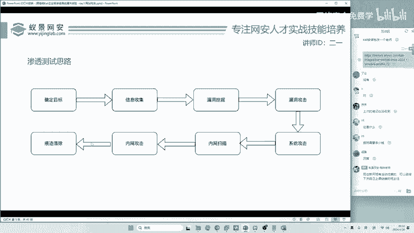

我们分别来看一下吧。第一步呢叫做确定目标。这个目标怎么确定呢？我们站在一个合格的安全工作者的角度来看，那这个目标呢可能是由企业分配给我的合法合规的授权目标。比如说呢你以后进了360。

360呢给你分配了一个任务，说你对某某厅进行渗透测试。那这时候你的目标呢就是有企业分配的。他标的很清楚。另外一件事情呢就是大家有的同学对黑客技术非常感兴趣，想自己挖漏洞，挖漏洞，挖谁的呢？啊。

比如说我挖腾讯的漏洞，这时候腾讯就是你的目标是吧？我们在站在一个恶意黑客的角度，谁是世界上最大的黑客呀？阿美丽卡美国。😊，那美国呢长期对中国西北工业大学长期进行后门指入和控制的事实已经被公开了出来。

这时候美国的黑客团队呢，他就是将西北工业大学作为他的目标。好，我们现在确认目标讲的就非常清楚啊。不论你是站在一个恶意的黑客还是站在一个合法的安全工作者，我相信大家理解的应该都非常清楚。

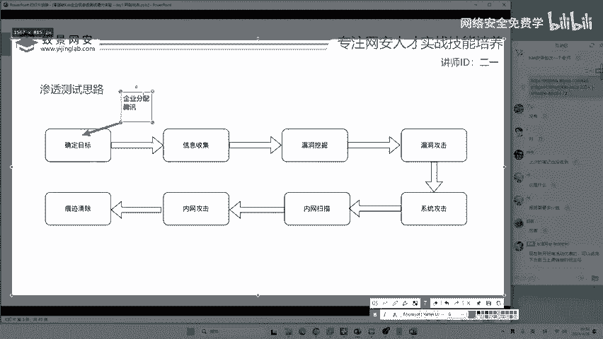

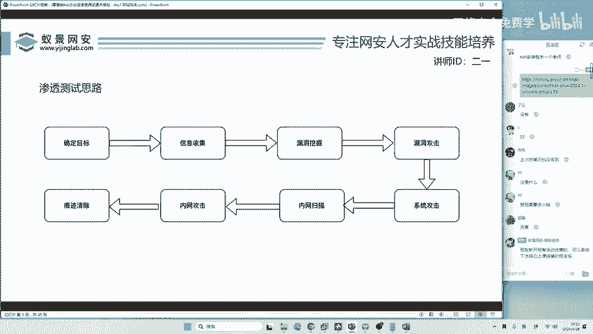

好，我们下面来看信息收集。什么叫信息收集呢？😊，就是收集他的所有信息，你没有听错没有听错啊，就是所有信息。有同学可能听说过啊，比如说收集IP地址啊，收集网站的域名。或者是啊收集他的人员信息啊。

比如说这个公司有多少人，这个公司的老板的电话是多少？这个公司啊在什么位置？这方便我们做什么呢？方便我们做社工钓鱼，方便我们做这样一个钓鱼工击。就是关于信息收集收集什么，你们能想出来的全部都是对的。

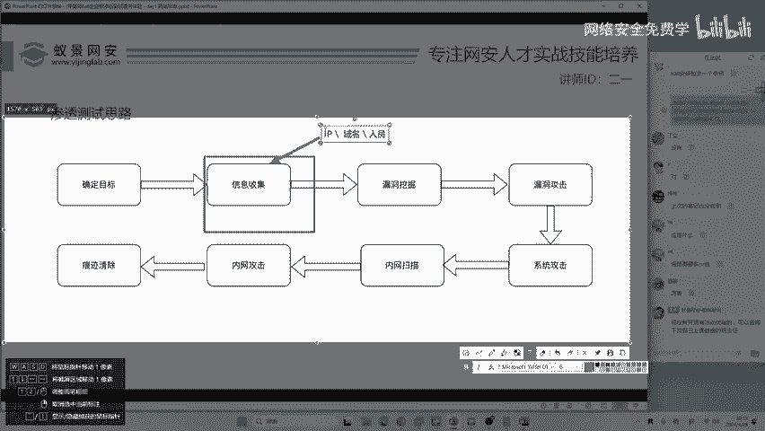

啊你想收集啥就收集啥，收集的越多越好啊，这个东西。😊。

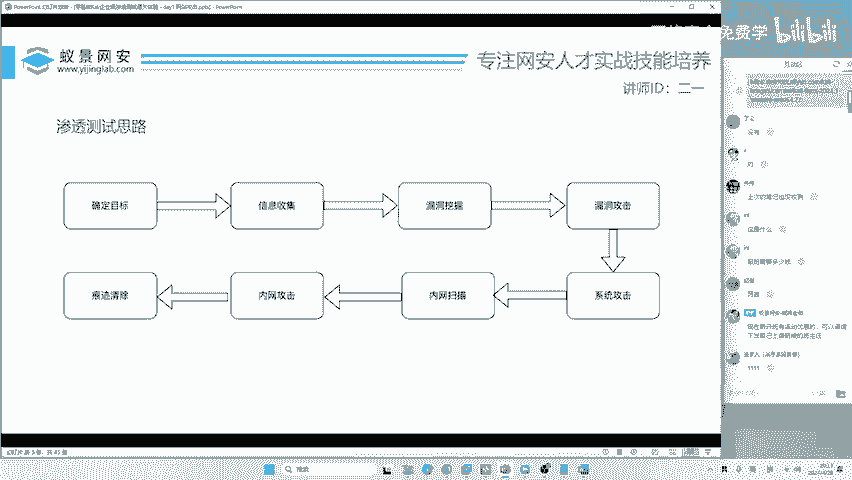

然后就是大家最感兴趣，也是你们学网络安全啊，很多同学在B站学，或者是听其他课程学，你们基本上就停留到停留在第三步了。😊，大部分人啊80%的网络安全入门者最终就是卡在了漏洞挖掘。你再牛逼。

你不会挖漏洞就是白扯在网络安全界啊，就有这样一个问题。那挖漏洞挖啥呢？有同学说搜库注入啊，搜库注入没问题啊，只是现在搜库注入比较小，为啥比较小呢？因为国家对信息泄露的惩罚力度比较高。

所以说呢啊大家都比较重视的，然后还有什么零带攻击，哎，我挖一个零带谁都不知道，哎，这个漏洞只有我自己知道，还有什么呢？就大家比较经常听说过的反序列化啊，反序列化，这些高级的漏洞，等等等等。

也可以通过什么一些软件的漏洞。哎，如果你以后啊学了两三年的网络安全的，你又可以干什么就可以去研究软件研究系统内核，哎，比如说缓冲区溢出漏洞啊，缓冲区溢出漏洞。😊，缓冲区溢出漏洞大家可能没有听说过。

但是你应该听说过一个漏洞叫做永恒之蓝啊，永恒之蓝呢就是微软的缓冲区溢出漏洞啊。

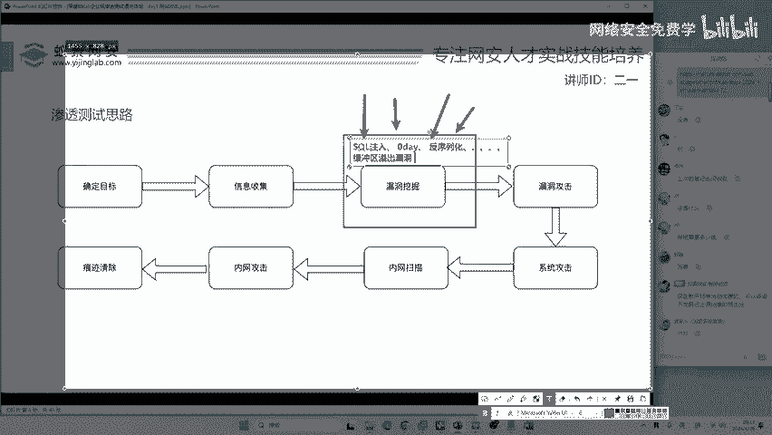

这是漏洞挖掘。很多同学都卡在了这里，为什么要卡在这里呢？哎，这个IPT攻击讲一下非常好啊，来，咱们留一个悬念，咱今天结课之后啊，我给你讲一下IPT的攻击啊。那现在呢因为咱们课程已经排好了。

今天是一个渗透测试的体验。所以讲呢我不能把这个流程打乱，你有什么需求，课后我来给你加小灶开小灶。😊。

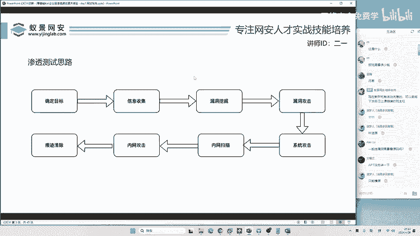

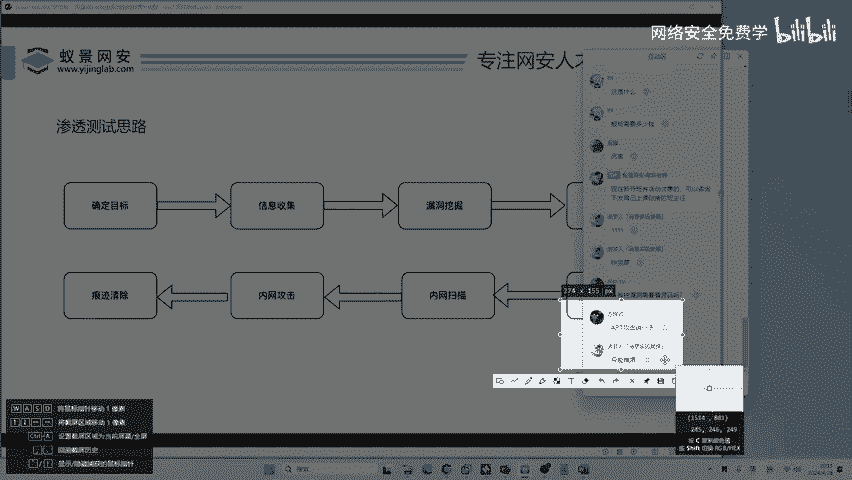

但是这个开小灶不能开太晚啊，哎我也要休息哈，也要休息，怎么体验，你看我操作啊，看我操作，今天的课程就是体验漏洞挖掘，哎，同学们，你们挖漏洞挖了多少钱啊？😊。

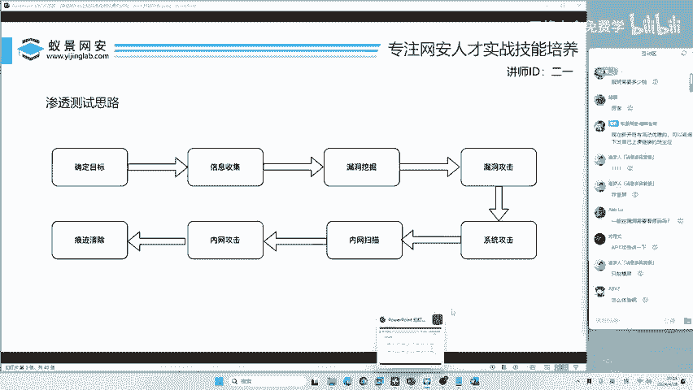

提交了多少钱，变现了多少钱。有同学说，哎，我现在网络安全都不会，你还叫我挖漏洞呢，别着急，慢慢来学啊，所有东西都是从不会当会的一个过程。😊。

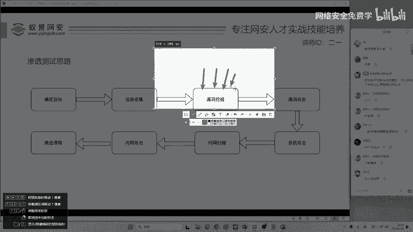

漏洞挖掘呢。

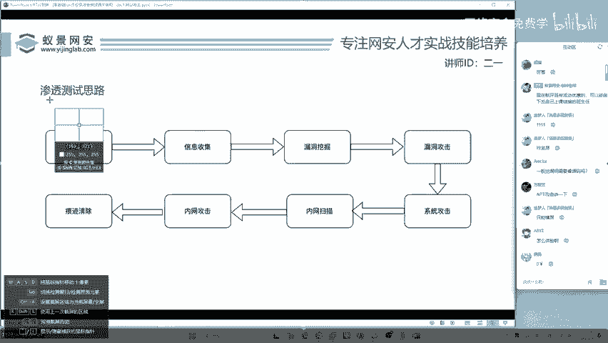

之后要学会漏洞攻击，你要清楚啊，挖掘跟攻击有同学天天搞反，那就是说老师我搜个猪儒会。你会你只是会挖掘他。你会攻击他吗？有同学说，老师我会我会联合查询，我会当普数据库，我会搜co map。那你会的东西呢。

在现在我告诉你可能用不上了，为啥呢？谁没一个防火墙呢？一个防火墙也不贵呀，并且还有很多免费开源的防火墙，大家呢都能用，那你这些小伎俩还能在现在派上用场吗？啊，也就是说啊。

漏洞攻击其实也不是说你想象的这么简单。😊，漏洞攻击完成之后啊，如果你的工资比较高啊，比如说以后咱们拿工作，想拿20K的月薪，你就要继续来看啊，要进行系统攻击。系统攻击是啥呢？哎。

大家可能学习过一个叫永恒之蓝。😊，永恒之蓝，但是你仅会永恒之蓝。😊，你能满足现在的系统攻击吗？也不行啊。你得整点新活啊，得整点新的东西，新的东西怎么来？我等一下来给你讲啊，你不要着急。

咱们一会儿啊就把这个流程给你走走遍。在走遍这个流程之前呢，我得先给你讲一讲这个流程是啥样子的，让你心里啊有一个谱，别到时候听的就晕了。😊，好，然后是内网扫描。

内网扫描呢就是对企业级的大型内网哎进行一个探测，进行一个漏洞的扫描。那它呢就是已经进入到了一些企业的内部环境。那比如说你可以攻击企业的防火墙摄像头啊，这是最常见的打印机，哎。

还有一些路由器交换机都能去攻击啊，这个内网扫描都能够扫出来，然后进行攻击。😊，扫出来跟攻击是不一样的，扫出来说明什么？说明你发现哎这个企业有10个摄像头。

那这10个摄像头你怎么去利用合理的漏洞去把它打穿？去看一看这个企业的摄像头在拍什么鬼东西。所以说呢也会涉及到内网攻击。最后一步，也是在企业渗透资测试中非常重要的一步，就是把你攻击的过程。

把你攻击留下的痕迹，全部给它清掉。你要是不清掉啊，在什么工作中，你都是等着吃牢饭吧哈，这是必须的一个步骤。😊。

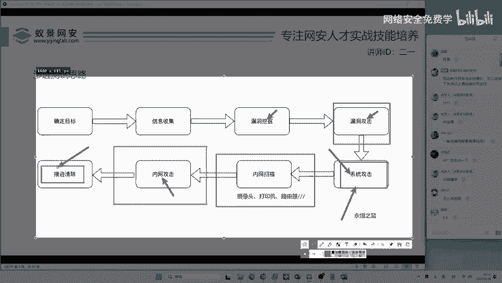

只要满足这些。今天说卡里吗说啊说这个现在我来跟大家讲哈，这个要不要会数据库，不要不要会编程，不需要啊，为什么不需要数据库呢？因为你是打别人的数据库。😊。

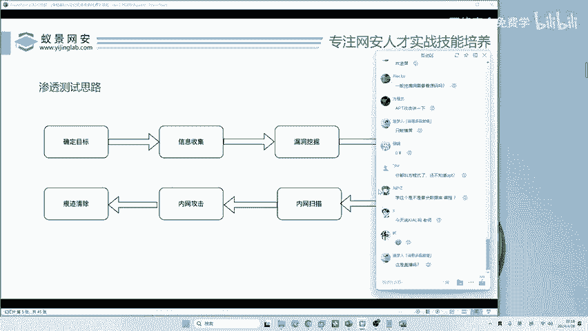

你是打别人已经写好的编程。你是打你是攻击方，你不是边携方啊，不是边写方。然后再来看今天说卡利吗？今天当然说卡利啊，这直播吗？你说这是不是直播，咱们都直播半个小时了，你说是不是直播？😊。

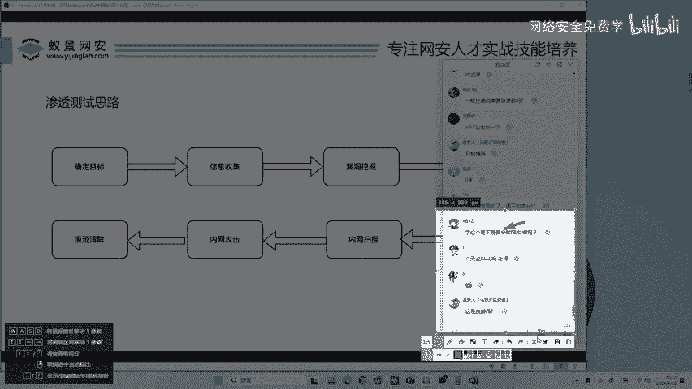

啊，不是直播的互动区怎么来的，我怎么回呢你的消息？😊，有同学说老师是AIE吗？我不是AIR，如果AI能讲出同样的课程，我告诉大家，你们都失业了，所以说这是不可能的。😊，好，来看。

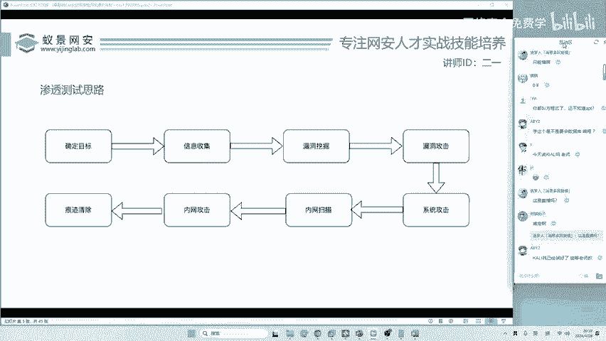