# 2024B站最值得看的黑客教程 ｜ 网络安全／渗透测试／内网渗透／漏洞挖掘／web安全／kali linux／红队靶场／CTF／信息安全 - P123：靶场渗透（1） - 网络安全免费学 - BV1uBsTetEow

首先。😊，我们要打机器要打机器。咱们第一步是什么？确定目标。我今天要攻击的目标是192。168。80。150。这一个机器你能不能访问到啊，你访问不到，为啥呢？因为它在我的电脑上。😊。

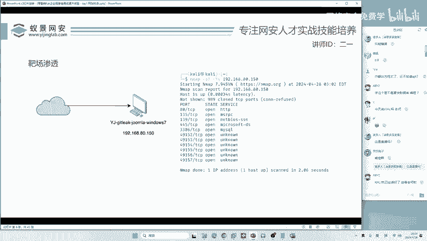

他在老师自己的电脑上，如如果有同学说老师我也想要，你也想要怎么办？我在课后都给你，你直接开机就完事啊，直接解压下载解压双击开机，你就跟我一模一样了。但是呢我要到课后再发给你，你先看我做。

咱们再得到一个目标之后要做什么事情呢？我们要做信息收集。😊。

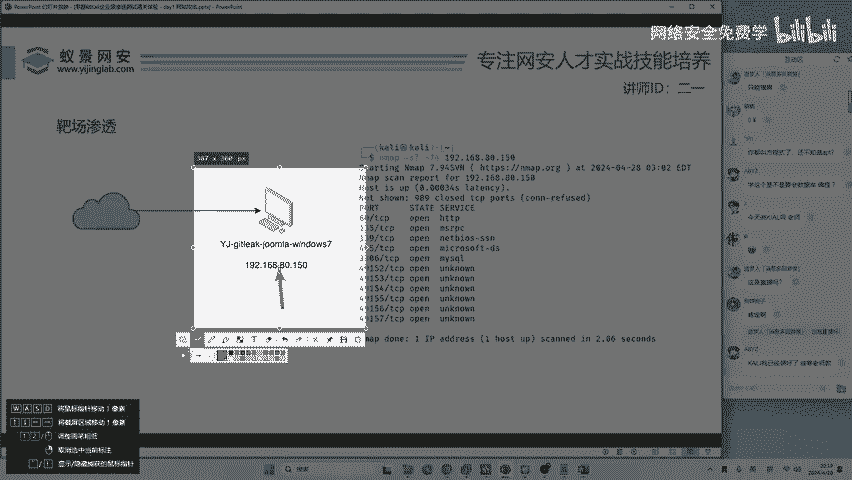

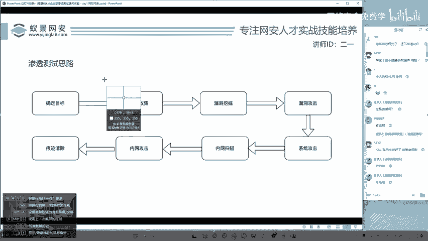

我们来看得到的目标，得到的目标呢，它只有一台服务器，还是一个windows服务器。那你要收集什么信息呢？有同学说我收集企业信息，那不需要啊，对这是个内网的靶场，你企业的信息收集的是谁呢？

收集的就是二一老师呀。😊，第二个啊，收集钓鱼啊，钓鱼不行，钓鱼那要在真实的环境下才行。所以说呢我们对于单一机器做信息收集，收集的都是。

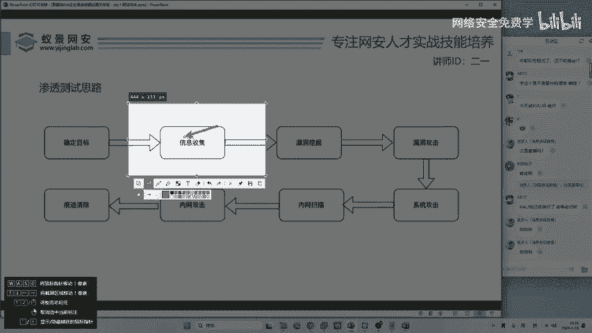

端口和操作系统版本非常正确。你讲的非常正确。那咱们怎么收集呢？今天给大家讲卡利，所以说我们用的工具都是卡里自带的。俗话说的好啊，卡里学的好，牢饭吃到饱，你能不能做渗透？首先就是你卡利掌握的怎么样。

哎卡里都不会玩是吧？卡里都不会玩，那怎么能满足现在的渗透测试呢？😊。

这个同学来看一下问题啊，VM17和下载hiper v一样能用吧。对呀，一样能用。但是他们两个是不同的虚拟化技术啊。h v是微软的那VMO呢是VMO公司自己生产的啊，他们两个原理不同，但是咱们是用户嘛。

用起来都一样，随便你随便你。😊。

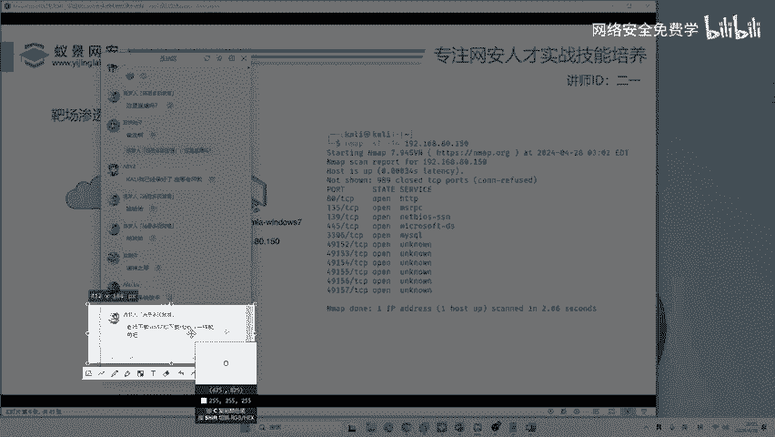

好，下面我来给大家教一招哈。首先打开你电脑的卡利，你看我的卡利呢比较好看，也是中文。如果你也想要我的卡利，没关系，我在下课都给大家，你现在就别下了哈，现在下几个GB，你下完的下课了，下课了是吧？

所以说你都不需要啊，不需要。😊。

安装我直接把我的卡里发给你。如果你想要的话。现在我们来看一下。卡里的版本呃，不用展示啊不用展示。你看如果有细心的同学能够看到我的卡里是2024年一季度版本。😊。

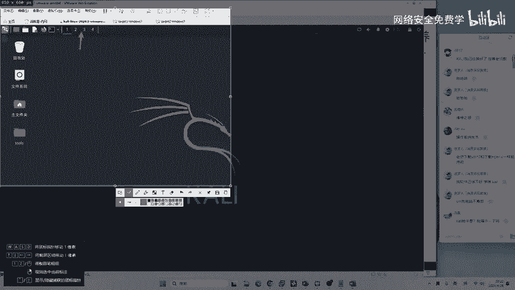

啊，就是现在最新的版在上面写着呢。好，我们来打开一下卡里。😊。

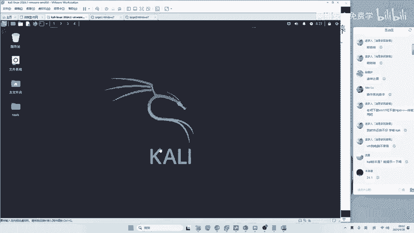

打开卡里之后呢，我们来扫描一下这个电脑，怎么扫描呢？哎，同学们看一下我写的命令啊，有同学说老师这个命令要记吗？不要记，这是众所周知的命令，你不知道你不知道现在我教你啊，我来教你。首先N map是干啥。

N map是一个对单一记器啊，对单一机器做信息收集的一个工具。那比如说你想收集它的端口，想收集它的操作系统版本，想收集它的服务，想扫描它的漏洞，N mapap都能做。剩下两个是啥玩意儿呢？哎。

同学们不要记啊，不要记，我给你讲就行了。这个啊就是说我要对它进行PCP的扫描。😊。

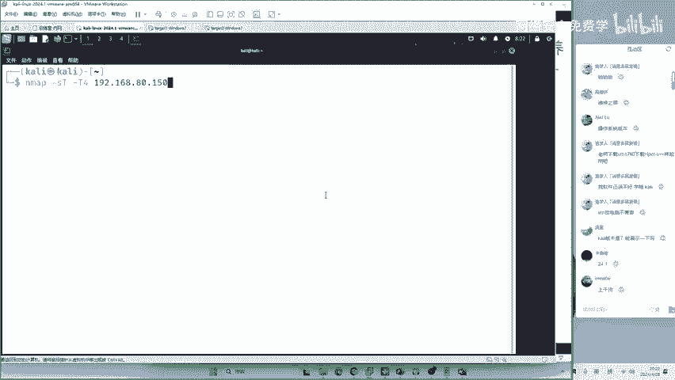

为啥要进行TCP的扫描呢？我想打他呗，我想要攻击他呀，所以说我要进行TCP的扫描TCP出现的服务漏洞最多啊，比如说你的APP你的小程序，你的游戏，哎，你的网站。

其实呢都是基于TCP解封装的HTTP以及HTTPS有同学现在懵了，他说老师我怎么听不懂？😊，听不懂，原因很简单，就是我之前讲过，你们的水平参差不前，文道有先后。😊，你听不懂。

就是因为你们在大学里面没有学过计算机网络，这怎么办？同学们一定要记住网络安全学习的技巧，就是不会。我就不看。有同学说你这不是扯淡吗？你想一想您高中的时候学物理，学物理。

那物理课本上物理习题上面每一题你都会吗？每一题你都会你高考状元了，你审状元了，这怎么可能呢？一般情况下就是不会，我们就放弃。😊，跳过这一步就行了，你不能说都不会啊，都不会，那不行。

这里的T4呢在Nm中代表快速扫描，就是说哎咱扫快点。

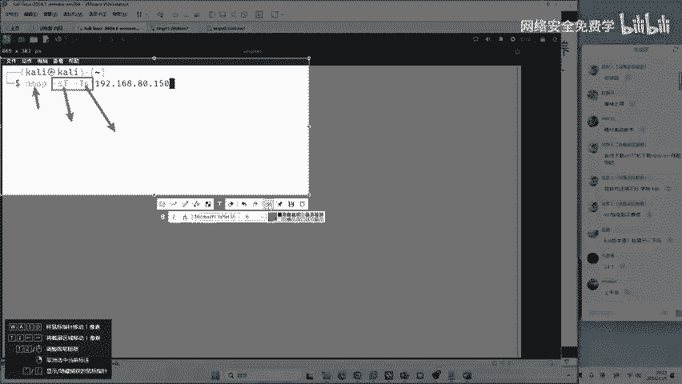

扫扫快点啊扫快点。扫快扫哪一个机器啊，扫192。168。80。150。这个用户啊，909130，他说啊他说哎是内网吗？是内网哈，这是我搭建的内网靶场。如果你想要的话，在课后我可以发给大家。

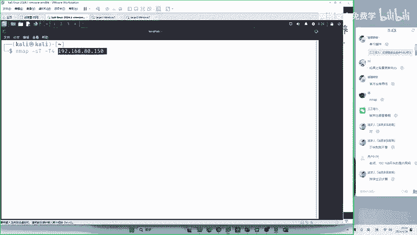

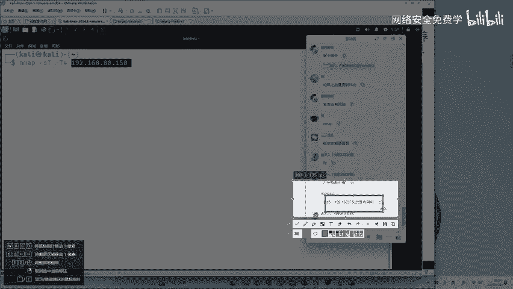

看一下同学们的问题啊。

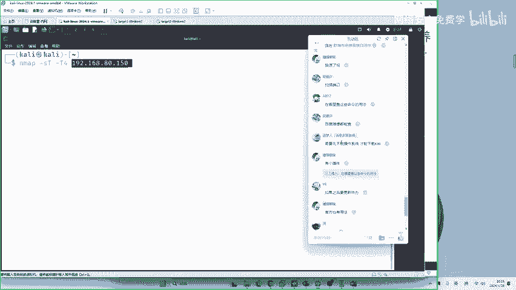

百度都能随便查，非常对啊。同学们经常说现在是ARE的天下啊，比如说像文心一言，char的GPT啊，通一千问都能去问啊，都能去查，他们只是不能讲课而已。😊。

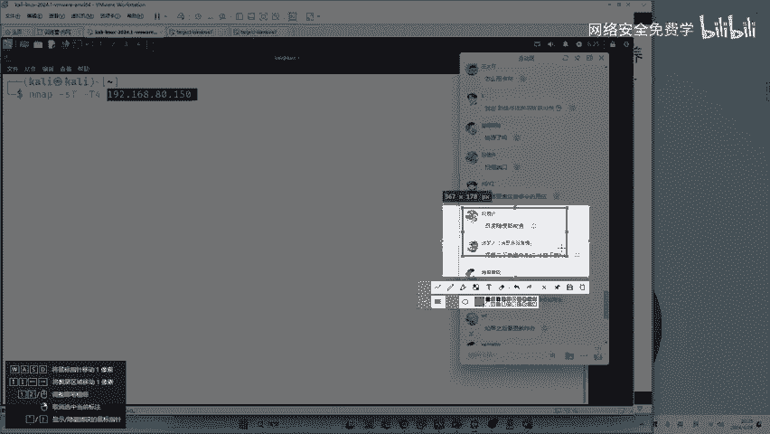

不用还原不用还原。不用还原。你没有到我家，所以说你拼不到。你没有你你要到我家里才能拼到我的IP啊。因为我家里都是格力的，你也是的啊。😊，你也是格离的。就是大家都保护着你。哎，有同学说，哎。

我没有被保护呀啊，你无形中受到了运营商或者是你学校的保护啊，就是隔离的，都是隔离的。😊。

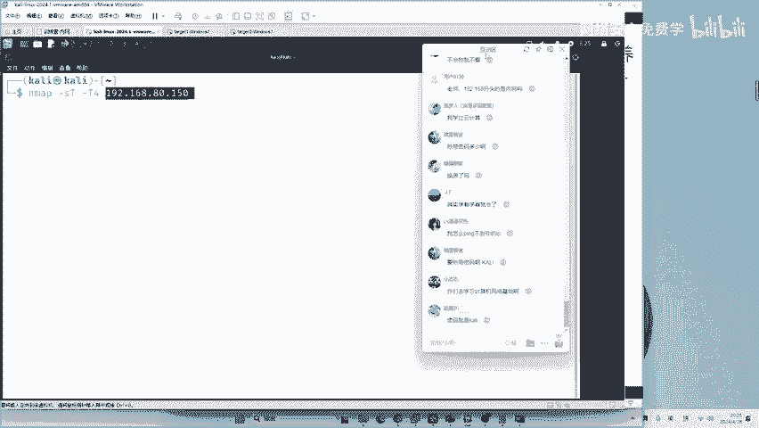

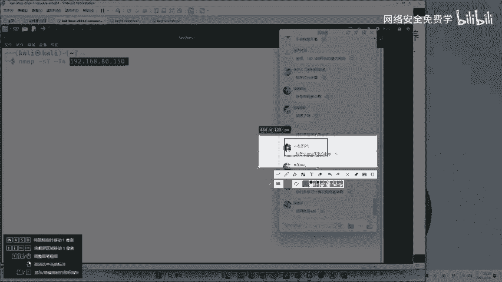

好，我们来看一下这个扫描速度啊是非常快的啊。😊，最新的版本最新的版本就是我的呀。😡。

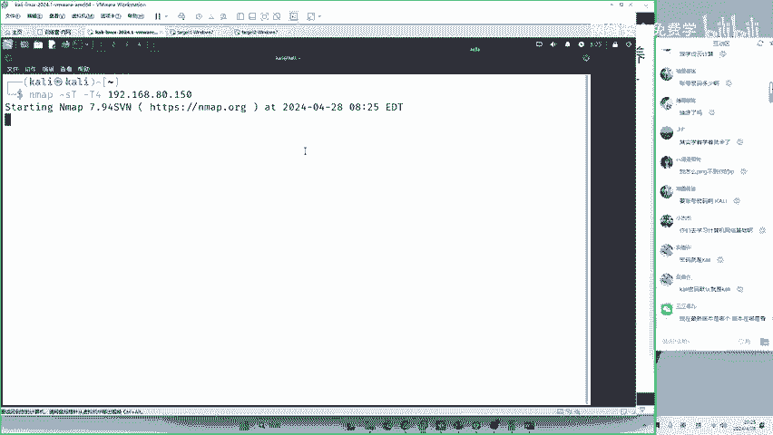

最新的版本就是我的。你看2024第一季度版本，第一季度版本现在是2024的第二季度，但是卡里还没有更新第二季度。

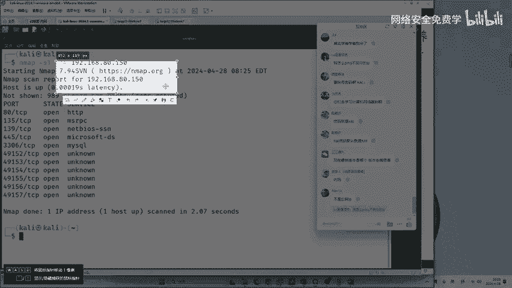

最新的就是我用的啊，我发给大家的就是最新的。如果你想用最新的，也可以跟我学。现在咱们扫了一堆东西，这一堆东西是啥玩意儿呢？😊。

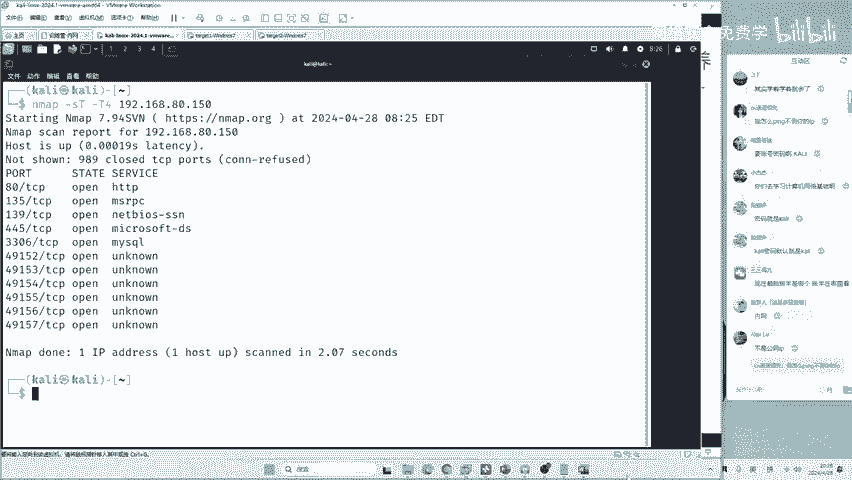

这一堆东西是啥玩意儿呢？好，大家看一下。😊，这一大堆东西啊，现在它指定的就是系统服务对应的端口号。有同学讲，老师我看不懂，看不懂怎么办呢？就不看。😊，我之前讲过一个很明显的道理，物理题不会做，咱就不做。

把会看的能看懂的。😊，做会就行了。就比如说一些基础的定律，你要知道，第一个就是HTTP它是指网站。第二个就是mysqcle，它是一个数据库。其他的我告诉你啊。

就是说你现在把HTTP的漏洞学会把my蚁soqcle的漏洞学会360齐安信别人都可以要你。😊，都可以都可以让你。前提呢就是你要学的非常精通，精通怎么办呢？就得慢慢学嘛。好，咱们现在看到网站，看到数据库。

😊。

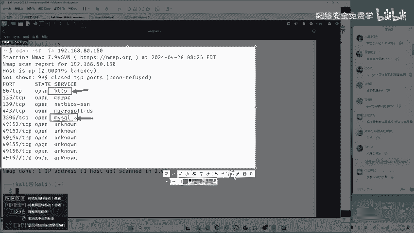

看到网站，看到数据库。我们要干什么？我们就要进行一个攻击，就要进行一个攻击。好，来看一下同学们的问题，扫描的前提是要拼得通吧。小姐姐啊，这个东西不一定，为什么呢？就是因为如果目标有防火墙。

防火墙啊可能会拦截你的拼。😊。

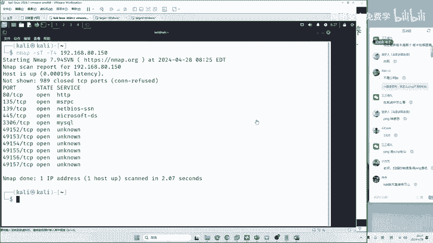

并不通啊，也可以扫描这个东西是分。😊，一个实际的例子的，你要考虑有防火墙的存在。当然，如果你单纯讲今天的渗透测试体验靶场，就不需要啊，不需要进行品痛，怎么越过防火墙啊。

有专门的协议叫socks防火墙穿透协议，你可以去学一学啊，当然今天啊因为是个入门教程。很多同学呢可能网络安全基础比较好，想学更高深的。咱们明天啊会有对应的内网渗透，可以耐心等待。😊。

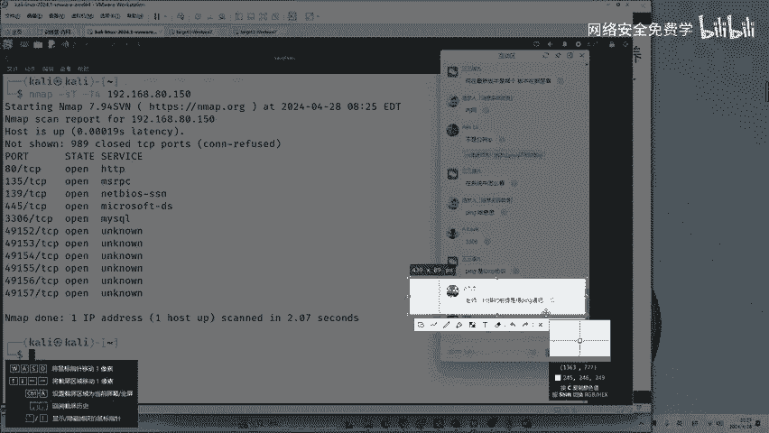

好，我们继续来看啊，比如说发现了目标，有网站，有网站怎么办呢？大家经常做的事情就是访问网站呗啊，大家都知道有网站我不打网站，那不是开玩笑吗？打开卡里的火狐，我今天就不用其他的电脑啊，我就不用其他的电脑。

我全部用卡里啊，用卡里。😊。

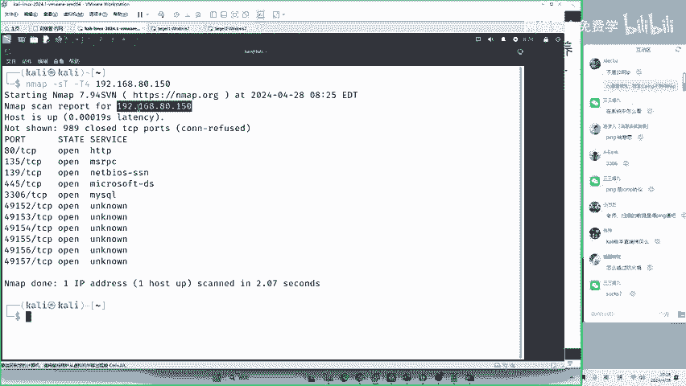

在卡利中啊，咱们访问一下这个网站，访问哎，打开了。😊，打开这个网站啊，现在。😊，按照同学们之前学的网络安全经验啊，他该说了。我该测漏洞了呀，测什么测搜库注入就差一下下去了。😊。

测文件上传测命令执行测CSRF我告诉你啊，现在渗透测试你先别着急啊，你先别着急，你要干什么？你的信息手集还没有做完，你测什么漏洞啊？😊，你对什么测，你测这里有有没有搜Q注入？😡，测这里有没有。弱密码啊。

这别着急啊，如果你心急漏洞就不是你的啊，漏洞挖漏洞必须要有耐心啊，必须要有耐心。那现在怎么办呢？我们来看这个网站有非常多的页面，比如说像home about。

block啊cont us它有非常多的这样一个页面。我们首先就要确定啊。在这个网站中，它到底会有多少页面？我们要干什么呀？我们要找到在整个网站中最脆弱的地方，你难道说鸡蛋碰石头吗？比如说有同学讲，老师。

我今天我要挖腾讯，挖腾讯，我就知道QQ点com。😊。

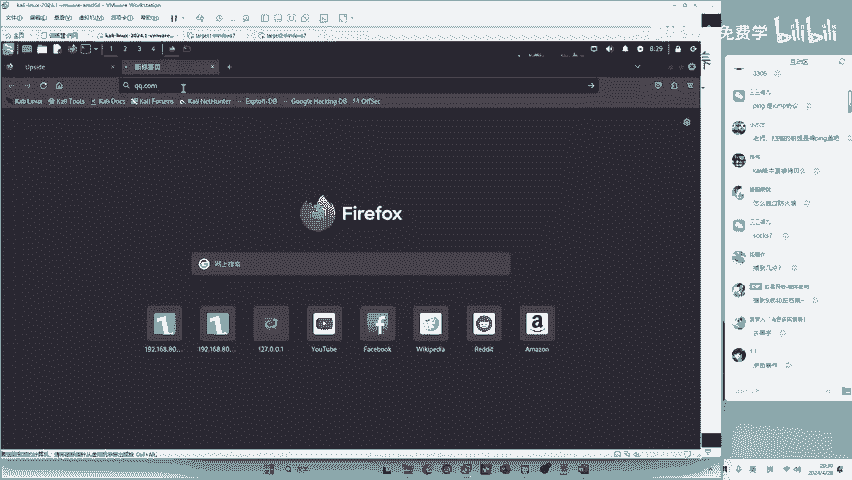

你就对这个网站挖，我告诉你，你就这辈子就别想出漏洞了啊，这辈子就别想出了。为啥呢？你这种就是属于鸡蛋碰石头，你是挖别人的主页。😡，别人最核心的业务。那别人程序员啊也不是傻子，那一个月几万块钱是吧？

这个腾讯的程序员一个月几万块钱，别人也不是傻子，是吧？😊，你得到你得到我家里才能进我的网站。😊，因为这个网站你没有啊，只有我才有我在课后会发给大家，你怎么能进来呢？你不在我旁边是吗？啊。

我又没有映射出去，你又没有在我旁边，所以说你访不了。😊，这个网站啊怎么建？😊，这个私网REP怎么进来我家里就进来了啊，或者是呢就是我转发给你，或者是我在课后发给你都能进啊，都能进内网，这明显的是内网。

😊，现在我们来看一下。这个地方显示出来的网站，我们要做什么？要做什么事情，就是做他的目录扫描，就是他的网站扫描。你要知道它有多少页面。那网站扫描啊，有同学发现login啊，我们来试一下。

你们的思路非常好，信息收集讲的非常对啊。我们来看一下login，哎，点login它点不动。😊，点不动怎么办呢？我们现在啊就扫一下它。有同学说我不想扫啊，不想扫，你就挖吧，你挖一辈子都挖不出来。😊。

你挖一辈子都挖不出来。那有同学讲老师我就要访问你的网站，我可以给你转出来，给你转发出来，知道吧？那有同学讲，哎，为啥我访问不了老师的网站呢？我用的不也是卡里吗？😊，那这样大家想一想。

我现在用的手机呢是iphone，那你用的手机呢可能也是iphone。那我有有一天我找到你说你的手机是我的。😊，你信吗？你同意吗？不同意吧啊，就比如说你的卡里，我的卡里，那都都是卡里。

那你的卡里有我的卡里吗？这个不对啊，你这个思想是错误的。😊，但这个思想你要去训练，我可以把这个IEP地址映射出来哈。但是现在在上课啊，上课的话，咱们来听课的同学啊，有些同学。😊，啊，咱们可能。嗯。

不太正经啊，所以说我现在不能转出来，转出来，到时候你们用我的机器啊当跳板机去攻击其他的网站。到时候啊警方追究下来，那是我的责任。所以说咱们课程呢都是合法合规的，你绝对放心。我们回到课程。

大家不要打乱这个流程啊。这个流程中，我们首先看到了网站挖漏洞，可能对于我来讲比较困难。为啥呢？这是个网站的首页，我对着首页挖。可能性不是特别大，怎么办呢？咱们要进行目录扫描，怎么扫目录，看好DIRB。

DIRB的意思是啥意思呢？啊，DIR叫directory叫文件夹目录的意思。B就是爆破的意思。就是我们要干什么？我们要对这个文件夹呢进行一个暴力破解。啊，有同学听到暴力破解就来信趣了。

他说老师要不要字典啊？😊，要不要社工啊，都不需要啊，因为DIRB这个卡里中自带的软件足够你去使用了。我就告诉你，你就用好DIRB挖漏洞，说一个月挖个五六万足够了，你就没有必要说一个月挖个别墅了。

即使说你用其他的工具，你一个月也挖不出来一套别墅，咱们就先拿简单的来讲，让你啊能够体验这个过程，按下回车，就出来一大堆的网站。😊，这些网站呢都是什么？都是我这一个站点的页面，什么叫做页面呢？

同学们应该知道啊，像百度贴吧，哎，那清华大学的贴吧跟北京大学的贴吧，那是同一个页面吗？😊，不是吧，但是他们都属于百度贴吧啊，都属于百度贴吧。现在呢扫出来的网站非常多，我们要看哪一个。

我之前很多同学抛出问题啊，他说老师这扫出来这么多东西，我要一个一个去看吗？😊，你不看谁看。你不看给我看呗，你就不要挖漏洞了，漏洞都给我，反正我我教了，我赚钱嘛，是吧？

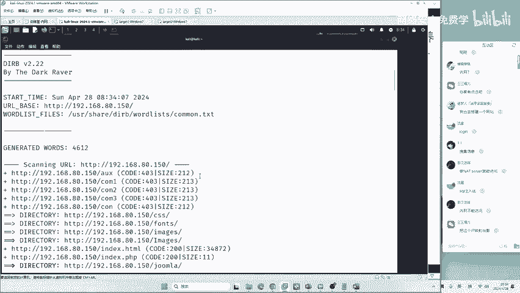

所以说呢你要去看要去看看哪些呢？我们先来看这里。在这个地方我们可以看到一个页面叫做PHPmy a me。好，来访问一下它。打开火狐啊，咱们先建一个标签页去访问一下这个页面。好，它是一个登录。哎。

输入用户名，输入密码啊，输入密码就可以去登录到这样一个平台。

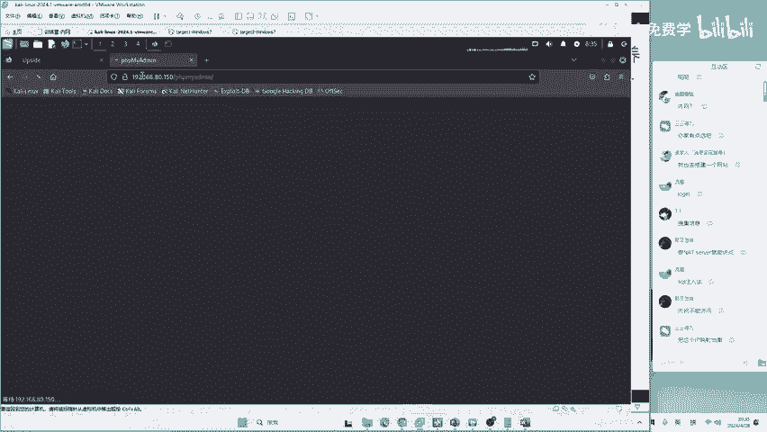

但是这个密码是多少呢？它数据库的登录啊，这个密码是多少，现在不知道，如果我拿到这个网站，我会怎么样？同学们说爆破密码，你们讲的非常对啊，就试一试它是不是弱口令。首先我试123456是root。😊，不对。

再试123456。也不对。好，这时候就可以停止了。大家一定要记住，数据库如果是弱密码，它肯定是非常弱的密码，否则就是抢密码，没有说介于中间的啊介于中间的，反正我做6年的摄像头没见过。我做6年的渗透啊。

没见过。咱们可以看一下，有更快的方法吗？我等一下教你啊，等一下教你咱们要干什么？要另寻其径。😊。

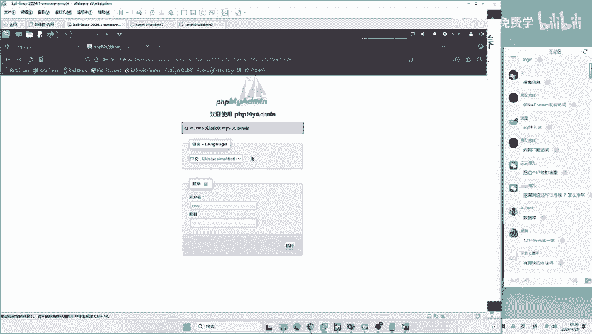

因为很多同学啊看到这个页面，他就想爆破，结果呢。爆破是你的绊脚石，你在这里爆破了什么？爆破了一夜，爆破了两天，你都没有出货。然后呢，你又放弃了，你又觉得哎渗透测试好难呀。

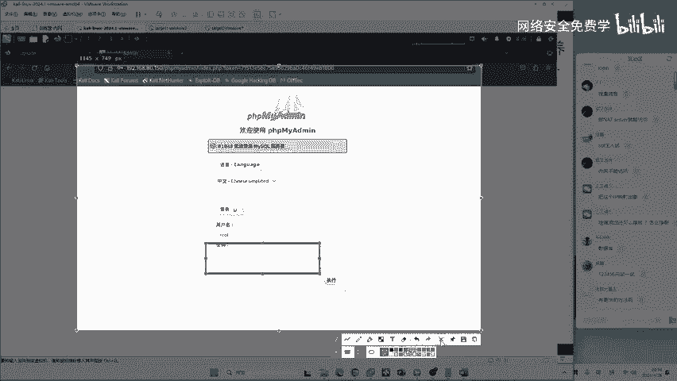

但是你别着急。

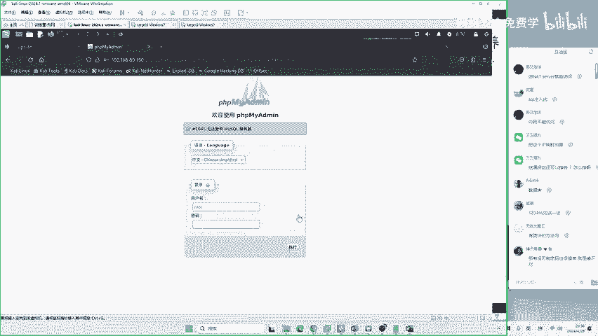

咱们也看一下。对呀，这个同学讲的也很对啊，密码很简单，就是猜不对这种东西啊，首先你要猜对了，你才知道它的密码是简单的。如果你猜不对，你一辈子都不可能知道它的密码到底是多少，这就是一个什么悖论啊，悖论。

😊。

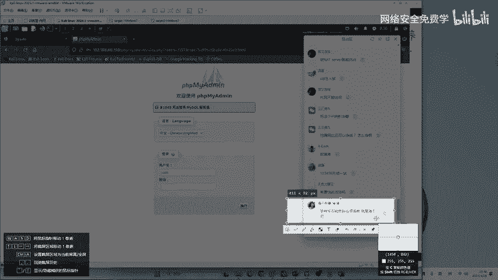

不用写啊不用写代码自动爆破，我教大家其他方法。😊。

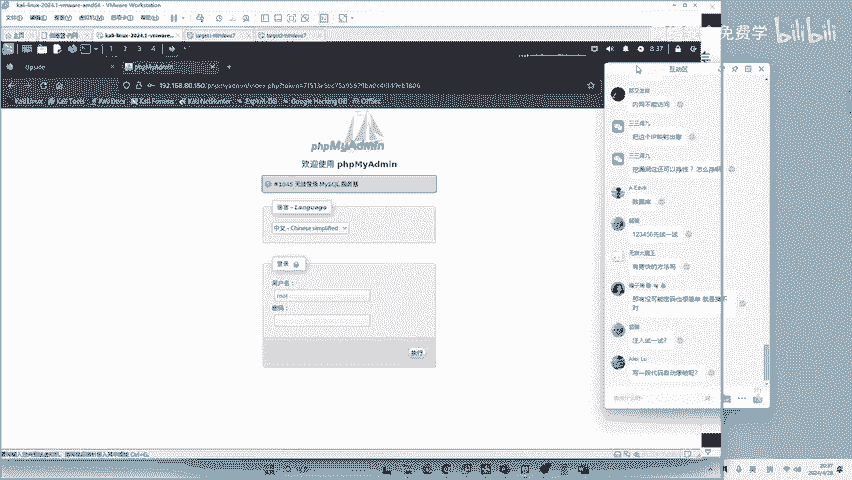

现在还是停留在信息收集，咱们有没有开展漏洞攻击，有没有攻击他没有啊，我们还在这一步呢。😊。

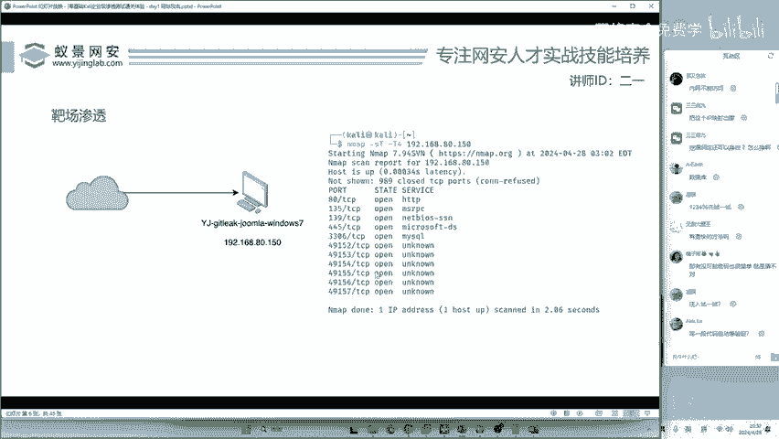

我们现在停留在的是信息收集，不是漏洞挖掘，也不是漏洞攻击，还在做信息收集啊，还在做信息收集。我们继续来看。

刚刚呢这个卡利跑的信息，除了PHP玛耶的命之外，我们继续往下看，那这些就不要看了，这些是什么？这些是images，它的中文意思叫图片。😊，那你渗透测试，你整图片干啥呢？那图片呢造成什么影响呢？是吧？

有同学讲图片码，那图片码也是要有什么，也是要有漏洞啊，才能够出现图现图片码。你没有漏洞，你图片码图片个啥呢？好，我们再来看这里发现了一个新的。😊，文件路径叫做卓美拉。周美拉呢很多同学可能没有听说过啊。

因为周美拉是一个国外啊，就老外啊，美国啊、欧洲南非啊、南非洲啊、南美经常使用到的一个博客平台叫周美拉。😊，在我们国家呢可能用的比较少啊，但是在欧美用的是非常多，在世界上肯定有几亿啊。

10亿以上的网站用的是jo美亚。😊，那这个网站呢出现在了咱们的靶场中。我请问大家，如果你不做信息收集，你不做这个步骤，你会知道这个网站吗？😊。

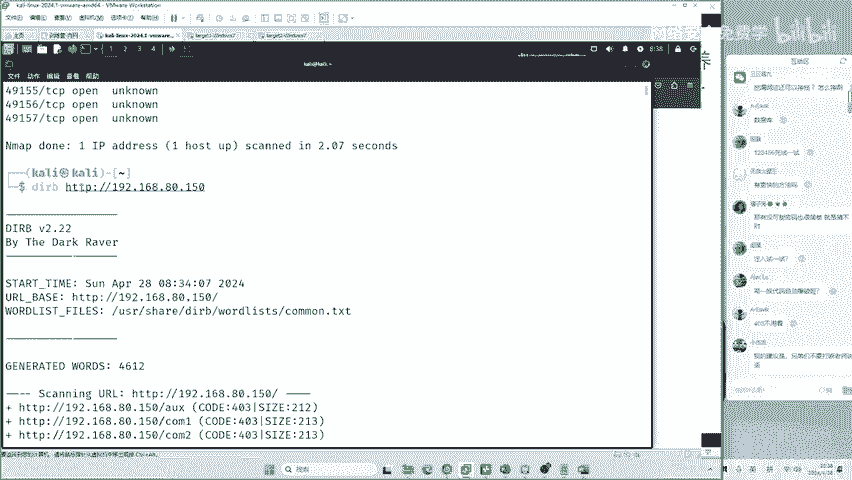

你是神仙啊，你除除非你是神仙，不然的话，你能知道这个网站会有这样一个页面吗？你不可能知道。咱们来访问一下。访问下之后啊，发现了周密拉，并且呢他也有一个登录框，有同学看到这里又想去爆破了啊。

但是呢啊周密拉她有爆破的防御。别人既然啊世界上几亿个网站都在使用它，那他的安全性还不得好一点吗？不然的话，别人十0多亿人都骂她他能受得了，受不了啊，所以说他的安全性还是比较好的。😊。

并且呢我使用的也是比较新的版本，它其实呢没有特别多的漏洞。我们继续来看他扫描的结果。这里呢你可以看到一个非常特殊的名词叫做administ管理员。那这个页面又会产生什么样的效果呢？

我们要复制打开一下才知道。😊。

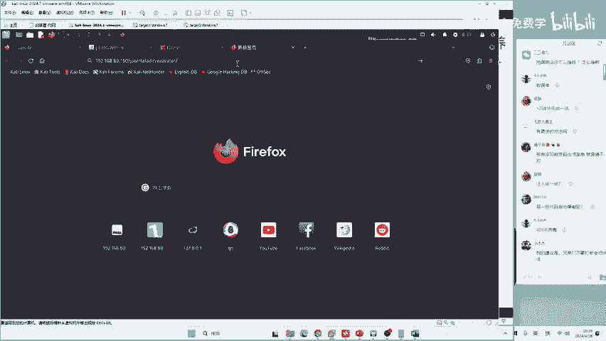

你不打开他长什么样子，你能知道吗？好，是一个jo密拉的登录框，好像呢跟我们这里差不多是吧？😊。

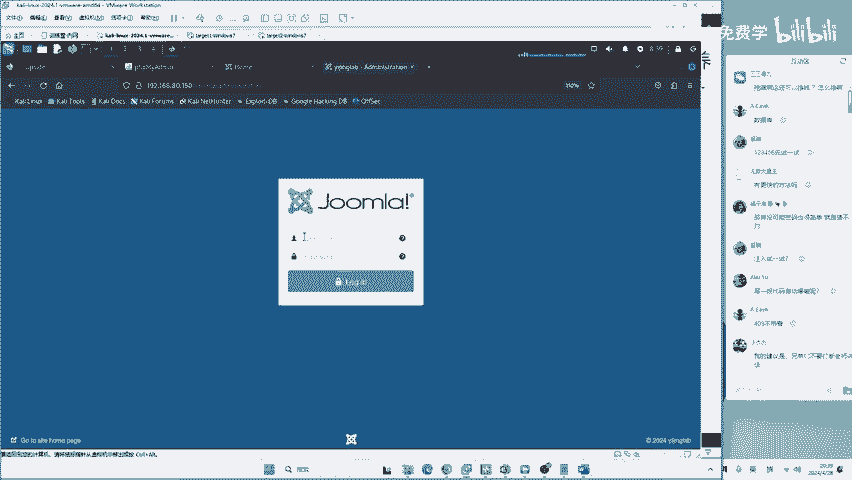

还是就没了还是就没了。好，我们再来看。😊，讲到这里呢，很多同学他可能就思路就卡死了。思路卡死的时候呢，我来教大家一个方法。现在你已经通过信息收集发现了在这个网站上面三个非常重要的网站。

那他就是网站的首页。😊。

我们刚刚已经见识过了啊，网站的首页它可能有scle住漏洞。PHP my amin。如果我们知道它的密码，或者是能够猜到它的密码，你就可以登录成功。下一个是jo密啦，这个密拉博客平台啊，我们现在拦住了。

因为它的版本比较新，并且呢我们不知道它的密码是多少。不知道密码是多少，有同学讲，现在我不需要知道我可以做soco注入的攻击。😊。

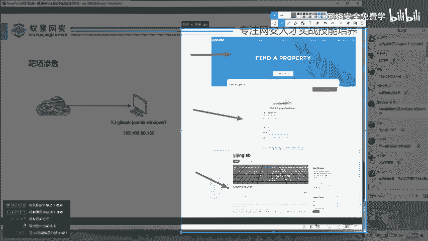

嗯，现在问题来了哈，有同学讲老师啊，我能不能挖一个漏洞出来呢？我建议你啊不要去挖，为什么呢？同学们啊，你可以到国外的平台看一下救妹拉的赏金。如果呢你能够挖到一个救妹拉的搜co注入，它的赏金高达3万美元。

😊，也就是说呢，他的一个搜库住住，基本上你可以在一些二线城市拿一套房子的首付。😊，对，就是这个价格。你觉得OK吗？我们觉得打靶场，我打一个靶场就赚20多万。😊，你这不是打靶场呀，你一阵是赌博呀。

你这是搏一搏单车变摩托呀。所以说呢你在深透测试。没有这么高级，你要干什么？你要继续的去找信息泄露，继续去找找哪里，同学们看好啊，咱们看好。😊，继续往下找下去，这里啊周密啦周密啦之后呢。

它有一个叫做点git。😊，head这样一个文件。如果呢你经常做渗透测试，看到它一定非常的敏感。如果你没有做过渗透测试，你看到他说我怎么不知道这啥玩意儿啊？我现在就来给大家讲。

它是一个开发不小心留下的东西，而且在实际的网站中非常多。😊，超级多啊，这个东西叫get泄露。什么叫做get泄露呢？你们回到咱们课程的一个内容中，你可以看到它就是粗心的开发，酿成大货。😊。

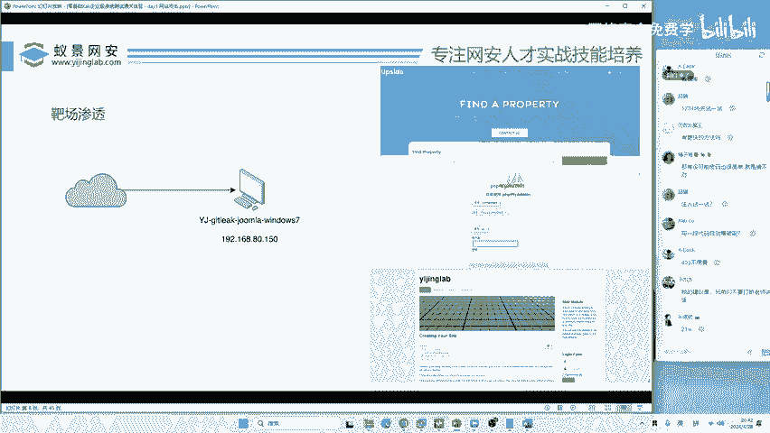

什么是get呢？啊，很多同学没有听说过get啊，但是应该听说过gatet upub。😊，他是一个存代码的仓库。企业用不用git upub呀？我从来没有见过1个IT企业，不用git upub呀。

那说明你太菜了。你才用不到它。那现在呢他留下了get，就说明它有信息泄露。这个信息泄露能够干什么呢？能够让我们发现它在服务端部署的。😊，这些代码就是服务端，它部署的代码，你别管他代码用什么写的。

反正我全部能获取到。能获取到哎，那有同学讲还要获取这个。代码吗？叫gitthub，github不是get up。啊，我这个读的应该还算。😊，哎，不是特别标准啊，让你误解了，叫get up呀。

不是get up。😊，好，我们继续来看哈在这个地方。😊，在这个地方，我们现在已经知道了它有了get泄露，我们应该如何把它的源代码去获取出来呢？这里就要借助到一个脚本。这个脚本呢我在课后会发给大家。

如果你下载的是老师的卡利，就不要给大家了，我里面就有我里面就有是吧，就不要给大家了。如果你是自己的卡利的话，我会把这个代码呢给你这个代码。😊，你需要去了解怎么写吗？不需要啊。

我们直接的去打开这个叫做get tank的代码，就能够直接的去用了。呃，不安全不安全，有很多的漏洞都可以通过get upub去get到啊，都可以通过get upub作为入口点。

那现在咱们这个脚本应该如何运行呢？刚刚我讲过了gatet泄露啊，你知道get那非常好，gatet泄露是为了干什么？是为了获取网站的源代码，你会觉得为啥要获取源代码？😊。

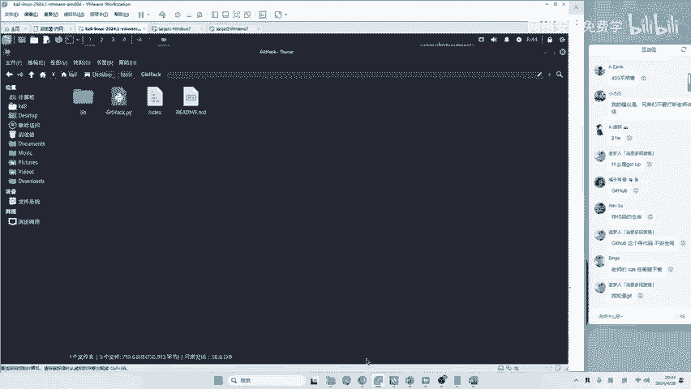

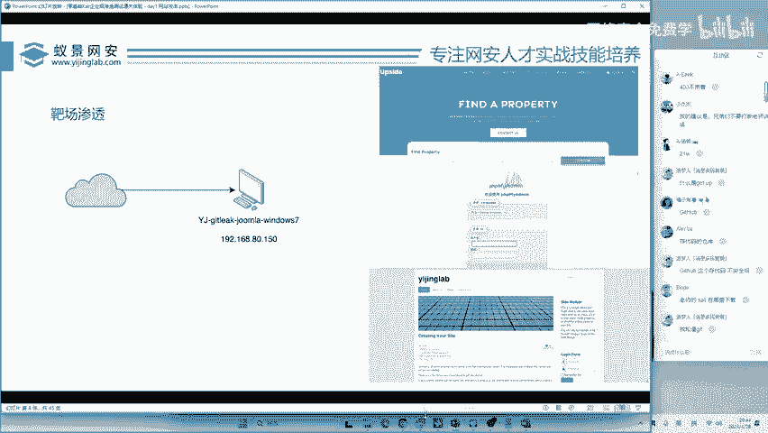

我在这个地地方点击右键，点击源代码不就有了吗？我要告诉你，这个地方叫做前端代码。前端代码你看它干啥呢？你看他嗯，他能产生什么影响吗？不会产生影响啊。我们要打的是别人的服务器啊。

呃不是说你在你自己的浏览器上面自嗨。所以说呢我们现在要把它在服务器上保存的后端代码给它扒去下来。😊，怎么爬取，你看我操作啊，怎么用，你看我操作有啊，我发啊，我发给你了。就这个我的卡里啊，随便大家领。

我在客户的时候全部都会上传，你们下载就行啊，下载就行。😊，现在我们来看这get hand放在这儿了，好吧，这个你只要是领的我的刊利，你们都有想单独要工具的，我也会发给大家。😊。

现在右键点击在这里打开终端。

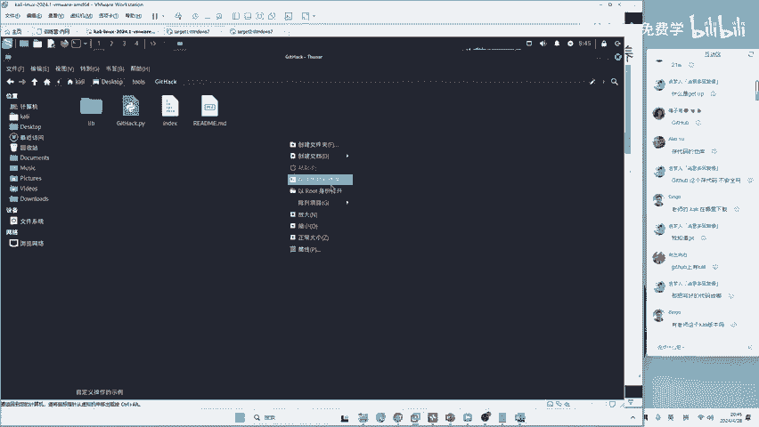

有同学讲，老师，我看利怎么不是中文啊，想要我的是吧？可以发，当然发了，这不发不发给你，我藏着掖着干啥？😊，做公开课不就是为了发轿车吗？现在来看好。在这个地方，我们要去运行get tank这个脚本。

输入pyython。get tank，然后再加上我们刚刚谁给你讲的啊？刚刚做信息收集，他告诉你的get这个目录。你给他复制过来，放到咱们这个脚本里面。啊，当然可以发了。😊，不发藏着掖着干啥呢？

那这些东西你要注意啊，在哪里可以发啊，在哪里发，就是在这个地方啊，我们每一天直播课程结束后会同步到此，你们不需要再问这个东西发不发了。我告诉你，今天所有的东西都会发。好，所有的东西都会发。

就没有必要藏着掖着呀。😊，你只要看到的啊看到的东西我全部都给大家，全部都发啊，不要再问了啊，这这种东西啊。😊，好，我们现在来跑一下，按下回车。你看这个电电脑花里胡哨的只需要等多长时间啊，只需要等2分钟。

我们整个后端的代码全部就被获取了下来。获取下来放到哪里了呢？它翻放到了一个啊叫做IP地址，或者是域名的文件夹。就这个工具啊，它可以从get模拟仓库中还原咱们的后端代码。那现在呢我们只需要进入到这个目录。

哎，就能够看到所有的后端代码了。看到代码之后能能干什么？同学们现在告诉我，如果在一个网站中，你获取到了网站的代码，就是服务器上面所有的代码都给你了。你获取这些代码之后能够干什么事情？😊，我想问一下大家。

就是获取。代码后，你想干什么？获取代码后，你想干什么？😊，有同学说把它抛起来。做代码审计。好，但是有一个同学答的。我觉得非常正确，就是bingo同学，他打的是web config。叫做网站配置。

它答的是非常正确的，其他同学答的方向对不对呢？也是对的。比如说代码审计，如果你能审出一个jo密拉的高危漏洞，也就是20万人民人民币左右。你可以再把它提交到漏洞平台上面。知道吧？

就如果你能通过代码审计挖出它的漏洞，非常的高。这个价格。啊，当然这个挖的比较难，为什么呢？因为你知道它有多贵，别人挖不挖360的人挖不挖，美国人挖不挖呀，那肯定挖呀。😊。

所以说你要跟全球数千万的安全工程师进行对抗，进行竞争啊，所以说你很难做到。但是最简单的就是我们找weable config。weable configurefi是什么意思？这一个同学讲的非常正确。

就是从源码中获取敏感配置信息。获取敏感配置信息。那现在这个配置信息在哪儿呢？我们来看这些文件啊，其实啊答案已经非常明明已经非常的明白了。

就是这位同学说的web config我们只需要找config就行了。config就是配置的意思啊啊，你看了半天说config在哪儿，config在哪。😊，没有找到吧。

confi的全称叫做configuration。你不要只会英语缩写呀，你要会全称。有同学讲，老师我英语不好，英语不好怎么办？😊，现在就一个单词，你3秒钟还能记不住他吗？你又不是鱼是吧？

你就知道这个单词不就行了，以后做渗透测试获取源代码，首先就是找康菲哥，你会问老师有没有网站，没有康菲哥呀？😊，没有。都有啊，所有的网站都有，只是他的卡fi格可能是简写，可能是缩写，可能是全写。

可能是PHP可能是pyyon，可能是叉ML。你不可能说你这个网站，你必须用PHP写，你怎么那么牛啊，你要求别人怎么写网站，而是别人写好了，你来攻击就行了。

现在咱们来看一下这一个configuration配置文件里面藏了什么东西啊，怎么看双击或者cat都行啊，cat都行啊。咱们直接看一下吧，cat configurationfiguration。😊。

看一大堆一大堆怎么办？慢慢的去找。慢慢的去找啊，现在这个同学说右边的这个玩意儿web configurefi点TST是什么？你可以去看一下。😊，你的这个观察力非常好。比如说在实际的工作中啊。

咱们现在看到了两个配置，看到两个配置怎么办呢？你都去看一看就行了啊。比如说我们先看这个web点config点TSD好不好呀？给你看一下啊，web点config点TSD。😊，这里面有啥。

咱们快速的浏览一下有没有密码。😮，有没有密码？来看一下这一行没有这一行没有这一行也没有啊，也没有结束，就说明什么，就说明这样一个web点confi点TSP啊，它没有用。😊，那我们接下来看什么？

接下来就来看这个叫做configuration点PHP。😊，这里面找密码找密码，我们瞬间啊我相信只要大家眼睛稍微尖一点，瞬间就能找到两个密码。😊，一个密码非常的明显，就在这写着呢。

叫什么password。😊。

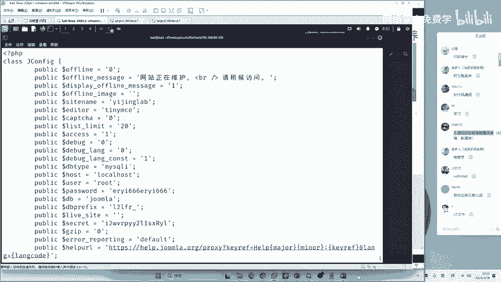

一个密码叫什么？叫secret。是不是两个密码？好，你现在就通过信息泄露找到了两个密码。这种攻击在实际渗透测试中是非常常见的，就是通过信息泄露找密码。找密码，你会吧，咱都会找呗，看谁的眼睛，你眼瞎的话。

你就不找。😊，哎，你留给别人了是吧？有的同学就是说文件我有，但是我就找不到啊，找不到，那没办法，那你怪谁呢？是吧？找不到你就多练，多玩连连看，总有一天会找到。那现在啊其实阻拦我们的并不是找密码。

而是干什么？😊。

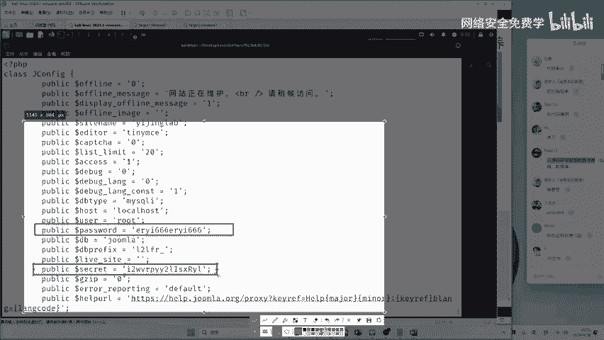

而是这个密码我怎么用？这是渗透测试最难的地方啊。就是讲。😊，就是讲啊我这个密码我怎么用secret secretecret是密钥的意思啊，是密钥的意思啊。😊，我们再来看啊，我们再来看一下同学们的问题。

web configurefi为什么会把明文密码名文写上去？因为呢这叫做开发硬编码，就只要开发它必须要这样写，它不写网站就运行不起来。😊，能理解了吧？所以说他要这样去做。然后我们再来看其他同学的问题啊。

大家有问题都可以提啊，都可以提secres是密码的意思啊，不知道原理是什么，没关系啊。😊，同学们不要学原理，为什么说不要学原理呢？你想一想我们这个网站是什么语言？同学们应该都知道吧。

世界上最好的语言PHP。😊，你现在你学PHP有必要吗？没有必要啊。你现在如果选了PHP以后，别人用java，用pyython，用golog，用ret。有同学说，没关系，我都会我都学都学。我告诉你学完。

你退休了。你不要做安全了，你退休了，六十了，65了是吧，退休了。啊，所以说呢你这个地方你是没有办法掌握完整完整的，你就是找关键的地方就行了。比如说你应该知道的是password。等于。他就是密码。

卡里的登录密码卡里的登录密码就是你输的卡里啊。😊，就你说的卡里。就是卡里的密码。可以防止吗？没有办法加密吗？我们先来看一下哈，这两个同学呃，一般情况下啊没有办法防止啊没有办法加密。😊，知道吧？为啥呢？

因为他想给你留饭吃啊，没房那么死。😊，如果就是说可以有办法防御的话，咱们可能漏洞攻击的路子又少了一条。咱们吃饭的。这个前提呢又难了一点呀，吃这个饭又苦了一点啊，所以说呢他留下这些东西啊，就是等着大家打。

😊，啊，robo TST为什么要隐藏他呀？😊，他本身就是给你公开的呀。robos点TSP本身就是给这样一个呃搜索引擎的爬虫讲的啊。用MD5加密是伪加密啊，它怎么加密，你获取到都是一样的呀。

你加密了就连不上去了呀，这个密码是正确的呀，它不能加密啊。😊，好，那有同学讲哈。😊，为什么他没有加密呢？我现在再重新给大家介绍一下。呃，先回答这个伟同学的问题啊。

这个同学的问题呢就是说从get上获取源代码没看懂。那到时候呢我把这个教程发给你，你再在课后仔细看一下好不好？如果你还是不懂的话，你在群里可以问我，我单独给你讲。😊，啊，现在的话你们就是一个代码的事啊。

😊，那有同学讲啊，为什么它不加密呢？啊，这个地方呢如果你听不懂我讲的，我可以给你讲一个公用的事实，就是周密拉哈，大家都可以要啊都可以要。这个周密拉呢是全球十大开源的网站建设脚本。😊。

就是说全球有10亿以上的网站都在使用救美拉。那你说周密达作为全球最牛逼的一个开发PHP开源网站了，他能不知道什么安全不安全吗？他肯定知道呀啊，他为什么。😊，不做加密。你说他笨。嗯，我觉得不是。

而是他没法做加密。没办法做加密，这个地地方就是必须是铭文。好，现在得到这个密码呀，得到这个secret，这个secret呢没有用，为啥没有用呢？你找不到用的地方，而这个密码有用，这个密码是什么呢？

我们按照它的前后文，你可以猜到它基本上是数据库密码。😊，现在得到了数据库密码之后。我们要登录谁呀？我们刚刚信息收集，是不是找到了三个网站首页。

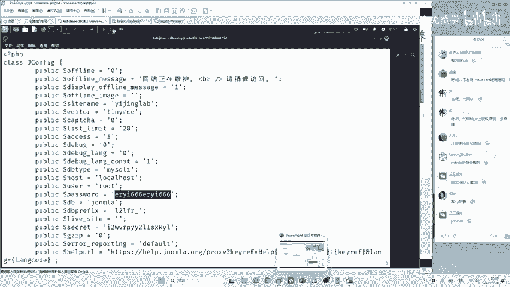

找到了三个网站，一个呢是首页。

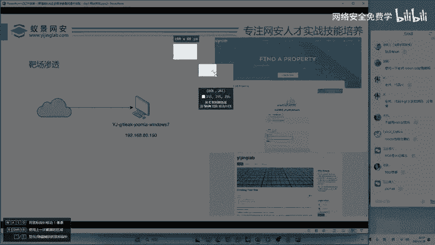

一个呢是数据库管理平台，一个呢是jo米拉博客系统。那我们现在找到的密码，你该登录哪一个呢？我相信答案是非常明显的。你找到的数据库密码当然是登录数据库管理平台了，不然你登录什么呢？😊。

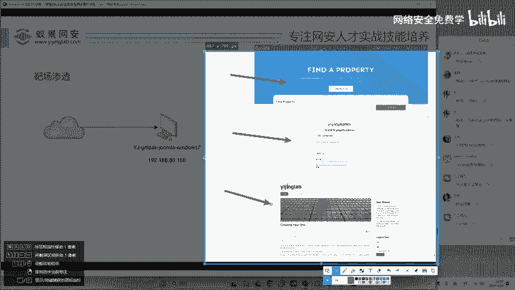

好，我们现在去登录一下数据库管理平台吧。这个密码呢叫2166621666这个东西啊，大家谁的字典都包包不出来。

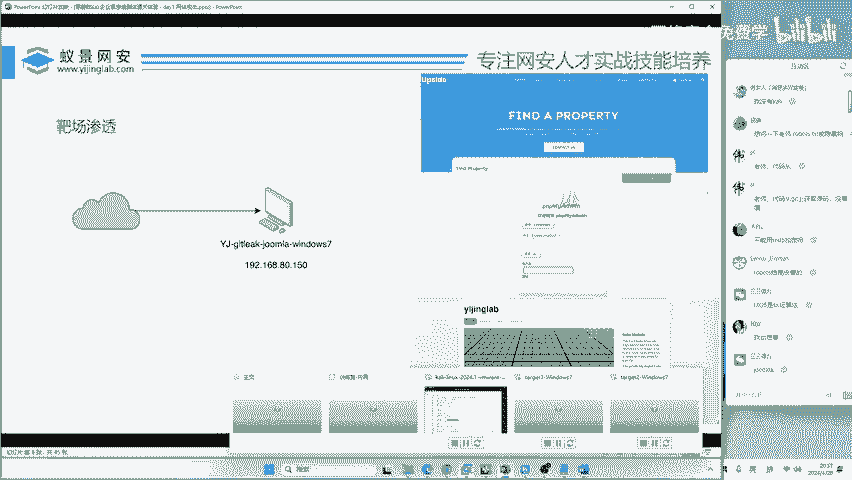

你的字典里面还能有这条命吗？我信都不信啊，肯定没有。😊，现在我们来登录一下吧，到这里输入用户名root密码，你知道2166621666执行登录进去。登录进去之后啊，现在我们就拿到了他的数据库权限。

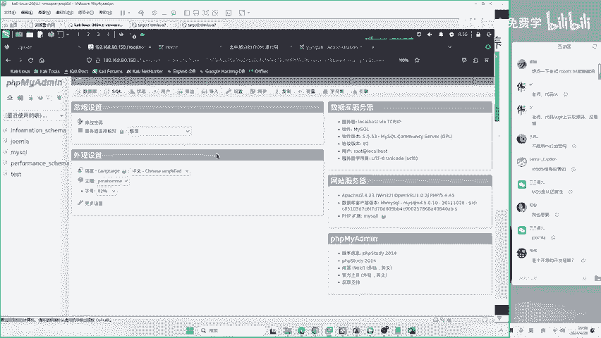

那拿到数据库权限有时。😊。