# 2024B站最值得看的黑客教程 ｜ 网络安全／渗透测试／内网渗透／漏洞挖掘／web安全／kali linux／红队靶场／CTF／信息安全 - P124：靶场渗透（2） - 网络安全免费学 - BV1uBsTetEow

怎么又呢？😮，好，我们来想象一下。那PHP玛丽的命呢，它存在两个利用条件。第一个利用条件呢就是它本身存在漏洞，我们可以植入网站后门。第二种利用方法呢就是啊我可以翻看它的数据库。

从中找出更加深入、更加敏感的信息。啊，有这几种方法都可以添加管理也行啊，添加管理也行。我们分别来看啊，我先给大家讲，第一个就是我要把这个winIN7打穿的方法。😊，很多同学呢可能学过搜cle输入。

但是通过数据库写web share，就是写网站的后门，你是否知道它的方法呢？我今天呢就教你一招。当然这一章呢在网上也能搜到。一会儿呢我们会拓展它给你讲啊，你接下来应该怎么做。好，我们先看好。

你如果不知道的话啊，有同学讲老师你讲的太快了。😊，那肯定啊，我讲的快是因为你基础不好呀，基础不好怎么办？😊。

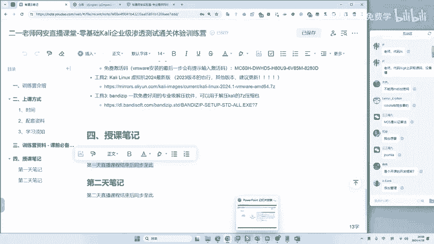

课后资料发给你，反复的去看，反复的去练，把场都给你，脚本全部给你。啊，一套啊一套全部给你看到东西都有啊，你就是不要有这种疑惑。现在我们来进行一个。木马的写入吧。好，点击搜狗。这个操作啊呃我说实话你。😊。

有账号的名称啊，你没看到吗？我给你看一下，在这儿user。😊，账号。就在它的上一行，大家就是说一定要提高这个敏感度啊，这个黑客一定要敏感要敏感。😊，有些同学看的非常准啊，如果看的不准怎么办？看的不准。

慢慢练啊，慢慢练。😊，这是就跟玩玩连连看也是练的呀，是吧？select啊。😊，这个语句啊，我的课后都发给你们发给你们select selectlect什么玩意儿呢？啊？PHP evil。😊。

到到下划线啊，post。然后呢，在里面啊咱们写一个东西啊，比如说我写个东西叫21。😊，这些东西要不要记啊不要记啊，你还是直接复制粘贴就完事儿了啊，然后into out fire。😊。

into out fire到哪到一个文件路径中。现在问题来了哈，就这个文件夹在哪儿，有同学就迷了，他说文件夹在哪儿，我能知道吗？你不知道没关系啊，你不知道你不会搜吗？啊，一句话木马，是的，就一句话木马。

咱们先搜一下这个文件在哪儿，好不好？😊，Select。😊，select什么呢？艾艾be DIR。😊，看我操作就行啊，看我操作就行，这些东西都会给大家。通过这个路径呢，你可以推导出它的网站路径在这里。😊。

啊，有同学讲，老师我推导不出来，推导不出来，我不是教你了吗？把ma蚁搜cle改成3W，就是它的路径，这些东西都是我总结出来的。你也不要问为啥，你就这样做就能打穿，不这样做就打不穿，很简单。😊，好。

现在你已经知道文件路径了，咱们再重新的select一下。😊，啊，给他搞啥呢？给他搞一个网站后门是吧？还网站后门，不然你怎么控制它呢？你光有数据库有啥用呢？😊，啊，这个语句不要记啊不要记。

我后面都给大家啊，都给大家，你直接复制粘贴就完事啊。😊，复粘贴就完事，不需要记的。好 into auto fire。然后呢，到你的这个路径中，哎，这个我发到互动区的这个路径。咱们粘贴往这儿一粘。

往这一粘之后，哎，把这个斜杠改成两个反斜杠，为啥要改马里苏克规定的哈？咱就这样规定的。就比如说英语语法就这样，所以说就要改。😊，咱们改啥呢？改一个叫21点PHP。😊，就是啥意思呢？

就是我要为他的网站植入一个新的PHP。但是呢这个PHP是一个木马文件，这个木马文件就叫做21点PHP。我只要执行一下它啊，点一下执行。就可以被。

最就可以在目标的服务器上面留下这样一个木马后门叫做21点PHP我们可以看一下。现在访问是空白的页面，就说明木马执行成功了。哎，现在同学们又晕透转向了，他说哎，为啥我房子这个页面是空白的呀？哎。

我一个木马啊，哎有必要整的这么花里胡哨吗？有同学知道啊，这个东西叫一句话，木马。😊，你整这么花里胡哨。呃，不是容易被别人发现吗？你现在不要整一些花里胡哨的东西吗？咱们就空白的页面，它就是木马了。

那这个木马怎么去用呢？来看我操作啊，有同学现在可能觉得哎讲的有点快，但是没关系，课后的资料给你反复的复习，反复的去看，这是整个的一个流程。😊，数据库有数据库防护墙怎么办？绕。绕啊，有防伪墙就绕。

绕不过去，绕不过去，不打找其他地方。现在呢就是大家经常有问题啊，就是说他有杀毒软件，有防火枪怎么办？很简单啊，就是绕技术好就绕技术不好，咱们就找其他方法就溜。😊，你们应该知道啊，这个二战时期。

德国去打法国的时候啊，不就是绕路吗？哎，有的时候我正面攻不过去，我就绕。😊，啊，我就绕你要是能供过去，你就供啊，你就绕啊，你就你就攻过去，你攻不过去，你就选其他路子嘛？😡，这很简单，因为正常的企业是吧？

正常的企业他管网站，我就给你们讲啊，随便找一个石油企业，反正中国也就这几个石油企业，他们的网站啊都是2万个以上。😊，2万个网站，你非得找最坚硬的地方供进去啊。那不是给自己自讨苦吃吗？

所以说要么就是你技术好的话，你可以去绕。😊，好，我们来看现在呢你访问的这个空白页面啊，它已经是木马了。那这个木马怎么去用呢？来看好，咱们工具又来了，这工具非常多呀。咱们今天用一个简单的叫C刀。😊。

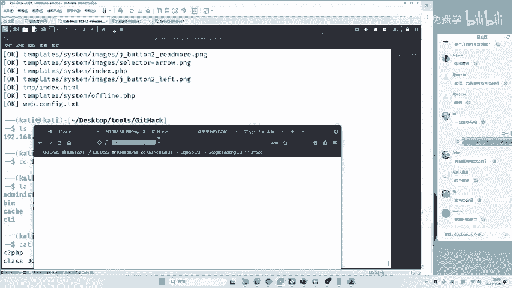

C刀这个工具啊，如果你用的是老师的卡力，里面自己有。如果你是自己的卡里，我在客户会发给大家，我不再重复了呀，所有东西都发，所有东西都发。😊。

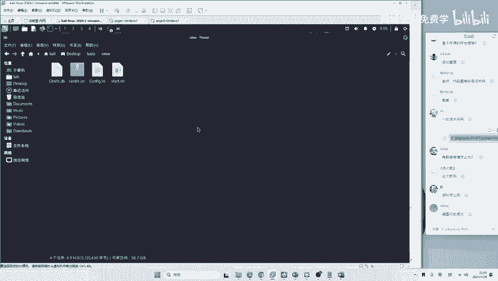

咱们打开之后，对菜刀的改版啊叫C刀，运行一下，开始star start就是开始启动的意思啊。运行一下，你看就出现了C刀，点击这里添加，把你刚刚的东西啊往这一加。😊。

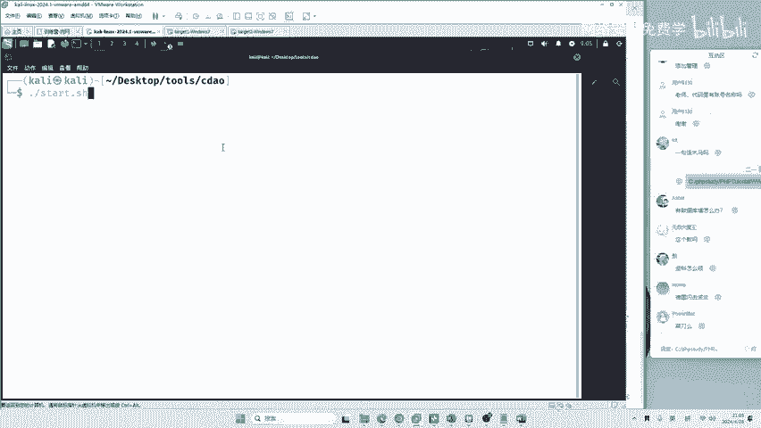

21点PHP密码是什么？密码这个框框啊要输21要输2一啊，点击一下添加双击一下来看好。😊，Get。目标又打穿了。对，和以前差不多。和以建是同类型的软件。为什么没有讲意见呢？因为C刀对新手赢好友好一些呀。

他们都是同类型的软件是吧？现在我们就直接的拿到了目标的权限。你可以看到可以进到他的CMD里面。😊，这WIN7啊很明显是win7啊，是吗？😊，你还疑惑啥呢？这很明显是win7啊。😊，你看。

只不过呢这个C刀它写的有问题啊，可能有些乱码，但这乱码不妨碍咱们看呀，是吧？这很明显是个win机嘛？administrator guest或者是说哎你不知道的话。

咱们可以看一下IEP地址REP configurefi。😊，地址是多少？80。150，咱们要打的机器是谁？要打的机器是谁呀？要打的机器就是80。150。😊。

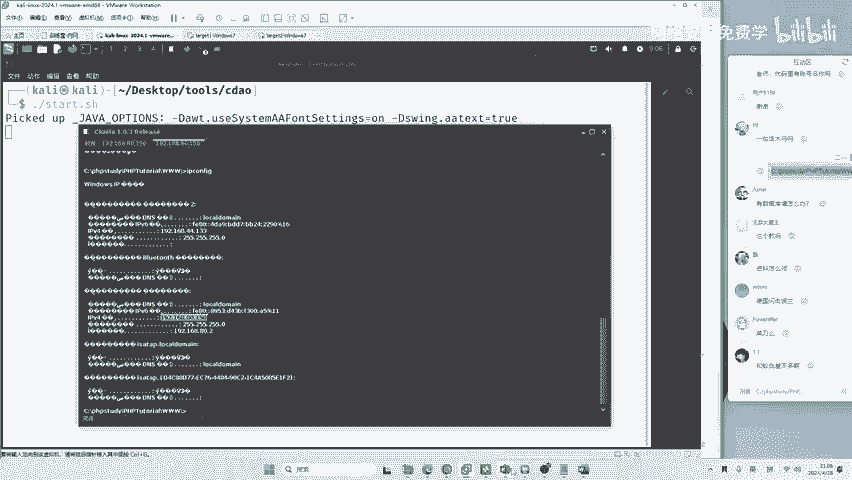

就是他。好，现在有同学讲要提全。你这里啊讲的是非常正确的。那这个提权应该怎么做呢？维维同学说，数据库打到系统了，好玩吧，有没有学到呀？😊，就是说利用啊。这个地方它采取的思路是什么？

同学们采取的思路是什么？我们来回顾一下课件，采取的思路啊就是漏洞攻击。😊，就是漏洞攻击。我通过数据库啊，这个地方耍了一些小花招，就进入到他的系统了。好不好玩，没听懂吧？没听懂课后资料发给你，好好的去看。

好好的去复线就完事了。你说听啊大家都知道，在高中的时候听物理课，听数学课，听完了要干什么，要做做题不做题可能听了就会听了就会天天咱们听课就考清华了是吧？那清华那么容易考吗？😊。

我们下面继续来看啊继续来看现在呢有啊有测试网址啊，有测试网址向左向右，他说以后不能用马蚁思ql了。😊，可惜，MSoracle post graceqL都可以去打和reies都可以去打。

都是有他们的利用方法的是吧？都可以利用方法的。现在呢我们已经控制了第一台电脑，但是同学们有没有注意啊？😊，我们的课程是什么？内网渗透的流程。那现在咱们留下一些问题，这些问题呢都会给大家解决。😊。

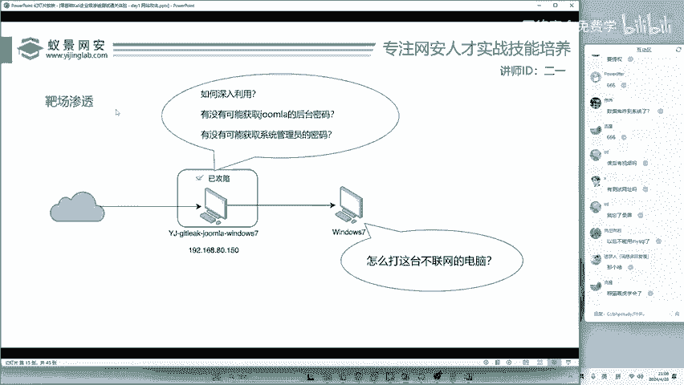

现在啊你已经成功按照老师的方法，把第一台机器攻献了，没问题啊。

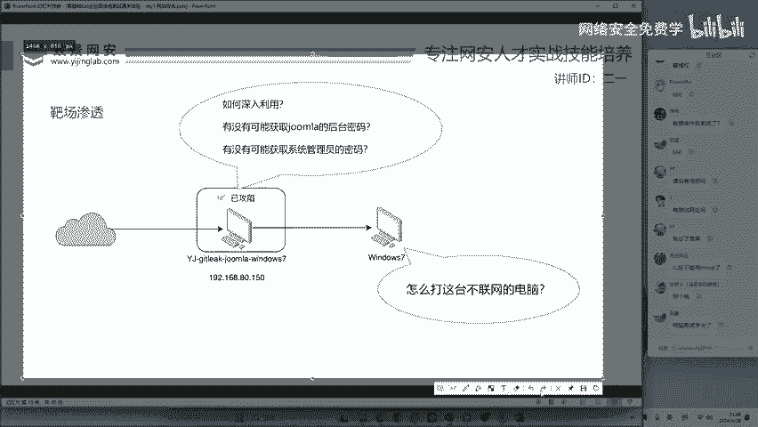

如果说你挖漏洞已经OK了，要你挖漏洞的话，到这里就OK了。但是说你想进360，想到前瞻性，想成大佬，那得继续看下去才行。我这里抛出三个问题。😊，第一个问题啊，这一台机器啊，我们只是啊打开了它的CMD。

但是如何去深入利用呢？刚刚有同学讲提权，你讲的很对啊，非常正确。😊。

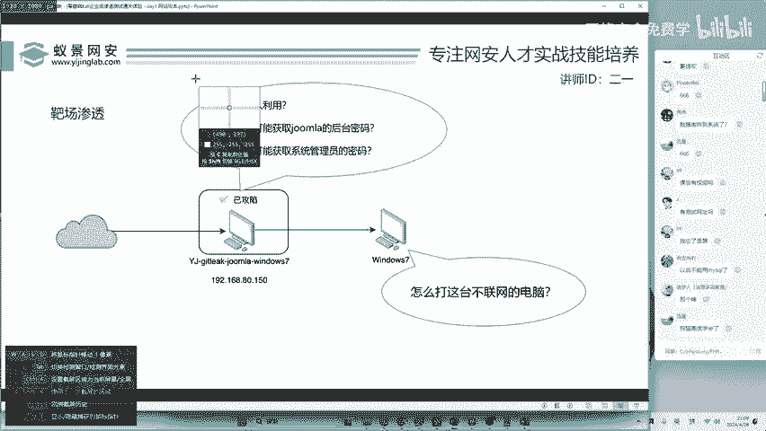

然后呢，我们其实少了一个东西，我们攻击的时候啊，我们攻击的时候攻击的是哪一台网站啊，哪一个网站，我们找到了三个网站。

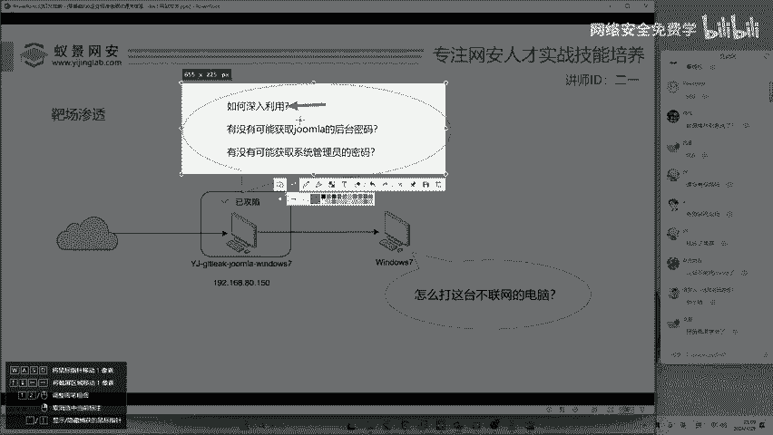

这三个网站呢是我们攻击的是谁？数据库管理平台是吧，是他的密码，我们拿到了。但是现在有个问题啊，现在有个问题来了。😊。

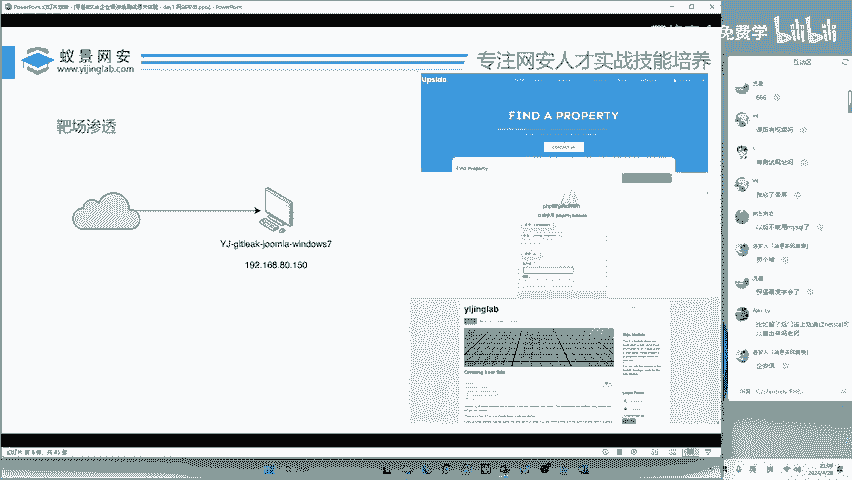

哎，周美拉的密码。怎么获取呢？

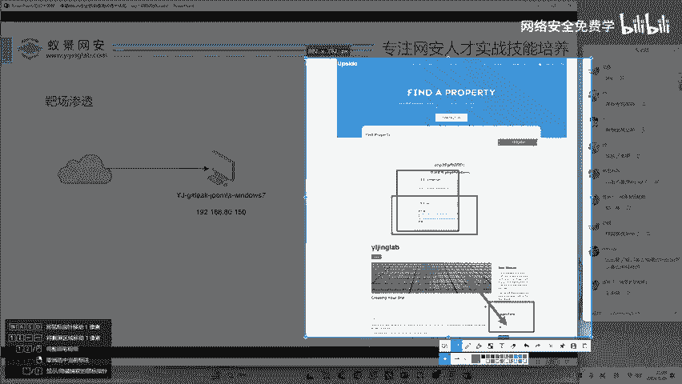

呃，这个问题值得大家思考呀，就是说我不想只停留在数据库。

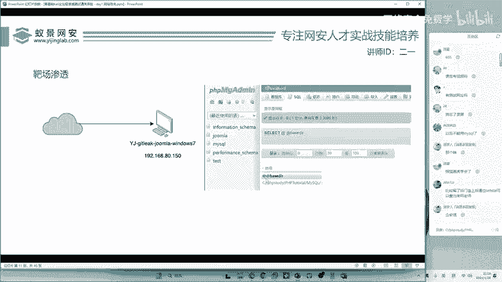

我想把他的娇妹拉也给他打掉，我怎么获取到娇妹拉的后台密码？同学们可以回答我。😊。

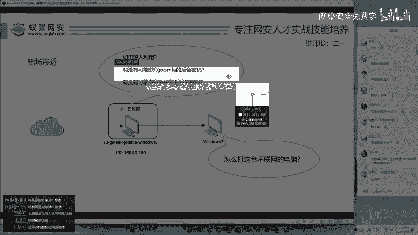

我们获取到的只是数据库的密码，没有获取他的博客的密码。

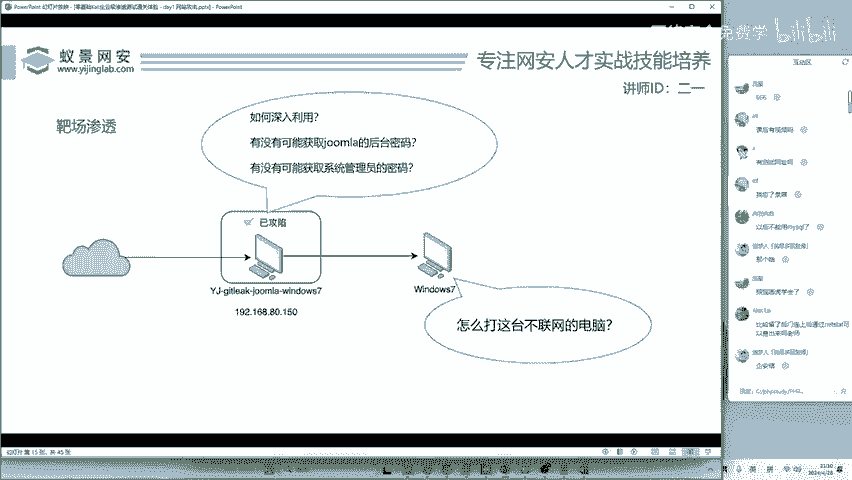

第三个问题。有没有可能直接获取到这个winIN7的系统管理员密码呢？我擒贼牵擒王，我直接把他系统的密码给他get到，这样的话，其他的东西不就迎刃而解了吗？😊。

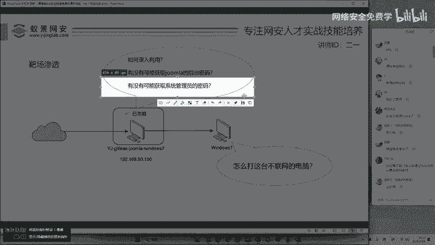

有值得大家思考。

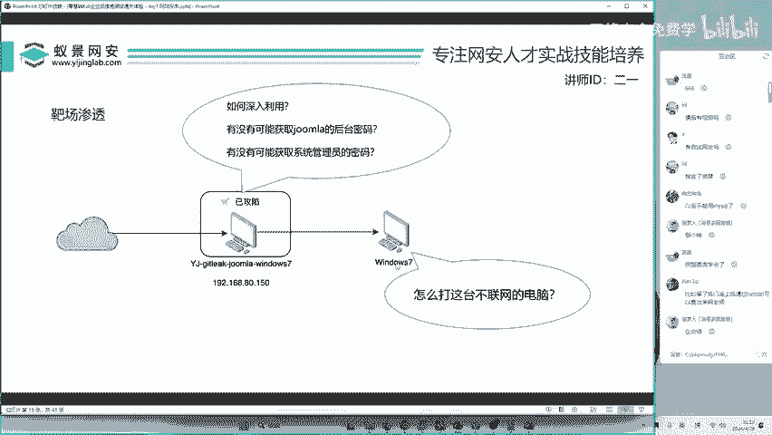

然后还有里面藏着的一台机器。这一台机器啊是第二台内网机器。这一台机器呢它是不联网的，什么叫做不联网呢？就是你访问不到它，它也访问不到你。😊，哎，谁都碰不到他非常安全啊。就比如说大家去银行去医院。

你会发现那些银行的业务员和医院的医生开药所用的电脑啊，他都是不能连接互联网的。就不能访问百度，不能访问腾讯视频，不联网吗？那有有些人觉得哎不联网就绝对的安全啊。其实呢在企业的内部并不是如此。😊。

那企业的内网安全呢是非常重要的啊非常重要的。😊。

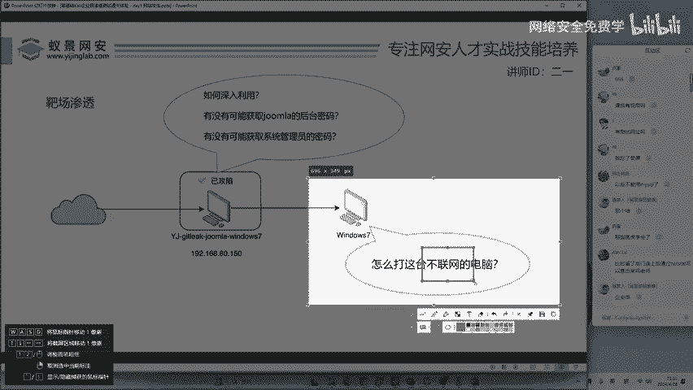