# 2024B站最值得看的黑客教程 ｜ 网络安全／渗透测试／内网渗透／漏洞挖掘／web安全／kali linux／红队靶场／CTF／信息安全 - P125：课程回顾 - 网络安全免费学 - BV1uBsTetEow

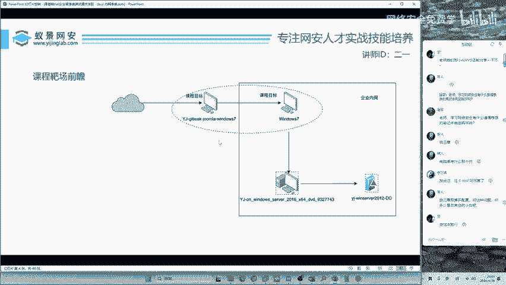

好，那我们先回顾一下昨天的课程。那昨天的课程呢，我们是给大家搭了两个把机。那这两个把机呢已经发给大家了。那这个把机呢当时我们通过一定的步骤去攻献了第一台windows电脑。

那这一台windows电脑呢其实攻击它是非常简单的。因为它使用到的漏洞呢也都是基础的漏洞。流程呢完全符合渗透测试的基本渗透测试思路。渗透测试的基本流程思路啊。首先呢就是确定目标。这个确定目标啊。

大家就不用担心了，以后工作中这个目标都是由甲方企业或者是你的项目经理直接给你的，你是不需要考虑我今天要打哪一个。😊。

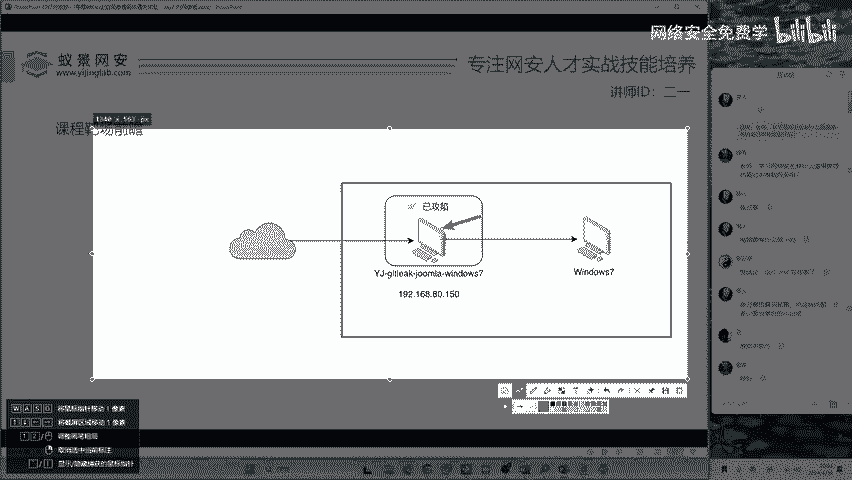

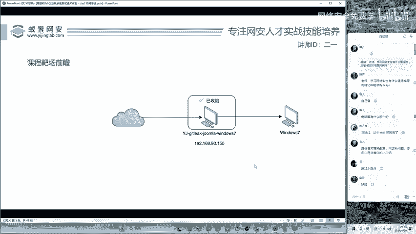

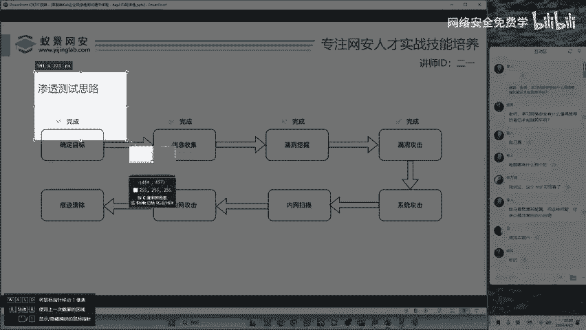

是吧就是你这个目标是可以直接确定的。第二个呢是信息收集。那昨天呢我们做了一件事情是什么？做了一件事情是做目录扫描和端口探测，而目录扫描和端口探测啊，只要你是想挖网站漏洞。这两个信息收集就必须要做。

你先别整一些高级的呀，你先把这些基础的做好。其实啊你的第一个能够奖金达到1000元人民币以上的漏洞就已经产生了。😊。

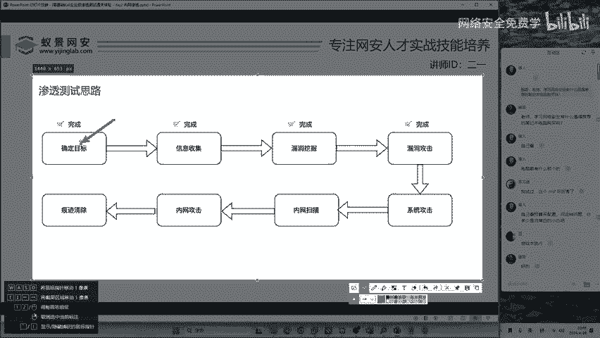

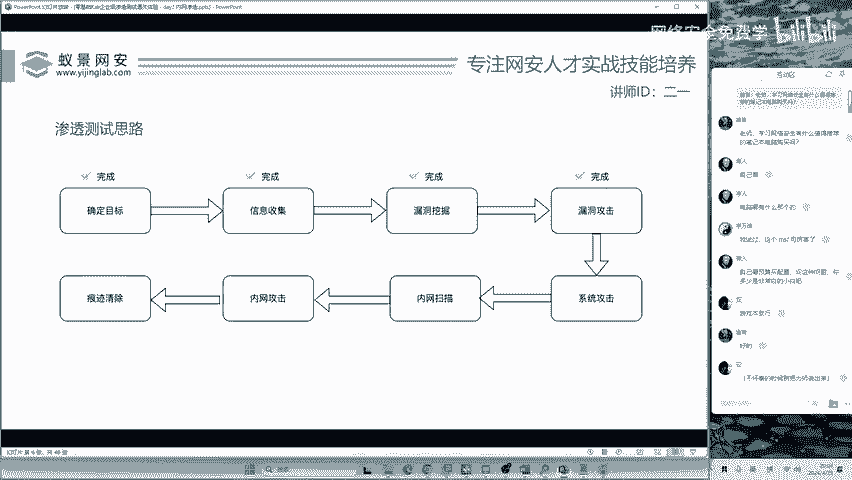

就是说你们不要觉得哎我第一个漏洞，我就要挖10万块钱的。我第一个漏洞，我就要挖2万块钱的，并不是啊。😡，第一个漏洞，你可以先挖500块钱的，挖1000块钱的，先整个简单的积累一下经验。

然后呢再做相应的拓展。好，我们做了这个线行收集之后呢，然后呢做了漏洞挖掘。这个漏洞挖掘咱们挖的是什么漏洞啊？😊，get泄露啊，get泄露呢，get都这个东西啊就版本控制系统基本上开发都在用。

如果这个开发不小心的在本地留下了get的一些初始化镜像。初始化仓库文件呢，我们就可以通过这一个初始化的仓库文件去还原它的服务器代码，也就是后端代码，那后端代码中就有非常多的敏感信息。

供我们去做下一步的漏洞攻击。这个漏洞攻击呢，我们采用的方法是从my circle的管理平台PHPmy命到控制目标系统。控制目标系统植入网站木马。植入网站木马。啊，控制目标系统。

OK这是我们第一节课的内容。第一节课你已经完成了渗透测试流程的前四步，但是仅完成前四步啊。我之前讲过，你想挖一个漏洞，或者是说呢你想呃去挖一些腾讯，甚至是阿里巴巴的漏洞啊，都没有问题。

但是说啊你想要去齐安信，想要去360啊，想要去周鸿毅的公司，光会前四步可不行啊，因为它不是一个完整的渗透测试流程，完整的渗透测试项目，互网的攻击队都是要进行内网攻击的。😊。

那内网攻击的第一步就是我们要进行系统级别的攻击。好，同学们来看一下我们的一个呃操作啊，我们的一个操作。

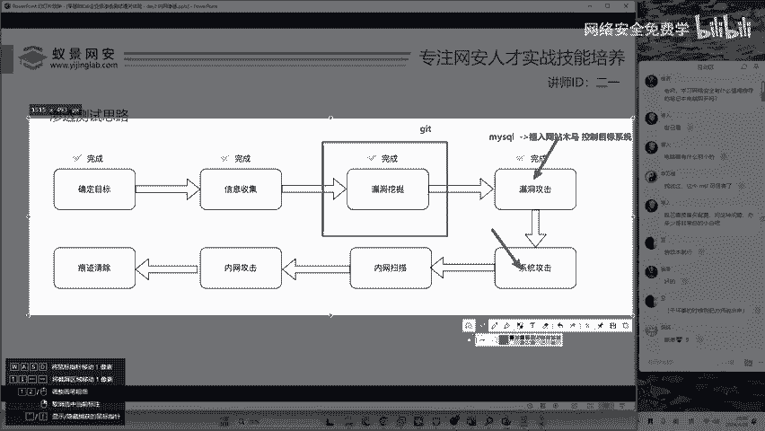

挖的漏洞，先看一下同学们的问题啊，咱们讲课可以不讲那么快，挖的漏洞找谁要钱，你挖谁的漏洞啊？挖腾讯的漏洞就是腾讯给你钱呀，挖阿里的漏洞就是阿里给你钱呀。😊。

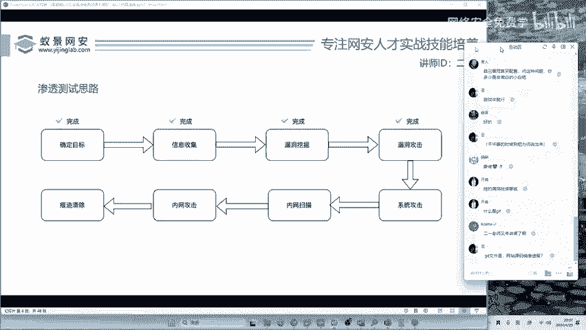

当然是你挖漏洞的甲方啊，就比如说开发做项目，做众包一样。就是赚外快呀，做兼职，你找谁做兼职，谁就给你钱。然后get文件是啊网站源码镜像遗留，你可以这样简单理解。啊，你的理解方向是基本正确的哈基本正确的。

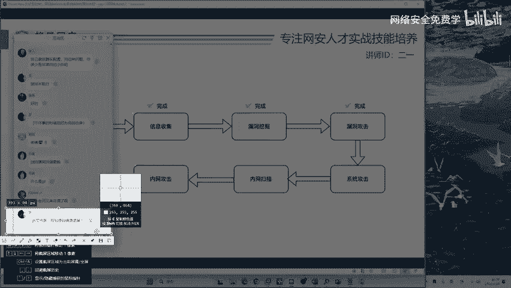

好的，我们先来看一下昨天课程的结束。在结束的时候呢，我给大家打开了一个软件，这个软件呢叫做C刀。😊。

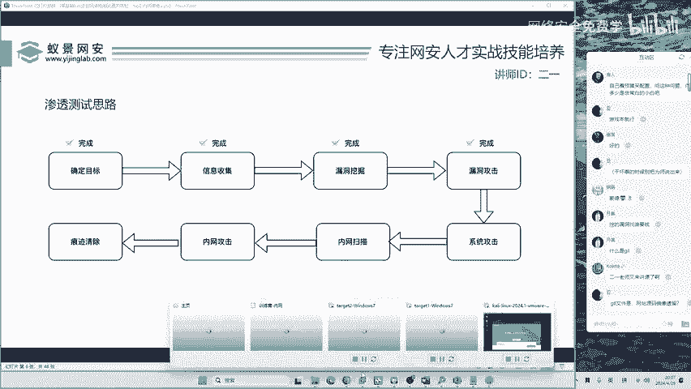

C刀呢C刀啊它在哪里呢？就是如果呢你下载的是2一老师的咖利，那你的操作跟我是完全一样的那如果呢你是使用自己的咖利，你可以下载这个工具。这个工具包里面啊，会有单独的这些工具文件，你可以拖到你的咖利里面。

或者是拖到你的乌班图里面去使用，都是完全一样的。好，现在我们来看在课程的最后呢，给大家打开了C刀，我们重新来打开一下。😊。

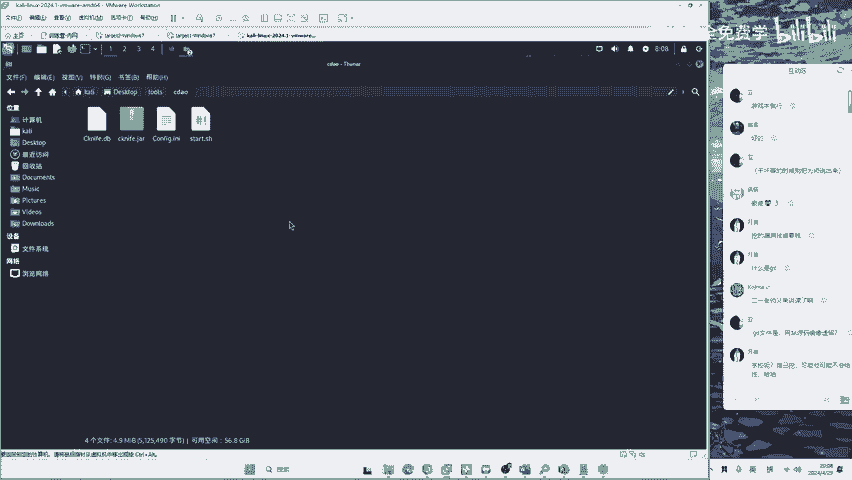

在这里啊打开终端，打开终端之后呢，运行start的SH。

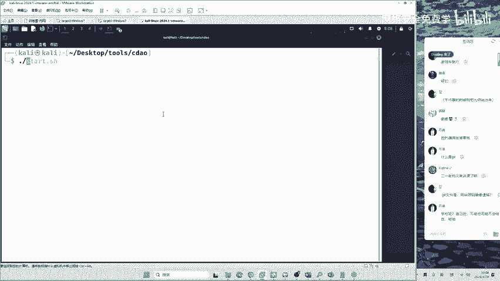

我们现在打开昨天晚上留下来的这样一个列表。可以看到能够正常的控制目标的网站系统。我们可以看到它的C盘、D盘，以及呢可以在这里点击模拟终端去执行简单的系统命令，都是没有任何问题的。

但是呢我们在昨天给大家留下了一些悬念，这些悬念是什么呢？我希望大家呢有自己的思考。因为不论你的技术有多牛逼，黑客他所需要的就是你善变的思维。😊。

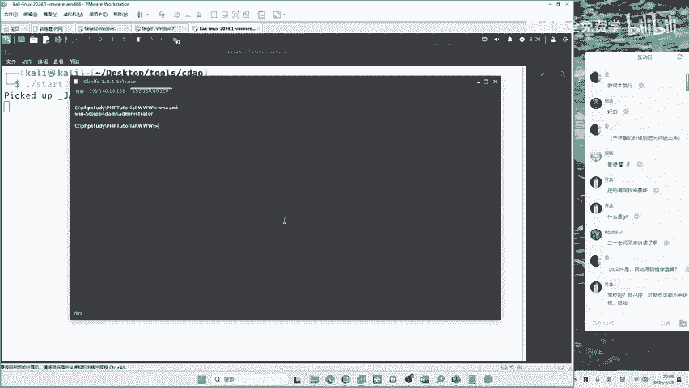

如果你的思维不活跃，不可能每一个网站它的漏洞都是一样的吧。不可能每一个网站都存在搜Q注入漏洞。所以说。你要有这种活跃的思维，而这种思维呢是需要进行进行什么呢？进行一个培养的。

我们先来看一下同学们的问题啊，学校自己挖不可能给钱啊。对，学校是不给钱的，还有可能抓你啊，这要注意一下啊。😊。

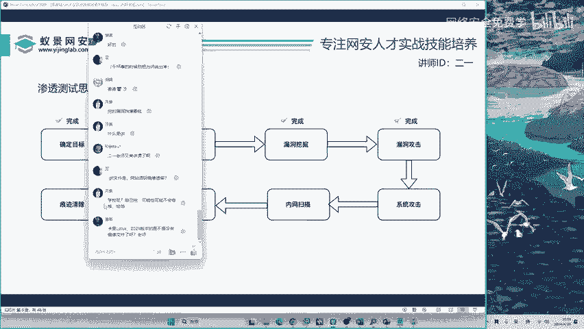

就是你不要挖学校啊，挖学校的话没有钱，你可以挖EDUSRRC，但是也是没钱的呀，也没钱的。😊，卡里2024版本是不是没有镜像文件有，但是镜像文件你需要安装，我给大家的工具呢都是不需要安装的呀。

我们没有必要在安装上面去浪费时间。因为你那个卡里的话，安装可能需要五六分钟的时间。但是你用我的呢，其实就是两分钟就行了啊，就解压一下就行了。

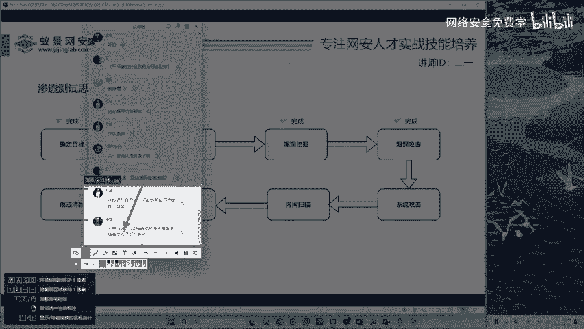

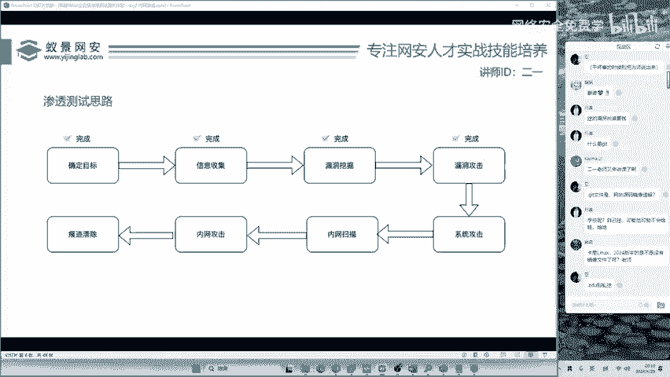