# 2024B站最值得看的黑客教程 ｜ 网络安全／渗透测试／内网渗透／漏洞挖掘／web安全／kali linux／红队靶场／CTF／信息安全 - P126：靶场渗透-深入攻击 - 网络安全免费学 - BV1uBsTetEow

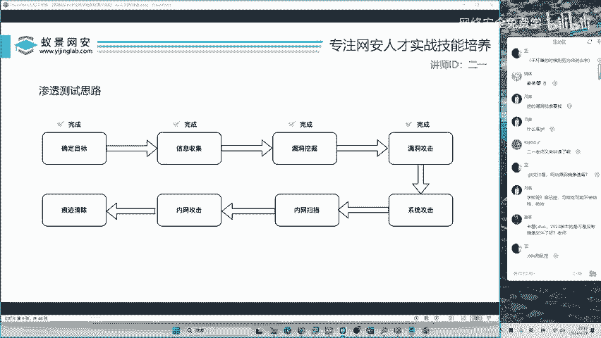

好，我们来继续来看呢，昨天给大家留下了什么悬念。😊，这个悬念悬念是什么？这个悬念第一个，我们通过第一节课给大家讲解的一个漏洞啊，叫做get泄露。get泄露。有同学说没听说过没听说过，你要记住它呀。

你不要只会搜库注入，你上一个月搜学搜库注入，这个月还需要搜库注入吗？那一辈子都学搜库注入，那你不就是在绕圈子吗？你要去勇敢的跳出来，你要去学习新的漏洞。get泄露，咱们获取到的是谁。

获取到的是数据库的密码，数据库的密码。而数据库的密码呢，我们现在留了第一个悬念，就是我们怎样获取这一个博客平台的后台密码，这个博客平台的后台密码呢是非常简单的，但是呢我们一定要有思路。

有了思路之后操作谁都会给一个小学生他都会操作啊，怎么获取他的后台密码。😊。

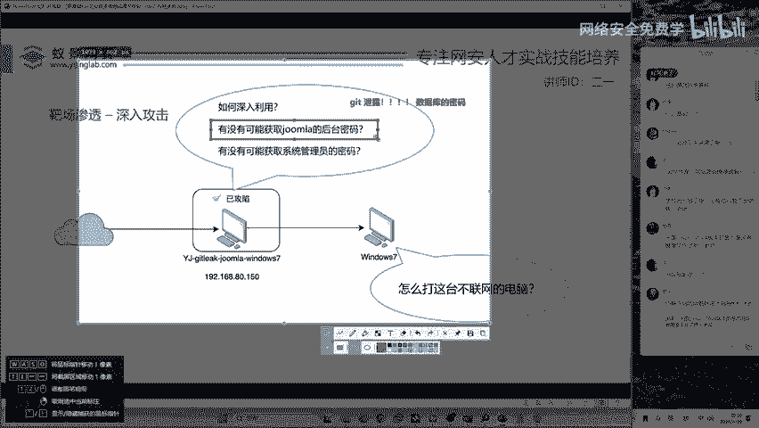

我听昨天呢呃同学们在互动区给出来一个道理，给出来一个方法就是说什么呢？从数据库里面看不就行了吗？不是从数据库里面看不就行了吗？啊，所以说呢我们第一步先实现昨天同学们提出的一个方案。

我既然都有了数据库的密码，我就不能从数据库中将其他人的密码去读取出来吗？😊。

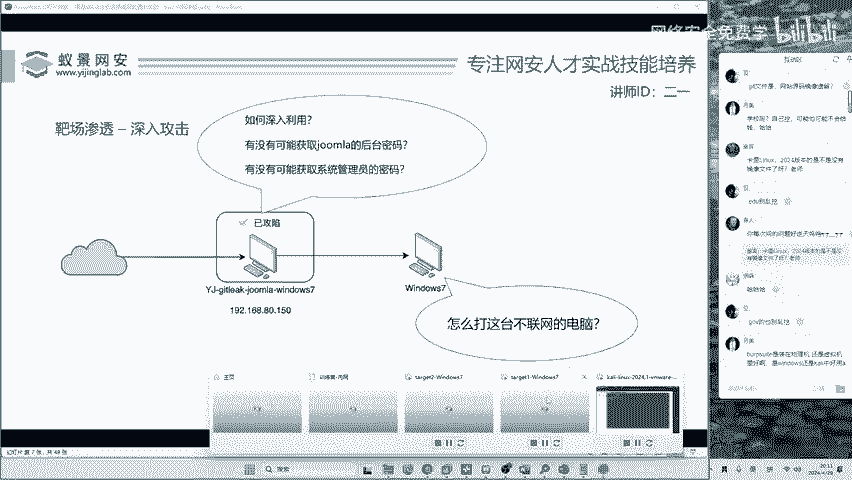

试一试就行是吧？实践是检验真理的唯一标准。我们来看一下，昨天获取的密码是2166621666啊，登录进去。😊，输错了啊，重新输一遍。现在呢我们已经登录到了这样一个马蚁瑟克。登录到马蚁瑟库之后呢。

因为我们要获取周密拉这样一个博客系统的。

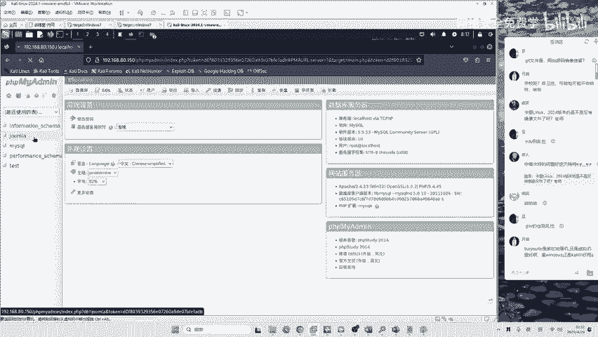

密码我们要获取这个博客系统的密码。所以说我们要进入到jo密拉对应的数据库，进入到数据库之后找什么呢？我们要找用户，因为你要获取谁，你要获取用户密码。用户的英语叫做user。所以说呢我们要点开users。

点开users之后呢，你就可以看到一个叫做user name，也就是用户名为addmin。addmin的意思呢是。管理员管理员是吧，然后呢，他的密码是不是写到了这里？好，现在我们问题解决了。

你获取到了周美拉博客系统的后台密码。真的是这样吗？其实啊并不是我在第一节课给大家讲过，周密拉这一个开源的博客平台，世界上至少有10亿个网站都在使用。既然周妹俩作为世界前十的开源博客平台。

它对于安全的措施做的肯定非常好。所以说这里的密码一定是严格的加密，你是没有办法破解的。😊，就是这个密码呢，它加密了。他不是MD5呀。他不是MD5加密。你一看就知道它不是MD5啊，MD5现在基本上没人用。

MD5的它是32位的哈希加密啊。现在如果你在写网站加密的话，用的一般都是比较高级的加密算法，要比MD5的哈希运算要高级一些。那现在呢我们第一个路子拦来死懒死了是吧？我们第一个路子走不通，我就告诉大家。

😊，实践是检验真理的唯一标准。如果啊这一个密码你无法解密。啊，如果这样一个密码你无法解密，应该怎么办呢？我们现在路子被拦死了，但是我一会儿呢带领大家找到另外一条道路。就跟同学们经常问老师。

他说防火墙应该怎么绕？防火墙绕，首先呢要看你技术牛不牛逼。如果你的技术非常牛，你就去刚防火墙。你就去刚防火墙。如果你的技术不牛逼，你就走，你就去找其他的入口。一个正常的大型企业，比如说大型的国企。

它的网站高达2万个以上，你非得找最难打的网站去打是吧？就非要就非非得杠啊，非要找最难打的网站去打。😊，可以，但是前提你的技术要能够撑得住才行。这个同学说呢，这个MD5除了碰撞之外，还有其他的办法吗？

其实MD5啊不是碰撞，而是彩虹表的这种解密。它要比碰撞呢更加的高级一些。MD5是不可能逆运算回来的。如果能够逆运算，你就不是网络安全的问题了，就是触发了世界级的数学危机，所以说呢它是不会逆向回来的。

你可以去学一下数学。在数学的角度，他是没有办法直接逆运算回来的。好，下面我们来看一下啊，既然这个路子已经拦死了，我们现在呢先做第一步。第一步呢就是如何深入利用。😊。

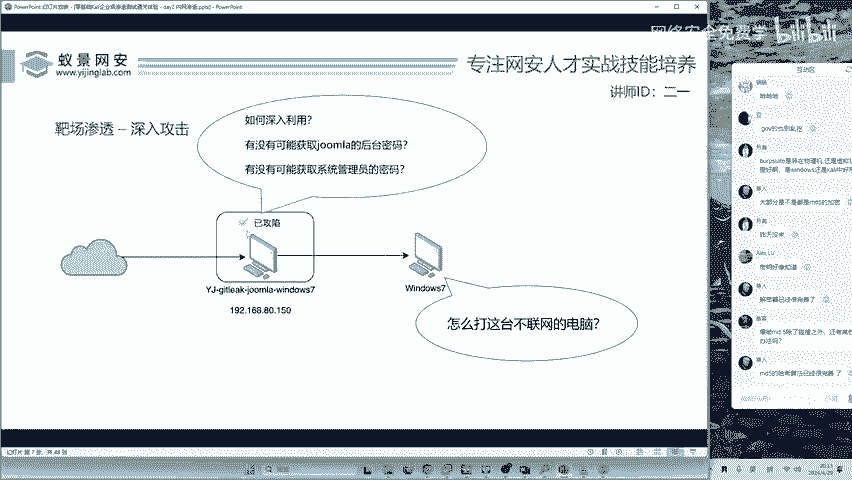

如何深入利用？这个深入利用的话，我们是利用谁。就是利用啊他的一个系统级别的漏洞。或者是呢我们对他的系统去植入系统级别的木马。我们今天呢选择第二种方法就是植入木马，因为植入木马的话比较简单啊。

对于大家来讲比较容易接受。😊，现在我们打开一个新的终端，打开终端之后呢，我建议啊就大家你不要直接点击这里打开终端。😊，好，不要点击这里打开终端。为啥呢？就是有一些同学呢，他linux基础不好。

然后他可能呢就是以后啊自己生成的木马都不知道放到哪儿了，这就会导致啊你在寻找路径的时候浪费了大量的时间。但是这里呢对于网络安全后续的发展是没有任何影响的。即使不会linux，你也能做网安啊。

也会也能做网安啊。😊。

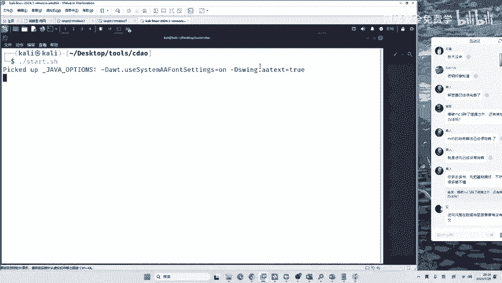

现在我们来看一下。好，那怎么去生成木马呢？我们要到卡利的桌面上右键点击在这里打开终端。

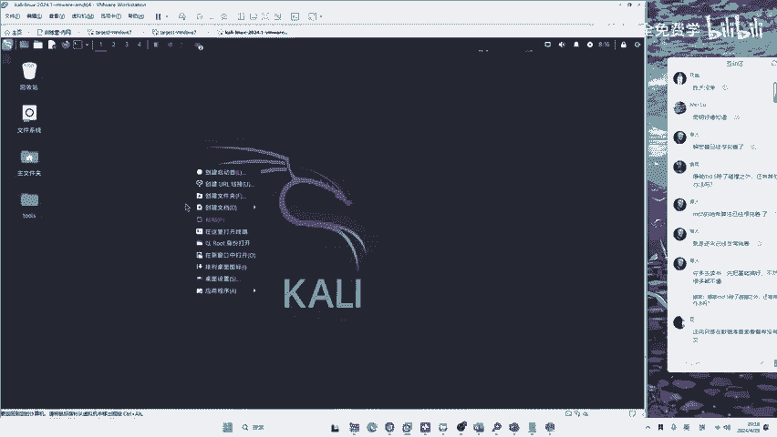

这时候你打开终端之后，生成的病毒木马文件都会在桌面上有显示桌面的英语叫做desktop啊，desktop。好，现在呢我们来看一下怎么去生成一个木马。想生成木马的话。我们首先要看一下自己的卡里IP地址。

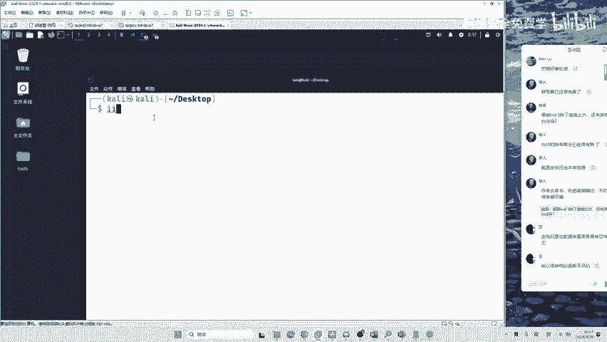

在实际工作中。你的IP地址肯定要知道，现在呢同学们问题来了，这么多的IEP啊，为什么刊利中会有这么多的IEP呢？就是因为服务多。😊，没有人告诉你呃，说一个电脑只能有1个IP地址吧。

也没有人说告诉你一个电脑只能有一个网卡吧，这些都是你的猜想。正常的电脑它绝对不止只有1个IP地址，而是至少会有两个以上。那我们要找哪一个呢？啊，大家要记住一个英语名词叫ATH。

ATH的中文意思呢叫做以太网。什么叫以太网呢？就是你上网。你打开百度，打开局域网，打开腾讯视频，都是通过以太网来去连接的。其他的IP地址呢并不是供你上网去用的。所以说呢你要看的地址只有ATH系列的地址。

那我这里ETH的地址呢是192。168。80。149，你是什么就是什么，你肯定跟我不一样啊，因为你又不在我家里，你的地址肯定跟我有差异，你要自己去看。这个地址在得到之后呢。

现在咱们就可以使用一条命令去生成系统级别的木马病毒。这条命令呢非常简单啊，大家任何人都不要记。我可以给你解释一下，你就懂了。这条命令。它是啥意思呢？好。

首先就是调用卡里中自带的一个工具叫做MSF venom。它的作用就是生成系统级别的后门木马。然后这里的P呢是指定攻击载核，也就是攻击中所使用的核心文件。

我们使用的核心文件呢是reverse tCP这个东西呢是固定的，你只要生成windows的后门木马，就这样写就行了。你生成是这个样子，我生成还是这个样子，你就没有必要去记，你今天记了，明天就忘。

然后呢使用airho去指定自己卡里的IEP地址。这里的IP地址你是啥就是啥，你不要指定我的，你又不在我家里面，你又不没有控制我的电脑啊。所以说呢你看到的你的IP地址是多少？你就在这里设置上就行了。

然后下面是airport。airport的意思呢叫端口，这里的端口呢，你可以随便设置一个，但是要注意它的范围。计算机中规定我们的范围是从1到65535，其他的都不行啊。

就是说你必须你的端口号要小于65535。如果比它大，那计算机呢就识别不了。下面一个呢叫格式。windows能够双击运行的格式呢是EXE格式。所以说呢咱们生成的格式就是EXE。下面呢是输出的文件啊。

咱们叫它叫什么都行啊。比如说呢我这里为了方便大家记忆，就叫做6666点EX1。在切好命令之后，按下回车。好，我们来看一下啊，晚安小学生昨天是150啊，今天也是150啊。今天也是150啊。你看咱们的靶场。

还是150啊。这里的80。150啊，它是靶场的地址啊，我的卡里的地址一直是149。这个这个同学啊，我的卡里的地址一直都是149，咱们靶场是150啊，靶场是150。这个听一下可以。对我告诉大家。

这种木马所有的杀毒软件都会杀，想不想绕360。如果你想绕360的话啊，明天给大家开小灶，你可以来看啊，什么是靶场靶场的意思，就是靶场，你打靶玩个游戏吗？打靶是吧，就是这个意思啊，就是假的东西。

训练的东西。😊，当兵射击的靶场。这个没有办法再解释了啊没有办法再解释了。然后这个悠言同学说显示版本过低是什么意思？😊，MSF啊生成的安卓后门新手机是用不了的。现在有两个方法，第一个自己开发。

第二个换老版本的手机啊，换老版本的老版本的手机。那为啥呢？因为MSF venom它这个工具是免费的，别人不想让你白嫖，所以说呢就没有给新手机做适配。你必须要自己学会开发才行。

或者是你用其他的RAAT的一些工具。好，我们来继续来看啊，我们继续来看。那在这个位置啊。😊，在这个位置。我们先来看一下。我们已经生成了一个系统级别的后门木马。

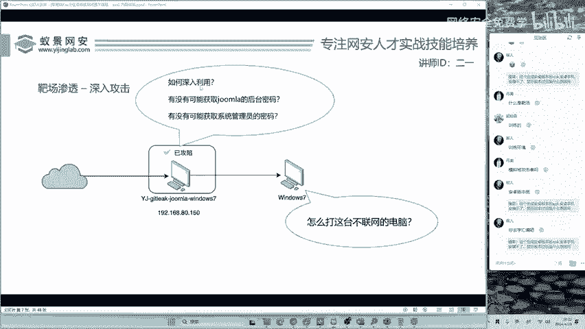

叫做6666点EX1。

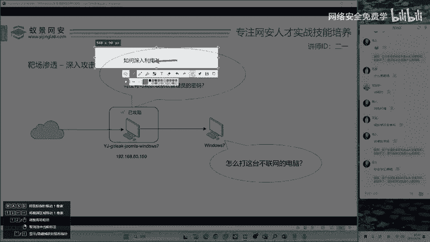

那这1个EXE文件它会放到哪里呢？会放到咱们的桌面上。那现在。这一个后门放到桌面上有用吗？没有用，我们需要干什么？我们需要把它放到靶机里面，就是放到咱们已经攻献的目标里面。

我要把它放到这个winI7里面呀。那我放到我咖利里面干啥？所以说呢我们要做一个步骤，就是把6666。EX1传到咱们的目标机器中。

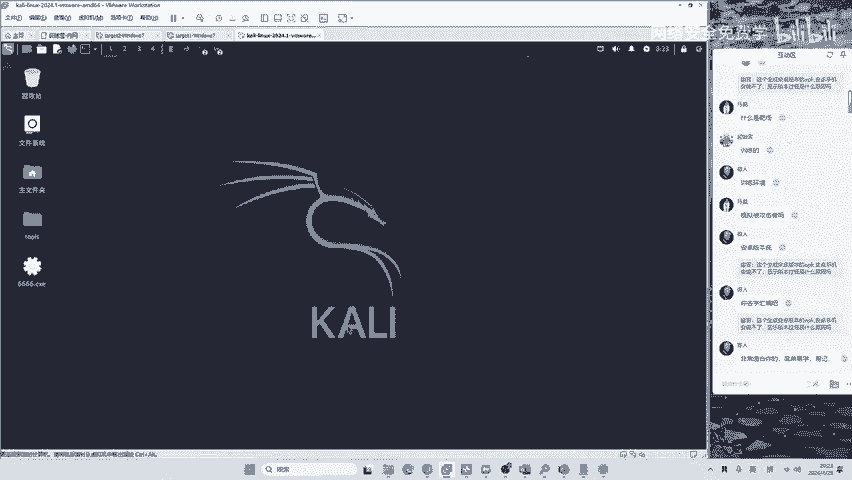

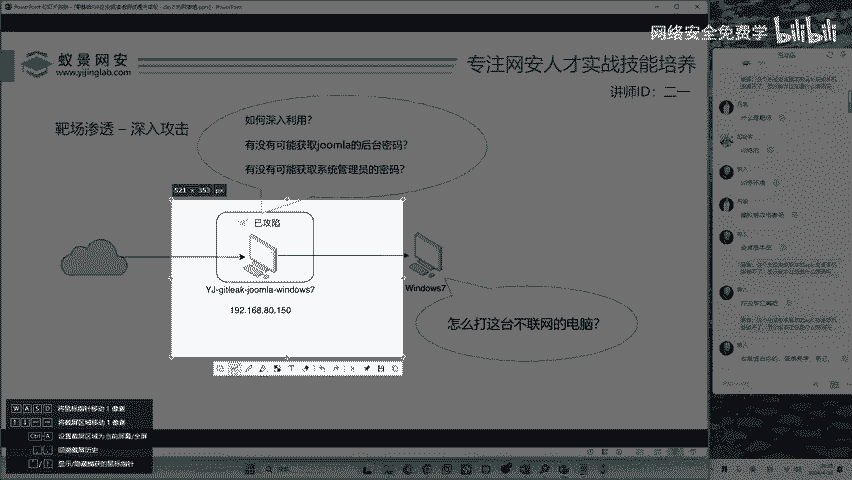

怎么去传呢？还记得咱们在第一节课中打开的C刀吗？在C刀里面呢就可以直接的点击右键，点击上传。我们找到桌面上面的。6666点EXE点击上传。直接就可以跑到咱们目标的机器上面。现在这一个后门木马。已经。

传入到了目标的机器中。传入到目标进器中之后，我们要干什么？我们要干什么？我们要进行。运行后门木马。好，怎么运行？同学们要看好我的操作。首先呢咱们打开在桌面上刚刚生成后门木马的这个地方。😊。

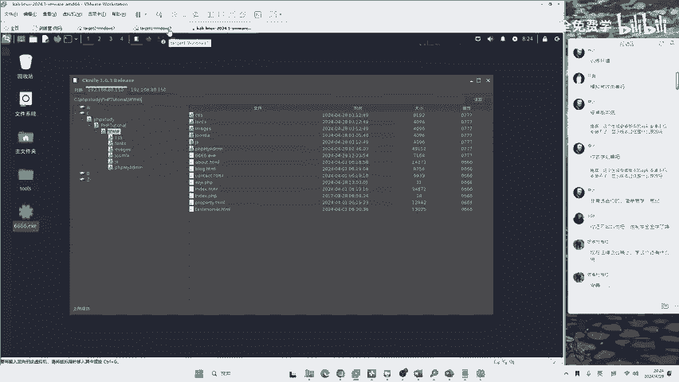

输入命令速度MSF康送。好，速度MSF抗诉。输入卡y的密码KILI。现在我们就可以打开一个非常著名的黑客工具，叫做metapo。大家可以看一下命令。😊，我们来回答一下同学们的问题啊。学这个有什么用啊？

我们学这个是做渗透测试，工程师是合法合规的啊。法律呢是限制你不要犯罪啊，不要违法。所以说呢咱们这个课程都是合法合规的，我们的工作呢也是合法的。我们的工作也是合法的。好，现在呢我们来打开了MSF抗诉。

有同学说，老师，我不会不会啊，你就跟工作拜拜吧。😊，你不会就学啊，不会就照着敲这些东西，我在课后全部都会发给大家。今天的课件都会发给大家。你不会，你就照着敲，不会，我告诉你，你就要学。如果你今天不会。

今天玩搜Q输入，明天还会玩搜Q输入。那你就是网络安全小白，不会就学。你不要说听不懂，听不懂就学就完事了。好，现在咱们进入到了mateaxport中。进入到里面之后。进入到里面之后呢，我们要输入一条命令。

这条命令是啥？我告诉你，你不要去记书读百遍奇义自线。如果你能记的话，你英语六级考过了吗？如果你没有考过，就说明你不要记你记忆力可能啊还在练习中。你就不需要挤啊，我敲啥你就敲啥，你记不住，我后面全部给你。

你照着敲就行了。你玩金山打字王，你能不会玩吗？😡，好，现在咱们加上这样一个杠P，加上杠H杠H正个是啥呢？就是我们的IP地址。刚刚你写的IP地址是什么？刚刚写的IP地址是192。168。80。149。

你写这个地址，咱们现在给它复制过来粘贴过来啊，复制粘贴都会吧。😊，现在我们来运继续运行。港屁。好，大家稍等一下。好，杠P杠P这里写什么呢？😊，这伟伟同学讲的很对啊，昨天就通过数据库密码怎么砸工献来啊？

😊，咋贡献的课件不是给你了吗？😊，课件给你了呀，你下载就看到了呀。😊，怎么攻线把机的是吧？如果你没有听昨天的没关系啊，咱们把场课件都给你了，你打开看就行了啊，就这样攻线的。😊，直接get share。

对，通过数据库密码直接get share就是这样贡献的。😊，没有什么特别的，它是一个非常简单的攻击方法。你现在还能用得到吗？就是我讲的就是昨天讲的这种通过数据库直接get share的方法。

现在还能用得到吗？用不到啊，因为它太简单了。😊，你如果不会，你要把它学会。啊要压力要给到你啊，压力要给到你。现在这个P呢就是P，就是port，就是端口。咱们要写什么？要写6666。

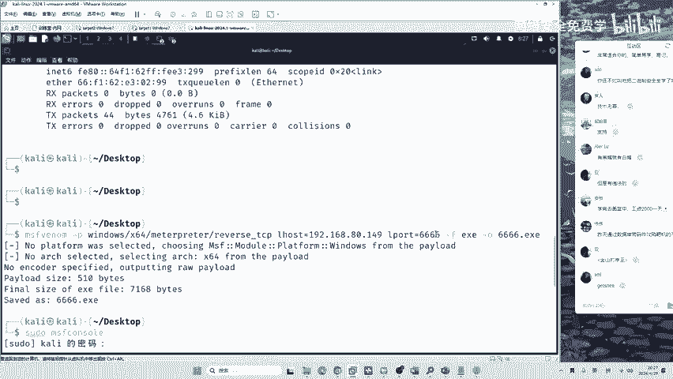

就是你刚刚设置的多端口是多少，咱就写多少，按下回车。按下回车之后呢，现在回到咱们的C刀里面，回到C道里面，你是不是上传了6666。EX1到目标的机器呀，你怎么把它运行起来？有同学说，老师。

我登录到别人的电脑上面，然后运行。😊，这可不行啊。这不行的话，是因为什么呢？因为你登录的话，别人会发现。所以说呢你不能登录到别人的电脑上面去运行。你看一下同学们说太简单了，都不会，为什么不会？

就是因为你没学嘛。😊，不会就学，就只有这一个条件啊，大家如果不会的话啊，就是一直不会，那就没办法了。那这个网络安全就不太适合。如果你不会的话，你敢于去学月薪过万的工资非常好找。如果你不学，呃。

你天天就是说老师啊，我的不想学，我不想看，我不想不想玩这个东西，我想是吧？我只想坐享其成，月薪过万。😊，那我告诉你，咱们国内啊月薪过万的工资肯定对你的能力是要要求的。这个在任何行业都是这样。

你就是装修房子，你想月休过月薪过万，你也要干什么，也要技术比较好呀。现在我们怎么运行它看好了。右键点击模拟终端，你不要在这里双击运行啊，为什么它不能双击运行呢？就是因为C刀没有开发这个功能。

C刀没有开发双击运行的功能。如果你觉得它不好用，就去开发一个新的。好，现在我们右键点击模拟终端，在模拟终端里面，我们输入start，就是开始开启开启什么呢？

开启你刚刚上传的6666点EXE按下会车来看好。

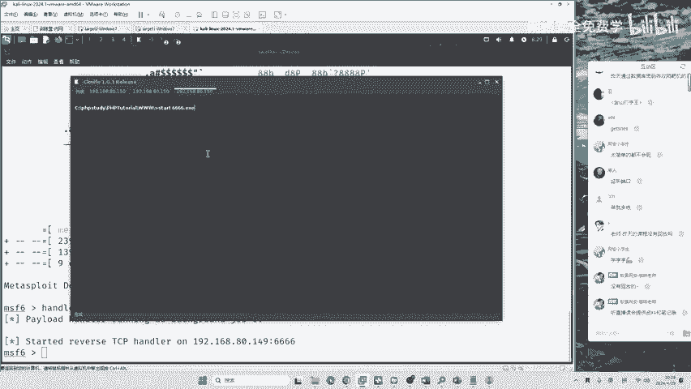

这边直接就控制他的电脑了。就控制他的电脑了。你看这里它有一个英语啊，有同学说老师我看不懂英语，看不懂英语怎么办？看不懂就学呗。就学呗。那有同学啊他经常问老师，老师能不能挖国外的漏洞。

当然可以国外的漏洞啊，发美金1比7的比例非常的香。但是你前提啊你是不是得学呀？你不学的话，那怎么玩呢？是吧？你不学的话怎么玩呢？对漏洞直接蹦出来，美国的漏洞直接给你。😊。

你觉得那之前0几年中美黑客大战的时候，那些顶级的黑客，他们技术不不强吗？他们技术强是怎么来的，就是学来的啊。在这里我们看到他的这个东西是什么mat session一。😊，31是open的。

就是已经打开了。已经打开了。这个伟伟同学讲的非常正确，靶机不用提全就能运行木马，把你后面的猫啊去掉。从来没有人告诉过你，必须要提全才能运行木马，这应该是你自己猜的啊。你把盲去掉就对了。

现在呢我们已经进入到了这样一个session，这个session已经来到了我们的meta sport这款工具里面。来到这款工具里面之后怎么做呢？我们敲入session A，可以进入到这个地方。😊。

进入到这个地方之后啊，我现在就开始玩东西了，玩东西了。咱们现在就控制了目标的系统。😊，啊，有同学讲，老师啊，这怎么控制目标的系统啊？😊，我告诉你啊，如果就是在实际的情况下。

你能让一台机器上线mate operator。你又可以工作了。你又可以上班了是吧你又可以上班了，你不要看着简单，因为我操作你可能看着比较简单。但实际呢你操作起来就不一定是这样了。😊，你要自己去练。

反复的去练，练的精通，练的熟练才行。咱们控制了这台电脑之后，就是这个标号为一这台电脑。

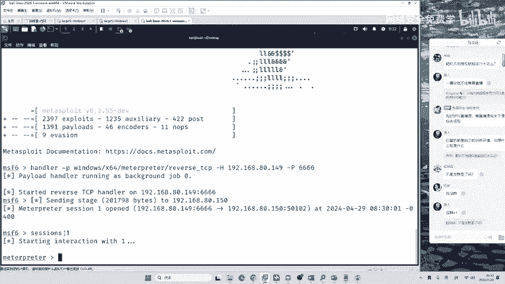

控制了这台电脑之后啊，我们已经完成了第一步，我就来给大家讲第二个步骤了。我们怎样获取到卓美拉后台的密码？看好。😊。

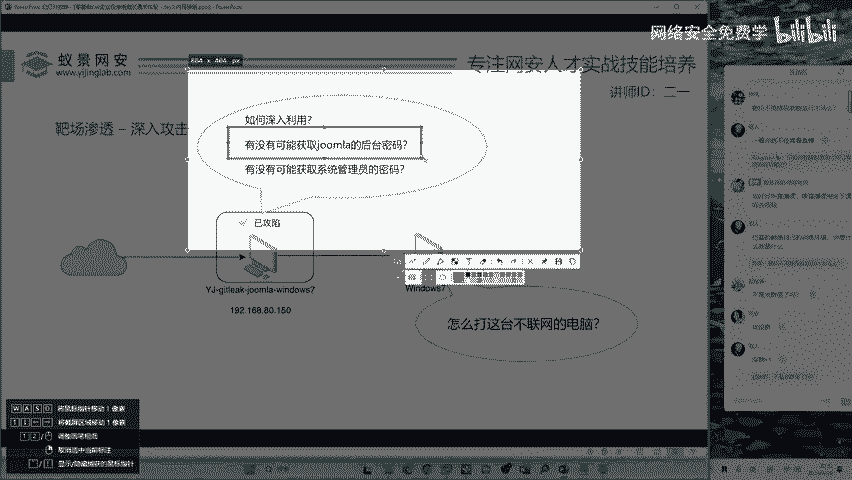

我们先想象一下。我现在已经完全控制了这一台电脑。已经控制了这一台电脑，昨天的笔记也已经发到手软了，也发了无数遍了，大家可以不用再问了哈，这个东西已经发了无数遍了。😊，然后咱们的这一个控制了电脑之后啊。

我们要想象一件事情。就是别人的电脑有没有浏览器呢？我觉得是有的。但是呢我想要获取他浏览器中保存的用户名和密码。它浏览器中的历史记录。你这个小同学啊用浏览器看到的网页，用浏览器登录的用户名和密码。

我都能获取到这时候应该怎么办呢？啊，其实呢有很多的工具啊都能够做这件事情。😊，我们今天呢要给大家推荐一个比较好用获取的比较全的工具。

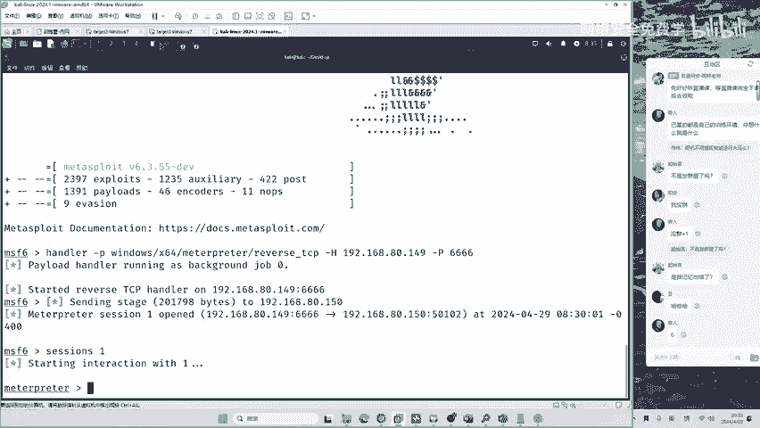

这个工具在哪儿呢哈？如果你使用的是二姨老师的咖利，或者是呢啊在咱们这样一个文档中啊，都有这个工具。这个工具呢叫做hannkb data。😊。

就是获取目标浏览器的密码和目标浏览器的历史记录而产生的一个黑客工具。这咋加密不想被看。没法加密。为啥呢？因为它能够解密这个工具能解密你加密之后的东西啊，所以说呢最简单的方法就是不用。我不用浏览器。

这样的话就是告诉大家，鱼和熊掌呢不可兼得。最安全的方式就是不用电脑。好，不用电脑，对，开无痕也性，无痕浏览。但是你要呃知道无痕浏览的弊端是非常大的。我就是告诉你，鱼和熊掌不可兼得，自古以来就有这个道理。

😊，没办法。现在呢我们要把这个工具传到目标的电脑上，怎么去传呢？你要记住啊，我今天的课程我不会去动靶机。我不会去操作这台机器，什么弊端，你应该知道呀，无痕浏览啊，这个东西跟网络安全没什么关系啊。

我不会做太多的讲解释啊，这个东西跟网络安全无关。😊。

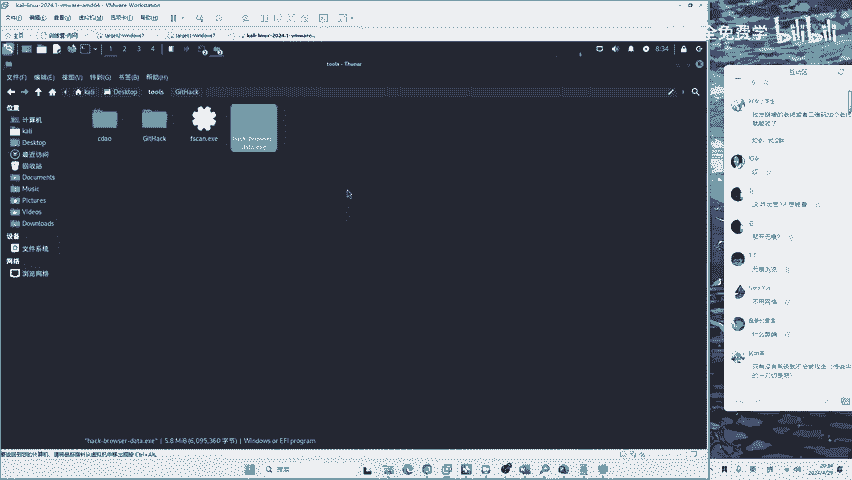

我们来看一下吧。在这里。我们现在呢把这个工具给它传上去，怎么传？

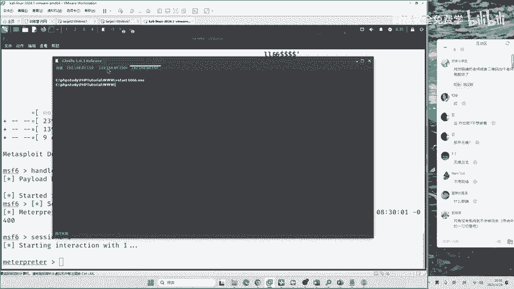

Upoload的。upload是上传的意思啊。 uploadload是上传的意思，上传什么呢？我们要上传工具，工具里面的是吗？😊，han data这样一个黑客软件，我们上传这样一个黑客软件。好。

现在有同学说感觉无痕模式没有弊端，大家就用无痕模式就行了。但是我想请问一下噩梦的重演。你现在在看我们的直播使用的是无痕模式吗？如果你没有使用无痕模式，就记录到你了。是的，非常好。

那希望大家就保持这样一个使用习惯就行了啊。好，那现在呢我们来上传这个工具。好，回车一下。

回车一下之后啊，这一个叫做handerb data的工具就已经传到了咱们的目标机器上面。现在啊我就用它来去读取目标浏览器的历史记录以及它浏览器的密码，我读它的历史记录呢没啥问没啥影响，为啥呢？

你说你渗透测是你看别人历史记录干啥，别人历史记录不会有任何帮助。你要看的是别人浏览器中保存的密码啊，保存的密码。😊，现在来看好。怎么去执行它？exece。excuse的中文意思呢就叫做执行运行的意思。

它是英语。它是英语。好，那现在呢我们来执行一个叫做han data的文件。😊，这个文件在执行的时候呢，我们要加上杠大H，再加上杠F去执行它意思呢就是隐藏式执行。这里的H呢其实英语就是hiden隐藏的。

😊，意思啊，这里的F呢是fire，就是说你要执行哪一个文件。哎，我们要执行哪里呀？我们要执行汉克b data这个文件按下回车。😊，按下回车呢，现在这个文件就已经被执行起来了。

执行起来之后我不会去操作靶机，为什么？就是因为你在实际攻击别人电脑的时候，你会去操控别人的鼠标吗？有同学讲，我会你会，你容易被别人发现呀。正常情况下，咱们的控制都是要持久性的控制。

你不可能说你控制一秒钟，你被发现了是吧，就被发现了。现在我们来看。我们在执行完成之后，大概只需要过一分钟左右。目标机器上面所有浏览器的历史记录和所有浏览器的密码都会被这个工具所获取到。

被这样一个黑客软件所获取到。获取到之后，我们怎么办呢？我们怎么办呢？我们把它下载下来，怎么下载？好，你在运行完handkey data之后，在当前的文件夹中，它会新建一个文件夹叫做results。😊。

这一个文件夹里面保存着的就是受害者浏览器的所有信息。我们现在把它下载下来，要下载它的什么呢？我们要下载它的浏览器密码。😊，比如说你现在可以下载如下内容。第一个就是它的bookmark书签。

第二个是它的c凭据，第三个是他的download的下载记录。第四个是它的history浏览记录。第五个是password保存的密码，我们要下载password点CSV。你想去下其他的，你就去下啊。

你没有必要啊，在这个地方纠结啊，你可以去下载其他的去看一看嘛。那前提你要知道什么是书签啊，什么是下载记录，什么是历史记录。好，我们现在按下回车。按下回车之后。

现在啊受害者电脑的浏览器保存的密码就已经跑到了卡利上面。跑到卡里上面之后啊，我们就能够双击打开来看一看它的密码有什么。来看一看吧。他的密码有什么东西啊？哎，大家可以稍等一下，有点卡。这卡的有点卡。啊。

同学们可以稍等片刻啊，我这个卡里可能有点卡顿啊，应该是这个vitro studio code，它卡住了，见CPU呢占用比较高。我们等下呢从这样1个CSV里面，你就可以获取到就是目标。

也就是受害者他的电脑中浏览器保存的所有密码。好，我们可以稍等一下。应该是这个软件呢正在更新啊，所以说它会卡住。啊，不用等他了，我们来重启一下卡利吧，可能是卡里有点卡呃，重启一下卡利就行。😊。

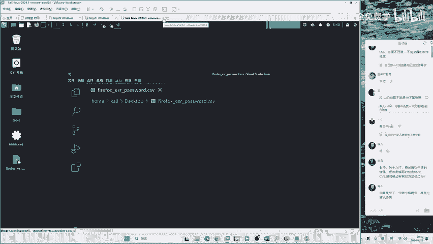

反在反正实际工作中就是卡了就重启呗。😊。

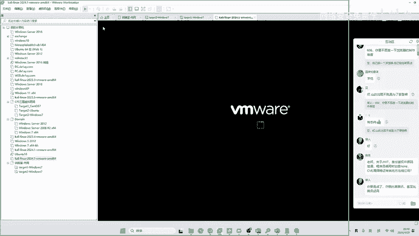

这有没什么大影响啊？好，我们来看一下。😊，重启就是关机，然后呢去进行一个呃登录就行。

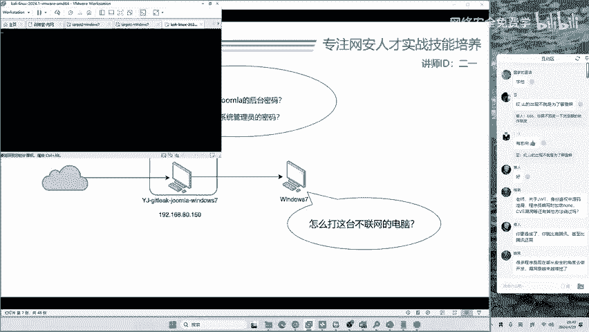

这个悠岩同学说啊，你这个非常对啊。😊。

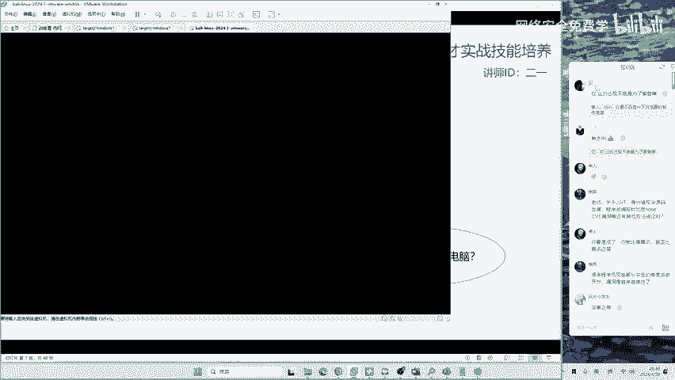

国内的安全肯定是进步呀，漏洞肯定是越来越难挖，这是肯定的啊，正常的。😊，啊，这是一定的事啊，未来肯定是越来越安全。浏览器没有保存密码的话啊，大家呢可以选择其他的方式，可以选择其他的方式。啊。

我这里浏览器是有保存密码的。因为这是靶场。如果啊大家就是设计设计的话，你可以搞很多种场景。那比如说哎浏览器没有保存密码怎么办呢？或者是说啊他没有周密码怎么办呢？或者是说哎他没有网站怎么办呢？

是吧都可以这样去想象，都可以这样去设计，看能不能把自己啊给拦住。😊，好，我们来打开这个文件。打开这个文件之后啊，你可以看到在这里留下了两个密码，两个密码呢一个是root2166621666。

我们通过第一天讲课的内容啊，你已经知道了什么，你已经知道了2166621666是mysqcle数据库的密码。那剩下的这个密码是谁的呢？😊，你看这个密码它比较复杂。我们是不是鸠密拉的密码，你知不知道呀？

你不知道，所以说实践是检验真理的唯一标准。这个密码是不是你得登录一下看呀？😡。

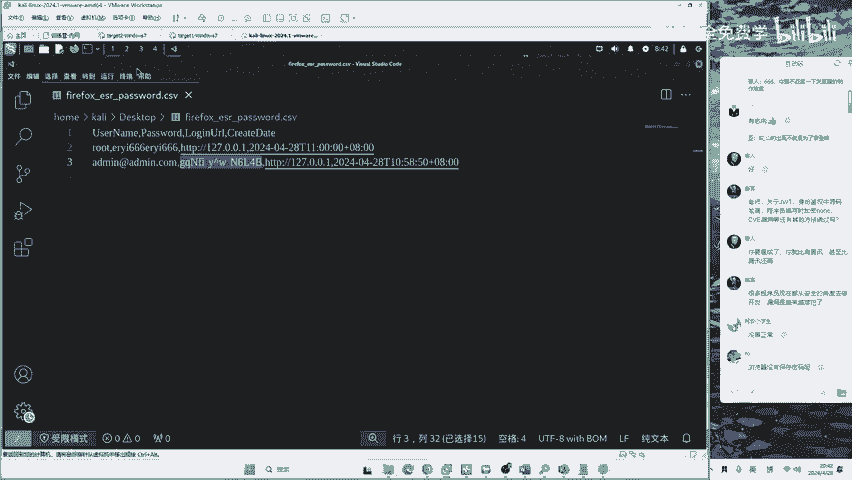

你不登录，你怎么知道你猜吗？😡，你要是能猜到你就是先人知了是吧？那所以说不太现实，我们要实际到周妹啦这个博客平台的后台，我们去登录一下，看一看啊，它到底是不是密码。😊。

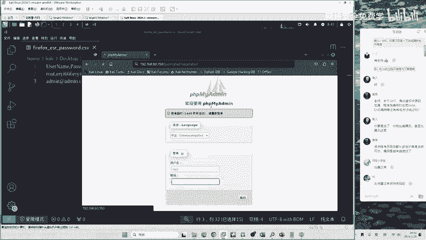

好，我们进到这个博客平台，进入到博客平台之后啊，我们登录管理员账户，然后呢把这个密码咱们复制一份啊，复制一份这个密码出来。😊。

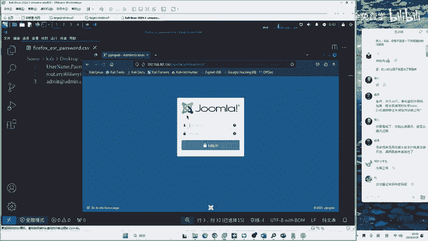

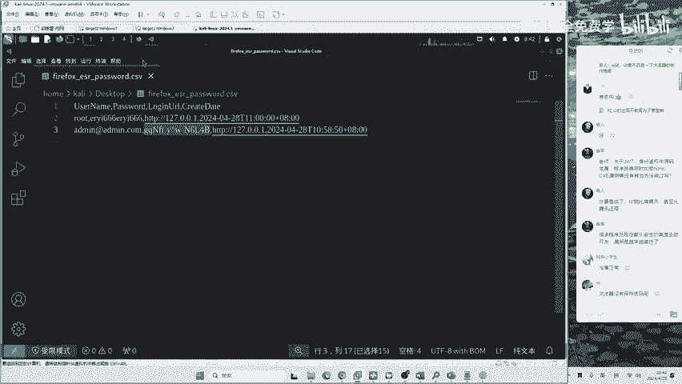

放到这个密码处点击登录。

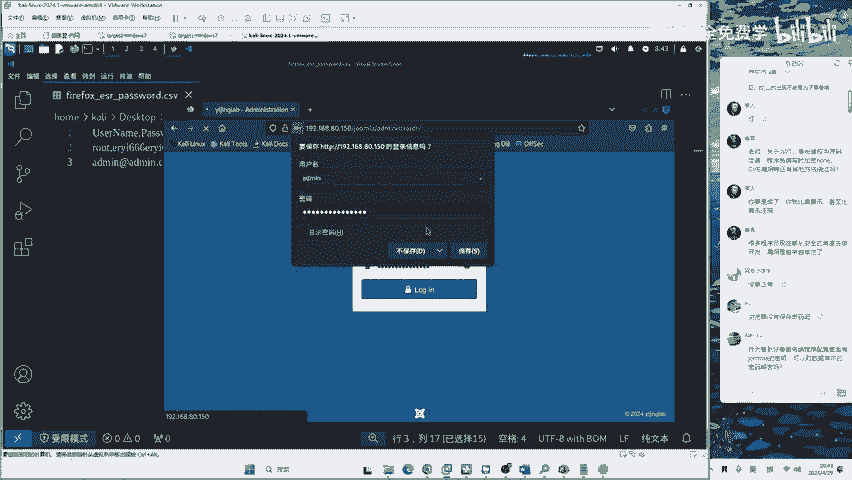

点击登录，现在呢我们就可以去登录到目标的机器了。登录到目标的机器了。你可以看到这个就是他博客的后台，我们就可以去删除他的博客，就可以去控制他的网页给他挂一些黑页，但是要注意挂黑页的行为。

在任何情况下都是属于违法行为。我们来看一下这位同学，首先呢给你点一个赞。昨天看到服务端程序配置里有jo密啦的密钥，可以对数据库中的密码进行解密吗？可以，大家可以编写解密算法来进行相应的解密。

这是需要有一定的代码审计能力的哈，大家非常优秀，你可以去尝试一下，可以去尝试一下。😊，因为靶场呢给你了，你可以下载之后啊，自己试一试尝试尝试。尝试成功之后呢，你可以写一个文章，发表到相应的网络安全论坛。

在之后啊你找工作，包括呢你升职加薪都是有非常帮助的。比如说呢你可以说哎我在某某周刊某某论坛，发表过技术文章。这对于入职网络安全大厂是非常有帮助的那这一点就可以形成这个文章。前提是你要把它研究好。

我们继续来看。现在已经OK了。我们已经获取到了周密拉的后台密码，已经获取到了。现在。要第二件事情。我们有没有可能获取系统管理员的密码呢？

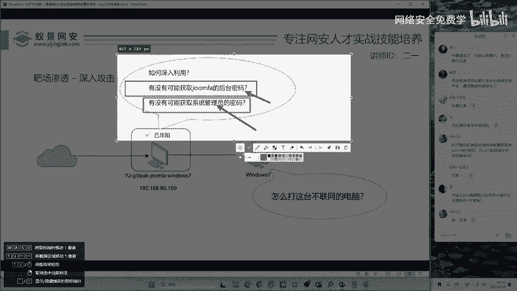

其实呢是可以的，我要教大家一个方法。这个方法呢只有在windows7操作系统上面才可以使用。请同学们看好。

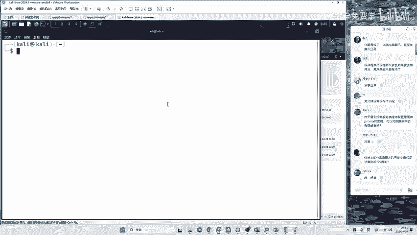

首先呢我要重新打开MSF console。为什么要重新打开呢？就是因为刚刚我的卡里呢不小心卡住了，所以讲我得重新运行一下嘛？😊。

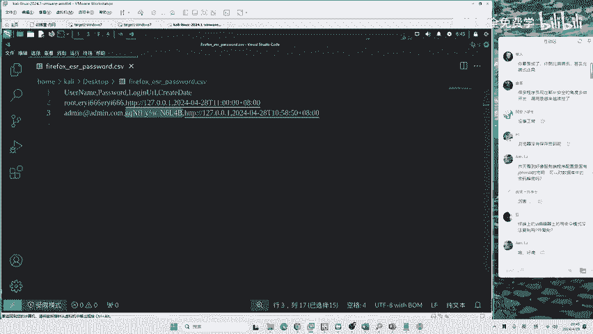

哎，如果刚刚康里没有卡，那就没关系了。好，我重新打开一下matesp。打开mateport之后呢，之前的历史命令你是不需要重新敲的，大家只需要按住鼠标的。

按住键盘的上下按键就可以切换至之前敲过的历史命令来直接的运行它。运行它之后呢，可以看到我们的一号受害者又上线了。我们的一号受害者呢就是第一台机器windows7。如果是windows机器。

windows7机器的话呢，我们就可以直接读取到它系统的管理员密码。有同学现来说哈，老师已经2024年了，谁还在用Wwin7呀？是这样的，现在已经没有人再会用windows7操作系统了。

读铭文密码肯定是不可行的。但是没关系，一个攻击路径不可行，我们可以另循其径。如果你寻不了一个路径的话，就说明什么就说明。你的信息收集没做好呀。多做信息收集，多扫端口，多扫目录。

多扫IP这是保证你渗透测试成功的前提。好，现在我们来进行密码的获取吧。想要获取密码，有一个前提条件，就是你必须是管理员用户。但是我这里要给大家讲一个好消息啊。

如果你是windows操作系统安装的PHBstar。肯定有同学知道PHP study啊，我在群里都看到了。很多同学问问题，说老师PHP study。😊，你只要安装的PHP study啊。

别人攻击你攻击你的电脑就是管理员，不需要提全啊，不需要提全操作。所以说呢咱们这里可以直接的进行一个简单的提全，叫get system。就可以提升到windows的最高权限用户。

windows的最高权限用户呢叫做system。system啊它是windows的最高管理员。我们在拿到system之后呢，你只需要两条命令，就可以把它的密码读取出来。一个叫做load k。

加载一个插件，这个插件呢叫做奇异果英语kiV。按下回车就能加载它。在加载这个插件之后呢，我们要输入一个命令，叫做ceds all。就只获取所有的凭据信息，意思呢就是获取所有的密码，按下会车。

这时候你可以看到我们电脑上面的administrator的密码是EQIZ艾特WSS就获取到了。这就是获取windows系统密码的方式。但是这一种方式仅限于windows7操作系统。

如果你使用的是windows10windows11，这种方式是已经被微软修复了，没有办法直接获取到它的密码。现在我们就来想象一下。如果你没有办法获取到他的密码，应该怎么办呢？请大家看好。

如果呢我们攻击了受害者的电脑，是一个比较新的操作系统，比如说呢是win10。win10的话，虽然没有办法获取到密码，但是我们可以获取到密码加密之后的密文数据。使用命令哈虚 dumpump。这叫哈希啊。

就是获取这个哈希。哈希呢是一个密文，就是说你不好解密，而不是说不能解密，而是说它解密出来比较复杂。现在呢你看到这一串东西啊，就是IAD3B35到这个161CFF这一串东西呢就是咱们的密码，谁的密码。

管理员的密码加密之后的哈希值。什么叫做哈希呢？啊，哈希呢。

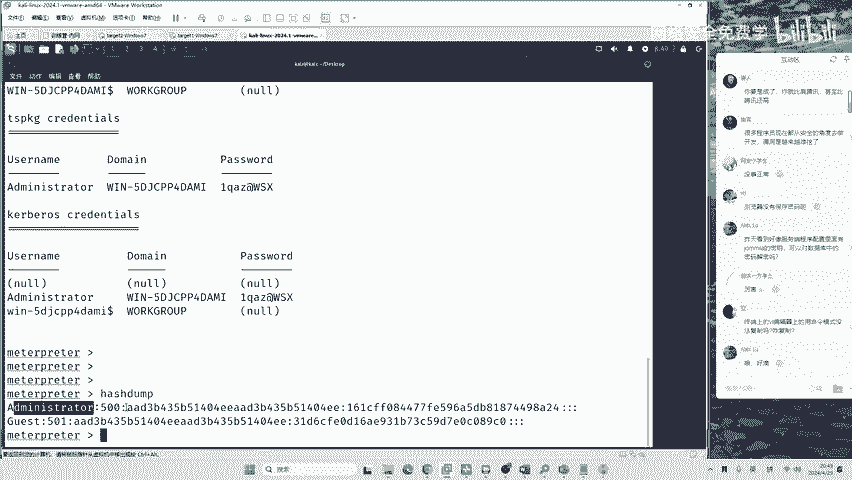