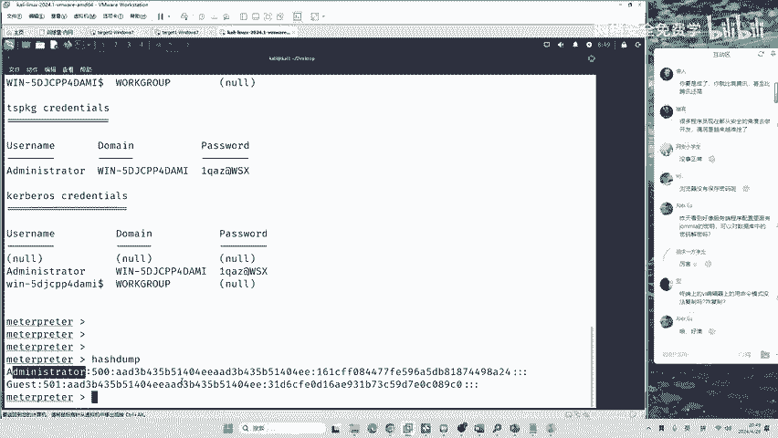
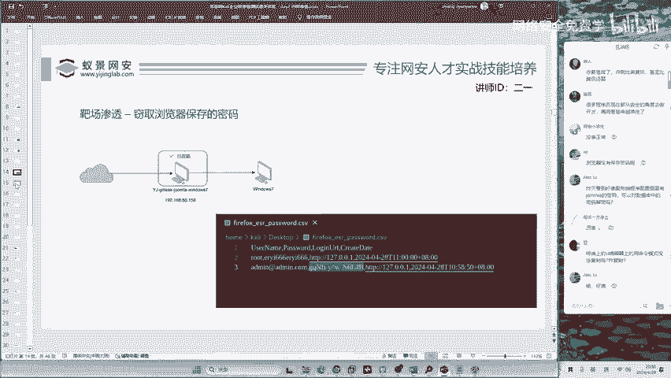
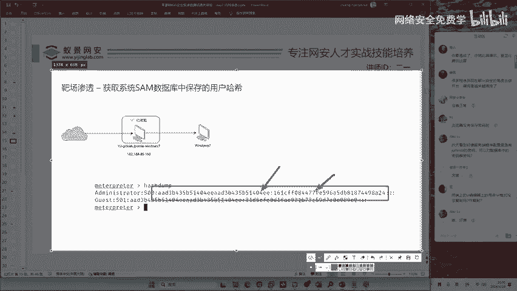

# 2024B站最值得看的黑客教程 ｜ 网络安全／渗透测试／内网渗透／漏洞挖掘／web安全／kali linux／红队靶场／CTF／信息安全 - P127：靶场渗透-获取系统SAM数据库中保存的用户哈希 - 网络安全免费学 - BV1uBsTetEow

谁的密码，管理员的密码加密之后的哈希值。什么叫做哈希呢？啊哈希呢是一个数学算法呀，哈希是一个数学算法，大家如果不清楚的话，你可以现在咱们知道一下，然后知道一下这个东西。😊。

就是这一个东西呢，哈希值不论你使用的是win7win10，还是说win11，咱们都能获取到呀，就是加密之后的数据。那加密之后的数据能够干什么呢？能够进行哈希传递攻击。我们现在就来看哈希传递攻击吧。

