# 2024B站最值得看的黑客教程 ｜ 网络安全／渗透测试／内网渗透／漏洞挖掘／web安全／kali linux／红队靶场／CTF／信息安全 - P128：靶场渗透-扫描探测内网存活主机 - 网络安全免费学 - BV1uBsTetEow

来看好。现在如果你想进行哈希传递攻击的话，首先第一件事情。就是你要知道将这个哈希传递给谁。也就是说，在内网里面有哪台机器是实际存在的。

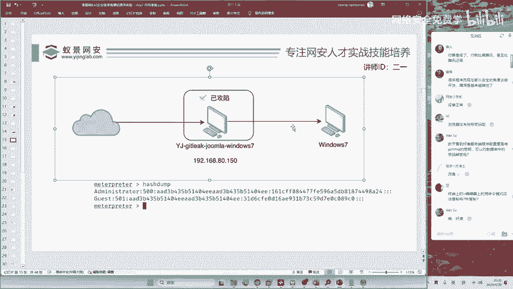

这时候我们就需要进行内网存货探测。

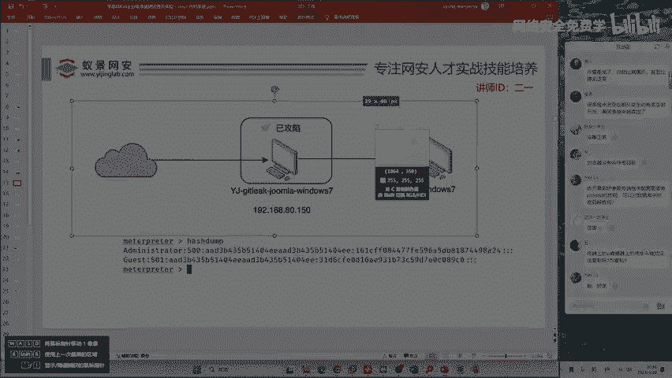

内网存货探测的意思呢就是指在同一个局域网中将其他的电脑去扫出来，也就是扫到我们第二台靶机windows7。这一台吧机是不能够上网的，它没有互联网的连接。

但是今天呢我们就是要通过一个跳板的方式来去攻击这个没有联网的电脑。这个电脑是没有联网的，是的吧？啊没有联网。我们要进行什么？我们要进行对他攻击。那怎么攻击呢？首先第一件事情啊，我要把它扫描出来。😊。

有同学讲，不要扫描了，这里不是看到了192。168。44。132吗？这里看到是因为我打开了他的桌面，如果是实际攻击别人的电脑，你能打开他的桌面吗？😊，打开他桌面的前提是，你已经攻破了它在攻破之前。

想打开它的这个电脑屏幕是不可能的。所以说呢我们现在就把它隐藏起来，通过卡利来把它扫出来，这才是我们要渗透的关键。怎么去扫呢？首先我们要上传一个工具，这个工具叫做F scan，也是一个黑客软件啊。

我们要把它上传上去。怎么上传呢？首先upload上传。上传不会的话，你要反复的去练啊，不然的话以后你攻击别人的电脑，你要给别人传一些木马，要给别人传一些软件，你都不知道怎么去传，这怎么能行呢？

所以说要反复去练，传什么呢？我们传工具，工具里面呢有一个叫做F4看的工具。😊，我们把这个工具去上传到目标的电脑，然后去扫描。扫描谁呢？我们现在通过一开始的IP康菲哥，你可以发现。

在第一台受害者的电脑中啊，除了192。168。80。150之外，还有一个叫做192。168。44。133的IP地址。如果我们想去扫描在局域网网段192。168。44，有多少个电脑是打开的状态。

也就是有多少个IP地址是存活的状态，就需要使用到我们今天讲的Fcan这个工具。现在让我来给大家运行一下吧。运行exece执行执行什么呢？我们要执行。😊，咱们的F是看。打一个冒号呀。

因为F看你需要指定网网段的，要指定IP地址段F看点EX1杠H扫描哪一个网段，192。168点44。0，扫描这一个网段，加上反斜杠24是代表子网掩码，意思是从192。168点44。1，扫描到192。

168点44。255。按下回车，现在来看结果，它的扫描速度是非常快的，直接就能够扫描到192。168。44。1192。168。44。132，这两台机器是存活状态的。133是我们自己啊，你不要说哎。

我又打回自己了，那不行啊。😊，133是你已经攻献的这一台机器。下面呢是F斯看对这个网段端口开放的情况做了相应的扫描。同时呢他还扫描了系统的漏洞。比如说在192。168。44。132这一台机器呢。

它存在永恒之蓝漏洞。今天呢我们先不答永恒之蓝，我来给大家讲另外一种方法，去拿下这一台互联网的winI7。这一台win7呢我们采用的方法叫做哈希传递攻击。哈希传递在实际的内网中是大杀器。

从2014年以来啊，就2014年的时候，有一个安全大佬，他发现了哈希传递攻击以来，哈希传递一级市一直是内网攻击危害最大的漏洞啊，一直都是的。现在呢我们来进行攻击吧。想要攻击这一台winIN7。

你首先要注意。就是我们的目标2，现在已经开始攻击内网了，内网的特点就是很多的电脑它都没有办法连接至互联网。所以说你要进行跳板攻击。我们怎样去进行跳板的搭建呢？如果你今天和老师一样，使用的是meport。

那这里的跳板是非常简单的。来看我操作。首先我们进入到咖利里面。在这里输入一条命令，叫做run out route杠S。192。168点44。0，斜杠24。按下回车，现在就跳板机就已经搭建完毕了。

你没有看错啊，就这样就OK了。这一条命令呢就是指定告诉我们的MSF说我现在要用你去通向192。168。44。0这个地址这个网段的地址。那咱们的MSF能不能够识别这个跳板的指令啊？它能够识别。

因为这就是MSF的功能，这就是MSF提供的便利性。啊，就这样去运行就行了。这样去运行就行了啊。有同学听到这里，他说老师你讲太快了。😊，没关系，课件都会给你，工具都会给你。你在客户的时候，你对着敲。

你能敲不懂吗？你对着敲，咱们首先呢有同学讲老师我不理解。书读百遍，其一自线，你先对着敲，你敲一遍之后，如果能打穿。就说明你基本上就懂80%了。就是说你能够说比个葫芦画个瓢。你你就可以工作了。

工作就是这样，你不要想着工作天天发明创造工作天天第一天就渗透美国白宫，啊不是说美国白宫没有漏洞，而是说呢。😊，没有必要啊，咱们只需要拿1个10K20K的工作就行了啊，没有必要说啊，非得住大别墅。

非得住汤臣一品。那你们这些学员汤臣一品也放不下呀，是吧？没有这么多户型，没有这么多这个。😊，房子好吧？好，咱们现在跳板机已经搭建好了，搭建好之后呢，我们现在要进行哈西传递攻击了。如果你想去哈西传递。

你必须要按照我的方法去使用MSF。😊，要使用一个叫做exloit windows SMBPSEXEC的模块。这个模块的名字呢比较长，其实呢它非常好记。首先第一个英语单词叫做exloit。

它的意思叫做攻击脚本。第二个叫windows意思是攻击windows电脑。第三个是SMBSMB是windows最核心的服务，没有之一，它叫做默认文件共享服务。PSEXEC是一个横向移动的哈希传递的方式。

我们使用它。使用它之后呢，我们现在要做一个简单的设置。这个设置呢就是指定哎我要攻击64位的操作系统，并且通过跳板攻击。记住，通过跳板攻击，你怎样让卡里让你的manadapir知道你要通过跳板呢？

啊大家只需要改这里就行了，对吧这个地方呢？咱们指定啊。指定。指定是啥呢？啊？指定它是叫bandband的意思呢叫做正向，就是说我要通过跳板机来去连接，来去攻击这一个不联网的机器。我要通过跳板继续攻击啊。

好，现在按下回车。按下回车之后啊，你还要告诉徐统，你要通过跳板机攻击谁呀？😊，你不可能说不你不让他知道你攻击谁吧，所以说我们要指定我要攻击的是刚刚由黑客软件F4K扫出来的这1个192。168点44。

132，我要去攻击它，就是咱们的目标2呀，就这一台不联网的windows7。咱内网中不联网的这一个windows7。现在呢设置一下咱们攻击的目标，设置好目标之后，还差一点东西，就是哈西传递哈西传递。

你要给你的metalo讲哈希是谁呀？首先我们要先讲用户。用户是谁？众所周知，如果你不知道，现在就知道一下吧。因为大家都知道od main tract。这是windows的系统管理员。

你一定要把这个单词记住，一定啊任何人都要记住。第二个是SMB的哈希password。password呢因为咱们这个地方并没有获取到密码，而是获取到的哈希值。那我们啊就把这个哈西复制过来。

你要看清楚老师复制的是哪里，你的鼠标啊千万不要抖，你的手不要像食堂的阿姨一样。堵得比较狠，该复制的地方复制，不该复制的地方，你就不要动它。我们把这一串一共65个字母和数字。把它复制过来。复制之后呢。

咱们放到下面的攻击位置。按下回车。现在就万事俱备了。就是说呢我们已经设置好了目标，设置好了哈希，现在就等待哈希传递的攻击吧。哈西传递怎样攻击呢？执行run，也就是运行啊运行。运行一下，现在看好。

我们稍等30秒钟。稍稍等30秒。快到了时间快到了，再等。好，因为他这个地方攻击可能会失败，如果失败了，我会教大家怎么去调它。看一下这边的机器哈，没啥问题，我们继续来等它，它的攻击是很慢的。好。

现在呢可以看到他没有办法攻击成功。如果出现了这个问题的话，我们要改动一个地方，这个地方是非常明显的地方，就是端口。matetapir呢它会自动的为你选择端口，叫做4444。这个端口呢不是特别吉利啊。

所以说它经常会出现问题。我们如果怕他出现问题的话，你可以改变它的端口。改变成什么呢？计算机规定端口是0到65535。所以说呢我们设置一下。看的端口随便选一个，就12345吧。好，然后我们再执行来看结果。

看看结果。现在你会发现呢哎目标呢它连不上去了，看一下怎么回事啊，是不是IP地址变了，IP地址也没变啊。哦，这个结果很明显。😊，这个结果呢就是咱们的跳板机可能断开了。你看跳板机断了。跳板机断了。

跳板机断了怎么办？😊，就是大家在攻击的时候，因为你攻击的是内网，跳板机断开的情况是非常常见的。如果断了怎么办？就重新的来运行。重新的让他回到正轨。好，我来跟大家执行一下，顺便呢回顾一下咱们的工击流程。

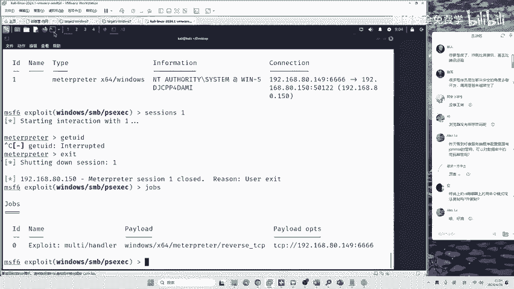

首先哎你要打开咱们的工具文件夹是吧？😊，在这儿。运行到咱们的C刀啊运行咱们的C刀。😊。

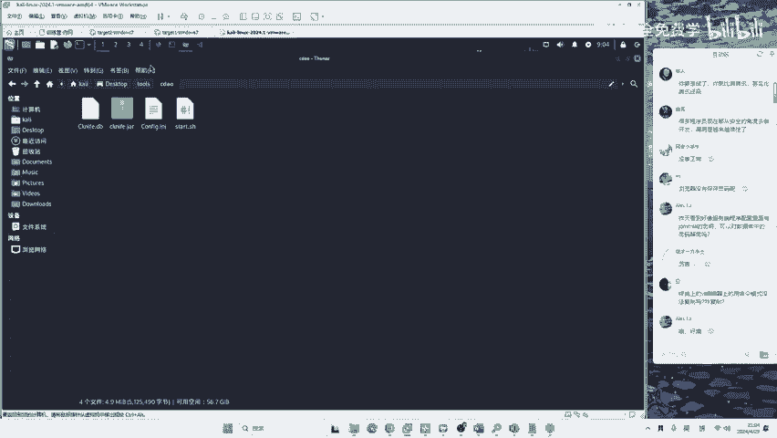

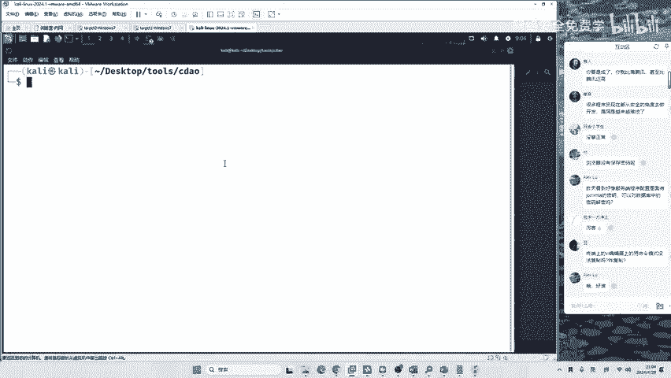

运行C刀之后，I连到这一台服务器上面，然后呢在模拟终端中运行start6666。EX1。

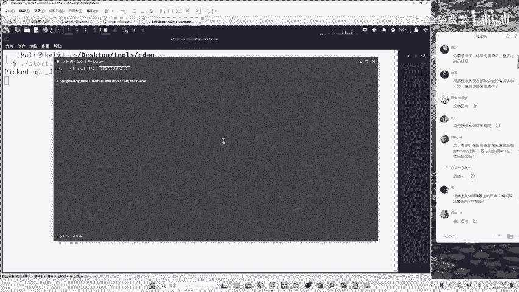

在运行完毕之后啊，我们就可以获取到第一台机器的控制权限。获取到第一台机器的控制权限之后呢，我们要输入run auto route杠S来构建跳板机。

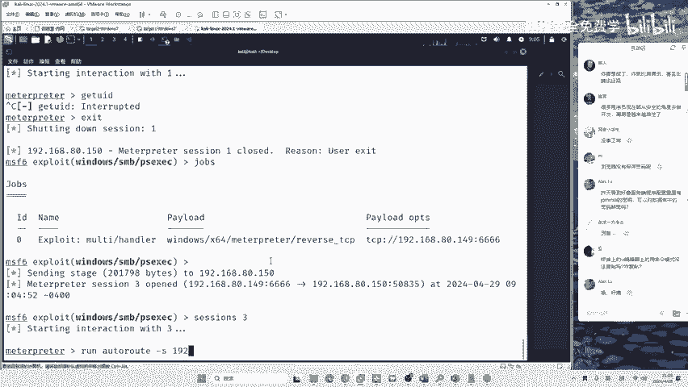

一条命令就行了。在构建完跳板机之后，我们需要使用exploit windows SMBPSEXEC来进行哈希传递攻击。现在我们再来执行一下这样一个代码。来看结果。这里是要等待的哈，因为它很有可能会卡住。

可能是网络不好吧，或者是MSF的bug都有可能。😊。

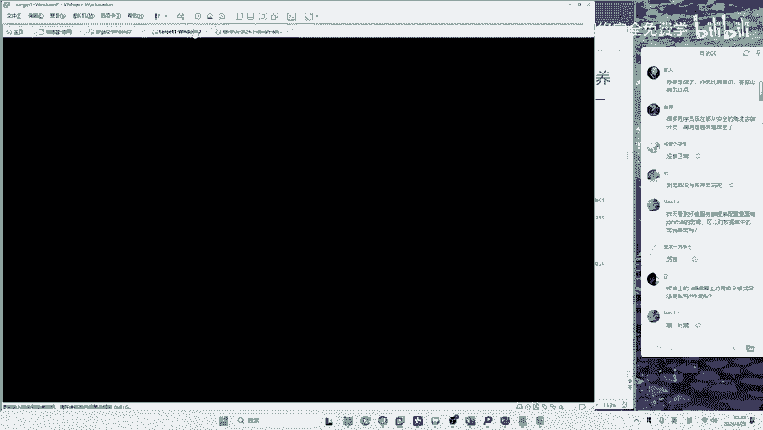

现在的话其实在这个win7上面，它已经运行起来后门了啊，它已经运行起来后门了。我们可以看一下啊。在哪里呢？就是在这样一个服务啊，一个服务的后门它已经运行起来了。就在这里面啊在这里面某一个。

因为它是开启的系统服务嘛。好，现在可以看到呢，它依然是会终止掉。其实终止的原因呢是非常明显的，就是咱们的。😊，整个的网呢比较卡，整个的网比较卡，就是咱们跳板机啊总是断开啊，总是断开。想解决它的话。

咱们要把这一台机器重启一下，可能是我这一台机器开机太久了啊，大家也知道windows啊开机太久，就是容易卡顿。😊，🎼那我们现在在重启的时候呢，先来回顾一下咱们的一个课程。

这个课程呢我们要讲解的其实就是完成渗透测试的整个流程。同学们来看哈，咱们的一个流程呢就是从确定目标。

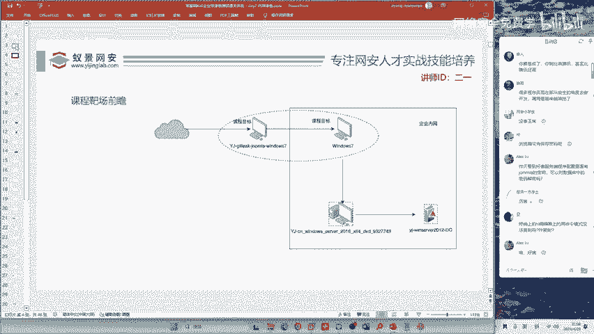

到信息收集到漏洞挖掘，到漏洞攻击。今天我们又讲了什么呢？又讲了系统的攻击，又讲了系统的攻击。这个系统的攻击咱们是用什么生成的木马MSF venom去生成的木马。😊，它所生成的木马呢。

我们用来植入系统级别的后门来实现对系统的持久性操作。然后呢，我们又进行内网扫描。内网扫描中我们用到了一个黑客工具叫什么F scan。我们用它呢对192。168点44。

0这个网段呢进行一个存活IP地址的扫描，来就发现在这个局域网中有哪些IP地址是开机的状态。然后呢又进行了内网攻击，内网攻击的方式非常多。你如果学内网攻击的话，那没有4个月，我估计是很难撑下来的。

内网攻击呢，咱们今天是选择了一个比较基础的方法，它叫做PSEXCC哈西传递攻击。这一种方法呢，如果你的跳板机比较稳定。机器啊比较稳定的情况下，那它是可以直接的获取到目标的一个执行权。目标的一个执行权。

好，那这就是渗透测试的一个整个流程。

那一会儿呢我可以给大家重启一下机器，然后呢再来去做一遍。现在机器已经重启好。同时呢我来给大家讲一下，就是你搭建这个靶场应该怎么去做，是吧？在搭建靶场的时候呢。

大家一定要把我C盘中保存的PHP study呢给它运行起来，一定要把它运行。它不运行的话，网站是无法访问的。我们在把它运行起来之后呢，现在可以在。永恒之蓝漏洞。对你讲的非常正确啊，就是永恒之蓝漏洞。

在运行起来之后呢，我们可以在这里重新的将后门启动起来，输入命令start6666点EXE。😊。

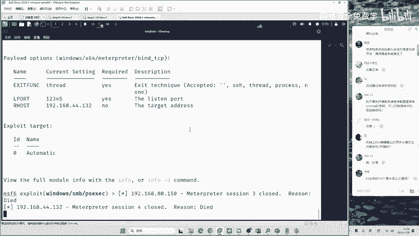

我们启动。

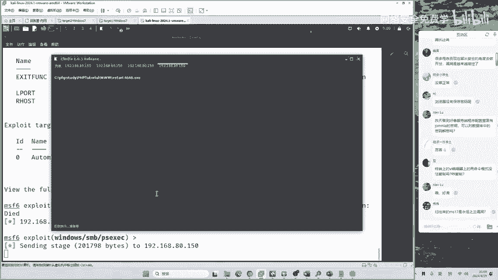

启动之后呢，一定要建立跳板。run auto route杠S192。168点44。0，斜杠24。然后呢，我们再把它放在后台叫BGBG的意思呢叫做background。好，我们来看一下同学们的问题啊。

PHB study的版本有要求吗？没有要求啊，什么版本都行。不论你是用10年前的版本还是用现在的小屏面板都可以啊，没有要求的。😊，如果就是说你自己懒得搭，我在之前给大家过这个靶场啊。

你可以直接到这个链接里面去下载。如果你自己想搭建，那更好不过了。因为你在搭建的时候能够学到很多的安全知识。😊，现在啊我们的跳板机已经重启了，我再给大家执行一下这个后门来看效果。好。

希望呢跳板机不要再崩了，果然没有再崩了。在我重启了这个win7之后啊，可以看到就能够正常攻击了。为什么要重启它呢？这是windows的问题啊，大家应该都知道，在10年前的windows啊。

用windows7，只要你开机的时间比较长，它一般啊都会卡，甚至是直接蓝屏这些死机。那如果你在攻击老师的靶场出现了相同的问题。你可以通过重启虚拟机来去解决。那现在呢我们就是通过哈希传递，就一条命令啊。

就在这儿run。😊，run之后呢，整个的传递过程它都是自动的。有同学讲，老师，我要学会这个原理吗？我告诉你啊，你要学会，但是呢你先会用工具，你再讲原理。如果你现在连打穿都做不到，你去谈原理的话。

那没有什么用是吧？没有什么用啊，所以说呢咱们先把它运行一下，运行之后呢，就会打开一个新的mat printer。而这个控制权就是这一台互联网的电脑的控制权。😊，我可以给你看一下吗？看一下IP地址就行了。

来看一下这台电脑的IP地址，192。168。44。132，也就是这里面的一台winIN7。现在这就是一个哈西传递的过程。如果你今天对网络完全是零基础的，我讲的课你一定记不住，怎么办呢？

我们就需要在课后领取资料，反复的去看，领取课件，反复的去敲，用这个靶场。如果有问题，可以直接在群里去问。

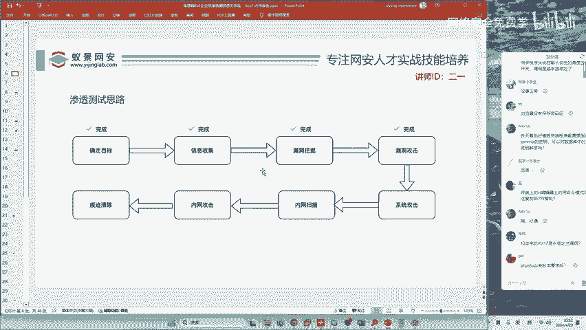

那我们今天讲的一个内网攻击是什么？再给大家回顾一下，叫做哈希传递攻击。😊，叫哈西传递攻击。哈希传递攻击呢它有一个前提条件，它的前提条件是什么呢？就是说在一个局域网中，两台电脑的密码要一样才行。

你看这个东西离谱不大家。😊，一听哎，老师啊，这好像很离谱。密码要一样要一样，这好像很离谱，好像不存在。😊，那其实在实际上，一个局域网中，两台电脑密码一样的可能性有没有呢？可能性是非常大的。

毕竟哈西传奇攻击呢是内网攻击的大杀器。从2014年以来，它一直是第一大威胁。那如果我们先想象一下，如果现在两台电脑的密码不一样，就假设这个局域网它非常的安全啊，比如说你的宿舍，你宿舍。

你跟你室友的电脑密码不一样吧？我也不一样呀。所以说呢大家的安全意识非常好。在两台电脑密码不一样的情况下，怎么去进行内网攻击呢。😊，这就是要告诉大家呢，内网渗透是一个无休无止的话题。

你是需要进行系统性的一个学习。

