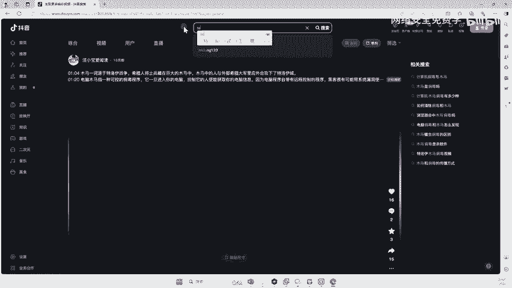
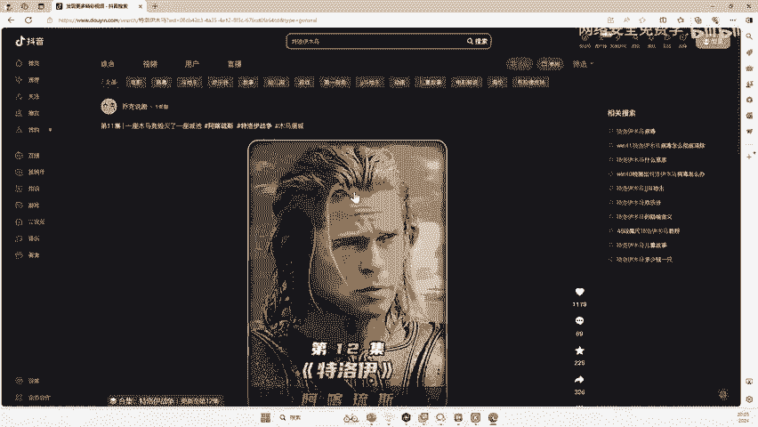

# 2024B站最值得看的黑客教程 ｜ 网络安全／渗透测试／内网渗透／漏洞挖掘／web安全／kali linux／红队靶场／CTF／信息安全 - P129：计算机木马起源 - 网络安全免费学 - BV1uBsTetEow

我叫做木马，木马是什么东西，对不对？好，那么在这里啊我给大家说一下啊，木马大家都知道吧？哎，就是用木头做的马，对不对？那么这个为什么我们计算机病毒里面有个木马？来我给大家说一下这个历史呢。由来好吧。

那么它的全名叫什么？木马叫做特洛伊木马。好，特洛伊木马啊一般可以理解为啊未进行非法目的的计算机病毒啊，一般来说啊，一个电脑有病毒啊，这个病毒可能就是什么？你中马了，听没听过，哎，你电脑中马了，对不对？

什么马呀什么马了，就叫特洛伊木马。那么为什么会叫特洛伊木马呢？不叫什么什么嗯牧牛流马呢？对吧？不叫其他马了，为什么叫特洛伊的木马？好，这里给大家说一下这个东西啊？😊，好。

那么这个特洛伊是个啥啊啊特洛伊啊，它是一个城邦的名字啊，就是说我给大家看个影片吧，你就懂了啊啊，很多人就是学这个东西的，他他之前没有了解过，对不对啊？那么李哥啊之前学这个网完性的时候啊。

也不太了解这个东西啊，就是说啥意思呢？我给大家举个例子啊，就是说。😊，这个特洛伊。

特洛伊对不对？木马好，那么这个东西是啥啊？其实非常简单，大家可能很多人都看过一个电影啊，我给大家简单讲一个简单讲一下这个故事的由来啊，就是说当年希腊为了打这个特洛伊城邦啊，他是一个城邦，然后打了多久。

打了67年都没打下来啊，最后他们用了一招什么招，就是他们制作了这样一个木马啊，就是用木头包括了马，然后这个木马里面藏了很多士兵，对不对？然后这个特洛伊城邦呢，这些人就把这个啊他以为他打胜利了啊。

就把这个木马运到他们城里来了，然后晚上的时候从那木马里面就蹦出来他们很多敌人啊，把他们城城邦给灭了啊，就是类似于这样一个流程，对吧？所以说为了纪念这个东西啊。

所以说就把计你的计算机打假如说被别人远程控制了，他就叫特洛伊木马，对吧？因为特洛伊啥意思啊，就是纪念这场战争嘛啊，那所以说呢这个特洛伊木马由来就是这样的啊，一般来说啊，现在的病毒伪装成一个使用的工具啊。

就是我们把这个病毒对不对？伪装成一个工具，比如说伪装成一个什么QQ伪装伪装成一个。😊。

啊伪装成你们电脑上的一些你下载的软件，对不对？哎，它是不是类似于把我们的病毒包裹在这个啊这个正正常的软件里面，就类似于这个木马一样，对吧？这个木马里面藏的谁啊？藏的是士兵啊。

那这个看起来这个木马没有问题啊，但是里面内有玄机，同样我们的这个木马也藏在一些正常的软件里面。一旦你运行了，下载了啊，那这个软件它可能是个游戏，可能是个图片，对不对？甚至是一些系统文件啊。

然后你去把它诱导你下载了，你就电脑就中马了。那么中马之后兄弟，那有些人可能没有直观的一个感受，说哎我电脑中木马了。😊，哎，他对方能到底能干什么啊，我网上也乱下一些360大礼包什么的，天天中码中码的。

我也没干我的电脑能怎么样了，对不对？好，那么今天就给你看看哎，中了码之后，你的电脑能干什么开摄像头，那只是一个非常简单的东西了，对吧？😊。

