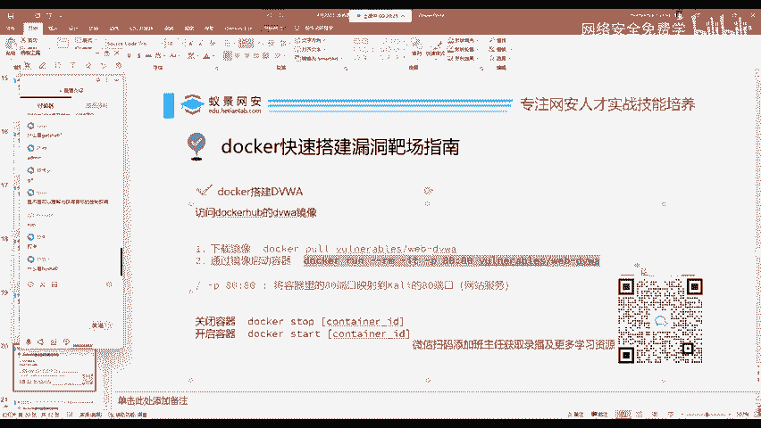
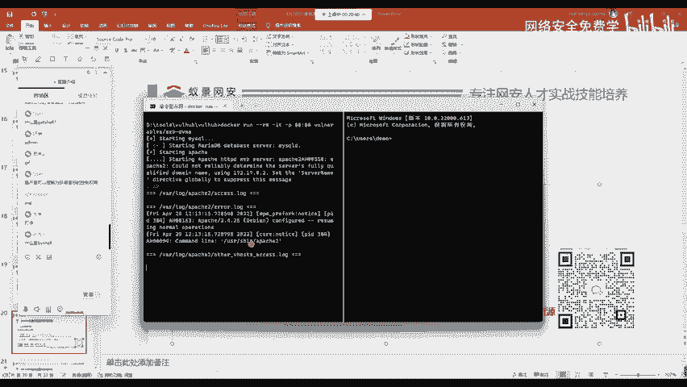
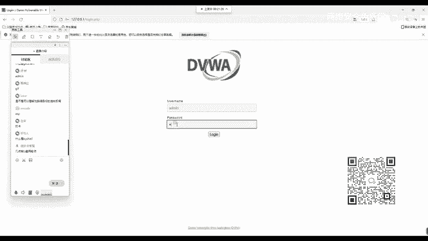
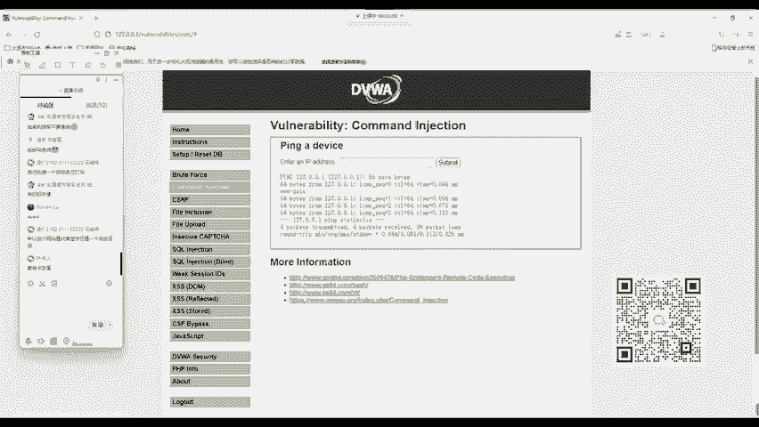
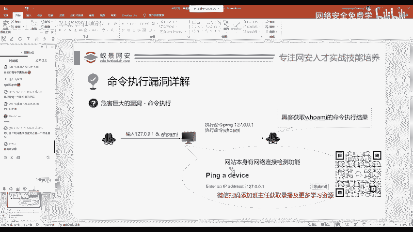

# 2024B站最值得看的黑客教程 ｜ 网络安全／渗透测试／内网渗透／漏洞挖掘／web安全／kali linux／红队靶场／CTF／信息安全 - P12：命令执行漏洞详解 - 网络安全免费学 - BV1uBsTetEow

来把这个DVWN呢搭建起来，使用docker给它搭建起来。

一句话就可以了。我们回车。把它搭建起来，放到我们的CMD中。好，我们把它搭建好。

搭建好之后呢，我们可以打开自己的浏览器，访问一下当前的地址，就是我们本地的127。0。0。1。打开DVWI的页面。现在呢我先把这个网站放大一些，打开之后呢，我们可以点击登录登录。

然后首先呢我们要第一步要create或者是resit database创建这样一个DVW的数据库。点击之后它会跳转到下面的login页面。这是昨天的课程呢，我今天就不会太讲的太详细了，点击登录之后呢。

我们输入DVWI默认的用户就是addmin。默认的密码password。

输入之后，我们点击logan登录到我们盘登录到我们DVW的后台页面。现在呢我们首先第一步是要选择DVW的seity几点抽U盘，这个我也不太清楚啊，就到时候我讲完一部分的时候来抽下抽一下奖吧啊。

然后我们把这个等级呢选择漏，选择漏之后呢，这边就是我们。常见的这些基础外部漏洞。我们今天呢先带领大家回顾一下command injection命令注入漏洞。

这个漏洞呢就是原本这个网站想让我们输入1个IP地址，它进行测试连接。比如说我们输入127。0。0。1。点击subit回撤之后。这个东西啊我刚刚在PPT上讲过了啊，然后它就会显示我们网站P这个127。0。

0。1的结果，这是网站正常所执行的命令。我们点击网站左下角的vi source查看源代码。查看人在码中就能够看到他执行的命令就是pin。对的，我们在学习渗透的时候，都是自己打自己。如果你经常打自己的话。

打靶场，那你到实战中你是最牛的。大家绝对不要小看靶场。就像你训练军队一样，我们的人民军队经常去攻击外面的敌人吗？这是不可能的啊。所以说我们一般情况下，训练军队都是在靶场里面训练，都是不停的打靶。

不停的训练，以赛代练到真正的工作岗位上呢？你才能快速的打开漏洞。如果你不去做靶场，就在实际给你一个网站，我现在把漏洞告诉你，我告诉你这个地方有漏洞，你都打不穿它，这是肯定的。为什么呢？

就是因为我们平常没有练习过，现在我们输入IP地址加上呢我们的命令连接符and，然后加上我们想要执行的命令。比如说加上who am I为什么选择who I其实昨天呢老师已经讲过了。

因为who am I在所有你能见到的操作系统上面都有这个命令，包括。linuxwindows和miccro S都有这个命令，你的安卓也有呼MI命令。好，OK所以说我们这边呢就能够看到3W杠data。

这网站。这个网站是代表是一个靶场啊，是一个靶场，知道吧？靶场应该不会有杂音啊，不会有杂音的吧。这个是有相关降噪的，应该不会有杂音啊。杂音的话可能是啊外面这个有声音啊，外面有声音。

好，我们下面呢再来继续看，把这个漏洞打完之后呢，我们来看一下它的结果。就是我们现在操控这个输入框，让我们网站本身的功能发生了相应的改变，所以这里就是漏洞，那有同学可能会有疑问，这个到底有啥用。

其实昨天我讲过了，我们在攻击靶场，只是证明这个漏洞的存在。你正常情况下你去挖掘漏洞也是这样的呀。你只要证明它存在就行了。是的吧？你如果挖掘漏洞，你说我挖掘到它了，我要把它的系统给他删了。

我要给他种一个勒索病毒，我要给他山库跑路。那这些操作啊，不论你是进入工作岗位做安全也好，还是你平常乐于助人，想去奉献安全也好，都是违法行为，我们一般挖掘漏洞，你只要证明漏洞是存在的就行了。你不能。

能进行进一步的利用。在未授权的情况下。好，那我们下面呢就来从这个最简单的命令执行，现在它只能执行单一的命令。那我们怎么通过这个漏洞来进行深入的利用？

