# 2024B站最值得看的黑客教程 ｜ 网络安全／渗透测试／内网渗透／漏洞挖掘／web安全／kali linux／红队靶场／CTF／信息安全 - P130：RAT木马是什么 - 网络安全免费学 - BV1uBsTetEow

好，那么在这里啊，我们今天刚刚说了，我们今天学的什么啊？啊，兄弟们，我们是不是学的RAAT啊？😊，好，那这里就有个问题啊，我们木马我们知道了啊，其实就是一个计算机病毒，对吧？

通过重码我们可以控制别人电脑。好，那么RAAT是啥啊？RAAT什么东西？来RAAT啊，叫做远程访问木马。那这个R就叫什么remote远程的意思？access什么意思啊？木马意思。

那这个人说这个东西都见过这个单词没有？😊，啊，是不是你经常如果学网络的人应该都经常会见到一个这样的单词？好，那么这个单词啥意思？它的翻译过来就叫特洛伊的意思啊，就是那个城邦的名字叫做特洛伊啊。

所以远程访问特洛伊啊，那这特洛伊是带着的木马，所以说这个IAT的意思就叫做远程访问的木马啊，是一种恶意的程序，对不对？你一旦中了这个远程的访问木马，它就可以远程的去什么管理你的计算机。

甚至控制你的计算机啊，对不对？因为我们说了木马它是包含在正常的程序里面的啊，有些木马它不可以控制你的电脑，只是让你的电脑变得更卡，只是让你的电脑啊，这个不能运行啊。

那么这个RAAT它是一个啊非常就是大家都喜欢用的，为什么？因为它可以远程控制远程访问。那一旦你中了这个IAT木马啊RAAT的这种特洛伊木马，那么你的电脑就可以被变成远程控制。好，那么有人说了，哎李哥。

那么我远程控制之后啊，它到底都能干什么？有人说。😊，啊，可以看你洗澡，对不对？可以监听你的设备啊，可以去打开你的摄像头，这些都OK吗？都没有问题，对吧？我在这里呢写了几个案例啊。

比如说可以坚持你的行为啊，窃取你的摄像账号。比如说你的你的电脑的微信号，QQ号我都可以去得到啊，激活你的录音功能啊，可以录音，可以看看你的干什么，可以打开你的摄像头啊，可以给你截屏，对吧？

甚至可以在你的电脑里面传播一些其他的恶意的病毒啊，甚至删除下载复制粘贴等操作，让你的电脑的文件受到破坏好，洗澡洗澡没有问题的。假如说你拿你的手机或者说你的电脑对着你的对着你啊，那是你不好意思。

这个安全意识比较差，对不对？裤子一拖衣服妈洗澡去了，完了机了啊，你这个行为就别人进看下来，对不对？好，那我们来看看这个众木啊之后呢，拿这个界面长什么样子啊，就长这样看到没？😊。

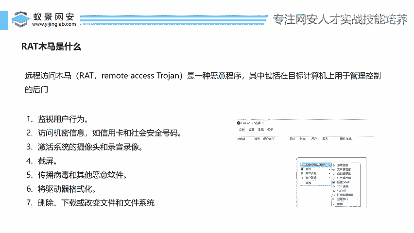

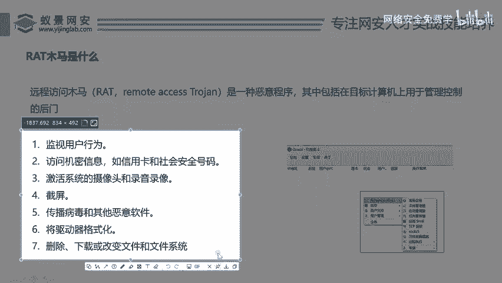

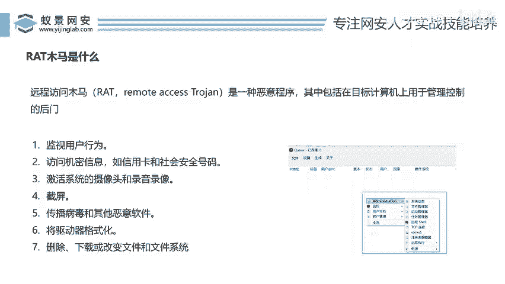

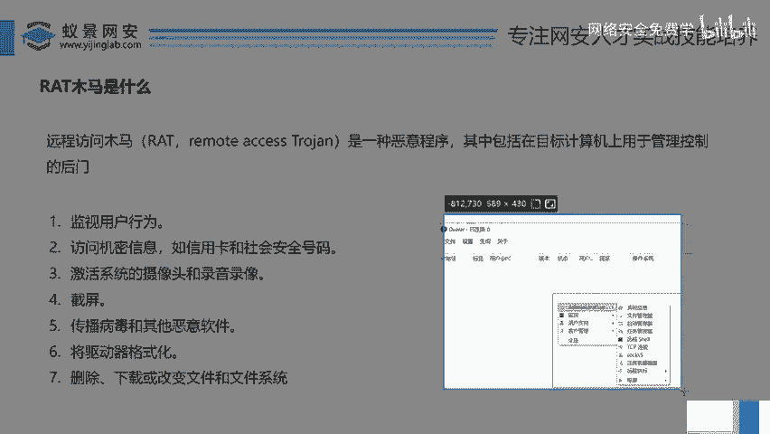

哈，一旦你不马中不码了，对吧？那我们就可以用这种远程控制的工具。你看在这里面你看有可以看你的系统信息，看你的文件管理，看你的启动管理，远程你的shall啊，甚至可以做一些监控类的操作，对吧？好。

那么现在我们打开一个什么啊这样的远程程序啊。😊，好，那么这个呢你看就是一个中了特洛伊木马之后的东西。啊，我们来我们来看一下啊，兄弟们来看一下啊。你看来这是一个什么东西啊。

这个东西它是一个远程控制的软件啊，那么用过通过这个软件，我们可以去生成一个木马。用这个木马，一旦别人点了。你看在这一块哎就会有一条记录。这个记录啊一条记录就代表着你已就已经控制了一台电脑了。好。

那么控制完之后，我们来看看可以在它上面做哪些操作。来，兄弟们，你看对着这个右键哎右键啊鼠标右键看我们可以看到一些选项，比如说来第一个啊，你看一下今呢第一个远程桌面，看到了吗？哎看到这个远程桌面吗？好。

我们可以直接实时的去看对方的桌面，而且对方的电脑没有任何的感知啊。来，我们来看看能不能看到对方的电脑桌面，右键。😊。

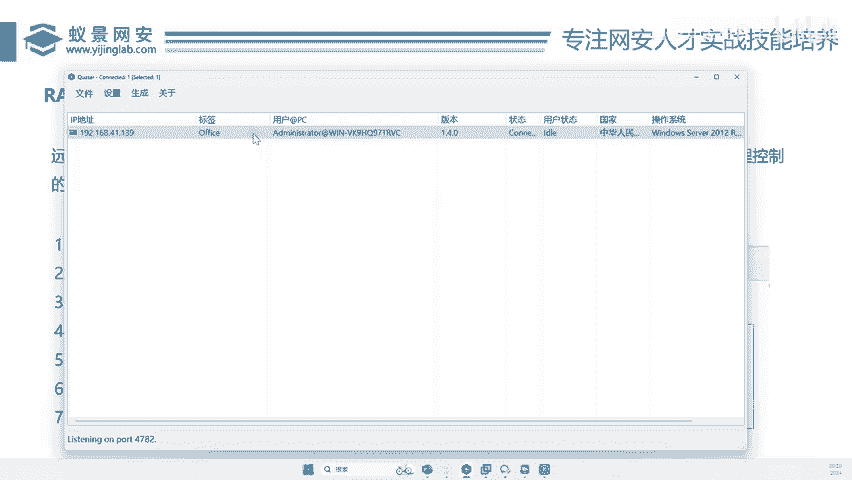

啊，远程桌面好，它会打开一个这样的框，对不对？然后我们点击这个启动。

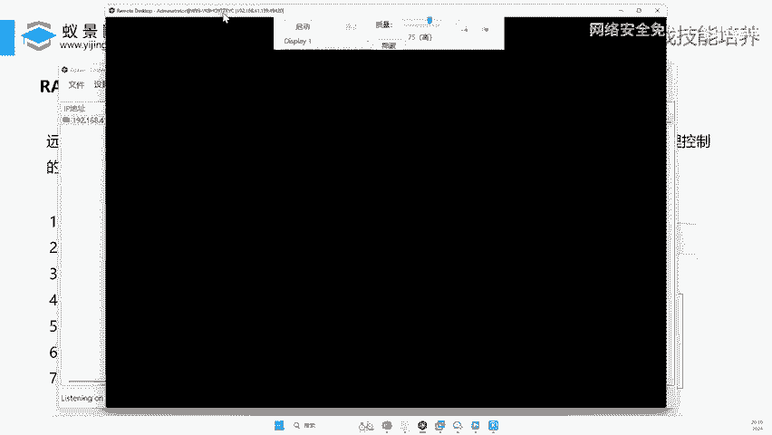

哎，可以看到没啊，你看对方电脑的桌面，你就可以实时看到了。那对方在做什么操作，你也是可以看得到了，对不对？好，那这个时候呢我们可以哎把这个远程桌面给它停止了啊，停止了。好，那么除此做远程远程桌面之外。

我们可以看到它还可以做哪些操作呢？你看可以做这个哎。

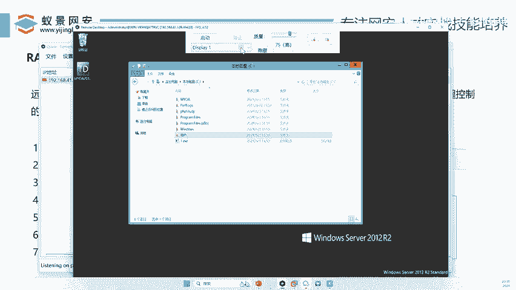

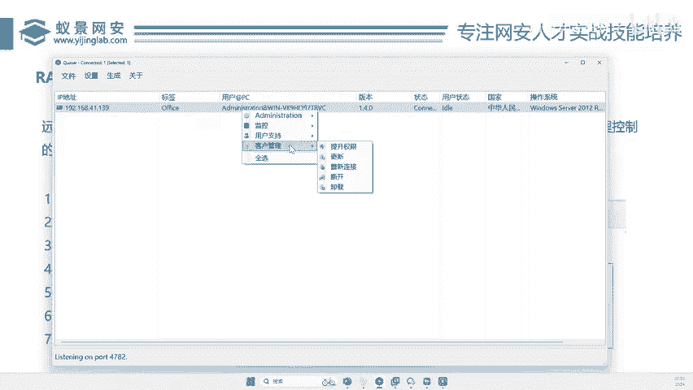

远程执行操作。

哎，我们往这里看，你看比如说呢你想在他电脑上运行一个微信，他电脑没有微信，对不对？好，你就可以的直接远程执行啊，我们来试一下啊，你看右键。😊，啊，我们给大家简单做个演讲，你看远程执行本地文件。

这啥意思啊？就是远程给对方电脑运行一个软件。好，我在我电脑上随便找一个，对吧？好，比如说这个软件吧，你看这个软件啊，我点击一个什么打开好，然后我直接点击远程执行，你看这个执行成功了。

那么对方电脑就会远程执行这个恶意的这个软件，这个软件是个什么东西呢？我不知道对不对？好，假如说这个东西是一个什么倩密的，假如这个东西它是一个黄色网站，那么这个东西病毒就被执行了。好。

远程就在对对方电脑执行了。好，那有没有执行呢？哎，我们再去监控看一下啊啊，来看这个远程桌面启动。😊。

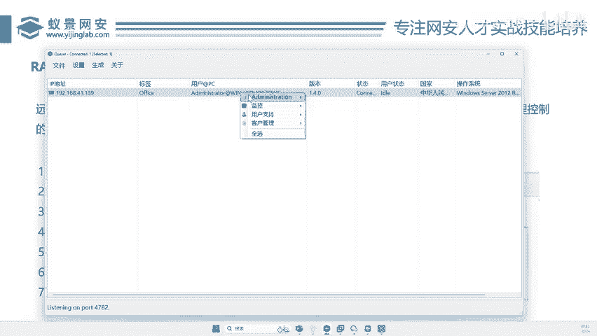

哎，大家看右下角这一块，哎，刚才那个程序是不是已经执行起来了？哎，是不是已经执行起来了？好，同样啊你可以用什么用这种IAT的木马去做更多的操作。比如说呢可以看到它的文件啊，它电脑上有哪些文件，你看到没？

有哪些文件，你是不是一目了然啊，啊，同样右键也可以对它的这个啊任务管理器啊，它的电脑上运行到哪些程序，有没有运行微信，有没有运行QQ有没有运行这个商家组软件，对吧？可以看到它的电脑的进程名啊。

同理右键我们也可以在他面做一些什么？哎，做一些这样的启动管理，看它的电脑开机自启，对不对？哎，都哪做哪些东西啊，也可以右键啊做一些用户支持啊，你可以把你的消息框啊，比如说我们预览哎。

我们在对方电脑上弹一个这样的框，来，我们来试一下，你看来。😊。

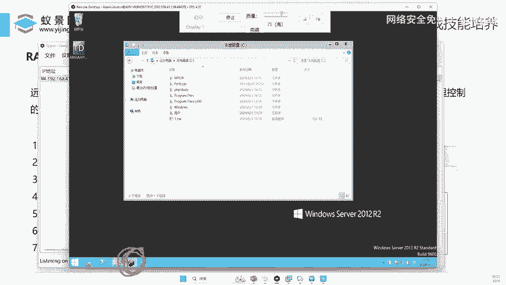

好，比如这里选你好。你好，我是百里。好，这发给他发个短信，你的电脑已经被我。控制。好，我们直接点击发送。那么在对方电脑就会弹个框出来，显示你的电脑已经被我控控制了，对吧？那我们再去监控一下对吗电脑啊。

看看有没有。

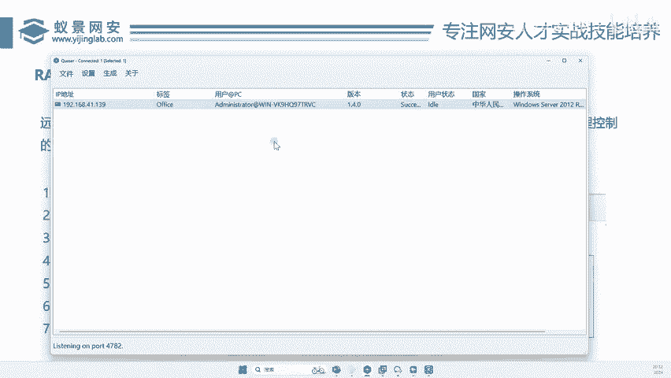

啊，你说这里有弹框，对吧？只不过啥啊，我们现在正在远控没有刷新，这刷新一下就有了啊，你看是不是在右下角已经运行起来了啊，一会呢我们可以实时去这个电脑里面看，可以明确看到这个弹框已经被弹出来了，对不对啊？

只不过这里现在有一个这个白色的这个啊这个东西啊，这个磁盘管理把它给挡住了啊而已啊，我们看不到啊。😊。

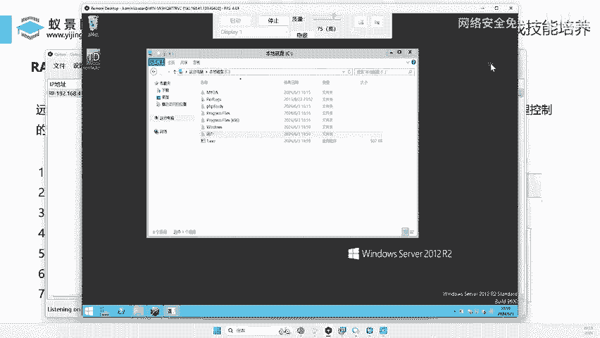

好，那么这个就是这个RAAT对吧？这个就是RAAT看到没啊？是不是非常简单啊？我们只要有手啊就行，看到没有？有手就行啊。你看在这里面可以做任何操作，也可以记得它键盘，对吧？它电脑上键盘敲了哪些东西。

你在这一块也是可以实时做一个监控的啊啊，也可以做一些绘画，对吧？也可以给它断开卸载提全啊等多方面的操作，好吧，那这个呢是什么？就是我们的RAAT啊，可以看到是不是非常的强大。

那么你们知道在我们国内哪些有哪些著名的RAAT吗？你们知道吗？😊，有一个东西叫做灰鸽子，知道吗？辉鸽子听过没有？大家有没有听过辉鸽的这个东西？辉鸽子在10年前就是1个IT木马啊，专门去控制别人电脑的啊。

那么这个灰鸽子啊，它是符合中国国情的1个IATT的木马。那么这个东西它干嘛啊？他能看你的QQ号。啊，看你QQ号有没有上线，你电脑有没有登QQ啊，跟QQ跟谁聊天。为什么你知道为什么黑鸽子要加1个QQ呢？

😊，啊，因为当年啊没有微信啊，那么很多人办公啊，做买卖呀，都是通过QQ群。所以说这个辉鸽子啊最大的功能就是什么到QQ啊，电脑一旦中满了，你的QQ上的东西我都知道啊有没有上线什么的啊。

所以说当年这个就是灰鸽子啊，这在我们国内闹的大家是灰鸽灰鸽子病毒嘛，是是非常的火热的啊。好，那么这个木马我们先了解了，一会儿我们再详细去讲这个木马这个东西怎么去生成，怎么给植入到别人电脑里面去。

我怎么去伪装，怎么去做秒杀好不好啊，我们先这里啊先给大家简单的看了一下啊，这个IT木马，它能干什么啊，是非常直观的，只要你有手对吧？有手就行啊，有手就行。好，那么这个知道之后呢，我们来来看下一个。😊。

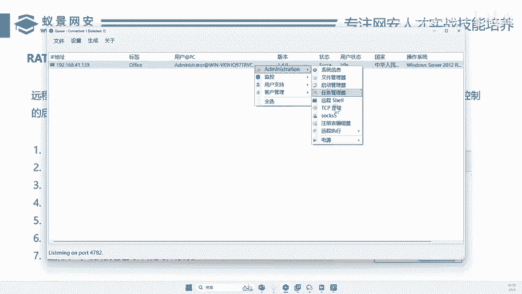