# 2024B站最值得看的黑客教程 ｜ 网络安全／渗透测试／内网渗透／漏洞挖掘／web安全／kali linux／红队靶场／CTF／信息安全 - P132：控制网站的方式 - 网络安全免费学 - BV1uBsTetEow

好，那么接下来我们就来看一下啊，怎么去搞哈。首先呢哎我们以网上案例为例啊。比如说呢我们想搞一个网站，对不对？我们以一1个OA系统为例啊，就假如说我们要搞1个OA好吧，那么我们去网上先找一些吧啊。

我还是讲这些东西啊，尽量贴合一些实际，对不对？啊，给大家讲，我们平时在做这种渗透攻坊中啊，到底是一个怎么样的东西啊。好，在这里呢我们搜一些网站来啊，给大家看看啊，我们今天的这个虽然是靶机啊。

但是它也不是完全是靶机啊，网上会有很多这样的案例的。好，我们来找一些OA系统啊，比如说这里啊，你看我这里一找啊，你看我在这个网上啊，一共找到了个十百千万啊，16000个啊，16000个这样的一个东西啊。

来我们随便打开一个看看啊。😊。

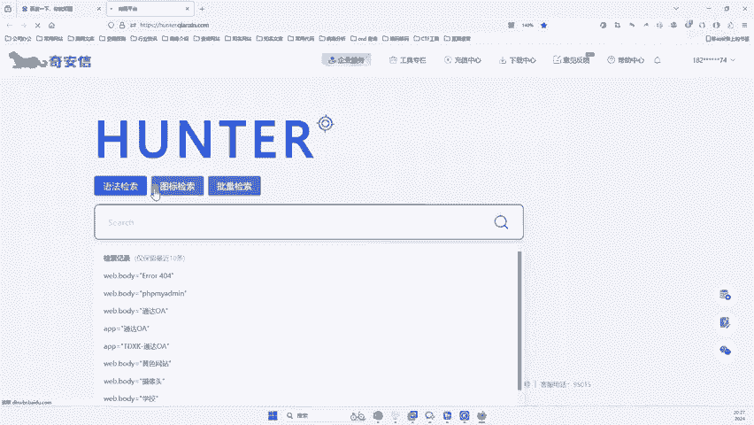

比如说这个你看OA系统对不对？这个网站你想搞定来，我们再打开几个啊，这个网站对吧？2024牛年大吉这个网站好，我们再多找一找，对不对？啊，当然这里呢我不我们不是说当然去搞这些东西啊，只是给你看啊。好。

来先给大家打开啊。😊，啊，把这些。多打开几个啊，大家就会更直观一些。你看这个也是最新的啊。我们找一些比较老旧的一些OA啊。好，也就是说今天你能按照啊我这种方法啊，你看这个上海音乐厅啊。

它的这个系统记住啊，请大家记住这个页面，一会就要搞它，好吧，记住它啊，来我们再多找几个有没有符合我们。😊。

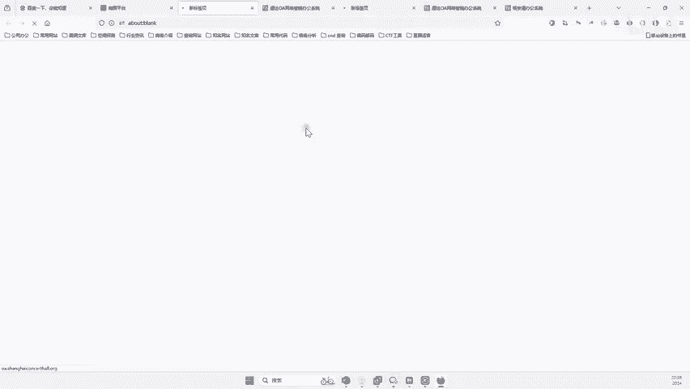

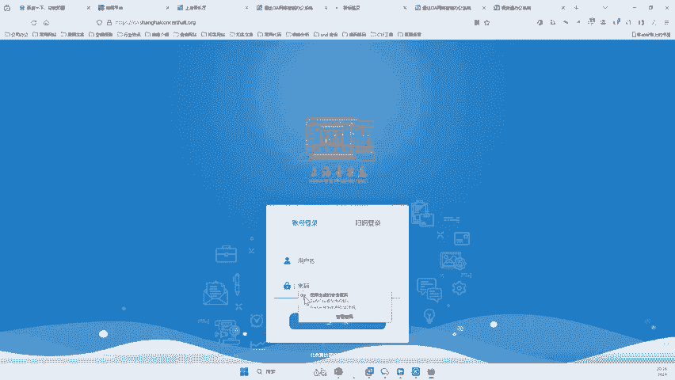

靶击的一些OA。啊，好，那没说这个OA是干什么的啊？OA就是办公系统啊，很多公司用OA去进行什么办公啊，请假啊，请假申请的。记住啊。好，我们看可以看到网上是不是有很多这样的OA系统，对吧？哎。

还有这个对不对？啊，这个你看这是个OA好，那这个是什么OA呢？我们来看是不是这个一个公司的OA啊，里面它有公司名啊，可以看到啊，上海音乐厅啊，北京经漫维科技啊，广东世安啊，对吧？

他们的一些OA系统都会在暴露在互联网上好，那么假如说你要攻击这个系统啊，然后给他种1个IT然后把他们的电脑啊攻进去，对不对？实施远程监控，那么应该怎么去做呢？啊。

那么我们刚才在网上是不是找到了这么多系统。好，那怎么去做呢？😊。

啊，怎么去做啊，那么我们平时在工作中就会遇到这样的问题啊，假是你去网安工作，对不对？因为我们网络安全就有一个岗位是干嘛？专门模拟黑客技攻击。假如说呢这个一个人给了你这样的网站，让你把它攻进去。

那怎么攻啊，当然我们直接攻击互联网啊，我们现在给兄弟们找的这些东西，是不是都是互联网真实的东西，你看像这个什么天河投资，他都是真实的OA这里面你一旦攻进去了，就等于说你打到人家公司里面去了。

人家公司的员工啊，公司的办公请假财财财务啊审批啊，你啥都知道了啊，那一旦打进去，你如果没有授权，你就违法了啊，所以说我们不可能直接去打互联网啊，要小心对不对啊？但是违法行为啊。

所以说但是呢我们今天讲了这个东西啊，我们我会把它复制到我本地来给你模拟打一遍，对吧？你在我本地会了，那么你在互联网上你也就会了啊。😊，好，所以说你看我们找到啊目标网站啊，就是你要找到的网找到一个网站。

然后怎么去找这些OA产品的漏洞啊。那么在我们国内国内啊，针对这些OV啊，一般来说。😊，啊，都是用什么用。恩对。啊，N对漏洞。好，什么叫N倍漏洞啊？就说以它这个系统的漏洞已经公布在互联网上了。

但是它没有修复啊，我们可以利用这种N倍的漏洞啊去打这个网站就可以了啊。其实非常简单啊非常简单好，这是我们的第一步，对不对？一定要找到网站，然后啊第二步干嘛呢？哎，就要利用这个工具进行测试了，对不对？好。

那么有人说了啊，李哥，我是如何知道这个网站有没有漏洞呢？啊。那么在我们这个网络安全学习里面来啊啊，大家知道有一个东西叫做什么叫做工具，对不对？😊。

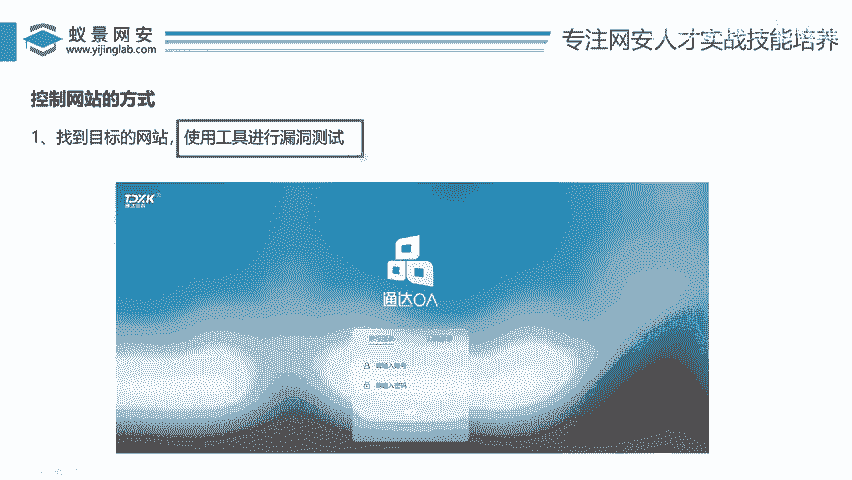

啊，这叫什么安全工具。好，那么这个安全工具啊，其中有一个功能叫什么啊？自动测试漏洞。对不对啊？那我们就可以什么用这些工具自动去测这个网站有没有漏洞了啊，如果说有。of course那我太幸运了，对不对？

好，那我们来测一下啊，那么今天再给大家带来哪个自动测试漏洞工具呢？哎，大家可以看我这个啊这个东西啊，我一会儿可以去互联网上给大家测一测，对不对？当然啊我要给大家说一下啊，测试漏洞啊啊基本上没有太大问题。

但是利用漏洞做坏事就有问题了，好吧？好啊，你看来我们这是一个什么系统，你看。😊，这个工具专门可以去测试漏洞啊，你看它可以测试这个通达VA的，对不对？好，那么假如说呢我们想测这个网站，对吧？

你把它复制一下啊，复到哪里？比如这个网站对吧？把它复制一下好，复制到哪里了，直接复到这里面来啊，然后直接点击验证。😊，啊，他你看。看到没啊，自己往上看。测出来了没有？存在存在存在看到没？

存在漏洞存在漏洞。记了等于这个网站，现在我一下就打进去了啊，大家记住啊，现在我是不是啊测试了一个真实网站，看到没？验证了一下目标存在，可能存在就是存在。好吧，你看第二个不存在。

不但是从目标存在这个看到没？😊，记住这个看到没？存在。好，那你说存在了，我能不能攻到这个系统里面去，一定能攻啊，但现在我不能攻了，我再往下攻，它就违法了。兄弟啊，所以说我只能给你到这为止了，点到为止了。

好不好？好，那你说那接下来我想看一下啊，再打进去长啥样子怎么办啊，那我只能把这个网站，对不对？挪到我本地来给你测了啊，如果说直接再去互联网测就不行了啊，刚才已经有点差边了啊，本身它我们刚才那个直接测。

它就有有一点差边，对不对啊？那么再深一步测，那就更差边了啊。好，那么接下来啊我们把这个系统呢移到我们本地来给他测一下啊。😊。

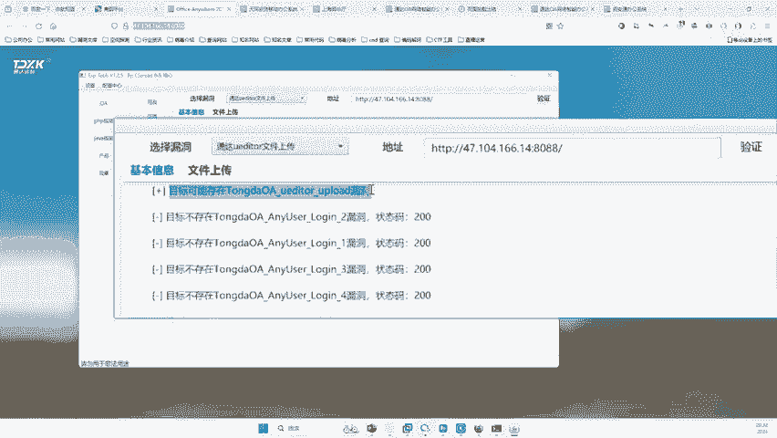

那我在我本地啊搭了一个跟他一模一样的一个系统啊。

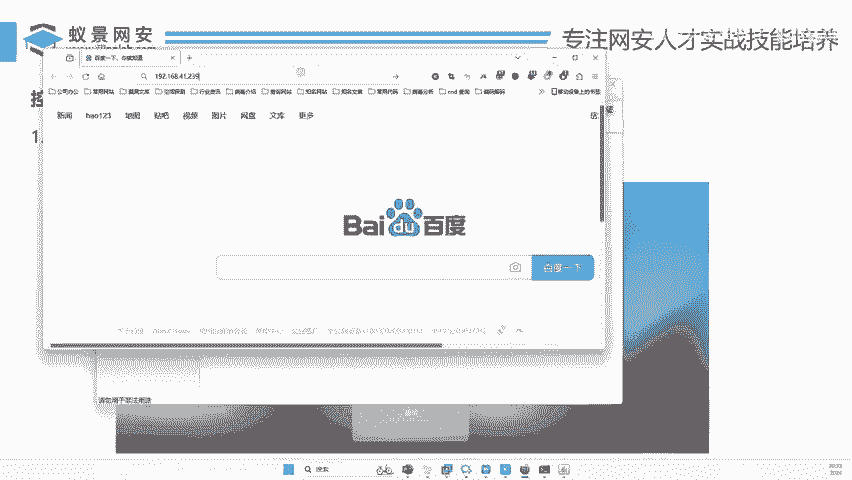

好，我来看看对不对？大家往这里看。好，你看这个网站是不是跟刚才那个网站一模一样啊，长得一模一样啊，他们是同一个版本，同一个型号啊，来我们再测一下这个我本地的这个啊，好，往这里面一放，直接点击啊。

大家记住啊，刚才测网站的时候，大家看看啊，这是它的一个结果啊，这是刚才这个是真实网站，对不对？好，我们测一下我们的这个靶机啊啊验证。😊。

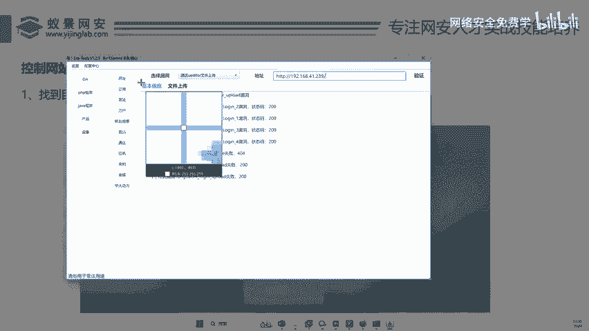

啊，我把它点个2好吧，2啊验证。来，兄弟们往这里看。一样吗？哎，这个为大家截图截全一点，好吧。😊，啊，来看一下啊。啊，这个是靶机。这个是靶机，这个是真实网站啊，这个是真实网站，对不对？好。

我们来看看真实网站中，这里你看目标可能存在这个漏洞啊，在我们靶机里面来看，目标可能存在这个漏洞啊，两个是不是一样的啊，这里我们真实网站这里存目标不存在这些，但是我们靶机里面是吧，目标存在这些。😊，哎。

所以你看哎，但是他们两个同用的是啊，就是这个第一个对吧？目标可能存在这个目标可能存在这个。哎，所以说我把机的漏洞，跟它真实的网站漏洞，哎，有两个是一样的，有一个是一样的，对吧？就是这个什么啊。

目标存在这个漏洞。好，那么这个漏洞能干什么呢？啊，比就说这个漏洞能干一毛系统要怎么搭呢？啊，这个网上去找一找就找出来了啊。好，那也就是说那这有这个漏洞，我能怎么办呢？哎。

大家知道漏洞又通过漏洞是干嘛的啊，来给大家写下啊，我们为什么要找漏洞啊，通过漏洞植入木马？😊，就这么简单，我们要去通过漏洞去植入木马，对不对？好，那接下来要给大家去展示如何通过这个漏洞去植入木马呢？

对不对啊，我怎么就可以IATT去这个木马呢？好，那接下来我们就来看一下啊，那么我们给大家提供的这些工具啊，它就自动自带一些什么哎一些木马植入的功能。好，那接下来啊给大家说一下怎么植入。😊，好，来。

那么他说了目标是不是存在这个漏洞啊？好我们验证一下，你看是不是存在。好，我们点一下这个漏洞，这块有一个文件上传。😊。

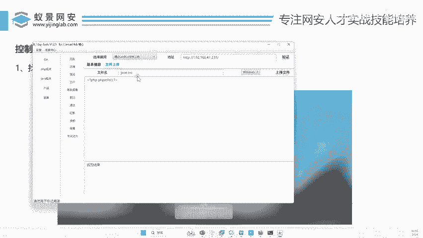

好，那么这里是不是啊这个这个工具是不是我们可以在这里啊上传一个什么文件。那么这个文件我们可不可以写一个东西，写一个什么自动下载木马，并且。

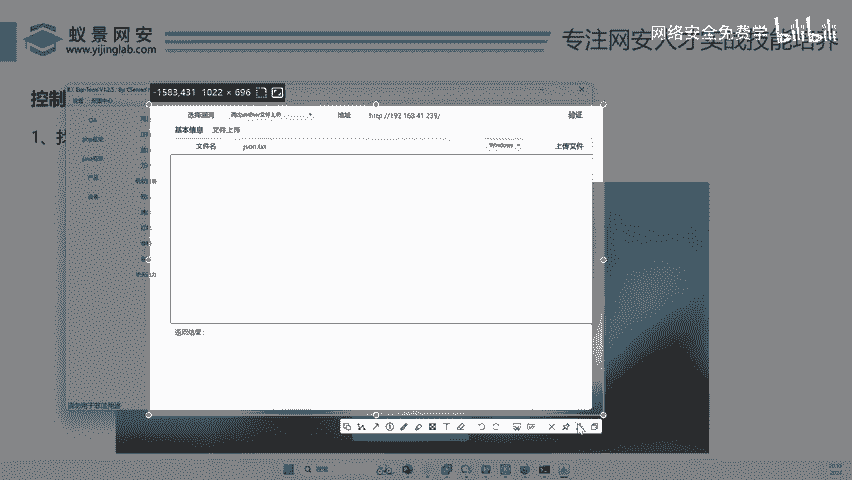

并且运行的程序啊，的什么的呃这样的代码。对不对？大家可以看到这个工具里面是不是可以支持一个自动上传一个东西。好，那我们可以在上传的东西里面就可可以写成自动下载木马，并且去运行这个木马啊这样一段代码。

然后我们把这个东西传到对方电脑上，然后对方电脑运行一下。OK那对方电脑就会自动去下载我的木马喽。哎，就这么简单。好，那么这个东西应该怎么去做呢？哎，那李哥其实在这里呢已经给大家写出来了，对不对？好。

那接下来啊我们把这个呃内容啊给你写过来啊。😊，来，我给大家说下这什么意思啊，我们把这个要上升的东西啊写过来。😊，好，来这里随便写一个，我们写一个叫百里点。点点AP好，我先上传一下啊。😊。

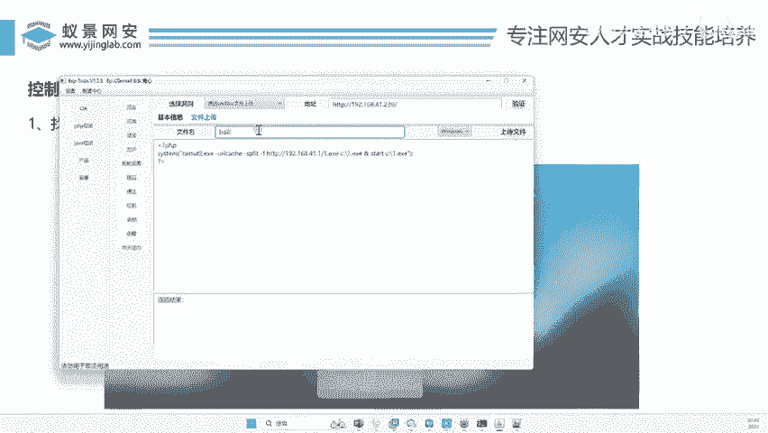

好，我们再这样啊，在这个里面写这样一段代码。😊。

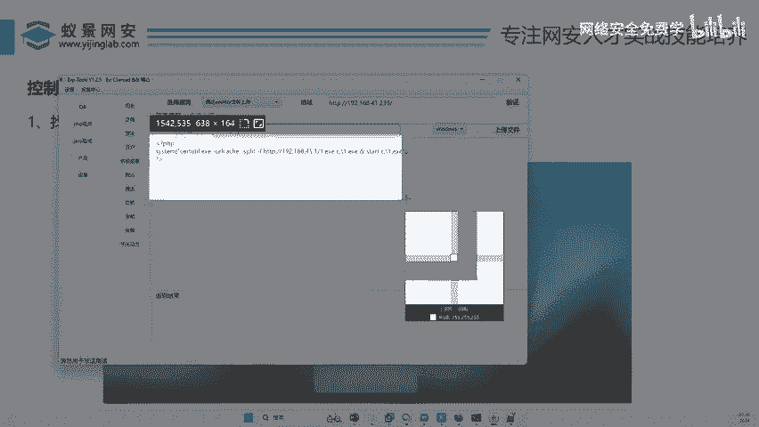

好，然后点什么点上传。好，点击上传，可以看到没？上传成功啊，上传成功。来，我把它写到这里来。😊，啊，好上传成功来这个什么意思呢？啊，看一下啊，这意思就是说哎你的这段代码已经被传到这个地方了。啊。

那么这一段代码是什么意思？来，我就要给大家解释一下了啊。这段代码意思就是这样的啊，你看这个啥意思？就是windows的一个远程下载的东西啊，来我简要给大家说说一下这句话什么意思啊？

就是说啊从这个网站去下载1个1。1XE，并且把它保存在C盘里啊，保存在C盘之后呢，然后去运行这个E1。1XE。😊，啊，这句话意思就是什么啊？这串话意思是什么？哎，就是从这个网站上去下载1个1。

1XE这1。1XE是啥啊？就是我们所说的木马。😊，啊，木马好，然后把它保存在对方电脑的C盘里，然后并且去执行这个木马啊，那这个代码就这个意思，对吧？

那么我们现在已经把下载木马执行代运行木马这一段代码已经传到对方网站里了，对不对？但是这里还有一个问题。好，那有一个什么问题呢？这个木马怎么来送代啊，那说那这个1。EXE这个一楼特洛伊的木马从哪里来呢？

啊，那这里要给大家讲讲了。哎，木马怎么去搞，对不对？好，我们就回到刚才哪里呢？回到刚才我们的这个IT的这个工具里面来啊，我们以IT工具啊，给你做一个啊这个展示，好吧？😊，好，这个大家稍等啊。

我打开我的木马啊。哎，我看看我的这个IT啊。

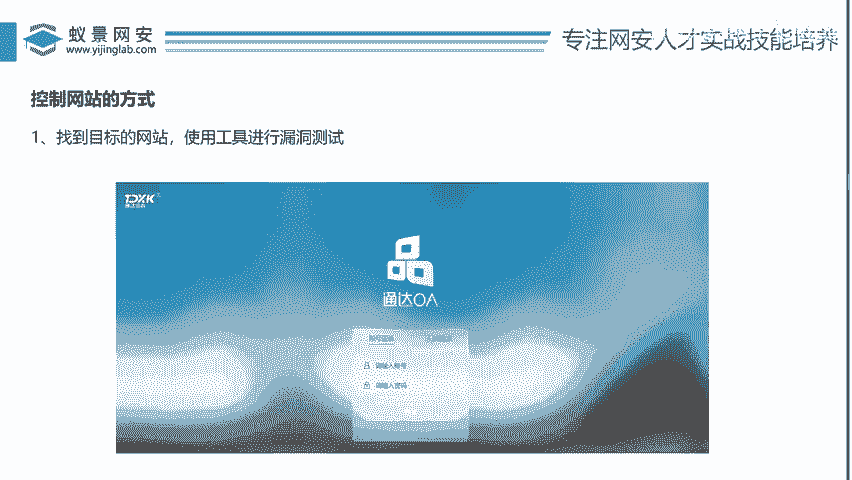

来，我们首先给大家说一下1。ES怎么来啊。我们刚才是不是给你们展给大家展示了，哎，这是一个什么RAAT的什么远控程序。好，那么这个程序它是干嘛用来连接木马的，对不对？一旦木马被运行啊。

在这块就会多一条记录，多一条链接出来，对不对？好，那么怎么用这个工具去生成一个木马呢，对吧？那木马在哪里呢？OK大家看看啊，每1个RAAT它这里都有一个东西叫做生成？😊。

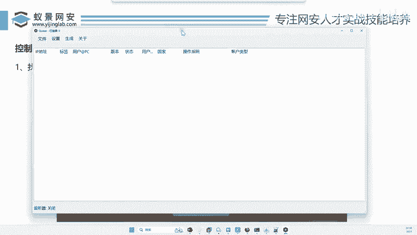

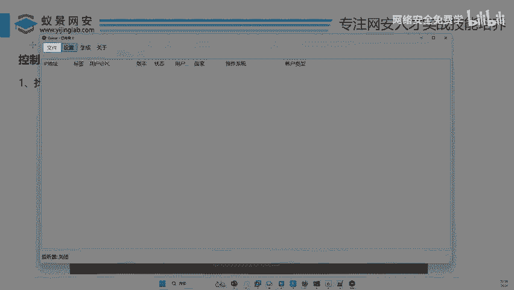

哎，生成的东西，这个生成就是生成木马意思。好，我们点一下这个生成啊，来看看这是它生成木马的一些哎它的一些啊规则。首先第一个哎你可以选择一个标识，这啥意思呢？就是你生成的这个木马在运行的时候啊。

它的这个啊给你们看一下啊哦叫什么叫。😊，呃，我给你们打开这个任务管理器啊。啊，什么叫设备标识啊？好，放大下啊。来，我们来往这里看啊。来我们比如说哎在这里面来啊，大家看一下啊。😊，好，服务啊。

这个进程对吧？哎，找一些你看。大家可以看到啊，在一些程序运行起来，对不对？它这里面是有一些名字的。那么你想把这个木马伪装成什么？比如说你想伪装成这个啊这个这个东西，你就把这个标识呢写成它。

你想伪装成office，你就把它写成office，对吧？让它看起来像一个真的东西一样？就伪装这个木马，因为我们知道木马需要伪装嘛啊，所以说你看比如说我们在这里写什么写office好。

那这个木马它就伪装成一个office的这样的一个程序名。好，然后这里还有一个一些互斥的一些什么进程，你都可以设置一些随机互斥啊，这可以自行设置，对不对啊，你看自行设置啊，然后呢连接设置啊。

这是什么意思呢？就是木马连接谁呢？啊，木马往哪里连接呢啊，一定是连接黑客电脑，对吧？所以这里写黑客电脑的IP啊，一会木马运行起来，连接黑客电脑IP好，那这里还木马还有一个什么安装程序。

就是说一旦这个木马运行的时候啊，我们要这个木马运行的时候，对不对？木马是怎么运行呢？一旦运行，你看首先这个木马会直接安装在这里。😊。

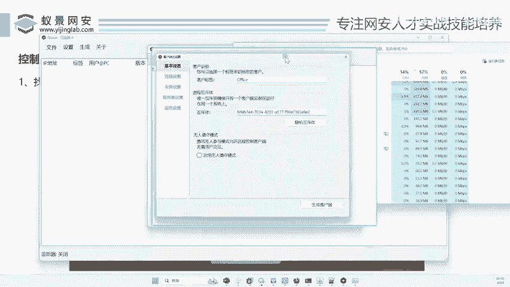

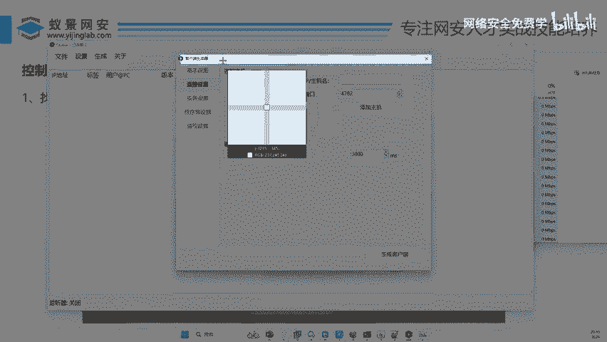

就是你的电脑啊一旦运行了那个1。1XE对吧？那个1。1X就释放，把这个木马释放到你的C盘下的这个这个这里来啊，然后这里就可以更改安装到目录，你想让它安装到哪个目录里面就安装到哪个目录里面。

并且可以将这个木马设置成隐藏属性什么意思呢？就一这个木马运行被中了，你的电脑查不出来，它被隐藏起来了，都是可以的。你看我们在这里选安装客户端对吧？将子目录设成隐藏对吧？将文件属性设置隐藏，对不对？

计算机启动时运行客户端，这啥意思？开机自，也就是说我们只要这样一点，这啥意思？你点完之后，首先你木马的文件跟木马的文件名，就是这个啊啊子目录啊，就这个SUB这DNR这目录就被隐藏起来了。

你用肉眼看就看不到了然后呢并且你的木马在开机的时候对不对？还会自启启动的时候就是它的名字这就可以改比如你把它改成一个office啊，改成一个什么CMD都可以那你就跟真的一样。

然后我们点击这个生成就生成这样一个木马，这些都可以。😊，自选的对吧？这个就是IAP的木马，对吧？你可以自动去选择它的一些属性。这个木马释放的时候，它安装到哪里，要不要隐藏，要不要开机字体都是可以的对吧？

好，还有一些什么程序题，你甚至可以让这个木马伪装的更像一个office。比如说它的产品名365，对不对？描述啊，因为我们知道在这些呃运行起来的时候，你看它呢它的这些东西，对吧？你看属性里面。😊，啊。

它是可以看到你看兼容性数字签名的，对不对？安全啊，详细信息，你看到没啊，你看一些正常程序，它是有一些签名的。比如酷狗，哎，我们啊可以打开一些啊，比如说这个。😊。

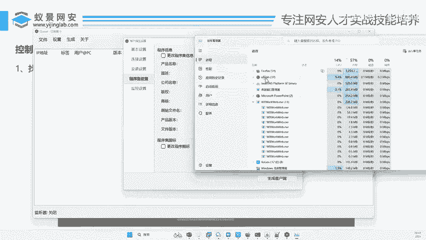

啊，来找找啊，看有没有一些签名啊，终端啊，这个没有啊，好，把它点开啊。微信对吧？啊，以这个还是以这个为例吧啊，属性我们可以看到这个内容里面是不是有一些属性啊。好，我们就可以去设置这些东西啊。

把这些版权啊。你看产品名版本号啊，你可以在你的木马里面，对不对？将这些东西都设置出来，它的几点几版本啊，大大小都可以啊。那我们在我们的IT里面啊，这个生成木马这里你都可以设置，对吧？

你看可以更改啊的商标什么都可以改，也可以改这个木马的图标图标，比如说你把它改成一个什么office的图标，改成一个word的图标都没有问题。然后你的木马生成之后就可以了。然后监控设置啊。

也可以启动这个什么键盘记录，对不对？好，就是说你一旦设置键盘记录了。O那么这个木马还可以迟时的去监控你的键盘，你的键盘上都敲什么东西O那这个就生成木马了。好，那在这里我给大家说一下。

等于说了这个东西免不免杀。😊。

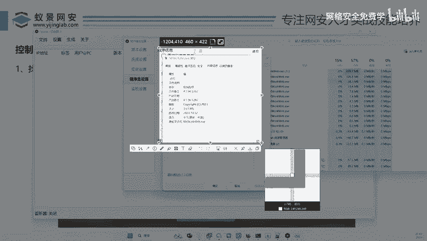

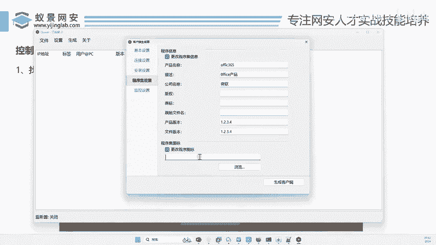

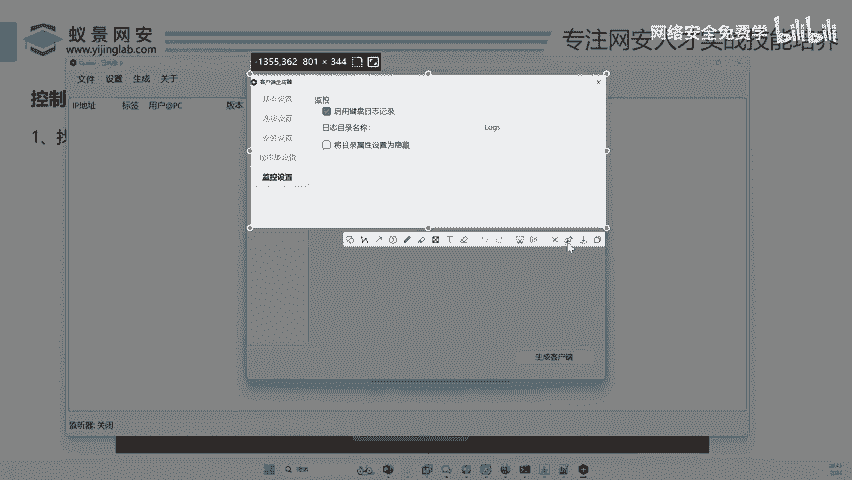

对不对？好，那一旦我用这个工具生成了这个ID码免杀吗？啊，你们说下秒杀吗？啊，免杀吧啊，肯定是什么不免杀的。啊，来这个给大家说下什么免杀，什么不杀啊。一般来说，开元的不免杀。😊，啊，没开源的。免杀啊。

这就是你们的跟别人的不足之处。什么叫开源的？也就是说这个IIT的这个程序，它是开源的开源的意思就是说任何人都可以下载，我给到你就是在互联网上能传播的啊，就是我的网上可以随便下载到的东西啊。

我在互联网上能下载到这个东西。比如我们现在讲这个东西，他是不是在互联网上能下载到，我可以给到你我给你了，你也可以用啊给别人的别人用。那你想想那些安全公司能拿到吗？他也可以拿到拿到对吧？

一旦他们这个东西能在互联上传播，那这个东西它就是开源，那么开源他们就会研究这个工具啊，他们就会把这里面的生成木马啊，直接给你么pass掉，就给你禁掉的对吧？

什么叫没开源没开源就是我做的这个IT我不公开那其他的杀毒软件厂商都不知道我有这个东西啊，那我生成的木马，我就免杀。那你们想要生成免杀的木马，就要自己去做一个IIT的程序。

自己去研究这个就属于更高级的二进制的内容了，明白吗？那么接下来哎我们就带着大家去生成一个木马看。😊，用刚才的东西啊，能不能正儿八经的去控制一个网站，好不好？

那么后续你也可以对你的这个啊这个木马进行一个秒杀，都是没有问题的。好的，那接下来啊话不多多，对不对？我们直接开整，直接开干，看今天O我们用这种方式到底能不能控制对方电脑，好吗？😊，好。

那我们按照我们的步骤，对不对？第一步先在干嘛呢？生成一个木马，对不对？好，基本设置。哎，我们这里假如设置成成什么？叫做1个OFICEoffice，对不对？随便生成。😊，好，那么这些呃目录呢。

我们就可以给他一些啊默认目录啊，然后开机字体都给他给他上，对不对？程序名，你版权都可以写上啊。假设像我这样一写好，图标我们就不改了，对不对啊？太麻烦了，还需要找图片啊，好，可以开启这个键盘记录啊。

目录实性设为隐像，没有问题都可以。然后直接点击生成好，我们直接这里生成的时候啊，一定要记得把这个删染关掉啊。好，我们在这个电脑上啊，电脑到桌面上生成一下啊。好，这样呢我们随便起个名字啊。

比如说呢叫做啊一啊，一。ES。因为刚才我们是就就是要生成一，对不对？好，直接把它写成什么一啊，点击保存。😊，🎼好是不是保存了successful，对不对？保存了好，保存成功之后来。😊。

我们来看这个木马在哪里呢？哎，我给大家拖过来看一下啊，就在这里啊，那么这个木马现在就被我们生成了，对不对？这个是啥东西？就是我们说的RAAT啊远程访问木马啊。

那么现在我们就要把这个东西植入到对方刚才的那个OA系统里面啊，植入到对方的OA系统里面去，然后让它多种中毒，对不对？好，那现在怎么植入呢？来兄弟们往这里看啊，那么刚才我们是不是给大家讲了啊。

哎这个在这个用这个工具啊，我们是不是写了这样这样一段话。😊。

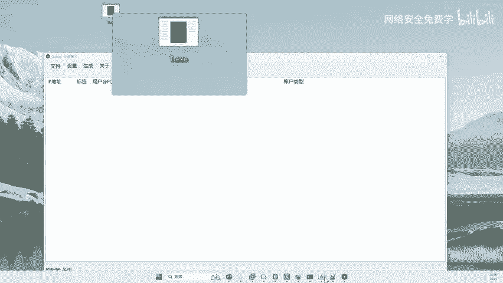

对不对啊？你看啊，那这个对方电脑要做木马，我们肯定要通过漏洞，对不对？那么可以通过这个工具可以自动寻找漏洞。那么我们已经写了这样一段话了啊，这样一段话什么意思呢？是不是哎去这个网站下载一。

1XE那这个网站是哪里啊，其实是我的电脑对吧？我把这个木马放到我的电脑里面去下载这个1。1XE对不对？然后下载到对方的C盘里，然后去运行这个1。1XE对不对好？现在我看好了，我点击上传。

那么这段话哎这个东西是不是传到对方电脑了，现在我想运行它怎么运行，哎，大家只要把它复制一下，啊，然后怎么办呢？好，然后我把它写到这个网站里面来，我只要这么一回车，那么对方电脑就会运行刚才那段话。

那段话什么意思呢？就是自动去下载这个木马，然后并且运行它啊，所以说现在我只要回车一瞬间啊，那么在这一块它这个电脑应该就会上线了，对不对？好，那接下来哎我们就来带大家去回车一下啊，看这个东西啊。

到底能不能上线，到底。😊。

能不能成，对不对？好，兄弟们来，我们准备好倒计时啊，那么接下来哎李哥就要带着兄弟们啊去实际啊，给大回车一下。好，我们看看今天这个结果行不行啊。来，兄弟们来开整了啊。好，我找到这个网站啊。好，现在啊。😊。

回车。回撤了，对不对？好，那么对方应该就会运行了，对吧？然后我们在这里等一下啊，对方现在要去下载，对不对？下载完成之后还要去运行啊，这里不对啊，我们还要设置一下监听啊，把这个监听要开启啊，监听不开启啊。

它这个上线不了啊，我们等一下哎，看到没有？😊，看到没有？来，大家往这里看对方的电脑是不是现在已经上线了。看到没？哎，是不是已经把我们的木马成功的植入到对方电脑里面去了？哎，并且成功运行起来了。好。

那么我们去C盘里面看一下到底有没有这个东西啊。来我刚刚说了，来直接点开文件管理器啊，大家往这里看，你看在对方电脑的C盘里面是不是下载到了这个1。1XE看到没是下载到了啊，这个1。EX是哪个E1。

EXE其实就是这个1。EXE对不对？因为刚才我们通过漏洞啊，让它已经去远程下载了。好，那么同样来我们来看看可以对这个电脑做哪些操作呢？刚才课前已经给大家在讲了，对不对？右键啊是不是可以去执行一些文件。

😊。

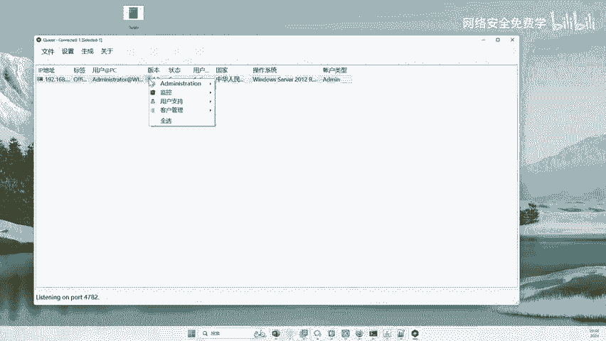

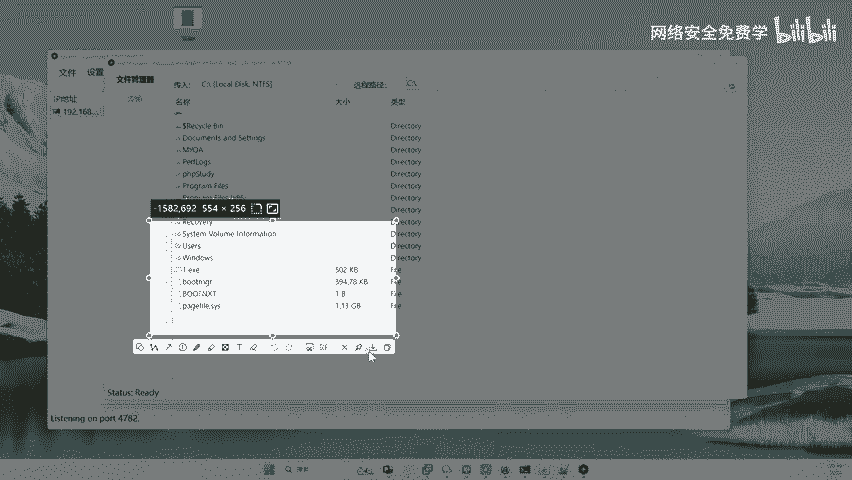

啊，可以去执行一些页面编辑的注册表，看到没？我们可以看到这个对方电脑里面注册表全都看到了。好，那我们在右键去看什么，看它的系统信息啊，可以看到对方电脑它的一些版本哈，对吧？

在这里我们可以看到对方那个OA系统，它的版本是不是windows server2012啊，包括它的一些啊等等的一些信息，对不对？一些信息。当然这个是我本地的操作，对吧？好，那这里问题来了，兄弟们。

你们能不能通过同样的方式。😊，把刚才我给你看的那个公司来往这里啊啊，这里刚才是不是给大家展示了这么多公司的OA系统。那你说你能把这个网站控制了吗？啊，一定可以，对不对？我刚才跟你说了。

这个网站也存在漏洞。那你现在要做的就是啥？你直接把IP放到对方电脑上去。啊，那你就会拿到一个真实的。这样的东西。真实的这样东系。好，那么这里还有一个问题，有人说了好，那我控制它之后，我为什么要控制它？

啊，我为什么控制他呀？我难道就是为了满足于满足我的变态思思想吗？哎，我难道就想右键啊，给他装个逼吗？来给他装个逼怎么装来右键对不对啊？这个比如说啊关机啊，难道你就想给他装个逼吗？哎。

直接给他把电脑关了吗？对不对？那肯定不可能啊，对吧？你费了九牛二虎之力啊，学了安全技术，你就去为了给对方电脑装个逼啊，那肯定不可能，那那不现实，对不对？那有些人还喜欢这样，对吧？哎。

给学员发送一些消息弹框啊，不是你你好，你看你好，哎，你好，哎，你好，怎么了？哎，我是百里。😊。

啊啊，我是黑客啊，你完蛋了，对不对？好，你可以给他发送这样的框来，我们来看看能不能发。刚才是不是给兄弟看兄弟没直观看到。好，我们现在去给这个给你看一下啊。😊，嗱。啊，为了让大家看的爽一些，对吧？来。

我把这个把机直接拿出来啊，拿出来给你们看。

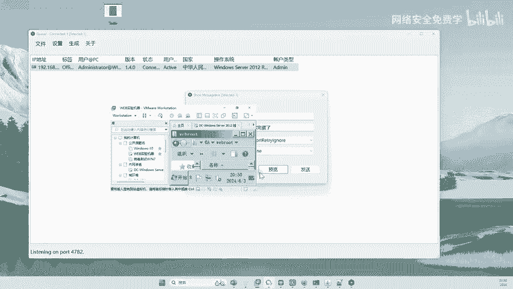

来。

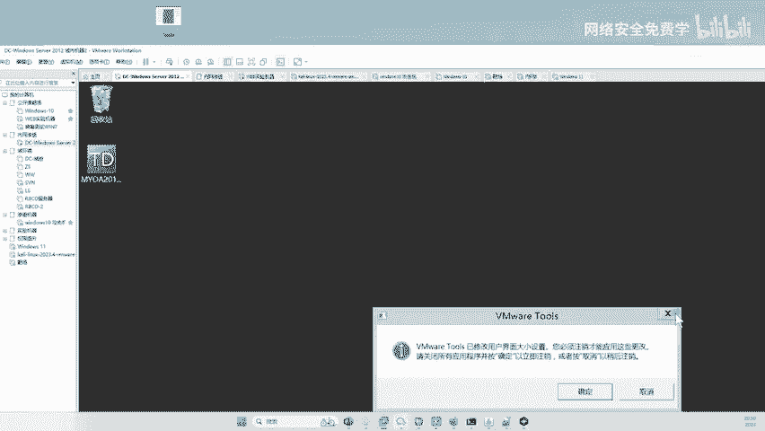

啊，我给你放小一些啊，我们稍作等待啊。😊。

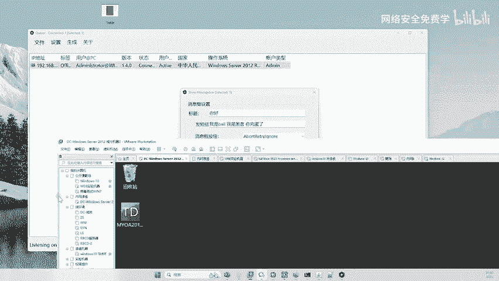

啊，把它放小一些啊。🎼好，你看这是把机，对不对？啊，把它放到这个最中间OK来，现在我给他发弹框啊。😊，你看啊我会发你看发送。看到没？对方电脑秀不出来了，我是百里，我是黑客，你完蛋了。

那么对方电脑就会产生这个这样的效果，你看终止就终止了。好，我们在这里也可以给它家运行一些程序啊，比如说你看右键我们给大家可以远程去运行一些文件啊。比如说你想给对方电脑啊，远程远程运行一些word也可以。

对不对？来，比如挂挂在哪里？等会儿我可以告诉你啊，来，我们来看给大家远程运行程序，可不可以啊？用这个IT啊。😊，比如说呢想给他远程运行一个微信啥的哈，我们来看找一找电脑上有没有微信啊。好。

比如说这个吧啊这个软件哈来打开来往这里看啊，我直接点击远程执行。😊，看到没？看到没？对方电脑是不是直接打开这个程序了，看到没？这就是那个程序。😊，啊，是不是直接远程去打开了。

对方电脑原来是没有这个程序的，没有这个软件的啊，直接被我远程去运行了啊，直接这个程序在哪了？你在你电脑上所有东西啊，比如你看这里可以找，比如说再找一个啊，比如说一些啊微chat，对吧？来。

我们给它远程运行一下微信啊，这是Vga，Vga不行，我们来看一下这个微信啊，你看比如说点微信，我点击打开，我让对方电脑远程去运行微信啊，这个电脑现在没有装微信啊，没有装微信啊，来。

我们来看一下能不能运行执行。😊，你看提示了，由于环境异常，不能继续使用，从从官方渠道，它是不是已经运行微信了啊，但是微信的这个安装包不完整，对吧？所以我们可以去给它远程运行一个安装包都可以。

你看是不是远程运行运行运行起来了。好，你甚至可以用这个IT来，我们再看可看干什么了，哎，可以给大家去发送个网站啊，比如说呢你想让这个网站，想让这个电脑自动的去访问百度。😊。

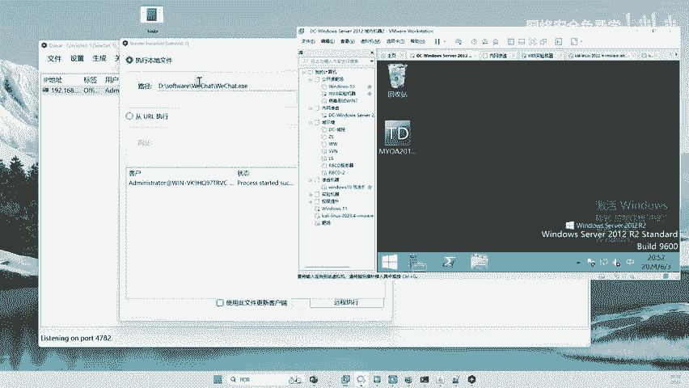

3W点百度点com好，点击访问网站，看到没？对方电脑在这里是不是自动打开百度了？哎，自动打开百度，比如说开个摄像头嘛？我这是把机，这把机没有摄像头啊，把机没有摄像头好不好？来才可以看看到没？哎。

可以看到这个远程桌面啊，启动是不是可以监控到它的远程桌面。好，那么我们来看看啊，怎么去。你如说我做这些东西啊，是不是远程控制的啊，来这二个问题我们来看啊，这里有一个socks。哎。

你们知道这个东西是干嘛的？😊，这个东西干嘛？来，我点击开始聆听。你们知道这个东西干嘛的？😡，啊，这个ss干嘛的？😡，这就是我们常说的什么代理。哎，啥意思呢？你看好了啊，假如说我把对方电脑控制了。

我右键啊，然后在对方电脑启动这个socks啥意思？😊，我就把这台电变成了我的肉机或者我的代理机。😡，理解吗？我们在网上你看看啊啊我给大家画个图吧啊，画个图。你看假如说这个是你A，对不对？这个是啊啊。

比如说是黄色网站。😊，啊啊，那么你直接去看这个黄色网站啊，你拿你的电脑看黄色网站，中途就是你跟电脑，那黄色网站，对不对？那这样的话，警察叔叔一看，哎呀，小伙子啊一调查黄色网站，发现是你看的啊。

回家把你抓了啊，这样非常危险，对吧？因为只有你跟黄色网站，那么很多人看黄色网站是不是要挂代理呀，挂梯子呀，那什么叫代理啊，比如说这个叫代理，这里有个BCC它是一台电脑，对不对？好，那这个时候呢哎从来啊。

😊，A对不对？这个谁C这个啥，这是我们说的哎。黄色网站对不对？好，那这后怎么办呢？也就是说A，你通过C。让C去看黄色网站。然后黄色网站给到C再给到你。那么警察叔叔去这一调查，发现C在看黄色网站。哎。

你没有看黄色网站。😊，哎，那这个C它叫什么？它就叫什么带。😡，代理机器明白吗？那么他们去调查的时候，只会发现这个C在看黄色网站，哎，在黄色这个电脑上一查，发现C这个人看你看没看我没看呀。

C看的关我什么事啊，对不对？好，那么很多人就会产生这样一个模式去玩，就是很多人说挂梯子挂代理，他干嘛的啊，他就是在中间让你的网络多了一个电脑给你做中中转，明白吗？好，那么假如说哎我们控制到对方这个电脑。

想让对方的电脑成为一个代理机器，我就会右键在这里直接点击什么socks点击开始聆听。好，那么对方电脑就是个代理啊。那么以后我的流量就可以先到我控制的这个网站。

那我控制了这个网站再去访问一些奇奇怪怪的网站，然后再给到我。那么这样别人就查不到我了。😊，OK那么我很多人就可以这样牟利牟利怎么牟利呢？哎，我专门去卖这个什么代理卖代理啊，对吧？一个代理卖你5块钱。

那只要你控制的网站够多对吧？假如你控制了1万个10万个台电脑啊，那你就有10万个代理机器了。好家伙，那兄弟，你的1个11个月的时不说赚个10万块没啥问题，好吧？但是这样就违法了啊，违法。好。

那么这些都是RIT的这些作用，对吧？RIT的作用啊，除了。😊，就是IT它这个东西啊，它一定是跟什么相关的啊，跟大家叫黑灰产。啊，一定是跟黑色产业灰色产业相关的。因为你一旦中了这些木马，他们会用你的木马。

对吧？植入做成代理机或者盗取你的QQ号，对吧？就你的微信，看你的信息啊，或者偷拍偷拍，其实没有任何价值。我用的电脑把你拍一张。你想想我们平常人你你你用电脑，你会把衣服脱了，裤子脱了，精光看玩电脑吗？

不会吧？兄弟，对不对？所以说偷拍没，就是我拿打开你的摄像头给你拍张照有意义吗？没有意义啊，那能怎么最多把你威胁一下，我有你的照片，那有就有呗，你能把我咋办？啊，你有没有我洗澡照片，对吧？对不对？

手机也没有，对不对？手机我们打开你摄像头给你拍个照，那这样的话，其实我你一般来说你会你会脱光光啊，啥都。😊，你搞笑闹了，你会脱光光把你的镜头对着你身体的一些部位吗？啊，只是说在洗澡的时候。

那只是很少有人洗澡，还被把镜头摄像头对着你吧啊，这女孩子居多，但是男孩一般都很可很少，对吧？就他这个概率太小。😡，对吧所以说你看用这种IATT他很少说打开你的摄像头，因为没有什么硬价值，对吧？

我打开了能砸吗？拍一张我我帅气的脸，那对我没有什么损失，对不对啊？那假如就有那只是女孩的就有可能。所以说你看我老婆我就不让他在厕所里面玩手机啊，真不，因为安全意识比较高嘛啊。

那么你看做代理这个就非常赚钱，也可以用这个电脑呢哎去做一些肉机攻击。比如说在这里你看我们可以啊别成事啊，用这个电脑去攻击别人，比如让这个电脑去攻击百度。😊。

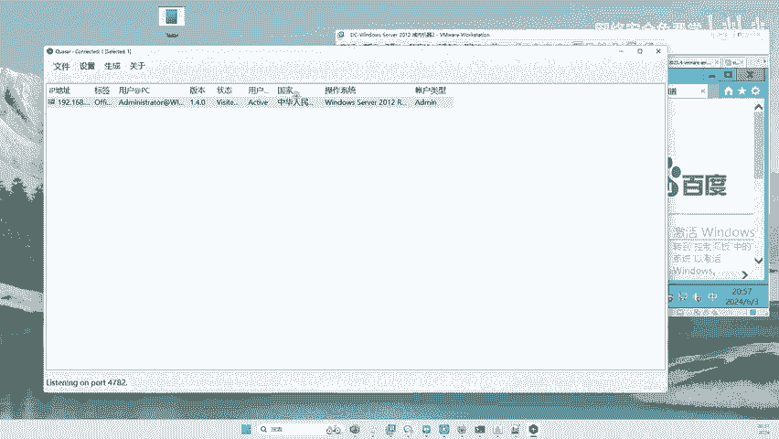

啊，你看我用这个电脑去拼一下百度，那么也就算doss一下。那么我让10万个电脑同时去拼百度，你信信我这样去操作ok百度直接就瘫痪了哦，那我就可以做doss攻击，对吧？你看用这种IIT等操作。

它就可以收费啊，只要你什么啊控制的这些电脑足够多，对不对？兄弟啊，控制足够，你控制1万个啊，你想干啥是干啥，对不对？想干还是干啥啊，当然这样肯定是违法的O肯定是违法的。好，兄弟们来今天这节课来兄弟们。

你们觉得怎么样？觉得有没有收获，觉得有收获的给李哥扣个一好吧？😊。

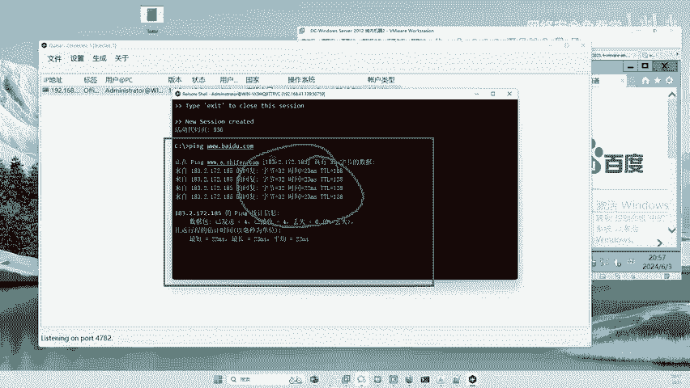

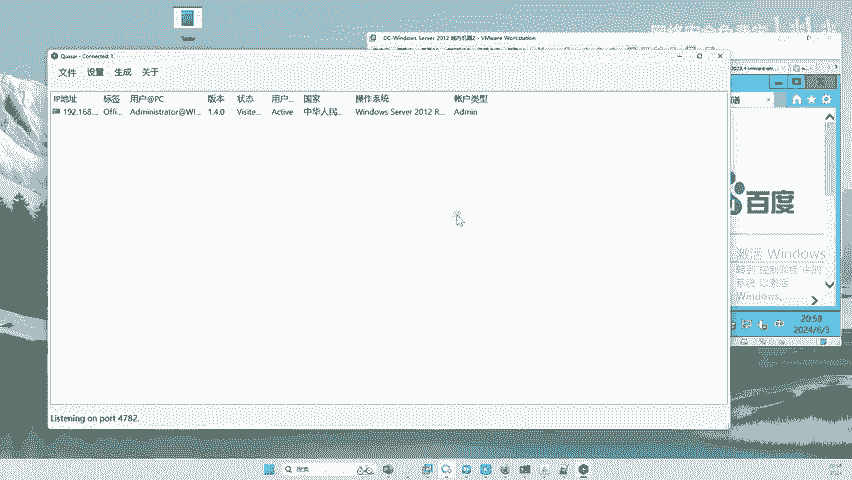