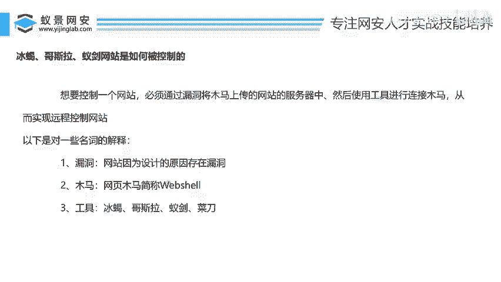
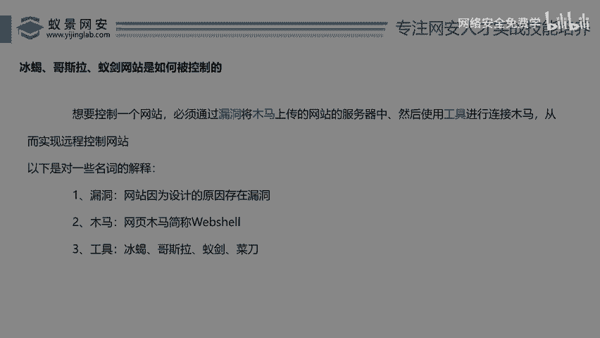
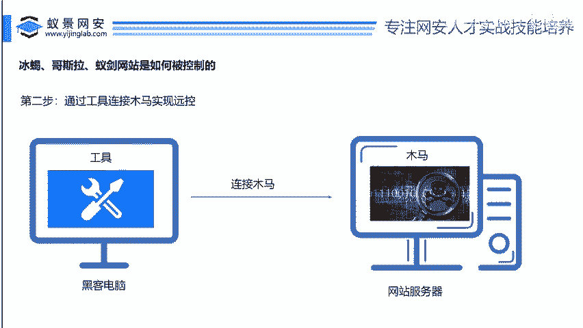
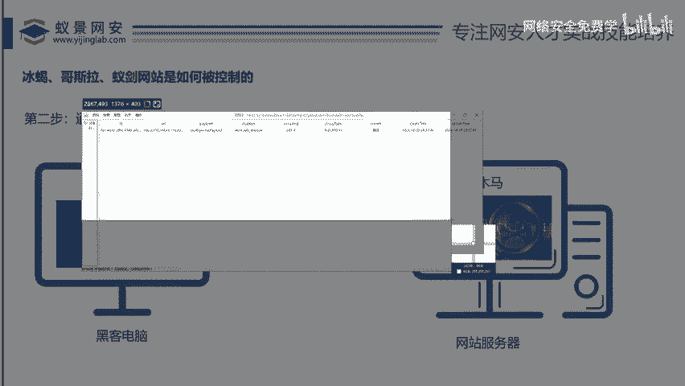
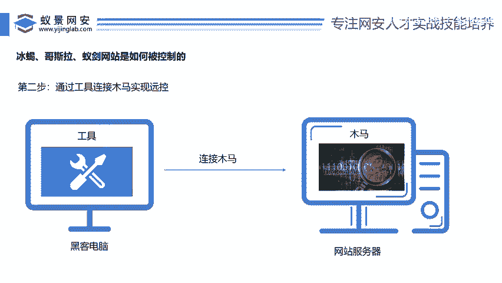

# 2024B站最值得看的黑客教程 ｜ 网络安全／渗透测试／内网渗透／漏洞挖掘／web安全／kali linux／红队靶场／CTF／信息安全 - P133：冰蝎、哥斯拉、蚊剑网站是如何被控制的 - 网络安全免费学 - BV1uBsTetEow

我们来先看一下第一个主题，冰邪哥斯拉已见哎，网站是如何被控制的。兄弟们，我们都非当黑客都很很好奇，对不对？哎，有一个网站，京东啊，百度什么叫做网站非常简单，非常好理解，对吧？哎。

我们平时去用这个浏览器都用过没有？哎，在上面去购物，在上面去买东西，对不对？那这些你访问的东西它就叫做网站，对吗？那么我们黑客是干嘛的呢？哎，黑客就是专门哎研究怎么去控制这些网站的啊。

这些网站用什么工具，什么方法，什么漏洞，哎，用什么样的技术能把这些网站控制下来，好，那么我们今天就会给大家去讲，哎，黑客是如何控制的，那你在控制的时候要去干什么，好吧，比如说京东哎，京打开这么慢啊。

京东啊吧？京东就是个网站啊，如何把京东控制下来啊，如何把百度腾讯啊，他们的一些产品，他们这些网站控制下来，OK那我们就说这个O那在这里大家也看到什么冰邪。😊，哥斯拉已键对不对？

所以说今天要控制一个网站就要讲到这三个工具了，对吧？好，那么我们来看看这三个工具是干什么的哈，你跟随我的脚步，一步一步听，你就听懂了啊。那么你想要控制一个网站来，大家听我这里有个我自己写的一段话。

非常重要啊，必须通过漏洞。😊，将木马上传到网站的服务器中。来，这里有两个东西，你要。明白对不对？哎，听好了，必须通过漏洞将木马上传到网站中。哎，也就是说你就假如说。我们想哎，刚才在哪里啊？在这里对不对？

你看。我们说了京东。啊，以京东为例啊，兄弟们肯定是京东购购物啊，比如说你看京东这个网站，哎，你想要把它控制下来，那么根据我们这里讲的对吧？必须通过漏洞，也就是说你得在京东上面这个网站里面找一个漏洞。

对不对啊，我们先不管什么漏洞，反正必须要找一个漏洞，然后找到漏洞之后呢，将木马上传到网站中，也就是说找到这个漏洞是干嘛的啊，就是找漏洞是为了干什么，就为了将木马上传到这个网站里面去啊，对不对？

所以说找漏洞，不是说找个漏洞就没了，对吧？找漏洞就是为了上传木马嘛啊，然后使用工具和木马进行连接啊，就是我们把这个木马呢传到对方网站里面去了之后啊，然后用一个工具啊，跟这个木马连一下。

从而就实现了网站的控制，对不对啊，那么这里有一些名词啊，我专门还给你打印出来了啊，我们看看这些什么解释，漏洞是什么呢？哎，也就是说啊漏洞就是说哎这个网站这个网比如京东。😊，啊，我这是举个例子啊。

比如这个京东啊，他这个网站大家都知道有程序员这个工作嘛啊，程序员就是开发嘛，我们学java学python，对不对？哎，他们就是开发，他们学javapyython是干嘛的，专门写这些网站的对吧？

他们程序员水平不一样，高低能力不一样，参差不齐啊，写的代码呢，可能有些人就是这个逻辑就有点bug啊，那么他们写的代码就可能是干嘛了？哎，有这个漏洞啊，因为他们不会网络安全。

他因为他所以说他们写的这个代码有漏洞，那么有了漏洞之后就可以干嘛，通过漏洞成传木马，对吧？那什么叫做木马，哎，就是我们说的网页木马，简称。😊，web shell，也就是说我们要去控制这个网站的木马。

它叫什么？哎，它在我们网络安全行话里面就叫什么web shell，对不对？我看那个兄弟们很多人在公屏上抠出来了啊，一些漏洞名字，对不对？你看哎什么啊啊文艺上文件上传CQCQ注入服务器代码雏形，对不对？

你们打的这些东西，它都叫漏洞，哎，打家就叫漏洞。好，那么我们把木马上传到对方电脑上之后，哎，用工具进行连接，对不对？什么叫工具呢？工具就是我们今天讲的冰些哥斯拉菜刀以及哎。

这些啊远程控制对方服务器的工具啊，所以说一会儿我们要学什么，要学这个木马要学这个工具啊，好，那么为了让大家更好的去理解一个网站是如何被控制的啊，我在这里呢也做了一些动画的图片啊。

我们学完之后就更清晰的能认准认识到了啊。第一步，你看。😊。

哎，你你在你家是你的黑客电脑，对不对？哎，这里有一个网站服务器啊，这里有一个网站。你看首先呢哎通过漏洞将木马上传到服务器上。那么木马在哪里呢？木马刚开始是不是在黑客电脑上啊，黑客自己写的木马，对不对？

好，那么黑客就去找这个网站漏洞啊，找到这个网站漏洞漏洞之后呢，你看将这个木马呢？对就传到了对方的网站里面去了，是不是好，那是怎么把这个哎东西木马从黑客的电脑上传到这个网站里面去的呢？哎，一定是什么？

通过这个漏洞上传的。哎，所以说找漏洞就非常关键了，对吧？你找不到漏洞，你这个木马还能传吗，肯定传不了呀，那传不了就控制不下来啊，是不是啊，所以说我们网络安全里面有一个重点，就是学习各种各样的漏洞。

利用各种各样的漏洞复现各种各样的漏洞，见认识了解各种各样的漏洞，所以漏洞的学习啊，一定是一个重中之重，对不对？非常重要的啊，因为你不会漏洞啊，你后续的很多工作。😊，啊，传木马呀控制就实现不了啊。

那就白飞了嘛，对不对？好，这就是第一步，对不对？啊，那么第二步是什么呢？第二步是不是通过工具哎连接木马实现远程控制控制。那么那么工具在哪里呢？那么工具一定是在黑客的电脑上，对不对？啊，黑客在他电脑上哎。

打开自他的工具，然后干嘛呢？哎我们看然后呢去连接这个木马啊，木马在哪里呢？哎，木马是不是刚才已经被传到了这个对方的网站里面去了，然后工具呢？哎直接远程连接木马，然后就实现了什么黑客的电脑上。

可以远程控制它的电脑了啊，然后就非常nice了，对不对？好，那么这里也有人问了啊，几种漏洞可以上传木马了，对不对啊？你们说的那什么内存码，一句话OK没有问题啊。😊。

上传漏洞的木马有非上传木马的漏洞有非常多啊，一会儿可以给大家看看有哪些分类。好吧，我们今天总要重点研究是什么，我们今天不是研究漏洞的啊，因为你想研究漏洞，我之前讲过一节课，专门要让大家去挖漏洞的课。

对不对？我们今天是研究这个木马的啊，为什么要研究木马？你想想你看你在这一步的时候。😊，你看你通过漏洞把这个木马传到对方网站里面去的时候，哎，那么假如说对方的网站里面有那种杀毒软件，对不对？哎。

有杀毒软件，那么有了杀毒软件，你这个木马是不是就被干掉了呀？那干掉之后，后续你还能连接木马吗？它就连不到了，对不对？好，所以说你看我们电脑都装什么360火容，对吧？有杀毒软件，好。

那么同样这个黑客电脑把木马传到对方网站，那么对方的网站里面也会有一些杀毒软件啊，我们今天就绕过那些杀毒软件让这些漏洞实现让这些木马实现一个免杀的效果，对吧？好，那么来接着来看啊，我们回到这里啊。

那么刚才我们经知道，那你说了李哥这些工具到底长什么样子呢？对不对啊，什么样子，就是说这个啊黑客这个工具长什么样子啊，哎，我们说了给大家讲了啊，冰些哥斯拉一键，那么这些都是这个工具啊。

那这个三个工具的作用是一模一样的啊，那么李哥在这里啊把这三个工具啊都给大家打开啊，让你们去看一看这个工具长什么样子，对吧？首先我们先来看一下哥斯拉这个工具啊啊，哥斯拉是什么东西啊。

可不是那个啊啊这个电影里。😊。

那哥斯拉对不对啊，它就是一个啊连接木马用的一个工远程控制工具。哎，它就长这样。

哎，它就长这样啊啊没有什么比较复杂的啊，我们的右键你看啊在这个目标点一下添加啊，你看点一个添加。😊，啊，这里就要填一些信息，这些信息什么呢？哎，就是那些木马的信息嘛，你是要通过这个呃工具去连接木马嘛。

对不对？好，那这里面就填木马的信息啊，这里面就填一些填一些这些木马的信息啊，你填了木马的信息之后呢，就可以和这个木马啊进行一个连接了，好不好？哎，这是哥斯拉好，那我们来再看看这个中国乙箭啊。

那么中国已箭长什么样子呢？哎，它就长这样子啊，它也可以去添加数据啊，它这个添加数据啊，同样跟刚才的哥斯拉啊长得是一样的啊，在这一块也去填一些什么，填这些木马的信息啊，一会儿告诉大家怎么去填啊。

反正它的界面就长这样子的啊，界面长这样子的。好，那么除了这个冰蝎呢呃这个已键之后，我们再看下一个啊，也是我们这个比较好的一个工具啊，叫做冰蝎啊啊，冰蝎。😊，好，那么这个呢叫做冰蝎来大家看看啊。😊，哎。

它的都是中文版，对不对？中文版啊，哎，你在这边右右键就可以添加这个木马了，跟木马进行连接了。哎，就这样就这几个工具啊，它们的作用啊都是一模一样的啊，没有什么太大的区别啊，都是远程去控制的，对不对？啊。

那个冷说菜刀就算了啊，呃，菜刀啊，这个确实比较古老啊。我再给大家说一下菜刀那个嗯在十0年前啊十几年前用的比较火。那么现在比较流行的就是冰蝎哥斯拉啊，天蝎乙剑这些工具，对不对？好，那么。😊。

