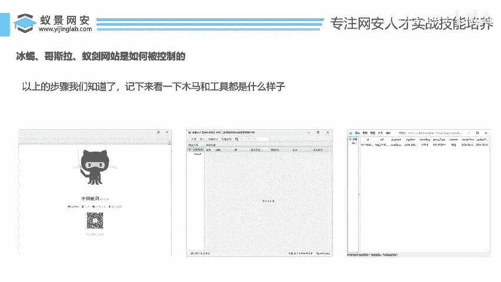
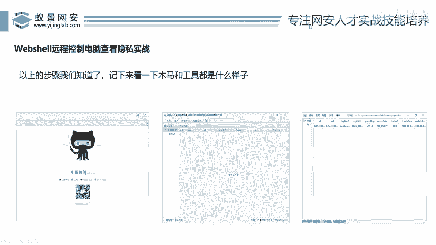
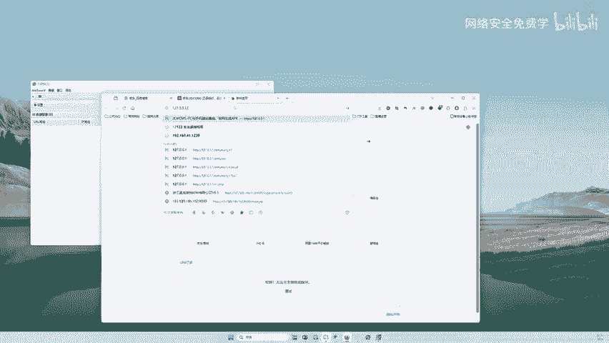
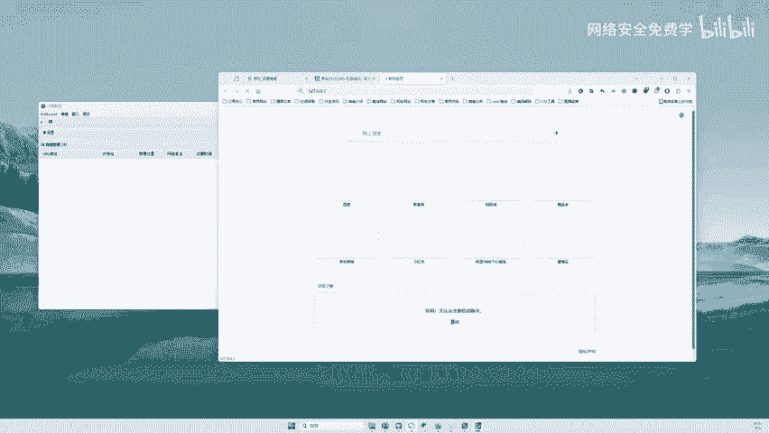
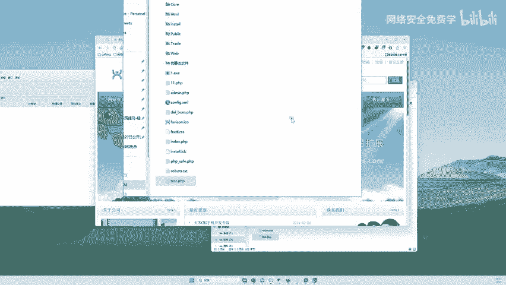
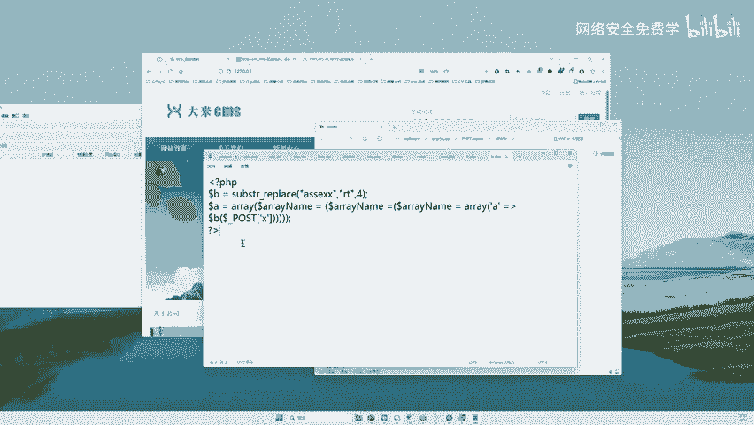
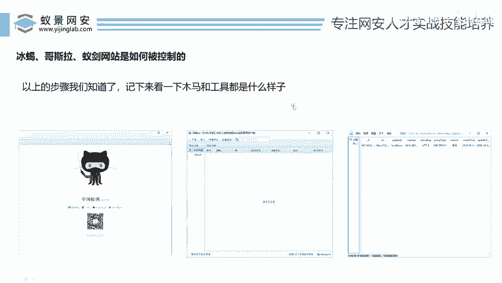

# 2024B站最值得看的黑客教程 ｜ 网络安全／渗透测试／内网渗透／漏洞挖掘／web安全／kali linux／红队靶场／CTF／信息安全 - P134：Webshell远程控制电脑查看隐私实战 - 网络安全免费学 - BV1uBsTetEow

兄弟们来，我们知道这些东西之后，来，我们来实战一步。哎，我们来看看这些工具控制好之后呢啊用webshop和这工具连接之后呢，哎到底控制之后是什么样子，对吧？啊，这个很多人啊呃非常好啊，不知道长什么样子。

好，那么李哥在这里给大家演示一下，好吧。😊。

好，我们就我们就以一个为演示，对吧？就不演示多了。我们以这个什么中国中国以建为例，对吧？啊，以它为例去进行一些连接好。😊，OK我们先打开这个工具，工具有了，对吧？来，我们还得打开一个网站，对不对啊？

网站在哪里呢？来，李哥把网站打开。😊，好，网站在这一块。好，我在这里打一下127。0。01。

好，我去回车一下啊，看看这个网站能不能访问。好，你看这里有个网站，对不对？你看工具有了，哎，网站有了，那么黑客拿到一个这样的网站，对不对？怎么办？是不是找这个网站漏洞，找到之后呢。

把这个木马传到这个网站里面去啊。当然这块李哥就不不通过漏洞去传了，那样太太费劲了啊，那我们的主题就偏了。我们主要是给大家看这个效果。好，我们打开这个网站的这个文件夹。😊。

哎，来大家看这个文件夹里面放的什么东西呢？给大家讲一讲啊，这个文件夹里面呢放的就是这个网站的页面啊，也说这个文件夹它就是网站的这个电脑里面放的这个东西。我们一会儿呢啊你通过漏洞，对不对？你看啊。

给大家说一下啊，你通过漏洞，哎，你就会把木马呢传到这里面去啊，在它的这个目录下传一个木马啊，当然现在我们就不通过漏洞传了啊，我们直接呢自己去写一个漏洞，写一个木马写到这里面去就可以了，对吧？啊。

我们就不以不不用这个漏洞去传了，因为漏洞传起来，太费劲了啊。😊，好的，那么来我们来开讲啊。OK回到这个网站的这个根目录像啊。😊。

来，我们找随便在这里啊。😊，好，比如说呢这个呢是一个木马啊，我们先不用管这个木马长什么样子，对不对？好，假如说这个是个木马，对不对啊？木马，你看现在这个木马其实它也是一段代码，对吧？我们把这个木马呢。

也就是说啥哎这个文件啊，这个文件叫什么文件啊，111点PCP现在呢已经通过漏洞传到对方电脑里面去了，对不对？好，那么兄弟们啊，接下来我们就可以用这个中国一键去进行连接了哈，我们怎么连接呢？

右键啊来添加数据，你看127。0。0。1斜杠11点DP。😊。

好，这里连接密码写成X。好啊，测试连接来，我把它的编码调一下啊，测试连接。好，你看我点击这个测试连接，你看兄弟们往这看是不是提示哎，连接成功了呀啊，那我们这里写的是什么信息啊，来看看。😊，好。

首先呢我们在这里可以看到啊，在这个这个是啥东西，是不是这个木马的地址啊啊，是不是11点PP啊？也就是说这个木马在这个网站的叫到这个网站的11点PP好，这里还有一个连接密码，连接密码是什么东西呢？哎。

也就是说你你在这个啊木马里面啊，它会写一个密码啊，它的密码是什么呢？哎，在这一块啊，叫X啊，叫X啊，这里不管是啊我们今天讲的个啥，不管是java还是PP都是一样的啊。好，X，哎，我们把它写进来，哎。

写进来O然后点击什么测试连接，然后点击添加啊，点完添加之后，兄弟们往这里看，哎，这里就有一个什么，就有一条记录了。那这个记录就记录着这个工具正在连接的这个网站，对不对？好，然后你点入它这个记录双击哎。

鼠标双击哎，就可以什么进入到哎，你看这个页面里来，这个页面是什么？哎，就是远程控制的页面了。你看啊，我们通过这个工具是不是可以实现对这个网站里面的。😊，所有的文件夹，你看它的C盘，它的D盘。

它的D盘下的这个目录，哎，包括当前这个目录里面的所有的文件。哎，大家看没这些所有的文件你是不是都能看得到哎，同样你也可以在这里右键啊，大家看右键是不是对这个网站里面的文件进行什么呀啊。

进行一些看啊刷新上传复制粘贴编辑删除重命名更改新建，是不是可以做很多很多的操作呀，也就是说哎我们通过这个工具就可以实现对这个网站里面的代码啊，也可以对这个网站里面的也可以说是这台电脑，对不对？

进行一些远程控制，比如右键给他这个C盘里啊，下载一个什么东西，给它C盘里删一个什么东西。C盘里面加一个什么东西，也可以让他的电脑去关机干嘛干嘛的啊，都是可以的对吧？好，那这个呢就是啥啊。

就是说我们通过漏洞啊，然后通过工具控制对方电脑之后，它的一个界面啊，也就是说我们作为黑客来说，你只要能拿到这个东西。😊，哎，你已经number one了，是不是啊啊number one了。好。

那么有人这里会说了啊，李哥啊，这里我懂了，那么有人在这里会问啊，什么PP啊，java这些怎么办？来这里给大家再说一下啊，这是他们的区别，对不对啊。😊，啊，什么区别呢？哎，往这里瞅，对不对？好。

我们刚才给大家讲了，对吧？😊，哎，你看中国已建哎，对，中国已建就这个工具。好，那这个工具是为什么开发的？给大家讲讲啊这个。😊，这个工间。这个工具啊是是针对PA网站的。哎，什么意思呢？😊。

也就因为我们开发网站有不同的语言，兄弟们啊，就我们有C语言，对不对？有有java语言，有什么python语言，有PHP语言。那么这个网站它是用PGP开发的，你就要用这个中国语建啊。

那么如果说这个网站它是java开发的。也人说哎李哥，我是学java的，对不对？我java工资好啊，怎么java啊做开发的。好，那如果说他的网站是用java开发的。那么你就用这个什么冰蝎啊。

或者什么哥斯拉哎，哥斯拉这样的工具。😊，哎，就可以了，对吧？啊，针对什么？针对不同的语言开发的网站，你用不同的工具就可以了，对不对啊？就这么简单一个道理。那么刚才给大家演示的这个PP网站。

java也是一样的。如果是java，你就用这个工具啊，它同样也是把那个木马传进去啊，它的有键右键它也有一个连接密码长得一模一样，只是语言不一样，仅此而已啊。

啊。