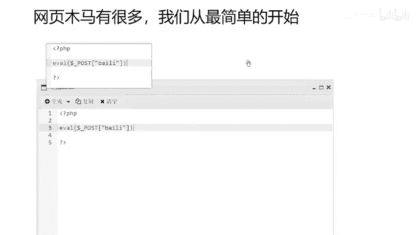
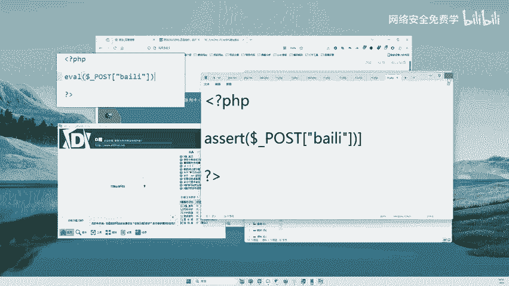
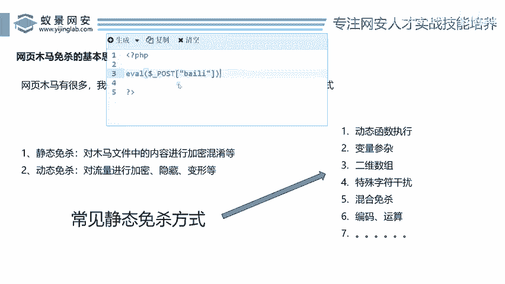
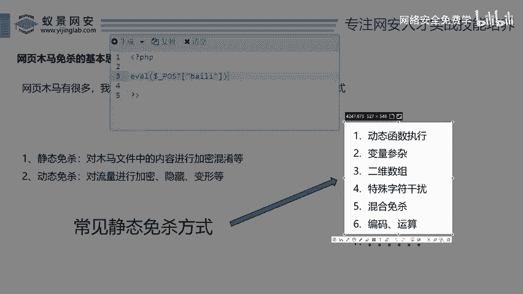
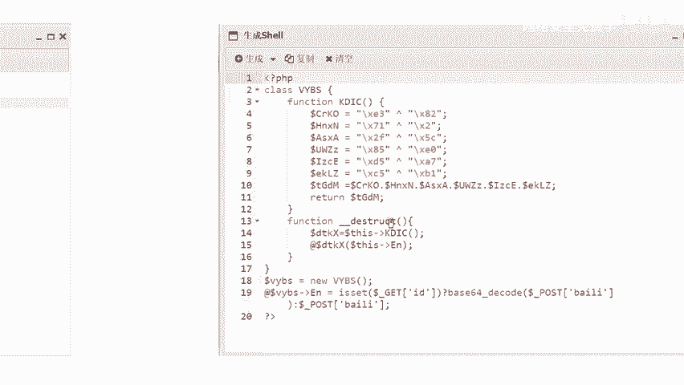
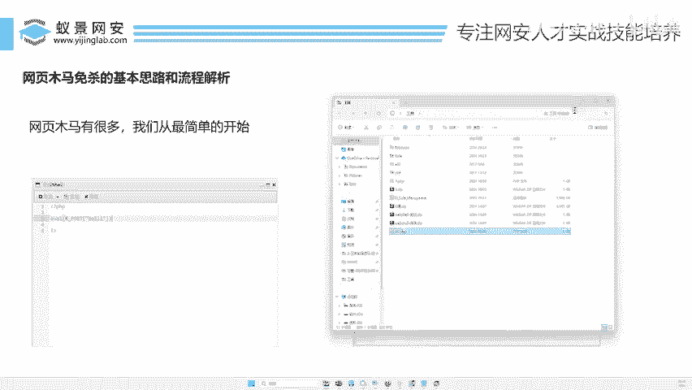

# 2024B站最值得看的黑客教程 ｜ 网络安全／渗透测试／内网渗透／漏洞挖掘／web安全／kali linux／红队靶场／CTF／信息安全 - P135：网页木马免杀的基本思路和流程解析 - 网络安全免费学 - BV1uBsTetEow

那么我们知道这个web shop。控制网站之后是一个什么样效果之后，来，我们就来看看今天我们的重点是啥，是不是免杀呀。好，就说你一个木马给到兄弟们了啊，我们把木马连上这个木马了。

那这个木马能不能过火容350能不能过河马，能不能过地盾，这个才是我们要研究的东西，对吧？啊，好，那我们来看看怎么去对这个木马进行秒杀，让他干什么呢？哎，让他被杀毒软件识别不出来哎，兄弟们往这里看。

那么网页木马的有很多啊，我们从最简单的开始，对吧？大家学习一定要从一步一步来啊，我不能说一下就来做类，做什么呃，做这种呃魔术字符串做什么呃流量加密那种秒杀啊，大家肯定也理解不了。

所以说我们从最简单的方式给大家去讲秒杀啊，因为秒杀如果说我要把秒杀讲完啊，我可以做到这里给大家讲个7天七夜啊，全部讲秒杀都可以但是呢没有那么多时间。所以说我们要从最。😊，简单的开始啊。

虽然说它的技术很简单，但是还同样能让我们的一些上标软件识别不出来啊。我们今天就看看我们最终能不能达到这样一个效果，对吧？好，首先你要学秒杀，对不对？我们得看看啊，针对于刚才那个木马啊。

秒杀有多少种方式啊，或者说他常见的秒杀有什么样子的。好，第一种叫什么叫静态秒杀。好，有人说了李哥什么叫做静态秒杀，静态秒杀是个什么东西，对不对？好，我给大家看看啊。😊，好，来，我们先看一个木马。好。

这是一个木马的代码，哎，这个非常简单了，对不对？它就是个木马。哎，你在一个文件里面写这样一段话，把这样文件传到对方电脑上，然后你就可以通过语键去连接对方了。好，那这一段代码或者说这行命令啊。

它是一个用PPP写的变成语言啊，你先不用管它为什么是这样啊，反正就是这样啊，它是这样，它就是一个什么病毒，是一个木马。好，那么你直接把这个东西写成这样，然后传到对方电脑啊，那你信我啊。

一定就被什么被干掉了，对不对？首先火容肯定就被干掉了。哎来，我们来试试会不会被干掉啊，来。😊，来这里给大家做一个实验，对吧？🎼好，我在这里呢啊新建一个呃文件，然后呢我们去测一测，对吧？说多说多了没用啊。

只有去测一测啊，才能去看真章，对不对啊？好，把这个文件啊创建出来。好，我打开OK啊，我在这里个文件里面写个啥啥东西呢？你看啊来我把这样一段话，对不对？哎，写到这个文件里面去啊。

然后我们来看看到底哎能不能免杀好，复制一下，对不对？😊，好，复制到这里面来啊，现在把它的这个。😊，哎，他的这个。啊，这里要换个名，换一个吧，叫AXERT啊，换成这样啊，一会儿的话，因为要跟他搭配一下啊。

来，你看这样的话是不是跟他一样啊，只不过把前面这个EVAL换成了ASS加RT啊，两个是等于号，对吧？啊，两个是画等于号的，两个作用是一样的啊。好，现在假如说呢你看有这样一个东西，你看我保存一下。😊。

你看大家看下我直接电脑的火容啊，直接就弹出来了，发现病毒啊，自动处理看到没？12点PP。首先我们火容直接就把这个文件给他什么杀掉了。那你说假设说对方电脑。有有这个什么一些。啊，杀毒软件。

那是不是就给你把这个木马干掉了，对不对啊？那所以说你看这样的话，你直接传，它肯定就会被干掉了，对吧？好，那如果说那么针对这种方式，我们还有很多啊，来我们再看看哎其他的一些啊免杀工具啊，比如说这个低盾啊。

😊，这个第一座呢，李哥在他给他解压一下啊。啊，这个这个是低端是什么东西啊？就是说它是一个专门去检测这个webshop木马的。好，我们把它打开。好，把它打开。好嘞，同样对不对啊？我们再来试一下啊。

把这样一段话哎这个搞过来。

🎼好，把这个PPT先缩小一下啊，我们还是在这个页面里面给大家演示啊啊，在这里传一下啊，我们新建一个叫做一1啊，点刚才那个一2已经被杀掉了，所以呢这里呢我要重新传一个，重新做一个，对吧？好。

OK然后再把它这个。😊，问了一下啊，还是刚才一样的啊，ASERT。好，保存一下，对不对？你看这个11点PP保存好了，它是个木马，对不对？好，然后呢，我们打开这个专门检测木马的工具，哎，就这个工具。好。

你直接把它呢拖进来。😊。

啊，我们拖进来。来，你看通过这个工具啊，它一扫就扫出来了啊，里面写的什么啊，等级是5最高等级。是不是啊，最高等句代码是找后门是不是已经给我们扫描出来了，这个东西它就是个木马。所以说呢哎这是最原始的木马。

那你把这个木马要是这样的木马能传到对方电脑吗？啊，这个一一你能传吗？啊，一一里面就是这个内容，你能传吗？肯定不能传呀，对方有杀毒软件，谁都能把它杀掉。好，那怎么去给他做秒杀呢？来，兄弟们哎。

我们来看看怎么去做秒杀，对吧？一会儿呢把它给它过掉，绕过去，对不对？OK我们还得一步一步给他去讲啊。😊，好，那么怎么对啊？这里面这个代码。哎。进行面杀。好，这里我们给大家说一下啊，常见的免杀方式有两种。

先说第一种叫做静态秒杀。什么叫静态秒杀？兄弟们就是对这里面的内容进行加密啊，混淆啊，做一些变形。哎，什么叫做变形啊，我给大家举个例子啊，就比如说呢你看这是你啊最初的样子，对不对？

然后我们要对他进行一些整容啊，整容完了这个人还是你，对不对？只是你的鼻子变高了啊，这个眼睛变大了啊，这个下巴变正了，牙齿变白了啊，从而让自己变得更好看了，别人认不出来了。

但是这个人还是不是你呢同样是你对不对？同样静态免杀是干嘛的，就是对这里面的内容进行一些修改啊，我们把这个一V11这个字对不对啊，可以稍微做些变形啊，做一些更改对不对？那么更改完成之后呢，哎。

看能不能去让这个杀毒软件识别，因为杀毒软件他是干嘛，他就识别这里面的话是不是木马了，对吧？他会识识别里面的代码，所以说我们可以对这里面的内容进行一些什么静态的修改。

那么静态的修改的静态杀的方式有多少种呢？来李哥在这里给大家写出来了，对吧？啊，你看有这么多的方式啊，怎么对他整容呢啊，现在你是个。😊。

医生你要对这个原始的代码进行整容啊哎可以用作什么动态执行、变量掺杂、数组字符干扰、混合秒杀是吧？编码运算对不对？做等等等等，很多方式，对吧？也就是说我们对这里面的内容不断的做变形变形，每变形一次啊。

你去那个测试那个杀毒软件去测一下，看能不能杀，再变一下，再测再杀下，再变一下，你再去测一下，就这样不断调整，不断调整，从而让它实现秒杀啊，总而言之，静态秒杀就是对这里面的代码的样子进行修改。

但是它的功能是不变的哎，明白就给我们做整容一样，对吧？啊，鼻子眼睛都调大啊，什么什么都修改一下啊，你就可以了啊，但是这个人还是你啊，好，那么第二种方式啊，是现在比较流行的啊，叫做动态免杀。😊。

什么叫做动态秒杀呢？兄弟们啊，你说动态秒杀是不是对这里面的代码来进行修改啊，也是对这个代码在修改。但是为什么它叫动态秒杀？动态秒杀主要是对它的流量进行加密跟变形。好，那么这种技术被常用于现在的一些东西。

比如说我们的冰蝎哥斯拉它就它的秒杀一般会采用到动态秒杀啊，像我们的这种已现的木马一般会采用到静态秒杀。当然，动态跟静态可以去结合起来，对吧？那这里啊有些人就会好奇了，动态秒杀到底秒杀的是什么东西？

来李哥在这里给你啊看一看哎，回到PPT前个你就懂了啊，回到这里来好，我们刚才说了，你通过。😊，啊，通过工具对不对？连接木马，然后实现通过工具远程控制个远程连接木马，然后控制对方电脑，对不对？

那么你想想你通过工具去控制这个电脑的时候，你的这个数据，你的网络是不是要经过你的网线呀啊，经过你的电脑走你的网线，对吧？那个流量啊，是不是通过网线到了对方的这个服务器上啊。

那么我们对这其中的流量进行一些什么混淆啊，它的流量本身长的是这样样子的。然后对它传输的这个内容哎进行一些混淆加密编码这些预算啊，然后把它的这个行为啊，给它秒杀掉。也可以对吧？那这个能叫到什么？

叫做动态面纱啊。对不对？静态是干嘛？静态是修改代码里面的内容的，对不对？动态是啥？是让它的这个流量做伪装啊，做伪装。好，那么这个动态秒杀我们先不去了解，因为动态秒杀要涉及到一些什么算法啊。

什么啊啊这个什么对称加密，非对称加密这些东西好大家就可能听不懂的。哎，我们先从简单的我说了学习要从一步一步来，对吧？我们先从简单的静态秒杀来开始，就是对这个内容进行混淆，哎，也就是对它进行整容。

实现一个秒杀。好，我们都看看这种当然静态秒杀不是说静态秒杀现在不用了啊，我们只是说秒杀方式有两种动静结合，对不对？那这样会更好的对吧？好O那么哎那就说了啊，那么静态秒杀方式有很多种啊。

那这些东西到底都什么意思呢？啊，什么叫做动态执行，什么叫做编码运算，什么叫做混合啊，什么叫做字符干扰，这些都是骂玩意儿，哎，这些都是什么玩意儿。好，不用着急。😊，啊，我们每一种给你讲一下。

讲完之后你就理解了啊，非常好的理解，对吧？好，那么我们先看看静态面上的一个案例啊，看完这个案例你就知道了啊，首先呢我们刚才给大家说了，你看这是一个木马，对不对？哎，大家都知道啊，这个是个木马。

这个木马呢是它最原始的样子，长得比较丑陋啊，所有人都能认出来它是木马。那么我们需要对它进行整容，那怎么整容呢？来往这里看哎，它整容之后哎，变成这样了。😊，变成这样了，来，我们再放大一点看一下。啊。啊。

你看这边这个内容。整容之后变成这里面这个内容了啊，但是他们两个的作用是相等的，还是同一个人，只是他整容了呀。兄弟们好，那他整容之后，这个是啥意思呢？哎，有人说李哥，这里面这个是啥意思？这啥意思？啊。

这又是什么意思？😡，这个又是什么意思？😡，都是什么意思？好，那你看李哥在这里给你调一调，你就懂了，好不？非常简单啊，来，你看。😊，这里啊定义了1个CKO等于这串东西啊。

就应该理解为你看大家都学过数学没有，你看X等于一，Y等于一，对不对？Z等于X加Y。这个玩意你你会不会？😡，高中你都会吧，对不对？X等于一Y等于一，你知道什么意思吧？

就是把X负个值X等于一的那Z等于X加Y，那Z等于几啊？Z是不是等于一加一啊，是不是因为X等于一。好，这样我们写了一下，你看。😊，CRKO等于他。是不是好，那么他是什么东西？啊有说不理解他什么东西来。

这个是又是什么东西？😡，他叫一个他叫什么？这个叫抑货运算。抑货。运算哎，不是道有义货运算。哎，叫抑抑货运算啊，这个玩意呢就叫抑货运算。你就说啊李哥什么叫做抑货运算呀？😊，一加一等于2加号是什么运算？

是加运算。这个是异或运算啊，一减一等于0，这个减号什么意思？减号是不是减运算啊，1乘2等于2，这个乘什么意思，是不是乘法运算那这个异或运算是干嘛的，大家不用管，反正它跟加减乘除差不多，也是一个两个数字。

两个字符进行运算的。好，你不懂异或运算都没有关系啊。因为这个呢也涉及到很一些编程东西，对吧？好，你只要记住它是一个运算啊，那么这个东西跟这个东西运算完成之后是等于多少呢？来你不知道是不是好。

不知道没有关系，我们给你在这里啊，直接实操一下，你就懂了啊。😊，好。来，我们直接打开一个这个网站的跟目录，对不对啊？我们把这个一一里面啊给它写过来啊，我们把这里面的代码呀啊给它复制一下。啊，来。

我们先把这个东西复制过来，对不对？😊，好，复制到哪里呢？哎，复制到这个一一里面来好好，你看是不是CRKO哎，等于啊来两个冒号。😊，好，两个引号对不对？叉E3啊，XE3好，你给它写过来。然后是一个顶尖符。

好，我们把顶尖符啊，这个写过来一会运算这个符号，对吧？好，这个符号在哪里呢？在我们的键盘上的6啊，然后是叉82是不是好啊，叉82。😊，好叉82，然后哎给他这样一弄啊。好，写完了。

然后我们看看这个东西等于多少啊。😊，好。好，你看CRKO没有问题啊，C这个大写C。哎，我们把它严谨一点，是不是你看CRKO啊，这是类似于我们的XX等于这两个东西做异或运算，对吧？

现在你不知道这个差E3是多少，82是多少的，没有关系。来，你运算完了之后，我们直接ECHOECHO的意思叫输出啊，就把它的结果打印一下。😊，好，然后呢我们直接去哪里去这个网上看一下就知道了啊。好。

打开你的浏览器哎。😊，还在这里输入。来170。111回车。来等于多少？来看他的内容。啊，也就是说这个东西。啊，这两个东西运算完成之后等于啥，是不是等于一个间括号？是不是等一个监工号？就这么简单。好。

那么底下同样你把这里面内容算换算完成之后，它是等于多少呢？来，我们现在把这里面内容所有的复制复制一下，对不对？来，你看最后一段TGDN等于什么？等于CRKO也就这个东西。😊，啊，这个东西等于啥？

是不是等于这个括号啊，点叫啥？就是加号啊，就是这个就是这个加这个加这个加这个加这个加这个把它们的内容加起来等于TJKDN。好，那我们就看一下这个TJDM最终等于什么，你就知道了哎。

这一段代码是什么意思了。好，那么我们非常简单啊，我在这里呢啊把这个内容打开啊。好，我们把测试的代码拿过来啊。😊，好。测试代码在这一块，对不对？啊，我把它复制一下。好，全部复制过来，复制到一E的PP里面。

OK是不是原封不动的给它复制过来。然后兄弟们，然后我们这直接想看是多少ECHO啊，把最终的这个变量哎给它复制一下。😊，好，来。看一下啊，推车。来看看。兄弟们是不是出结果了？ASSERT啥意思呢？

也就是说。😊，这串纸。啊，这个内容。TJDM等于它哒相加相加之后结果是多少，是不是ASSERT也就是说TGDM等于ASSERT啊，那这个ASERT怎么来的，是不是通过上面运算的啊。

这个运这个等于这个应该是等于A啊，SSERT这个应该是我们刚才写写错了，应该是里面刚才没算好，对吧？ASSERT把这里面内容加起来啊，加起来之后等于TGDM好。

这个就是一个什么变形你看它里面的这些内容变没变，没有变，对吧？跟你这个核心的代码是不是长一样的啊，这个只不是EVL啊，这里面是ASSERT啊，你看本身啊假如你直接写把这里写ASSERT啊。

它就识别出来了。但是你把ASSERT是不是你写成这样。😊，他能认出来吗？他是不是就认不出来了呀，认不出来之后，是不是就可能会绕过杀的软件呀。那这个呢就是一个典型的静态秒杀了，对吧？对里面的这些函数啊。

括号这个变变于那样，这里面变量做不同程度的一些什么替换修改运算好，那这里面用了什么方法啊，它又用到了一个抑或运算，是不是用了算一个啊抑或运算啊，那还用了什么方法，还用了一个拼接法，对不对？

你看将A写成这个S写成这个啊，E写成这个然后呢再分别将里面内容加起来啊，是不是得到一个ASSERT了。好，这就是一个非常典型的一个啊，我们说的这个静态免杀的一个案例。当然有人说了哪个这个东西啊。

大家觉得这个东西写成写成这样了啊，你们觉得。😊。

能不能面杀？你们觉得能免杀的扣波一，觉得不能免杀的扣波2。那接下来要给你们去测一下能不能免，对不对啊，大家觉得能不能免，就是现在把木马写成这样子了，你觉得能不能免杀啊，能免杀的扣个波一，不能免杀的。

扣波2，对不对？好，很多小伙伴都扣2啊啊，看来大家都非常的聪明，对吧？能不能免，不是我说了算，对吧？要说谁说了算，是不是。😊，哎。L。要要杀毒软件说了算好。好啊，原始的我们刚刚测过这个东西不免杀。

对不对？好，我们把它删掉啊，现在变成它啊，现在照样打开地段啊，来再去测一下啊。😊，啊，怎么来了？来把依衣拖进来。😊，来，兄弟们往这里看。😊，免杀吗？同样不免杀，是不是？同样不免杀。啊，为什么为什么呢？

啊？你说哎李哥我刚刚都变了，对吧？把这个代码啊已经变成这样了啊，做了一些替换算法在里面了，他还不免杀。为什么？因为这个东西啊已经被很多人会了啊，所以说他这个东西就搞不定了。

所以说你想要真真正正的写一个免杀码啊，等于说这个免杀码是怎么来的啊，这里要给大家说一下这个秒杀码怎么来的，这个秒杀码啊，可不是说李哥写的对不对啊？这个免杀码是怎么来的？来，我给你演示一下。

我是怎么生成这个代码的啊啊，用这个已键这个工具生成的来。😊，已见这个工具里面有一个叫做啥，你看。就已建这个工具里面有一个叫做什么生成shall啊，免杀shall生成。好，来，我给你生成一下啊。啊。好。

确定来就这样来的，大家看。你看这个这个免杀木马，它是由这个已键自带的生成的那已键自带的这种生成方式，你觉得我都知道这样能生成，你觉得杀毒软件杀软。那些火狐那些工具，他能不知道这个东西吗？

他肯定知道他知道就研究这个东西，一研究出来，把这个东西就直接给你拉黑了，所以说他就不免杀了。😡，明白不啊？因为这个东西大家都可以用，大家都知道这样可以生成木马，这个工这个工具自带这样一个功能。

那那人家刷到人家早就把它注意到了，是不是啊？注意到之后，那是不是就要把你拉入到黑名单了啊，然后你就不免杀了。好，那如果说你真真正正想要去写一个免杀法到底是不是用这些工具去生成呢？啊。

你说李哥用工具生成可以吗？啊，再给大家说一下啊，来用工具生成的。😊，这个木马啊来一般啊这个持久性比较差，明白吗？什么叫持久性比较差？比如这个工具刚出来哎，有一个谁谁写这个工具啊，支持秒杀木马生成啊。

刚开始这个工具确实是可以秒杀的，为什么？因为杀毒软件还不知道呢？啊，等你做过上半个月过放一年啊，那个杀毒软件，人家大家都在用那些公司就知道了，好家伙，你用这个工具既然生成木马能绕过我。

赶紧把这个工具拉黑啊，是不是这样就又不秒杀了好，所以说兄弟们，你们想要去实现一个自己的秒杀木马啊，那应该到底怎么做呢？哎，一定是不是说用工具，对不对？我们一定是要干嘛去学秒杀的方式啊。

到底怎么去写才能免杀，对吧？啊，那么李哥作为今天。😊。

