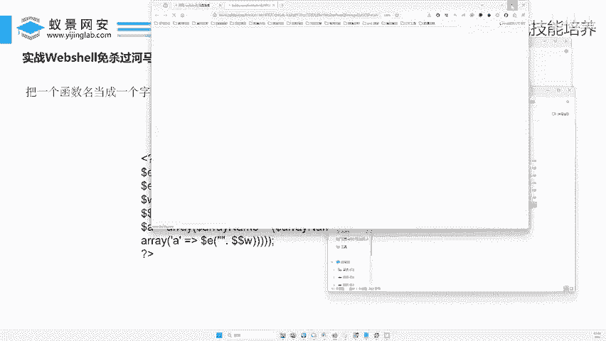

# 2024B站最值得看的黑客教程 ｜ 网络安全／渗透测试／内网渗透／漏洞挖掘／web安全／kali linux／红队靶场／CTF／信息安全 - P136：实战Webshell免杀过河马、D盾、火绒 - 网络安全免费学 - BV1uBsTetEow

啊，我们今天看重点，我们就手写一个，我们不用任何工具哎，去绕过低顿，绕过火龙检测好不好？来，兄弟们来。在这里呢我们就用三招给大家去绕，好不好？先用第一招来第一招是什么东西啊，我这里直要讲原理呢，对吧？

我可是不是说给大家就直接帮光。哎，这就是木马，你直接用，对吧？那样没有意思啊，我们说了动态秒杀啊，静态秒杀它的方式比较多，对不对啊，什么动态执行编量参杂哎，数组特殊自如干扰，对吧？编码运算啊。

刚才那个木马里面就用到了运算，对吧？当然这里面所有的方式都可以结合相互结合去用啊。好，那我们先看第一个叫做什么叫做动态函数执行的方式。好，什么叫动态函数执行，来，兄弟们同样啊，我们把木马啊写到这里面来。

😊，我们最原最原始的木马啊，长什么样子来。打到这里啊。好，最原始的木马是不是长这样来给大家写一下啊ASSERT。😊，哎，然后这里写个什么X好，当然这个东西刚刚大家已经测过了不免杀，对不对？好。

第一种方式叫做动态执行。什么叫动态执行？好，这个玩意是个啥东西？它是不是一个函数啊？我们把函数做成一个变量实现去执行。好，来怎么搞？哎，这怎么又过去了着？😊，啊，别等一下啊，把这个东西给大家弄回来。

第一个你看啊来给大家变形一下啊，你看ASERT好，那我们可以等于一个。😊，到了一。等于。ASSERT。然后干嘛了，然后。打扰了，一。括号。这个东西。来，你看这段话是不是就变成了两句话了呀？

你看我把这个ASIRT啊给它复制了一下，复制来复制了do那E等于多少？等于ASIT那所以这段话是不是跟上一句话功能是一模一样的呀？这个呢就叫什么叫做啊动态函数执行啊，本来这个函数它是静态的啊。

就这样写写进来了，对吧？现在呢我们把这个函数动态的传给了谁个就类似于什么啊，X等于一了，对不对？然后X啊加上一个Y等于什么是不是等于一加Y啊，是不是因为X是不是等于一啊？你看这里E等于ASIT。

那这个E是不是ASIA加RT然后加括号再把里面内容加过来，那是不是跟上面这个内容啊是一模一样的啊，那么基于以上方式，我们动态执行啊，你还能怎么变形的来往这里看。😊，AS的压力，哎。

大家发挥脑子想一下还能怎么去执行。😊，是不是还可以这样去执行啊，像刚才说的一样啊，把这个AESSATT我们是统一古脑的传给了E，对不对？好，那你也可以这样啊。😊，我再多写几个啊。来，我们看这样行不行？

买A。B。CDB好，这个等于什么？等于A。可不可以啊，没有问题吧。好，那我们啊。😊，写过来这个等于SSERY。ABC DEF啊。好，然后再写一个到了X等于什么？等于什么？是不是将这里面的内容加起来哎。

加起来来加起来，哎，是不是？😊，小A。哎，加什么加是点号，那这里是点号，加什么加到了BS。😊，加什么加S。哎，把他这个点号写过来哈。😊，好。再加什么啊，ABC。D。是不是？😊，Yi。F好。

那你告诉我现在这个X等于什么X是不是等于它们相加，那它们是等于什么？是不是分别等于ASSERT好，那你再给我说把这里改成到了X。😊，啊，那你说我现在写了一段代码，长这样。正么常啊。

那跟第一行有什么一样吗？是不是一模一样呀，没有什么区别，只是不是又把它单独拆开了，对吧？这里你可以突发奇想，这个呢反正就叫动态执行，对吧？这里又要拼接，才能拼接起来，对吧？一样。

就是将这一段话又改成了这样的东西。好，那么我们来看看这种动态执行的方式到底能不能过面纱，对吧？好。😊，好，比如说这种OK没有问题了吧。来我们保存一下啊，保存一下之后呢，打开这个啊啊杀毒软件，对不对？好。

然后给大家测测啊，看看能不能过免啥。😊，好。好。OK然后呢把这个木马呢给它找过来，是不是叫一一好，一一好进来来，兄弟们往这里看。往这里看。是不是他的这个等级突然之间发现变低了呀？刚才直接写原始代码。

它是不是五等级啊，但现在是不是已经变成了多少，变成了二等级啊，是不是他杀的人家觉得这个玩意儿好像是个病毒，哎，又好像。😊，不确定对不对？我给你干嘛呢？哎，我给你啊打个仪式。啊，它有个等级级别变成二了。

是不是它在这个等级下又降低了一下啊，是是但是呢它还是照样啊还可以检测出来它是一个木马。啊，明白吗？啊，哎你就说这里少一些分号是吧？这个封号不影响的啊，因为它的沙软的话。

它只适合它不适合不识别它的语言规范啊，它只识别这里面的那个什么啊，只识别这里面的代码啊。😊，好吧，好，你看它是不是减轻了，我们用这种动态执行的方式，它的你看这杀染软那它这个可疑性是不是变低了啊。好。

变低之后我们来看第二个啊，叫什么哎，叫做啊还可以用什么用一些函数啊，叫掺杂等方式进行拼接跟替换啊，就是说我们除了用这种。😊，动态的方式啊动态指行函数的方式，还可以再加一些哎什么，再加一些掺杂。

再加一些拼接等方式进行替换。好，这里有人刚才问了，说李哥，这里面这个东西行不行啊，这里面这个东西。😊，啊，不能改啊，这里面这个东西改了也没有用，因为这个东西杀的软件永远不会杀。

就这个东西永远不会被杀掉的。好吧，因为你一杀这个网站运行不了了，对吧？这个里面东西这里面的东西一般不会用于做不会做这个一些处理啊，它就原封不动就可以了啊。😊，只是对它里面的外面的函数进行处理。O啊。

也是说识别这个啊，如果说他的杀毒软件是识别这个post的那你信我啊，那这个杀毒软件快凉了。为啥？因为你在正常的网站开发里面有几万个这样的post，他没有办法去识别这个对吧？

就这个东西不能作为是木马的依据，因为正常网站也会这样去写一定必须这样去写对不对啊，他就是正常的呀，对吧？那你杀毒人员可不可以把把这个pos加上黑名单，可以，那你一加的话。

那杀等件简测谁都是看谁谁都是病毒，对吧？你每个人都是病毒算了，那不是上等家不是积了嘛，对吧？它是个正常的东西，好，那么兄弟们来我们来看看下个变量掺杂，对吧？什么叫变量掺杂。哎，我在这里还有一个案例。

我们直接把这个案例啊给大家拿过来看一看啊。😊，来。啊，来。刚才我们说了用了这种动态，来来来来看下这句话什么意思。啊，给大家去分析一下，剖析一下，对不对啊，你大来主要是这里啊，是让你们体会一下啊。

主要还是什么体会一下这个免杀的他的一些流程，对吧？啊，让他去感受一下啊。当然啊李哥讲的这些东西啊，肯定不可能说把所有的方式都给大家讲清楚啊，然后呢啊是我可以只是希望我作为一个引路人，对吧？

后面大家对这个网安感兴趣就可以了。好，那我们来看到这个这种方式，你看E等于这串什么replace啊，然后让妈妈等于0。好，那么这段话是什么意思呢。😊，来，我们不知道对不对？不知道没有关系。

我们ECHO一口一下。好，我们先带一下。好，我们来看看这个E到底等于啥。好，把它复制一下，对不对？好，复制到哪里呢？我们复制到网站跟目录里面，让它去在电脑中运行一下。那么运行完成之后啊，它就有结果了。

😊，好。好，打开浏览器。来回车。来看他的一个啊，把上面这个先删掉啊。这删掉吧。好，再来一遍啊。啊，运行来等于什么？看到没？ASS所以说这个dollar e等于什么？是不是等于ASS。啊。

就是哎贝斯64可以不可以，贝斯64也可以兄弟啊哎，我们现在才没还没讲到贝64，对不对？你看这个上面这串内容意思答案等于啥啊，也就是等于ASS啊。只果你看ASS我刚才用的是什么？😊。

直接我们刚才上一种方式是不是直接添加的啊，用这种拼接的方式，A就是A直接写出来。但是你看现在我把ASS啊写成这种方式了，那杀毒软件是不是就可能识别不出来了？好。

那么同理啊我们对这里面的第二行哎再做一个内容。😊，好，好，你看一下好，哎，这个doE现在是不是等于ASS啊，那这个叉1001有人知道这个什么意思吗？😊，哎，这个10011004。1006答用脑子猜下。

你猜他啥。啊，这个前面这个E是不是等于ASS那你说这个等于啥？这个等于啥？这个等于啥？是不是等于ERT了呀，是不是等于ERT啊，所以说这个叉1001哎，它就让101啊，就101它其实代表着就是E啊。

114它代表的是R116，它代表的就是替这个用的啥，用的是阿斯科玛，对吧？如果说你是计算机专业的学生应该学过阿斯科玛好，那你说这个叨了E等于啥，是不是又等于了ASSERT了。好。

那我们说这种方式能不能免啊，这个叫什么呢？是不是做一些变量的掺杂拼接和替换我们将原始的那种直接写过来的，做一些替换啊，做什么你看做这种替换了啊，S我是写成这种这个叫S啊，这个能叫什么E这个叫RT替啊。

就这样做一些替换好，那么做完替换之后，那兄弟们啊我们看看这个东西呢，它能不能啊实现一个免杀呢。😊，那么同样啊是不是打开什么啊，想要看免免不免杀啊，是不是要打开啥？打开我们的这个工具。😊，好。

打开工具之后呢，哎给它拖进来识别一下。来识别之后，兄弟们往这里看啊，识别这个我们看这种方式，大家看它的等级又变成了三了啊，所以说这种方式它更可疑，对不对？更可疑啊。

还没有刚才上上面我们讲的那种方式啊做替换好了，对吧？啊，这种方式更可疑，但是这一块我们是不是用的函数的方式进行替换的，跟上一步那个啊动态的方式不一样，动态是把不同的字母啊拼拼接起来啊。

但是现在啊我们用的是什么，用的这些函数替换。😊，好，那么兄弟们讲完这部之后，那就说了李哥呢今天到底能不能免。好，我们来给大家提供了一下核弹机的代码。大家看我这段代码就彻彻底底的给你免杀了，对不对？好。

那么兄弟们来，那我们就要看一下这段代码，它为什么能够过很多杀毒软件呢？来，我在这里给大家打开。😊，好。好。首先兄弟们来这个呢吧就非常好玩了，对不对？来上面这个意思大家都知道的。😊。

这个E是不是等于ASSERT了？好，你看这里我又定义了一下。do了W等于百里。do了W现在看看do了W等于百里，对吧？那do了哆了W是啥意思？😊，这张话这两个话什么意思？啊，也说哆了哆拉W。董啥。

是不是等于这串内容？那dola dollarW这个这个东西等于啥，是不是等于白里啊，也其实这句话他的想表达的就是啥？到了白的。Donenggyu。对吧就这个意思啊。

把这个刀的这个这个内容赋值给了这个变量百里，对不对啊？非常简单啊。其实这两句话就是这个意思了。好，那么兄弟们来。😊，不能删了啊不能删啊。好，来重点在这一块了。好，重点在下一个步骤了，这个东西哎等于啥？

😊，这个内容啊才是我们研究的重点。对不对？这个东西你搞明白了。哎，大家就可以秒杀了。好，我们刚才说了，我们说了要执行这个东西，我们可以做一些函数替换，对吧？做一些变量的参杂啊。好。

现在我用更复杂的方式做了一个传递。来，很多兄弟们就看不懂这个了，对不对？好，那这里哎李哥给大家简化一下它的流程啊，这东西等于啥？其实等于到了A。😊，A等于啊叫什么ARRAY括号。A。啊。

这里可能大家没有学过一些。你学过一些代码啊，我这里给你们写出来啊。😊，好来好，这是这个东西，就是他的东西的复杂版啊这个然后呢这个东上面这个东西简化版就是它来，你只要把这个东西研究清楚了。

上面这个东西你就研究清楚了，清楚了，好不好？来，我们来分开来去看啊。😊，do了哆了W等于啥？啊，是不是等于doW是不是等于它，对不对？啊？所以说这里面这个内容就等于它对吧？然后呢，这是这个空格跟它拼接。

啥意思？空格就没有空空的东西，加上这个东西等于什么？就跟0加1等于几，还等于一，是不是哎一个空的东西跟它相加，那它前面肯定还是空的，对不对？所以说前面这个都是做混淆的哎，删掉。那do了E等于什么东西？

哎，上一步跟他讲讲了，do了E等于啥啊，是不是等于。😊，ASERP。AXERT好，那你看A是不是等于哎这个数组里面的。A的K值里面的ASSERT。哎，这个大家可能比较绕口啊。

这里面这个东西它是一个什么数组。啊，数组啊，也就是说简化联写啊，就是用我们数组的话，我们记得我高中高中的时候，是不是学过数组啊啊，它其实就等于是这样的啊，A啊就等于什么？这个叫做什么？给大家简化一点。

就是X等于括号啊，给你们简化一点啊。知。那这个A。冒号等于。等于。好，叫ASSERP括哈。哎，这不能不能写到这啊，写到这里啊，就是这个啊叫做A等于啊我把上面这个东西给大家简化一下啊。

简化完成之后你就懂了啊，A等于这个啊。😊，A等于哎，把它写过来。好给哒江来一好。这样以好，哎，他其实就是一段这样的话啊。啊，其实里面这些内容就是这个意思啊，你看这里一个变量A，对吧？它是个数组。

A里面它哎两个东西括起来，它是个数组。你看这个大A，它其实就等于其实就等于这一段木马，是不是？那我们把木马放到这个数组里面去啊，它就识别不出来了啊，那当之前是怎么放，之前是没有放到数组里的，对不对？

是不是直接啊，直接把这个东西啊，裸露在哪里，裸露在这外面啊，让它去执行，那它就报错了，现在我们把这个木马是吧隐藏到这个数组里面来啊，它就识别不出来了。好。

那么我们同样用这样的方式看看到底能不能等于说哎这里为什么会多一些数组啊，这里的这些数组啊，它是做了一些什么啊，其实就是说。😊，套完嘛，多套了几层，但是它的作用都是一样的。好。

那现在呢哎我们把这里面的这些内容啊再去。😊，保存一下好，那你说它现在能不能过，能不能这个东西啊，它其实也是一个什么静态免杀啊，静态免杀啊，不是说存储型不是存储型啊，它是个数组啊。

如果说你不太理解数组的话，没有关系啊，你只要知道知道这种形式，它可以就OK了，对吧？好，那么兄弟们来，你们说说这种形式它能不能免呢啊，能不能免，对不对？我说的不算啊，你要觉得能免，你可以扣波一。

你要觉得不能免啊，你可以扣波2，对不对？好，来，大家看看大家觉得这种数组的形式能不能免啊。哎，大家觉得哎，为啥你们都扣一呢？哎，为啥你们都会扣一？哎，投进来，兄弟们往这里看。😊，免杀了吗？是不是秒杀了？

买了这个东西过了。好，那我们再打开火容。😊，啊，好龙。啊，火容啊，这种杀毒软件对不对啊，火容。OK打开这种安全工具啊，我们把这个木马呢拖到安全工具里面。😊，来，看到没啊，未发现风险。好。

那我们再用一些更高级的工具，对吧？好，你说李哥这个低段啊不高级来，你能不能用一些。😡，在线的工具。好。哎，大家知道这个东西吧。河马。这个是专业的啊专业版的啊，来其他兄弟看河马web shell啊。

检查这个东西啊，这个都是啥东西啊，给大家说一下，对不对啊，火龙刚才免了，对不对？第一顿也免了。来，现在我们看一个河马，河马呢它是微步在线的一个秒杀工具啊，里面大家看看超出样本有3000多万份，对不对啊？

卡巴斯基河马，这个是专门针对web shell的啊，来，我们把木马扔到这里面，看看能不能免啊。😊。

来，大家猜这里能不能免啊，你要觉得能免的，哎，你可以来波一，你要觉得不能免的啊。当然这个河马肯定是比较高级的，对吧？因为它是在线的，而且基本上这个人都在用它啊，基本上很多公司都在用这个东西做免杀啊。

大家可都扣2是不是好，那扣2之后来，我就给大家试试到底能不能免啊，就这个一一的数字形式啊。好，兄弟们来把它拖进来？😊，来考一下，扫一下。来，他这里检测出来了啊，black木马之行。来，兄弟们，火容。

我现在过了，第一顿我过了，那现在这个河马怎么办呢？来，你就说要过河马应该怎么办？是不是再对我们的木马再进行一些加密加密加密的东西，对不对？来，那兄弟李哥在这里给大啊洗了一段木马，好不好来。😊，啊。

再复杂的要过这些比较好的东西，就要用一些复杂的东西了。来啊，我把我的任木马变形成这样子了。看到没？你看啊给里面加了cookie啊，只是给他整了容了，好不好？你看还是偏变量拼接，对吧？

这个东西等于STR了，是不是就将它函数又进行拼接了，这个东西就等于它跟它replacease了，对不对？又一样，就在我们刚才的代码上又重新再做了一些更深层次的这种刚才的轮环的替换啊替换加啊替换加啊。

然后编码这里用的b6编码了。好，我现在做的很复杂啊，就把这个代码变成这样子了。😊，啊，那你们觉得这个东西能不能过河马呢？哎，大家就能过的哎，扣个一。来，我们来看看啊。来，兄弟们。

现在我把我做的这个东西啊扔到河马里面，看看能不能测出来啊。😊，哎，兄弟们来看我在对我的刚才的木马在进行深层次的加密，其实深层次就是刚才再给它混淆一下，再把它变长一些。来，我们看看是不是。😊，免了。啊。

是不是啊免了。对不对啊，一般来说我们做这种面杀木马啊，就看能不能过这个河马。对吧啊，这就是给大家讲的这个什么课好。😊。

