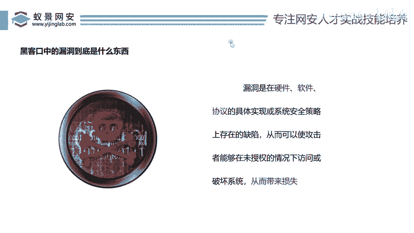

# 2024B站最值得看的黑客教程 ｜ 网络安全／渗透测试／内网渗透／漏洞挖掘／web安全／kali linux／红队靶场／CTF／信息安全 - P137：黑客口中的漏洞到底是什么东西？ - 网络安全免费学 - BV1uBsTetEow

一部分啊CPUAPU网站漏洞怎么挖啊，为什么要会讲这个啊？因为我们直播间有很多人是小白，他第一次来，他还不懂网络安全，不了解网络安全，对吧？不像很多啊高手对吧？已经听过很多节课了，他自己掌握了一定技术。

对吧？那么当然我要去照顾那些小白，所以我得从什么从0到1的去讲啊，不能跳着讲，不然兄弟们就容易晕啊，好，那么来我们来看看今天这节课说什么啊。😊。

就是我们老说呀漏洞漏洞对不对啊？那么黑客口中的这个漏洞到底是个什么玩意儿呢？啊，这是非多人好奇的东西，对吧？好，那么这个漏洞其实在网上对吧？它是有一个具体的描述的。来，我们来看看对不对？哎。

漏洞是指什么啊？漏洞是指在硬件软件协议中存在的缺陷，对不对？那么通过漏洞可以对系统造成破坏，从而带来损失，哎，就这么简单，对吧？比人说漏洞是不是bug呢哎，不对，漏洞它不是bug。

哎，bug是个什么东西？bug是你在开发一个呃软件的时候，这个软件的功能用不了这个软件的逻辑有问题，对吧？导致这个呃网站不完善，对不对？那是个是bug，那bug呢一般呢都会提前被修复掉。那么漏洞是啥？

漏洞是所有的人都觉得没有bug了啊，但是被黑客找到他一个漏洞。通过这个漏洞，我可以控制你的电脑通过这个漏洞，我可以啊让你的公司受到利益上受到损失，对不对？所以说现在衡量漏洞的来说。

就是给公司能带来损失啊，一旦说你能带来损失，那么这个漏漏洞的这个影响力就比较大了，对吧？哎，所以说我们就看啥东西能给公司带来损失，哎，那么它就属于一个漏洞，对吧？

那么我们这里说了硬件软件协议它是多个方向的，那么很多人就不明白什么叫硬件，什么叫是软件来我们一个一个看一个一个。😊。

