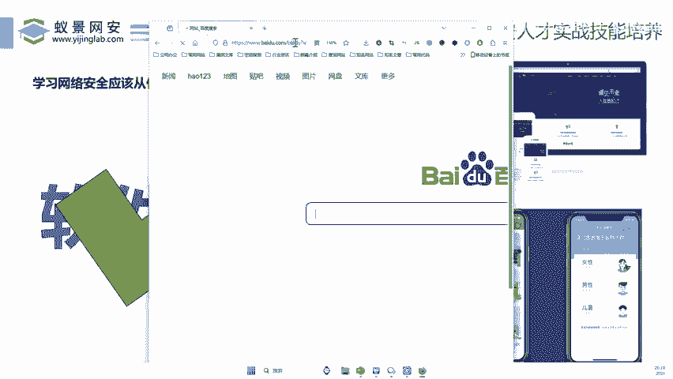
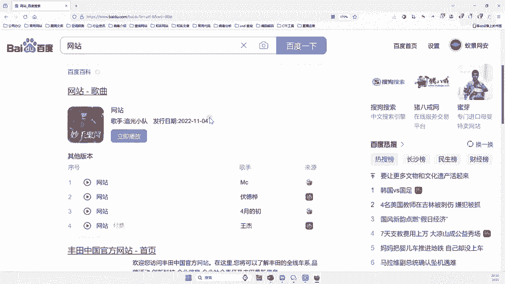

# 2024B站最值得看的黑客教程 ｜ 网络安全／渗透测试／内网渗透／漏洞挖掘／web安全／kali linux／红队靶场／CTF／信息安全 - P138：学习网络安全应该从什么漏洞学起？ - 网络安全免费学 - BV1uBsTetEow

对不对？我们先看看什么硬件漏洞。什么叫硬件漏洞，硬件啊突出的是哪个字？突出的是硬，对不对啊？当然兄弟们哎我们什么东西在这个计算机行业里面比较硬。哎。

我们看看比如说我们CPU硬不硬对不不是非常硬啊1个CP多兄弟们打游戏都知道1个CP是I5I7，这个动不动几千块打游戏用好那么假如说李哥哎我要学漏洞，我能不能学这个CPU的漏洞啊。

没你硬你叫勾没你硬你的I跟你的话真棒啊。好，那么兄弟们来我们能不能学习CPU漏洞，那当然是不可以为什么来想想因为我们市面上的CPU比较多，对吧？你像I5I7I8I9那么多大小小加起来对？

你把那些CPU买齐都得花几十万才能把买那么大部分人来说肯定没有那么多钱对吧？去买那么多CPU啊你都没有这个CPU你怎么研究这个CPU漏洞呢？啊，是不是。😊，所以说我们购买的成本第一是比较大。

二就是学习起来也比较难。市面上也没有人去讲这种硬件漏洞，对吧？啊，这太复杂了，就涉及到计算机太底层了。这你不是个什么博士生研究生啊，你真的学不懂这个对吧？

以他门槛也是比较高的还比如说我们这种一些硬件的这种安全设备，我们要挖这漏洞。那么所以说对于很多初学生来言啊，我们所指的漏洞啊，你要学漏洞，肯定不是学这种硬件漏洞的，对不对啊。

所以说你要上来说李哥我要去学CPU漏洞啊，那肯定是错误的对吧？因为这个你学习的成本太大，除非你是什么王思聪，对吧？你是高富帅啊，有钱又有 moneyey啊，那你可以学，对不对？哎，否则的话啊。

真的不建议大家学啊，不建议大家学啊，因为你这个学习成本太高了啊，好，那么除了硬件，我们来看看还有一种叫做软件漏洞啊，那么什么叫是软件漏洞呢，哎，我们来看完之后你就知道他是怎么回事了啊，那么软件漏洞。

兄弟们来我们来看看比如说我们的。😊。

这个唉，这个大都知道吧？😊，APP、微信、支付宝和百度，哎，你报的王者荣耀，你玩的美团对不对？哎，你看这些软件你有吗？肯定有啊，你只要有手机，你就可以免费去下载这些软件，对吧？哎，那这样的话。

我们假如说去找这种微信漏洞，那你就成本比较低啊，为什么？因为。😡，找这种什么美团的APP漏洞，哎，找一些什么游戏漏洞，你成本比较低啊，因为你可以随便下载，下载完之后，你只要用工具去测就可以了，对不对？

所以说它就比较适合。还有什么呢？还比如说这种网站，哎，我们在网上都用网站吧？京东去购物啊，淘宝去购物小红书啊、抖音都有网站的形式，对吧？那么网站也可能存在漏洞。那么网站我们也是能轻而易举的干嘛的，哎。

给它访问到，所以说哎这个软网站它也是个软件，或者说哎我们的小程序大家知道现在这种抖音对吧？快手微信哎，它都有自己的小程序，那小程序里面对不对？哎，我们是不是会有一些那功能可以点开呀，小程序买购票呀。

小程序去动物园呀，小程序说唱呀。哎，那这些小程序你可以点开，你也是可以轻松访问，那么哎兄弟们我们问题来了，软件漏洞，我们学习起来，成本就比较小了，为什么？因为首先这些软件你都有，只要你用手机。😊。

你都可以有。第二的话，哎，市面上关于他的相关的资料啊，教程也是比较多的。而且还有其中最重要一点是什么啊？哎，第三点也是我们现在工作需求啊，就是现在假如说你要从事网络安全，你要学习他们问的漏洞。

它都是软件漏洞。所以说兄弟们，哎，以后我们要学习漏洞。哎，先从哪里入手呢？一定要从软件漏洞开始学习。那么这样的话是非常有利于你网络安全这样的一个道路的发展的啊，一千万不要学偏了，对吧？学偏就容易干嘛的。

哎，就是走的走个偏门啥的啊，就是容易不好搞，对吧？所以说软件漏洞一定要我们学好，那么我们讲这些是干啥的，哎，其实就想告诉大家，今天哎李哥。😊。

哎，就会用这个浏览器。😊，啊，在这个网上网上大家都知道吗上网吗？对不对啊，我会在这个网上啊找到随机找到一个网站，然后并且找到他的漏洞啊，然后把这个漏洞提交给专业的漏洞平台啊。

那么大家就看看李哥今天是怎么操作的啊，你学会我这种方法，你每个人都可以找啊，一天找个100个没有问题，好吗？那你今天就按照我的步骤一步一步来学，对不对？是随机的吗？啊，呃差不多了，哎差不多随机的好。

那么兄弟们来我们来看看今天啊到底用什么技术，什么东西能学这些漏洞。当然啊在这里我要提前说一下啊，因为我们这个漏洞挖掘啊，就是说找这些东西的漏洞，它的方法啊，姿势比较多，对不对？每个人有不同的见解。

每个人不同的经验，对吧？啊，这个挖掘起的姿势也不一样啊，那么我当然会从最简单的方式开始，对吧？我上来不可能说拿个数据包啊，直接给你去逆向里面的东西啊，里面去拆里面的一些算法啊，然后去看代码，那你。😊。

啊，咱直播间200个人没有一个人能听懂，是不是？所以说我会从一些简单直观的方法跟你去讲啊，那这样的话你一看就懂了啊，就这么简单。所以说你啊学完之后啊，相信每个小伙伴应该都会好吧？好。😊。

