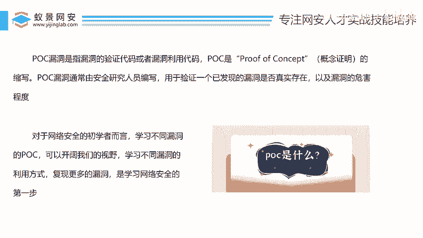
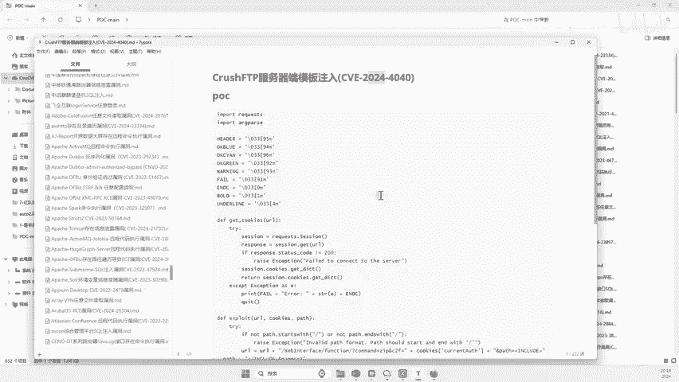
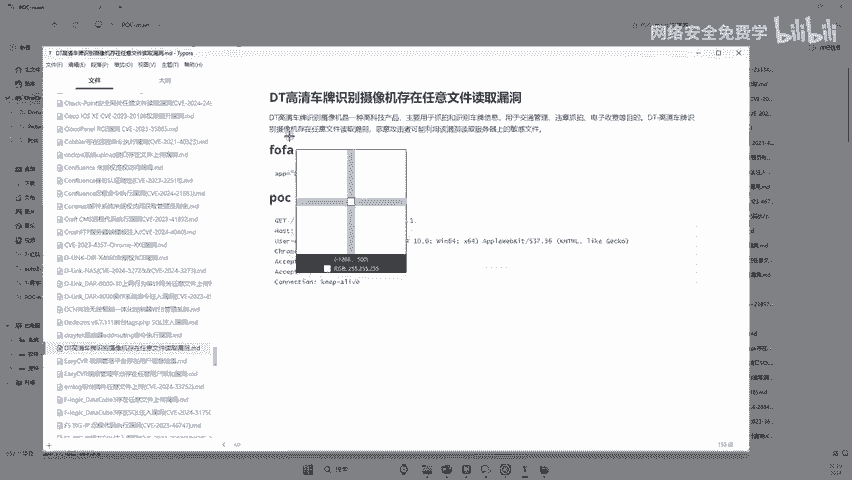
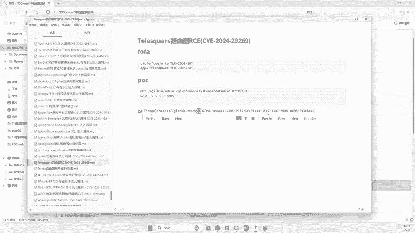
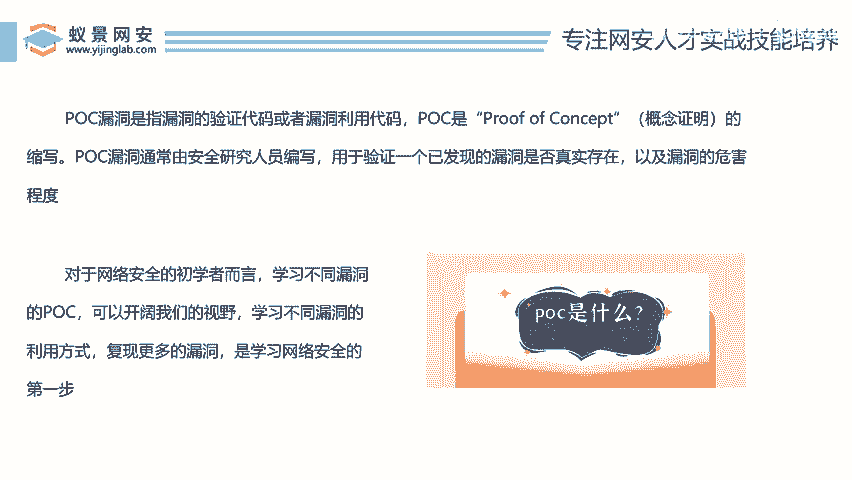
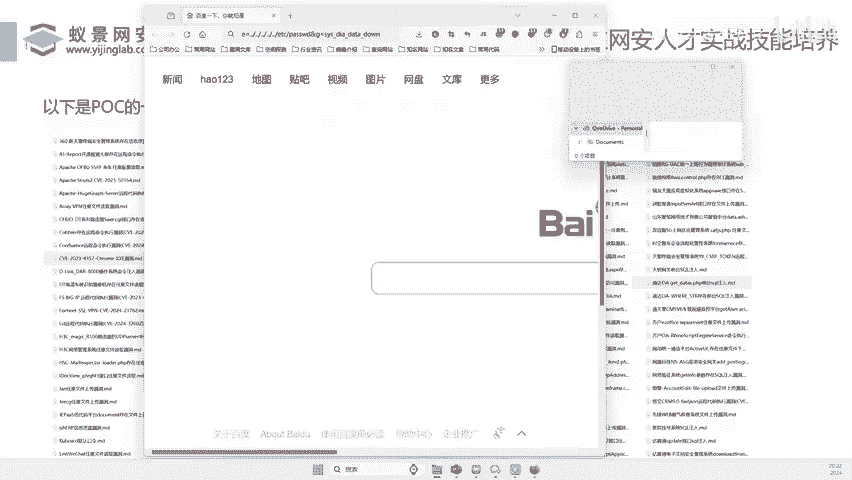

# 2024B站最值得看的黑客教程 ｜ 网络安全／渗透测试／内网渗透／漏洞挖掘／web安全／kali linux／红队靶场／CTF／信息安全 - P139：海量POC读懂了你就是漏洞之王 - 网络安全免费学 - BV1uBsTetEow

那么首先我们要挖漏洞啊，我们对于初学者而言，应该怎么去挖。当然我们知道大家就跟大家一样，对吧？我们要高考，你得先有小学幼儿园，再有小学，的有初中，再有高中啊，你得学习得一步一步，对吧？啊。

你不如生下来你哎，妈妈就让你去高考，那咱也不会呀啊，我们学习一样的对吧？你做这个漏洞，你肯定也有一个一个步骤，一个步骤，对吧？所以在我这里想讲的是啥？就是说对于初学者而言，什么叫初学者，就是说。

我现在还没有挖到过漏洞，我还不知道怎么去挖漏洞啊，我在网上只去看个什么开例，B站上去随便聊一看一看网络型黑客技术，对吧？啊，不太懂，还不知道还没有真实战过啊，那么这个都归于什么刚接触初学者。好。

那么如果说你是这种人，那我们来看看，哎，我们今天用学什么内容呢？哎，兄弟们，如果说你是初学者，你首先想要学简单的，你就得从这个什么POC学习。好，假如说你把这个POC懂了。哎，你就是漏洞之王，对不对啊？

谁是漏洞之王，哎，你就是漏洞之王，对不对？好，那兄弟们，我们来看看什么叫POC怎么利用这个POC就能哎3分钟挖到100个漏洞啊，就这么的炸裂。来，兄弟们，我们来看看啊。😊。

好，那么兄弟们啊，我们讲这么多，哎，得先干嘛呢？得先教大家一些原理，教大家简单的一些概念，对吧？如果说你这概念不懂，你是非常的混乱的哈。首先我们先说一下什么叫POC啊，POC的英文啊，就是这个东西。😊。

啊，这个这个一串英文单词好不好？那么聪明的小伙伴啊，你可以在心里默读一下啊，他的英语怎么读，对不对？那他放到中文翻译过来意思叫做什么概念证明哎，就是POC那中文名就叫什么概念证明好，那么POC是干嘛的？

来，这里有一个具体的话术描述描述，对不对？就是说是指漏洞验证代码或漏洞利用的代码。😊，哎，什么意思呢？哎，就是说我们有1个POC啊，这个POC是个啥，可以是个代码啊，也可以是个文件。

也可以是个excel。那里面写的什么东西呢？里面写的是用来去验证已发现的漏洞是否真实存在啊，也就是说你有这个PC哎，然后这里写了哎谁谁谁谁谁谁那里有漏洞。好，然后你把它看懂了。

你去网上找到一个类似的东西。然后你用这个POC去验证一下，哎，这个网站是否存在一个这样的漏洞。😊，啊，就是验证一下它啊，那里面写的是啊各种各样的验证方式啊，然后有的是代码的，有的是抓包的。

有的是五花八门的啊，所以说这POC里面写的就是教你什么POC里面写的就是啊我们如何去验证这个网站是否存在这样漏洞啊，听好了，只是验证一下，仅此而已。那么有的POC它可能会直接写到什么啊。

让你去利用这个漏洞控制别人的网站啊，有些POC只是验证漏洞存在，就到此为止了啊，那么这个呢就根据每个这种编写人员的习惯啊，他想把它写成验证，就是验证，想把它写成利用，就是利用啊啊。

所以说我们这个POC就非常关键了，对不对啊，那什么是POC啊，那么对于我们初学者而言，学习不同漏洞的POC可以开阔我们的视野，对吧？假如说你学了1万个啊。

你见识了1万个POC那你就代表着你见识个1万个不同的网站。😊，是不是啊1万个不同的网站。好家伙，那下一次你找到一个网站，你看哦这个网站曾经我遇到过，哎，我一眼就知道这个网站有什么漏洞了，对吧？

那这个就是经验问题了啊，所以说对于很多小伴而言，我们要学会漏洞挖掘挖漏洞第一步是就是认识POC看POC复线POC里面的内容对不对？那么学习不同的漏洞的利用方式复线沟洞漏洞是我们网络安全的第一步啊。

如果说你现在这一步还没搞定，那你要？先手上得有啊很多POC啊，你就是有句话什么对吧？啊，这个呃这个呃水深不深啊，我我看一眼就知道深浅了，为什么？因为你曾经在这个水里面走过无数遍对？

你这个去过小溪去过湖泊啊，你看到颜色你就知道这个湖深不深了，同样的你遇到过那么POC你见过那么多POC那你随便打开一个网站一看就知道了哦，原来这个网站我曾经类似我就知道这块哪一块存在一个什么漏。😊。

怎么去用就能把这个网站攻下来。哎，这个就是POC的个东西啊。所以说非常重要啊非常重要啊。我们每个人都要去学习这个POC好，那么这个POC哎有人说了好，那李哥这个POC从哪里来呢？

我从哪里去这个呃搞POC呢，哎当然不需要兄弟们去搞，对吧？你们搞很多人搞不定来李哥给他整理了700多个POC那么这700多个哎啊有很多都是2024年的，还有很多是2023年的，对不对啊。

这样的一些POC了，好，那么兄弟们你看这里有很多你看像这个呢就是什么2024年啊，2月份的1个POC啊，这个是2023年的POC对不对啊，还有很多2023年的对吧？也有2018年的。

也有2020年的对吧？记得还有2024年的2024年啊这个4月15号的，对吧？那么这些POC里面就存了什么存放了啊不同的网站不同的模块啊，他的漏洞复现，或者他漏洞的一些利用的方式，你只要把它看懂。😊。

那你还愁找不到漏洞吗？对不对？好，那么说这些POC长什么样子呢？有人想要对不对？想要的话可以找助理老师啊，那么李哥已经完完全全的啊免费给到兄弟们。好，那么我现在打开这个POC啊。

那么随便带着大家去看一个对不对？好，那么这里面我这个POC我说了，利用方式不一样啊，有些利用起来比较就有些这个证明起来比较简单，有些证明起来比较难，对吧？就跟你做数学题一样，对吧？让你证明一个结果啊。

有些题它比较简单啊，我们只要会简单的1元2次方程它就能证明那有些题证明起来比较复杂，他可能需要向量啊，需要什么这个什么坐标轴啊，各种各种证明，对吧？以当那证明方式不一样啊。

那这里面就有难有难有简单的方式证明的有难的方式，那这个就主要去看这里面POC是怎么写的对吧？好，我们可以这里边找一找啊，随便我随便打开一个吧比如打开这个海康威视的这个啊好。

我们打开这个你看你看这里面就写了对吧？你看海康威视安全网单存在任意。😊，文件读取漏洞，这是什么意思呢？啊？任意文件读取漏洞意思就是说可以随便去读它电脑里面所有文件啊，那这就是它POC的一个验证啊。

你看这个POC验证，哎，大家可能可能小白就看不懂了，对吧？说这是什么意思呢？哎，其实我用人话来讲究啥，就是你在这个网站后面把这串内容啊，就是这个复制一下。😊，单回答意思啊。啊。

就假如说你找到一个这样网站啊，你把它内容复制到这里，回撤一下啊，就这样回撤一下，哎，就可以随便去读它网站里面的所有文件了啊。这个POC就是这样的这个相对而言还是比较简单的对吧？哎，就是这个路径啊。

我们只要干嘛呢哎在网站的后面加一个这样的路径。然后你看像他在里面就可以读取到这个网站电脑里面的所有文件的内容了。哎，就是它简单POC的这个就非常简单，对吧？啊，只要在你的这个网址里面回撤一下。

就可以验证这个漏洞了。好，我们还再看一些新的啊，比如说我们找一些2024年啊，4月FTP服务器的模板注入来，大家看这个POC你看这个2024年4月4月份的一个对不对？

4月份的一个大家看这个这个就比较复杂啊，对吧？你看这个我妈还有一段代码。😊。

啊，你看这个还有4月份的漏洞啊，几月份，现在6月份两个月前的一个漏洞。那我们看这个还要搞代码。😊，那这个代码你搞得懂吗？啊，很多小伙伴小伙伴就没有这个代码啊，或者说给你这个代码，你都不会去运行，对吧？

那这个时候怎么办呢？那你就要学习这个啊代码是如何编写的，代码是如何运行的啊，把这个学完之后呢，你就可以去哎把这它运行起来了。😊，是不是啊，那如果不懂的话，你就要学懂不懂的话，你就可以直接运行了。

那你看刚才一个有的是简单，有的就是难，对吧？还有这个什么啊高清摄像头，对吧？像这个啊这个这个TD车牌啊，车牌时啊摄像头啊，就是找到一个识别车牌的对吧？那我们可以利用下面的方式啊，就可以干嘛呢？

读取任意文件啊。当然这个也比较简单，对吧？其实是在我们这个啥意思呢？就是在我们的网址后面对不对啊，加一串加一串这样的值啊，这样一串值就可以把它读取到了啊，读取到它来任意文件。😊。

好，大家可以看到这个POC里面对不对啊？这里面是不是有很多有600多个翻翻不完，对不对啊？一共是多少？652个啊，差不多快700个左右了啊，这么多POC啊，有都是最有的最新的，有反正这近5年的都有啊。

也是比较一些比较火的一些了。那有人说了，哎，李哥，我学这些东西是干嘛的。😊，啊啊学这个，比如说看个RCE啊RCE没有问题啊，来RCE啊啊搜一下RCE。你看这里面RCE这漏洞这么多啊，对吧？

你想要哪个RCE来，我随便打开一个，比如说呢这个这个啊契约锁啊，契约锁什么电子签章系统啊，那可能我都没听我都没听过，你也没听过，对不对啊，那它怎么利用呢？来，这是它利用的这个什么哎脚本。😊，啊。

利用的什么利用的这个什么代码。好，那很多小伙伴就看不懂了，不知道这里面写什么啊，当然你肯定哎出具的来源不懂啊，我们一会儿大家去复现一下，你就懂了啊，复习一下就懂。好，OK那就这就是RCE漏洞。

那么这个呢你看哎就是一个什么啊RCE漏洞啊，别人已经什么公布在了互联网上RCE上RC就是远程控制别人电脑的一个漏洞啊啊，非常多啊，再给大家随便打开几个吧啊，比如说这个啊什么一个路由器。😊，啊。

路由器的一个漏洞啊，通过路由器大家可以看到没啊，实现了远程对吧？控制别人系统的一个东西。好，很多小伙伴在这里看不懂啊，没有关系啊，一会儿给大家说一下就行了啊。

所以说啊还是那句话啊啊这个PUC的学习对不对？一定要深入学习啊，深入学习啊，当然虽然呢大家刚刚给大家看了几个，可多人看不懂啊。那其实呢里面是不是非常简单的啊，你用两天把里面的知识就学完了啊。

没有那么难啊，你。😊。

真的没有那么难啊，有的是比较简单，有的比较难。所以说我们可以看到在POC里面有不同的啊漏洞，利用漏洞证明的方式啊，那么这样有人说了，那学这个有什么用呢？学这个能干嘛呢？哎，兄弟们，你说我们学这个能干吗？

来，我给大家举个例子，你看。好，你看这里说锐捷的这个上网上网行为行为系统，哎，存在一个什么漏洞。好，这里写写了非常多了。好，那你有没有想过？假如说我能在网上找到1000个啊瑞瑞捷的上网行为系统啊。

然后我用1000个，我用里面的东西去测一下。我是不是就知道这1000个锐捷的系统里面有没有漏洞了。如果有哎，那我是不是就找到了一个漏洞？是不是这个简单啊？所以说PUC怎么用？

就是我们把这个PUC看懂之后，然后去网上找它相同的系统，找它类似的系统啊，然后一个一个去复现，一个一个去看有没有漏洞，有漏洞，牛逼没有漏洞，下一个对不对啊？有如说这里有没有企安性的漏洞。

当然有企安性的漏洞了啊，有企源性的漏洞啊，企安性天容性的都有，对不对啊。

好，那么我们到接着来给大家看啊，一会儿再给大家去看看这个POC啊。然后呢，我们现在要回回到我们一个重点了，对不对？就是怎么去用这些POC怎么去挖漏洞，对不对啊？为什么有些人通过这些POC的付现。

一个月就能搞1万块钱呢？啊，今天李哥啊就把这些方法交给你好吗啊？😊。