# 2024B站最值得看的黑客教程 ｜ 网络安全／渗透测试／内网渗透／漏洞挖掘／web安全／kali linux／红队靶场／CTF／信息安全 - P13：从命令执行漏洞到getshell（2） - 网络安全免费学 - BV1uBsTetEow

get share就是获取目标网站的命令执行权限。就是获取目标网站的命令执行权限。首先呢。get share的方法是非常多的，我们可以利用不同的漏洞来达到相同的效果。现在我来讲一个最简单的。

也是大家能在入门安全中都必须要知道的啊，这样一个漏洞。这样一个利用手法叫做web shareweb share是什么？看起来它可能比较高级，其实大家可以这样简单理解，它是一个网站的木马病毒。

weber share针对我们网站不同的编程语言，它是有相应变化的。常见的网站后台编程语言有哪些呢？比如说像ISPISP donnet。PHPGSP还有我们的pythonnGS等等服务端的网站编写脚本。

那这些网站的脚本呢都有相对应的后门木马病毒web shell就是这样一种存在。我们只需要把web shell上传到目标的网站，我们就可以得到对他进行控制。可以就可以对它进行控制。

那下面呢我们就来整体的了解一下这个weber share啊到底是怎么去执行和运行的。好，下面我们来了解针对最简单的PHP它的一句话木马是怎么样子的。一句话木马就是指在一行指令中就实现这个木马病毒。

首先呢我给大家看一下这个PIP的一句话木马。可能部分同学呢他没有PIP基础，但是这是完全没有关系的。我们来了解一下它，你记住它就行了。它可能呢你花5分钟的时间就可以把它记忆一下。他就做PHPPHP。

加上后面的这个标签是证明当前的代码是一句PHB代码。好，中间的是调用一个语言构造器，叫做ele，然后接收我们用户传递过来的参数。好，我给大家讲，evo是PHP的官方定义的语言构造器。

它的作用就是我把我们传入的字符串当做PIP代码执行。啥意思呢？就是我们可以传入任意字符串当做PIP代码执行，它会造成什么危害啊？我们就可以去操控这个服务器，执行任意的代码。这个东西难道啊还不危险吗？

是吧？有的同学在刚学安全的时候，他一直就不清楚，他说老师这个东西到底能造成什么危害呀，是吧？就一直有这个疑问，你想一下，你都能控制别人的代码了，都能控制别人的服务器了，你都能给他这么勒索病毒。

让他给给你自己挖矿了，这不是危害嘛？啊，这明显是一个危害极大的那这样一个一句话木马，应该怎么整套我们的这个DVWI上面呢，我给大家讲一下，首先在利用我们上传木马的时候。

不论是上传我们的web shell也好，还是上传任何的高级的内网木马也好，请大家一定要注意这三个地方。这三个地方。首先第一个啊，这个同学说这么危险，官方怎么不删除或者修改？我跟你讲为什么不删除啊。

这相同的危险的函数还有很多。比如说asert assertert ISERT，它和el实现的功能基本相同。这个函数也很危险，PHP啊现在已经把它给删掉了，是对的。PHP它会做安全更新。

但是eva啊e它本身就是一个正常的语言构造器，我们的PHP是无法离开它的，大家可以看一下，几乎所有PHP的网站中都有evo的存在，它是构造语言执行各种架构各种框架经常使用的一个语句。

所以说PHP啊不可能把这个e给它移除掉啊，懂了吧？这就为什么不删除和修改。因为PHP太依赖于它了。现在我们上传任何木马都要掌握3点，3点。第一个就是上传到哪儿，你首先你要清楚把你的这个木马，你传到哪里。

第二点就是你掌握怎么上传，我们可以通过上传头像上传，通过上传附件上传，或者是通过我们这个简单的命令执行上传。OK第三点呢是怎么访问，怎么访问，就是你要知道你上传的地方是在哪里。现在我来给大家演示一下。

首先在命令中上传这个木马的原这个语句呢叫做eco。Eco加上我们的PHPe post到我们的1点TAP这个里面。我现在呢直接从这个上面复制下来给大家看一下。好，我复制给大家吧，这个地方复制给大家。

有问题的话，你可以提出来啊。现在我来给大家复制到这个。地方首先我们复制这条命令之前，你要加上正常的IP地址啊，要加上你先实现原版的功能，然后添加一个and符务，再加上刚刚的这条语句啊。

然后我们点击subit。点击s meet之后呢，大家可以看一下，去访问一下这个一点PHP看他有没有上传成功。可以看到呢，这个时候他会告诉你，我not found，如果出现notote found。

就证明我们这里是没有上传成功的，为什么会产生这种问题呢？可能是标点符号的原因，这多个斜杠哈，等一下我会给你解释，现在可能是老师复制的时候出现了问题，我们只需要把相应的改正就行了。哎。

老师来改一下来改一下啊，相应的标点符号呢改成我们的英文标点。好，我们再来执行。执行之后呢，现在你会发现他没有任何的问题。好，我们访问一下一点PHP。这个时候显示空白页面。

而不是我们刚刚看到的notote found，就证明我们现在已经把这个木马传上去了。首先解答一下大家的问题。首先呢就是啊这个这个同学同学提的是啥呀？什么把链接密码改成什么东西啊？这是啥东西啊。

我没有看懂你出一下中文。然后这个同学说为什么多个斜杠，我先给你解释一下啊，这个斜杠啊，你可以加也可以不加。但是在linux操作系统中，你需要去加上啊你需要去加上为什么呢？因为我们这条命令啊。

我们这条执行的是我们这条命令执行的是你的linux指令，在linux指令中，这个do符呀，就这个美元符你必须要转译，为什为什么呢？因为如果你不写这个斜杠的话，我们linux操作系统。

它会认为你这个do符呀，是我们linux的站位符，它而不会把它当做是我们PHB的代码去传入啊，不是我们的PHP代码去传入而是加一个斜杠，它才会变成我们真正的do啊，你可以试验一下啊。

这个同学所以说就是要加这个斜杠啊，加这个斜杠，这个木马。上传了对自己有什么帮助，你想一下有什么帮助，你可以控制它呀，我们等一下来讲啊，等一下来一一的来去把它攻破啊。首先呢就是这三个问题我们都已经解决了。

现在呢是把木马上传到上面，并且呢访问到了这个木马访问到这个木马，有同学说这个木马怎么是空白的呀，是吧？怎么是空白的呀，因为这个木马不需要任何的输出呀。在真实的情况下，木马就是没有任何输出的。

你想让他输出也可以输出一个中二的图片呗。输出一个哎，我是黑客，你的网站被攻陷了，这有什么实际意义呢？没有啊，所以说这个漏洞应该怎么去利用啊，怎么去利用是我们要学习的。首先就是怎么去使用这个木马啊。

怎么去使用这个木马，它有非常多的使用方法。比如说我们使用一些浏览器的插件，或者是使用我们今天所讲的weber share管理器。首先给大家讲一下什么是web shell管理器。

web shell管理器就是自动化管理我们上传的网站后门木马的一个东西啊，上传网站后门木马的东西。我们常见的，比如说像乙键、菜刀、C刀、冰蝎、哥斯啊等等，这些都是常见的we shell管理器。

那他们有什么区别呢？给大家简单讲一下，首先是一键，一键是最适合小白的，因为它一直在更新，并且兼容性非常好。第二个是菜刀和C刀。菜刀和C刀呢它是比较老的一些外部效管理器呢。

可能对现在以及对我们PHP可以说还行。那对GSP包括ISP等等的这个网站呢连接起来就比较麻烦了。第二种叫做哥斯拉和冰鲜，这两个东西呢是不建议新手学习。

你可以先把已键菜刀或C刀中的其中一个先学会再来去研究冰鲜和哥斯拉。那冰鲜和哥斯拉呢分别是有加密的，进行流量加密的这个同学说的对啊，进行流量加密的一个木马链接工具。

我们现在先来学习一个最简单的叫做已键为什么要学习它呢？第一点，已键的全称叫做中国一键，它是一个国人开发的，里面有上面啊有有写的啊，这个同学啥PHP大小写上传了链接不上是什么意思啊？

大小写我们第一半啊linux操作系统，大小写敏感的，你不能说改变它的大小写来绕过它的上传，这是不行的呀，这是不行的。你问的是不是这个问题啊？当然可以当然看不到啊，这位同学，你不要搞混了。

你网站你网站这个你网站右键看到的源代码是啥呀？你网站右右键看到的源代码是属于前端代码的呀，是属于前端代码，我们渗透测试都是打后端，都是打服务器，知道吧？这个东西看到的都是你浏览器的东西。

不是服务器的东西啊，所以说这个源代码中是看不到的。源代码中是看不到的。那我们现在来学习中国一建。中国一建它的好处就是第一，它是国人开发。第二，它有详细的官方文档。我现在把这个官方文档链接呢发给你。

一建的所有使用，其实最方便的就是使用我们这个官方文档。它讲的内容，后端当然可以看到啊。你写的代码后端能看不到吗？是吧？就给你别人给你上传一个勒索病毒，你看不到吗？那肯定能看到呀，是吧？就是这样的。

那现在呢我们可以打开一下这个已键的官方文档，给大家简单浏览一下。已建的官方文档里面写的非常详细，有已建的快速入门，如何下载，如何设置语言以及如何去连接shall。第二个呢是对于我们已键的详细信息。

文件管理、虚拟终端、数据库渗透以及安装一些拓展插件，它里面写的实在是太详细了。其实大家呢在昨天我也讲过，一款优秀的工具，最好的教程不是百度，也不是我讲的，而是它的官方文档。

因为这个官方文档就是作者他自己写的。它对这个工具啊是有一个最好的啊，它能最好的去识别这个工具的使用方法。我们首先第一步就是下载一键的加载器啊，下载一键的加载器。

点击获取加载器就可以从ge up上面下载下来。在加载器中，它是针对不同操作系统一个跨平台的。这一个工具分别是我们的DLRwin，就是我们的苹果电脑，还有linux不同架构，不停位数的。

以及我们windows32位和64位的这样一个啊这样一个啊get up上面下载的这个加载器啊，这是第一步。第二步就是我们要下载已键的源代码，并且加载。我们只需要把点击这里下载源代码并解压。

然后打开加载器，加载我们的源代码就可以了。语雀这个不一定啊，你要看这个作者，他想在哪里写，那就在哪里写，懂吧？这个不是语雀决定的，语雀只是一个工具啊。语却只是一个平台。你要看这个作者，现在已见的作者。

他就喜欢用语雀，他就用语雀写。那如果另外一个哥斯拉的作者，他就喜欢写自己的博客，那天用自己的博客去写，这个是作者来去决定的啊。对，这是一个手法授的教程，这无疑让我想起来了。

之前在互联网中特别流行的一个表情包。比如说我们在学习一个东西的时候，经常去百度搜索。比如说啊某某教程7天包教包会，然后这都排满了。对大家都去购买都去看。第二个呢是官方文档，无人问津，官方文档没有人去看。

当然可以用了，零基础可以用这官方文档，它写的太清楚了，为什么清楚呢？有一个很好的解释，就是它是中文。它是中文，它是一个国人开发的，可能老外写的东西啊，我们看不懂，你去看老外写的代码书，你就知道了。

他那个代码逻辑啊好像跟我们国内就有点不一样。但是这个地方啊我们就不要担心了，它就是一个国内的大佬开发的。好，我们现在把已键下载好之后，你就可以打开它了。我们来打开一键看一下给大家啊，打开一键看一下。

双击and word点EX1。我们就可以打开已键。打开已键之后怎么去使用。第一键方法就是已键啊，它是一个纯中文的界面，你可以多点击点击多探索探索就可以会使用了。第二个，如果你不嫌麻烦的话。

你可以在这边看，你看它写的太清楚了。

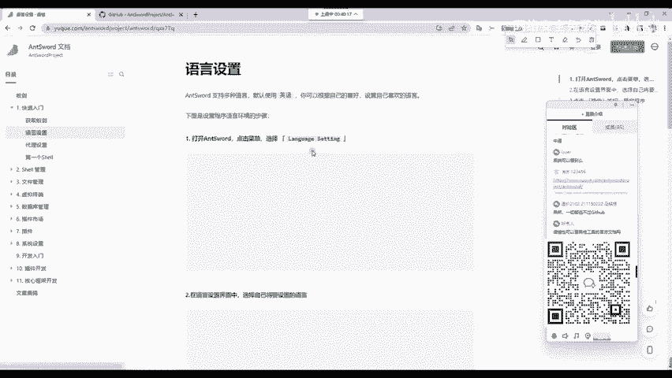

看他写的太清楚了，知道吧？看你把这个切换英文还是切换中文都给你显释清楚了啊，防止啊你是个老外是吧？你想用英语版的，他也有给你写的太清楚了。然后怎么保存，以及怎么设置代理是吧？

比如说你正常正常打网站的时候，你比如说你想设置代理，然后他这里也跟你讲了，你就去操作就完事了。这个已键的作者啊，就差给你录个视频了。但是我觉得他没有必要，他做的真的非常好了。

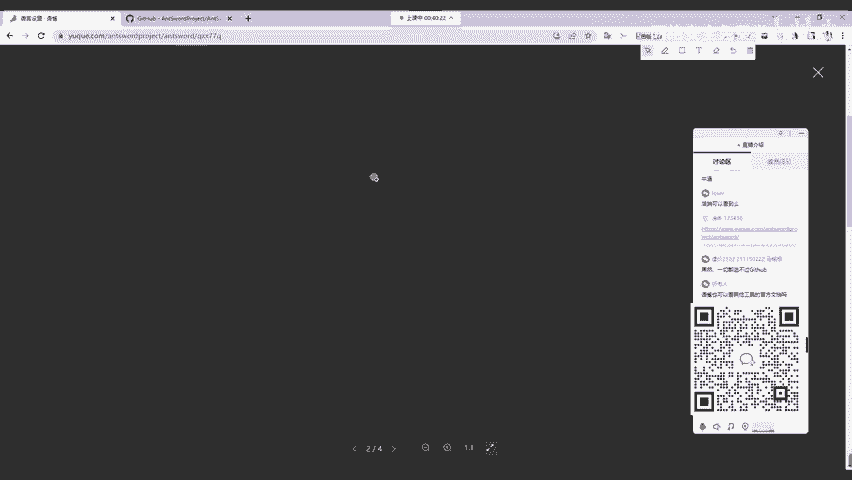

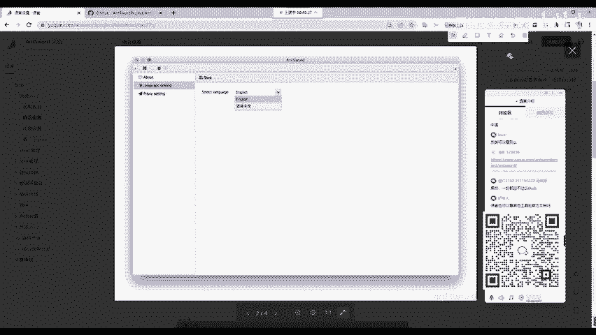

下面是第一个hell，就是shall呢，应该怎么去写，你看他多保姆级。这个同学说的真对，他不仅把这个hell，他怎么用，他给你讲，而且这个PHP的wevo shell是啥，他都给你写出来了。

你只要复制去用就行啊，复制去用就行。现在你看他怎么讲的。在这个空白位置单击鼠标右键，你不会看不懂这个吧，这肯定都能看懂啊。每一个同学都能看懂。那我们下面呢就把它添加一下吧，我们右键点击添加数据。

第一个叫做URL地址。URL地址是啥呢？URL的中文意思叫做统一资源定位符，其实就是大家日常访问的网址。比如说这个官方文档的统一资源定位符，就是这个就是上面这个地址栏中显示出来的。那我们现在的木马在哪？

木马在我们刚刚搭建的DVW的一点P这个地方。所以说你可以直接给它复制过来，给它复制过来，然后写在我们的UIL地址地方。UIL地址地方。第二个叫做连接密码，连接密码是啥？我们看一下作者怎么写的。

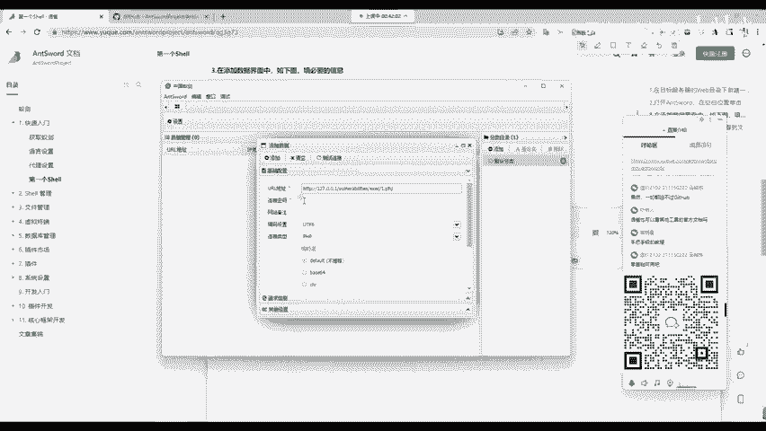

你看一下连接密码，作者写的啥呀？他写的叫做INTant蚂蚁。那这个密码是从哪来的？我们看一下作者使用的一句话木马，它使用的一句话木马，这个地方有三个字母叫做INT，它就是连接的密码。

那刚刚老师上传的地方上传的是啥呀？老师刚刚上传的地方是我们的CMD所以说我这里密码就是CMD你可以随意更改。比如说你改成张三李四都可以啊，随便你那你的密码就是张三。

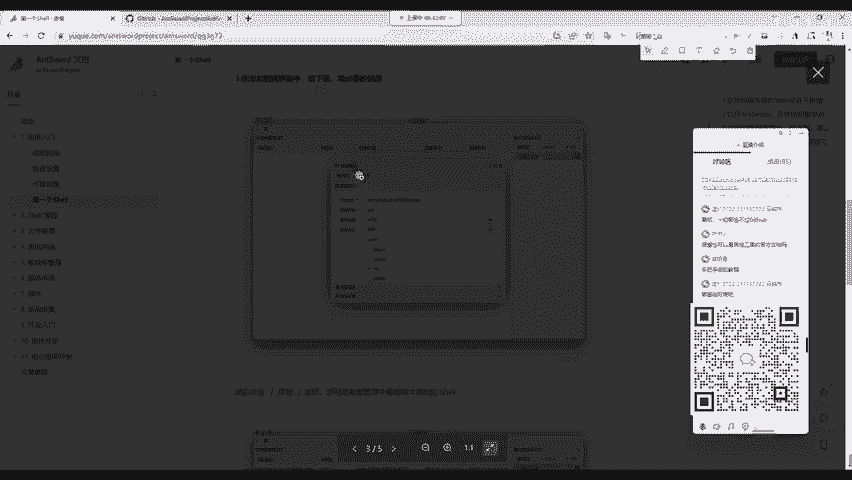

现在我来写密码CMD写好之后啊，之后的所有配置已键默认情况下就已经可以满足使用了。我们点击一下测试链接，你会看到连接成功。哎，这个时候已键就可以使用了。我们添加一下数据，添加之后能够做什么。

来给大家简单看一下。首先是双击进入。我们可以看到这个服务器直接被我们拿下了。它里面的所有文件，我们都能够看到，并且呢能够去下载它的源代码，还能够给它上传文件是吧？右键可以上传文件。

上传更多的后门或者是下载它上面的一些文件，都可以给它下载下来。我们就对目标的服务器进行了一个控制，进行了一个文件读取。第二件事情，你可以右键它看，有个叫做虚拟终端。

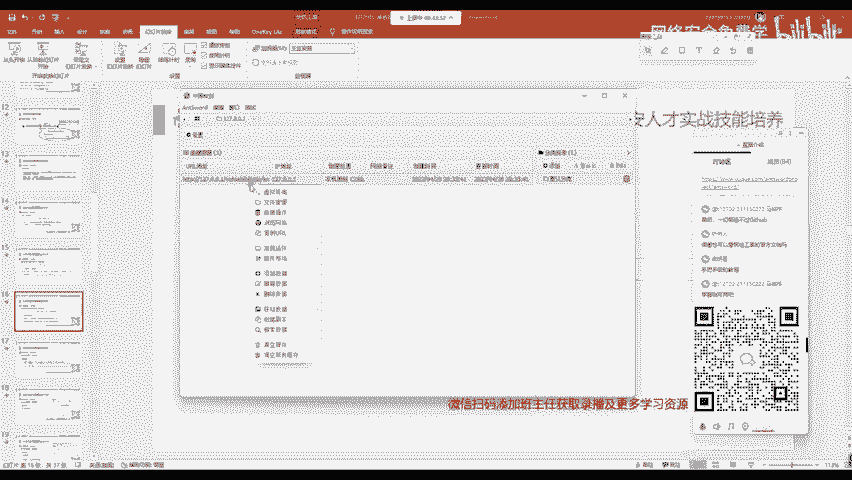

虚拟终端来到这里呢，我们就相当于是拿到了目标的命令执行权限。你看拿到了啥呀？拿到了它的命令行，命令行能够做什么？现在啊这个电脑是越来越被大家熟知。所以很多同学啊都知道命令行。

像以前啊让你打开1个CMD都比较费劲。现在我相信没有一个同学你应该不知道CMD是啥吧。那个windows的命令行。我们拿到命令行之后，只要权限允许你就可以做所有的事情，包括删除你的操作系统。

包括让目标系统关机，更改目标系统的桌面，这些操作，在这个命令行中都可以完成啊，都可以完成。这个时候你就操控了目标的机器啊，就操控了目标的机器，这是我们的we share使用方法。

给大家简单回顾一下PPT首先呢就是右键添加数据，里面添加的内容分别有两个必选项。第一个呢叫做URL地址，就是we shell访问的地址。第二个呢叫做连接的密码，就是在we shell中。

你那个括号里面所写入的密码啊，就是我们的连接密码啊，就是我们连接的密码，连接之后就能够控制网站了。啊，这是我们weber shell的一个基础使用方法和一个基础使用方法。那下。

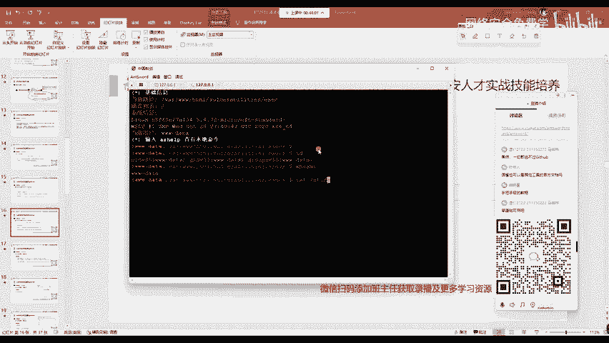

呢我们的课程也进行了一半的时间。那现在老师来发起相应的U盘抽奖活动。稍等片刻，大家可以打开腾讯课堂的一个点击它的抽奖按钮参与抽奖。我发布一下今的抽奖。我们今天的奖品呢还是U盘啊，还是这个U盘。

有10位同学呢能够免费获取到它。我么写10位同学5分钟之后开讲啊，确定发布。大家呢现在可以点击腾讯课堂中的这个小按钮来参与抽奖啊，参与抽奖。那在抽奖的同学，同时呢老师来继续为大家往下来讲啊。

继续往下来讲。首先就是我们如何利用历史漏洞。利用漏历史漏洞的这个网站呢，我已经发给大家过，就是我们的VUL hubub VUL hub这个网站 VUL hub它里面呢是基于我们昨天所讲的docker搭建了非常多的历史漏洞靶场环境。

我们点击这个漏洞环境之后呢，能够看到它非常多的漏洞啊，看一下非常多这些漏洞都是在开发过程中经常使用的第三方组件应用程序，开发框架以及OI的一些漏洞环境。

我们打靶场也主要就是用VUL hub它也是我们国内的一个安全大牛去写的。并且呢这个VUL hub，不仅是我们国内在用国外的这些安全大佬，也在使用我们中国人开发的这样一个安全工具啊，使用这个安全靶场。

它是怎么用怎么下载。同样的，我给大家讲过一款工具，最好用的地方就是它的官方文档，你绝对不要怀疑这些大佬。为什么这些大佬是这些东西的创造者？就像女娲造人一样，难道还有人更比女娲懂你吗？那是不可能的。

大家可以去访问一下这个链接，打开VUL hubub的官方网站怎么下载，怎么安装，这里写的已经非常详细了。你直接复制粘贴就完事儿。复制粘贴之后，我们就可以启动相应的漏洞靶场环境。

比如说老师这里想去复线thinkPHP，你就可以在这个se里面呢输就搜索啊输入thinkPHP啊，thinkPHP这先thinkPHP里面呢有非常多的漏洞靶场。比如说你看任意代码执行。

他会告诉你怎么搭建，怎么去利用，看到没？比如说看环境搭建，怎么搭怎么去复现这个漏洞，他给你讲的一清二楚，你直接去复线就行了。同样还有其他的，比如说5。0。23的这个远程代码执行漏洞，它都有这样一个解释。

抽奖的话是在腾讯课堂啊，它有一个点击按钮，你去点击抽就行啊，点击抽就行就可以参与抽奖了。那这个东西啊，大家只需要按部就班的去付现就完事儿了。复现漏洞，那绝对是你安全学习路径中最重要的一件事情。

如果啊如果你不去复现漏洞，我之前讲过了啊，我之前讲过了，就是你以后在工作中或者是你实际攻击一个网站给你漏洞，你都不回答。啊，就是这样一个危险性啊，就是这一个缺点。所以说我们一定要多复现。

你不要觉得它没有用，它的用处实在是太大了。那下面呢老师就举个例子来给大家讲，就是讲这样一个tom catt弱口令get shell来去攻击啊我们tom catt来获取这一个get share啊。

来获取这个get share。这个同学说的对啊，实战里还得先过wauff，这个没有办法呀。大家要清楚，我们渗透测试就是攻防的过程。以后啊大家进入岗位之后，你遇到所有的网站它都有防火墙，都有wauff。

你这样的话就没法学了，是吧？那没办法，渗透测试就是宏然对抗的过程，有攻就有防，那没有防御，那你攻击不轻而易举吗？每一个人都能成为大黑客，这是不可能的事情。现在各种防火墙是吧？

那绿蒙起安信深信福能的防火墙动不动就几十万，那难道没有一点防御效果吗？而且家用的杀毒软件，360。火容都是吃素的那他们不是啊，他们都是专业的安全防御研究人员，他能够轻而易举的防御你产生的木马病毒。

你的这个一句话，木马能够被别人轻而易举的拦截。那怎么办？第一个你要想办法。第一个就是绕过绕过。第二个就是你另寻其境，找其他的漏洞去打进去，找其他的网站去打进去侧面攻击。就像以前啊这个二战的时候。

大家都知道这个马奇诺防线看起来就是啊这个完全安全，绝对安全的一个马奇诺防线，最后还是被德军绕过去了。那360呢，它就相当于是马奇诺一样。我们可以绕过它，你可以另另寻其境。

走为一个其他的地方去攻击它就可以了。好，这个开已经开奖了。首先呢恭喜中奖的同学，那中奖的这10位同学呢，你可以截张屏幕啊，截一张屏幕截图，然后打开你的微信扫描右下角的这个二维码啊。

添加班主任免费领取奖品啊，是包邮的啊，包邮的，领取奖品就行了。建立的靶场有华嘛，你可以根据自己的需求啊，是搭建挖。比如说安装一些像安全狗呀，像云锁呀等等一些免费的防火墙都是完全可以的。

如果你想去做内网渗透的话，你可以在内网的环境中去安装360等常见的杀毒软件去尝试绕过它尝试做免杀，懂吧？这个是肯定要遇到的，现在几乎没有人说你电脑上没有个杀毒软件吧，你即使不去安装。

那你电脑上也有誉为最强的这个windows defend这个杀毒软件，它也是非常强的。我们下面呢就来解释一下这个tmca啊，搭建漏斗靶场，首先怎么搭建，我们第一点要了解tom cat它是干啥的。

它是一个运行java写的网站的一个服务器。我们现在把它搭建起来，怎么搭建，你可以直接在这搜啊，直接搜。你看他们看的一个弱口令是吧？在弱口令入口令它使用什么版本啊？W8，你可以点中文版本看一下。

点中文版本看一下。首先呢我们要什么启动环境，启动哪一个环境啊，启动我们tom k8这个环境怎么搭建啊，怎么下载，老师这里就直接省略了啊，直接省略了。因为这个屁牛的文档写的实在是太清楚了。

没有必要我在对这个大佬的描述啊，再做重复的操作了这些。

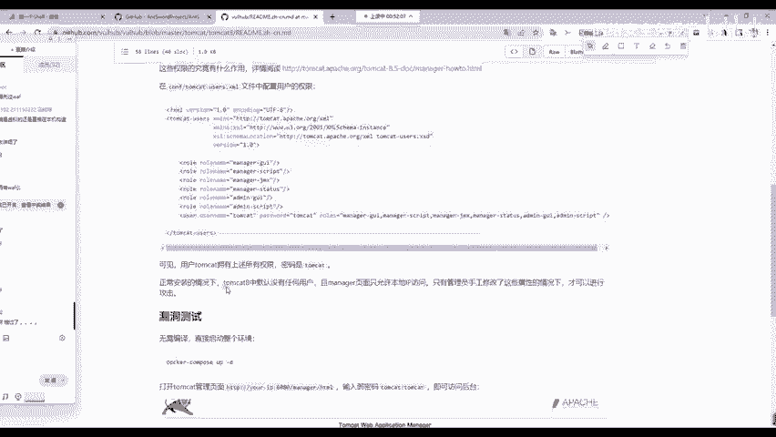

大家看就行。那首先呢我们是要切换到自己想要复现的漏洞。比如说tom cat里面的tomca8这个版本。

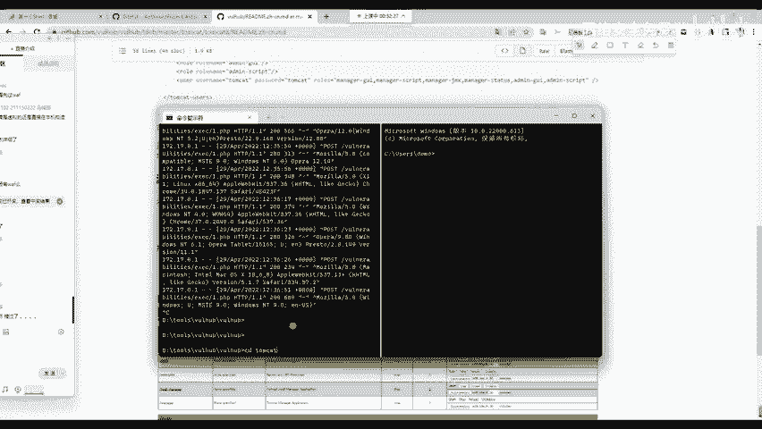

然后使用P牛在文档中给出的这个命令叫做docker compose。首先呢你在执行doock compose之前呢，你要按照我们昨天的课程去安装下载docker compose。

不然的话你的电脑默认是没有的。我们点击回车去执行它。好，稍等几秒钟。如果你首次执行的话，它会有一个下载的过程，下载是需要时间的，大概呢也就一两分钟就可以把这个tca的靶场从远程机器给它下载下来。

下载下来之后呢，我们可以看一下访问这个tomca的管理页面，访问tomca的管理页面就是要访问HTTP加上呢你的这样1个IP地址，知道吧？你的IP地址是多少？我的IP地址是127。0。0。1。

就是我自己。所以说我们就去访问一下这个地方访问多少呢？你比个葫芦画个瓢是吧？你看到它写什么吗？我写8080访问一下它看一下，这就是我们omca的是吧？ca，然后呢，他让你打开管理页面，管理页面在哪？

管理页面在这个地方啊，一个叫做managerAPP，就是我们管理应用啊，管理应用的这个英语字符，你点击它点击它之后呢，要输入用户名和密码。好，这现在来到漏洞利用的第一步漏洞利用经常遇到的一个叫做弱密码。

弱密码有两种。第一种就是大家经常调侃的这个呃乌克兰国防部密码是123456，这种是弱密码，是我们经常调侃的，第二种弱密码呢，叫做默认口令。什么叫做默认口令。

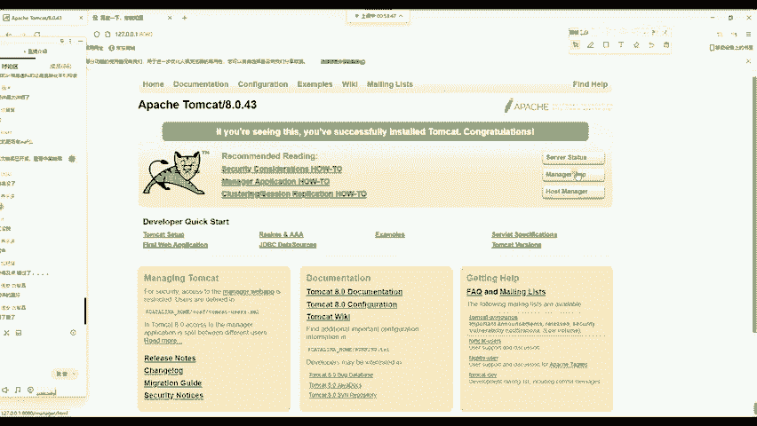

大家应该用过自己家里的智能电视机，你家里啊这个呃电信网络给你架设的这个光猫，包括你家里的这个路由器，他们都是有默认密码的。如果你不去更改，就有可能被黑客去攻击。包括我们经常企业里面所用的交换机路由器。

包括它的防火墙都有默认密码。他如果不去改，我们就能直接的去攻击他的防火墙去进入这个马奇诺防线这个里面内部进行瓦解。所以说默认密码是最重要的，也是最常见的那这个默认密码是啥呢？你不用猜，你也不用去搜。

为什么？因为P牛，他告诉你了。

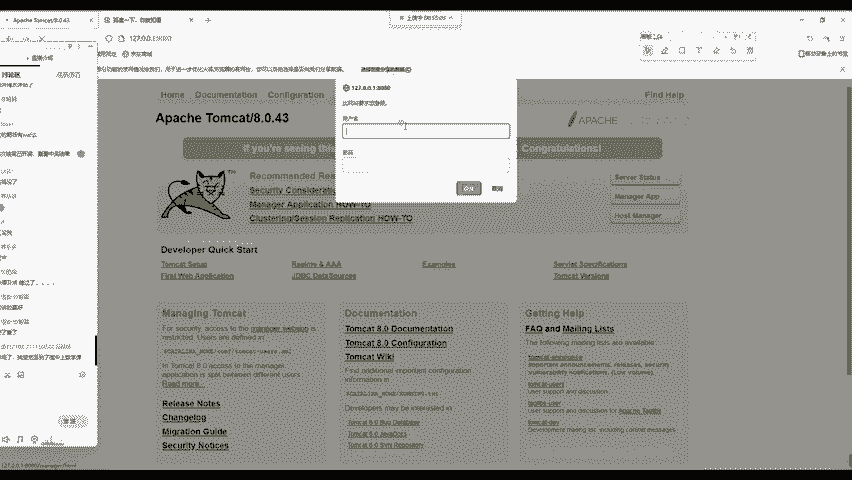

若密码是tomca和tmca。

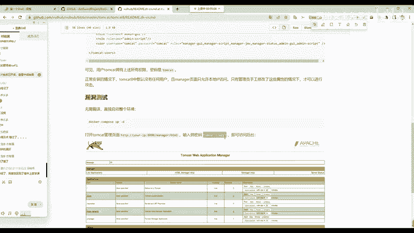

我们直接访问就行直接访问就行。所以说输入用用用户名，comca。输入用户名tomca输入密码。tomca。好，我们进入进去。进入进去之后啊，屁牛他到这里他就不写了，为什么不写呢？他写了一个简单的内容啊。

你看啊上传袜包即可直接get share。

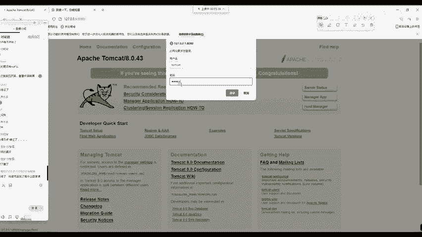

哎，这个地方呢这个大佬写的可能就稍微有一点啊专业性了。但是如果你入门的同学呢，你也能够读懂这句话是啥意思。它是啥呢？现在老师给大家解释一下。

首先我们本身这个网站它就是部署1个JSP加va写的网站到目标服务器上面。我们来看它一些它的英语解释，这个东西啊，一个叫做deploy部署的意思。

wa fire to deploy选择1个WIR fire to upload。就是我们现在啊可以去上传一个文件，那上传什么文件呢？当然是上传我们的WAR有同学可能不知道WIR是什么。

它是java应用程序的一个软件包。怎么去生成呢？我们怎么去获取java它所执行的web share呢？其实是非常简单的，你只需要打开你的百度搜索，以键，比如说我搜索anter sword。好。

and sword加上了这个GSP啊GSP。就是已建的JSP代码，你就会看到啊，你就会看到针对JSP的脚本。好，GSP的脚本。我们来看一下已建官方所提供的这个GS脚GSP脚本啊。

我也是从get up上面下载下来的，给大家打开看一下。就是这个样子的。

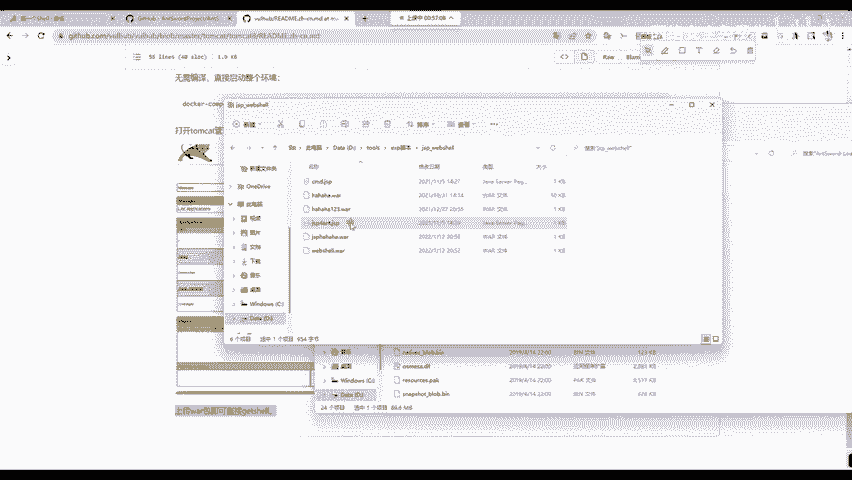

PHP有一句话木马，但是java呢因为它面向对象的这个特性，我们很难用一句话一行代码来实现这个已键的连接功能。所以如果使用里键去连接java网站的话是非常困难的那这个东西你要不要记呢？首先给大家讲。

我们做安全，你不是做开发，你不要记。因为这个东西啊，已键它官方网站它已经给你写了，你直接复制过来用就完事啊，直接复制过来用就完事。那这个代码能直接上传吗？不行。

因为它现在的后缀明是点GSP是点GSP我们怎么把一个点GSP文件转成我们的WIR文件呢？其实是非常简单的。给大家讲一个最简单最小白的操作。首先就是把这个JSP啊，你给压缩成一。

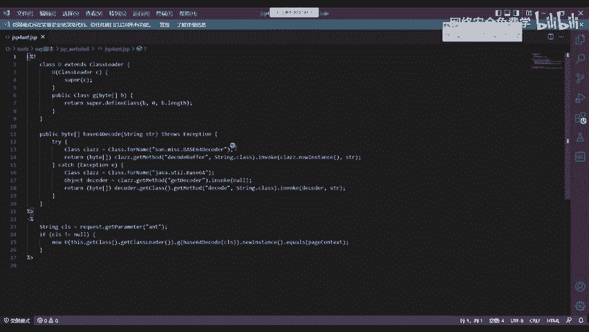

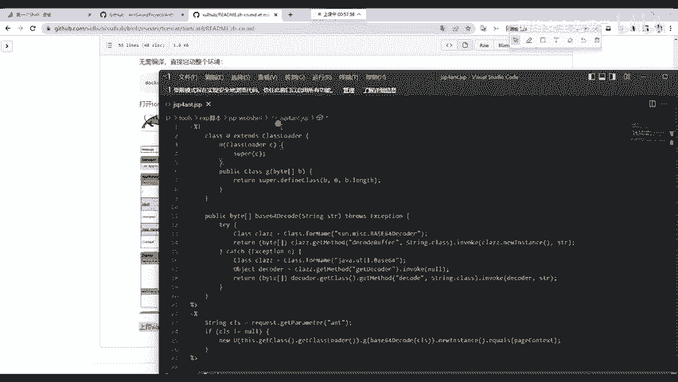

个ZIP压缩包，我们压缩文件选择ZIP格式，给他打一个压缩包，看到没？他现在已经打好了，打好压缩包了，打好压缩包之后，我们现在可以直接更改这个压缩包的后缀名，它现在是ZIP是吧？

我们现在给它改成WIR改成WIR，并且呢你前面的名字也可以改。比如说我这里改成test测试，好吧，测试WIR。改好之后，我们这个W文件啊就已经生成了，简单吧啊就已经生成了，直接去搜就行了。

这个同学说CSDNO不香吗？啊CSDNO还真不香CSDN啊现在越来越坑了，它不仅需要让你登录账号，而且呢还禁止复制粘贴。你在复制粘贴的时候可能会出现一些格式的问题并且在CSDN上面。

很多的啊很多人的文章都是直接复制粘贴别人的博客或者是直接复制粘贴别人的get upub这种行为我觉得在国内是非常常见。大家用过的都知道，你没用过，你就多用用，你就不会再用了。啊，这是肯定的事。

你多用你就知道了啊，这我说的也是实话，你同学都跟我说了是吧？这也是实话那我们下面呢来看一下怎么去上传。你选择他们啊你选择他们。

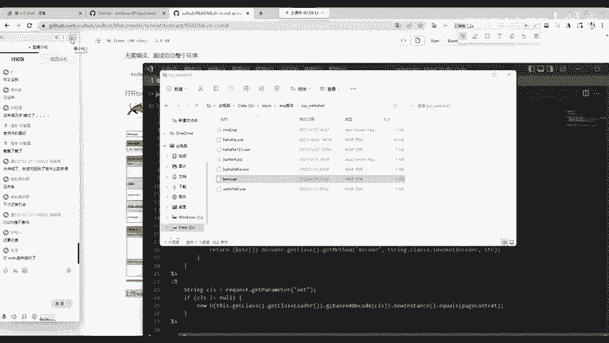

它不是最大的CSDN上面收费的东西都能免费找到程序员程序员在哪找代码，代码最多的地方就是get hub。什么什么呃，这个现在啊ge hub出代码，知道吧？开源的项目都会在get up上面有。

并且呢现在你看这个马斯克在收购收购这个推特上面，推特之后，这推的源代码说都要搬到这个getHub上面去，说都要在getth上面把推特的源代码给公开啊，都把它公开。好，我们下面呢就把它浏览一下。

把它浏览一下，然后选择呢选择我们刚刚设置好的这样1个GSP web share，我直接打开好吧，直接打开它给它传上去吧。老师呢直接打开它。好，稍等一下，我刚刚按错按键了哈。直接访问这个路径吧。好。

访问这个路径，我来打开刚刚生成的这个test点WA2。点击deploy部署。好，OK这时候它显示messageO就代表我们已经部署成功了。部署成功之后，你现在就完成了我们上传木马的这一步操作。

哪一步操作呢？我们来回顾一下，就是第二步，怎样上传，我们已经传上去了，现在我们要解决第三个叫做怎么访问，我们怎样访问这个木马是我们要关注的。怎么访问呢？我现在来告诉大家，这个访问是非常简单的。

首先呢我们把后面的这个页面给它删掉，只保留IP地址和端口。第二步，加上你袜包的名字，老师这里的袜包叫什么名字啊？叫test，你就加上就行了。test。然后呢写一个斜杠。

斜杠后面再加上我们袜包里面袜包本来是啥？袜包本身就是1个ZIP压缩包，它改了后缀名。那原本的这个ZIRP压缩包里面是压缩了哪个文件啊，压缩了我们的GSP forant减GSP这个文件。

所以说我们就加上ZIP压缩包里面的文件名，大家看一下JSP。4INT点GSP然后回车你发现空白就证明你上传成功了。如果你没有上传成功是啥样的。比如说我访问一个不存在的文件。

你看到的就是这个404note found，我们经常会见到吧，就你没有找到当前的网站，404note found。如果你看到空白的页面就对了。因为已键的木马，它默认情况下就是没有输出的，那你现在怎么办？

举一反三，打开你的已键再次连接它不就行了吗？怎么连接，大家看好，我们回到我们的已键回到主页，主页，然后右键点击添加数据，把这个URL地址再次的粘贴过来。

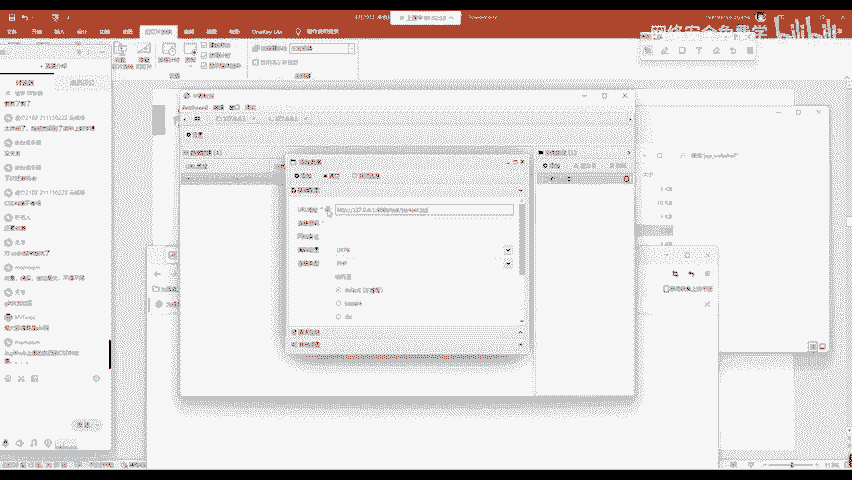

连接密码是什么？大家想一下连接密码是啥？是我们的INT这个INT同样的，你可以自己改你改成张三，那你的连接密码就变成张三，你改成ant特你的连接密码就是ant特，你可以自行更改。那在这个地方呢。

我们连接密码就用默认的ant特。然后你来看测试连接，连接成功，点击添加数据之后，我们来看一下这个数据啊，给他整到这儿了。能不能去控制目标网站呢？我们来看一下，哎，完全可以也可以去下载他的文件。

也可以去上传其他的文件到他的电脑上面，能不能去执行命令行呢。

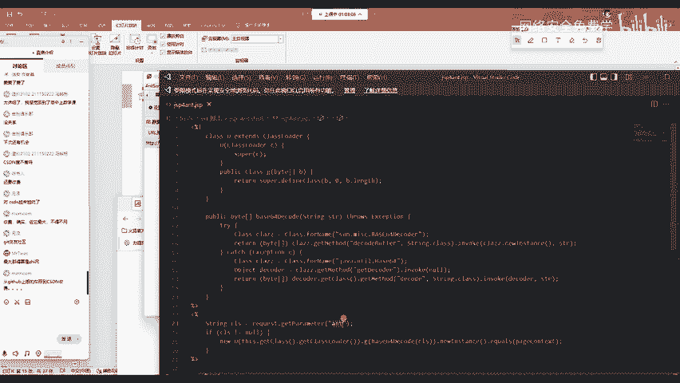

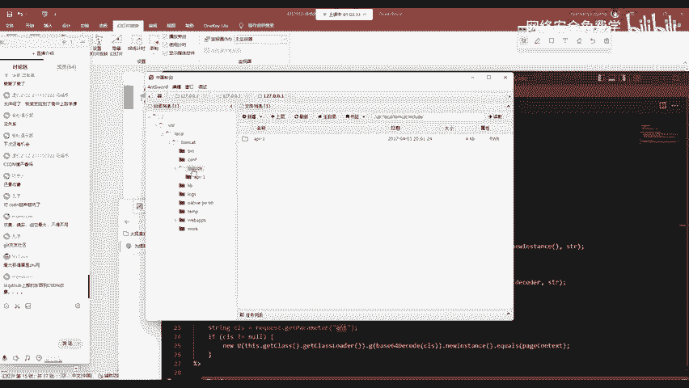

当然也是完全可以的，并且呢我们的权限还是超级管理员用户。那你有这个权限能够干啥呀？能够执行我们昨天讲的RF杠RF加星进行对他的操作系统完全删除。对，想干啥就干啥。但是啊这个调侃归调侃，我还是给大家讲啊。

这个RM杠RF杠星其实是无法执行的。因为我们从表情包就知道它是删除操作系统的所有文件，包括操作系统自己。那这个删除起来有什么问题呢？我们linux知道它是在所有操作系统中最危险的命令之一。

所以说我们linux默认情况下，它会禁止这条命令的执行。即使你是root用户，我也不允许你执行，你还要再确认一下信息是否真的要执行删除所有文件，这是一个小知识点。因为大家啊经常去调侃而不敢去尝试啊。

你可以尝试一下啊，尝试一下，看能不能删掉是吧？能不能删掉。其实呢如果权限允许并且呢我们的操作系统没有任何的限制，它是完全啊可以把它删掉的，完全可以删掉的。你看一下老师这里是不是要删掉了。是道吧？

就cannot run program beingSH为什么它会出现这个报错？为什么它会出现这个报错？就是因为我们的操作系统。都被删掉了，知道吧？就现在这整个的网站的操作系统都被删掉了。

你还怎么执行命令呢？就相当于你的电脑硬盘都给你砸了，你还怎么执行命令了，你打开都砸不开的。好，这个命令大家一定要慎用啊，一定要慎用，在渗透测试中是绝对不能用的，再给你授权，你也得负法律责任啊。

除非是你自己搭建靶场，但搭建靶场，请注意，你千万不要把你自己的电脑给删掉了哈。我这是靶场是虚拟环境，是docker，你不要把自己的电脑给删了啊，这是要注意一点。

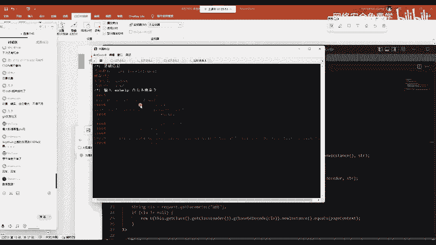

OK这里呢其实就是通过最简单的一个漏洞呢来执行了这样一个啊这样一个文件上传get shell，一直到我们执行命令商库跑路的整个过程。那其实呢这只是安全中的一个小小的漏洞复现。那其他的呢啊其。

程序员用的docker一样的呀，我们docker是一一个东西啊。都是这个容器啊，倒块容器只是他们搞的是开发环境，我们搞的是漏洞靶掌环境而已啊，这个是相同的，相同的是一个东西啊，都是这个虚拟容器。

那这里呢大家还要去，就是你在安全的学习路径中，一定要学会复现其他的漏洞。这个漏洞呢还多着呢，也要依此的复现。在当心爆出漏洞之后，我们也要及时的学习和利用啊利。

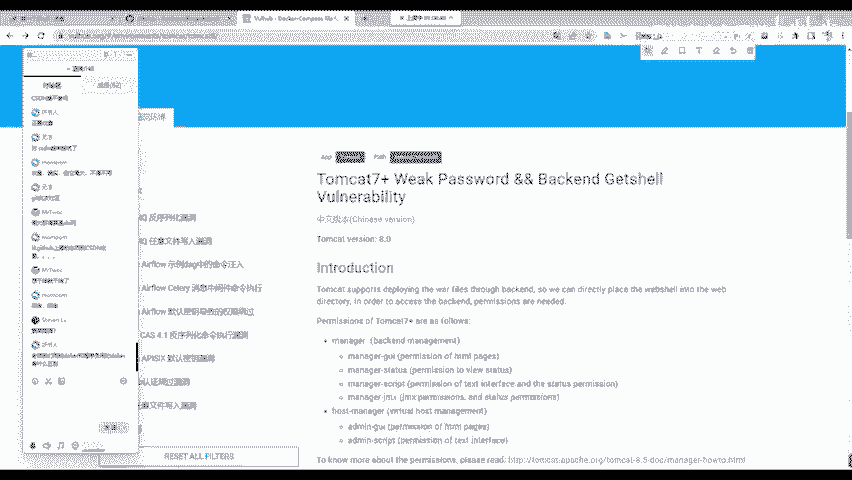