# 2024B站最值得看的黑客教程 ｜ 网络安全／渗透测试／内网渗透／漏洞挖掘／web安全／kali linux／红队靶场／CTF／信息安全 - P140：寻找合适的POC - 网络安全免费学 - BV1uBsTetEow

好，那么兄弟们来接下来到我们今天的重点了，对吧？啊，我们说了啊，我们刚刚今天讲的什么批量探测啊，实现什么3分钟100个漏洞。那么一会儿呢，大家给我倒计时一下，对不对啊？

我们看看三分钟能不能给兄弟们找到100个漏洞啊，我们就用这套POC给兄弟们去试一试，对吧？那么在试了这个过程中啊，我们得还得来讲一些东西啊，才能去试啊。😊。

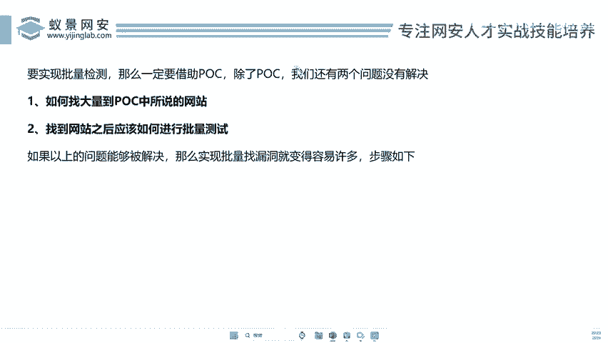

好，我们来看看OK我们来看一下啊。😊，🎼好，首先我们看第一个啊，就是说。😊，马先把它关了啊。😊，好，我们这张第三章主要讲的是什么？批量检测，对不对？什么叫批量？

批量就是一瞬间可以检测1000个网站有没有漏动，一瞬间可以检测啊，1万个网站有没有漏动，这个叫批量啊，那么批量的速度一定要快。那么你要实现批量检测。那么一定要借助POC啊，为什么呢？你看我已经。哎。

知道了。有了这个POC了啊，知道这个网站啊，这些网站存在这样的漏洞的。然后我只找类似的啊，我批量去测下不就OK了吗？啊，那么说现在我们第一个啊已经有了POC我们已经有了，对吧？第二个。

我们还有两个问题没有解决。只要您能把这两个问题解决了，你就能完成批量检测，对不对？好，我们来看怎么去解决呢，对不对？第一步啊，如何找到POC中所说的网站来，兄弟们，哎，我们回到这个POC里。😊。

来PUC里刚才给大家打开这么多，来，我们找一个。😊，呃，刚才有人说是那种什么说前性对不对？好。好，我们比如说呢这个呃齐安信的这个VPN啊VPN。来啊这个这个不对啊，我们看一下齐安新的这个天晴啊。

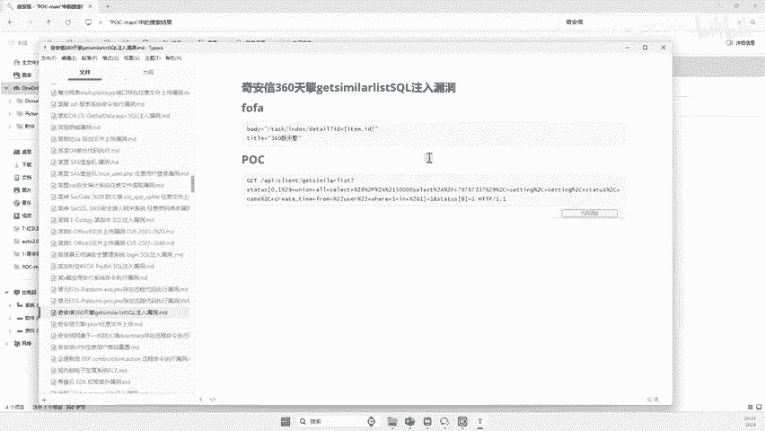

好，来这里说齐源信天晴存在一个什么CQ注入漏洞。那么这个是它的验证POC好，那么问题来了。

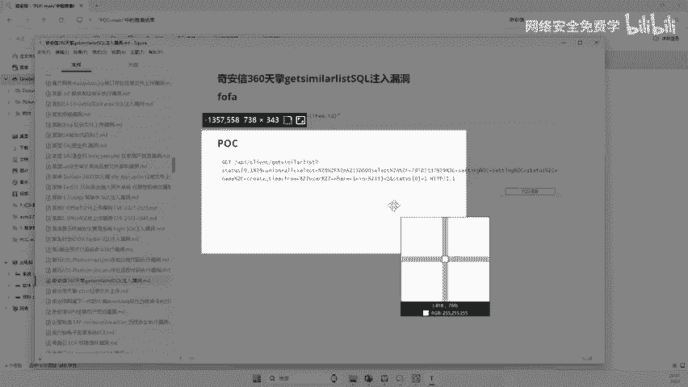

我去哪里找齐安信天晴啊？我能找1000个潜源性的天气吗？啊，很多人不知道潜源性天气是啥，对吧？好，那么我再给大家打开一些哎这个比你们熟悉的，我看看有没有没有熟悉的一些东西啊啊。😊，啊。

有没有什么小米的呀什么呢啊华为的，你就比较熟悉啊，因为很多公司当然不熟悉啊，不知道啊这个医院啊，这个这个大家应该熟悉了医院大家都知道吧啊医院啊医院的一个后勤管理系统啊。

就是很多医院都在用这个医院一站式后勤系统啊，用这个医院去做，对不对？啊，那么说我能找到这些医院的后人管理系统吗？啊，我怎么去找到1000个，我们中国肯定有1000医院啊，对不对啊。

你怎么找到医院的一站式后勤管理系统呢？假如说你能找到，那你把假如说你能找到了，对不对？然后你又知道这个怎么去用，然后你就可以批量去测一下这1000个都没有有没有网站了，有没有漏洞了，对不对啊。

就这么简单啊啊，所以说啊我回到我们刚这个问题来啊，就是说啊如何找到大量的POC中POC中说的那个网站，是我们没有解决这个问题啊，这个我们没有解决，对不对？第二个啊那么找到这个网站之后。

应该如何进行批量的测试，对吧？我这里要突出的是两个字批量测试啊，那我们刚才说。😊，哎，假如说你找到了一个医院式后台了啊，你假如说你真的在网上找到了啊，那么你现在找到了1000个。😊，啊。

这1000个难道你每次都要手动去测吗？啊，你说这个用工具跑，用什么脚本跑一下，你每次只能跑一个啊，你意思就用手测一下，回车回车回车，你想回车测一下复制粘贴又回车，你一000个你得搞多久啊？

那我们不得搞个七七四九天呀啊，那如何实现批量呢？批量为啥？就是啊两分钟把这1000个全部就测完了。哎，怎么去实现这个东西呢？哎，这是我们两个没有解决的问题，对吧？那么假如说我们哎会什么了，我们找网站了。

也会批量测试了。兄弟们，那我们就实现批量找漏洞了啊，3分钟100个漏洞有没有问题啊，没有问题，而且要100个漏洞都会有积分都会给你列入排名。好吧，兄弟们来接下来兄弟们，哎，我们就来看看那么漏洞测试啊。

这个步骤到底是什么。哎，我们实现刚刚给大家讲了3分钟100漏洞，那么它的步骤到底啥？那么李哥在这里是不是把它分成三步啊，第一步找到合适的POC啊。

什么叫合适POC就是找到你能看得懂的POC因为我刚才说了很多小白对吧？他的这个技术站不一样，有些人会用代码，有些人不用，有些人只能会用这个浏览器回车是不是？那么你第一的第一步。

找到一些比较容易使用的POC这个POC就是在网站里面输进去回车一下，我就知道有没有漏洞了，这种是最简单，每个人都会用对吧？回车你不会嘛，按回车键啊，复复制回车键，你就知道有没有漏洞了，这种是非常简单的。

对吧？有些漏洞还需要改UA啊改代码扩展。那这样的话，很多没有学过这种工具啊，没有学过代码的人，他就不会用啊，所以说你得一步一步来啊，先找到啊适合自己段位的POC哎，找到好之后呢，我们进住我们第二步对吧？

就是批量找。😊，网站啊，我一瞬间找到1万个啊10万个这样的这样的POC中所说的这样的网站。那么第三步就是啊批量的进行验证。好，那么验证完成之后呢，干嘛呢？来，兄弟们往这里看，那接下来要给大家实操的对吧？

我们不能光干讲啊，大家知道有人说李哥啊，我去啊。😊，啊，我去网上对吧？找漏洞了啊，那我把这些漏洞能交到哪里呢？啊，在我们国内的话，一般有几大平台给他说啊，首先啊在这里啊我先讲一下。

就是出去今天我也刚注册一个账号，对不对？哎，那么大家看看啊很多初学者来源，我们把漏洞交哪里，就是交到这里啊，交到这里就可以了，对不对？好，那李哥给大家说怎么教啊好。😊。

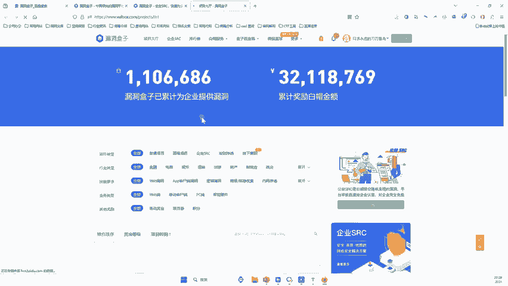

啊，这里就说公益啊，我们现在说了这个更专业专业的话说，它叫公益SRC啊，来提交漏洞啊。啊，一会儿我们我们去教一个漏洞试试啊，我教给大家啊。好，你看就在这里你看好，比如说你找到一个漏洞。

你就可以把漏洞交到这个平台上啊，就到这个平台上啊，这里面啊表明了哎漏洞叫什么名字，厂商就是哪个公司的漏洞。哎，这个公司的域名哎，什么类型的漏洞是中微高危还是低V啊，哎，还有这个漏洞有什么描述。

漏洞的复现步骤步骤就是怎么做的，一步、两步、三步、四步、五步六步，哎，怎么去把这个漏洞弄出来的。好，然后呢选择它相关的一些选项，然后点击提交好，提交完了之后呢，这个漏洞就会被啊什么哎交到这个平台。

那也就说了这些公益SSRC有没有奖金呢？啊，当然是有奖金的了啊，来给大家看看它的奖金多少啊。好，那么他在它这个排行榜里面，我们可以看到啊。😊，来，我给大家说一下，我们说的是初学者，来不对啊？好。

初学者而言啊，他一定要从最基础的开始啊，不能上来就做些难的啊，做难的啊不好。来，我们来看看啊，你看。😊，来我们点到这个工艺，看到没？哎，公益的这个SS月榜看到没？他每个月都会有一个榜单。好。

这里有个第一名，对不对？你看第一名哎奖励的70个9分啊，奖励完79分之后呢，还给了3张入场券啊，那像他的前三名，像这个漏洞盒子啊。如果说你是这个公益的月榜前三啊。第一名，他有1万块啊，就是1万元啊。

他就是这个漏洞盒子，他会给这个第一名奖励1万啊，第二名奖励5000啊，后面类推啊，反正你只要能拿到一个榜几啊，能给他一些钱啊，那大家不要觉得说哎这些人怎么都挖到79分了啊。那么你今天学会我的方法啊。

你一天就可以挖100分啊，我们来看看你能不能拿到一个第一名啊，那每个月都排名，我们看看这个3月份啊啊，这个看看啊，你看看到没来兄弟们。😊。

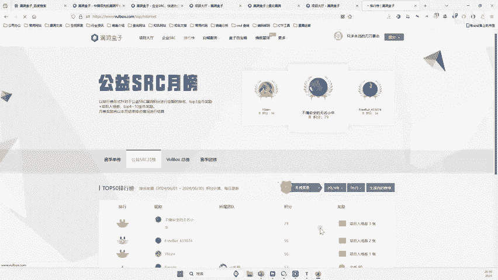

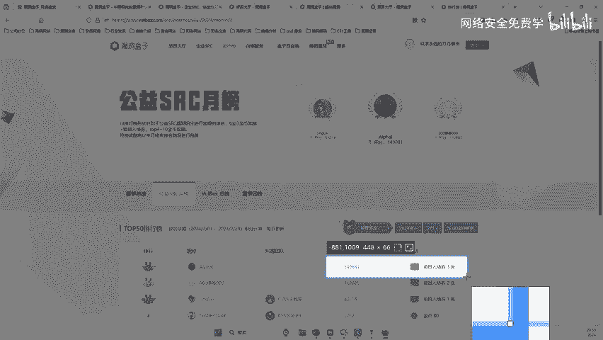

往这里看啊，你看这小伙伴挖了个1百千万10万14万个分啊，14万分。那你觉得他这个积分也手挖的吗？他肯定不是手挖的，他肯定是批量找的啊就是看谁勤快一点啊，对不对啊，你看这里还给金币，50金币。

50金币就能换一些钱，对吧？像他的一些榜一的话，也会给大家一些钱的啊啊，那么兄弟们来我们来看看啊，那到底怎么去实现这个东西。我们今天啊漏洞盒子跟补天补天会能搞补天也会给钱啊，补天也会给钱啊。

所以说不是说公益没有钱啊，中艺啊对于初学者而言，他非常好，只要你能挖到一些奖项，他会给你内部的一些优惠券，那些入场券什么干嘛的，就进入他们内部的一些内部测试项目，可以作为你的一些丰富经验啊。

说内部的什么项目会给钱的啊，所以可以作为大家一张什么，这样一叫敲门砖啊，你先挖公益的话啊，可以赚一点钱，也能干嘛呢，也能去作为敲门砖，给自己增加一些经验嘛，对吧？我们今天就教你怎么去挖啊。

你把我这种方法写完，你也可以一个一挖几千个积分啊。😊。

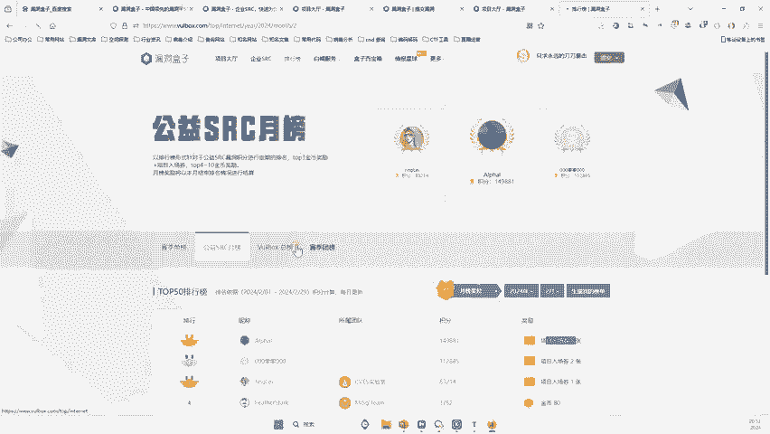

简简单单没有问题啊。好，那么来兄弟们，哎，我们就来把这三步学完，你就挖到给证书吗？贵呃，你可以去换证书啊，你可以去换证书啊。😊，好，那么兄弟们来，我们来看看，只要你把这三步掌握了，我们刚才说了这三步。

对不对啊？12三步都掌握了，那么我们也可以像他们一样啊挖到很多积分。好，那么兄弟们来我们来一步一步来看。第一步啊，寻找合适的POC对不对？好，那么这个POC选择就非常至关重要了。

李哥在课前已经告诉每个小伙伴了，对吧？啊？每个人的情况不同，能力不同，对吧？啊，选择你看得懂的POC对吧？不是每1个POC你都能看得懂，对吧？这个呢POC的学习跟这个漏洞复现的学习。

你要遵循一个循序渐进啊，你可以从先从姐妹们开始嘛。😊。

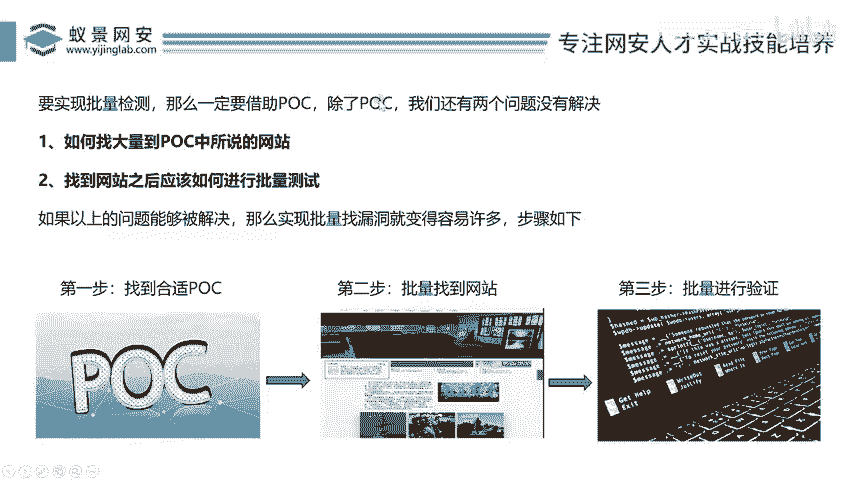

对不对？先从简单的开始学习好，简从简单的开始啊，最简单的回车开始，然后再步入什么代码，再步入什么抓包啊，再步再步入什么 off啊，再步入什么这个修改它里面的一些啊更复杂的东西啊，我们一步一步。

那你不就成长了吗？好好，那这是要我们遵求一个原则，对吧？从简到难，这是你要学习这种批量找漏洞的一个理念对吧？肯定是从简到难啊，那从简到难指的是什么？指的就是POC的选择了，对吧？好。

第二个就是我们啊这里也非常关键，很多人没有讲过，对吧？我们在选择这个POC的时候啊，听好了，这重点了，漏洞公布的时间啊，离目前的时间越早越好什么意思呢？就比如说现在有POC啊，它是从2018年对吧？

到2024年好，那么在你这些年份里面啊，2018啥意思？就是说这个POC是2018年被公布的，2024年就代表这个POC是2024年被公布的好，那么兄弟，那你说你找哪一年了。😊，对不对？你找哪一年的？

你找哪一年的对吧？你肯定会找2024年的，对不对啊？为什么？因为你2018年的POC里面的漏洞可能都被别人挖完了，你就没有饭吃了，是不是？但是我们找2024年的对吧？

最新的可能就哎他第一次这个漏洞没有被修复，二是找的人员比较少，那么你就更什么更容易获取到这些什么啊，更容易的获取到这个漏洞的这个结果对吧？或者更容易找到这个漏洞，这个大家都应该都理解嘛啊，啊。

一定要什么？你这个时间越早越好，对吧？如果离得比较晚的话，你找1个2018年的漏洞啊，你看可能这个漏洞啊，早早就被修复了，对不对？好，那么兄弟们来那接下来呢我们选择1个POC啊。

那大家去看看你们选哪个对吧？啊有人说这里呢POC这么多啊啊啊有人刚才说了。😊，啊啊，对，只有第一个报了之后才是有效的，明白吗？就是我们一个网上的漏洞只能缴一次，你交了别人交不了，它会提示重复了，明白吗？

你交了别人就会提示重复了啊，别人交你再重复嘛所以说我们要赶找啊，才有一个抢时间的东西对吧？那兄弟来这里面来遵循一下原则？要找最简单的要找时间比较多的这里比多个吧？

还有这个什么啊这个BIIP存在CQ注入漏洞那这些你都可以去找对不对？好，那我们在这里找一些简哪些比较简单一般来说呢像这种任意漏洞比较简单啊，们任意两个字啊，任意就是啥就是啊不需要任何东西。

我们随便搞一下就可以了，任意任意用户登录就是每个啊随便拿个用户都能登进去啊，你看看这任意里面你看有这个像这个你啊什么后台任意什么插件上传2024年对不对？2024年3月份的个漏洞。😊，啊。

那这个也离现在3个月啊，还是比较近的，你可以去找这个，对不对？好，那么当然这里面里哥很多都看了啊，我们在里面找一个什么，找我今天呢在这里注到一注意到一个比较简单，而且暴露洞比较高的1个POC好。

那么我在这里哥啊在这里给大家找找一找啊，看能不能找到啊。😊，好啊，有一个叫做什么叫做哎，我找一下叫做。😊，啊，任意文件读取来再看看啊。好，你看现在像这种任意的比较多啊，我们就是你对于初学者而言。

你可能需要每一个每一个都要打开，对吧？你看像这里面这么多，那么到底哪一个比较合适啊。其实你每一个点一下都要看好，那么接下来哎我就哎找到我今天中午找到一个比较简单的啊，每个小伙伴能听懂的啊。

因为因为现在这里比较多啊，我得再留意一下，让我认真看一下啊，到底是哪个名字啊。啊，不然的话啊比较复杂的话，大家可能搞不明白啊。来这个。看一下啊，来一个一个再去审视一下它啊，叫什么飞讯的一个东西啊。

那么这个飞讯的话，我今天网上去看了一下啊，还是的比较多啊。😊，飞讯互联。哎，对，没错，就是这个飞信互联，但是不是这两个啊。啊，我找到这个呃非企互联，对吧？啊，我再找一找非。好，大家这个稍稍等一下，李哥。

对吧？李哥在这里面找找啊，因为这个东西实在是太多了啊，我也哎这个。😊，找了半天啊啊，这个叫做任意，这个他的名字叫什么？任意什么登录啊，登录叫一个什么生录的啊，我搜一下登录，好吧，搜一下登录啊。

搜一下登录。好，这么登录的话应该就比较好找了。来，我要看看啊有没有啊，叫。😊，哎，这个啊在这里啊，非起互联管理平台登录绕过。那这个看起来就比较简单，对吧？来，我们打开这个啊。

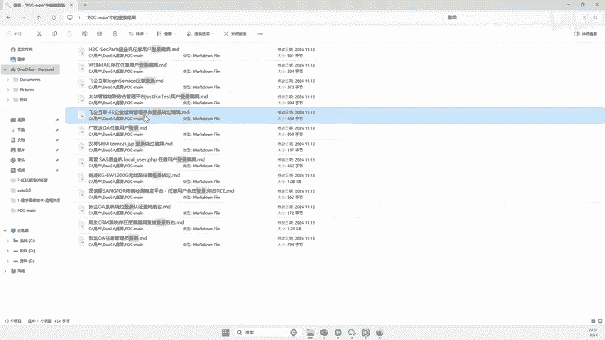

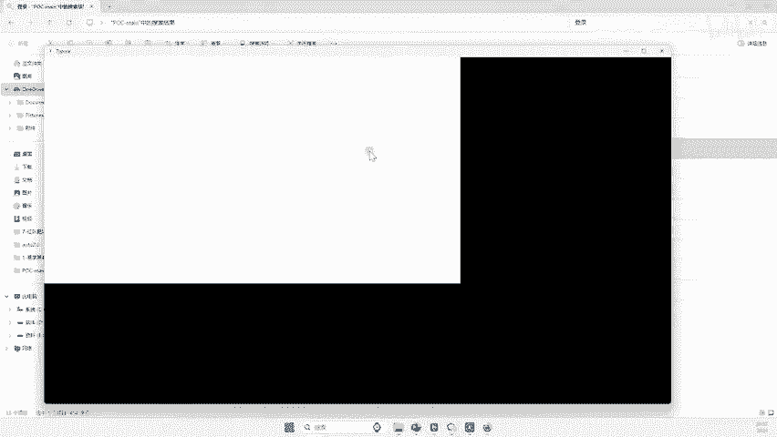

今天应该是找到这个。好，那这个的话企互联对吧？啊，在这里我再搜这个啊，他那个搜不全啊。做这个啊啊，这里比较多了，对吧？好，来啊这个啊找到了啊。好，来来，兄弟们来看看啊，来，我们来找这个看一下这个啊。😊。

来看看这个啊，这个比较简单吧，你看。😊，来给他看这个POZ。这啥意思啊？来。就是说呢你看你找到一个非企互联的这样一个平台啊，PC里面写了，找到好之后呢啊你在网址里面输入一个这样的字。看到没？

大家可看下我逻辑啊，就在你的网址里面输一个这样的字啊，什么OP等于D啊，然后它会跳出一个什么删除的这样一个界面啊，那么紧接着你再把这个地址呢换成慢点GSP啊，然后就会登录到他的后台里面。

看到他公司里面的所有人，对不对？O兄弟们，就这样一个简单的漏洞，非常简单啊。其实要我们做的就是两步，对吧？啊，就是将这个填到网址里面，然后紧接着将这个填到网址里面，对吧？就可以了。好。

那么这个漏洞我们去网上去啊去看一下啊，飞起互联啊，任意登录。好，兄弟们，然后呢我们把它干嘛，去网上搜一下啊。😊，哎，我了。啊，然后你要怎么找啊，你去网上对吧？哎，在这里搜一下啊。

看网上的这种公开细则多不多。😊，来比如说这个非起互联log and server任意登录，对吧？好，我们点开这个看一下这个博客作者是怎么什么时候写的它。好，我们可以看到这个博客是在2024年对吧？

他2024年这个人把它公布到了网上，对吧？而且呢你查看他的话，需要19块啊，那么它里面的内容跟我刚刚给你提供的内容是一模一样吧？就是你自己要看的话，19块啊，看时间的话也是比较新的啊。

也可能就是今年的一个漏洞了啊，或者说去年的一个漏洞了，比较新。那么你在网上找到这种漏洞概率是非常大了，对吧？因为他的你看在网上除了这个人啊，你看再没有其他的漏洞报告了，对吧？啊，相同的这种名字很少啊。

最近的就是这个2024年，所以说这个漏洞公布细节就比较的早啊，离现在最多4个月，那你去网上找你信吧啊，找个100个没啥问题啊，100个一个拿的1分的话，100100分肯定是有的。好。

那么兄弟们来我们就以这个为例啊啊，我们今天啊去网上找看能不能找到100个啊，非起互联啊，的这样的漏洞好吧。😊。

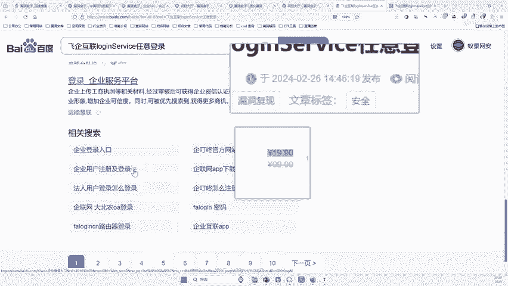

哎，把它打开。OK好，那么这个问题我们搞定了，那这个是比较简单的对吧？😊。