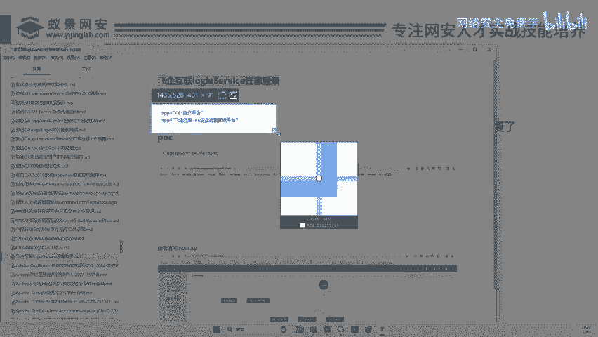
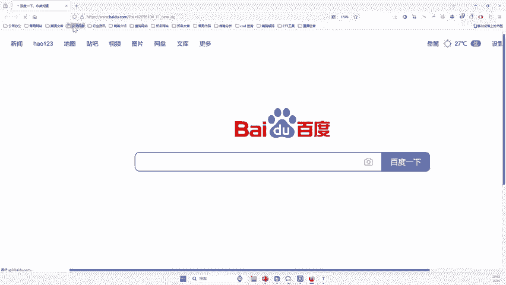
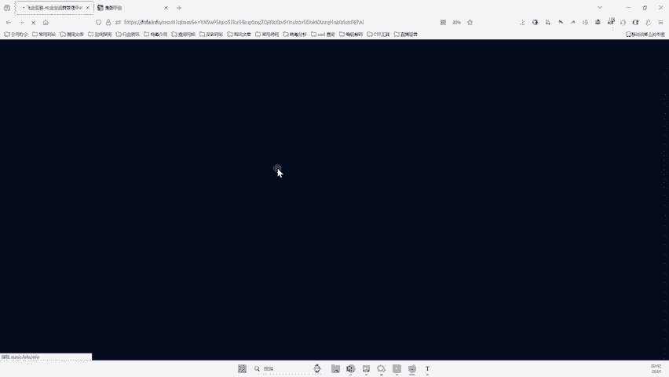
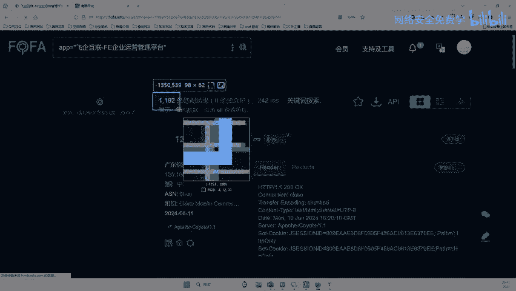
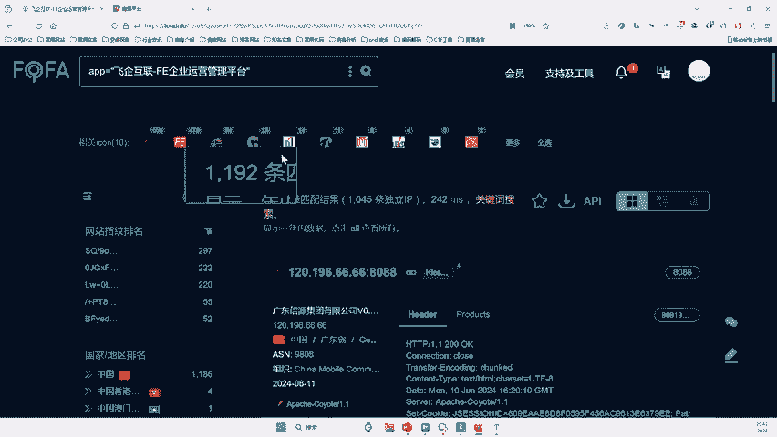
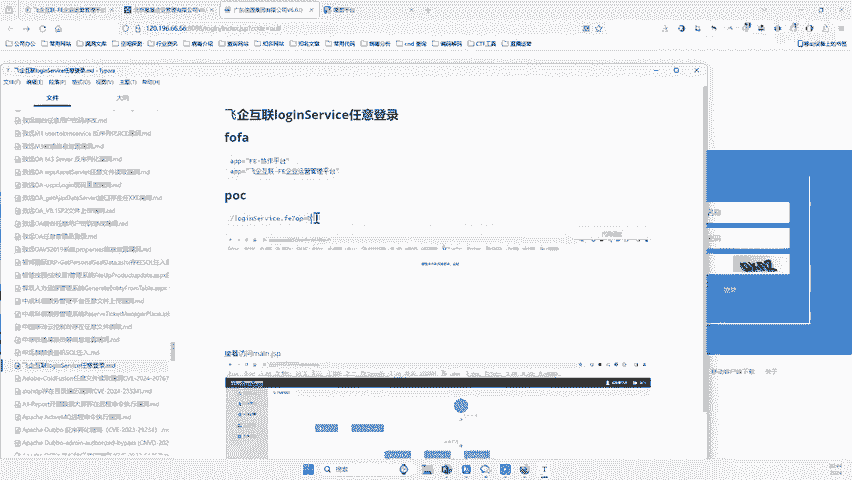
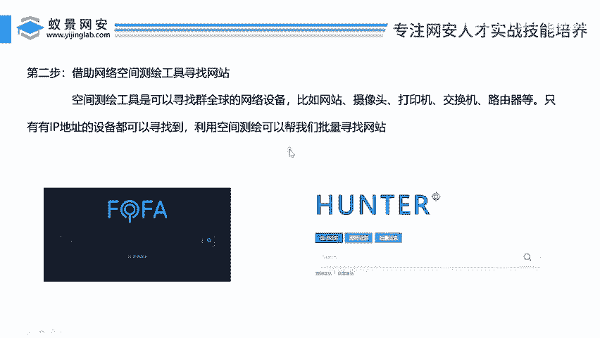

# 2024B站最值得看的黑客教程 ｜ 网络安全／渗透测试／内网渗透／漏洞挖掘／web安全／kali linux／红队靶场／CTF／信息安全 - P141：借助网络空间测绘工具寻找网站 - 网络安全免费学 - BV1uBsTetEow

啊，比较简单的一个这个POC了。好，那么兄弟们呢接下来我们看第二个啊，就是第二个啊怎么去哎寻找网站呢？兄弟们哎，怎么去寻找这个网站呢？好，那么在这个POC里面，我们可以看到啊，它有一个一段这样的话啊。

😊。

啊，他有个这样的东西。

啊，这个什么东西呢？来这个就是什么啊，批量。😡，批量。批量寻找的语法啊，就说你把这个东西复制到哎一个软件里面去。他就会批量寻找。哎，这就是批量寻找的语法啊，就类似于一个搜索的一个语句吧啊，搜索语句啊。

好他这里其实给我们已经写好了，对吧？好，那么我们要说一下这原理它是干嘛的，对不对？好，怎么去批量，哎，大家一定要信李哥啊，这个是我们白帽黑客经常用每个人用必备的一个东西啊，不管是谁来挖漏洞啊。

不管是谁在做批量，一定会要借助这个什么网络空间测绘工具啊，一定要借助啊，不要觉得他low，每个人都在用啊，所有的做安全人都用啊，没有一个人说不用的，哪怕他做十年安全，他也用好吧？好。

所以说你跟跟我说一下，学一下他是干嘛的啊，那么这个空间测绘工具是一个可以寻找全球的网络设备的这样一个平台。在这个东西上我这个设备上我们可以找什么呢？比如说网站你可以找网站。

可以找摄像头打印机交换机路由器啊，只要是有IP地址的设备，我们都可以被这个网络空间测绘工具所找到啊？那么利用这个测绘工具就可以帮我们实现批量找网站，对不对？因为这个。😊。

网站这个软件它就是针对啊网站的啊针对寻找网站的一个软件啊，找除了找网站，还可以找摄像头。你想找美国摄像头也可以找想找美国的路由器可以找想找美美国的打印机，你也可以找，对不对？全球的啊都可以找啊。

那有人说那李哥要不要充钱。哎，那么不许说李哥要不要哎，不需要啊啊，就是你注册之后呢，他有一些免费的，像这个的话，一天有500条，这个的话一个月有3000条啊，他每个月有一些免费的一些工具去用啊。

当然你就要用的再多，比如说你想搞10万个，那就要充钱了啊，你搞几百个的话，他不要钱啊，他也按量来做呢啊。如果说大家真的说没有会员的话，你可以充个10块钱的啊，他最低的话，10块钱就可以充了啊。

你可以去试一试，对吧？啊，那么今天我们就利用他去4试，对不对？啊，那么我们哎我们来看看啊。好，那么首先我们怎么搞呢？我们打开这个空间测绘，对吧？好。😊。

好，那么空间测绘的平台软件比较多，对不对哈？比如说这是一个对不对？啊，那么这里呢还有一个对吧？啊，这里还有一个好，那么怎么找刚才的这个语句里面已经给大家说出来了，对吧？哎，就是你把这样的话。😊。

复制到这里。好，然后在这里面输入回车就可以了，简单吧啊，来哦我们看看找到多少个，哎，找完是不是找到了多少个，找到了11192啊，他在全中国找到了1192个。

刚才一样的网站。好，那兄弟们，那这1000个网站里面有没有漏洞呢？怎么办呢？是不是要一个一个去测？好，怎么测？来，我先来一段手动的啊，来手动是怎么测啊，右键打开。😊，啊，它是什么？

广东新能源集团有限公司啊，它的一个综合办公平台。对，就是这样一个网站。OK那怎么去看这个广东新能源集团有没有漏洞呢？来打开它啊，这里面说的非常清楚。第一步把这张内容是不是哎复制到哪里呢？

直接复制到它的后面？好，然后干嘛呢？来，我在这里给大家敲一下，对不对？看把这个内容对不对？哎，相当POC里面说的这样看到没啊，就在在网站后面加个这，看我加进去了，对不对？好，然后干嘛呢？回车。😊，哎。

回车，你看这个网站是什么反应，没有任何反应，对吧？是不是没有任何反应。好，但是这里说清楚了，如果说存在漏洞，它的反应是这样的啊，就是里面提示什么啊，流程未开始或被修改删除，大家可能看不到这个字啊。

它是个白色的页面，然后弹出一这样的一个删除的这样一个字儿。好，那么这个网站呢有没有弹出来没有弹出来，那兄弟们，那这个网站有没有这样漏洞呢？没有好，那下一步我们是不是要记测第二个啊，北京星景有限公司啊。

这个公司那怎么测同样是不是哎，把刚才的。😊，这个东西。

复制一下。复到这里，回着。哎，他有没有谈呢？他也没有谈，那也代表着他没有漏洞。好，那么这里我们找到了1000个啊，那你能把这1000个全部找完吗？来，你告诉我磊哥哎，李哥，这1000个。

你你现在给我手动去测一下，我你也问我非得看你有没有漏洞啊，那我把这1000测完，估计就明天早上6点钟了，是不是啊那你就费时间吗？那你觉得别人会这样做吗。😊。

兄弟们，你们觉得别人是一个一个用手册吗？那肯定不是呀，对不对？那这样何谈批量二字呢，对吧？所以说我们就要回到我们的第三步了，对吧？怎么去进行批量，就是我们一个重点了啊，肯定他不可能是手动去测的。😊。

