# 2024B站最值得看的黑客教程 ｜ 网络安全／渗透测试／内网渗透／漏洞挖掘／web安全／kali linux／红队靶场／CTF／信息安全 - P142：使用第三方工具进行批量验证漏洞 - 网络安全免费学 - BV1uBsTetEow

对吧啊，手动测1000个就只是打开复制回车粘贴。你想想一个一个就算你10秒钟，1000个，你算多少秒啊，你3小时你可能都麻了，人都麻，到最后你看眼睛都花了，你都不知道打开哪个网站了。

对吧都是长得一模一样的东西，好家伙吧？就给你100个美女长得都是刘亦菲的样子。我的妈眼花缭乱了吧？那怎么去进行批量哎，我们来对吧？好，那么兄弟们怎么去进行批量检测就是我们要讨论的另一个点了，对吧？

那么批量检测的方式有很多工具也有很多多，就是有很多黑客他写了很多很多工具啊，支持批量检测，对吧？那么不同的POC的利用方式不一样，我们刚才说了有的POC是要写脚本是吧？脚本付现，有些PAC是回车复线。

有些PAC是用这个抓包复现对吧？复线的方式不一样，那么借助的工具也不一样，对不对啊，那么这些工具的使用，那么既要干嘛呢？你不断的去积累跟测试了啊，明白吗？不是说批量测试就有一个工具没有不是。😊。

因为POC的利用方式不一样啊，很多网站它的这个要证明这个漏洞的方式不一样，那就要利用不同不样不同的工具。在我们网上有成千上百个啊批量检测工具。那么你到底用哪个对不对啊，到底用哪一个比较合适呢？比较好呢？

我也不知道啊，对吧？所以说你就要需要啊，让别人去教教你。哎，说这个这个这种方式用什么工具，让那会的人去带带你啊，这样是最快的。如果说你没有认识的人啊，那你只能往上一个一个去试了，往上一个一个去搜了。

这样的话啊这是一个学习进步的过程，对吧？好，那么接下来哎我们就来进行一个批量的测试，对不对？好，那么批量怎么测来，我们先要说一下这个东西。那我们现在批量测是不是非常简单，是首先第一步啊。

把这1000个东西，网站全导出来，这是第一步对吧？导出来之后呢，哎我们找一个工具，让工具哎模拟我们的手动对吧？输入这样的网址，然后回车一下，看它有没有弹票就可以了，是不是非常简单，其实就两个方式。

第一步把这些东西都导出来，第二步啊就利用工具让他帮我们去代表用工具去访问啊，你就知道了，对吧？好，那这1000个怎么去导，非常简单，来，我们点击这里啊，我们每个人这里有一个下载按钮啊。

你点击这个下载数据。😊。

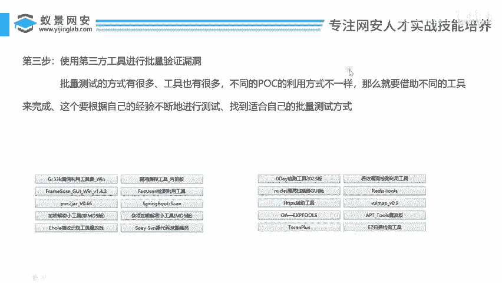

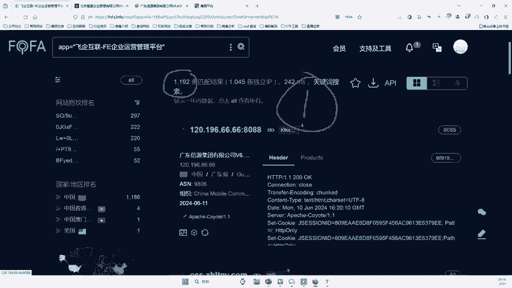

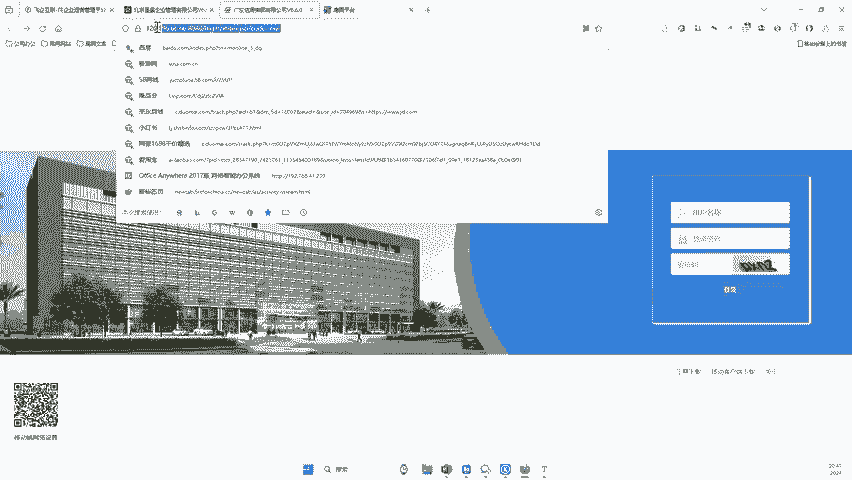

啊，大家可以看到没啊，免费额度是多少啊啊，2930个。也就是说呢你想把它导出来啊，像这个for法啊，每每人每个月有免费额度是3000条个啊，3000个就这么多，3000个，对吧？你看啊，你想导多少个呢？

啊，比如说我们想导100个啊，你就输100然后点击导出。😊，啊，你想输导出50，你就点击什么，点击导出。就可以了啊，那他就会把前50条这样的记录全部给你导出来。好，那么李哥因为之前已经导出过了啊。

我们选择五0，点击导出啊，导出完成之后。

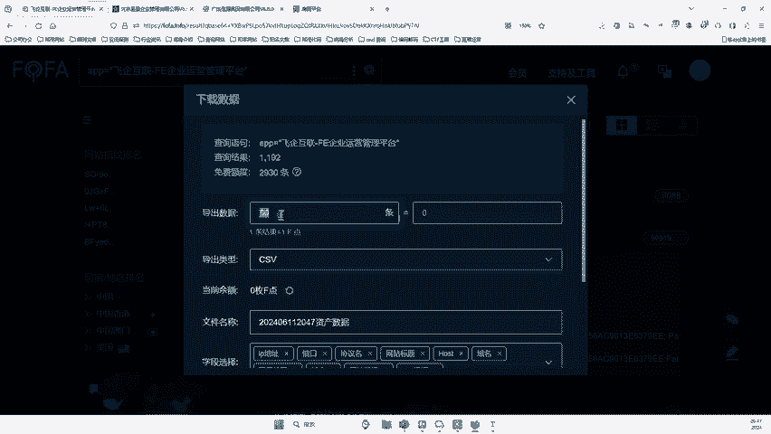

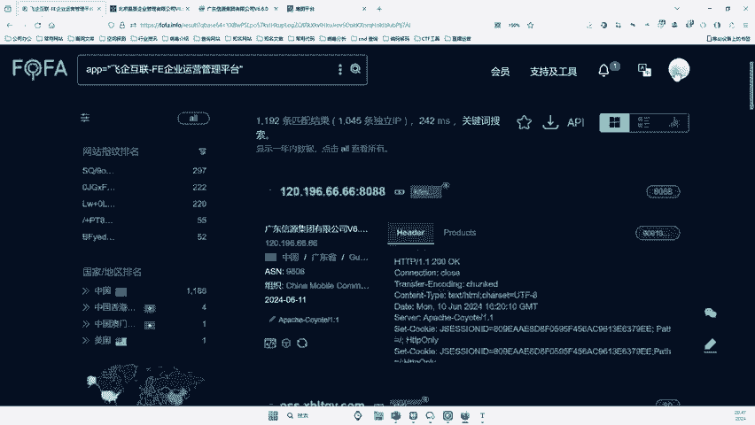

在你的个人中心里啊，大家往上看啊啊，这里就有一个记录，看到没？那么李哥是在什么时候导出来的？你看在2024年6月11号啊，2点3点钟的时候，对吧？我在这里导出了50个啊，我就选择了50啊。

有人说这个3000能叠加吗？能叠加呀，非常能叠加呀啊，能叠加来啊。😊。

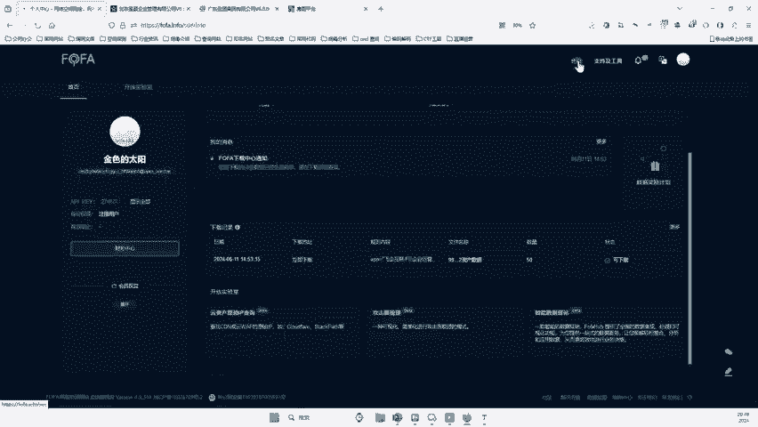

啊，那你看啊，119个1百千万10万。好，你充100块钱能倒10万个。啊，这就叠加嘛啊啊，那你免费的哎说啊那哥，我免费的啊，免免费的你自己看啊，免费的就有3000条嘛啊啊，你说我要倒1万0个啊。

那你就充个会员嘛，是不是啊，就这么简单了啊，你想倒个100万条9万条好，你充个这个商业版会员嘛啊，9000块钱个1百千万10万900万对吧？啊，当然这个你别充啊啊，你说我你让我企业版的36000啊。

那你牛逼啊，牛逼plus了对吧？无限倒啊，随便倒参考数据全给你啊，你也要有3000你就倒对吧？当然这个企业版的话，他一般是啥啊，一般是啊高这个什么在用啊，就就是那个。😊。

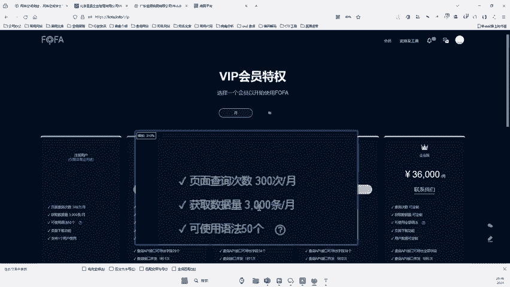

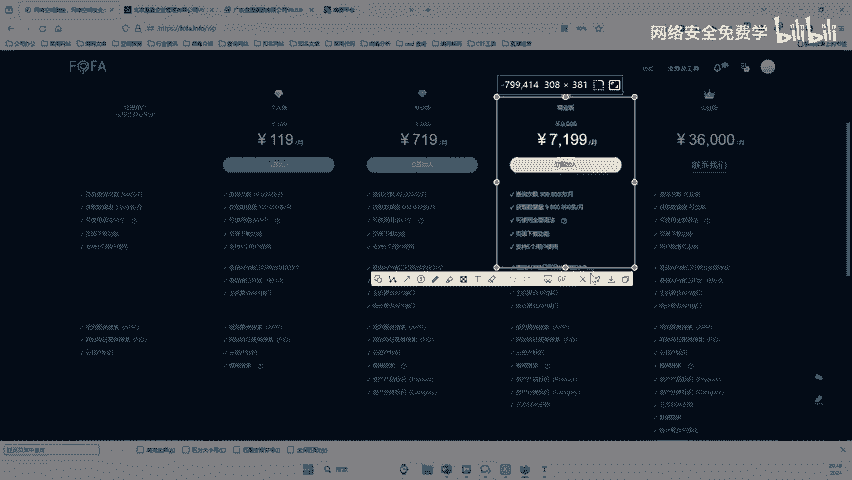

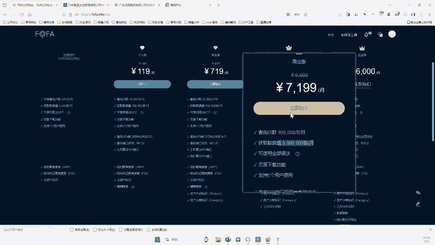

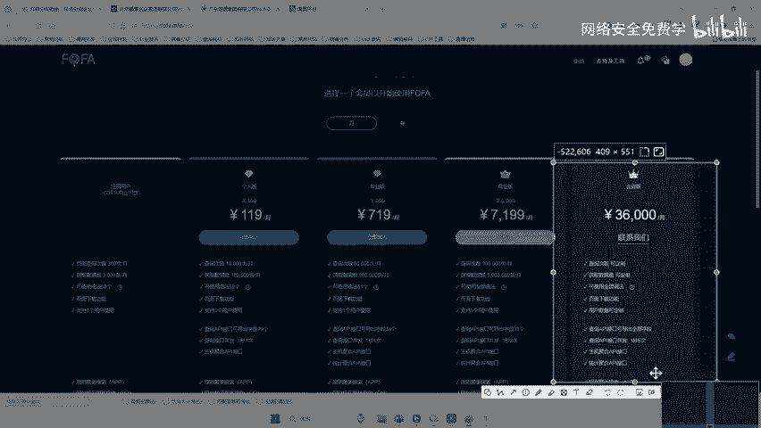

嗯，企业在用啊，对于我们初听好了，初学者而言，对不对？用这个免费的就可以了。咱要那么多付费的干啥，对不对？咱手机号，咱用爸咱用爸爸的捣一次，妈妈的捣一次，女朋友捣一次哥哥的倒一次，弟弟弟导一次啊。

七大姑的八大姨的，我不信你没10个手机号，是不是啊？那咱10个手机号算起来也3万条了，是不是一个手机三斤聊，那10万10个，咱不也3万条了，3万条就代表3万个漏洞了，是不是？😊，是不是那个道理啊。

你随你充190就不学亏了嘛？啊，好了好了啊，好，那么兄弟们那导出的时候在它里面啊，这个里面就有对不对啊，就在这里有对吧？你看在这里有来，我们把它下载一下啊。😊。

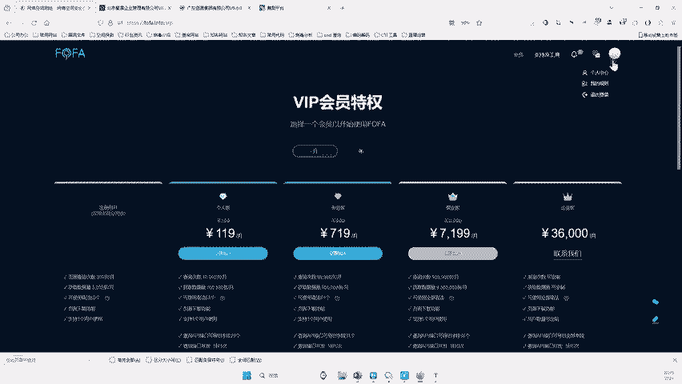

啊，点击这个立即下载啊。好，那好来让李哥带着他去批量测一遍好不好？来。😊。

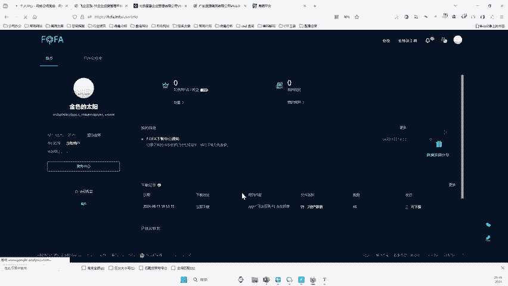

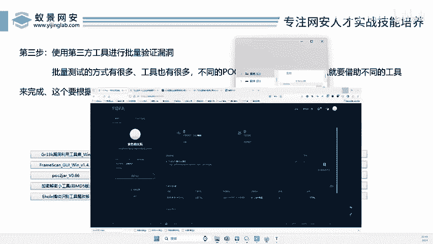

好，你看呢那是不是导出来了，导出来之后，我们回车哎，回车啊，回车之后，哎，我们可以看到这个数据就非常的工整了，对不对？来，这里就可以看到啊导出了一共有多少个企业了。来啊，这每一个啊都是可能是我们的猫呢。

对不对？来，这里是不是能看到啊，这么多公司来看看你认识哪个啊，什么椰树集团啊，有人说了啊，椰树集团那么大来椰树集团都知道吧？😊，好身材喝椰树啊，就那个啊年赚到70亿的看椰树集团是不是也在用这个东西啊？

那假如说你找到椰树集团，兄弟们不得了啊，兄弟们，椰树集团，你不知道有人还不知道椰树集团妈的椰汁，你没喝过呀，我靠，我不信，还有人说不知道，我怀疑你在跟我开玩笑啊，啊，不是耶。😊，不是椰树集团，你不知道？

😡，妈的，哎，大家。😡，椰树嘛椰汁嘛，哇，我操，你们不这。😡，你们没没人喝过这个什么超超市里面全卖这个啊，从小喝到大嘛？不这个嘛？徐冬东代言的嘛？啊天天抖音是吧海南产面对吧？就这个嘛哎，大家可没喝过啊。

娃哈哈都喝过，没喝过这个啊啊就这个玩意嘛椰树的卖什么卖果卖橙汁的，可能北方人北方人没有椰树啊啊，南方人天天喝啊，你看这个椰树集团看他是不是也有这个啊？那假如说你找到的椰树。

假如说你你去测一下椰树集团真的有兄弟们，你是不是又发财了，你找到这么大一个企业啊，妈人家去年赚了多少亿，赚了40个亿，是不是啊，这么大一个企业，你找到你进去之后能看到他们公司里面所有人的信息。😊。

所有人的信息我的妈，那得多危险啊，对吧？那这个东西好歹的说给你多钱啊，给你1万块2万块，是不是？没问题吧啊，给2万块没问题吧。哎，你看还有什么宠物公司，对不对啊，还有什么深圳实现。

还还反正非常多立信集团都是上市公司了，对吧？可以看到没？这就是我们的一个好处。我们用的是2024年最新的，对不对？你再看导出来这些公东看广东省人民珠海医院，你看到没？珠海医院也用的这个系统讯飞什么系统。

那么假如说你能把珠海医院入侵了，是不是兄弟们啊，是不是。😊，是不是啊？当然这里要大家记住啊，这里啊给大家说一下啊，像这些医院呀、政府啊啊不要去搞啊，我你搞这个什么啊，这个哎有有简单的没啊。

就就这个厦门德社文化有限公司啊，这个看起来比较小一些，对不对？好，那我们看有这么多公司来。😊，这还这还是我导了50条，对不对？啊，我要把它一00条导出来的更多了。好，那后面呢就是啥他的什么了。

我们把它翻开。😊，哎，后面这些host就是他的网址了，对吧？来，我们把这个网址复制一下啊。复制到哪里呢？兄弟们啊，复制到你的笔笔记本里面，对不对？😊，好，复制进来。支复制进来。好，复制进来之后呢。

是是把所有的网站的地址都复制进来了，对不对？好，复制进来之后，兄弟们来我们来看网站，它前面还有个HTTP，对不对？所以说你得在这前面啊加1个HTDP啊。😊，对不对啊，前面把这个HTP加上啊。啊。

我怎么加？来，兄弟们教大家啊，回车一下啊，点击编辑啊，有一个列边辑模块，在前面出HTTP啊，冒号斜杠啊，把它规范一下啊，是不是前面加个的这个，然后在它的后面是不是要加什么啊？

在每一行的后面是不是要加上这个东西。😊，啊，你是不是在后面加个这加个这加个这加个这加个这加个这加个这加个这加个这加个这是不是这样加啊，当然你也可以用快捷键加，对吧？你也可以手快的话，你就用啊。

像这个也比较快，对吧？你像这个是不是有EDU啊，EDU啥啊，这个就给你删掉了嘛？是是不是学校啊，一个学校啊，那学校给它删掉啊。😊，好，那这样的话，兄弟们，我们把每一个网站对吧？每一个地址哎。

我们都给他干嘛，哎，给它构造好。来是不是构造好了？好，现在是不是搞定好了？😊，啊，也ATB啊这个是ATTP啊，因我给大家说为什么是ATDB不是ATDBS啊，因为这里呢它的端口是9090，对吧？啊？

就ATTB就可以了啊。好，兄弟们来crl Cclll C复制啊啊，当然你也可以用它的功能批量，对吧？一键往后面填对吧？我是给大家用最最笨的方法了？好，那现在呢是不是把里面东西都有了？好，都有之后。

兄弟们来怎么搞？哎，怎么搞？我们得是不是要借助一个工具，那么这个工具呢可以模拟什么呢？哎，模拟浏览器去进行回车嘛，是不是好，那我提下来个答开一个啊模拟浏览器的工具啊，😊，🎼看看啊哪个比较好用一些啊啊。

那么关于这种工具呢，网上非常多，对吧？啊，你晚上可以找找什么批量批量POC这个什么批量存活检测的啊，比如说这个工具啊啊叫什么web批量请求器，对吧？它可以批量去请求。好，那么我们就把它里面内容复制一下。

好，复制到这里面来，对不对？好，复制到里面来之后啊，我们来看看啊，直接呢看就复制进来了啊，点击什么，点击这个runrun就是运行的意思啊，我们点击run一下啊。😊，来，那这个漏洞就出来了。

那我们来看看啊，在这里面啊，一共会拿到多少个漏洞呢？啊，会拿到多少个漏洞的？OK兄弟们来往这里看啊。😊，来，你看这里是不跑出来了啊，我现在就给他啊。😊，好，你看是不是正在跑，你看到没？😊，来。

那兄弟们哪一个是有底流动的？来你们能告诉我吗？😊，好，我这个stop一下啊，停了，先不跑了。😊，好，你看我现在跑了这几个，来，我们来看一下。你看像这个网站是吧，它跑完之后提示什么？提升302。😊。

对吧但是你看有些网站这个网站，南昌凯利技术公司6500。兄弟们，他就是存在漏洞的这个网站呢西青岛西海岸。来这个呢珠海制药珠海制药啊，珠海正源控股啊，浙江盛隆装饰。兄弟们，那是不是哎这些呢就是存在漏洞的。

好，那我们点击打开一个看看对吧？来，我们看看啊，比如说打开这个这里大家要注意啊，因为现你如说李哥呢现在这个算不算攻击？😊，啊，其实这个呢还不算算攻击，它只是一个测试啊，只是一个测试，对吧？

我们什么时候算攻击啊，就是真正的验证的漏洞算算攻击。好吧。好，那么兄弟们来，我们你看打开一个这个比如说这个找一个比较小的，比如说浙江圣龙，哎，打开这个啊。啊，看到没有？看到没？浙江盛隆吧，没有问题吧。

然后我在后面啊这样一说，你看他是不是提示流程被修改了。对不对？好，那这个浙江盛隆是什么公司，你直接在这里啊。干嘛呢啊，右键对吧？啊，搜一下这个公司名。当然我这里找的是个最小公司啊，刚才几个公司都是国企。

对吧？啊，你看是不是浙江啊，这个啊农装服装就这个注册资本是2600万，对吧？哎，就这样一个公司。😊，啊，这样一个公司，当然它里面还有其他公司，对不对啊？来这么公司之后，来，兄弟们来最后一步了。

最后一步是干嘛的？来往这里看，是不是最后一步，直接访问慢点GS就可以了。好，那现在呢后面加上一个慢点GST。😊，啊，他说不对啊不对，我们再来一遍啊啊，第一步是不是先把这个输进来。😊，好，谈到这个页面。

第二步输入这个慢点GSP好，你再把它一拼接啊。哪个？进来了没有？哎，那这个没进来哎，这个怎么没有进来呢？😊，哎，那这个就失败了，对吧？好，我们来看看再看看能不能成功啊。😊，啊，回车对不对？好。😊。

慢点JSP。哎，那这个失败了。对不对？好，失败之后怎么办呢？哎，兄弟们，哎，大家可定可不要灰心，对吧？好，我们就干嘛呢？哎去接着找下一个了。比如说这个青岛西海岸啊，西海岸好。

我们西海岸打开西海岸okK然后呢把这个打开啊，慢点。😊，は。慢的JSB。他复制一下，然后呢，复制到这里来，对不对？😊，没这啊，你看这个哦是不是进去了，你看权限管理哎，系统设置来，我看他的组织架构啊。

比如说兼职人员、岗位人员。😊，啊，有没有这样？啊，人员调配啊，是不是有你看啊什么规划部啊哎，对，照搬张交哎，是不是都可以看到了哎，是不是就类似于这样一个东西了。哎，它就是这样去测了。

那兄弟们来假如说啊你看你真的是找到一个这样当然这里啊要记住啊，你看这里要你去测了啊，这个就不测了，对吧？啊，它类似于这样一个效果了，对不对？就挖道了。好，那你说了，刚才那个西海岸那是不是存在啊啊。

那这里的什么浙江昌药对不对啊，啊，珠海正源控股，对吧？这个有没有呢？啊，我也不知道啊，你自己去看看就行了，对吧？😊，啊，兄弟们来这里要跟大家说了，挖到一个这样的漏洞后怎么办？比如说李刚这个算到违法呀？

这个时候我会不会进监狱呀，对不对啊？那这个时候呢呃我能不能就是说很危险呀，怎么怎怎么巴拉巴拉考虑这些问题好，那么人就说了找到一些漏洞应该怎么怎么办呢？对不对？哎，怎么去办怎么做呢，对吧？

那么刚才我们可以看到这个工具里面是吧？我们刚才工具里面跑了50个，那50个里面大家也知道了，一共差不多有10个左右网站是存在漏洞的。那么你说在1000个条目里面啊，它有多少个呢？啊，它这个比例是多少。

还挺高的，10%的对吧？1000个里面应该就有100个啊，所以说你刚才把那个100个跑完啊，应该有100个网站有类似的漏洞。好，那你就把这100个都可以同时去提交了。😊。

