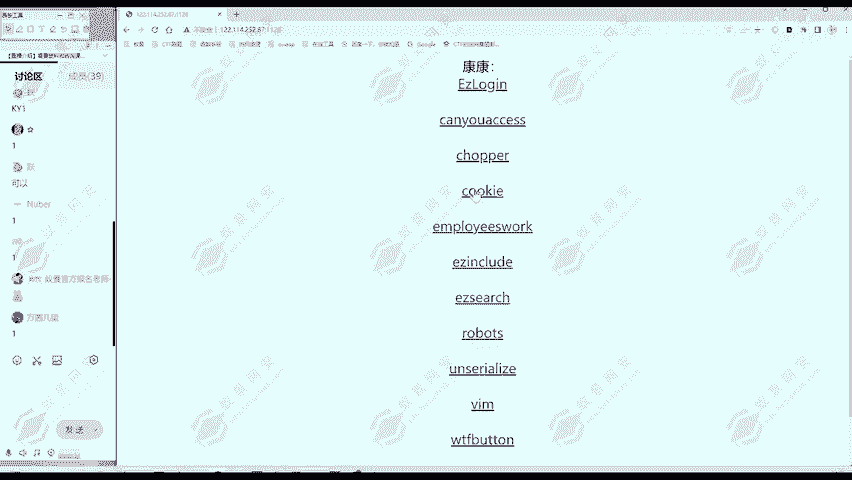
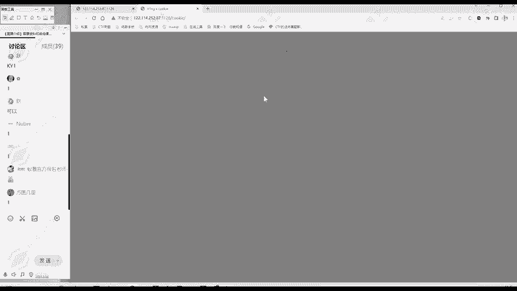

# 2024B站最值得看的黑客教程 ｜ 网络安全／渗透测试／内网渗透／漏洞挖掘／web安全／kali linux／红队靶场／CTF／信息安全 - P145：竞赛模式 - 网络安全免费学 - BV1uBsTetEow

那么CTF的比赛模式有哪些呢？主要有三种模式，第一种呢就是解题模式。解题模式呢就是一种线上比赛的解题模式，它是什么呢？就给你一道题啊，然后你做把这个题目的。😊，通过这道题啊，里面有flag。

你把这个flag找到。这题就做完了，提交获取相应的分值。比如说我们后面给大家看的这些题目，这都是解题模式的。😊，那么给你题目地址，这里就是啊多道题目题目地址，你要做哪一道？比如说做cookie这道题。

你就访问这个题，然后就开始做。

通过各种办法找到flag。

找到之后，这道题呢就做完了，就可以得取相应的分值，这就是解题模式。它通常是线上赛。那第二种模式呢就是攻防赛模式。攻防赛看这个名字就知道有攻击，有防守。那么你这个队伍呢就要承担两个角色，一个是攻击。

那你就要攻击别的队伍，别的队伍他有服务器，你要找到他服务器的漏洞，也是要找到flag。😊，那么防呢就是你和别队伍进行个角色互换。那么你是有服务器的，你是要防御别人的攻击。啊，别人打你的漏洞。

你要及时修复漏洞，你要发现别人的攻击等等。😊，有公有房。这种攻防赛呢通常是见于线下赛的这种模式。那么还有第三种模式呢，就是啊战争分享模式，这是一种相对新颖的模式。那么前两种模式呢都是比赛方出气。

比赛方出环境。😊，然后参赛队伍呢来做题就行了。那么第三种模式呢就是由参赛队伍之间相互出题，相互调整。那么这个最后的得分呢，不光是有你解题的得分了，但你还有出题的得分。就相对比较新颖的模式。

但不管是哪种模式，它其实主要考察的知识点呢都是啊基本相同的，它只是一个比赛形式的区别。