# 2024B站最值得看的黑客教程 ｜ 网络安全／渗透测试／内网渗透／漏洞挖掘／web安全／kali linux／红队靶场／CTF／信息安全 - P148：真题讲解—ezsearch - 网络安全免费学 - BV1uBsTetEow

ATF它是以比赛为基础，所以说这里呢是给大家准备了六道题目。😊，那我们的知识点呢都是在题目当中学习啊，边做题边讲题，边学习知识点。这样呢大家能够学习的更好，理解的更深。因为光讲理论的话。就感觉啊不实际。

没有切身的感受。你通过做题，你就知道这个考察点是什么，怎么运用。😊，那么这是我们啊已进自己的靶场。在这个靶场里面呢可以进行一个练习，这里是部分的题目。😊，这里有11道题，我们今天呢讲六道题目。😊。

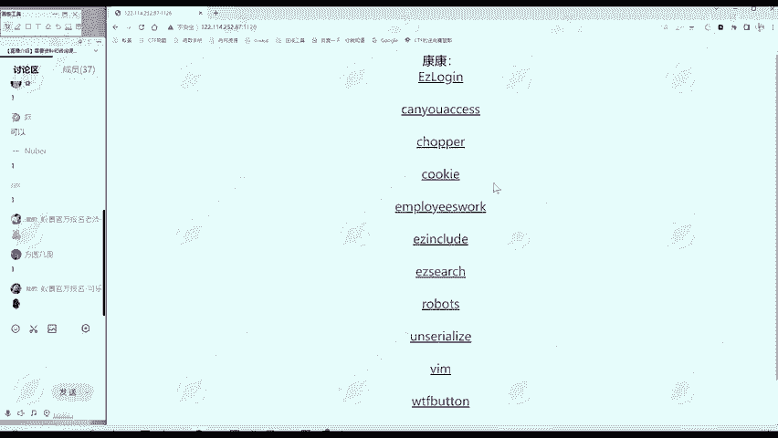

先从简单的开始。啊，我们从最最简单的开始啊，Ey search。我们看这个题。😊。

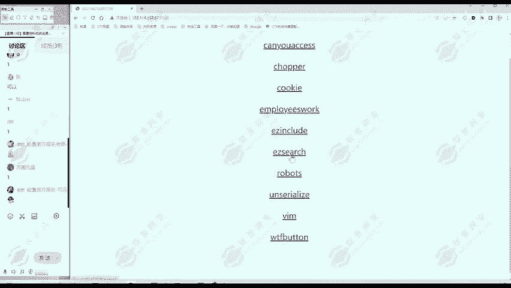

首先我们拿到一个题目，我们怎么做呢？😊，啊，有经验的同学可以在讨论区里面分享一下，我们拿到一道题目，最开始应该怎么办？😊，因为有好多同学他之前没有接触过MCTF比赛。或者没有做过外部题目。

他不知道怎么做。拿到之后就啊挺茫然，点击一下，哎，好像也没有什么动静。这里啊给大家总结一下。我们做外部题目的一个经验。我学拿着这个题目怎么做？首先呢第一步呢其实啊是进行一个信息搜集。

我么这里呢给大家记一个课堂笔记。😊，这个笔记呢在课后呢也是可以发给大家的。大家找我们的啊，先加我们的班主任微信，然后找我们班主任进行领取。😊，所有的课程资料添加我们班主任的微信进行领取。解题思路。

那么我们NIGHT同学说，图片里面藏着有这种可能性。有这种可能性，图片里面藏着flag。那怎么找到呢？那我们这里给大家总结一个一般的解题思路。通用性的。所以第一步就是信息。收集。应该是第一大点。

叫信息搜集。信息收集怎么收集呢？😊，首先我们有个最通用的三板斧啊，我们遇到一个题目，我们首先看一下这个题目给我们的一个网址。是什么？比如说这个题目给我们的地址是么？IP哎冒号端口。

然后呢Ey search。😊，这个IP和端口呢大家不用太关注，这是题目部署的地方。😊，就主办方他自己得有一个服务器嘛，他得把这个题目部署上。😊，这不是有价值的信息。😊，那IP端口之后呢。

就可能是有价值的信息。比如这里呢有个Esy search。😊，是吧那说明是不是s期就搜索嘛，是不是这道题可能和搜索相关呢？有这种可能。😊，🎼所以说我们第一步看这个URL，除了看URL之后。

我们还要看什么呢？我们还要看这个标题title这title是什么啊？YENGs啊，Ey search它也是Ey search。😊，那么看URL和标题。那第二步看什么呢？看我们的网页，我们网页有什么哎。

有这样的文字，where is flag flag在哪里？然后呢，有这样一个图片。我们滑动一下哎，没有别的内容就修。这个文字以及这个图片。然后第三部分我们看什么呢？我们点击右键，这里有个查看网页源代码。

我们点击一下看一下网页源代码。这个网易源代码事实上呢是我们防问服务器，服务器真正给我们响应的东西。😊，那么浏览器收到这些响应的数据之后呢，经过优化，哎，就是这样一个呈现的样子。

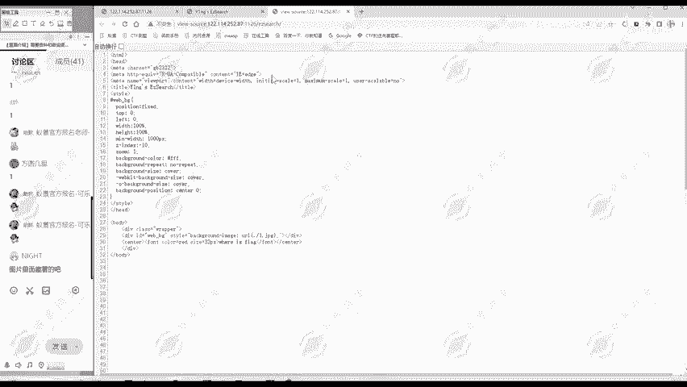

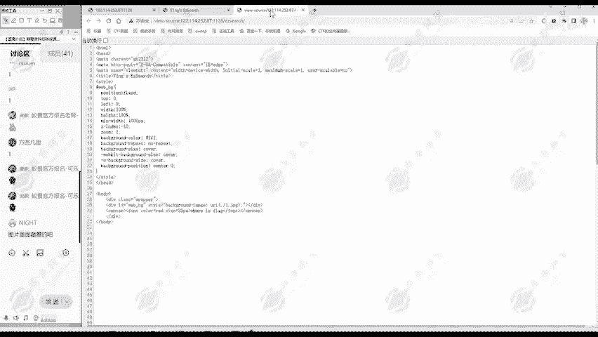

所以说。还源代码是我们收到的原始数据。我们要看一下。这你看完源代码的时候，重点要注意它和网页不同的地方。比如说有些注释的内容有没有哎，我们向下滑动的过程中就发现。

是吧这里有个注释信息。这里监括号感叹号杠杠，这是HTM注释。也就是说，这部分内容呢是注释信息，它不会显示在网页当中的。😊，那么我们通过网页云代码呢，就能看到这些信息。那么这个题呢，哎我们就做出来。

我们就找到了flag。第一题呢就是比较简单的。

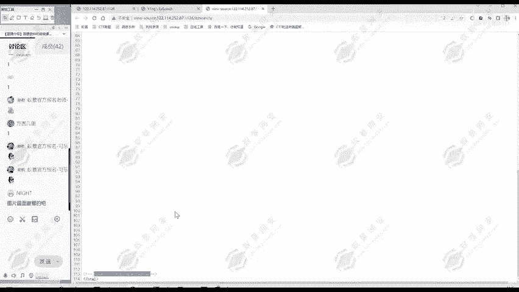

只要在信息搜集就可以做出来。那我们这里再总结一下信息收集要收集什么。第一部分呢是什么URL。以及呢标题。第二部分呢是网页。内容。第三部分呢是网页。源代码。

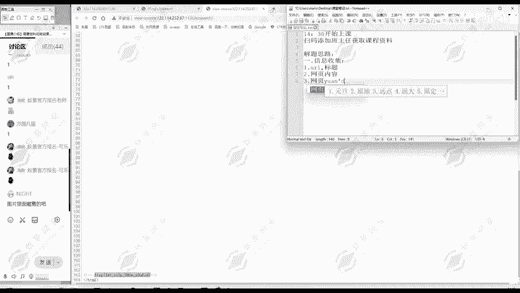

看这三部分。看从这三部分中，我们能不能够获取什么信息。那么像这种我们现在比较入门简单的题目呢，它直接就有flag了。像一种难一些的题目，你我们可以从这三步里面获取我们下一步要干什么。😊。

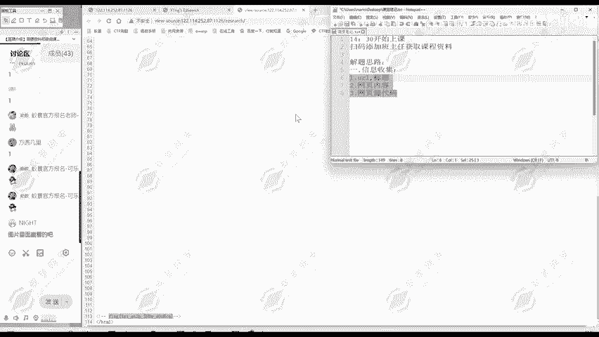

如果说对这个网页源代码内容比较多，哎，我们可能一下子找不到flag在哪怎么办？我们可以进行一个搜索。我们在网页源代码中可以点击一个conttrorl加F，就可以调出这个搜索框。

我们在这里进行一个搜索flag。哎，发现它有两处flag我们。😊。

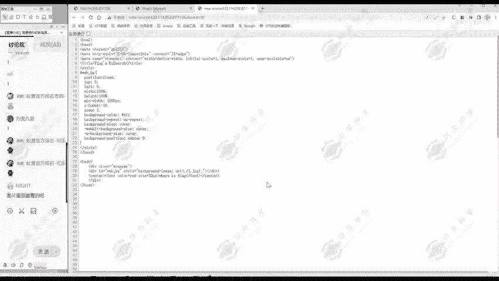

点击一下啊，这里where is flag，这是网页中就有的东西，我们不用太关注。😊，哎，这一部分就是我们真正要找的flag，然后这还是注释内容。这是网页当中看不到的。🎼就不会显示到网页当中的。

大家看where is flag会显示出来，但是这部分呢是不会显示到网页当中的这是在查看网源代码的时候，需要重点关注的。😊。

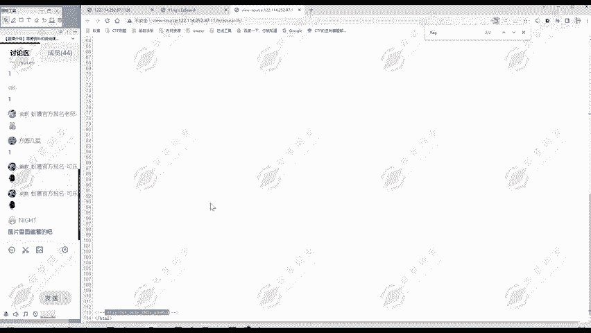

那么第一题呢，我们就做出来了。还原代码，这里给大家总结一下重点。关注。注释。内容。和代码内容。那么代码内容呢，我们这个题还没接触到，后面接触到的时候再给大家演示怎么关注代码内容。

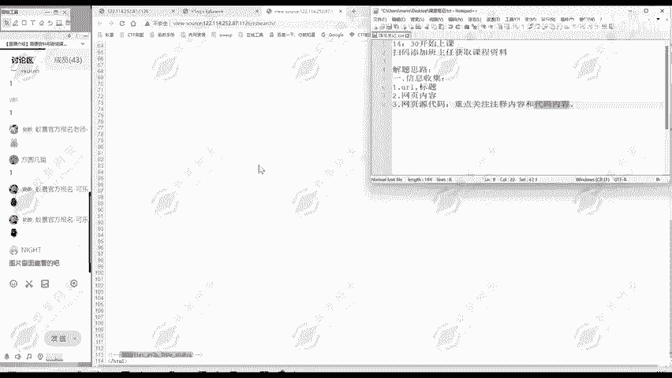

所以我们CTF的题目是不是外部题目也不是很难。😊，还是比较简单的。🎼大家按照我们的信息搜集的步骤呢，按照我们解题的步骤。😊，就能够做出来。对于第一个题，大家有疑问吗？有疑问的啊，欢迎提出来。😊。

大家不要只看着啊，我右键一下查看网页，那么就直接发现flag了。😊，这个就是只是这一道题目的，并不是我们本节课知识的精华。我们本节课关注的是什么？其实状元期给大家教的这个解题思路。

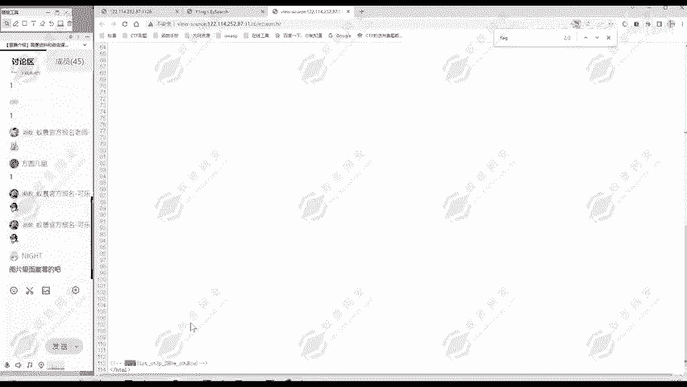

而不是某一道题怎么做。😡，这每个题呢只是这个解题思路的一个例子。大家要明确这个重点的是学习解题思路。😊，啊，不是说我知道这个题，我直接啥也不管，直接看源代码，然后在最下面拉到flag，这就意义不大了。

😊，这个解题思路大家明白没有？

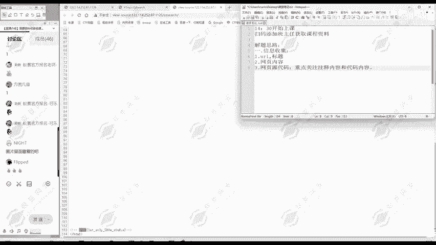

那么。第一题啊就做完了。