# 2024B站最值得看的黑客教程 ｜ 网络安全／渗透测试／内网渗透／漏洞挖掘／web安全／kali linux／红队靶场／CTF／信息安全 - P149：真题讲解—cookie - 网络安全免费学 - BV1uBsTetEow

啊，好，谢谢snipper的同学。😊，大家有疑问还是随时可以提出来。那我们看第二题。😊，哎，看一下cookie这个题，我们从易到完啊。

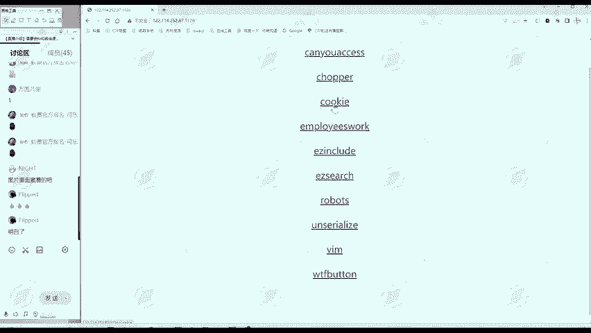

哭给这个贴。怎么做？是不是也要把我们解题思路给套上来，信息搜集，我们找信息。标题URL部分。IP端口我们不要管。IP档口之后呢是cook。😊，然后呢，标题呢也是Y音字字cookie。

那这个题呢可能和cookie相关。那网页部分呢是什么UN一个问号。那这里呢我们还不知道它表示什么。

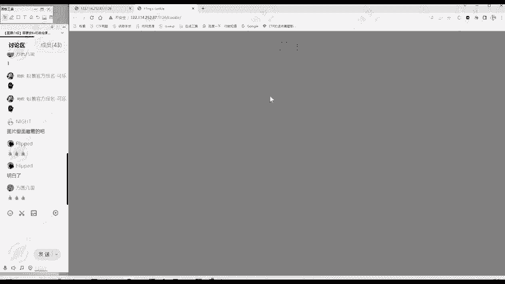

那么第三步就是查看网页代码，我们看一下。文源代码这部分我们滑动一下，它不能滑动，它总共就这么多内容。这里面呢也没有什么注释信息，也没有什么代码信息。😊，没有PHP的代码呀。

javascript的代码等等都没有。😊，那结合我们的这个信息搜集思路啊。就是分析。下一步是上怎么办？啊，大家对于初级的题目是新四解，这三板斧就够了。如果说大家以后更加熟练了，作为一个补充吧，这里。

先给大家补充这。🎼可以进行一个扫网扫描网站目录。这。这也是一个信息搜集的工作。那么在这里呢，我们都是一些相对入门的题目，就不用扫描了。所为扫描的时间呢也是比较长。😊，第二步呢就是根据。的结果。

判断下一步。做什么？比如说我们cookie这道题。那通过前面信息搜集呢，这就发现应该。适合cookie。相关。因为这时候我们还不能够做出来，所以说。我们还不知道答案，只能说是应该和库克相关。

那么cookie呢？酷ey是什么？其实cookie就相当于一个你的一个身份证。你比如说你登录了一个网站。😊，大家发现没？你登录网站，然后你继续跳转的时候，你登录到京东，你看一个商品。

你再看第二个商品的时候，他不会让你重复登录。因为他知道你的cookie，他知道你登录了cookie就干这个的。😊。

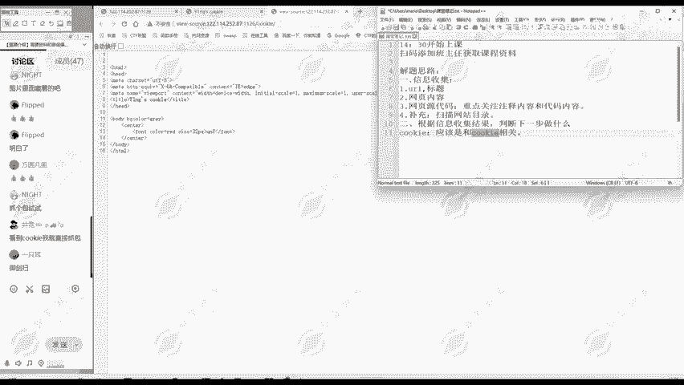

那这道题既然提示我们cookie，那我们怎么样发现cookie呢？😊，这只是一个知识点啊，想要找到cookie，查看cookie的方式有多种。比如说第一种，我们点击右键进入到一个检查。

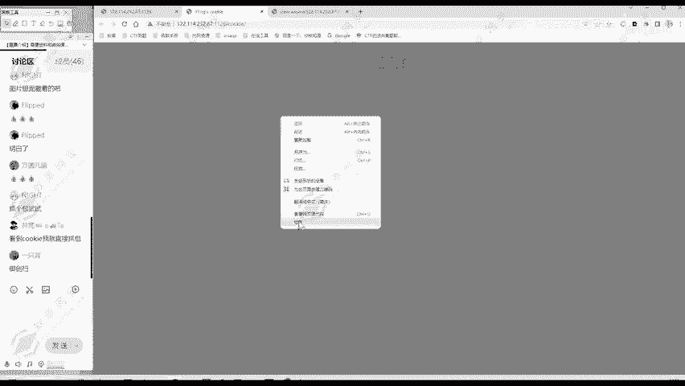

检查里面呢有个应用，这里面呢可以看到cookie。当然我这是谷歌浏览器啊，大家如果说用别的浏览器的话，这个位置可能有一点细微的差别。但都是在检查里面，你找一下都能找到。那么这个这里面有个cookie。

我们看一下我们这里的cookie是什么？名称是ht值呢是F14G点TXTHt呢就是一个提醒提示。来这提示我们有F14G这个TST。它这提示，那我们就访问一下看看。我们访问呢可以用hib这个工具。

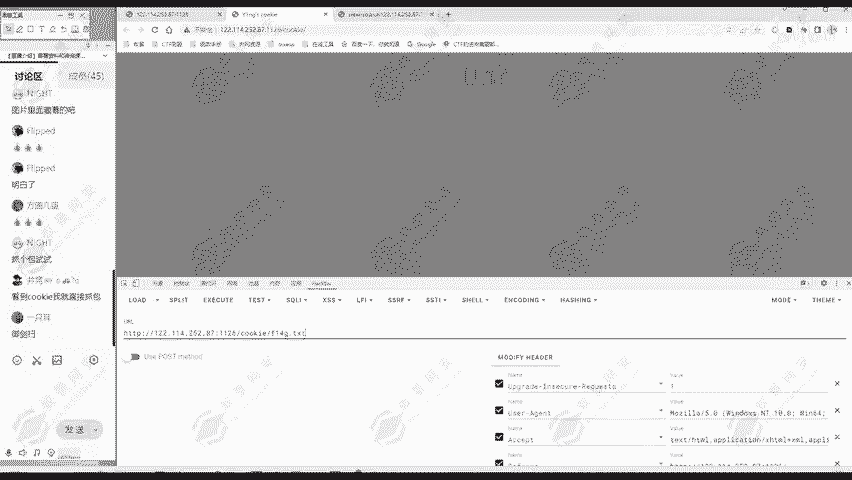

我们把这F14G。它是否存在这个文件呢？我们试一下。哎，果然就存在这个文件，然后flag呢就在F14G当中。那么这个题呢我们就做出来了。当然我们查看cookie的方式有很多种啊。

所以这道题考察的就是我们查看cookie的方式。除了我们刚才在应用中可以查看cie之外，还能怎么看呢？比如说我们使用黑p这个工具，这是一个浏览器的插件。这个插件啊，还没有安装的同学或者说不会安装的同学。

请添加我们班主任的微信，我们班主任可以把安装教程发给大家。😊，那么这个使用黑霸也可以看。我们的cookie怎么看呢？我们可以在模式里面model选择一个r，就选择原始数据。我们点击一个访问。

这就是发送请求。这EXECUTE。然后在这里面呢就能够。啊，我们刚才的访问呢。访问的是cookie，是不是我们刚才不知道cooker，所以说不知道F14G，我们直接访问cookie。😊。

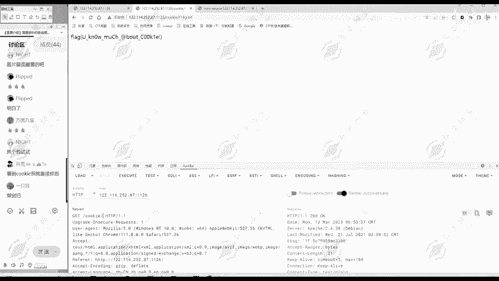

当然了，响鱼包里面就有个scook huntt等于F14G点TX器。从这里呢也能够看到cookie。这是第二种办法。第三种办法呢，大家可以安装一个bf suit。

这bf suit呢也是在我们啊CTF web或者说你做 web部安全，你挖SSA呀都非常常用的一个工具。😊。

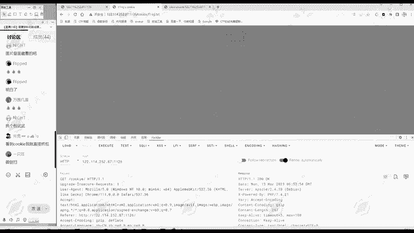

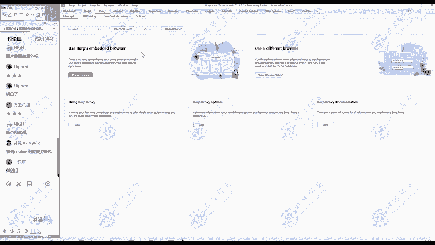

可以安装一个bp suit，然后呢在我们浏览器这里开启代理。😊。

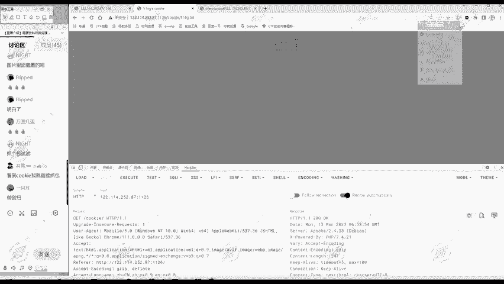

这个代理呢使用的是这个switch欧米ga这个代理插件。我们开启bf的代理。然后呢，我们刷新一下访问这个网站。我们刚开始啊访问的时候，比如说我们访问这个题目cookie，它是不带F14G点TSD的。

我们访问这个网站呢。😊。

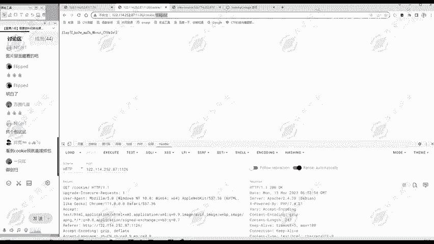

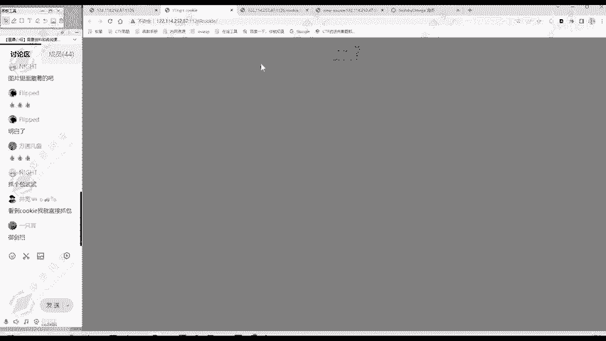

在我们bp里面就有一个访问记录。

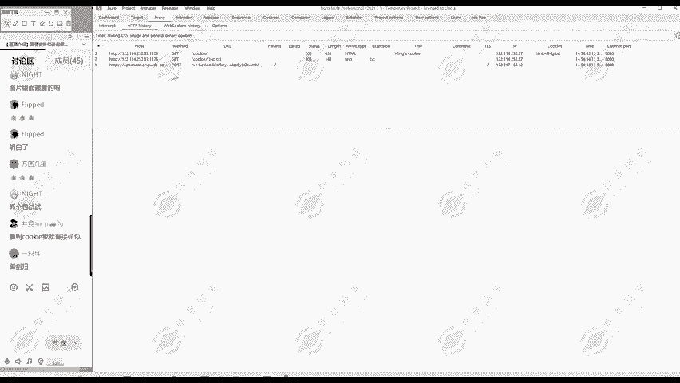

是不是啊访问这个cookie在这里面呢话，我们可以看到访问的详细数据。这个cookie呢就是ht等于FDL47点贴个T。从这里也可以看到，这三种方法都能够看到cookie。😊，看到之后，这就是个提示。

然后你访问F147点TXT呢就能看到flag。😊，那么第二题呢，我们就做出来了。所以说第二题它考察的是什么呢？查看。Cookie。的方式。方法。第一个是不是检查右键检查。然后呢，应用当中有。

然后第二个呢。是通过hi bar。可以看到第三种呢是通过。bb suit可以看到这三种方式啊都能够看到。这是这个题我们学到的一个知识点，就查看cookie的方法。那么除了这个之外，还有一个点要提醒大家。

我们cookie里面看到的是什么F14G点TXT。😊，那么这些呢都是跟flag相很像的，但是又不是flag，这就是为了防止有些。他啊不知道怎么查酷，他直接扫描，直接扫到fllaag。😊。

那么早些题目呢是有这种情况的，后面呢就往往会把flag所在的地址。哎，它所在的文件稍微变一下，比如说变成F14G啊。或者说变成FLLAG这种跟flag相关，但是又不是flag的这样的字段，防止呢这个。

参赛者啊直接进行扫描就获得flag。所以说大家看到这种跟flag类似的信息，就知道啊，这里是。我们就组对了，这就是我们所要寻找的flag的地方。这里是一个经验告诉大家。😊，那么对第二题。

我们cookie这个题。是怎样做的？从刚开始打开这个题目到最后做出来。大家理解了吗？这里提到的工具啊，黑客 bar这个bb suit以及我们switch欧米卡插件呢。当然重点还是要学习我们的解题思路。

😊，这一个题是无所谓的，重要是思路。思路才是啊，大家做别的题目的时候都会用得着的。

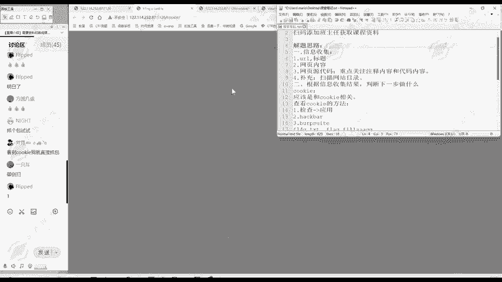

那么我们月同学问。黑b只有谷歌才有吗？不是啊，像我们火狐浏览器啊、爱及浏览器啊都是有的。😊，像我们这里，比如说这是火狐浏览器。右键的当中检查也是有黑b了。只不过他们不同地方，其他版本可能有所不一样。

这是我们的啊第二个题。你这都是英文，那你那是你浏览器语言的一个事情。你可以把浏览器语言设成中文呢。在应用找到flag之后怎么办？找到flag之后，就可以进行一个提交，提交你这道题就做对了。😊。

那么比如说我们可以。看一下我们怡景自己的有1个CTF训练营。😊，那么这里面呢有很多题目。比如说这你随便一道题啊，你点击挑战。😊，啊，要登录一下。点击挑战呢就有个创建靶机。呃。啊，因为这道题我已经做过了。

所以说这个题呢我没有提交的地方。比如说一个题库。找个啊没做过的题目，这个题没还没做过题目。在这个位置呢就有个flag提交的地方，然后你获得flag之后，把它复制到这里，然后点击提交就可以了。

这个题你就得分了。😊，所以说我们讲题目呢就是告诉大家找到flag就行了。你要去参加比赛的时候，每个比赛的。😊，主办方都会给你提供提交的地方了，这个不用担心。😊。

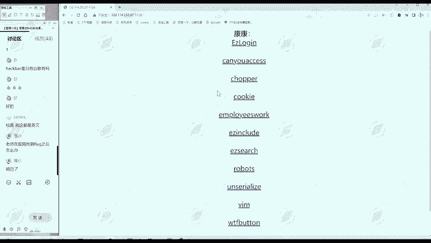