# 2024B站最值得看的黑客教程 ｜ 网络安全／渗透测试／内网渗透／漏洞挖掘／web安全／kali linux／红队靶场／CTF／信息安全 - P150：真题讲解—chopper - 网络安全免费学 - BV1uBsTetEow

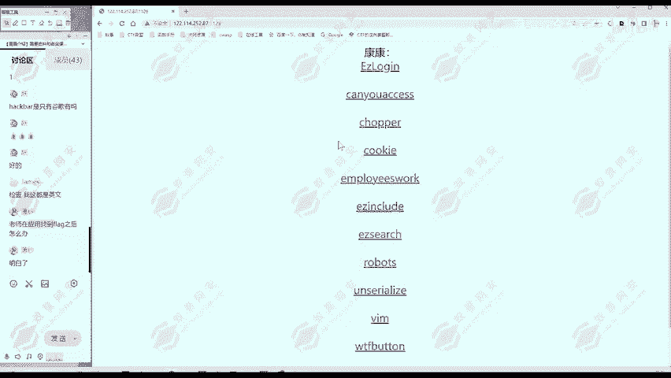

那我们看第三题啊。其他同学有疑问，欢迎提出来这个chopy这个题。😊，同样的第一步我们信息收集信息收集。我们看一下UIL当中有个CHOPPER这个单词什么意思呢？啊，不太知道。😊。

那么上面的一个tro and and sword。这是标题，然后网页部分呢是一个一段代码，是不是？阶段代码呢？是1个PHP代码。这不是啊一个无关代码，这是重要代码。

所以说这里呢我们需要有一点PHP的代码知识。那么我们啊。🎼仅仅同学。咱们讨论区说的好，这就是POP的一句话木马。那么这一句话是什么意思呢？我们一个个分析一下这个监括问号PHP呢，这是P7P的一个原标签。

包括最后的问号监括号，这是P7P结束的标签。那么中间的部分呢就是PHP的代码。😊，代码我们看最开始的艾呢就是不报错，不给你显示报错信息的意思。😊，那么中间呢是1个EVL。

EVAL这是1个P7P面的一个方法。它跟函数非常像，但是不是函数，这你简单理解为一个函数也可以。😊，然后这里呢是一个括号，是不是中间呢相当于是函数的参数，相当于啊你严谨的说，EVR它不是函数。

那么这个EVR方法是什么作用呢？就是把里面的内容当成PCP的代码来执行。那里面的内容是什么呢？donor post，然后中括号A。多了po中合A是什么意思呢？donerpo就是提取啊。

我们访问网页时用po发送的数据。比如说我们在已键当中，我们使用已键。😊。

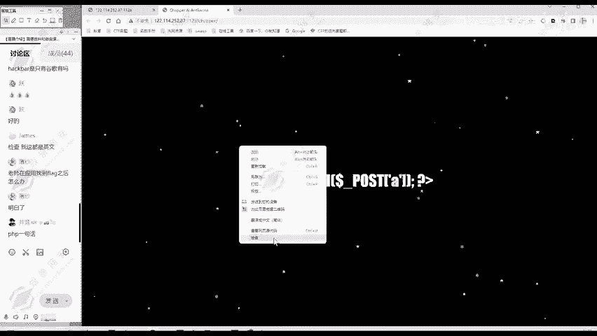

是不是可以。用basic就行，访问这个网站，然后这里面有个us post message，我们可以给它post数据过去。😊，那么多呢po呢就是提取我们po的过去的数据，它提取什么呢？

提取A这个参数的数据。比如说我们这里po一个A等于1。那么这里的多了post括中括号A，它整体呢就等于一。我们这里post A等于add me。那么这整体呢就等于al me。就提取A等于多少。

用pos的方法传递的。那所以大家现在理解没有？它是一为什么是木马？那现在是不是用户传递A等于任何的代码？这里就提取出来，然后EVL执行啊，那用户想执行什么代码就执行什么代码。所以说这是一个木马。

那它只有一句话呢，所以叫一句话木马。😊，这是我们关于网页信息能看到这一句话木马呢一一看我们就很感兴趣。木马嘛，我们作为网络安全的这个挑战者啊，找动木马呢控制服务器就。😊，很简单了。

这是啊从网页部分能看到的那我们可以查再查看一下网页代码，看能不能看到什么有价值的信息。😊。

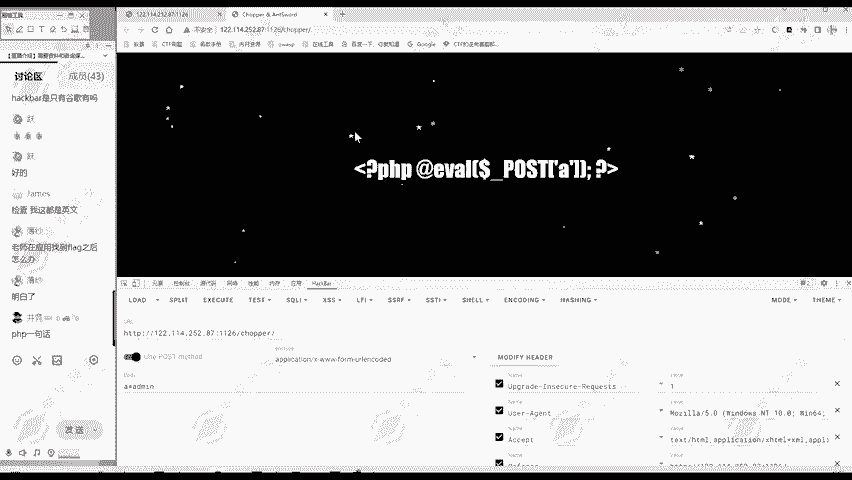

那么有没有什么注释内容啊，我们看一下。哎，没有什么注释内容。那么代码呢，这个PHPe这个我们刚才在网页当中看过的，也没有什么新的代码。😊。

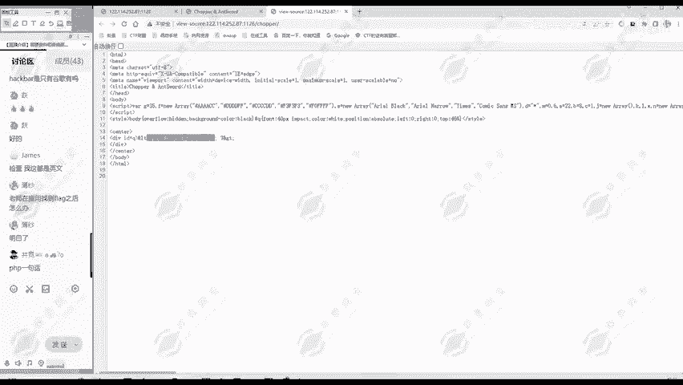

所以说信息搜集就结束了。就发现他有一句话木马。那我们这这个题我们也记录一下。通过信息收集呢。发现。有。一句话，木马。啊，这是第一个发现。😊，那还有呢他刚才我们看这个URL以及标题的部分呢。还有这个翘拍。

还有呢antword。这and word呢。就是什么？就是已见。😊，这是已建的意思。这个已建呢是一个一句话木马的管理工具。它准确说它是个木马的管理工具。它。😊。

就是我们用一句话木马上传这个怎么样实现我们的目的呢？😊，怎么样实现我们控制服务器的目的，就用一键就非常方便操作。当然你不用一键也可以啊，我们这里首先演示一下，不用一键怎么样。😊，控制这个一句话木马。

刚才给大家解释它是不是我们这里用pos方法A等于多少？😊，那么服务器呢就会执行什么代码。比如说我们这里做个测试，A等于PHP in。这里呢要打一个封号结尾，因为是eva方法，这eva方法的特点。

就是你代码结束之后呢，还要用一个分号作为结尾。😊，我们执行一下，是不是果然就执行了PHP info显示了这个PHPin的信息。😊，那我如果说执行别的代码，执行系统命令可不可以的？

系统命令就有system。😊，I。比如说我先看一下有哪些文件，当前目录下可不可以呢？😊，好像哎没有什么信息，是不是没有执行结果呢？不一定。😊。

这个时候我们看一下文源代码。大家注意到，相比于之前的这最下面是不是多了一点？😊，多那点什么index点PHP。也就是说，当前文件下。当前文件夹下存在的文件呢就是index点PHP。

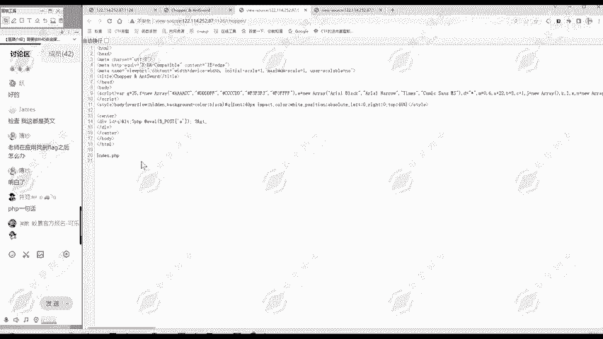

说明我们这个stL是成功执行的。那flag。intelex点P区看它这里面没有flag，那flag呢不在当前目录下。😊，它在哪儿呢？它很可能在根目录下，这也是一个经验。那我们看一下根目录下有哪些文件。

同样的查看网页代码。

那根不能一下有Bbo DV哎，有个flag文件。那这很可能需要我我们找到flag，就在这个文件当中，很有可能。

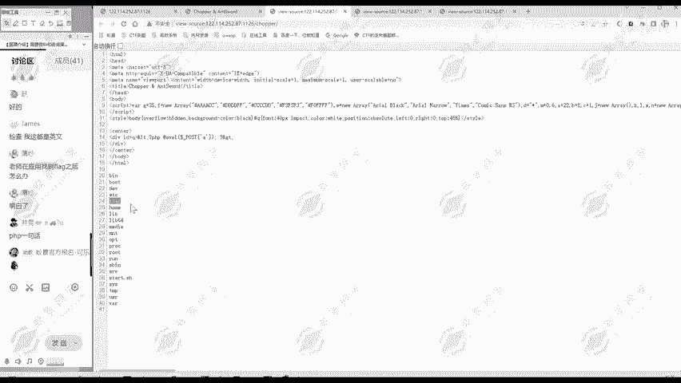

那么现在呢我们就要查看一下flag文件的一个文件内容。它的路径呢是跟目录下flag。然后ca方法查看一下文件内容。

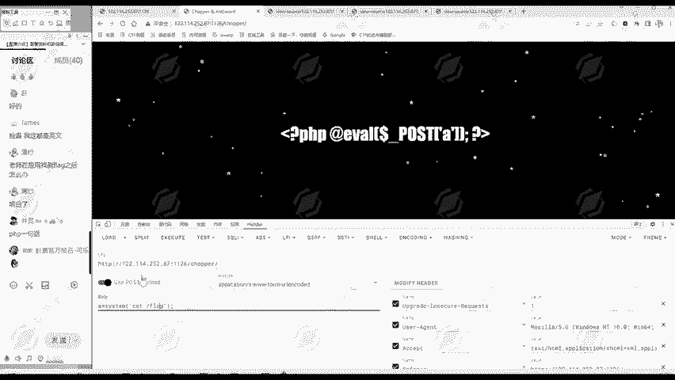

再点击一下执行，然后查看文源的码。哎，这样就看出了flag。

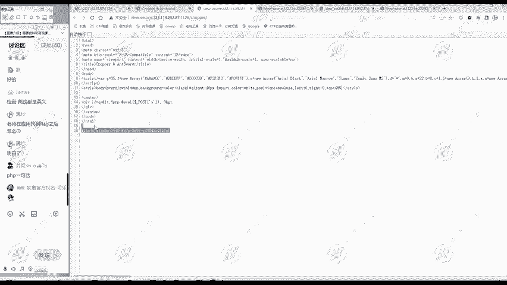

这是我们直接利用一句话木板的方式。那除了这种呢，还有一种方法就是用用我们的已线来管理一句话木马，就比我们在这里一点点发送，看源代码方便多了。😊，怎么用呢？首先我们打开一键，大家打开一键就是这样一个界面。

它英文呢就是under word，这里呢也是一个提示信息。😊，怎么用呢？我们首先。复制一下木马所在地址。把这个URL复制一下。然后在一键这里点击右键添加数据，把URL贴过来。然后这里连接密码是什么呢？

就是这里面的连接所用的传说参数名。A，这里面是A呢，你连接密码就填A，这里面是B就填BABC就填ABC跟这里啊保持一致就可以了。😊，这里我们填上A，然后我们点击个测试连接，连接成功呢就代表。

这个已键已经成功连接上这个密码了。现在服务器我们可以控制，点击一下添加。😊，我们双击一下就能看到这个服务器里面有哪些文件。看到有别的文件夹，就是别的题目的文件夹。😊，它一般呢都在当前部录下。

我们当前呢是这个。😊，桥牌当前目录下没有啊，就在根目录下涨。这两个地方是最可能放flag文件的地方。那根目录里面我们找到哎。有一个。flag这个文件，我们双击一下，可以查看文件内容。这样flag就找到。

用已键呢就非常方便管理。你想看这个你们。这服务器上哪个文件都可以看，别的目录也可以看。😊，但别的目录可能没什么文件。就跟我回来个。没有相关的内容，我们就不管了。这就是已见的一个方便之处。

所以说我们前面这个题呢是要考察。对。一句话，木马的理解。和。已键的使用。你不用一键的话，你就像我刚才啊说kickb这样一点点的执心命令呢也是可以的，就是麻烦一点，用已键呢就更方便。😊。

对我们第三题ch这个题还有疑问吗？从拿到这个题哎怎么做？我们嫌因为信息搜集有一些思路，然后根据信息搜结果判断我们下一步该做什么。有疑问欢迎大家提出来。😊。

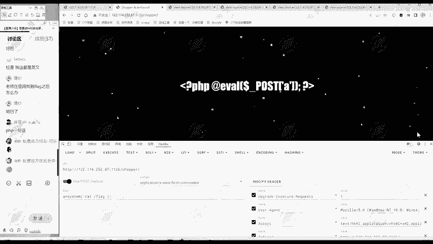

那没有疑问的话，我们继续往下面走。很有收获，谢谢博夏同学啊。😊。

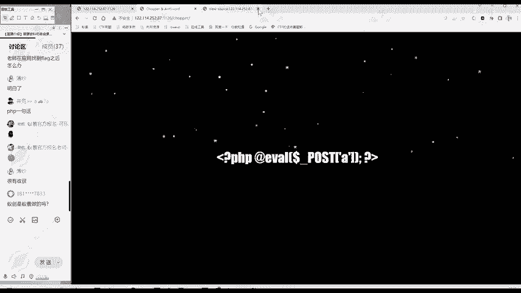

乙健是乙景做的吗？不是我们做的。这些题目相当于是1个CTF webb的入门题目。大家把这些题目学好之后呢。😊，才能继续学后面的内容。

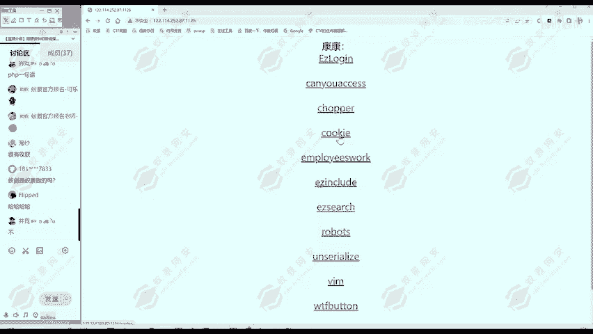