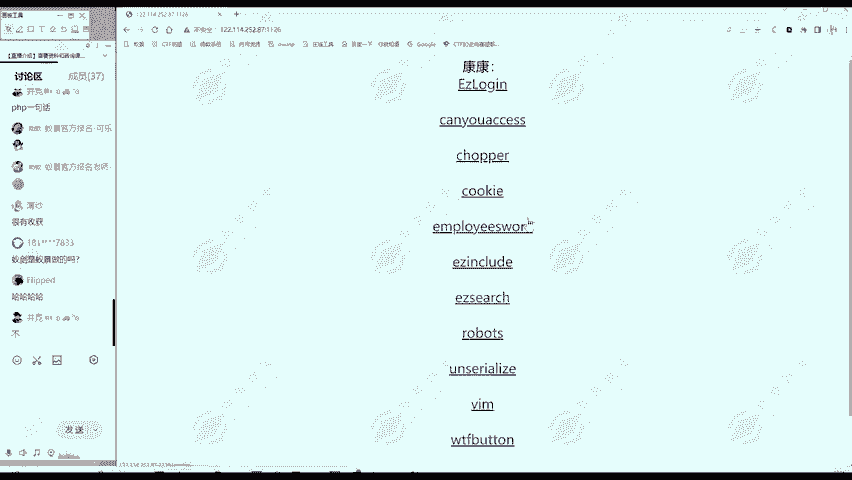
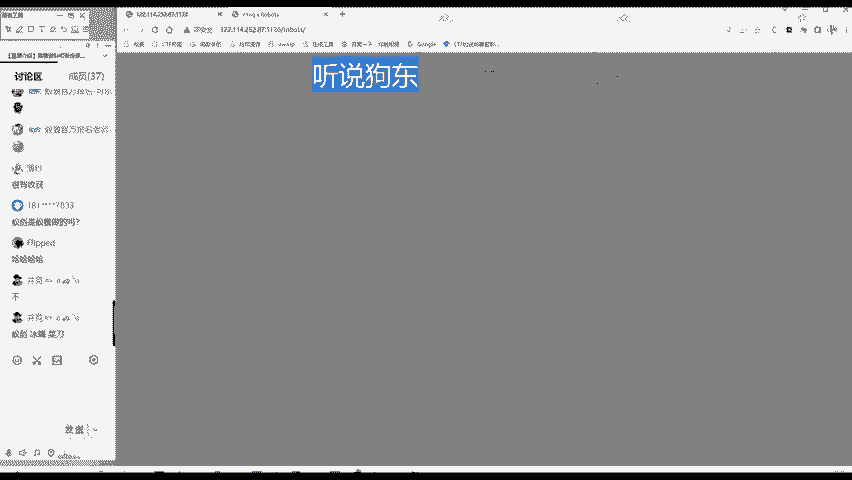
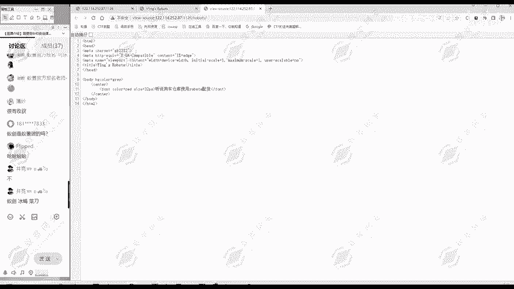
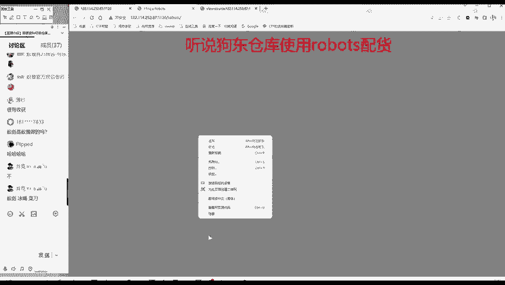
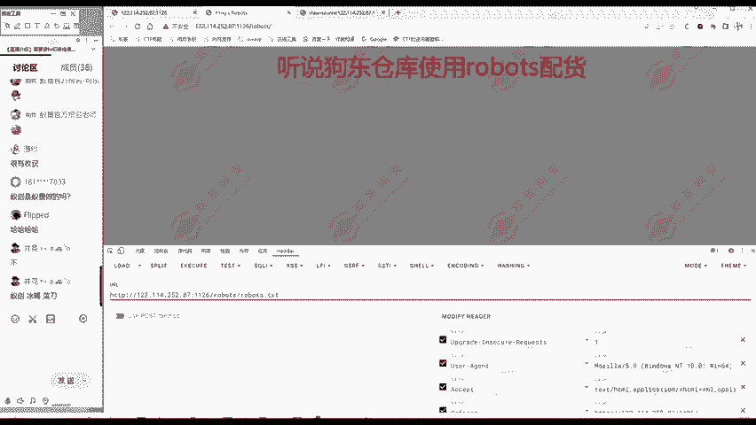
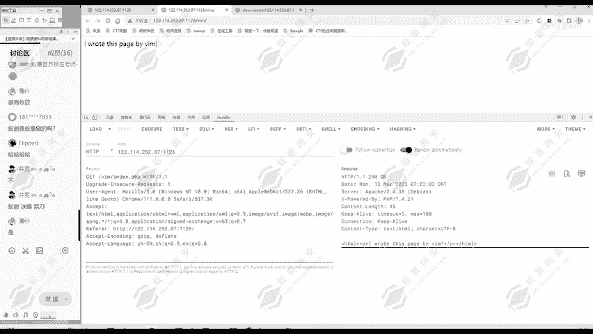

# 2024B站最值得看的黑客教程 ｜ 网络安全／渗透测试／内网渗透／漏洞挖掘／web安全／kali linux／红队靶场／CTF／信息安全 - P151：真题讲解—robots - 网络安全免费学 - BV1uBsTetEow

那我们再看一个题啊。Robots。这道题呢同样的。也是。我们信息搜集robots。然后呢，Y音这是robots。这是标题和URL。然后网页部分呢，狗东仓库使用robos配货，别的内容没有。

然后完源代码部分。啊，就是网页上这些内容没有别的。😊，那我们通过这个题呢，信息搜集。之后呢。进行一个分析。应该适和。Robos。相关。robo就是机器人嘛，和机器人相关。那怎么做呢？啊。

大家注意到我们在互联网里面呢有一个重要的协议。有个robots协议。他是一个。反爬虫的协议。这个协议大家有一个了解，这协议什么意思啊？😊，就是现在不是有很多爬虫的工具嘛，可以爬除网页内容。

比如说我现在是一个京东，我上面有很多商品，那别人扒取我内容，但我不想让别人爬去。😊，怎么办？我可以写一个robots协议。这里面呢规定我哪些网站是允许别人爬去的，哪些网站是不允许别人爬去的。

如果说别人爬取了，我规定不允许爬取的内容，那么别人就要承担相应的法律风险，这是一个声明。但是不一定每个网站都有啊，大家可以自己去访问一下京东啊、天猫啊或者是抖音啊这些网站看一下。😊。

它有没有robots这个协议，那怎么去访问这个robos协议呢？就是这个网站的目录里面。

我们还是使用黑黑霸这个工具，这个工具在我们网络安全里面用的非常多啊。所以说你在这里面直接输入这个网址也可以，但是老师一般习惯用这个黑霸工具。😊。

怎么访问呢？就是输入。robots点TXT。就是看是否存在robots点TST这个文件。

然后访问呢，发现这个网站是存在这个robot点TST这个文件的。只是么它使用了这个robos协议。这个协议主要有两行内容，第一项是user agentent。就是指明有在一起呢。

就是对谁心呢就是对任何人，对任何人都要遵守下面的要求。dal lot dlow就是不允许不允许什么呢？斜杠rorobot nurse斜杠flag点HTML这个。😊，就对任何的。

用户都不允许爬这两个目录下面的内容。那这说明什么？这说明这个网站很可能它是存在这两个目录的，是不是？就因为它存在，所以他才不允许part取嘛。那它既然存在，那我访问一下看看。🎼哎，访问这个。

木录好像哎没什么内容。这个时候。大家千万不要以为自己做错了。这个没什么呢，他但是他也没有报错，没有说什么404note found的，说明这个目录或者说这个文件夹是存在的。只是说在网页上没显示内容。

这时候我们怎么办？我们要查看网页代码。😊，你有网页源代码才是服务器对我们响应的真正的数据。这个网页看到的是渲染库的数据，它不是原始数据。这里呢大家可以看到表面看没什么内容，但是我滑动是不是可以动啊？😊。

哎，它这个flag呢就藏在最下面。所以说你查看网页代码，或查看网页的时候，你要滑动一下，看一看它网页会不会动。😊，他有很他的内容，在很多个空白行之后。那这这里呢我们就看到了flag。

当然大家刚开始做这道题的时候，这个flag在第一个里面还在这个第二个里面，这都有可能。如果第一个里面没有，那我们就把第二个再访问一下。😊，试一下。那第一个里面有了，那我们就已经找到flag了。

所以说这个题呢主要是考察对robots协议的一个理解。对，这个题有疑问吗？有疑问同学欢迎提出来。😊，有时间喝口水，大家可以思考一下。😊，那这个题大家理解之后呢，我们继续往后面看。那么啊大家可以看到。

就是虽然我们做题的刚开始啊难度呢会比之前大一点点。但是你只要跟着学呢也都不成问题。我们看一下VIM这个题，我们把之前题目关掉。😊，这道题呢首先还是信息收集。VIM。然后标题呢就这王者YM。

然后网页部分呢，Iro this page byVM。我用VIM写的这个网站就这个意思。然后网原代码看看。滑动一下，唉，没有别的内容。那么通过我们信息收集呢。对VIM这个题。

就我们就可以猜测应该是和VM相关的。这个VM是什么呢？😡，VI或者是VIM。是。尼uxux里面。的文本。编辑器。你的系统一般是自带VI或者VIM的。这样的一个文本编辑器。

那这个题呢应该和这个文本编辑器VMVM就是VI的一个升级版。应该是和这个VM相关。再加这个网页当中也有提示嘛，是使用VIM写的这个网站。所以说这个网站。就应该是和VM相关的。

所以说这个题目考察的就是VM的知识点。那VM它有什么问题呢？你要想大家想大家想，就是我们网络安全中考察。一个相关知识点肯定是考察它安全方面的问题，它的漏洞等等，不是考VM怎么用。

那跟网络安全就不太相关了，但是开发。😊，的事是吧。VM有个什么问题呢？就是。飞。非正常退出时。会自动。生成。一个备份文件。那么自动生成了备份文件的文件名呢？就是。点。然后你原来的文件名fi name。

它要备份谁吧？原来的fiair name点SWP。这是它备份文件的格式。我们VIM就有一个这个特点。那么这个点文件呢，在linux里面是不是一个。隐藏文件啊，所以说而且它是自动生成的。

所以他很可能被用户所忽略。那么我们这道题是用VIM这网站是用VIM写的，它是否也有一个自动的备份文件呢？有这个可能性，我们就想访问一下这个点fiair name点SWP。访问一下试试是不是？

所以说现在关键就是找到他这个文件名是什么。我们才能知道备份文件名是什么。😊，文件名是什么呢？反的是VM，然后斜杠。那么VM是一个目录，它不是文件名。😊，那么怎么知道文件名呢？这，同样我们可以使用。K8。

然后我们这里的模式呢可以选择弱，就是原始数据访问一下。我们看一下原始数据，当然这个数据在bb suit里面，你抓包也是能看的。多种方法都可以看原数据里面有哪些呢？哎，有个X power by。

就是我们这个服务器。它所支持的后台的引擎是什么？它支持是PP，然后版本呢是7。4。21，这个信息也是很重要的。大家后面做题的时候也要关注这个信息，因为很多环境是跟P区P版本相关的。

你通过这里可以知道PPP具体是哪个版本，然后呢，这个版本有什么问题，或许是我们解题的一个有用的地方。😊，那这里呢我们就知道它是使用的。是PHP，然后访问的是VIM访问的是一个文件夹。

那后面的文件呢是省阅了。😊，审阅的文件就是访问默认的文件，默认的文件是什么？一般都是index是吗？当然这里是1个PHP的环节，所以说是index点PHP。😊，那我们这里把它补充上。

然后访问呢大家可以看到响应是一样的，说明我们刚才这里的访问呢就是index点PHP。

那fi name就是index点PHP那么生成的。自动保存的文件名呢就是点index点PHP点SWP。那么们现在访问一下这个文件，在它前面加上点，在它后面呢加上点SWP。

看看是不是存在一个叫样自动生成的备份文件。大家可以看到没？确实是存在，是不是？然后flag呢就在这个备份文件当中。网页当中也可以看到flag什么什么。所以说这道题呢就考察YM有一个这样的一个特点。

但其实也算不上一个漏洞，但是容易造成一个漏洞的地方。这是会自动生成一个备份文件。这个备份文件呢，如果说不删除，被别人访问了，它可能造成一个信息泄露。这个题主要是这个意思。

所以说flag呢就在这个备份文件当中。😊，啊，对于我们YM这个题。大家理解了吗？不宁姐同学欢迎提问。有任何问题都请提出来。不要觉得自己什么零基础的。没关系，我们都在课堂上学会就行。不要管基础什么样。

你学到了就是收获。那么谢谢弗林派的同学。😊，这个题大家还有疑问吗？欢迎大家提出来。😊，嗯，懂懂了就好。那么我们啊。继续往后面斜写。

