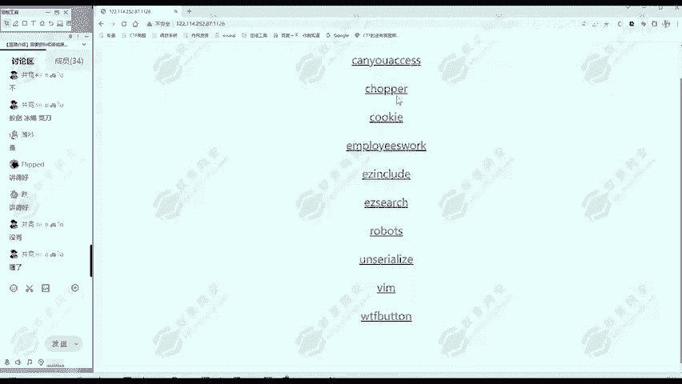
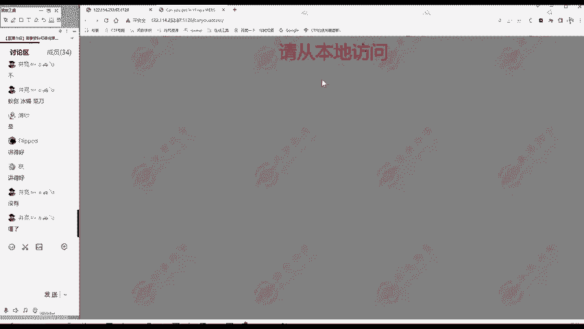
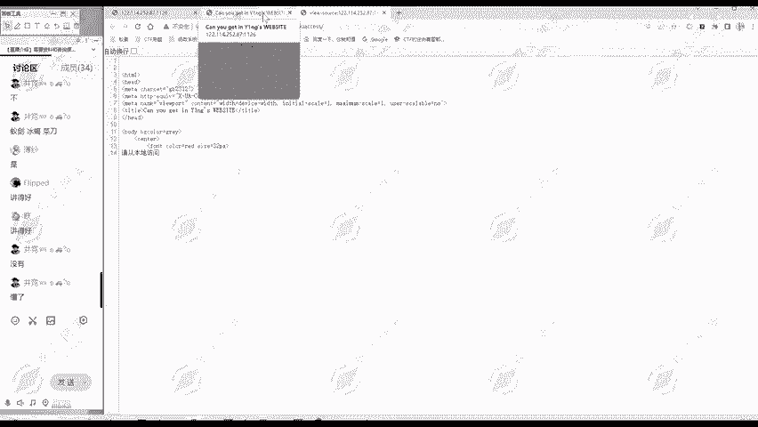
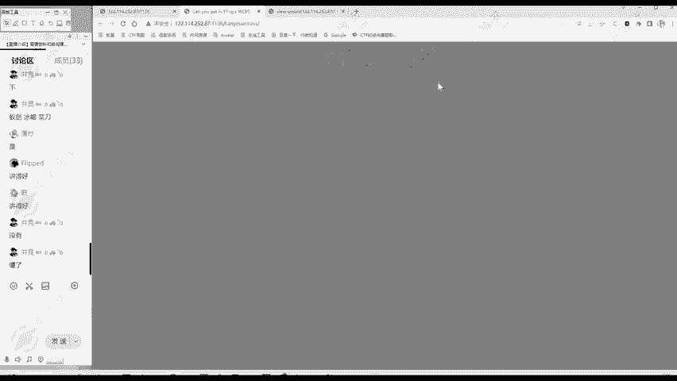
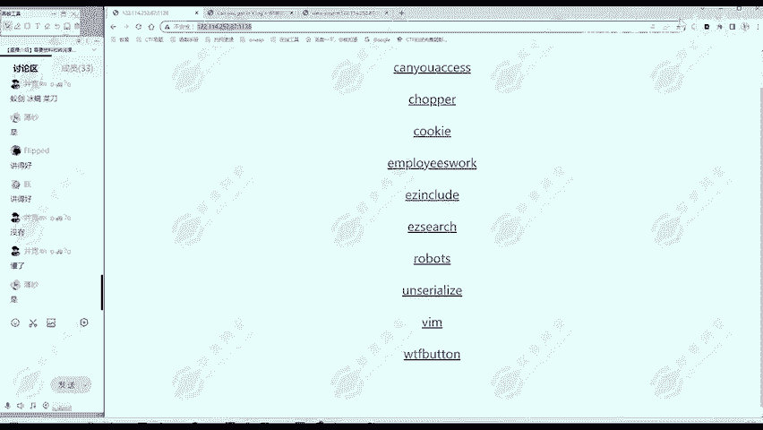

# 2024B站最值得看的黑客教程 ｜ 网络安全／渗透测试／内网渗透／漏洞挖掘／web安全／kali linux／红队靶场／CTF／信息安全 - P152：真题讲解—canyouaccess - 网络安全免费学 - BV1uBsTetEow

我们再看一个铁。

这个题啊，can you access。😊，这个题呢比之前题目呢就复杂一点。😊，当后我们从图开始看这个题怎么做。首先呢还是找信息。海容アクセス。那么翻译一下呢，你能够访问吗？那么这个标题呢。

can you get in这个Y音机s website。也是就你能进入这个网站吗？也是差不多意思是吧？😊，然后网页部分呢，请从本地访问。

然后网页员代码看一下。也没有什么。没有什么额外内容，我们网页那么抓要看网页当中没有的内容。

那么这个题呢我们也进。我们记录下。这个钱啊。好像。根据我们刚才的信息收集，好像和访问。相关。这是个你能不能访问的问题。那根据这里呢给我们的提示，请从本地访问。那么就从本地访问。我们能从本地访问吗？

大家想。这个服务器啊是部署在。主办方案讲。是吧。这里呢啊虽然是部署在我们乙警的服务器上，但是不是我的电脑是吧？😊，大家做题的时候也是这样，你们题目呢是在。😊，主办方那里不是在你自己的电脑上。

所以说你是不可能从本地访问的。😡，不可能，我们是。我们不可能。真正。从本地。访问。这时候我们就要思考一下。服务器它怎样知道。我们是不是。本地呢。我们访问他他怎么知道我们是不是本地。

是不是我们首先搞清楚这点，然后再找他绕过的方法。😊，这里呢我们为了后面的方便呢，可以使用b进行一个抓包。我们开启代理。

然后呢，在报复里你们找到凯uacces。这里怎么用呢？我们把它发送到repeer模块。在这个模块中呢，我们可以修改请求包，然后多次发送非常方便。我们直接点击发送，哎，可以多次发送都可以。😊。

他现在告诉我们，请从本地访问。这时我们就想他怎么知道我们是从本地访问还是不是从本地访问。😊，这里面呢其实就考察1个HTTB协议头。大家注意到，这里是一个请求信信息，是不是？

那这里面有多个字弹host是什么c control user。😊，upgrade user agentre是吧，有这些字段，那么这个服务器呢？😊，这些信息是我们发给服务器的，服务器收到这些信息之后。

就可以做出相应的判断。知道我们的后sse是什么，我们的user agent型统是什么？那怎么知道我们的是不是从本地呢？就要知道我们的IP是什么。😊，IP怎么知道呢？可以用X forwarded的。4。

通过这个字段指示我们这个访问的IP是什么？比如说他现在要求是本地嘛，本地就是17。0。1，我们添加一个这样的字段名字段值。然后再发起一个访问。大家注意到哎，下面这里变了，刚开始说请从本地方。

现在说你以为我不知道X four就是 four。是不是还是没有找到flag？但这个是不是意味着我们这里添加错了呢？这不是，反而说明我们这种方法，我们这种思路是正确的。因为这里面呢有了改变。

是不是刚开始请从本地方问，现在呢。😊，啊，是。显示你以为我不知道。那它说明这里呢存在一个过滤，它就不允许你使用S four的 four。说明我们的思路是正确的，我们就要让它认为我们的IP呢是17。0。

1，但是呢又不能使用S forty的 four这一个字段。😊，那么使用什么呢？这里呢啊也是给大家收集好了一些工具。比如说我们可以打开这个。这里面呢有啊30多个。这都是只是我们的来源IP的。

我们IP从哪来，可以用clantIP啊，可以用for的 forIP。😊，也可以用X4D的负2都是可以的。它这里面可能过于了，一个两个，或者说10个20个，但是它应该不会全部过于。我们把它全部贴过来。

复制粘贴。然后呢发送过去。大家注意了吗？啊，这里又有变化了，请从谷歌点com放。说明我们刚才这里是不是就已经生效了，他现在已经认为我们是从本地访问了。😊，所以说大家做题目的过程中呢。

也要注意收集一些工具。这样你就直接贴过来就很快，要不然你一个个写。那就比较慢嘛，或者说你把这些被。备住那也备不住是吧？因为你我们还要学习的内容呢也是很多，这些内容把它强背下来没多大意义。😊。

那么现在从这个变化中知道我们这一步又做对了。我们就开始进入下一步，请从谷歌点com访问。这里面呢叫。知道我们HGP协议它怎么样服羲怎么判断。我是不是从谷歌访问的呢？从哪个字段呢？

你从哪里访问是refer这个字段所定义的。refer就是你从哪里来的。它这一规定是告诉我们是从这个我们这IP端口来的，大家看是不是。😊，这就是我们这个靶场的地址啊，是从这个地址过来的，确实是这样。😊。

他现在要求我们请从谷歌点com访问，那我们就。把它这里的要求复制下来，然后呢把这个refer这个字段值改成它的要求。然后我们点击发送。这你又变了，说明我们刚才这里的改动呢是成功的。

那现在要求我们请使用ABC浏览器ABCpro我们要复制一下。那哪个字段是定义我们使用了什么浏览器呢？是user agent的这个字段。😊，这里是告诉啊，服务器我们使用的是什么浏览器。😊。

同样的我们把这个0感器的值给替换成它要求的ABCber。再点击个发送，哎，这里的flag就出来了。那么我们这个。还有excess这个题呢。思路就是你要。判断服务器是怎样知道我们有没有从本地过来。

我们有没有从谷歌点com访问我们有没有使用ABCber，要知道服务器怎么判断的。😊，这里呢考察的是对HTTP。协议。头的理解。就是你知道这些字段是干什么的，refi这个字段干什么的。

U在AG的这个字段干什么的？😊，你知道这些，然后根据每一步的题目的要求就能做出来。