# 2024B站最值得看的黑客教程 ｜ 网络安全／渗透测试／内网渗透／漏洞挖掘／web安全／kali linux／红队靶场／CTF／信息安全 - P153：真题讲解—employeeswork - 网络安全免费学 - BV1uBsTetEow

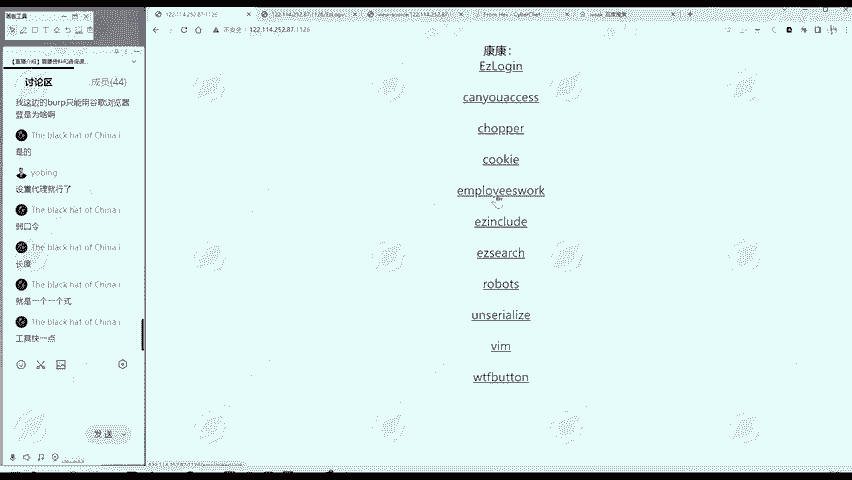

我们拿到这个铁。怎么做？同样的也是我们信息搜集。

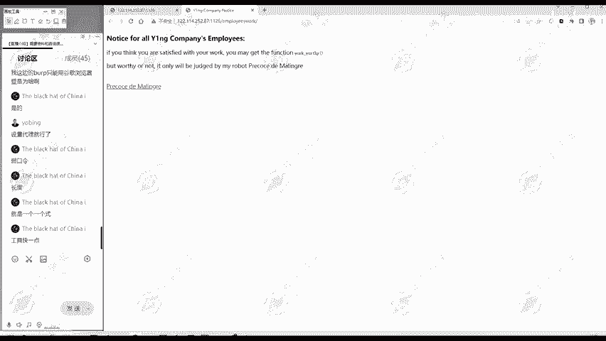

找数找我们需要的信息，根据需要的信息呢判断下一步做什么。EMPOEES。Employyees work这个题呢。

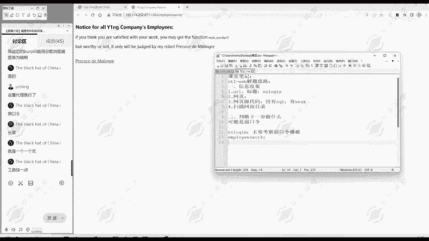

哎，这个是empyee work，然后呢，标题呢YENGcomp notice。然后网页部分有什么呢？这一段英文。哎注意到这里面是不是？跟其他不一样啊，这不一样的地方我们就要注意一下。

这好像是个函数是吧？work worthyy一个括号，这是不是像一个函数啊？😊，然后呢，这里面有一个好像链接一样的东西，我们点一下。

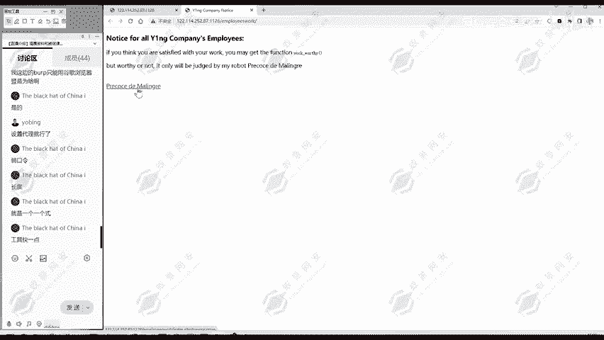

那么点这个链接呢，发现显示出来一段代码。

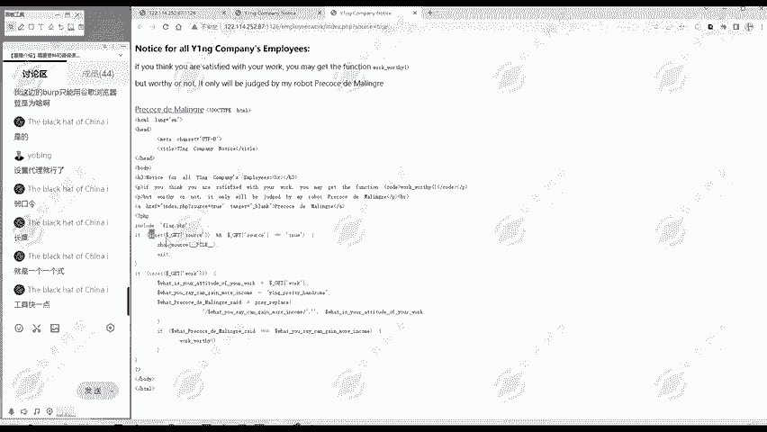

那么这段代码呢可能对我们非常有用。

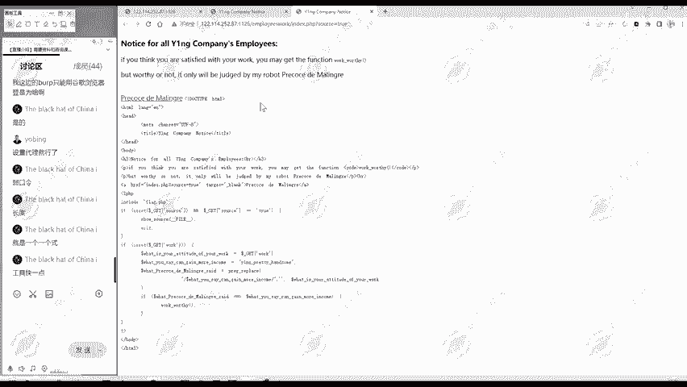

🎼但我们先不看这个代码，我们先看一下网页源代码。

有没有什么额外的发现？😊，文员代码的时候，重点看两部分，第一部分就是注释。像我们刚才那道题注释信息。😊。

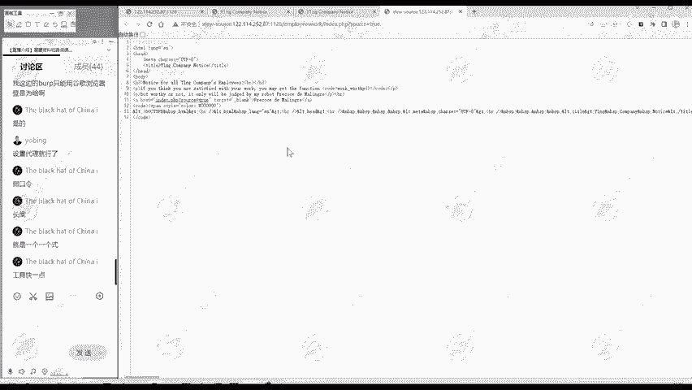

第二部分呢是看有没有一些代码的情况。那这里呢也没写什么代码。

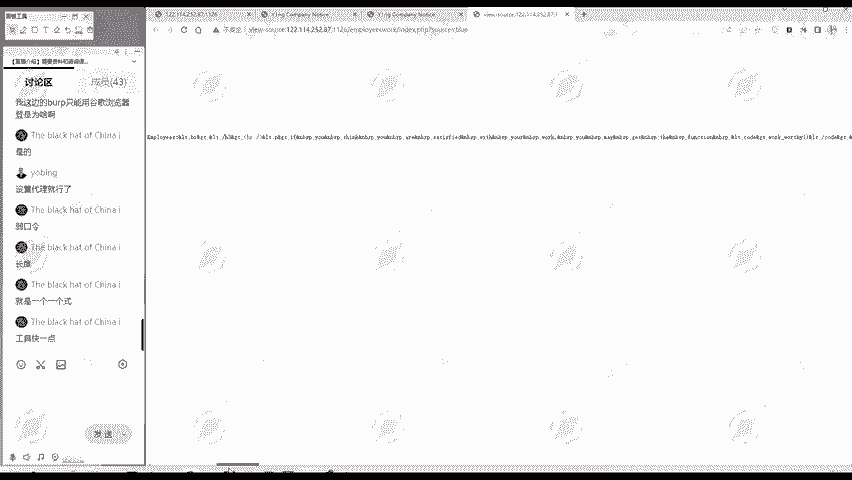

那么现在通过我们刚才的分析呢。刚才信息搜集。继续。发现。一段。PHP。代码。那我们现在呢。是不是就自然想到根据我们前面这个URL啊，这标题啊，网页啊网页代码部分好像没什么别的有价值的。

就是这个代码这一部分。😊。

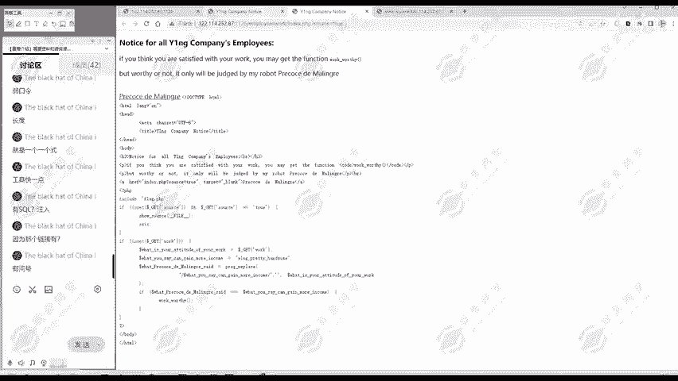

那我们下面是不是就应该要分析这个代码，这个代码不可能是我们下一步工作，我们解题的一个重点。

然后呢，我们看一下这代码是什么意思。那么之前呢。😊，这个链接它是不一样的字体啊，所以说我们可以点击一下试试嘛。😊，进行一个尝试，这有可能是解题的关键，但也有可能不是都有可能。在我们题目做出之前呢。

什么都有可能。😊。

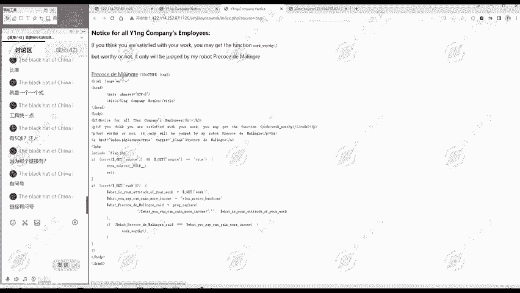

那么这里是一段PHP的代码。那有的同学说啊，我之前没学过PHP也没关系。这里我们就一起来看一下。第一部分啊第一行就是PHP的标签，这里呢是结束的标签。那它们俩之间的呢就是代码部分。我们看代码部分是什么？

include flagag点PHP哎，看到flag大家就注意，因为我们CTF就是要获得flag嘛。😊，include就包含包含了flag点PHP。这个是我们需要注意的那就跟flag相关了。

那下面呢是一个判断。就是是否传递用各的方法传递source这个参数。如果传递了呢，变source等于true，我们现在就传递了，是不是？我们点击这个链接就是source等于true。

那么呢就修 source。😊，就显示文件源代码显示哪个文件，源代码刚刚fi就显示本文件。😊，刚刚这个fi就是本文件的意思。所以说这里的我们当前这个文件的源代码就显示出来了，然后进行退出了。😊。

所以现在就我们看到这个界面啊显示源代码，但是没有别的动作。那么下面部分呢。😊，是什么呢？这部分代码哎，看我们有没有传递work这个参数。这里呢传不传就work是我们用户所控制的，我们用户控制的地方。

就是我们可以操作的地方，这部分呢就要注意。如果说传件work这个参数进行什么操作，首先呢把它的值付给。啊，你的工作态度这个比较长，就用这个工作态度来描述了。然后呢，你的收入是等于这么多。

然后下面一行是进行什么进行个p replace，就是进行一个替换。就是。😊，在我们传递过来的工作态度里面，寻找有没有工作收入，有没有这个词。如果有的话，就把它替换为空。所以第一个参数。是要查找的字符串。

第二个参数呢是替换后替换成什么？第三个呢是被查找的字符串。😊，然后把替换后的结果复制给这个sad。最后来看set是不是等于。这个收入呢就等于这个字符串，如果等于话，就调用workworth这个函数。

谁是不是跟刚才关联起来了？😊，这个时候我们就要就会想。我就要传递一个get参数，使这个workworth呢能够得到调用。怎么传递这个work参数呢？我们可以右键点击检查。

然后呢使用hiickb这个工具进行一个传输。

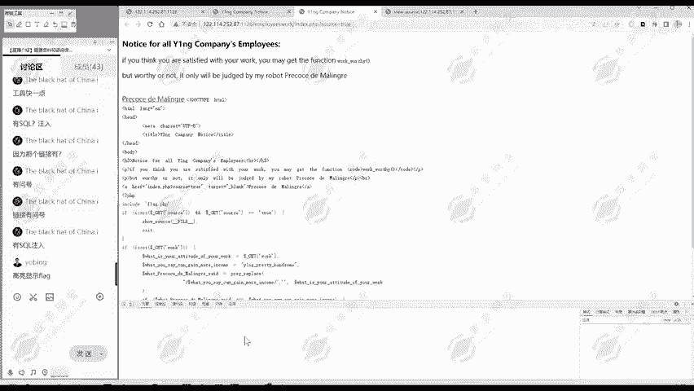

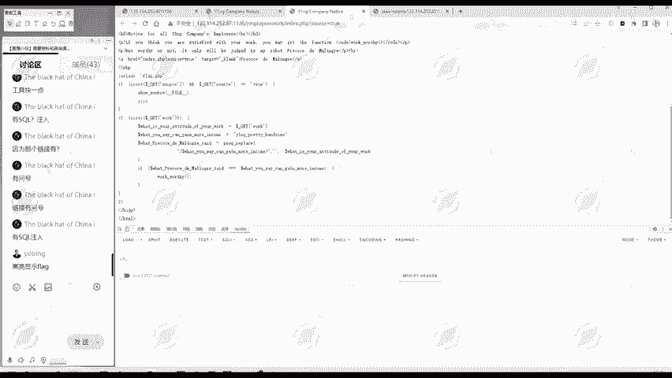

怎么用黑八这工具？我们首先n把这个URL导入进来，然后呢我们自己进行一个编辑。😊。

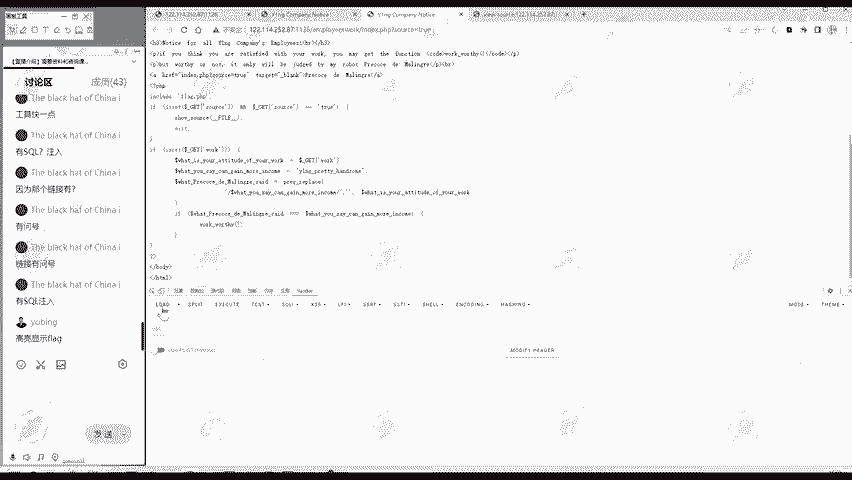

这里sourcece等于t就进入到这里啊，显示源代码，然后退出了。所以说我们要把它删除，不让它退出，让它执行后面的代码，是不是？😊，我们传递的参数名称呢是work，所以说这里输入work。

等于多少就是参数的值。比如我随便输入一个work，等于123进行一个尝试。那么点击这个就是执行，就相当于把我们的请求发送过去。

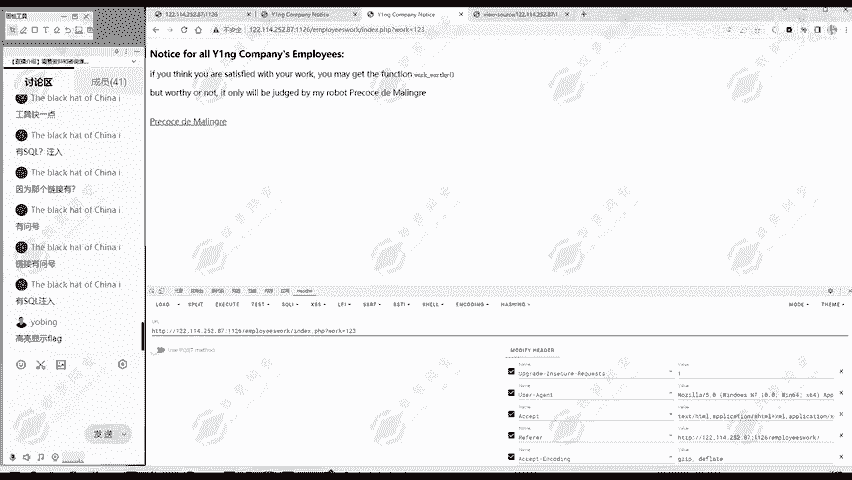

那现在呢哎没有什么。没出现flag之类的是吧？😊，又回到我们最开始访问的界面了。😊。

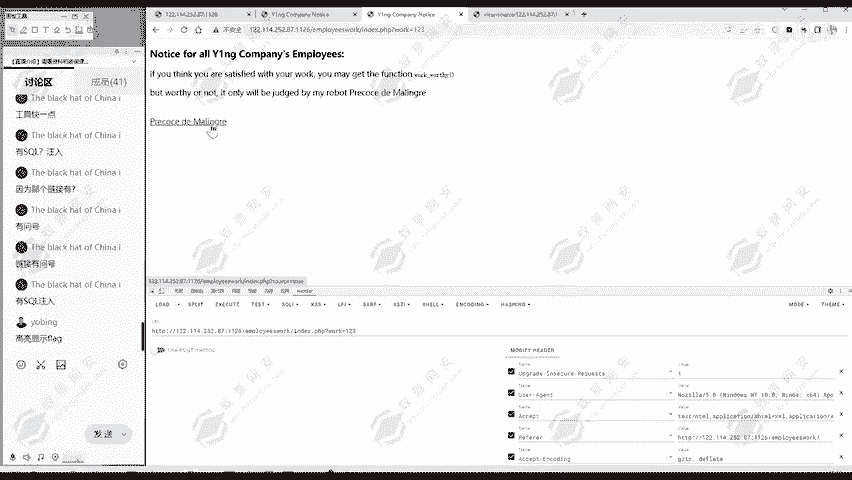

那我们再看一下委员代码。

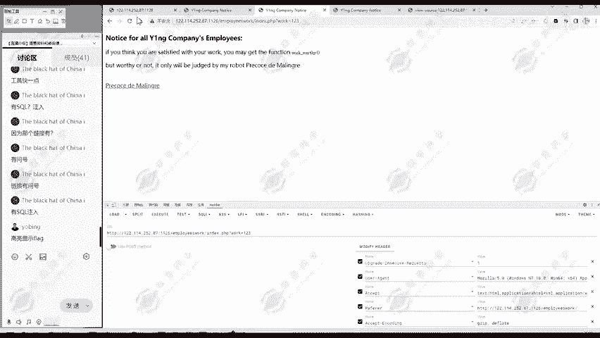

推后一下也行。说明我们传递的123呢不符合这里的判定。这时候呢就要仔细的分析一下阶段代码，就这个判定它到底是判定了什么？😊，它实际上是不是就检查我们传入的代码中有没有这样一段字符串啊。

如果有的话就替换为空。这个没什么，他判定是吗？😡，判定你把这个YNGpre含怎替换为空之后呢？还要等于这个pretty handsome。是吧。就一个变量，比如变量A把变量A替换为空。

替换为空之后还要等于变量A，这个能做到吗？有没有这样一个字符转，把这一部分替换之后，剩下的部分呢还等于他自己。😊，还得这一部分。这里呢？我们通过啊总结一下做题思路，发现这样的PC代码。通过查看。

分析吧分析。这段。代码。发现。关键。在于。通过。判断。执行。Work。worthory就是函数。那么判断呢就是要替换掉这个为空之后，还等于它。这里面呢就是怎么样实现达到这样一个目的，有没有方法有方法的。

这里面之前没听说过的同学啊，没有学过这个知识的同学，可能一下子就很难想到。这里呢就告诉大家。😊，有一种方法叫做双斜绕过。这个双斜绕过在很多地方都用得到，不仅在我们这个铁。在我们刚。刚才给大家列举知识点。

什么文件上传哪，文件包含啊，ciirl注入啊，都会用到双写绕过这个思想，它是什么意思呢？😊，大家看我现在是这样一个字符串是吧？我在在它里面某个位置，随便一个位置啊，我再把它复制一遍。😊。

然后你再把这一部分替换为空。之后呢，是不是又等于他自己的？这就双写，我把你把它所要替换为空的一个字符串，你写两次。因为替换为空了，所以说你把中间这部分相当于删除了，又恢复成原来的字符串。😊，这就。

所以说这就是这个名词，就方管来立马双写就写两次。这我们唐论讯同学学了，就给两个。那么我们这个则bl hat of channel。问就按和问号。我想应该是问怎么传参吧，前面的呢是URL。怎么传参呢？

用get方传呢，你就输入一个问号，后面就参数，问号后面呢是参数名等于等于多少？是参数值。这里是传递一个参数。如果说你想传递两个参数，就是and第二个参数名。第第二个参数值，然后再按的第三个参数名。

第三个参数值就是这样。因为我们这里只传递一个参数，所以说就不需要用到按的符号了。😊，这里呢正好给大家讲一下我们传餐的方法。那现在我们就知道了，其是要进行一个双写绕廓，把它复制一次，哎，再中间再复制一次。

我们进行一个。😊。

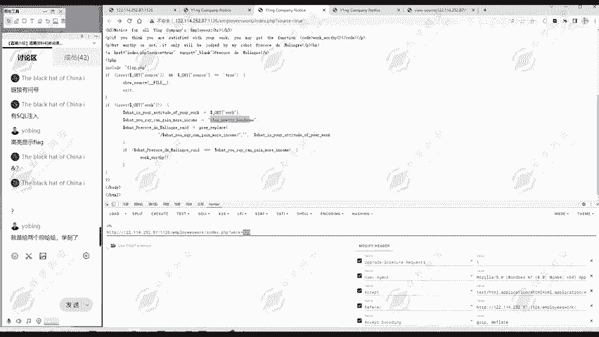

发送请求。那么现在呢就执行了workworth。那么flag呢就显示出来了。所以这个题呢就考察大家，就是对这个PHP代码。😊，这个PPT代码啊不是那种特别复杂的，因为行数不是很多嘛。😊。

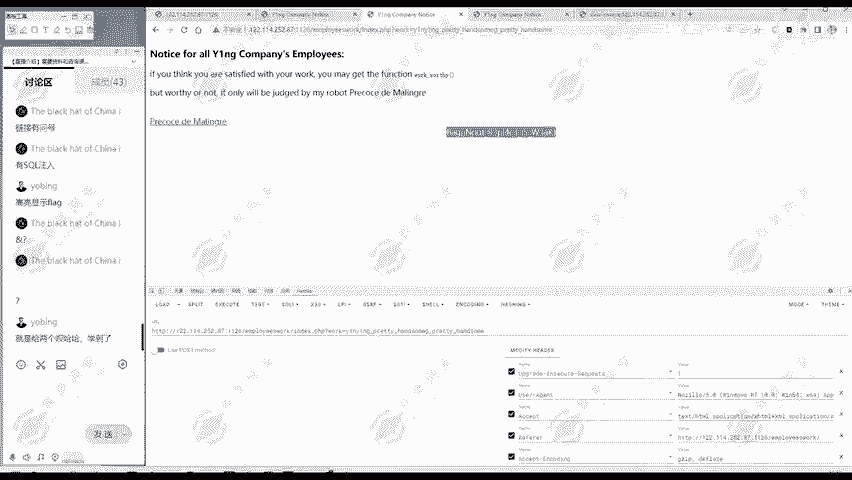

对一个代码有一个理解。然后呢，知道这个双写绕过这个方法，其实你知道就是很简单。得有思路是啊，所以说我们课前从一开始。就是给大家强调这个思路嘛，不是说直接告诉大家怎么做，直接把这个。😊，答案告诉大家。

这样你学到的东西就很少。其实重点想跟大家讲的就是这个思路，你是怎么样。😊，拿到这个题目，一步步找到。下一步怎么做？然后呢，最终答案是什么？😊，这个整体思路是不变的，你要先进行信息搜集。

通过信息搜集呢判断下一步该做什么。😊，那么根据信息搜集的结果，每每个题他下一步要做什么都不一样。那这道题要做出来，还要懂这个双斜绕过。这个你之前没听过呢，可能就很难知道。但你听过一次应该就能知道了。

就知道这种思路了。下次呢就可以尝试这种思路，主要是把它本身替换为空的。😊，就可能存在这种双斜绕过的情况。PHP大小写能不能绕过呢？他这是检检测这个字符串。不是检测那PCP的大小写。你你把它改成大小写了。

它就不等于原来自己了。😊，那没听懂的同学可以发一下去，哪里没听懂。这样我才能够给你直接的解答嘛。其他同学欢迎提问。我们看这个。

黑b这个工具如它可以装载我们的谷歌浏览器啊、火狐浏览器啊、爱G浏览器都是可以的。怎么换替替换为空。😊，这就是prag replace这个函数的作用。那这个函数呢？你看这个名字。

后面的replace就大概知道它是替换嘛。它的作用就是在后面这个字符串里面，比如说我们现在传递的是这样一个字符串，后面部分就等于这个。😊，寻找有没有前面这个字符上。

前面这个字上得于多少YNGpretty handsome。😊，大家一寻找发现中间部分是有的。找到了就在中间这部分，找到之后替换为它的第二个参数，这里呢是空，两个单印哈是空的意思。😊，就把这部分替换为空。

替换为空呢之后得到什么就得到了Y音Gpretty handsome。然后呢，这里判定的就是成立的。😊，然后就执行workworthy函数就得到flag。其他同学有没听懂的，欢迎继续提问。😊，懂了就好。

其实我们学习啊就是要多提问。你多提问你学到的知识，把自己疑惑解决了。你的时间花的就有价值了。