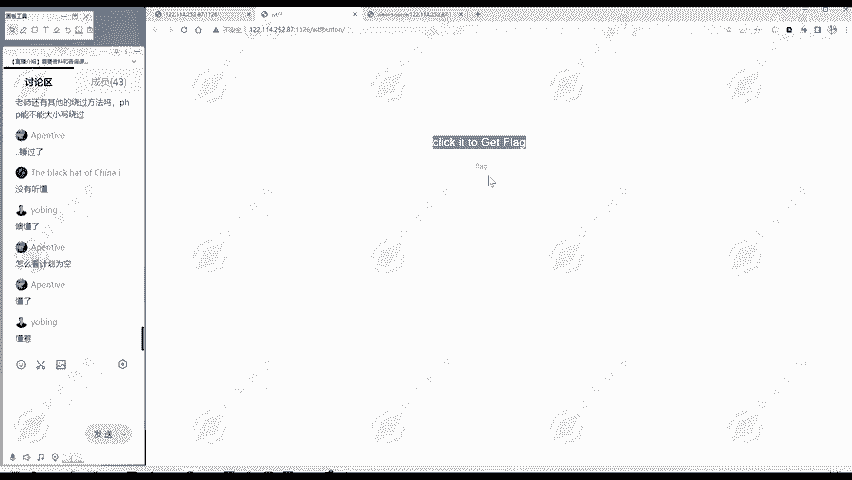
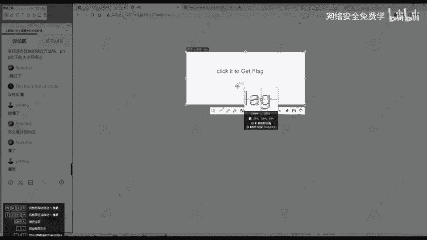
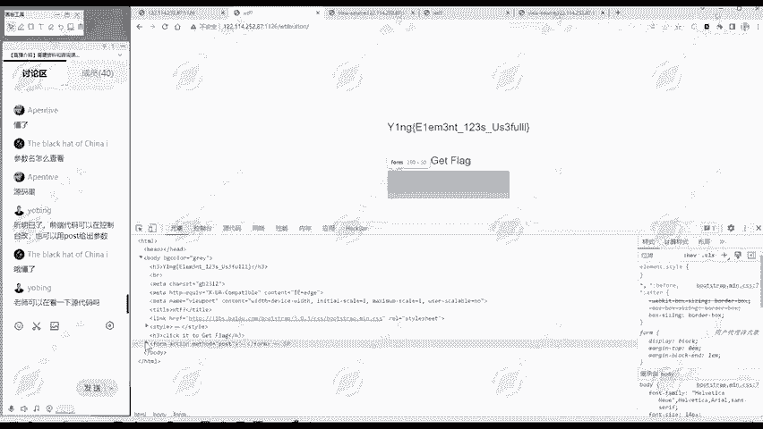

# 2024B站最值得看的黑客教程 ｜ 网络安全／渗透测试／内网渗透／漏洞挖掘／web安全／kali linux／红队靶场／CTF／信息安全 - P154：真题讲解—wtfbutton - 网络安全免费学 - BV1uBsTetEow

这个基本上也是按给大家按照从易到难的顺序啊，所以后面题目呢可能会复杂点。我们看。这个题。首先呢第一步也是信息收集，这是WTFBUUTOTTONWTFbutton。这个标题呢是WTF问号。然后看网页部分。

哎，网页部分有个很明显的flag的痕迹，flag的信息是吧？😊，点击获得flag点击。但点击好像没有获得flag。在这里点击文字这个框边上点击都没有获得flag。那我们继续往后看。

看一下网页源代码中有没有什么有价值的信息。😊，我们看一下，重点看一下，我们点击获续flag这一部分。这一部分呢。就是一点点前端的知识啊，它就是要post。一些。使用pos方法，pos什么。

valueue等于 flagag name等于w。那么从这个信息搜集来看，我就要进行点击，是不是才能获取flag。那我怎么点击呢？现在点击无效。面临的问题我们现在面临的问题点击无效。

这时候呢就要重点分析我们这一块。

就是重点分析这一块。

因很明显这个框就是给我们来点击的嘛。那我们看源代码部分呢，这个框啊是写的是什么呢？是input disabledable class，然后style type value name。

我们看一下这个单词的意思就知道。这类型啊，这个class name啊，风格啊，style。type这些。应该不是阻挡，我们点击的，不让我们点击的应该是这个disable是吧？第四一步的就是不能嘛。

所以说我们点击不了。那怎样改掉这个呢？我们可以点击右键进入检查。检查这里呢有看页面元素，我们找到这个元素所在的位置。在这元素怎么快速找到它呢？因为这个展开这里比较简单，代码不多，你可以很快找到它。

如果说这个元素比较多的话，我们可以点击这里有个箭头。😊，然后呢，点一下你想想要定位的位置，他就帮你定位到了。那么就是这里。这里有个DC波的，把它放大放大点。在这里有个Dcable。

然后把这个Dcable进行一个删除。删除之后，大家看这里就变了是吧？鼠标放在这里就变了。😊，那现在再点击呢，哎，就获取了flag。那么这个第三题呢。你要会这个前端的一些代码。

你简单的看懂这个元素是什么意思。也知道王源那么这里呢有个GC部的，他很烦人，我们就常把它删掉。😊，在元素这里呢就可以把它删掉，删掉之后就可以进行点击。😊，这样点击之后呢就获得flag，就跟这里说的一样。

点击了就得到flag，点击一下就行。😊，这里呢其实是第一种方法。还有一种方法是什么呢？我们看这个input这个点这个框，我们点击一下这个框它是发生了什么。它实际上是po的数据，方法是post嘛。

post什么数据呢？valueue是flagname是worth。😊，它就po了一个参数，参数名呢是was参数的值是flag。这就是我们点击的效果。那既然这样把这你看懂了之后呢，我们可以自己po吗？

我们使用黑霸也可以进行pos的。这里呢点击IPo。因为我们刚才已经点击，我们重新打开打开这道题。我们进入检查，然后pos黑板，然后。把这个URI导入进来，选择这post。🎼我们可以自己填入po的数据。

参与数名呢是was，值呢是flag。尽管这里不能点击，我直接给它post这个数据。😊，也是起到点击的效果。如果你点击一下，就是把这个数据发送过去。然我直接发送过去也可以，这样也看到了flag。

这两种方式都可以起到发送数据，获取flag的这样一个目的。这个题大家听明白了吗？欢迎大家继续提问。大家可以思考一下，有哪你不太懂的都可以提出来。😊，那么apentive同学啊懂了，挺好。

那么学到东西就好，参数名是怎么查看的？我们访问这道题。是不信息搜集里面第三步，我们看一下刚才的课程笔记啊，信息搜集里面第三步是不是查看网页人代码？😊，王源代码，那自然重点关注的就是。

点击获取flag部分。点击获取flag部分呢，这里呢我们要看懂这是什么意思，这是个提form，就是提交表单。😊，在提交表单里面。就告诉我们action就你把表单提交到哪里。😡，是空了就提交到本文件。

方法是用get方法提交还是用pos方法提交，这里是用pos的方法。😊，然后提交的内容是什么呢？就是valueue，就是你提交的值name呢，就是你提交的参数名。😊，所以说我们这里呢提提交的是oss。

这是名等于flag，这是值。代码可以在控制台改。是的。在控制台你改了，把diable的删除了，你点击实际上跟我们这里pos的发送数据是起得同样的效果。😊，这里呢是可以看源的嘛，但是这里呢是不能改的。

你要在控制台里面才能改。😊，你看这里我点击删除。删除不了，你输入也输入不了，这里只能看源代码。嗯。改呢就是进入到检查里面元素。然后呢，我们使用这个箭头，那定位到我们想改的位置。

在这里呢可以进行一个修改。