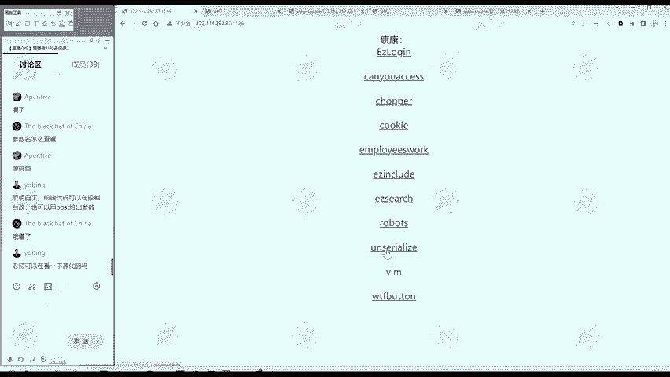
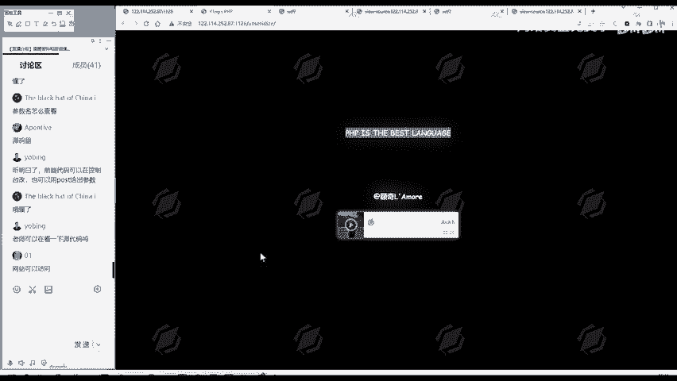
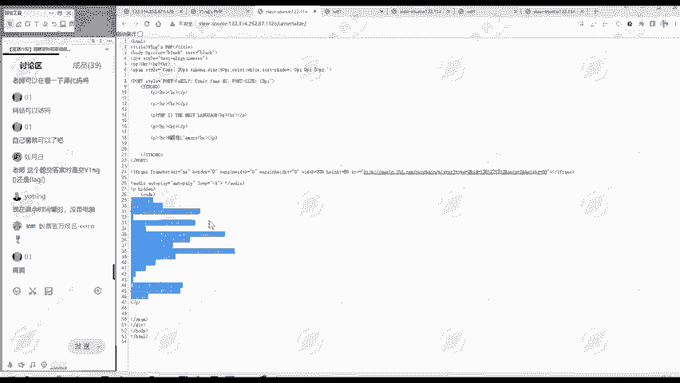
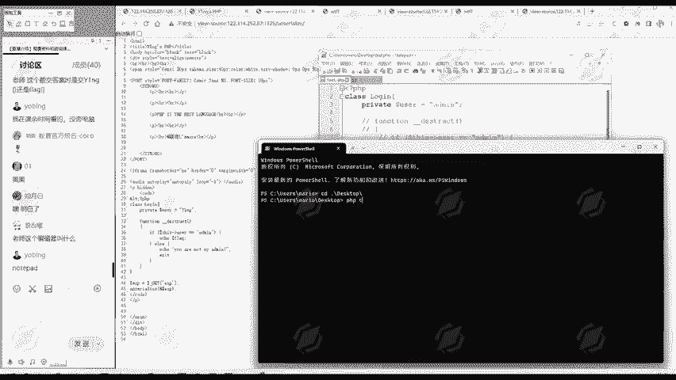
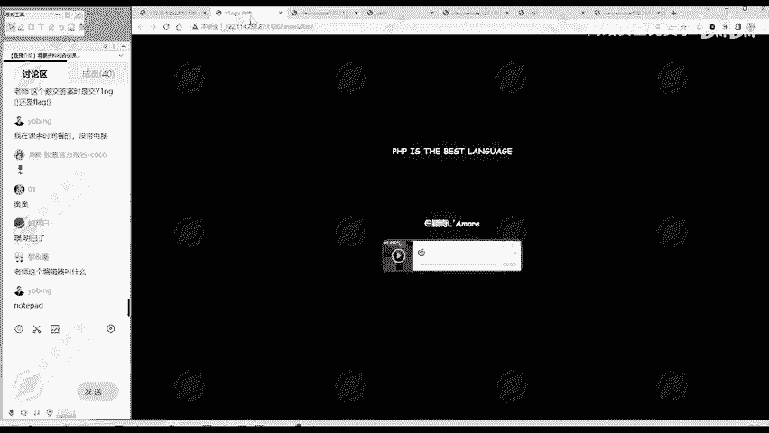
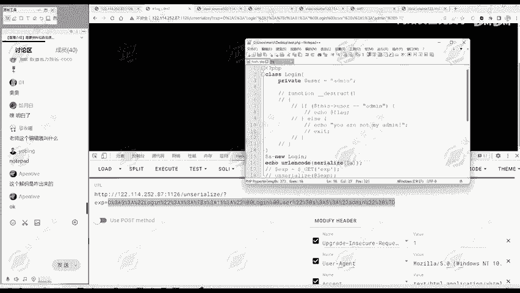

# 2024B站最值得看的黑客教程 ｜ 网络安全／渗透测试／内网渗透／漏洞挖掘／web安全／kali linux／红队靶场／CTF／信息安全 - P155：真题讲解—unserialize - 网络安全免费学 - BV1uBsTetEow

第四个题呢是一个反系列化的题目。😊，啊，我们先进行一个信息搜集。那么标UIL当中呢就有个unererizeunerialize呢就是反序列化，是我们十大考点里面的一个。反序拟化。

它的英文就是unserize。那么title呢这个标题Y音GsPHP。然后呢，网页部分呢PHP是最好的语言，然后这里段音乐。

然后呢，我们再看一下我源代码。这网页代码中有没有注释的信息呢？没看到没发现注释的信息，有没有代码呢？😊，有这里就是代码。那有的同学说，哎，刚才不是说这个。记在下面。兼括号。PHP这是PHP开始的标志吗？

但这里我们好像没有。那么这里呢我们把这个代码贴复制出来。这个按LT分号，它就是减括号的意思。只不过他是HT美奥的实体。所以说这一段呢实际上是P区I代码。那我们同学提问网站可以访我们这个靶场是可以访问的。

大家课后呢也可以进行练习二题提交的flag是YENG还还是flag，就是这个flag的格式是有多种的。就看每就是每个比赛啊，它也可能不一样，它有的是就一般是一个前缀，加上个大括号里面有啊一段字符。

然后大括号说一般是这种格式，它可能是flag什么什么，也可能是什么WCTF。😊，什么就你一段字符，也可能这种形式，这种或者说你前面的什么CTFR都有可能。😊，就每个比赛不一样。

因为这题目是来自于不同的比赛嘛。😊，所以说它的格式是不统一的。但是你参加某一个比赛，在这个比赛里面呢，flag的格式是统一的。😊，这个没关系啊，你你找到了flag自然能够发现的，很明显就能够感受到。

这就是flag。😊，我们主要讲这个知识。那现在发现了这段代码，我们就要重点分析这段代码。我们代码呢已经复制到本地了。😊。

借到代码啦系。做什么呢？首先定一个类。然后呢，使用EXB这个参数传get方法传递一个值。传这个值之后呢，进行一个反序列化。😊，所以这个题呢就比较明显它是一个反序列化的题目。😊。

反系列化题目呢反系列化no洞一叫对象注入嘛，所以说是跟对象有关的。我们看一下这个对象，对象就内的实体，内的实力，这对象是干什么呢？😊，class login这个对象名，它有第一个属性user。

还有一个方法，杠杠destruct这个方法做什么呢？方法实际上就是函数，只不过它是内里面的函数，所以叫方法。这个方法什么？就判断它的这次就他自己的意思。user这个属性。

它的这个值呢是不是等于ald me。如果等于的话，就输出flag。哎，这是我们想要的。😊，如果说不等于，那么他会。输出你不是我的aldmi，然后退出。所以说我们现在的目的呢就是要使这个user等于。

呃德明。那他现在默认是等于YNG，它不等于U的命怎么办呢？😊，这里给大家讲一下我们如何做反序列化的题目。当然我之前有一个训练营，是我们三课时的时间，是专门讲反序化的。大家想要更深入的学习。

可以看那个训练营。😊，也是找我们科文老师领取我们之前训练营的想，那三课时讲的非常详细。😊，这里呢只能给大家简单的提一下。这样题问怎么做呢？我们首先第一步呢就复制源代码到本地，那我们已经复制好了。

第二步呢就是删除和属性无关的内容，或者注释掉也可以。这里就是注视点，人们大家可以看。这是和属性无关的这是定义的方法也是和属性无关的。我们进行注释掉。这个大括号不能注射。这是嗯我们这个内的结束。然后呢。

我们按照需要，这个第三步，按照需要更改属性的值。比如说把珍妮改下我的命。😊，然后第四步呢，生成序列化数据。我们可以先拧一个多ner。A等于6。形成这个logo in的一个。对象。

然后呢我们把s nice哆来A把这个对象呢变成序拟化数据。然后呢进行一个输出。但是有的时候甚至序列号数据会有一些特殊字符。所以说我们输出之前呢进行1个URL编码。这个编辑器是note pad。

然后我们保存保存之后呢。在我们的。本地因为我之前就已经配置了PHP解示器啊，所以说。能够直接进行执行，我们进入到这个桌面。然后呢，执行一下我们这个。PHP testest点PHP这个文件。

执行之后呢，就得到URL编码后的序息化数据。然后呢，我们把这个数据发送过去就可以了。

怎么发送？注意到我们刚才看到源代码部分是什么？用EXP来传递参数是吧？所以说是问号EXP等于我们生成的序化数据。因为我们这URL编码服务器收到这UR编码之后呢，会自动进行解码。

解码之后相当于得到了seererize。多来A是吧，然后你再行行行反。序列化unserize这就相当于抵消了嘛，就等于哆啦A。😊，然后多少A的al的 means是等于什么？

user是等于al的 mean的，所以说它会输出flag，我们执行一下。那么这样呢就输出了f。这是我们。反序拟化的一道题。这个钱。当之前没理解没学过反学化的同学可能就是。不不太理解。

因为反系域话呢属于我们这个知识板块里面。嗯，最难的一个章节之一吧。所以说如果想学的更加深入，真正学懂的话，还是找我们QQ老师要一下我之前讲的一个训练仪，那是三课时的。专门讲反学话。

用三个课时专门讲反学话，讲的非常清楚这个解码是怎么出来的。😊，你说这段编码吗？这是我们执行的结果。我们执行输出URL in。incode，然后序拟化数据得到的结果。那么服务器呢收到这个传递的参数之后。

他发现这是URL编码，它会自动进行URL解码。解码之后相当于就是s nice多段A，是不是？😊，然后呢，你再进行个反序化操作。那就得到多，那多or A的 ofus呢是等al，所以它会输出flag。

