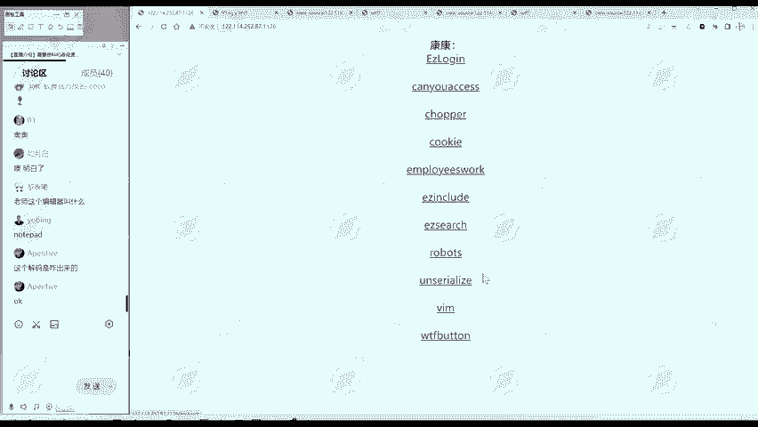
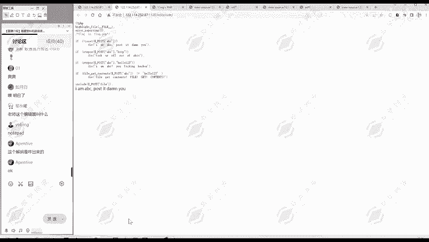
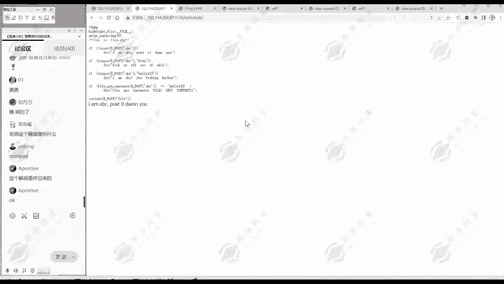
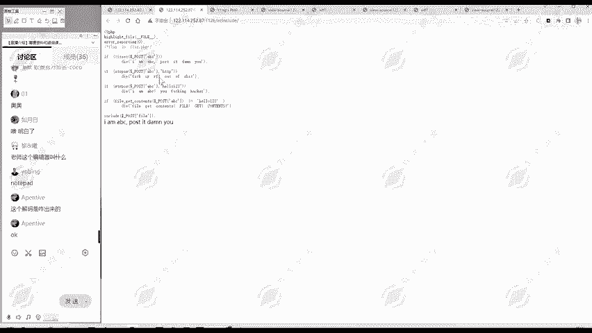

# 2024B站最值得看的黑客教程 ｜ 网络安全／渗透测试／内网渗透／漏洞挖掘／web安全／kali linux／红队靶场／CTF／信息安全 - P156：真题讲解—ezinclude - 网络安全免费学 - BV1uBsTetEow

那么我们还有个。第五个题呢就是一个easy include。这个题呢啊也是一个看代码的内容。那么这个题是很明显给我们提示了flag在flag点PP当中，这是一个文件包含的题目。

所以说我们现在就要获取flag点PHP的内容。那么它最后呢有个include，我们传过去的file。这个参数。只要说明它前面有4个判定，只要我们能通过这四个判定。那么后面我们传过fi等于什么。

它就包含什么文件，那就很简单了。第四个判定怎么通过的？要用到文件包含的知识。这这大家可以思考一下有没有什么思路。😊。

这是我们的最后一题啊。Ey include。

那我们一起看一下这个代码。首先第一关是什么，有没有传递ABC这个参数，如果没有的话，就输出IMABC啊，这一段是吧，然后程序退出，那么们现在没有传递参数。所以说程序就退出了。如果说这议满足呢。

就进入第二关。他看我们传递ABC参数的值里面。str pause pause就是positionition就位置。有没有HTTP这个字符？如果说能找到HTTP的位置。那么也就退出。

说明我们传递字符串中不能含有HTTP。那么第三问是什么？我们传递的这个ABC参数的值。哎，他有没有hello123？如果说有hello123呢，也是退出，那也不能有hello123。那第四关是什么呢？

fi get contents就是你看这个函数的，基本上你看到的这个英文的意思，你知道它干什么？就是获取文件内容嘛，文件获取啊内容。获写这个文件的内容。就你这里面给一个文件名或文件路径。

它就获取这个文件的内容。这个文件的内容呢，如果说不等于hello123，那就要退出。说明要获取一个文件内容，它必须要等于hello123。那么你只要通过这四关呢。那么你后面再传递第二个参数fi。

它就包含这个fi，这就很简单了。关键是前面前面这三关好像哎很容易。关键是这第四关我怎么样。使他打开一个文件，这个文件的内容呢要等于hello123。那佛像有哪些文件，它这个文件是什么内容，我是不知道的。

怎样实现这个效果呢？😊，这里面啊叫。就不能够需要真的直接去打开一个文件，这肯定是不存在这样的文件的。就要用到我们的daate协议。data协议呢它是一个数据流。

就是你fge content data协议的内容和打开一个文件效果是一样的。这里呢为了过滤，就对内容进行一个base news编码。那这段内容解码之后呢，就是hello123。所以把这段内容传过去。

它就会得到hello123就会满足我们四关的内容。然后呢，你再传第二个参数fi等于什么？你直接flag点PCP呢这时涉及到我们文件包含的一些知识。它会执行flag点PHP，但是不会显示源代码。

你为了显示源代码，就要用这个f协议。所以说把这两个参数进行post的传递，就能够获取flag。那么这个题呢有一定的难度，这个就留给大家进行一个练习。

