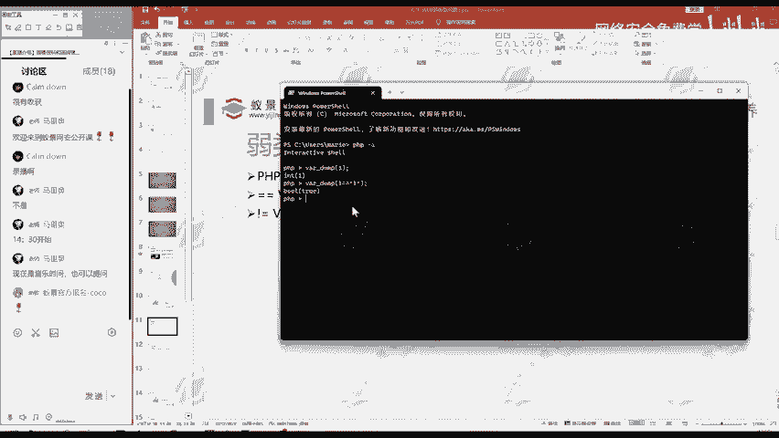
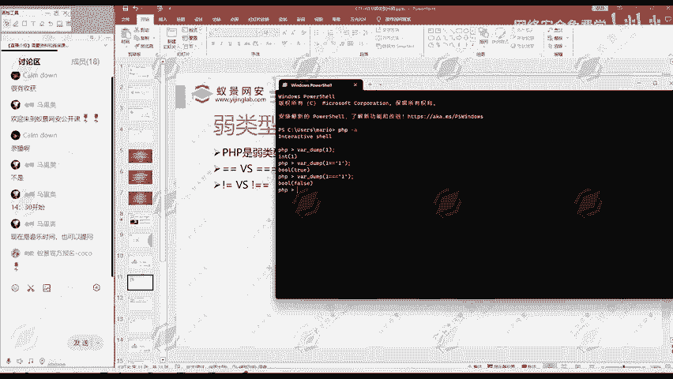

# 2024B站最值得看的黑客教程 ｜ 网络安全／渗透测试／内网渗透／漏洞挖掘／web安全／kali linux／红队靶场／CTF／信息安全 - P157：弱类型 - 网络安全免费学 - BV1uBsTetEow

那么什么是弱类型呢？好，首先跟大家说的是PP是弱类型语言。那么什么是弱类性医院？那么什么不是弱内型业，他们的区别是什么？我们这里啊给大家记一个课堂笔记。放大一点。记于课堂笔记。

什么是啊弱类型语言和强类型语言，与弱类型语言相对应的就强类型语言。比如说。强类型的语言。我们在大学里面大一学的C语言。他就是强的信约。它的特点是什么呢？就是大家发现没？我们在学C语言的时候。

比如说我们要。啊，创建一个变量int I等于1。那么我们必须在变量前面声明它的类型，这就是强类型源。就是我们在定义一个变量的时候，就必须声明它的类型，你是个inter型还是恰尔性等等。

那么与弱类型语言相对强类型语言相对应的呢，相反的就是弱类型。一。比如说我们的PHP或者说我们的。Pthon。其实都是这样，他都是一个弱类型医人。我们PHP你直接就是多了I等于1。

是吧它不需要指定我这个多了I的I这个变量，它是一个什么类型，它是一个整形字符型、浮点型等等，不需要指定它，它叫弱类型语言。那我们PHP呢就是弱类型语言。那么弱类型语言呢。

像PC这种弱类型语言有一个什么问题呢？就是一个强相等和弱相等。那我们在开大码的时候，有的时候会遇到两个变量是否相等，是用了两个等号，有的时候是用了三个等号，它们是否一样呢？这里可以给大家演示一下。

我们打开终端，然后呢进入到1个PHP的。一个执行环境。我们使用va dump。玩dump呢就是输出一个变量，它的。类型以及值。那我们挖d一呢，就告诉我们，一是一个inter类型，然后呢它的值是一。

那么现在有个问题，这个一。这个数字和这个一这个字符它们相不相等呢？我们这里做一个测试，发现呢它们是相等的，这是一等于这个字符一，它的结果呢是一个布尔星，然后值呢是处就是为真，说明他们俩是相等的。

但是大家看到明显我这一个一是数字，第二个一呢是字符，它们怎么会相等呢？因为这里的比较就是两个等号，就是一个弱向等。若相等，大家简单理解就为。

差不多他们俩长得差不多相等就可以了。那和两个等号不同的就有三个等号的比较。

大家可以看到三个等号比较的时候。是不是结果就是false。三个等号就是强相等。强相等强相的意思就是两者如果要相等的话，就是他们俩一模一样，没有任何的区别。他是一种严格向。这是由于两个等号。

三个等号这种强相等和弱相等的区别。那么在有的时候呢，就可以造成一些漏洞。然后呢就能被我们利用。那么在CTF比赛中呢，就会有一些专门的题目来考察你会不会利用这种logo。

你会不会识别出来这种强相等和弱相等不同导致的安全问题。这就是我们的弱类型问题。那有相等的强相等和弱相等。那不相等呢也有个强不相等和弱不相等。感叹号加等号就是一个弱比较。

感叹号加两个等号呢就是强比较和上面的两个等号，三个等号，它们是相对应的关系。那么之前如果接触过这种啊弱类型这概念的同学，可能这里还比较好理解。如没有接触过的同学。这你听懂了吗？如果说没有听懂。

欢迎你发在讨论区。😊，大家发在讨论区的问题啊，我都会第一时间给大家回复，确保大家听懂。这里是给大家举的一个例子。那么现在知道了什么是弱类型语言，什么是强相等弱相等。

