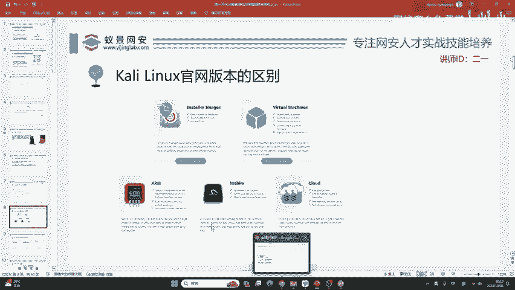
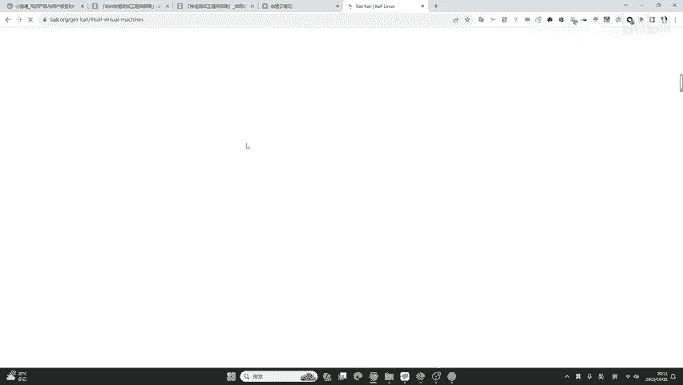
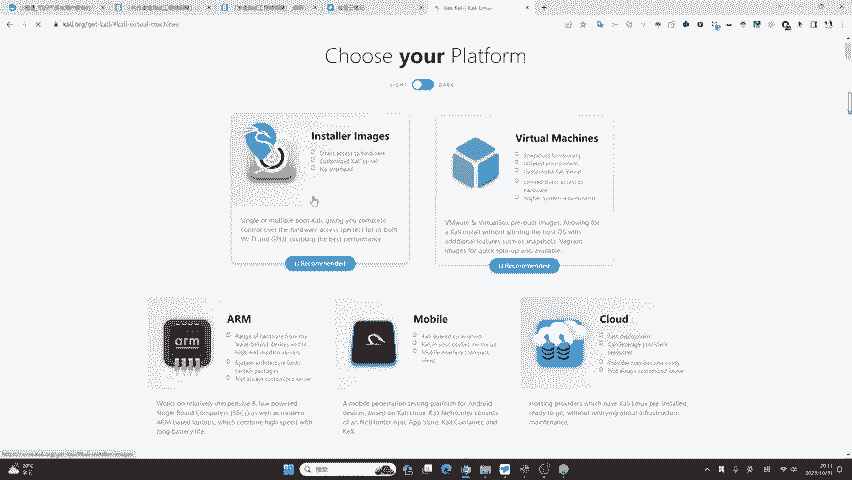
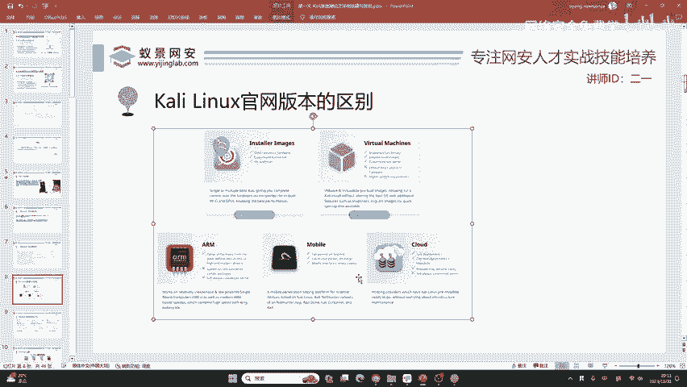
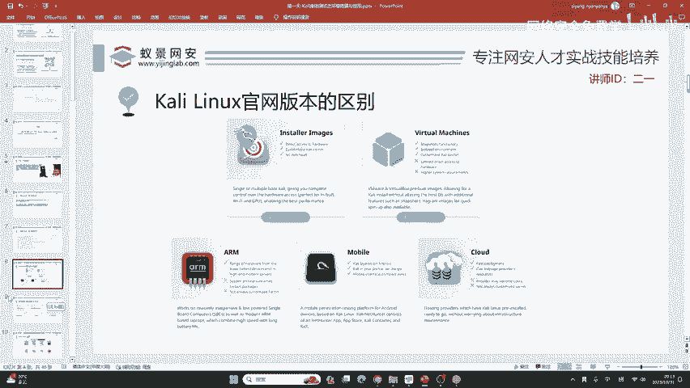

# 2024B站最值得看的黑客教程 ｜ 网络安全／渗透测试／内网渗透／漏洞挖掘／web安全／kali linux／红队靶场／CTF／信息安全 - P15：“脚本小子”到渗透大神 - 网络安全免费学 - BV1uBsTetEow

那卡利琳内克斯其实如果你只去学习它就会出现一个问题啊。就是如果你仅仅只会卡里，那与现阶段的安全企业招聘需求的差距是甚远的。所以说呢咱们的一个课程，在帮助大家掌握卡里的基础上会更上一层楼。

达到拓展与举一反三的效果。这才是我们讲课的重点。如果你想学习卡里网上的教程实在是太多了。在34年前，二语老师也有录制一些卡里的视频，在B站上你可以轻松的搜到。我不会再做过多的讲解，因为他真的太基础了。

而且说实话还是那句话没有特别大的用处。那我们掌握它呢，首先就是其中自带的环境，能够避免很多网络安全入门者踩坑，也能够帮助我们掌握基础的linux操作系统。那我这里啊并不是凭空去说的。

我在上课之前从boss直聘中启明星辰这个公司啊是上市企业在北京。它的一个渗透测试岗位需求啊，这个岗位在北京的月经是20K。我们来看一下，他对渗透测试工程师有哪些要求，我们从11点的技术要求中啊。

都完全看到他压根就没有提到卡里这四个字母，但是卡里有没有用呢？我们从中也可以发现啊，里面有非常多卡里所涉及到的工具。哎，我们来给大家讲一下。

比如说像卡里中自带的BP像卡里中自带的nmap super mapap以及我们第三天所要讲的matpro，还有co呢就是基于 meta去改编的这些都是在卡里中自带的。所以说呢我们很需要学习卡里。

但是只学习卡里是远远不够。😊。

的你可以清楚的看到啊，这是我在上课之前几分钟结局下来的这样一个。😊，网站就是启明星辰，现在还在招聘。对，只是练手。那其次呢就是我们需要对linux操作系统啊能够熟练使用。

那卡里呢就是能够帮助我们学会使用linux系统，搭建各种常见的应用环境。其次呢就是我们需要写这个编程语言。比如说像这些大厂20K以上的工资，它需要你会其中一种语言。

比如说像go浪格PHPonPERL等编程语言。这些编程语言哈，它可能环境配置起来非常复杂。卡里中都已经帮你配置好了，你直接去用就行。所以说呢能够帮助我们更快的入门网络安全。😊，其他的你可以再来看。

比如说像内网渗透、预渗透和后渗透能力，这一点卡里就不再有了。好，包括呢有一定的逆向分析能力，这一点卡里也是不存在的。所以说呢我们要把卡利掌握之后，做一个全方位的拓展。

才能够满足这样一个2万块钱月薪的工作。那这个东西肯定不是一蹴而就的，我们要把它分解开来来逐一学习。😊，首先呢这个卡里的安装包我已经上传到了咱们的工具库里面，大家可以自己下载。如果你有科学上网环境的话。

也可以直接从咖里的官网去下载。如果你的上网环境比较差，那这个你就不需要下载了。因为啊它下载的还没有这个百度云盘快，没有必要多此一举，直接从百度云盘中下载就行。

那在卡里的官网中啊，他给出非常多的版本，这里啊叫做plantform。这时候就来为大家解答一个问题，就是说在群里啊，在我们的交流群里，有同学提到这样一个问题。就是说我有必要把卡里安装到自己的物理机。

或者是把卡里去安装到自己的手机上面来实现一些无线攻击吗？答案啊是否定的。首先我在上课之前给大家讲过，卡里啊他没有特别大的用处。

你去做你的物理机，它首先它不能兼容常见的，比如说像QQ微信、钉钉、企业、微信等APP，它会对你正常的工作产生严重的影响。双系统的话，你不如虚拟机来的快一些。因为虚拟机发展到今天。

它是几乎不会出现性能折损的。其次就是手机手机就会出现这样一个瓶颈，就是咱们国内的硬件啊，咱们国内的硬件它是不支持卡里安装的。除非呢有两种手机。

第一个呢是卡里官方推荐的一加手机one plus以及呢谷歌的官方手机google的pixel。如果你没有这两类的手机，你就不要再去想在手机上安装卡里了，它是非常麻烦，非常费劲。

而且你可能会导致你的手机变成板砖。😊，其他的我们就不需要在意了。那关键我们要区分两个，就是说一个叫inster image啊，这个同学我看到在互动区提到了小米手机是不是也行。在以前哈小米手机是可以的。

但是现在小米手机啊它越来越转向于闭源的操作系统，包括呢从米UR自己的更新，包括前几天的小米发布会，他发布了这个澎湃OS，那这些新的小米。😊，这些新的小米啊，它是没有办法安装卡里的。没有办法安装卡里的。

如果是老版本的，比如说像小米三那个年代是可以进行刷机，那当然可以安装咱们的卡里。是是可以的，用笔记本可以，等一下会给你讲啊。

我们今天的课程就有一点就是要让你把这个虚拟环境去达到一个呃这个婉转自如啊婉转自如。😊，下面我们来看你这个性能不够呀，它当然可以，但是性能不够。嗯，包括一些测试机、骁龙的测试机都可以装。

但它可能驱动不太兼容，对手机也很麻烦。

